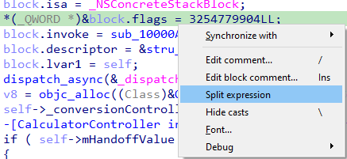

在使用反编译器时，你可能在右键菜单中见过一个叫 `Split expression` 的选项。 它的作用是什么？在哪些场景下有用？下面通过两个例子来说明。

### 结构体字段初始化

现代编译器会进行许多优化以加快代码执行，其中之一就是将两个或多个相邻的内存写入或读取合并为一次更宽的操作。 这经常出现在对结构体相邻字段赋值时。

例如，在反编译一个 macOS 程序时，使用 [Objective-C 插件](https://hex-rays.com/products/ida/support/idadoc/1687.shtml)分析函数中的支持代码，可能会看到类似这样的伪代码：

```c
block.isa = _NSConcreteStackBlock;
*(_QWORD *)&block.flags = 3254779904LL;
block.invoke = sub_10000A159;
block.descriptor = &stru_10001E0E8;
block.lvar1 = self;
```

这里的 [block](https://developer.apple.com/library/archive/documentation/Cocoa/Conceptual/ProgrammingWithObjectiveC/WorkingwithBlocks/WorkingwithBlocks.html) 结构体由插件生成，定义如下：

```c
struct Block_layout_10000A088 {
    void *isa;
    int32_t flags;
    int32_t reserved;
    void (__cdecl *invoke)(Block_layout_10000A088 *block);
    Block_descriptor_1 *descriptor;
    _QWORD lvar1;
};
```

可以看到，编译器选择用一次 64 位写操作同时初始化两个 32 位字段 `flags` 和 `reserved`。 虽然技术上正确，但伪代码看起来比较难懂。

此时，可以右键该赋值语句，选择 `Split expression`。 刷新伪代码后，会显示为两个独立的赋值：



Once the pseudocode is refreshed, two separate assignments are displayed:  
刷新伪代码后，就会显示两个独立的赋值：

```c
block.isa = _NSConcreteStackBlock;
block.flags = 0xC2000000;
block.reserved = 0;
block.invoke = sub_10000A159;
block.descriptor = &stru_10001E0E8;
block.lvar1 = self;
```

这样更清晰，flags 的值还可以进一步转为十六进制或枚举标志。 

如果需要，还可以继续拆分（例如一个值初始化 3 个或更多字段的情况）。 若想恢复原状，可以在右键菜单中选择 `Unsplit expression`。

### 32 位程序中的 64 位变量

在 32 位寄存器的处理器上操作 64 位值时，编译器必须分成两个 32 位部分来处理。 如果直接翻译，代码会非常冗长，因此反编译器会检测常见模式（如 64 位运算、比较、数据操作），并自动生成由两个 32 位寄存器或内存位置组成的 64 位变量。

大多数情况下这种启发式方法效果很好，但有时会出现误判： 实际上是两个独立的 32 位变量，却被错误地合并成一个 64 位变量。

在这种情况下，可以对涉及该变量的 64 位操作使用 `Split expression`，将其拆分为两个独立变量，从而恢复正确的语义。

参考: [Hex-Rays interactive operation: Split/unsplit expression](https://hex-rays.com/products/decompiler/manual/cmd_split.shtml)

原文地址：https://hex-rays.com/blog/igors-tip-of-the-week-69-split-expression
