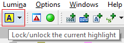
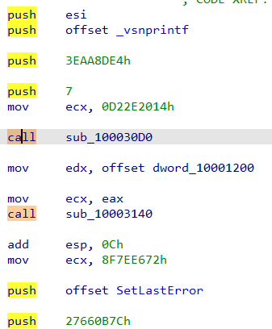
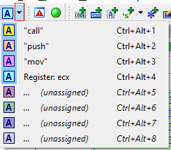
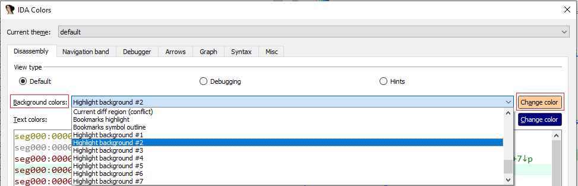
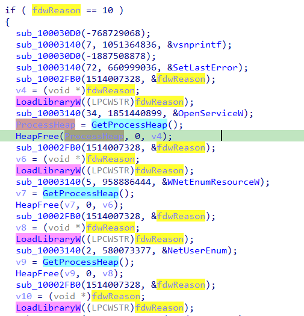

上周的文章因为 IDA 7.7 的发布而被推迟，所以这次我就借机来“高亮”一下其中一个新功能。

在之前的 IDA 版本中，我们已经有了高亮功能，并且可以选择锁定，使其在浏览数据库时保持固定。 在 IDA 7.7 中，这个功能得到了改进 —— 现在你可以同时拥有多个高亮！

### 设置高亮

基本用法保持不变：

- 选中你想高亮的字符串（点击单词、拖动鼠标，或使用 `Shift+方向键`）；
- 然后点击工具栏上的 `Lock`/`unlock current highlight` 按钮（初始显示为黄色背景上的字母 `A`）。

乍一看效果似乎相同：当前高亮被锁定，并在浏览时保持。 但如果你点击另一个单词，会发现动态高亮现在使用了另一种颜色，并且锁定按钮的颜色也发生了变化。

此时如果再次点击按钮，第二个高亮会被锁定，而动态高亮会切换到下一个颜色。 你可以一直这样操作，直到达到上限（目前是 8 个颜色槽）。

### 移除高亮

移除已锁定的高亮非常简单：

- 点击列表中已高亮的项目；
- 再点击工具栏按钮即可解锁。

另一种方式是使用按钮旁边的下拉菜单：

- 你可以看到当前分配的所有高亮；
- 选择对应条目即可清除某个特定高亮。

### 修改高亮颜色

高亮颜色（和大多数其他颜色一样）可以在 `Options > Colors…` 对话框中修改。

- 在 `Background colors` 下拉菜单中选择一个 `Highlight background` 条目；
- 点击 `Change color` 设置新颜色。

### 快捷键

在下拉菜单的截图中可以看到，每个高亮颜色都有对应的快捷键：

- `Ctrl+Alt+数字` (1–8) 可以直接设置或清除对应的高亮。

### 其他视图

多重高亮功能不仅适用于反汇编视图，还可以在 IDA 的其他基于文本的视图中使用：

- Structures
- Enums
- Pseudocode
- Hex View

虽然在某些视图中可能更有用，在另一些视图中作用较小，但无论如何，这个小功能都能在工作中帮上忙。

原文地址：https://hex-rays.com/blog/igors-tip-of-the-week-70-multiple-highlights-in-ida-7-7
