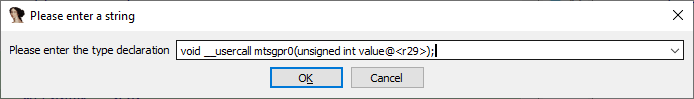
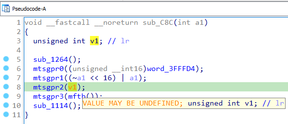
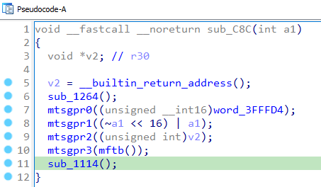

虽然 Hex-Rays decompiler 最初是为处理编译器生成的代码而编写的，但它在处理手写汇编时也能表现得不错。 不过，这类代码可能会使用非标准指令，或者以非标准方式使用标准指令，这时反编译器可能无法生成等效的 C 代码，只能退回到 `_asm` 语句。

### 分析系统代码

例如，来看一段来自 PowerPC 固件的函数：

```
ROM:00000C8C sub_C8C:                                # CODE XREF: ROM:00000B1C↑p
ROM:00000C8C                                         # sub_CF0+44↓p ...
ROM:00000C8C
ROM:00000C8C .set back_chain, -0x18
ROM:00000C8C .set var_C, -0xC
ROM:00000C8C .set sender_lr,  4
ROM:00000C8C
ROM:00000C8C     stwu      r1, back_chain(r1)
ROM:00000C90     mflr      r0
ROM:00000C94     stmw      r29, 0x18+var_C(r1)
ROM:00000C98     stw       r0, 0x18+sender_lr(r1)
ROM:00000C9C     addi      r31, r3, 0
ROM:00000CA0     mflr      r3
ROM:00000CA4     addi      r30, r3, 0
ROM:00000CA8     bl        sub_1264
ROM:00000CAC     lis       r29, 0x40 # '@'
ROM:00000CB0     lhz       r29, -0x2C(r29)
ROM:00000CB4     mtsprg0   r29
ROM:00000CB8     not       r11, r31
ROM:00000CBC     slwi      r11, r11, 16
ROM:00000CC0     or        r31, r11, r31
ROM:00000CC4     mtsprg1   r31
ROM:00000CC8     mtsprg2   r30
ROM:00000CCC     mftb      r3
ROM:00000CD0     addi      r30, r3, 0
ROM:00000CD4     mtsprg3   r30
ROM:00000CD8     bl        sub_1114
ROM:00000CD8 # End of function sub_C8C
```

这段代码似乎在使用 `Special Purpose Register General` (`sprg0`/1/2/3) 来存储一些异常处理相关的信息。 由于这些系统指令通常不会出现在用户态代码中，反编译器默认并不支持，因此输出结果中会包含 `_asm` 语句。

默认反编译结果：

```c
void __fastcall __noreturn sub_C8C(int a1)
{
  int v1; // lr

  _R30 = v1;
  sub_1264();
  _R29 = (unsigned __int16)word_3FFFD4;
  __asm { mtsprg0   r29 }
  _R31 = (~a1 << 16) | a1;
  __asm
  {
    mtsprg1   r31
    mtsprg2   r30
    mftb      r3
  }
  _R30 = _R3;
  __asm { mtsprg3   r30 }
  sub_1114();
}
```

虽然指令以 `_asm` 形式显示，但反编译器仍然检测到了相关寄存器，并生成了伪变量 `_R29`、`_R30`、`_R31` 来表示操作。

### Decompile as call

我们可以告诉反编译器，将特定指令当作函数调用来处理。 甚至可以使用 自定义调用约定（`__usercall`） 来精确指定输入/输出寄存器。

操作步骤：

- 在反汇编视图中，将光标放在指令上（例如 `mtsprg0 r29`）；
- 执行 `Edit > Other > Decompile as call…`；

  

- 输入函数原型，考虑输入/输出寄存器。
  ```
  void __usercall mtsgpr0(unsigned int value<r29>);
  void __usercall mtsgpr1(unsigned int<r31>);
  void __usercall mtsgpr2(unsigned int<r30>);
  void __usercall mtsgpr3(unsigned int<r30>);
  int __usercall mftb<r3>();
  ```

刷新伪代码后，结果会变得更清晰：

```c
void __fastcall __noreturn sub_C8C(int a1)
{
  unsigned int v1; // lr

  sub_1264();
  mtsgpr0((unsigned __int16)word_3FFFD4);
  mtsgpr1((~a1 &lt;&lt; 16) | a1);
  mtsgpr2(v1);
  mtsgpr3(mftb());
  sub_1114();
}
```

这样就没有 `_asm` 块了。

唯一剩下的问题是变量 `v1` 被标记为“可能未定义”。



查看汇编可知，`r30` 的值来自 `mflr r3`，该指令读取 `lr` (link register)，即调用者的返回地址，本质上没有确定值。我们可以使用一个伪函数来表示，例如 GCC 的 `__builtin_return_address`：

```c
void * __builtin_return_address();
```

注意：这里不需要 `__usercall`，因为在 PPC ABI 中，`r3` 已经是默认的返回值寄存器。

最终，反编译结果就会非常整洁。



### 更复杂的情况

如果想自动化应用这些原型，可以使用反编译器插件或脚本。 例如，IDA 附带的 [vds8](https://github.com/idapython/src/blob/master/examples/hexrays/vds8.py) decompiler SDK sample 就能处理 ARM 代码中的部分 `SVC` 调用。

在更复杂的情况下（例如参数无法通过自定义调用约定表示，或者语义更适合用非函数调用的方式表达），可以使用 `microcode filter` 来生成自定义微码，再由反编译器优化并转换为 C 代码。

一个很好的例子是 Markus Gaasedelen 的 [microAVX 插件](https://github.com/gaasedelen/microavx/)。

参考: [Decompile as call](https://hex-rays.com/products/decompiler/manual/interactive.shtml#08) in the decompiler manual.

原文地址：https://hex-rays.com/blog/igors-tip-of-the-week-71-decompile-as-call
