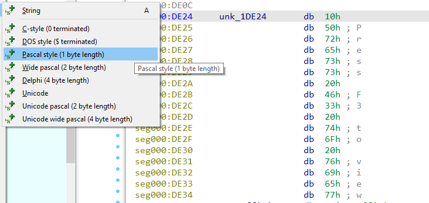
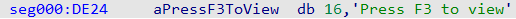
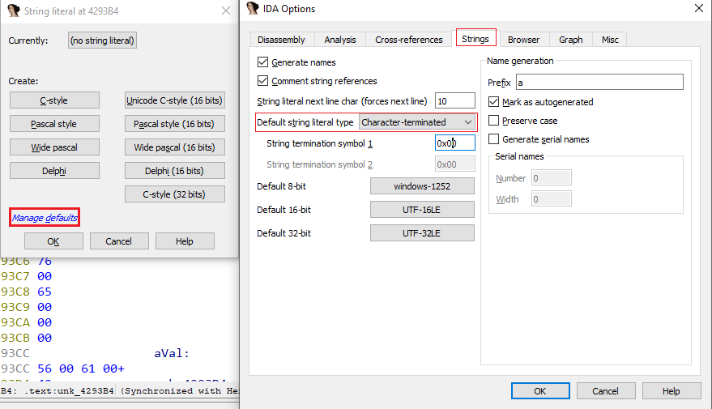
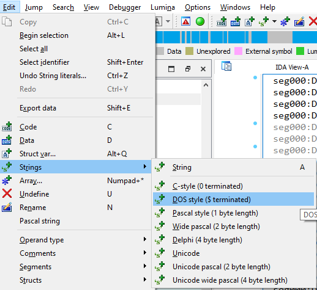

我们之前已经介绍过如何处理字符串常量（也称为 string literals）的基础知识，但 IDA 还支持一些额外的功能，在某些情况下会很有用。

### 奇特的字符串类型

**Pascal 及其衍生语言（如 Delphi）**

有时会使用以长度开头、后跟字符的字符串字面量。 类似于宽字符（Unicode）字符串，这类字符串可以通过 `Options > String literals…` 对话框中的相应按钮，或 `Edit > Strings` 子菜单来创建。

**非 0 终止符的字符串**

某些操作系统或嵌入式固件可能使用 非 0 字节 作为字符串终止符。 在分析这类二进制文件时，可以在 `Options > General… → Strings` 标签页中设置（也可以通过 `Options > String literals… → Manage defaults` 链接进入）。

DOS 类型字符串

作为这种类型的常见变体，DOS 风格的字符串（以 `$` 字符作为终止符）在 `Edit > Strings` 菜单中有单独的入口。

### 修改字符串长度

对于已经创建的字符串字面量，可以使用 `*` 快捷键，像编辑数组一样修改，并通过调整 `Array size` 来改变字符串的长度。

相关内容：

[Unicode strings and custom encodings](https://hex-rays.com/blog/igor-tip-of-the-week-13-string-literals-and-custom-encodings/)

[How to format multiple strings placed together](https://hex-rays.com/blog/igor-tip-of-the-week-10-working-with-arrays/)

原文地址：https://hex-rays.com/blog/igors-tip-of-the-week-72-more-string-literals
