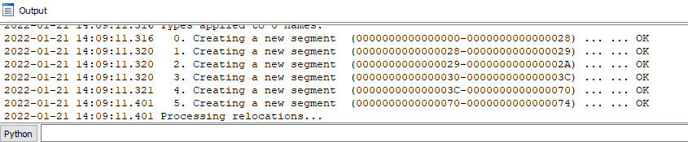
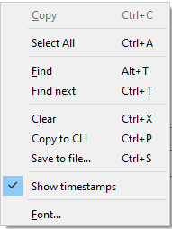
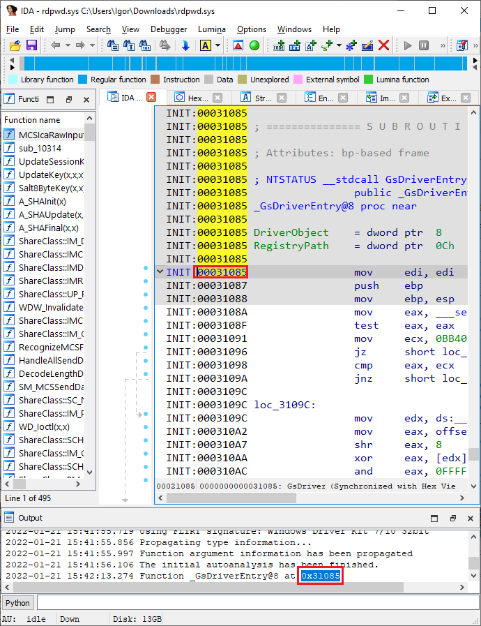

Output window 是 IDA 默认桌面布局的一部分，用于显示来自 IDA 以及第三方组件（插件、处理器模块、脚本等）的各种消息。 它还包含 `Command-line interface` (CLI) 输入框。

### 打开 Output window

虽然默认情况下它是打开的，但用户可能会关闭该窗口，或者使用不包含它的桌面布局。 恢复方法有两种：

- 使用 `Windows > Reset desktop` 将布局恢复到初始状态。
- 使用 `Windows > Output window`（快捷键 `Alt+0`）重新打开并聚焦文本框（例如复制文本）。
- 使用 `Windows > Focus command line`（快捷键 `Ctrl+.`）切换到 `CLI` 输入框，如果窗口已关闭，也会重新打开。

### 上下文菜单

在 `Output window` 的文本框中，可以通过右键菜单执行一些操作，

例如使用 `Alt+T` / `Ctrl+T` 搜索文本（与其他 IDA 窗口一致）。清除当前文本，以便更容易查看即将运行的脚本输出。

### 时间戳

从 IDA 7.7 开始，可以为 `Output window` 中的每条消息启用时间戳。

- 时间戳独立存储，可以随时开启或关闭。
- 对当前会话中的所有消息（过去和未来）生效。

### 导航

在 `Output window` 中双击地址或标识符，会跳转到对应位置（如果存在）——无论是反汇编、伪代码还是 Hex 视图。 这在编写快速脚本时非常有用：只需用 `msg()` 打印感兴趣的地址或名称，然后双击即可在反汇编中查看。

### 日志记录到文件

将 `Output window` 的消息记录到文件在 批处理模式 下尤其有用，也适用于调试脚本或插件。 启用方式有三种：

1. 设置环境变量 `IDALOG` 为文件名。

   - 如果路径不是绝对路径，文件会在当前目录创建。
   - 所有后续运行的 IDA 都会将输出追加到同一个文件。

2. 在命令行参数中使用 `-L<file>`（必须在输入文件名前指定）。

3. 按需保存：通过右键菜单的 `Save to file`（快捷键 `Ctrl+S`）。

⚠️ 注意：

如果在 IDA 中启用了时间戳，它们也会写入日志文件，并在未来的所有会话中保留。
目前无法通过环境变量或命令行开关来控制时间戳的开关。

原文地址：https://hex-rays.com/blog/igors-tip-of-the-week-73-output-window-and-logging
