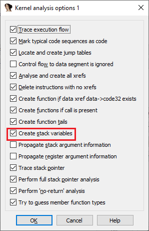
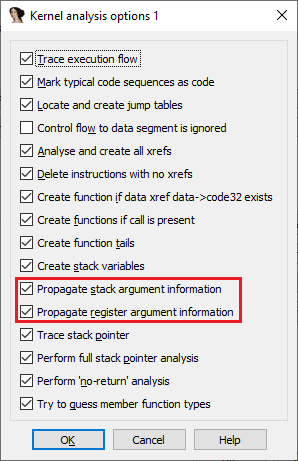

IDA 和其他反汇编程序的许多功能如今已被视为理所当然，但事实并非总是如此。例如，让我们来看看自动变量命名。

### 一点历史

在最初的版本中，IDA 与一个“哑反汇编器”差别不大，只能显示带有数值偏移的原始指令，用户需要手动添加注释来跟踪。 后来增加了 `stack variables` 支持，虽然最初只有占位名（如 `var_4`、`var_C`），但用户可以重命名，逆向过程稍微轻松一些。

接着引入了 FLIRT，能识别标准库函数，用户不再需要分析编译器运行库的样板代码，而是专注于程序员编写的逻辑。识别库函数还帮助变量命名，因为大多数库函数有已知原型，参数变量可以据此重命名。

然而，这个过程仍然是手动的。直到 IDA 4.10 引入 `type system` 和 `standard type libraries`，才实现了自动化：

- 已识别的库函数或导入函数可以与 `type library `中的原型匹配。
- 参数会自动注释和/或重命名。
- 对于复杂类型（如结构体），栈变量也能自动转换为该类型。

### 实际示例

以一个调用 CreateWindowExA 的 Win32 程序为例：

1. 全部功能关闭时:


```
mov     eax, [ebp-20h]
push    dword ptr [ebp+8]
sub     eax, [ebp-28h]
push    dword ptr [ebx+1Ch]
push    eax
mov     eax, [ebp-24h]
sub     eax, [ebp-2Ch]
push    eax
push    dword ptr [ebp-28h]
push    dword ptr [ebp-2Ch]
push    dword ptr [ebp-8]
push    edi
push    offset aEdit    ; "edit"
push    edi
call    ds:CreateWindowExA
```

2. 启用 `stack variables`：



```
mov     eax, [ebp+var_20]
push    [ebp+arg_0]
sub     eax, [ebp+var_28]
push    dword ptr [ebx+1Ch]
push    eax
mov     eax, [ebp+var_24]
sub     eax, [ebp+var_2C]
push    eax
push    [ebp+var_28]
push    [ebp+var_2C]
push    [ebp+var_8]
push    edi
push    offset aEdit    ; "edit"
push    edi
call    ds:CreateWindowExA
```

此时变量仍是占位名，需要手动查阅文档并重命名。

3. 启用参数传播 (argument propagation) 并重新分析：



```
mov     eax, [ebp+Rect.bottom]
push    [ebp+hMenu]     ; hMenu
sub     eax, [ebp+Rect.top]
push    dword ptr [ebx+1Ch] ; hWndParent
push    eax             ; nHeight
mov     eax, [ebp+Rect.right]
sub     eax, [ebp+Rect.left]
push    eax             ; nWidth
push    [ebp+Rect.top]  ; Y
push    [ebp+Rect.left] ; X
push    [ebp+dwStyle]   ; dwStyle
push    edi             ; lpWindowName
push    offset aEdit    ; "edit"
push    edi             ; dwExStyle
call    ds:CreateWindowExA
```

现在所有参数都被自动重命名，初始化它们的指令也带有注释。 `Rect` 变量之所以能被识别为结构体，是因为在同一函数的另一处调用了 `GetClientRect`：

```
lea     eax, [ebp+Rect]
push    eax             ; lpRect
push    ebx             ; hWnd
call    ds:GetClientRect
```

IDA 识别到 `lea` 获取的是结构体地址，因此将栈变量类型设为结构体，而不是单纯的指针。这样在前面的代码片段中，字段引用就能被清晰标注。

### 递归传播

PIT 不仅限于单个函数。如果某个函数的参数因类型信息被重命名或重新定义，这些信息会沿着调用树向上传播。 例如，前面代码中的 `arg_0` 被识别为 `hMenu`，那么调用者也会继承这一信息。


### 总结：

Parameter identification and tracking (PIT) 让 IDA 能够自动识别并传播函数参数的类型和名称，大幅减少手动注释和重命名的工作量。

原文地址：https://hex-rays.com/blog/igors-tip-of-the-week-74-parameter-identification-and-tracking-pit
