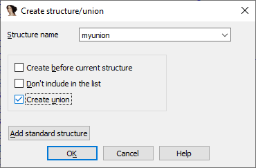
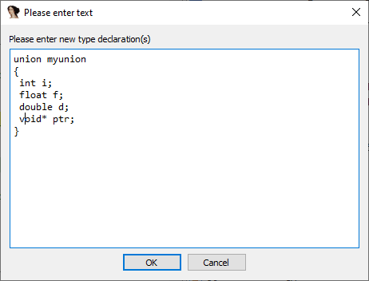
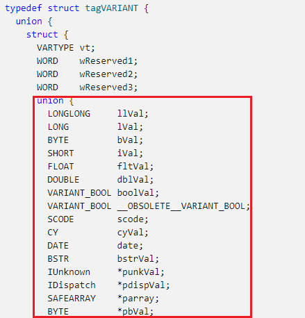
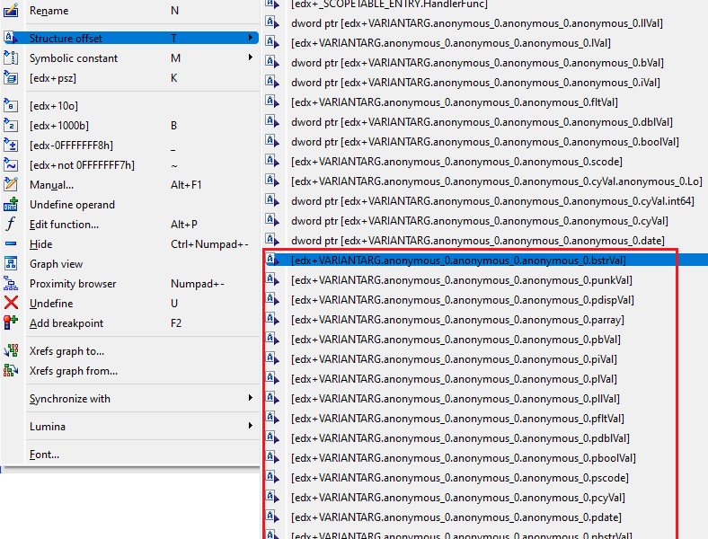
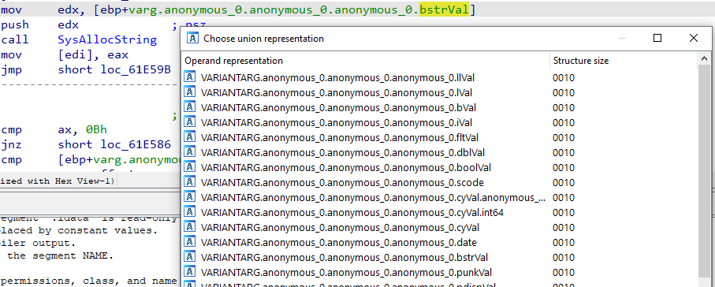
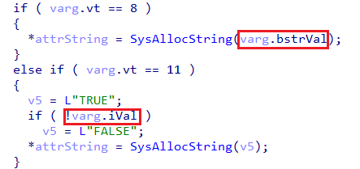
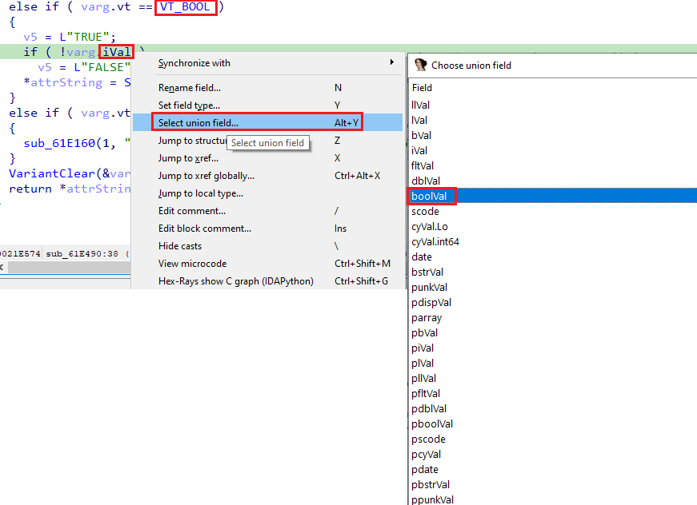

在 C 语言中，`union` 是一种类似于 `struct` 的类型，但它的所有成员（可能是不同类型）共享同一块内存，彼此重叠。 常见用途包括：

- 需要以不同方式解释同一数据
- 在存储不同类型数据时节省内存（脚本引擎中很常见）

IDA 和反编译器完全支持 `union`，并在标准 `type libraries` 中包含了一些常用的定义，因此在分析的二进制文件中可能已经存在。

### 创建 union

在 `Structures window` 中添加新结构时，勾选 `create union` 复选框即可创建汇编级别的 `union`。

也可以在 `Local Types editor` 中使用 C 语法定义 `union`。

### 在反汇编中使用 union

在反汇编中，`union` 的用法与结构体类似。

- 当某个成员以寄存器偏移量的形式被引用时，可以使用右键菜单的 `Structure offset` 子菜单，或直接按 `T` hotkey。
- 不同之处在于：同一偏移量可能对应多个 `union` 成员路径，你可以选择最适合当前上下文的那个。

### 示例：OLE Automation

OLE Automation 是基于 `COM` 的一组 API，常用于在 Microsoft 及其他应用中实现脚本功能。 其中的基本类型之一是 `VARIANT` / `VARIANTARG` 结构，它通过嵌入一个 `union` 来存储不同类型的值。

例如，如果我们有一条指令 `mov eax, [edx+8]` ，并且知道 `edx` 指向一个 `VARIANTARG` 实例，按 `T` 键会显示多个 `union` 字段版本，你可以选择最符合当前代码路径的那个。

### 更改已选的 union 字段

- 如果你（或 IDA）已经选择了某个 `union` 字段，可以再次使用 `T` hotkey 重新选择。
- 如果父结构保持不变，只想更改 `union` 成员，可以使用 `Edit > Structs > Select union member…`（快捷键 `Alt+Y`）。

这在 带有嵌套 `union` 的结构体位于栈上 时尤其有用，因为此时无法使用常规的结构偏移命令（偏移量基于栈或帧指针，而不是结构体起始地址）。

### 在反编译器中使用 union

反编译器可以进行数据流分析，因此在很多情况下能自动选择最合适的 `union` 字段。

例如：当代码调用 `SysAllocString` 时，反编译器会自动选择 `BSTR bstrVal` 字段，因为它知道该函数需要 `const OLECHAR *` 类型的参数。

但在另一个引用中，它可能选择了 `iVal` 字段。虽然在与零比较时兼容，但从代码逻辑来看，这里其实是布尔值（更合理的选择是 `boolVal`，并用符号常量 `VT_BOOL` 替代数字）。此时可以通过右键菜单的 `Select union field…` 或 `Alt+Y` 快捷键手动切换。

更多信息:

[IDA Help: Select union member](https://www.hex-rays.com/products/ida/support/idadoc/498.shtml)  
[Hex-Rays interactive operation: Select union field](https://hex-rays.com/products/decompiler/manual/cmd_select_union_field.shtml)

原文地址：https://hex-rays.com/blog/igors-tip-of-the-week-75-working-with-unions
