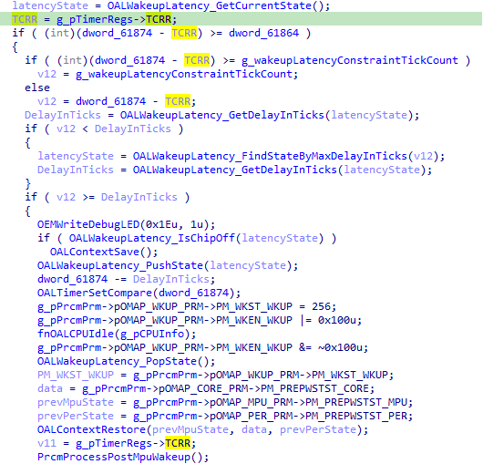
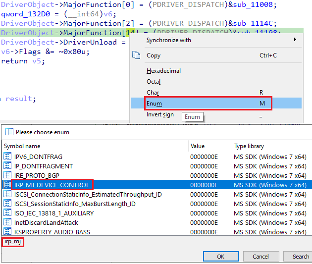
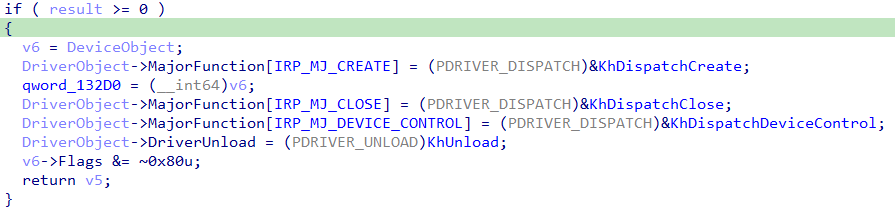
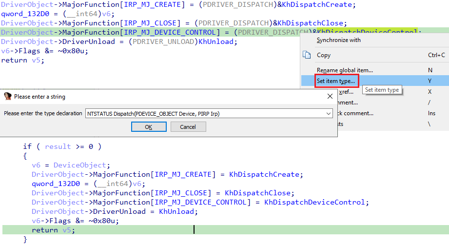
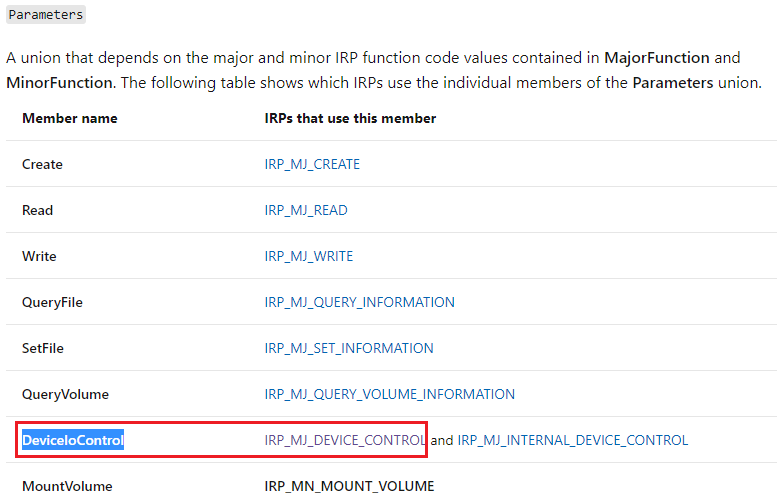
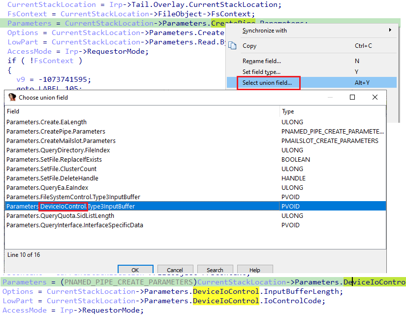
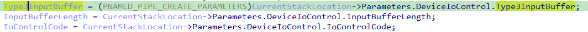
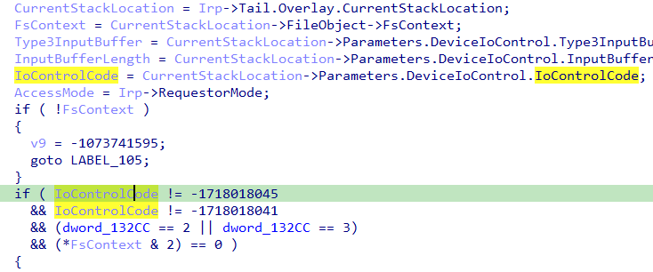

One of the features added in [IDA 7.6](https://hex-rays.com/products/ida/news/7_6/) was automatic renaming of variables in the decompiler.   
IDA 7.6 新增的功能之一是在反编译器中自动重命名变量。



Unlike [PIT](https://hex-rays.com/blog/igors-tip-of-the-week-74-parameter-identification-and-tracking-pit/), it is not limited to stack variables but also handles variables stored in registers and not just calls but also assignments and some other expressions. It also tries to interpret function names which include a verb (get, make, fetch, query etc.) and rename the assigned result accordingly.  
与 PIT 不同的是，它不仅限于堆栈变量，还能处理存储在寄存器中的变量，不仅能处理调用，还能处理赋值和其他一些表达式。它还会尝试解释包含动词（get、make、fetch、query 等）的函数名，并相应地重命名赋值结果。

### Triggering renaming manually  
手动触发重命名

To cover situations where automatic renaming fails or insufficient, the decompiler also supports a manual action called “Quick Rename” with the default hotkey Shift–N. It can be used to propagate names across assignments and other expressions. Usually it only renames dummy variables which were not explicitly named by the user (`v1`, `v2`, etc.). Here is an incomplete list of rules used by the action:  
在自动重命名失败或不足的情况下，反编译器还支持使用默认热键 Shift - N 进行名为 "快速重命名 "的手动操作。 它可用于在赋值和其他表达式中传播名称。通常，它只重命名用户未明确命名的虚拟变量（ `v1` 、 `v2` 等）。以下是该操作所使用规则的不完整列表：

-   by name of the opposite variable in assignments: `v1 = myvar`: rename **v1** -> **myvar1**  
    的名称： `v1 = myvar` : rename v1 -> myvar1
-   by name of the opposite variable in comparisons: `offset < v1`: rename **v1** -> **offset1**  
    在比较中使用相反变量的名称： `offset < v1` : 重命名 v1 -> 偏移量1
-   as pointer to a well-named variable: `v1 = &Value`: rename **v1** -> **p_Value**  
    作为指向名称明确的变量的指针： `v1 = &Value` : rename v1 -> p_Value
-   by structure field in expressions: `v1 = x.Next`: rename **v1** -> **Next**  
    通过表达式中的结构字段： `v1 = x.Next` : 重命名 v1 -> 下一个
-   as pointer to a structure field: `v1 = &x.left`: rename **v1** -> **p_left**  
    作为结构域指针： `v1 = &x.left` : rename v1 -> p_left
-   by name of formal argument in a call: `close(v1)`: rename **v1** -> **fd**  
    通过调用中的形式参数名称： `close(v1)` : rename v1 -> fd
-   by name of a called function: `v1=create_table()`: rename **v1** -> **table**  
    的名称： `v1=create_table()` : rename v1 -> table
-   by return type of called function: `v1 = strchr(s, '1')`: rename **v1** -> **str**  
    按被调用函数的返回类型 `v1 = strchr(s, '1')` : rename v1 -> str
-   by a string constant: `v1 = fopen("/etc/fstab", "r")`: rename **v1** -> **etc_fstab**  
    通过字符串常量： `v1 = fopen("/etc/fstab", "r")` : rename v1 -> etc_fstab
-   by variable type: **error_t v1**: rename **v1** -> **error**  
    按变量类型：error_t v1：重命名 v1 -> error
-   standard name for the result variable: `return v1`: rename **v1** -> **ok** if current function returns bool  
    结果变量的标准名称： `return v1` : 如果当前函数返回 bool，则重命名 v1 -> ok

### Example: Windows driver 示例Windows 驱动程序

We’ll inspect the driver used by [Process Hacker](https://processhacker.sourceforge.io/) to perform actions requiring kernel mode access. On opening `kprocesshacker.sys`, IDA automatically applies well-known function prototype to the `DriverEntry` entrypoint and loads kernel mode type libraries, so the default decompilation is already decent:  
我们将检查 Process Hacker 用来执行需要内核模式访问的操作的驱动程序。在打开 `kprocesshacker.sys` 时，IDA 会自动将众所周知的函数原型应用到 `DriverEntry` 入口点，并加载内核模式类型库，因此默认的反编译已经很不错了：

```
NTSTATUS __stdcall DriverEntry(_DRIVER_OBJECT *DriverObject, PUNICODE_STRING RegistryPath)
{
  NTSTATUS result; // eax
  NTSTATUS v5; // r11d
  PDEVICE_OBJECT v6; // rax
  struct _UNICODE_STRING DestinationString; // [rsp+40h] [rbp-18h] BYREF
  PDEVICE_OBJECT DeviceObject; // [rsp+60h] [rbp+8h] BYREF

  qword_132C0 = (__int64)DriverObject;
  VersionInformation.dwOSVersionInfoSize = 284;
  result = RtlGetVersion(&amp;VersionInformation);
  if ( result &gt;= 0 )
  {
    result = sub_15100(RegistryPath);
    if ( result &gt;= 0 )
    {
      RtlInitUnicodeString(&amp;DestinationString, L"\\Device\\KProcessHacker3");
      result = IoCreateDevice(DriverObject, 0, &amp;DestinationString, 0x<span>22</span>u, 0x100u, 0, &amp;DeviceObject);
      v5 = result;
      if ( result &gt;= 0 )
      {
        v6 = DeviceObject;
        DriverObject-&gt;MajorFunction[0] = (PDRIVER_DISPATCH)&amp;sub_11008;
        qword_132D0 = (__int64)v6;
        DriverObject-&gt;MajorFunction[2] = (PDRIVER_DISPATCH)&amp;sub_1114C;
        DriverObject-&gt;MajorFunction[14] = (PDRIVER_DISPATCH)&amp;sub_11198;
        DriverObject-&gt;DriverUnload = (PDRIVER_UNLOAD)sub_150EC;
        v6-&gt;Flags &amp;= ~0x80u;
        return v5;
      }
    }
  }
  return result;
}
```

However, to make sense of it we need to make some changes.  The indexes into the `MajorFunction` array are so-called [IRP Major Function Codes](https://docs.microsoft.com/en-us/windows-hardware/drivers/kernel/irp-major-function-codes) which have symbolic names starting with `IRP_MJ_`. So we can apply the Enum action (M hotkey) to convert numbers to the corresponding symbolic constants available in the type library.  
不过，为了让它更有意义，我们需要做一些改动。进入 `MajorFunction` 数组的索引是所谓的 IRP 主要功能代码，其符号名称以 `IRP_MJ_` 开头。因此，我们可以使用 Enum 操作（ M 热键）将数字转换为类型库中相应的符号常量。



Afterwards we can rename the corresponding routines and make the pseudocode look very similar to the [standard DriverEntry](https://docs.microsoft.com/en-us/windows-hardware/drivers/kernel/driverentry-s-required-responsibilities):  
然后，我们可以重命名相应的例程，使伪代码看起来与标准 DriverEntry 非常相似：



To get rid of the casts, set the proper prototypes to the [dispatch routines](https://docs.microsoft.com/en-us/windows-hardware/drivers/ddi/wdm/nc-wdm-driver_dispatch) using the “[Set item type](https://hex-rays.com/products/decompiler/manual/cmd_settype.shtml)” action (Y hotkey). We can use the same prototype string for all three routines:  
要消除偏移，可使用 "设置项目类型 "操作（ Y 热键）为调度例程设置适当的原型。我们可以在三个例程中使用相同的原型字符串：  
`NTSTATUS Dispatch(PDEVICE_OBJECT Device, PIRP Irp)`

This works because function name is not considered to be a part of function prototype and is ignored by IDA. For the unload function, the prototype is different:  
这是因为函数名不被视为函数原型的一部分，会被 IDA 忽略。卸载函数的原型则不同：  
`void Unload(PDRIVER_OBJECT Driver)`

After setting the prototypes, no more casts:  
设置完原型后，就不再需要转换了：



Now we can go into `KhDispatchDeviceControl` to investigate how it works. Thanks to the preset prototype, the initial pseudocode looks plausible at the first glance:  
现在，我们可以进入 `KhDispatchDeviceControl` 来研究它是如何工作的。由于有了预设原型，最初的伪代码乍一看还算合理：

```
NTSTATUS __stdcall KhDispatchDeviceControl(PDEVICE_OBJECT Device, PIRP Irp)
{
  // [COLLAPSED LOCAL DECLARATIONS. PRESS KEYPAD CTRL-"+" TO EXPAND]

  v13 = Irp;
  CurrentStackLocation = Irp-&gt;Tail.Overlay.CurrentStackLocation;
  FsContext = CurrentStackLocation-&gt;FileObject-&gt;FsContext;
  Parameters = CurrentStackLocation-&gt;Parameters.CreatePipe.Parameters;
  Options = CurrentStackLocation-&gt;Parameters.Create.Options;
  LowPart = CurrentStackLocation-&gt;Parameters.Read.ByteOffset.LowPart;
  AccessMode = Irp-&gt;RequestorMode;
  if ( !FsContext )
  {
    v9 = -1073741595;
    goto LABEL_105;
  }
  if ( LowPart != -1718018045
    &amp;&amp; LowPart != -1718018041
    &amp;&amp; (dword_132CC == 2 || dword_132CC == 3)
    &amp;&amp; (*FsContext &amp; 2) == 0 )
```

But on closer inspection, some oddities become apparent. The `Parameters` member of  the [`_IO_STACK_LOCATION`](https://docs.microsoft.com/en-us/windows-hardware/drivers/ddi/wdm/ns-wdm-_io_stack_location) structure is a union which contains  the request-specific parameters. With insufficient information, the decompiler picked the first matching members, but they do not make sense for the request we’re dealing with. For `IRP_MJ_DEVICE_CONTROL`, the `DeviceIoControl` struct should be used.    
但仔细观察，就会发现一些奇怪的地方。 `_IO_STACK_LOCATION` 结构中的 `Parameters` 成员是一个联合体，其中包含特定于请求的参数。在信息不足的情况下，反编译器选取了第一个匹配的成员，但这些成员对于我们处理的请求来说并不合理。对于 `IRP_MJ_DEVICE_CONTROL` 结构，应使用 `DeviceIoControl` 结构。



Thus, we can use the “[Select union field](https://hex-rays.com/products/decompiler/manual/cmd_select_union_field.shtml)” action (Alt–Y hotkey) to choose `DeviceIoControl` on the three references to `CurrentStackLocation->Parameters` to see which parameters are  actually being used.  
因此，我们可以使用 "选择联合字段 "操作（ Alt - Y 热键）在 `CurrentStackLocation->Parameters` 的三个引用中选择 `DeviceIoControl` ，以查看实际使用了哪些参数。



The references have been changed, but the variable names and types remain. In such situation, we can update the names by using Quick rename (Shift–N) on the assignments.  
引用已经更改，但变量名和类型仍然保留。在这种情况下，我们可以在赋值中使用快速重命名（ Shift - N ）来更新名称。



To get rid of the cast, we can either change the `Type3InputBuffer` variable type to `void*` manually, or simply refresh the decompilation (F5). This causes the decompiler to rerun the type derivation algorithm and update types of automatically typed variables.  
若要取消转置，我们可以手动将 `Type3InputBuffer` 变量类型更改为 `void*` ，或者直接刷新反编译（F5）。这将导致反编译器重新运行类型推导算法，并更新自动键入变量的类型。

Now the pseudocode more closely reflects what is going on. In particular, we can see that the first comparisons are checking the `IoControlCode` against some expected values, which makes more sense than the original `LowPart`.  
现在，伪代码更贴切地反映了正在发生的事情。特别是，我们可以看到第一次比较是根据一些预期值检查 `IoControlCode` ，这比原来的 `LowPart` 更合理。



### Other uses 其他用途

Quick rename can be useful when automatic renaming fails due to a name conflict. For example, if we go back to `DriverEntry`, we can see that `DeviceObject` is copied to a temporary variable `v6`:  
当自动重命名因名称冲突而失败时，快速重命名可以派上用场。例如，如果我们回到 `DriverEntry` ，可以看到 `DeviceObject` 被复制到临时变量 `v6` 中：

```
        v6 = DeviceObject;
        DriverObject-&gt;MajorFunction[IRP_MJ_CREATE] = KhDispatchCreate;
        qword_132D0 = (__int64)v6;
        DriverObject-&gt;MajorFunction[IRP_MJ_CLOSE] = KhDispatchClose;
        DriverObject-&gt;MajorFunction[IRP_MJ_DEVICE_CONTROL] = KhDispatchDeviceControl;
        DriverObject-&gt;DriverUnload = KhUnload;
        v6-&gt;Flags &amp;= ~0x80u;
```

We can rename `v6` manually, or simply press Shift–N on the assignment and the decompiler will reuse the name with a numerical suffix to resolve the conflict:  
我们可以手动重命名 `v6` ，或者直接在赋值上按 Shift - N ，反编译器会重新使用带有数字后缀的名称来解决冲突：

```
        DeviceObject1 = DeviceObject;
        DriverObject-&gt;MajorFunction[IRP_MJ_CREATE] = KhDispatchCreate;
        qword_132D0 = (__int64)DeviceObject1;
        DriverObject-&gt;MajorFunction[IRP_MJ_CLOSE] = KhDispatchClose;
        DriverObject-&gt;MajorFunction[IRP_MJ_DEVICE_CONTROL] = KhDispatchDeviceControl;
        DriverObject-&gt;DriverUnload = KhUnload;
        DeviceObject1-&gt;Flags &amp;= ~0x80u;
```