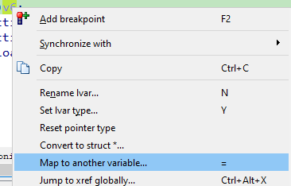
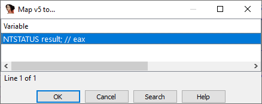
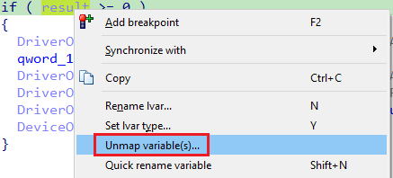

[Quick rename](https://hex-rays.com/blog/igors-tip-of-the-week-76-quick-rename/) can be useful when you have code which copies data around so the variable names stay the same or similar. However, sometimes there is a way to get rid of duplicate variables altogether.  
快速重命名在代码中复制数据时非常有用，因此变量名可以保持相同或相似。不过，有时也有办法完全消除重复变量。

### Reasons for duplicate variables  
变量重复的原因

Even if in the source code a specific variable may appear only once, on the machine code level it is not always possible. For example, most arithmetic operations use machine registers, so the values have to be moved from memory to registers to perform them. Conversely, sometimes a value has to be moved to memory from a register, for example:  
即使在源代码中一个特定的变量可能只出现一次，但在机器码层面上并不总是可能的。例如，大多数算术运算都使用机器寄存器，因此必须将数值从内存移至寄存器才能执行。相反，有时也需要将数值从寄存器移到内存中，例如

-   taking a reference/address of a variable requires that it resides in memory;  
    获取变量的引用/地址需要变量位于内存中；
-   when there are too few available registers, some variables have to be [spilled](https://en.wikipedia.org/wiki/Register_allocation#Components_of_register_allocation) to the stack;  
    当可用寄存器太少时，一些变量就必须溢出到栈中；
-   when a calling convention uses stack for passing arguments;  
    当调用约定使用堆栈传递参数时；
-   recursive calls or closures are usually implemented by storing the current variables on the stack;  
    递归调用或闭包通常是通过在栈中存储当前变量来实现的；
-   some other situations. 其他一些情况。

All this means that the same variable may be present in different locations during the lifetime of the function. Although the decompiler tries its best to merge these different locations into a single variable, it is not always possible, so extra variables may appear in the pseudocode.  
所有这些都意味着，在函数的生命周期中，同一个变量可能出现在不同的位置。虽然反编译器会尽力将这些不同位置的变量合并为一个变量，但并非总是可行，因此伪代码中可能会出现额外的变量。

### Example 示例

For a simple example, we can go back to `DriverEntry` in `kprocesshacker.sys` from the [last post](https://hex-rays.com/blog/igors-tip-of-the-week-76-quick-rename/). The initial output looks like this:  
举个简单的例子，我们可以回到上一篇文章中 `kprocesshacker.sys` 中的 `DriverEntry` 。初始输出如下

```
NTSTATUS __stdcall DriverEntry(_DRIVER_OBJECT *DriverObject, PUNICODE_STRING RegistryPath)
{
  NTSTATUS result; // eax
  NTSTATUS v5; // r11d
  PDEVICE_OBJECT v6; // rax
  struct _UNICODE_STRING DestinationString; // [rsp+40h] [rbp-18h] BYREF
  PDEVICE_OBJECT DeviceObject; // [rsp+60h] [rbp+8h] BYREF

  qword_132C0 = (__int64)DriverObject;
  VersionInformation.dwOSVersionInfoSize = 284;
  result = RtlGetVersion(&amp;VersionInformation);
  if ( result &gt;= 0 )
  {
    result = sub_15100(RegistryPath);
    if ( result &gt;= 0 )
    {
      RtlInitUnicodeString(&amp;DestinationString, L"\\Device\\KProcessHacker3");
      result = IoCreateDevice(DriverObject, 0, &amp;DestinationString, 0x22u, 0x100u, 0, &amp;DeviceObject);
      v5 = result;
      if ( result &gt;= 0 )
      {
        v6 = DeviceObject;
        DriverObject-&gt;MajorFunction[0] = (PDRIVER_DISPATCH)&amp;sub_11008;
        qword_132D0 = (__int64)v6;
        DriverObject-&gt;MajorFunction[2] = (PDRIVER_DISPATCH)&amp;sub_1114C;
        DriverObject-&gt;MajorFunction[14] = (PDRIVER_DISPATCH)&amp;sub_11198;
        DriverObject-&gt;DriverUnload = (PDRIVER_UNLOAD)sub_150EC;
        v6-&gt;Flags &amp;= ~0x80u;
        return v5;
      }
    }
  }
  return result;
}
```

We can see that there are two variables which look redundant: `v5` and `v6`. `v5` is a copy of `result` which resides in `r11d` and `v6`  is a copy of `DeviceObject` which resides in `rax`. It seems they were introduced for related reasons:  
我们可以看到，有两个变量看起来是多余的： `v5` 和 `v6` 。 `v5` 是 `result` 的副本，而 `result` 位于 `r11d` 中； `v6` 是 `DeviceObject` 的副本，而 `DeviceObject` 位于 `rax` 中。 看来引入这两个变量是出于相关原因：

1.  The compiler had to move `DeviceObject` from the stack to a register to initialize the global variable qword_132D0 and also modify the `Flags` member. It picked the register `rax` for that;  
    编译器必须将 `DeviceObject` 从堆栈移到寄存器中，以便初始化全局变量 qword_132D0，同时修改 `Flags` 成员。为此，编译器选择了寄存器 `rax` ；
2.  Because `rax` already contained the `result` variable (in the lower part of it: `eax`), it had to be saved elsewhere in the meantime (and moved back to `eax` at the end of manipulations with `DeviceObject`);  
    因为 `rax` 已经包含了 `result` 变量（在其下部： `eax` ），所以必须同时将其保存在其他地方（并在 `DeviceObject` 操作结束时移回 `eax` ）；
3.  The decompiler could not automatically merge `DeviceObject`with `v6` because they use different storage types (stack vs register) and because in theory the writes to `DriverObject->MajorFunction` could have changed the stack variable, so the values would not be the same anymore.  
    反编译器无法自动将 `DeviceObject` 与 `v6` 合并，因为它们使用不同的存储类型（堆栈与寄存器），而且理论上对 `DriverObject->MajorFunction` 的写入可能会改变堆栈变量，因此它们的值将不再相同。

### Mapping variables 映射变量

After looking at the code closely, it seems that `v5` and `v6` can be replaced correspondingly by `result` and `DeviceObject` in all cases. To ask the decompiler do it, we can use “[Map to another variable](https://hex-rays.com/products/decompiler/manual/cmd_map_lvar.shtml)” action from the context menu.  
仔细研究代码后发现，在所有情况下， `v5` 和 `v6` 都可以被 `result` 和 `DeviceObject` 相应替换。要要求反编译器这样做，我们可以使用上下文菜单中的 "映射到另一个变量 "操作。



When you use it for the first time, the following warning appears:  
首次使用时，会出现以下警告：


Alternatively, you can use the hotkey = (equals sign); it’s best to use it on the initial assignment such as `v6 = DeviceObject` because then the best match (the other side of assignment) will be preselected in the list of replacement candidates. In our case we get only one candidate, but in big functions you may have several variables of the same type, so triggering the action on an assignment helps ensure that you pick the correct one.  
另外，您也可以使用热键 = （等号）；最好在初始赋值时使用，如 `v6 = DeviceObject` ，因为此时最佳匹配变量（赋值的另一方）将在候选替换变量列表中被预选出来。在我们的例子中，我们只得到一个候选变量，但在大型函数中，可能会有多个相同类型的变量，因此在赋值时触发该操作有助于确保选择正确的变量。



After mapping both variables, the output no longer mentions them:  
在映射这两个变量后，输出结果中不再提及它们：

```
NTSTATUS __stdcall DriverEntry(_DRIVER_OBJECT *DriverObject, PUNICODE_STRING RegistryPath)
{
  NTSTATUS result; // eax MAPDST
  struct _UNICODE_STRING DestinationString; // [rsp+40h] [rbp-18h] BYREF
  PDEVICE_OBJECT DeviceObject; // [rsp+60h] [rbp+8h] MAPDST BYREF

  qword_132C0 = (__int64)DriverObject;
  VersionInformation.dwOSVersionInfoSize = 284;
  result = RtlGetVersion(&amp;VersionInformation);
  if ( result &gt;= 0 )
  {
    result = sub_15100(RegistryPath);
    if ( result &gt;= 0 )
    {
      RtlInitUnicodeString(&amp;DestinationString, L"\\Device\\KProcessHacker3");
      result = IoCreateDevice(DriverObject, 0, &amp;DestinationString, 0x22u, 0x100u, 0, &amp;DeviceObject);
      if ( result &gt;= 0 )
      {
        DriverObject-&gt;MajorFunction[0] = (PDRIVER_DISPATCH)&amp;sub_11008;
        qword_132D0 = (__int64)DeviceObject;
        DriverObject-&gt;MajorFunction[2] = (PDRIVER_DISPATCH)&amp;sub_1114C;
        DriverObject-&gt;MajorFunction[14] = (PDRIVER_DISPATCH)&amp;sub_11198;
        DriverObject-&gt;DriverUnload = (PDRIVER_UNLOAD)sub_150EC;
        DeviceObject-&gt;Flags &amp;= ~0x80u;
      }
    }
  }
  return result;
}
```

You can see that `result` and `DeviceObject` variables now have a new [annotation](https://hex-rays.com/blog/igors-tip-of-the-week-66-decompiler-annotations/): `MAPDST`. This means that some other variable(s) have been mapped to them.   
您可以看到 `result` 和 `DeviceObject` 变量现在有了新的注释： `MAPDST` .这意味着其他一些变量已经被映射到这些变量上。

### Unmapping variables 取消变量映射

If you’ve changed your mind and want to see how the original pseudocode looked like, or observe something suspicious in the output involving mapped variables, you can remove the mapping by right-clicking a mapped variable (marked with `MAPDST`) and choosing “Unmap variable(s)”.  
如果你改变了主意，想看看原来的伪代码是怎样的，或者在输出中发现了涉及映射变量的可疑之处，可以右键单击映射变量（标记为 `MAPDST` ）并选择 "取消映射变量"（Unmap variable(s)）来删除映射。



More info: [Hex-Rays interactive operation: Map to another variable](https://hex-rays.com/products/decompiler/manual/cmd_map_lvar.shtml)  
更多信息Hex-Rays 交互式操作：映射到另一个变量