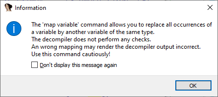

在代码中经常会出现“复制数据”的情况，这时 Quick rename 功能很有用，可以让变量名保持一致或相似。 但有时我们甚至可以彻底消除重复变量。

### 为什么会出现重复变量

即使在源代码中某个变量只出现一次，在机器码层面也未必如此。原因包括：

- 大多数算术操作必须在寄存器中执行，因此需要把值从内存搬到寄存器。
- 反过来，有时又必须把寄存器的值写回内存，例如：

  - 获取变量的引用/地址时，必须驻留在内存中；
  - 可用寄存器不足时，需要把部分变量溢出到栈上；
  - 调用约定使用栈传递参数；
  - 递归调用或闭包通常通过把当前变量存到栈上实现；
  - 其他情况。

因此，同一个逻辑变量在函数生命周期内可能存在于不同位置。 反编译器会尽力把这些不同位置合并为一个变量，但并非总能成功，于是伪代码中会出现额外的临时变量。

### 示例

继续上篇文章中的 `kprocesshacker.sys` 的 `DriverEntry`。初始反编译结果如下：

```c
NTSTATUS __stdcall DriverEntry(_DRIVER_OBJECT *DriverObject, PUNICODE_STRING RegistryPath)
{
  NTSTATUS result; // eax
  NTSTATUS v5; // r11d
  PDEVICE_OBJECT v6; // rax
  struct _UNICODE_STRING DestinationString; // [rsp+40h] [rbp-18h] BYREF
  PDEVICE_OBJECT DeviceObject; // [rsp+60h] [rbp+8h] BYREF

  qword_132C0 = (__int64)DriverObject;
  VersionInformation.dwOSVersionInfoSize = 284;
  result = RtlGetVersion(&VersionInformation);
  if ( result >= 0 )
  {
    result = sub_15100(RegistryPath);
    if ( result >= 0 )
    {
      RtlInitUnicodeString(&DestinationString, L"\\Device\\KProcessHacker3");
      result = IoCreateDevice(DriverObject, 0, &DestinationString, 0x22u, 0x100u, 0, &DeviceObject);
      v5 = result;
      if ( result >= 0 )
      {
        v6 = DeviceObject;
        DriverObject->MajorFunction[0] = (PDRIVER_DISPATCH)&sub_11008;
        qword_132D0 = (__int64)v6;
        DriverObject->MajorFunction[2] = (PDRIVER_DISPATCH)&sub_1114C;
        DriverObject->MajorFunction[14] = (PDRIVER_DISPATCH)&sub_11198;
        DriverObject->DriverUnload = (PDRIVER_UNLOAD)sub_150EC;
        v6->Flags &= ~0x80u;
        return v5;
      }
    }
  }
  return result;
}
```

可以看到有两个冗余变量：

- `v5` 是 `result` 的拷贝（存放在 `r11d`）；
- `v6` 是 `DeviceObject` 的拷贝（存放在 `rax`）。

产生原因：

- 编译器需要把 `DeviceObject` 从栈搬到寄存器，以便初始化全局变量 `qword_132D0` 并修改其 `Flags` 字段。
- 它选择了 `rax`，但 `rax` 的低位 `eax` 已经存放了 `result`，因此必须临时保存到别处（即 `v5`）。
- 反编译器无法自动合并 `DeviceObject` 与 `v6`，因为它们存储类型不同（栈 `vs` 寄存器），并且理论上对 `DriverObject->MajorFunction` 的写操作可能改变栈变量。

### Mapping variables

仔细分析后发现，`v5` 和 `v6` 在所有情况下都可以分别替换为 `result` 和 `DeviceObject`。 要让反编译器执行这种替换，可以使用右键菜单中的 `Map to another variable`。


第一次使用时会出现警告提示。


也可以使用快捷键 `=`（等号），最好在初始赋值语句上使用（如 `v6 = DeviceObject`），这样候选列表会自动预选另一侧的变量。在大型函数中可能有多个同类型变量，这种方式能帮助你选对目标。


映射完成后，伪代码中不再出现 `v5` 和 `v6`，而是直接使用 `result` 和 `DeviceObject`。

```c
NTSTATUS __stdcall DriverEntry(_DRIVER_OBJECT *DriverObject, PUNICODE_STRING RegistryPath)
{
  NTSTATUS result; // eax MAPDST
  struct _UNICODE_STRING DestinationString; // [rsp+40h] [rbp-18h] BYREF
  PDEVICE_OBJECT DeviceObject; // [rsp+60h] [rbp+8h] MAPDST BYREF

  qword_132C0 = (__int64)DriverObject;
  VersionInformation.dwOSVersionInfoSize = 284;
  result = RtlGetVersion(&VersionInformation);
  if ( result >= 0 )
  {
    result = sub_15100(RegistryPath);
    if ( result >= 0 )
    {
      RtlInitUnicodeString(&DestinationString, L"\\Device\\KProcessHacker3");
      result = IoCreateDevice(DriverObject, 0, &DestinationString, 0x22u, 0x100u, 0, &DeviceObject);
      if ( result >= 0 )
      {
        DriverObject->MajorFunction[0] = (PDRIVER_DISPATCH)&sub_11008;
        qword_132D0 = (__int64)DeviceObject;
        DriverObject->MajorFunction[2] = (PDRIVER_DISPATCH)&sub_1114C;
        DriverObject->MajorFunction[14] = (PDRIVER_DISPATCH)&sub_11198;
        DriverObject->DriverUnload = (PDRIVER_UNLOAD)sub_150EC;
        DeviceObject->Flags &= ~0x80u;
      }
    }
  }
  return result;
}
```

它们会带有一个新标记：`MAPDST`，表示有其他变量被映射到它们。

### Unmapping variables

如果你改变主意，想恢复原始伪代码，或者怀疑映射变量导致输出异常，可以：

- 右键点击带有 `MAPDST` 标记的变量
- 选择 `Unmap variable(s)`

这样就能撤销映射。


更多信息: [Hex-Rays interactive operation: Map to another variable](https://hex-rays.com/products/decompiler/manual/cmd_map_lvar.shtml)

原文地址：https://hex-rays.com/blog/igors-tip-of-the-week-77-mapped-variables
