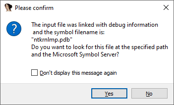
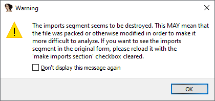
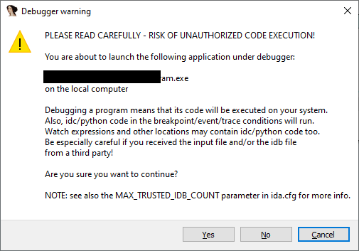
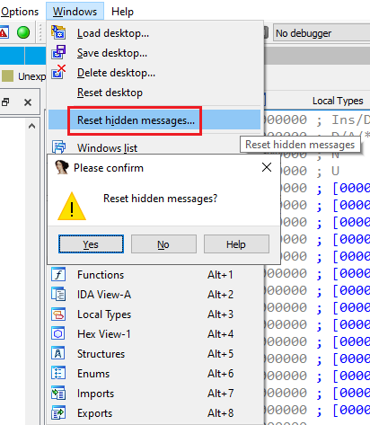

在处理二进制文件时，IDA 有时会显示警告，提示用户注意一些不寻常或潜在危险的行为，或者直接弹出问题要求用户确认。

### 隐藏消息

对于其中一些提示，会带有一个复选框 `Don’t Display this message again`。

如果在回答或确认之前勾选它（提示：可以直接按 `D` 键切换，而无需用鼠标），IDA 会记住你的选择，并在下次遇到相同情况时自动使用该答案。

这一点可以在 `Output window` 的日志中观察到。

### 修改自动答案

有时你可能会改变主意，希望选择不同的答案。 例如：

- 你之前对 PDB symbols 的提示选择了 `No`，但后来又希望在加载文件时启用 PDB 符号（注意：即使如此，仍然可以在事后通过 `File` 菜单加载）。
- 目前，IDA 并没有针对单条消息的独立设置选项，但你可以通过菜单 `Windows > Reset hidden messages…` 来重置所有自动答案。

参考：

执行重置后，IDA 会恢复到默认状态，再次显示所有提示和警告，从而给你机会选择不同的答案。

[IDA Help: Reset Hidden Messages](https://www.hex-rays.com/products/ida/support/idadoc/1464.shtml)

原文地址：https://hex-rays.com/blog/igors-tip-of-the-week-78-auto-hidden-messages
