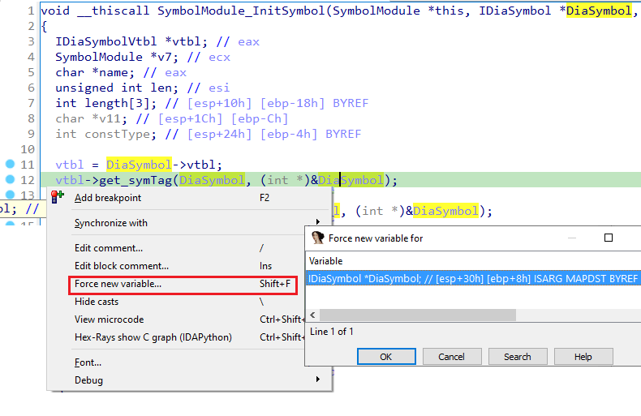

Previously we’ve discussed how to reduce the number of variables used in pseudocode by [mapping](https://hex-rays.com/blog/igors-tip-of-the-week-77-mapped-variables/) copies of a variable to one. However, sometimes you may run into an opposite problem:  a single variable can be used for different purposes.  
前面我们讨论了如何通过将一个变量的副本映射为一个变量来减少伪代码中使用的变量数量。不过，有时你可能会遇到一个相反的问题：一个变量可以用于不同的目的。

### Reused stack slots 重复使用栈槽

One common situation is when the compiler reuses a stack location of either a local variable or even an incoming stack argument for a different purpose. For example, in a snippet like this:  
一种常见的情况是，编译器为了不同的目的而重复使用本地变量的堆栈位置，甚至是输入的堆栈参数。例如，在下面的代码段中：

```
vtbl = DiaSymbol-&gt;vtbl;
vtbl-&gt;get_symTag(DiaSymbol, (int *)&amp;DiaSymbol);
Symbol-&gt;Tag = (int)DiaSymbol;
```

The second argument of the call is clearly an output argument and has a different meaning and type from `DiaSymbol` before the call. In such case, you can use the “Force new variable” command (shortcut Shift–F). Due to implementation details, sometimes the option is not displayed if you right-click on the variable itself; in that case try right-clicking on the start of the pseudocode line.  
调用的第二个参数显然是一个输出参数，其含义和类型与调用前的 `DiaSymbol` 不同。在这种情况下，可以使用 "强制新变量 "命令（快捷键 Shift - F ）。由于执行细节的原因，有时右键单击变量本身不会显示该选项；在这种情况下，请尝试右键单击伪代码行的起始位置。



The decompiler creates a new variable at the same stack location, initially with the same type:  
反编译器会在同一堆栈位置创建一个新变量，初始类型相同：

```
IDiaSymbol *v14; // [esp+30h] [ebp+8h] FORCED BYREF

vtbl = DiaSymbol-&gt;vtbl;
vtbl-&gt;get_symTag(DiaSymbol, (int *)&amp;v14);
Symbol-&gt;Tag = (int)v14;
```

Naturally, you can change its type and name to a better one:  
当然，你可以将其类型和名称改为更好的类型和名称：

```
int tag; // [esp+30h] [ebp+8h] FORCED BYREF

vtbl = DiaSymbol-&gt;vtbl;
vtbl-&gt;get_symTag(DiaSymbol, &amp;tag);
Symbol-&gt;Tag = tag;
```

### Using a union to represent a polymorphic variable  
使用联合变量表示多态变量

Unfortunately, “Force new variable” is not available for register variables (as of IDA 7.7). In such case, using a union may work. For example, consider this snippet from `ntdll.dll`‘s `LdrRelocateImage` function:  
遗憾的是，"强制新变量"（Force new variable）不能用于寄存器变量（截至 IDA 7.7）。在这种情况下，可以使用联合变量。例如，请看 `ntdll.dll` 的 `LdrRelocateImage` 函数中的这个片段：

```
  int v6; // esi
  int v7; // eax
  int v8; // edi
  int v9; // eax
  
  v6 = 0;
  v20 = 0;
  v7 = RtlImageNtHeader(a1);
  v8 = v7;
  if ( !v7 )
    return -1073741701;
  v9 = *(unsigned __int16 *)(v7 + 24);
  if ( v9 == IMAGE_NT_OPTIONAL_HDR32_MAGIC )
  {
    v18 = *(_DWORD *)(v8 + 52);
    v16 = 0;
  }
  else
  {
    if ( v9 != IMAGE_NT_OPTIONAL_HDR64_MAGIC )
      return -1073741701;
    v18 = *(_DWORD *)(v8 + 48);
    v16 = *(_DWORD *)(v8 + 52);
  }
```

The function `RtlImageNtHeader` returns a pointer to the `IMAGE_NT_HEADERS` structure of the PE image at the given address. After changing its prototype and types of the variables, the code becomes a little more readable:  
函数 `RtlImageNtHeader` 返回一个指向给定地址 PE 映像的 `IMAGE_NT_HEADERS` 结构的指针。在修改了函数原型和变量类型后，代码的可读性提高了一些：

```
  int v6; // esi
  PIMAGE_NT_HEADERS v7; // eax
  PIMAGE_NT_HEADERS v8; // edi
  int Magic; // eax
  int v10; // edx
  int v11; // eax
  unsigned int v12; // ecx
  int v13; // ecx
  int v15; // [esp+Ch] [ebp-10h]
  unsigned int v16; // [esp+10h] [ebp-Ch]
  int v17; // [esp+10h] [ebp-Ch]
  unsigned int v18; // [esp+14h] [ebp-8h]
  char *v19; // [esp+14h] [ebp-8h]
  int v20; // [esp+18h] [ebp-4h] BYREF

  v6 = 0;
  v20 = 0;
  v7 = RtlImageNtHeader(a1);
  v8 = v7;
  if ( !v7 )
    return -1073741701;
  Magic = v7-&gt;OptionalHeader.Magic;
  if ( Magic == IMAGE_NT_OPTIONAL_HDR32_MAGIC )
  {
    v18 = v8-&gt;OptionalHeader.ImageBase;
    v16 = 0;
  }
  else
  {
    if ( Magic != IMAGE_NT_OPTIONAL_HDR64_MAGIC )
      return -1073741701;
    v18 = v8-&gt;OptionalHeader.BaseOfData;
    v16 = v8-&gt;OptionalHeader.ImageBase;
  }
```

However, there is a small problem. Judging by the checks of the magic value, the code can handle both 32-bit and 64-bit images, however the current `PIMAGE_NT_HEADERS` type is 32-bit (`PIMAGE_NT_HEADERS32`) so the code in the `else` clause is likely incorrect. If we change `v8` to `PIMAGE_NT_HEADERS64`, then the `if` clause becomes incorrect:  
不过，还有一个小问题。从魔法值的检查来看，代码可以处理 32 位和 64 位图像，但当前的 `PIMAGE_NT_HEADERS` 类型是 32 位（ `PIMAGE_NT_HEADERS32` ），因此 `else` 子句中的代码很可能是不正确的。如果我们将 `v8` 更改为 `PIMAGE_NT_HEADERS64` ，那么 `if` 子句就会变得不正确：

```
  if ( Magic == IMAGE_NT_OPTIONAL_HDR32_MAGIC )
  {
    ImageBase = HIDWORD(v8-&gt;OptionalHeader.ImageBase);
    v16 = 0;
  }
  else
  {
    if ( Magic != IMAGE_NT_OPTIONAL_HDR64_MAGIC )
      return -1073741701;
    ImageBase = v8-&gt;OptionalHeader.ImageBase;
    v16 = HIDWORD(v8-&gt;OptionalHeader.ImageBase);
  }
```

We can’t force a new variable because `v8` is allocated in a register and not on stack. Can we still use both types at once?  
我们不能强制使用新变量，因为 `v8` 是在寄存器中分配的，而不是在堆栈中。我们还能同时使用两种类型吗？

The answer is yes: we can use a union which combines both types. Here’s how it can be done in this example:  
答案是肯定的：我们可以使用一个结合两种类型的联合体。下面是本例中的操作方法：

1.  Open Local Types (Shift-F1);  
    打开本地类型（Shift-F1）；
2.  Add a new type (Ins);  
    添加新类型 (Ins)；
3.  Enter this definition:  输入此定义：
    
    ```
    union nt_headers
    {
     PIMAGE_NT_HEADERS32 hdr32;
     PIMAGE_NT_HEADERS64 hdr64;
    };
    ```
    
4.  change type of `v8` to `nt_headers` and use “[Select Union Field](https://hex-rays.com/blog/igors-tip-of-the-week-75-working-with-unions/)” to pick the correct field in each branch of the if:  
    将 `v8` 类型改为 `nt_headers` ，并使用 "选择联合字段 "在 if 的每个分支中选择正确的字段：

```
  Magic = v7-&gt;OptionalHeader.Magic;
  if ( Magic == IMAGE_NT_OPTIONAL_HDR32_MAGIC )
  {
    ImageBase = v8.hdr32-&gt;OptionalHeader.ImageBase;
    ImageBaseHigh = 0;
  }
  else
  {
    if ( Magic != IMAGE_NT_OPTIONAL_HDR64_MAGIC )
      return -1073741701;
    ImageBase = v8.hdr64-&gt;OptionalHeader.ImageBase;
    ImageBaseHigh = HIDWORD(v8.hdr64-&gt;OptionalHeader.ImageBase);
  }
```

In this specific example the difference is minor and you could probably get by with some comments, but there may be situations where it makes a real difference. Note that this approach can be used for stack variables too.  
在这个具体的例子中，差别不大，你可能只需要一些注释就可以了，但在某些情况下，这可能会产生真正的差别。请注意，这种方法也可用于栈变量。

See also: [Hex-Rays interactive operation: Force new variable](https://www.hex-rays.com/products/decompiler/manual/cmd_force_lvar.shtml)  
另请参见Hex-Rays 交互式操作：强制新建变量