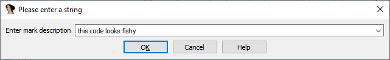
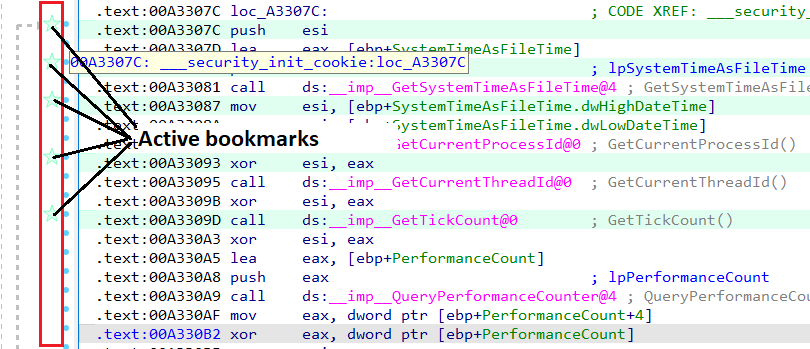
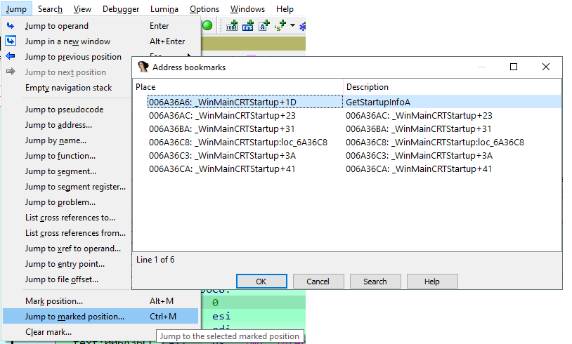
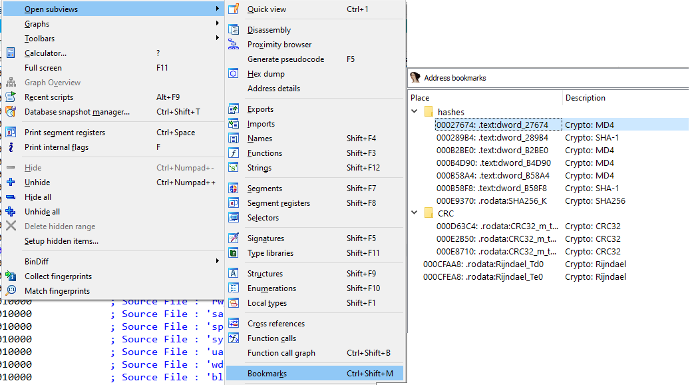

除了添加注释，IDA 还提供了一些功能来帮助在数据库中进行标注和快速导航。今天我们要介绍的是 `Bookmarks`。

### 添加 Bookmarks

`Bookmarks` 可以添加在大多数基于地址的视图中（反汇编列表、`Hex View`、`Pseudocode`），也可以在 `Structures` 和 `Enums` 中添加。

添加方式：

- 菜单 `Jump > Mark position…`，
- 快捷键 `Alt–M`

你可以输入一段简短的文字作为描述，它会显示在 `bookmark list` 中。

在反汇编列表中，还可以在 `execution flow arrows panel`（执行流箭头面板）中，点击断点圆圈左边的区域快速添加 `bookmark`。

- 这种情况下，描述只包含地址和标签（如果有的话）。
- 激活的 `bookmark` 会显示一个图标，再次点击即可移除。
- 鼠标悬停在图标上可以查看描述。

### 管理与导航 Bookmarks

查看 `bookmark list` 并快速跳转：

- 菜单 `Jump > Jump to marked position…`
- 快捷键 `Ctrl–M`

在该对话框中，可以通过右键菜单或快捷键管理：

- 删除：`Del`
- 编辑：`Ctrl–E`

如果你添加了很多 `bookmarks`，查找会变得困难。 因此在 IDA 7.6 中新增了专门的 `bookmarks view`，并支持将 `bookmarks` 分组到文件夹中。

- 打开方式：`View > Open subviews > Bookmarks`
- 快捷键：`Ctrl–Shift–M`

该窗口是非模态的，可以停靠在界面中。

总结：
`Bookmarks` 是 IDA 中一个轻量但非常实用的功能，能帮助你在大型二进制文件中快速定位、组织和管理关键位置，比单纯依赖注释更高效。

原文地址：https://hex-rays.com/blog/igors-tip-of-the-week-80-bookmarks
