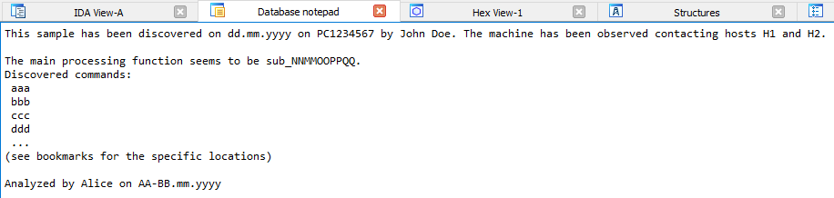
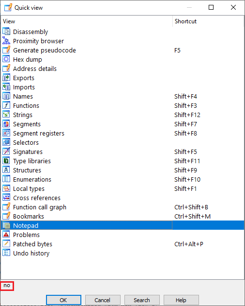

There are multiple ways of annotating IDA databases: renaming, [commenting](https://hex-rays.com/blog/igor-tip-of-the-week-14-comments-in-ida/), or [adding bookmarks](https://hex-rays.com/blog/igors-tip-of-the-week-80-bookmarks/). However, sometimes there is a need for general notes for the database as a whole, not tied to specific locations.  
注释 IDA 数据库有多种方法：重命名、注释或添加书签。不过，有时需要为整个数据库添加一般注释，而不是绑定到特定位置。

### Notepad window 记事本窗口

The database notepad is a text input box which can store arbitrary text within the database, so you can add your notes and thoughts there instead of using separate software.  
数据库记事本是一个文本输入框，可以在数据库中存储任意文本，因此您可以在这里添加笔记和想法，而无需使用单独的软件。  
It can be opened using the menu View > Open subview > Notepad.  
可以通过菜单 "视图">"打开子视图">"记事本 "打开。

There is no built-in shortcut for quick access, but you can [add one](https://hex-rays.com/blog/igor-tip-of-the-week-02-ida-ui-actions-and-where-to-find-them/), or open the [Quick view](https://hex-rays.com/blog/igors-tip-of-the-week-30-quick-views/) (Ctrl–1), type “no” to select the entry and Enter to activate it.  
没有内置的快速访问快捷键，但你可以添加一个，或者打开快速视图（ Ctrl - 1 ），输入 "否 "选择条目，输入 Enter 激活它。

