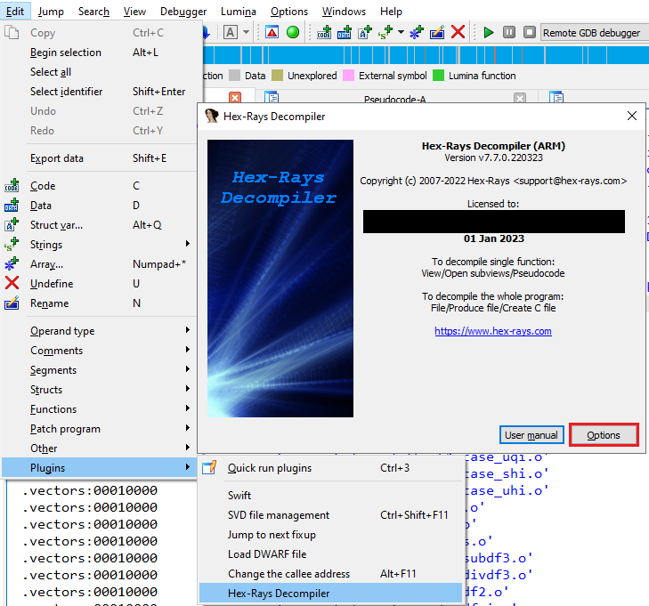
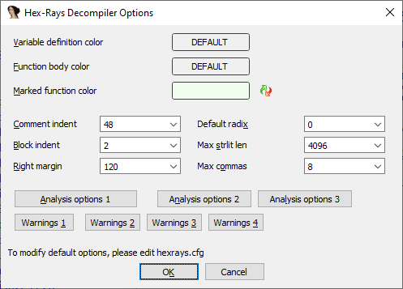

The default output of the Hex-Rays decompiler tries to strike a balance between conciseness and readability. However, everyone has different preferences so it offers a few options to control the layout and formatting of the pseudocode.  
Hex-Rays 反编译器的默认输出试图在简洁和可读性之间取得平衡。不过，每个人都有不同的偏好，因此它提供了一些选项来控制伪代码的布局和格式。

### Accessing the options 访问选项

Because of its origins as a third-party plugin for IDA, the decompiler options are accessible not through IDA’s Options menu, but via Edit > Plugins > Hex-Rays Decompiler, Options button  
由于反编译器是 IDA 的第三方插件，因此不能通过 IDA 的 "选项 "菜单访问反编译器选项，而只能通过 "编辑">"插件">"Hex-Rays 反编译器"，"选项 "按钮进行访问

### Pseudocode formatting options  
伪代码格式化选项

Formatting options are available on the main page of the options dialog.  
格式选项可在选项对话框的主页上找到。

### Changing the defaults 更改默认值

When changing the settings from inside IDA using the UI described above, they apply only to the current database. To change the defaults for all new databases, either edit `cfg/hexrays.cfg` in IDA’s install directory, or create one in the [user directory](https://hex-rays.com/blog/igors-tip-of-the-week-33-idas-user-directory-idausr/) with the options you want to override.  
在 IDA 内部使用上述用户界面更改设置时，这些设置只适用于当前数据库。要更改所有新数据库的默认设置，可编辑 IDA 安装目录中的 `cfg/hexrays.cfg` ，或在用户目录中创建一个包含要覆盖选项的目录。

#### Related options 相关选项

Extra empty lines can be added to the pseudocode to improve readability. This feature was described in the tip #43 ([Annotating the decompiler output](https://hex-rays.com/blog/igors-tip-of-the-week-43-annotating-the-decompiler-output/)).  
可以在伪代码中添加额外的空行，以提高可读性。该功能在小贴士 #43（反编译器输出注释）中有所描述。

More info: [Configuration (Hex-Rays Decompiler User Manual)](https://www.hex-rays.com/products/decompiler/manual/config.shtml)  
更多信息：配置（Hex-Rays 反编译器用户手册）