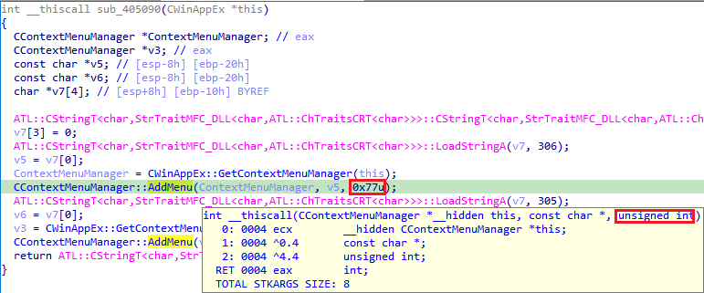

We’ve covered the major pseudocode formatting options previously but there is one more option which can influence the output. It is the _radix_ used for printing numbers in the pseudocode.  
前面我们已经介绍了主要的伪代码格式化选项，但还有一个选项会影响输出结果。这就是在伪代码中打印数字时使用的弧度。

> In a positional numeral system, the **radix** or **base** is the number of unique digits, including the digit zero, used to represent numbers. For example, for the decimal/denary system (the most common system in use today) the radix (base number) is ten, because it uses the ten digits from 0 through 9.  
> 在位置数字系统中，弧度或基数是用于表示数字的唯一数字的个数，包括数字 0。例如，十进制/十进制系统（目前最常用的系统）的弧度（基数）是十，因为它使用从 0 到 9 的十个数字。

(from [Wikipedia](https://en.wikipedia.org/wiki/Radix)) (摘自维基百科）

### Automatic radix 自动弧度

The default radix setting is 0, which means “automatic”.  
默认弧度设置为 0，即 "自动"。

With this setting, the decompiler uses hexadecimal radix for values detected as unsigned, and decimal otherwise. For example, in the below screenshot, arguments to `CContextMenuManager::AddMenu()` are shown in hex because the function prototype specifies the last argument type as “unsigned int”, while those for `LoadStringA()` are in decimal because the decompiler used a guessed prototype with the type [`_DWORD`](https://hex-rays.com/blog/igors-tip-of-the-week-45-decompiler-types/) which behaves like a signed type.  
在此设置下，反编译器对检测为无符号的值使用十六进制半径，否则使用十进制。例如，在下面的截图中， `CContextMenuManager::AddMenu()` 的参数显示为十六进制，因为函数原型将最后一个参数的类型指定为 "无符号 int"，而 `LoadStringA()` 的参数显示为十进制，因为反编译器使用了猜测的原型 `_DWORD` 类型，其行为类似于有符号类型。

### “Nice” numbers "漂亮的 "数字

In some cases, the decompiler may use hex even for signed numbers if it makes the number look “nice”. Currently (as of IDA 7.7), the following rules are used:  
在某些情况下，如果反编译器使用十六进制能使数字看起来 "漂亮"，那么即使是有符号的数字，反编译器也可能使用十六进制。目前（从 IDA 7.7 开始）使用以下规则：

1.  values matching 2n and 2n-1 (typical bitmasks) are printed as hexadecimal.  
    与 2 n 和 2 n -1 （典型的位掩码）相匹配的值打印为十六进制。
2.  64-bit values which have not all-zero or all-one high 32 bits are printed as hexadecimal unless they end with more than 3 zeroes in decimal representation.  
    如果 64 位数值的高 32 位没有全零或全一，则打印为十六进制，除非这些数值在十进制表示法中以 3 个以上的零结束。
3.  -1 is printed as decimal.  
    -1则打印为十进制。

### Changing the radix manually  
手动更改弧度

You can always change the representation for a specific number in pseudocode from the context menu or via a hotkey.  
您可以随时通过上下文菜单或热键更改伪代码中特定数字的表示形式。

To toggle between decimal and hex, use the H hotkey. Octal is available only via the context menu by default, but it’s possible to add a [custom hotkey](https://hex-rays.com/blog/igor-tip-of-the-week-02-ida-ui-actions-and-where-to-find-them/) for the action name `hx:Oct`.  
要在十进制和十六进制之间切换，请使用 H 热键。八进制默认情况下只能通过右键菜单使用，但也可以添加一个自定义热键，操作名称为 `hx:Oct` 。

### Setting preferred radix 设置首选弧度

By changing _Default radix_ in the decompiler options, you can have decompiler always use decimal (10) or hexadecimal(16) for all numbers without an explicitly set radix. Note that in this case the “nice” number detection will be disabled.  
通过在反编译器选项中更改默认弧度，可以让反编译器在没有明确设置弧度的情况下，对所有数字始终使用十进制（10）或十六进制（16）。请注意，在这种情况下，"漂亮 "数字检测将被禁用。

To change the default for all new databases, set the value **DEFAULT_RADIX** in `hexrays.cfg` as described in the [previous post](https://hex-rays.com/blog/igors-tip-of-the-week-82-decompiler-options-pseudocode-formatting/).  
要更改所有新数据库的默认值，请按照上一篇文章所述，在 `hexrays.cfg` 中设置 DEFAULT_RADIX 值。

More info: [Configuration (Hex-Rays Decompiler User Manual)](https://www.hex-rays.com/products/decompiler/manual/config.shtml)  
更多信息：配置（Hex-Rays 编译器用户手册）