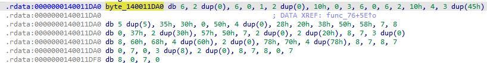
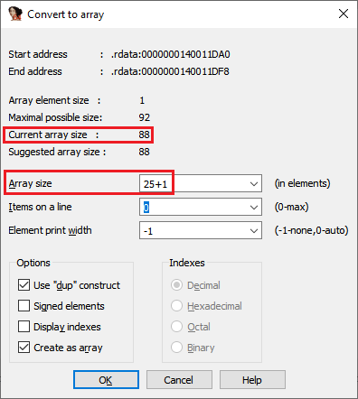
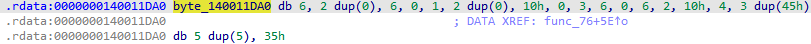
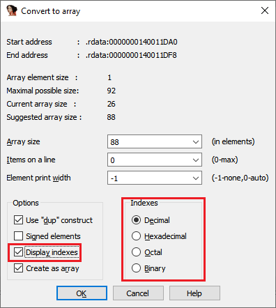
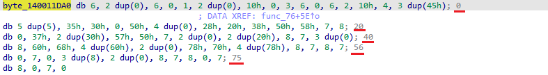
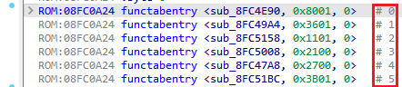
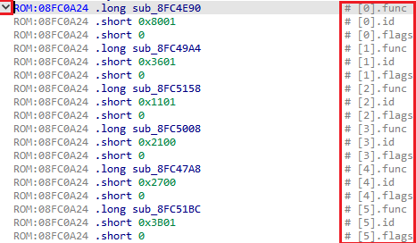

We’ve covered arrays [previously](https://hex-rays.com/blog/igor-tip-of-the-week-10-working-with-arrays/), but one feature briefly mentioned there is worth a separate highlight.  
我们之前介绍过数组，但其中简要提到的一项功能值得单独强调。

Complex programs may use arrays of data, either of items such as integers or floats, or of complex items such as structures. When the arrays are small, it’s not too difficult to make sense of them, but what to do if your task requires, for example, to find the value of the item #567 in a 3000-item array?  
复杂的程序可能会使用数据数组，这些数组可能是整数或浮点数之类的项目，也可能是结构之类的复杂项目。当数组很小的时候，要理解它们并不难，但如果你的任务需要在一个 3000 个项目的数组中找出项目 #567 的值，该怎么办呢？

You can of course try to count the items manually or copy the array into a text editor ([Export Data](https://hex-rays.com/blog/igors-tip-of-the-week-39-export-data/) can help here) and import into a spreadsheet but there are ways to do it inside IDA without too much trouble.  
当然，你可以尝试手动计数，或者将数组复制到文本编辑器中（Export Data可以在这里提供帮助），然后导入电子表格中。

### Resizing the array 调整数组大小

Let’s say we have an array of 88 items:  
假设我们有一个包含 88 个项目的数组：

and we need the item #25. Manual counting is possible but tedious, especially because we need to account for the repeated items in the `dup` expressions. There is a different approach to solve this. Because the items are counted from 0 and we have 88 of them, the last one has index 87. To make it so that the last item is number 25, we can resize the array to 26(25+1) items. For this, press * to open the array parameters dialog and change the _Array size_ field:  
而我们需要 #25 项。手动计数是可行的，但很繁琐，尤其是因为我们需要考虑 `dup` 表达式中的重复项。有一种不同的方法可以解决这个问题。因为项目是从 0 开始计数的，而我们有 88 个项目，最后一个项目的索引为 87。为了使最后一个项目是第 25 个，我们可以将数组的大小调整为 26(25+1) 个项目。为此，按 * 键打开数组参数对话框并更改数组大小字段：

Now the array contains 26 items from #0 to #25 so we can see that the item we needed has the value `35h`.  
现在数组包含从 #0 到 #25 的 26 个条目，因此我们可以看到我们需要的条目值为 `35h` 。

### Array index display 显示数组索引

Alternatively, we can enable the _Display indexes_ option.  
另外，我们还可以启用显示索引选项。

With the option on, index of the first element is displayed as a comment for each line:  
启用该选项后，第一元素的索引将作为注释显示在每一行中：

While still not very obvious, it is a little easier to find the necessary element by counting from the start of a line. You can also set the _Items on a line_ value to 1 or another small value so that each line contains fewer elements and it’s easier to find the necessary one.  
虽然还不是很明显，但从一行的开始数起，就能更容易地找到所需的元素了。你也可以将一行中的项目值设置为 1 或其他较小的值，这样每行包含的元素就会减少，也更容易找到所需的元素。

### Indexes and arrays of structures  
索引和结构数组

When you have an array of structures and they can be displayed in [terse form](https://hex-rays.com/blog/igors-tip-of-the-week-31-hiding-and-collapsing/), the indexes are printed for each line similarly to the array of simple values.  
如果您有一个结构数组，并且可以以简短的形式显示，那么每一行的索引打印方式与简单值数组类似。

However, if you unhide/uncollapse the array to show the structs in verbose form, each field gets a comment with an array notation:  
不过，如果取消隐藏/折叠数组，以详细说明的形式显示结构体，则每个字段都会得到一个带有数组符号的注释：

See also: [IDA Help: Convert to array](https://www.hex-rays.com/products/ida/support/idadoc/455.shtml)  
另请参阅IDA 帮助：转换为数组