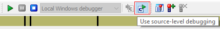
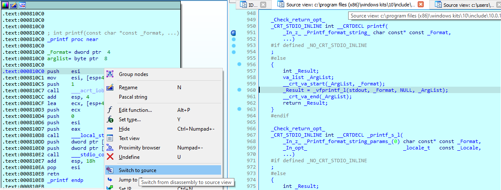
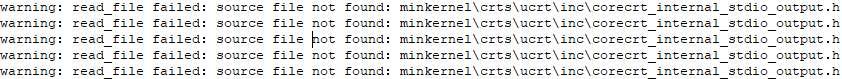
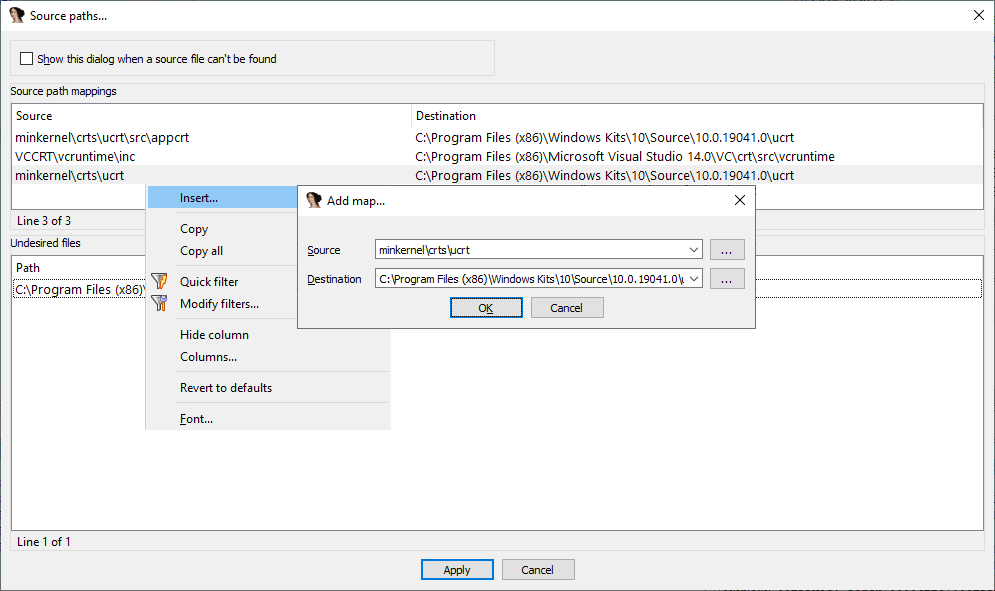
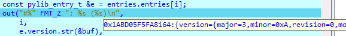
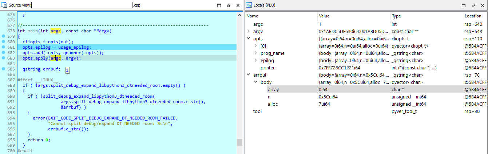
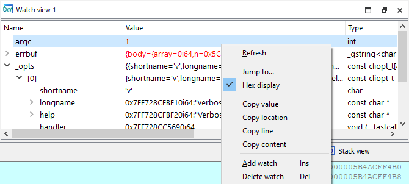
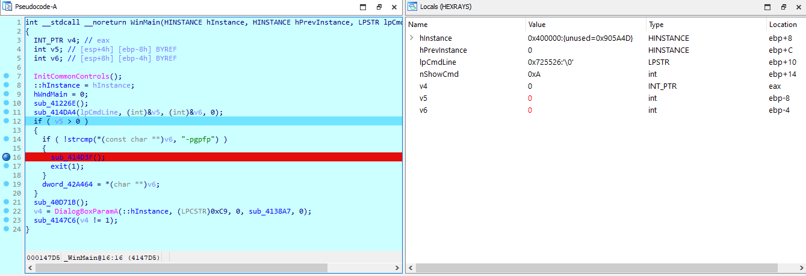

Although IDA has been created first and foremost to analyze binaries in “black box” mode, i.e. without any symbols or debug  information, it does have the ability to [consume such information when available](https://hex-rays.com/blog/igors-tip-of-the-week-55-using-debug-symbols/).  
虽然 IDA 首先是用于在 "黑盒 "模式下分析二进制文件，即不包含任何符号或调试信息，但它确实有能力在可用时使用此类信息。

The debugger functionality was also initially optimized to debug binaries on the assembly level, but nowadays can work with source code too.  
调试器的功能最初也是为在汇编级调试二进制文件而优化的，但如今也可以在源代码中使用。

### Source-level debugging 源代码级调试

Source-level debugging is enabled by default but can be turned off or on manually via Debugger > Use source-level debugging menu item, or the button on the Debug toolbar.  
源代码级调试默认为启用，但可通过调试器 > 使用源代码级调试菜单项或调试工具栏上的按钮手动关闭或打开。

If the input file has debugging info in the format supported by IDA (e.g. PDB or DWARF), it will be automatically used when the debugging starts and the code being executed is covered by the debug info.  
如果输入文件中包含 IDA 支持格式的调试信息（如 PDB 或 DWARF），则在调试开始且调试信息涵盖正在执行的代码时，将自动使用该调试信息。

### Source code files 源代码文件

If source files are present in the original locations, IDA will open them in separate source view windows and highlight the currently executing line. The assembly instructions are still shown in the IDA View, and you can continue to use it for analysis independently of source code view. Note that IDA may automatically switch to disassembly when stepping through instructions which do not have a correspondence in the source code (for example, compiler helper functions, or auxiliary code such as prolog or epilog instructions).  
如果源代码文件存在于原始位置，IDA 将在单独的源代码视图窗口中打开它们，并高亮显示当前执行的行。汇编指令仍显示在 IDA 视图中，您可以继续使用它进行分析，而不受源代码视图的影响。请注意，当步进到在源代码中没有对应关系的指令（例如编译器辅助函数或辅助代码，如 prolog 或 epilog 指令）时，IDA 可能会自动切换到反汇编。

When, after stepping through disassembly, the execution returns to the area covered by the source code, you can ask IDA to show the corresponding source code again via the action Debugger  > Switch to source (also available in context menu and toolbar). This action can be used even for code away from the current execution point.  
通过反汇编步进后，当执行返回到源代码覆盖的区域时，您可以通过调试器 > 切换到源代码（也可在上下文菜单和工具栏中使用）要求 IDA 重新显示相应的源代码。该操作甚至可用于远离当前执行点的代码。

### Source path mappings 源代码路径映射

Sometimes the source code corresponding to the binary may be available but in a different location from what is recorded in the debug info (e.g. you may be debugging the binary on a different machine or even remotely from a different OS). The files which were not found in expected location are printed in Output window:  
有时，二进制文件对应的源代码可能是可用的，但与调试信息中记录的位置不同（例如，您可能在不同的机器上甚至从不同的操作系统远程调试二进制文件）。未在预期位置找到的文件将打印在输出窗口中：

Using Options > Source paths…, you can set up mappings for IDA to find the source files in new locations.  
使用 "选项">"源路径..."，可以设置 IDA 在新位置查找源文件的映射。

### Locals  局部变量

When the debug info includes information about local variables, IDA can use it to show their values. A short, one-line version is shown when you hover mouse over the variables in source code view.  
当调试信息包括有关局部变量的信息时，IDA 可以使用它来显示这些变量的值。在源代码视图中将鼠标悬停在变量上时，会显示简短的单行版本。

For more complex objects it may be more convenient to open the dedicated view where you can expand and inspect fields and sub-objects. This view is available via the menu Debugger  > Debugger windows > Locals.  
对于更复杂的对象，打开专用视图可能更方便，在此可以展开并检查字段和子对象。该视图可通过菜单 "调试器">"调试器窗口">"本地 "查看。

### Watches 观察

In addition to locals, you can also watch only specific variables you need instead of all locals, or values of global variables. This view can be opened via Debugger  > Debugger windows > Watch view. Variables can be added using Ins or context menu.  
除本地变量外，您还可以只观察您需要的特定变量，而不是所有本地变量或全局变量的值。可以通过调试器 > 调试器窗口 > 监视视图打开该视图。可以使用 Ins 或上下文菜单添加变量。

### Debugging pseudocode 调试伪代码

Even if you don’t have debug info for the code you’re debugging but do have a decompiler, it is possible to debug pseudocode as if it were a source file. IDA will automatically use pseudocode if source-level debugging is enabled but there is no debug info for the specific code fragment you’re stepping through. You can also always switch to pseudocode during debugging using the usual Tab hotkey. Locals, Watches, and source-level breakpoints are available when debugging pseudocode in the same way as with “real” source code.  
即使没有调试代码的调试信息，但有反编译器，也可以像调试源文件一样调试伪代码。如果启用了源代码级调试，但没有正在调试的特定代码片段的调试信息，IDA 将自动使用伪代码。你也可以在调试过程中使用常用的 Tab 热键切换到伪代码。在调试伪代码时，可以使用与调试 "真实 "源代码相同的本地、监视和源代码级断点。

P.S. attentive reader may discover an additional surprise in this post. Happy Easter! 😉  
附注：细心的读者可能会在这篇文章中发现一个额外的惊喜。复活节快乐！ 😉