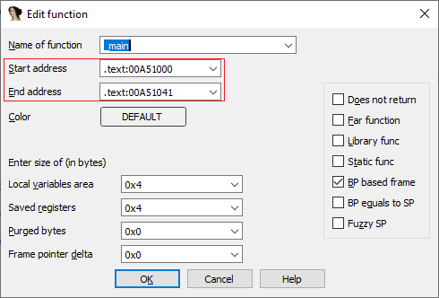
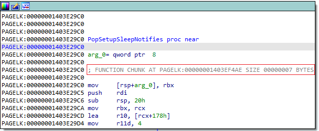
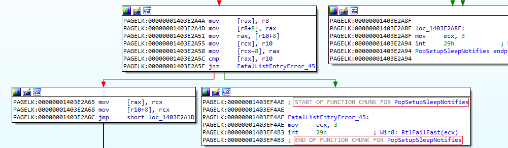
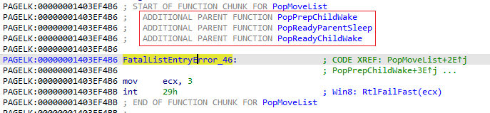
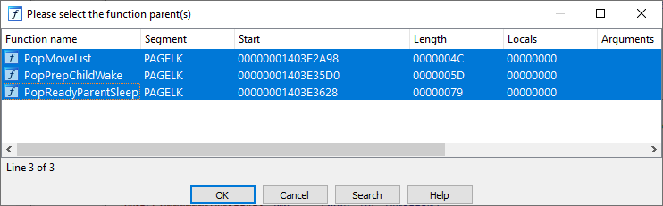

In IDA, _function_ is a sequence of instructions grouped together. Usually it corresponds to a high-level function or [_subroutine_](https://en.wikipedia.org/wiki/Subroutine):  
在 IDA 中，函数是一串组合在一起的指令。它通常与高级函数或子程序相对应：

1.  it can be _called_ from other places in the program, usually using a dedicated processor instruction;  
    可以从程序的其他地方调用，通常使用专用的处理器指令；
2.  it has an _entry_ and one or more _exits_ (instruction(s) which return to the caller);  
    它有一个入口和一个或多个出口（返回调用者的指令）；
3.  it can accept _arguments_ (in registers or on the stack) and optionally return values;  
    它可以接受参数（寄存器或堆栈中的参数），也可以选择返回值；
4.  it can use local (stack) variables  
    可以使用局部（堆栈）变量

However, IDA’s functions can group any arbitrary sequence of instructions, even those not matching the above criteria. The only hard requirement is that the function must start with a valid instruction.  
不过，IDA 的函数可以组合任何任意的指令序列，甚至是不符合上述条件的指令序列。唯一的硬性要求是，函数必须以有效指令开始。

### Creating functions 创建函数

IDA usually creates functions automatically, based on the call instructions or debug information, but they can also be created manually using the Create Function action (under Edit > Functions or from context menu), or P shortcut. This can be done only for instructions not already belonging to functions. By default IDA follows the cross-references and tries to determine the function boundaries automatically, but you can also [select](https://hex-rays.com/blog/igor-tip-of-the-week-03-selection-in-ida/) a range beforehand to force creation of a function, for example, if there are some invalid instructions or embedded data.  
IDA 通常会根据调用指令或调试信息自动创建函数，但也可以使用 "创建函数 "操作（在 "编辑">"函数 "下或上下文菜单中）或 P 快捷键手动创建函数。这只适用于不属于函数的指令。默认情况下，IDA 会根据交叉引用自动确定函数的边界，但您也可以事先选择一个范围来强制创建一个函数，例如，如果有一些无效的指令或嵌入数据。

### Function range 函数范围

In the most common case, a function occupies a contiguous address range, from the entry to the last return instruction. This is the start and end address specified in function properties available via the Edit Function dialog (Alt–P).  
在最常见的情况下，函数占用一个连续的地址范围，从入口指令到最后一条返回指令。这就是通过 "编辑函数 "对话框获取的函数属性中指定的起始和终止地址（ Alt - P ）。

### Chunked functions 分块函数

A single-range function is not the only option supported by IDA. In real-life programs, a function may be split into several disjoint ranges. For example, this may happen as a result of [profile-guided optimization](https://devblogs.microsoft.com/cppblog/profile-guided-optimization-pgo-under-the-hood/), which can put cold (rarely executed) basic blocks into a separate part of binary from hot (often executed) ones. In IDA, such functions are considered to consist of multiple _chunks_ (each chunk being a single contiguous range of instructions). The chunk containing the function entry is known as _entry chunk_, while the others are called _tail chunks_ or simply _tails_.  
IDA 并不只支持单一范围的函数。在实际程序中，一个函数可能会被分割成几个不相连的范围。例如，这可能是配置文件指导优化的结果，它可以将冷基本模块（很少执行）与热基本模块（经常执行）放在二进制文件的不同部分。在 IDA 中，此类函数被视为由多个分块组成（每个分块都是一个连续的指令范围）。包含函数入口的块称为入口块，而其他块称为尾块或简称尾块。

In disassembly view, the functions which have additional chunks have additional annotations near the function’s entry, listing the tail chunks which belong to  the function.  
在反汇编视图中，有附加块的函数会在函数入口附近附加注释，列出属于该函数的尾块。

The tail chunks themselves are marked with “START OF FUNCTION CHUNK” and “END OF FUNCTION CHUNK” annotations, mentioning which function they belong to.  This is mostly useful in text view, as in the graph view they are displayed as part of the overall function graph.  
尾块本身标有 "START OF FUNCTION CHUNK（函数块开始）"和 "END OF FUNCTION CHUNK（函数块结束）"注释，说明它们属于哪个函数。 这在文本视图中非常有用，因为在图形视图中，它们是作为整个函数图的一部分显示的。

Sometimes a tail chunk may be shared by multiple functions. In that case, one of them is designated _tail owner_ and others are considered _additional parents_. Such chunk will appear in the function graph for every function it belongs to.  
有时，一个尾块可能由多个函数共享。在这种情况下，其中一个函数被指定为尾部所有者，其他函数则被视为附加父函数。这样，尾块就会出现在它所属的每个函数的函数图中。

### Managing chunks manually  
手动管理块

Usually IDA handles chunked functions automatically, either detecting them during autoanalysis or by making use of other function range metadata (such as `.pdata` function descriptors in x64 PE files, or debug information). However, there may be situations where you need to add or remove chunks manually, for example to fix a false positive or handle an unusual compiler optimization.  
通常 IDA 会自动处理分块函数，或者在自动分析过程中检测到它们，或者利用其他函数范围元数据（如 x64 PE 文件中的 `.pdata` 函数描述符或调试信息）。不过，在某些情况下可能需要手动添加或移除尾块，例如修复误报或处理编译器的异常优化。

To remove (detach) a tail chunk, position cursor inside it and invoke Edit > Functions > Remove function tail. If the tail has only one owner, it will be removed immediately and converted to standalone instructions (not belonging to any function). If it has multiple owners, IDA will offer you to choose from which function(s) it should be detached.  
要移除（分离）尾部块，请将光标置于其内部，然后调用 "编辑">"函数">"移除函数尾部"。如果尾部只有一个所有者，它将立即被移除并转换为独立指令（不属于任何函数）。如果尾部有多个所有者，IDA 会让您选择将其从哪个（些）函数中分离出来。

To add a range of instructions as a tail to a function, select the range and invoke Edit > Functions > Append function tail, then select a function to which it should be added. This can be done multiple times to attach a tail to several functions (whole tail must be selected again in such case).  
要将一系列指令作为尾部添加到函数中，请选中一系列指令并调用编辑 > 函数 > 添加函数尾部，然后选择要将其添加到的函数。可以多次执行此操作，将尾部添加到多个函数中（在这种情况下，必须再次选择整个尾部）。

More info: 更多信息

[IDA Help: Append Function Tail  
IDA 帮助：追加函数尾部](https://www.hex-rays.com/products/ida/support/idadoc/687.shtml)

[IDA Help: Remove Function Tail  
IDA 帮助：删除函数尾部](https://www.hex-rays.com/products/ida/support/idadoc/688.shtml)