We’ve covered function chunks [last week](https://hex-rays.com/blog/igors-tip-of-the-week-86-function-chunks/) and today we’ll show an example of how to use them in practice to handle a common compiler optimization.  
上周我们介绍了函数块，今天我们将举例说明如何在实践中使用函数块来处理常见的编译器优化问题。

### Shared function tail optimization  
共享函数尾部优化

When working with some ARM firmware, you may sometimes run into the following situation:  
在使用某些 ARM 固件时，有时可能会遇到以下情况：

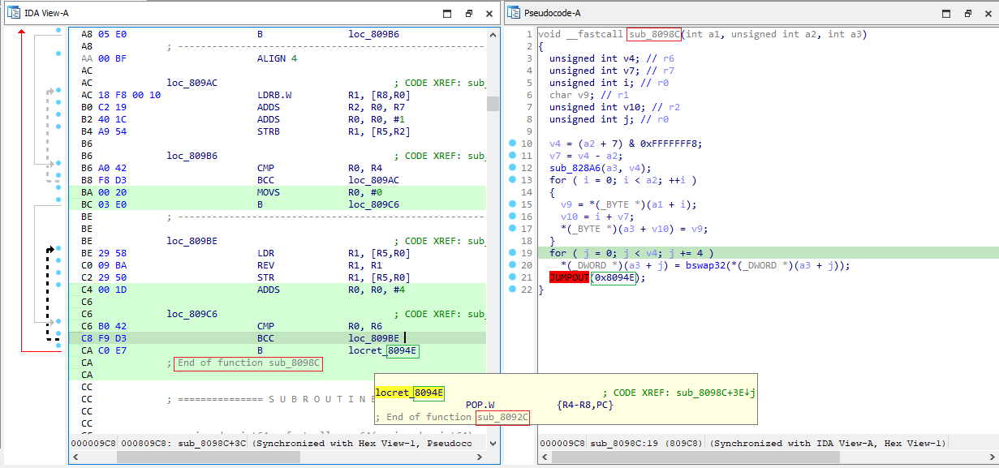

We have decompilation of `sub_8098C` which ends with a strange `JUMPOUT` statement and if we look at the disassembly, we can see that it corresponds to a branch to a `POP.W` instruction in **another function** (`sub_8092C`). What happened here?  
我们对 `sub_8098C` 进行了反编译，它以一个奇怪的 `JUMPOUT` 语句结束，如果我们查看反汇编，就会发现它对应于另一个函数中 `POP.W` 指令的分支（ `sub_8092C` ）。这里发生了什么？

This is an example of a code size optimization. The `POP.W` instruction is 4 bytes long, while the `B` branch is only two, so by reusing it the compiler saves two bytes. It may not sound like much, but such savings can accumulate to something substantial over all functions of the binary. Also, sometimes longer sequences of several instructions may be reused, leading to bigger savings.  
这是一个优化代码大小的例子。 `POP.W` 指令长 4 个字节，而 `B` 分支只有 2 个字节，因此通过重复使用该指令，编译器可以节省 2 个字节。这听起来并不多，但在二进制的所有功能中，这种节省可以累积成相当可观的效果。此外，有时可以重复使用若干条指令的较长序列，从而节省更多的费用。

Can we fix the database to get clean decompilation and get rid of `JUMPOUT`? Of course, the answer is yes, but the specific steps may be not too obvious, so let’s describe some approaches.  
我们能否修复数据库，以获得干净的反编译并摆脱 `JUMPOUT` 呢？答案当然是肯定的，但具体步骤可能不太明显，下面我们就来介绍几种方法。

### Creating a chunk for the shared tail instructions  
创建共享尾部指令块

First we need to create a chunk for the shared instructions (in our example, the `POP.W` instruction). A chunk can be created only from instructions which do not yet belong to any function, thus the easiest way is to delete the function so that instructions become “free”. This can be done either from the Functions window, via Edit > Functions > Delete function menu entry, or from the modal “jump to function” list (Ctrl–P, Del).  
首先，我们需要为共享指令（在我们的例子中是 `POP.W` 指令）创建一个分块。只有不属于任何函数的指令才能创建单元，因此最简单的方法是删除函数，使指令成为 "自由 "指令。可以在 "函数 "窗口中通过 "编辑">"函数">"删除函数 "菜单项，或者从模式 "跳转到函数 "列表（ Ctrl - P , Del ）中删除。

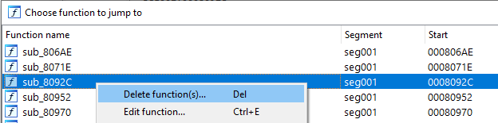

Once deleted, the shared tail instructions can be added as a chunk to the other function. This can be done manually:  
删除后，共享的尾部指令可以作为大块添加到其他函数中。这可以手动完成：

1.  select the instruction(s),  
    选择指令、
2.  invoke Edit > Functions > Append function tail…  
    调用编辑 > 函数 > 尾部附加函数...
3.  pick the referencing function (in our case, `sub_8098C`). Normally IDA should suggest it automatically.  
    选择引用函数（本例中为 `sub_8098C` ）。通常情况下，IDA 会自动推荐。

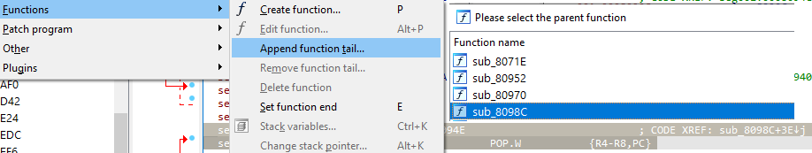

Or (semi)automatically: 或（半）自动：

1.  jump to the referencing branch (e.g. by double-clicking the `CODE XREF: sub_8098C+3E↓j` comment)  
    跳转到引用分支（例如双击 `CODE XREF: sub_8098C+3E↓j` 注释）
2.  [reanalyze](https://hex-rays.com/blog/igor-tip-of-the-week-09-reanalysis/) the branch (press C). IDA will detect that execution continues outside the current function bounds and automatically create and add the chunk for the shared tail instructions.  
    重新分析分支（按 C ）。IDA 将检测到执行继续在当前函数边界之外进行，并自动创建和添加共享尾部指令块。

Either solution will create the chunk and mark it as belonging to the referencing function.  
无论采用哪种方法，都将创建分块并将其标记为属于引用函数。

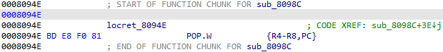

We can check that it is contained in the function graph:  
我们可以检查它是否包含在函数图中：

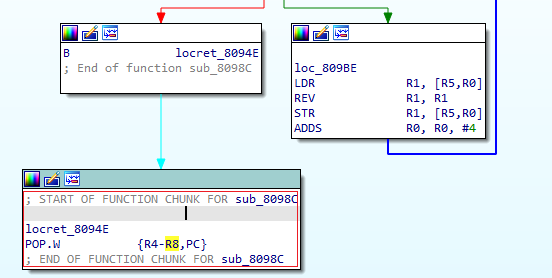

And the pseudocode no longer has a JUMPOUT:  
而且伪代码中不再有 JUMPOUT：

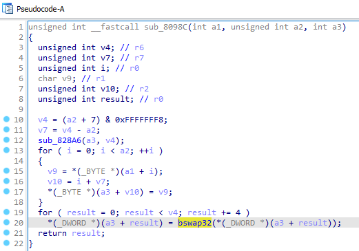

### Attaching the chunk to the original function  
将分块附加到原始函数

We “solved” the problem for one function, but in the process we’ve destroyed the function which contained the shared tail. If we need to decompile it too, we can try to recreate it:  
我们 "解决 "了一个函数的问题，但在此过程中，我们破坏了包含共享尾部的函数。如果我们也需要反编译它，我们可以尝试重新创建它：

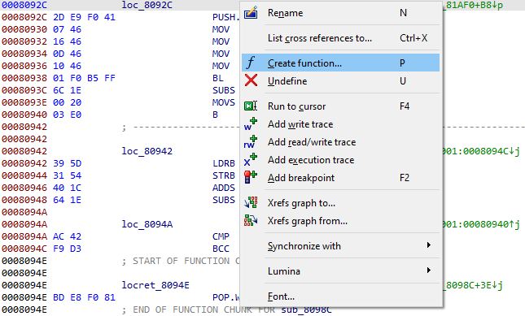

However, IDA ends it before the chunk, because it’s now a part of another function:  
但是，IDA 会在分块之前结束它，因为它现在是另一个函数的一部分：

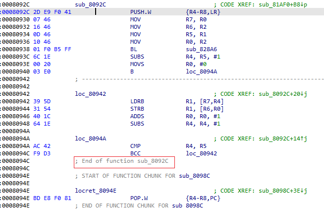

And if we decompile it, we get the same `JUMPOUT` issue:  
如果我们反编译它，就会出现同样的 `JUMPOUT` 问题：

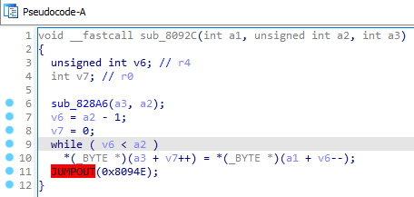

The solution is simple: as mentioned in the previous post, a chunk may belong to multiple functions, so we just need to attach the chunk to this function too:  
解决方法很简单：如上一篇文章所述，一个数据块可能属于多个函数，因此我们只需将该数据块也附加到该函数上即可：

1.  Select the instructions of the tail;  
    选择尾部指令；
2.  invoke Edit > Functions > Append function tail…  
    调用 "编辑">"函数">"附加函数尾部...
3.  select the recreated function (in our example, `sub_8092C`).  
    选择重新创建的函数（在我们的例子中为 `sub_8092C` ）。

The chunk gains one more owner, appears in the function graph, and the decompilation is fixed:  
这样，大块就多了一个所有者，出现在函数图谱中，反编译也就固定下来了：

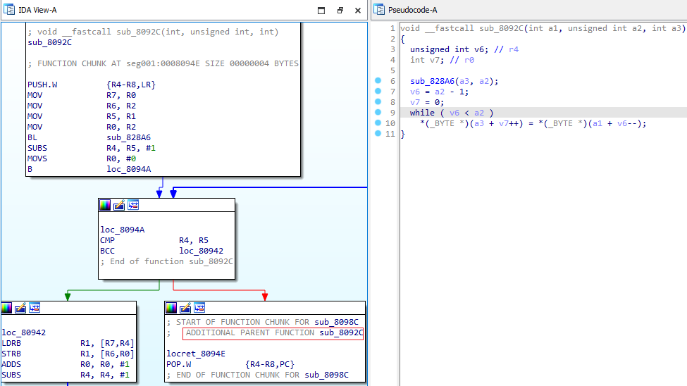

### Complex situations 复杂情况

The above example had a tail shared by two functions, but of course this is not the limit. Consider this example:  
上面的例子有两个函数共享一个尾部，但这当然不是极限。请看下面这个例子

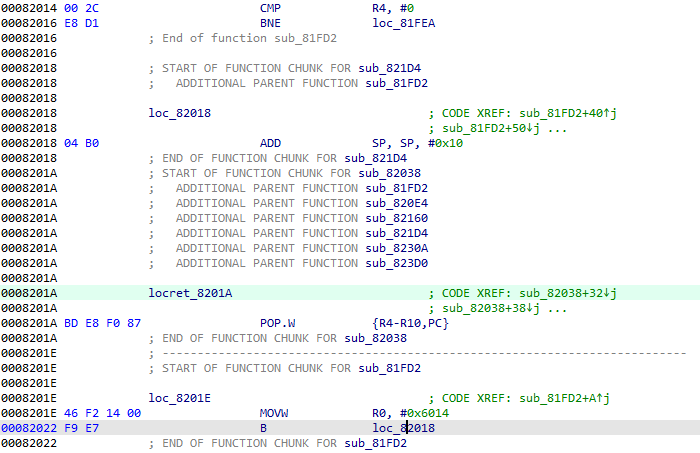

Here, the `POP.W` instruction is shared by seven functions, and two of them also reuse the `ADD SP, SP, #0x10` instruction preceding it. There is also a chunk which belongs only to one function but it had to be separated because the function was no longer contiguous. Still, IDA’s approach to fragmented functions was flexible enough to handle it with some manual help and all involved functions have proper control flow graphs and nice decompilation.  
这里的 `POP.W` 指令被七个函数共享，其中两个函数还重复使用了前面的 `ADD SP, SP, #0x10` 指令。还有一个大块只属于一个函数，但由于函数不再连续，不得不将其分离。尽管如此，IDA 处理碎片化函数的方法还是足够灵活，只需一些人工帮助就能处理，而且所有涉及的函数都有适当的控制流图和良好的反编译。

To summarize, the suggested algorithm of handling shared tail optimization is as follows:  
总之，处理共享尾部优化的建议算法如下：

1.  Delete the function containing the shared tail instructions.   
    删除包含共享尾部指令的函数。
2.  Attach the shared tail instructions to the other function(s) (manually or by reanalyzing the branches to the tail)  
    将共享尾部指令附加到其他函数（手动或通过重新分析分支到尾部
3.  Recreate the deleted function and attach the shared tail(s) to it too.  
    重新创建已删除的函数，并将共享尾部指令也附加到该函数上。