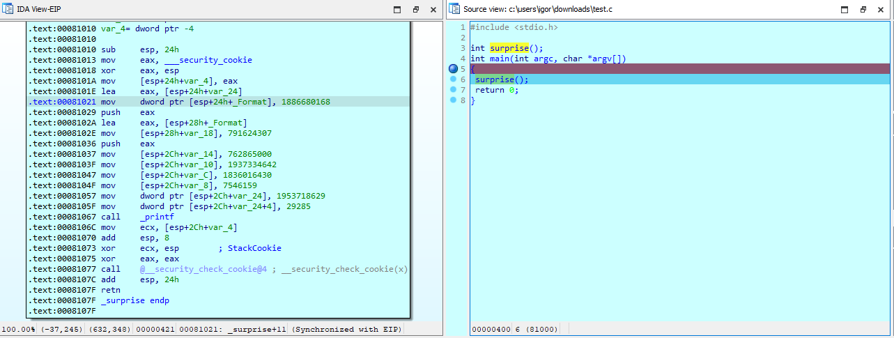
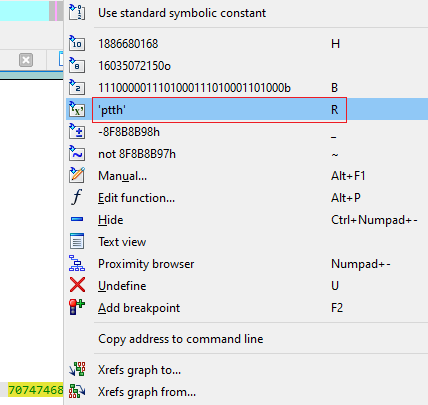
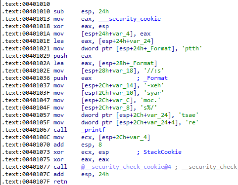
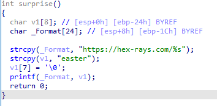
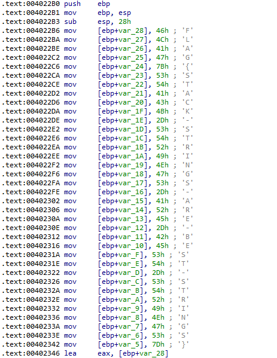

We’ve mentioned [operand representation](https://hex-rays.com/blog/igors-tip-of-the-week-46-disassembly-operand-representation/) before but today we’ll use a specific one to find the Easter egg hidden in the [post #85](https://hex-rays.com/blog/igors-tip-of-the-week-85-source-level-debugging/).  
我们以前提到过操作数表示法，但今天我们将使用一个特定的操作数表示法来找到隐藏在 #85 号帖子中的复活节彩蛋。

More specifically, it was this screenshot:  
更具体地说，就是这张截图：



The function `surprise` calls `printf`, but the arguments being passed to it seem to all be numbers. Doesn’t `printf()` usually work with strings? What’s going on?  
函数 `surprise` 调用 `printf` ，但传给它的参数似乎都是数字。 `printf()` 通常不是处理字符串吗？这是怎么回事？

### Numbers and characters 数字和字符

As you probably know, computers do not actually distinguish numbers from characters – to them they’re all just a set of bits. So it’s all a matter of _interpretation_ or _representation_. For example, all of the following are represented by the same bit pattern:  
你可能知道，计算机实际上并不区分数字和字符--对它们来说，数字和字符都只是一组比特。因此，这只是一个解释或表示的问题。例如，以下所有数字都用相同的比特模式表示：

1.  `65` (decimal number)  `65` （十进制数）
2.  `0x41`, `41h`, `H'41` (hexadecimal number)  
    `0x41` , `41h` , `H'41` （十六进制数）
3.  `0101` or `101o` (octal number)  
    `0101` 或 `101o` （八进制数）
4.  `1000001b` or `0b1000001` (binary number)  
    `1000001b` 或 `0b1000001` （二进制数）
5.  `'A'` (ASCII character)  `'A'` （ASCII 字符）
6.  `WM_COMPACTING` (Win32 API constant)  `WM_COMPACTING` （Win32 API 常量）
7.  (and many other variations)  
    (以及许多其他变体）

### Character operand representation  
字符操作数表示法

In fact, listing in the screenshot has been modified from the defaults to make the Easter egg less obvious. Here’s the original version as text:  
事实上，为了让复活节彩蛋不那么明显，截图中的列表已在默认设置的基础上进行了修改。这是原始文本版本：

```
.text:00401010 ; int surprise(...)
.text:00401010 _surprise proc near                     ; CODE XREF: _main↑p
.text:00401010
.text:00401010 var_24= dword ptr -24h
.text:00401010 var_20= dword ptr -20h
.text:00401010 _Format= byte ptr -1Ch
.text:00401010 var_18= dword ptr -18h
.text:00401010 var_14= dword ptr -14h
.text:00401010 var_10= dword ptr -10h
.text:00401010 var_C= dword ptr -0Ch
.text:00401010 var_8= dword ptr -8
.text:00401010 var_4= dword ptr -4
.text:00401010
.text:00401010 sub     esp, 24h
.text:00401013 mov     eax, ___security_cookie
.text:00401018 xor     eax, esp
.text:0040101A mov     [esp+24h+var_4], eax
.text:0040101E lea     eax, [esp+24h+var_24]
.text:00401021 mov     dword ptr [esp+24h+_Format], 70747468h
.text:00401029 push    eax
.text:0040102A lea     eax, [esp+28h+_Format]
.text:0040102E mov     [esp+28h+var_18], 2F2F3A73h
.text:00401036 push    eax                             ; _Format
.text:00401037 mov     [esp+2Ch+var_14], 2D786568h
.text:0040103F mov     [esp+2Ch+var_10], 73796172h
.text:00401047 mov     [esp+2Ch+var_C], 6D6F632Eh
.text:0040104F mov     [esp+2Ch+var_8], 73252Fh
.text:00401057 mov     [esp+2Ch+var_24], 74736165h
.text:0040105F mov     [esp+2Ch+var_20], 7265h
.text:00401067 call    _printf
.text:0040106C mov     ecx, [esp+2Ch+var_4]
.text:00401070 add     esp, 8
.text:00401073 xor     ecx, esp                        ; StackCookie
.text:00401075 xor     eax, eax
.text:00401077 call    @__security_check_cookie@4      ; __security_check_cookie(x)
.text:0040107C add     esp, 24h
.text:0040107F retn
.text:0040107F _surprise endp
```

In hexadecimal it’s almost immediately obvious: the “numbers” are actually short fragments of ASCII text. The code is building strings on the stack piece by piece. This can be made more explicit by converting numbers to the _character_ operand type (shortcut R).  
用十六进制表示几乎一目了然："数字 "实际上是 ASCII 文本的简短片段。代码正在堆栈上逐段构建字符串。通过将数字转换为字符操作数类型（快捷键 R ），可以更清楚地说明这一点。

To help you decide whether such operand type makes sense, IDA shows a preview in the context menu:  
为了帮助您判断这种操作数类型是否合理，IDA 会在上下文菜单中显示一个预览：



This way it’s pretty clear that the “number” is actually a text fragment. After converting all “numbers” to character constant, a pattern begins to emerge:  
这样一来，"数字 "实际上是一个文本片段就很清楚了。将所有 "数字 "转换为字符常数后，一种模式开始出现：



Due to the little-endian memory organization of the x86 processor family, the individual fragments have to be read backwards (i.e. character literal `'ptth'` corresponds to the string fragment `"http"`).  
由于 x86 处理器系列采用小endian 内存组织方式，因此必须反向读取各个片段（即字符字面量 `'ptth'` 对应字符串片段 `"http"` ）。

### Decompiler and optimized string operations  
解码器和优化的字符串操作

Now it’s almost obvious what the result is supposed to be but there’s in fact an even easier way to discover it.  
现在，结果是什么几乎一目了然，但其实还有更简单的方法来发现它。

Because the approach of processing short strings in register-sized chunks is often used by compilers to implement common C runtime functions inline instead of calling the library function, the decompiler uses heuristics to detect such code patterns and show them as equivalent function calls again. If we decompile this function, the decompiler reassembles the strings and shows them as if they were like that in the pseudocode:  
由于编译器经常使用以寄存器大小的块处理短字符串的方法来内联实现常用的 C 运行时函数，而不是调用库函数，因此反编译器会使用启发式方法来检测这种代码模式，并将其显示为等价的函数调用。如果我们反编译这个函数，反编译器会重新组合字符串，并将它们显示为伪代码中的字符串：



### Stack strings 堆栈字符串

Malware often uses a similar approach of building strings by small pieces (most often character by character) on the stack because this way the complete string does not appear in the binary and can’t be discovered by simply searching for it. Thanks to the automatic comments shown by IDA for operands not having explicitly assigned type, they are usually obvious in the disassembly:  
恶意软件经常使用类似的方法，在堆栈上以小块（通常是一个字符一个字符地）构建字符串，因为这样一来，完整的字符串就不会出现在二进制文件中，也就无法通过简单的搜索发现它。由于 IDA 会对未明确指定类型的操作数自动显示注释，因此它们在反汇编中通常是显而易见的：



And the decompiler easily recovers the complete string:  
反编译器可以轻松地恢复完整的字符串：

```
void __noreturn start()
{
  char v0[36]; // [esp+0h] [ebp-28h] BYREF  
  qmemcpy(v0, "FLAG{STACK-STRINGS-ARE-BEST-STRINGS}", sizeof(v0));
  [...]
 }
```

P.S. If you want to play with the Easter egg binary and reproduce the results in this post, download it here:[easter2022.zip](assets/2022/05/easter2022.zip)  
附注：如果您想玩复活节彩蛋二进制文件并重现本帖中的结果，请在此处下载：easter2022.zip