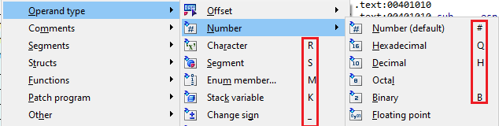
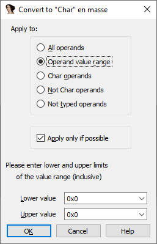

Last time we used operand types to make a function more readable and understand its behavior better. Converting operands one by one is fine if you need to do it a few times, but can quickly get tedious if you need to do it for a long piece of code.  
上次我们使用操作数类型让函数更易读，并更好地理解其行为。如果你只需要进行几次操作，那么逐个转换操作数是没有问题的，但如果你需要对一段很长的代码进行转换，那么很快就会变得乏味。

### En masse operation 集体操作

To convert operands of several instruction at once, [select them](https://hex-rays.com/blog/igor-tip-of-the-week-03-selection-in-ida/) before triggering the operation (either using the corresponding hotkey (e.g. R), or from the Edit > Operand type menu.  
要同时转换多条指令的操作数，请在触发操作前选择它们（使用相应的热键（如 R ）或从编辑 > 操作数类型菜单中选择）。

If you have a selection when triggering one of these actions, it won’t be performed immediately but another dialog will pop up first:  
如果在触发这些操作时有选择，则不会立即执行，而是先弹出另一个对话框：

Here, you can tell IDA which operands you want to actually convert. The following options are available:  
在这里，您可以告诉 IDA 要实际转换哪些操作数。有以下选项

-   All operands: all operands of selected instructions will be converted to the selected type (or back to the default/number type if they already had the chosen type);  
    所有操作数：所选指令的所有操作数都将转换为所选类型（如果已选类型，则转换回默认类型/数字类型）；
-   Operand value range: only operands with values between _Lower value_ and _Upper value_ below will be converted. For example, you could enter ‘0x20’ and ‘0x7F’ to have IDA only consider single ASCII characters like the last example from the [previous post](https://hex-rays.com/blog/igors-tip-of-the-week-88-character-operand-type-and-stack-strings/);  
    操作数值范围：只转换下限值和上限值之间的操作数。例如，您可以输入 "0x20 "和 "0x7F"，让 IDA 只考虑单 ASCII 字符，如上一篇文章中的最后一个例子；
-   <type> operands: only convert operands which already have the selected type (they will be converted back to the default/number type);  
    <type> 操作数：只转换已经具有所选类型的操作数（它们将被转换回默认类型/数字类型）；
-   Not <type> operands: only convert operands not already having the selected type. Both untyped and having another type (e.g. decimal/enum/offset) operands will be converted to the desired type;  
    非 <type> 操作数：只转换尚未选定类型的操作数。未键入和具有其他类型（如十进制/枚举/偏移）的操作数都将转换为所需类型；
-   Not typed operands: only convert operands not assigned a specific type (default/number). All operands already having an assigned type will be left as is.  
    未键入的操作数：只转换未指定特定类型（默认/数字）的操作数。所有已指定类型的操作数将保持原样。

P.S. you can use this feature not only with instructions but also data. For example, for converting several separate integers in the data section to decimal or octal. In such case, the ‘operands’ will be the data items.  
附注：该功能不仅可用于指令，也可用于数据。例如，将数据部分的几个独立整数转换为十进制或八进制。在这种情况下，"操作数 "就是数据项。

See also: [IDA Help: Perform en masse operation](https://hex-rays.com/products/ida/support/idadoc/459.shtml)  
另请参阅IDA 帮助：执行集体操作