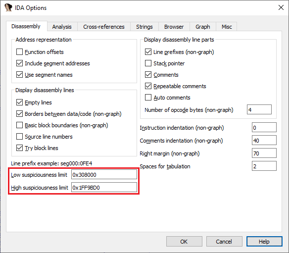
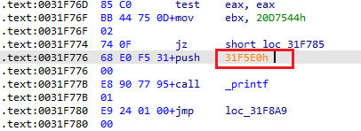
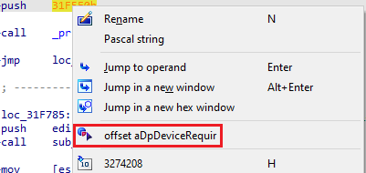

Although in general case the problem of correct disassembly is unsolvable, in practice it can get pretty close. IDA uses various heuristics to improve the disassembly and make it more readable, such as converting numerical values to offsets when it “looks plausible”. However, this is not always reliable or successful and it may miss some. To help you improve things manually, in some cases IDA can give you a hint.  
虽然在一般情况下，正确反汇编的问题是无法解决的，但在实践中，它可以达到相当接近的程度。IDA 使用各种启发式方法来改进反汇编并使其更易读，例如在 "看起来合理 "的情况下将数值转换为偏移量。不过，这种方法并不总是可靠或成功的，而且可能会遗漏一些内容。为了帮助你手动改进，在某些情况下，IDA 可以给你提示。

### Suspiciousness Limits 可疑度限制

In IDA’s Options dialog on the Disassembly tab, there are two fields: _Low suspiciousness limit_ and _High suspiciousness limit_. What do they mean?  
在 IDA 的 "选项 "对话框的 "反汇编 "选项卡上，有两个字段：低可疑度限制和高可疑度限制。它们是什么意思？

Whenever IDA outputs an instruction operand with the numerical value in that range, and it does not yet have an explicitly set type (i.e. it has the default AKA _void_ type), it will use a special color (orange in the default color scheme):  
只要 IDA 输出的指令操作数的数值在该范围内，且尚未明确设置类型（即默认为 AKA void 类型），就会使用一种特殊颜色（默认配色方案中为橙色）：

In such situation, you could, for example, [hover your mouse](https://hex-rays.com/blog/igors-tip-of-the-week-47-hints-in-ida/) over the value to see if the target looks like a valid destination, and convert it to an offset either using a hotkey (O) or via the context menu.  
在这种情况下，您可以将鼠标悬停在数值上，查看目标是否看起来像一个有效的目标，然后使用热键（O）或通过上下文菜单将其转换为偏移量。

### Changing the Suspiciousness Limits  
更改可疑度限制

Initial values of the limits are taken from the input file’s loaded address range. If the valid address range changes (for example, if you rebase the database or create additional segments), it may make sense to update the ranges so you can see more of potential addresses. Conversely, you can also change the values to exclude some ranges which are unlikely to be valid addresses to reduce the false positives.  
限值的初始值取自输入文件的加载地址范围。如果有效地址范围发生变化（例如，重新建立数据库或创建其他段），可能需要更新范围，以便查看更多潜在地址。反之，您也可以更改数值，排除一些不太可能是有效地址的范围，以减少误报。

See also: [IDA Help: Low & High Suspicious Operand Limits](https://www.hex-rays.com/products/ida/support/idadoc/606.shtml)  
另请参见：IDA 帮助：可疑操作符的低值和高值限制