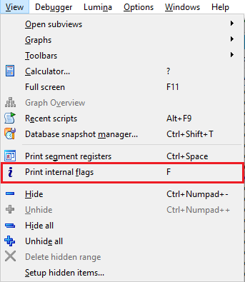
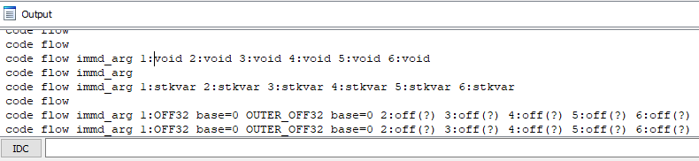
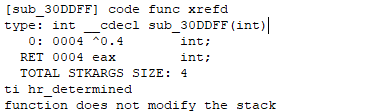

When changing [operand representation](https://hex-rays.com/blog/igors-tip-of-the-week-46-disassembly-operand-representation/), you may need to check what are the operand types currently used by IDA for a specific instruction. In some cases it is obvious (e.g. for offset or character type), but the hex and default, for example, look exactly the same in most processors so it’s not easy to tell them apart just by look.   
在更改操作数表示法时，您可能需要检查 IDA 目前用于特定指令的操作数类型。在某些情况下这是显而易见的（例如偏移量或字符类型），但例如十六进制和默认值在大多数处理器中看起来是完全一样的，因此仅凭外观很难将它们区分开来。

Internally, this information is stored by IDA in the _item flags_. To check the current flags of an instruction (or any other address) in the database, use View > Print internal flags (hotkey F) .  
在内部，IDA 将这些信息存储在项目标志中。要查看数据库中指令（或任何其他地址）的当前标志，请使用查看 > 打印内部标志（热键 F ）。

Wen you invoke this action, IDA prints flags for the current address to the Output window. It only prints info about non-default operand types — the default ones are omitted (except for [suspicious operands](https://hex-rays.com/blog/igors-tip-of-the-week-77-mapped-variables/) which are printed as _void_).  
调用此操作后，IDA 将在输出窗口中打印当前地址的标志。它只打印非默认操作数类型的信息 - 默认操作数类型被省略（可疑操作数除外，它们被打印为 void）。

_code_ and _flow_ are generic instruction flags: they mean that the current item is marked as code (instruction) and the execution reaches it from the previous address (this is the case for most instructions in the program).   
code和flow是通用指令标志：它们表示当前项目被标记为代码（指令），执行从上一个地址开始（程序中的大多数指令都是这种情况）。

Whenever IDA prints information about the second operand (number 1 since they are counted from 0), the operands 2,3…6 (even if they do not actually exist) are also printed as having the same type. This happens because of a limitation in IDA: it originally supported user-specified representation only for two operands (0 and 1) and this limitation is not completely lifted yet as of IDA 7.7.  
每当 IDA 打印第二个操作数（数字 1，因为它们是从 0 开始计数的）的信息时，操作数 2、3...6（即使它们实际上并不存在）也会被打印为具有相同的类型。出现这种情况的原因是 IDA 的一个限制：IDA 最初只支持用户指定两个操作数（0 和 1）的表示法，而在 IDA 7.7 中，这一限制尚未完全解除。

Besides operand types, the feature may show other low-level info about the current address: for example, the type information if it’s set for current location, the function arguments layout similarly to what you can see in [decompiler annotations](https://hex-rays.com/blog/igors-tip-of-the-week-66-decompiler-annotations/), structure name for structure data items, and so on.  
除了操作数类型外，该功能还可以显示当前地址的其他底层信息：例如，类型信息（如果已为当前位置设置）、函数参数布局（类似于反编译器注释中的布局）、结构数据项的结构名等等。

