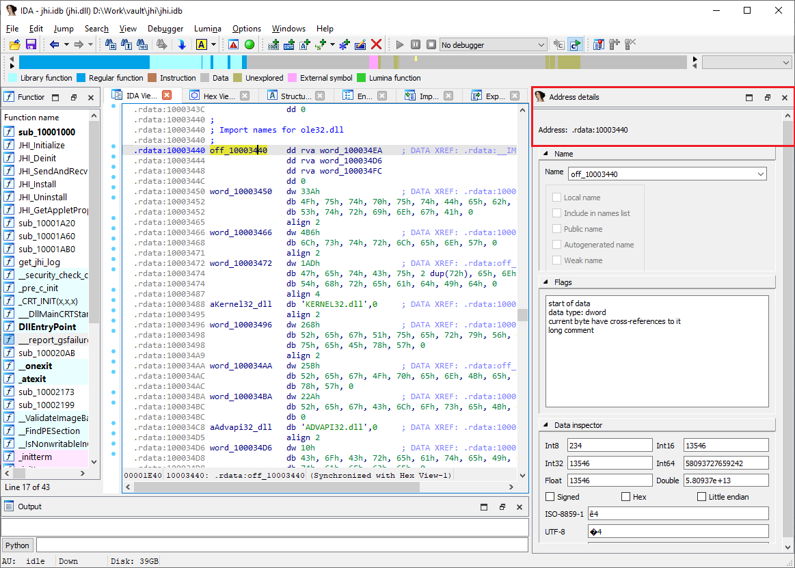

The address details pane is a rather recent addition to IDA so probably not many users are familiar with it yet. However, it can be a quite useful addition to the standard workflow, permitting you to perform some common tasks faster.  
地址详细信息窗格是 IDA 最新添加的功能，因此可能还没有多少用户熟悉它。不过，它可以作为标准工作流程的有益补充，让您可以更快地执行一些常见任务。

### Address details view 地址详细信息视图

On invoking View > Open subview > Address details (you can also use the [Quick view](https://hex-rays.com/blog/igors-tip-of-the-week-30-quick-views/) selector), a new pane appears, by default on the right side of the main window. Obviously, it can be moved and docked elsewhere if you prefer. It will automatically update itself using the current address in any address-based view (IDA View, Hex View, Pseudocode).  
调用 "视图">"打开子视图">"地址详细信息"（也可以使用快速视图选择器）时，会出现一个新窗格，默认位于主窗口的右侧。当然，如果您愿意，也可以将其移动并停靠在其他位置。它会根据任何基于地址的视图（IDA 视图、十六进制视图、伪代码）中的当前地址自动更新。

The pane consists of three sections, each of which can be collapsed and expanded using the triangle icon in the top left corner.  
窗格由三个部分组成，每个部分都可以使用左上角的三角形图标进行折叠和展开。

### Name section 名称部分

This is basically a non-modal version of the standard Rename address dialog (N hotkey). It allows you to quickly rename locations by entering a new name in the edit box as well as view and change various name attributes.  
这基本上是标准 "重命名地址 "对话框（ N 热键）的非模式版本。您可以通过在编辑框中输入新名称来快速重命名位置，还可以查看和更改各种名称属性。

### Flags section 标志部分

This is an expanded version of the [Print internal flags](https://hex-rays.com/blog/igors-tip-of-the-week-91-item-flags/) action, however currently it does not provide details of instruction operands.  
这是打印内部标志操作的扩展版本，但目前不提供指令操作数的详细信息。

### Data inspector section 数据检查器部分

This section shows how the bytes at the current address can be interpreted in various formats: integers, floating-point values, or string literals. It can be especially useful when exploring unknown file formats or arrays of unknown data in programs.  
该部分显示当前地址下的字节如何以各种格式解释：整数、浮点数值或字符串文字。在探索未知文件格式或程序中的未知数据数组时，它尤其有用。