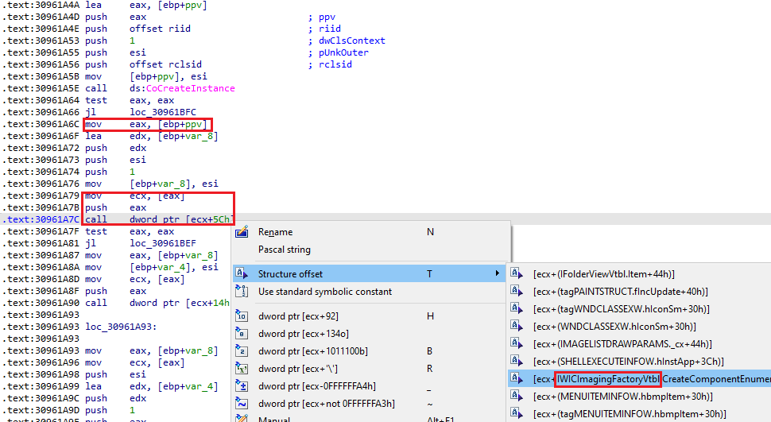
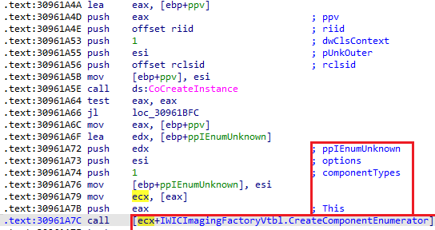
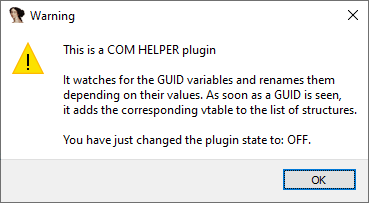

COM aka Component Object Model is the technology used by Microsoft (and others) to create and use reusable software components in a manner independent from the specific language or vendor. It uses a stable and well-defined ABI which is mostly compatible with Microsoft C++ ABI, allowing easy implementation and usage of COM components in C++.  
COM 又称组件对象模型（Component Object Model），是微软（及其他公司）用来创建和使用可重复使用的软件组件的技术，其方式独立于特定的语言或供应商。它使用稳定且定义明确的 ABI，该 ABI 与 Microsoft C++ ABI 基本兼容，因此可以在 C++ 中轻松实现和使用 COM 组件。

### COM basics COM 基础知识

COM components and their interfaces are identified by [UUID aka GUID](https://en.wikipedia.org/wiki/Universally_unique_identifier) – unique 128-bit IDs usually represented as string of several hexadecimal number groups. For example, `{00000000-0000-0000-C000-000000000046}` represents `IUnknown` – the base interface which must be implemented by any COM-conforming component.   
COM 组件及其接口由 UUID（又称 GUID）标识--唯一的 128 位 ID，通常用多个十六进制数组的字符串表示。例如， `{00000000-0000-0000-C000-000000000046}` 表示 `IUnknown` --任何符合 COM 标准的组件都必须实现的基本接口。

Each COM interface provides a set of functions in a way similar to a C++ class. On the binary level, this is represented by a structure with function pointers, commonly named `<name>Vtbl`. For example, here’s how the `IUnknown` is laid out:  
每个 COM 接口都以类似于 C++ 类的方式提供一组功能。在二进制层面上，它由一个带有函数指针的结构来表示，通常命名为 `<name>Vtbl` 。例如，下面是 `IUnknown` 的布局：

```
struct IUnknownVtbl
{
  HRESULT (__stdcall *QueryInterface)(IUnknown *This, const IID *const riid, void **ppvObject);
  ULONG (__stdcall *AddRef)(IUnknown *This);
  ULONG (__stdcall *Release)(IUnknown *This);
};
struct IUnknown
{
  struct IUnknownVtbl *lpVtbl;
};
```

IDA’s standard type libraries include most of the COM interfaces defined by the Windows SDKs, so you can import these structures from them. Here’s how to do it manually:  
IDA 的标准类型库包括 Windows SDK 定义的大多数 COM 接口，因此您可以从中导入这些结构。下面是手动导入的方法：

1.  Open the Structures window (Shift–F9);  
    打开结构窗口（ Shift - F9 ）；
2.  Use “Add struct type…” from the context menu, or Ins;  
    使用上下文菜单中的 "添加结构类型..."，或 Ins ；
3.  Type the name of the interface and/or its vtable (e.g. `IUnknownVtbl`) and click OK. If the interface is known, it will be imported from the type library automatically. If you are not sure it is available, you can click “Add standard structure” and use incremental search (start typing the name) to check if it’s present in the list of available types.  
    键入接口和/或其 vtable 的名称（例如 `IUnknownVtbl` ），然后单击 "确定"。如果接口已知，将自动从类型库中导入。如果不确定接口是否可用，可以点击 "添加标准结构"，然后使用增量搜索（开始键入名称）检查接口是否出现在可用类型列表中。

Once imported, the struct can be used, for example, to label indirect calls performed using the interface pointer.  
一旦导入，该结构体就可用于标记使用接口指针执行的间接调用。

How to know which interface is being used in the code? There are multiple ways it can be done, but one common approach is to use the `[CoCreateInstance](https://docs.microsoft.com/en-us/windows/win32/api/combaseapi/nf-combaseapi-cocreateinstance)` API. It returns a pointer to the interface defined by the interface ID (IID) which is a kind of GUID. You can check what IID is used, then search for it in Windows SDK headers and hopefully find the interface name.  
如何知道代码中使用的是哪个接口？有多种方法，但一种常见的方法是使用 `[CoCreateInstance](https://docs.microsoft.com/en-us/windows/win32/api/combaseapi/nf-combaseapi-cocreateinstance)` API。它返回一个指向由接口 ID（IID）定义的接口的指针，接口 ID 是一种 GUID。您可以查看使用的是哪个 IID，然后在 Windows SDK 头文件中搜索，希望能找到接口名称。

For example, consider this call:  
例如，请看这个调用：

```
.text:30961A4D push    eax                             ; ppv
.text:30961A4E push    offset riid                     ; riid
.text:30961A53 push    1                               ; dwClsContext
.text:30961A55 push    esi                             ; pUnkOuter
.text:30961A56 push    offset rclsid                   ; rclsid
.text:30961A5B mov     [ebp+ppv], esi
.text:30961A5E call    ds:CoCreateInstance
```

If we follow `riid`, we can see that it’s been formatted by IDA nicely as an instance of the `IID` structure:  
如果我们跟踪 `riid` ，就会发现 IDA 很好地将其格式化为 `IID` 结构的实例：

```
.text:30961C18 riid dd 0EC5EC8A9h                           ; Data1
.text:30961C18                                         ; DATA XREF: sub_30961A2E+20↑o
.text:30961C18                                         ; sub_30DECD76+1D↓o
.text:30961C18 dw 0C395h                               ; Data2
.text:30961C18 dw 4314h                                ; Data3
.text:30961C18 db 9Ch, 77h, 54h, 0D7h, 0A9h, 35h, 0FFh, 70h; Data4
```

In the text form, this corresponds to `EC5EC8A9-C395-4314-9C77-54D7A935FF70`, but since it’s quite awkward to convert from the struct representation, a quick way is to search for `EC5EC8A9` and see if you can find a match.  
在文本形式中，它对应于 `EC5EC8A9-C395-4314-9C77-54D7A935FF70` ，但由于从结构表示法转换过来非常麻烦，所以快速的方法是搜索 `EC5EC8A9` ，看看是否能找到匹配。

There is one in `wincodec.h`:   
在 `wincodec.h` 中有一个：

```
    MIDL_INTERFACE("ec5ec8a9-c395-4314-9c77-54d7a935ff70")
    IWICImagingFactory : public IUnknown
    {
    public:
        virtual HRESULT STDMETHODCALLTYPE CreateDecoderFromFilename( 
            /* [in] */ __RPC__in LPCWSTR wzFilename,
            /* [unique][in] */ __RPC__in_opt const GUID *pguidVendor,
            /* [in] */ DWORD dwDesiredAccess,
            /* [in] */ WICDecodeOptions metadataOptions,
            /* [retval][out] */ __RPC__deref_out_opt IWICBitmapDecoder **ppIDecoder) = 0;
    [....]        
```

Now that we know we’re dealing with `IWICImagingFactory`, we can import `IWICImagingFactoryVtbl` and  use it to label the calls made later by dereferencing the `ppv` variable:  
现在我们知道我们正在处理的是 `IWICImagingFactory` ，我们可以导入 `IWICImagingFactoryVtbl` 并使用它来标记以后通过取消引用 `ppv` 变量进行的调用：



IDA uses type information of the structure’s function pointer to label and [propagate argument information](https://hex-rays.com/blog/igors-tip-of-the-week-74-parameter-identification-and-tracking-pit/):  
IDA 使用结构体函数指针的类型信息来标记和传播参数信息：



While this process works, it is somewhat tedious and error prone. Is there something better?  
虽然这个过程可行，但有些繁琐，而且容易出错。有没有更好的办法？

### COM helper COM 助手

IDA ships with a standard plugin which can automate some parts of the process. If you invoke Edit > Plugins > COM Helper, it shows a little help about what it does:  
IDA 提供了一个标准插件，可以自动完成部分流程。如果调用 "编辑">"插件">"COM 助手"，就会显示有关其作用的帮助信息：



Invoke the menu again to re-enable it. The default state is _on_ for new databases, so normally you do not need to do that. With plugin enabled, we can do the following:  
再次调用菜单即可重新启用。新数据库的默认状态是打开，因此通常不需要这样做。启用插件后，我们可以执行以下操作：

1.  Undefine/delete the IID instance at `riid`.  
    取消/删除 `riid` 处的 IID 实例。
2.  Redefine it as a GUID (Alt-Q, choose “GUID”).  
    将其重新定义为 GUID（Alt-Q，选择 "GUID"）。

If the GUID is known, the instance is renamed to `CLSID_<name>`, and the corresponding `<name>Vtbl` is imported into the database automatically (if available in loaded type libraries). You can then use it to resolve the indirect calls from the interface pointer.  
如果 GUID 已知，则实例会重命名为 `CLSID_<name>` ，相应的 `<name>Vtbl` 会自动导入数据库（如果已加载的类型库中有的话）。然后就可以用它来解析接口指针的间接调用。

### Extending the known interface list  
扩展已知接口列表

To detect known GUIDs, on Windows the COM Helper uses the registry (`HKLM\Software\Classes\Interface`subtree). If the GUID is not found in registry (or not running on Windows), the file `cfg/clsid.cfg` in IDA’s install directory is consulted. It is a simple text file with the list of GUIDs and corresponding names. If you are dealing with lesser-known interfaces, you can add their GUIDs to this file so that they can be labeled nicely.  
在 Windows 系统中，COM Helper 使用注册表（ `HKLM\Software\Classes\Interface` 子树）来检测已知 GUID。如果在注册表中找不到 GUID（或未在 Windows 上运行），则会查阅 IDA 安装目录中的 `cfg/clsid.cfg` 文件。这是一个简单的文本文件，包含 GUID 列表和相应名称。如果您要处理的是不太知名的接口，可以将它们的 GUID 添加到该文件中，以便为它们贴上漂亮的标签。