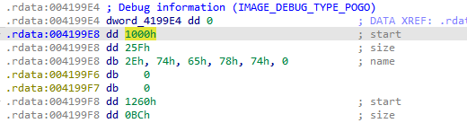

Variable-sized structures is a construct used to handle binary structures of variable size with the advantage of compile-time type checking.  
可变大小结构是一种用于处理可变大小二进制结构的结构，具有编译时类型检查的优点。

### In source code 在源代码中

Usually such structures use a layout similar to following:  
通常，此类结构的布局类似于以下结构：

```
struct varsize_t
{
 // some fixed fields at the start
 int id;
 size_t datalen;
 //[more fields]
 unsigned char data[];// variable part
};
```

In other words, a fixed-layout part at the start and an array of unspecified size at the end.  
换句话说，开头是固定布局部分，结尾是未指定大小的数组。

Some compilers do not like `[]` syntax so `[0]` or even `[1]` may be used too. At runtime, the space for the structure is allocated using the full size, and the array can be accessed as if it had expected size. For example:  
有些编译器不喜欢 `[]` 语法，所以也可以使用 `[0]` 甚至 `[1]` 。在运行时，结构体的空间是按全尺寸分配的，因此可以像访问预期尺寸的数组一样访问数组。例如

```
struct varsize_t* allocvar(int id, void *data, size_t datalen);
{
 size_t fullsize = sizeof(varsize_t)+datalen+1;
 struct varsize_t *var = (struct varsize_t*) malloc(fullsize);
 var-&gt;id = id;
 var-&gt;datalen = datalen;
 memcpy(var-&gt;data, data, datalen);
 var-&gt;data[datalen]=0;
 return var;
}
```

Can such structs be handled by IDA? Yes, but there are some peculiarities you may need to be aware of.  
IDA 可以处理这种结构吗？可以，但您可能需要注意一些特殊情况。

### In the decompiler 在反编译器中

In the decompiler everything is pretty simple: just add the struct using C syntax to [Local Types](https://hex-rays.com/blog/igor-tip-of-the-week-11-quickly-creating-structures/) and use it for types of local variables and function arguments. The decompiler automatically detects accesses to the variable part and represents them accordingly.  
在反编译器中，一切都非常简单：只需使用 C 语言语法将结构体添加到本地类型（Local Types）中，并将其用于本地变量和函数参数的类型。反编译器会自动检测对变量部分的访问，并相应地表示出来。


### In disassembly 在反汇编中

However, disassembly view is trickier. You can import the struct from Local Types to the IDB Structures, or create one manually by explicitly adding an array of 0 elements at the end:  
不过，反汇编视图比较棘手。您可以将 struct 从 Local Types 导入 IDB Structures，或者在末尾明确添加一个 0 元素数组，从而手动创建一个 struct：

```
00000000 varsize_t struc ; (sizeof=0x8, align=0x4, copyof_1, variable size)
00000000 id dd ?
00000004 datalen dd ?
00000008 data db 0 dup(?)
00000008 varsize_t ends
```

But when you have instances of such structs in data area, using this definition only covers the fixed part. To extend the struct, use * (Create/resize array action) and specify the full size of the struct.  
但当数据区中有此类结构体的实例时，使用此定义只能覆盖固定部分。要扩展结构体，请使用 * （创建/调整数组大小操作）并指定结构体的完整大小。

### Example 示例

Recent Microsoft compilers add so-called “COFF group” info to the PE executables. It is currently not fully parsed by IDA but is labeled in the disassembly listing with the comment `IMAGE_DEBUG_TYPE_POGO`:  
最近的微软编译器在 PE 可执行文件中添加了所谓的 "COFF 组 "信息。目前 IDA 还不能完全解析这些信息，但会在反汇编列表中标注 `IMAGE_DEBUG_TYPE_POGO` 注释：

`.rdata:004199E4 ; Debug information (IMAGE_DEBUG_TYPE_POGO)`  
`.rdata:004199E4 dword_4199E4 dd 0 ; DATA XREF: .rdata:004196BC↑o`  
`.rdata:004199E8 dd 1000h, 25Fh, 7865742Eh, 74h, 1260h, 0BCh, 7865742Eh, 69642474h, 0`  
`.rdata:00419A0C dd 1320h, 11BE2h, 7865742Eh, 6E6D2474h, 0`  
`.rdata:00419A20 dd 12F10h, 12Ch, 7865742Eh, 782474h, 13040h, 164h, 7865742Eh, 64792474h`  
`.rdata:00419A20 dd 0`  
`.rdata:00419A44 dd 14000h, 11Ch, 6164692Eh, 35246174h, 0`  
`.rdata:00419A58 dd 1411Ch, 4, 6330302Eh, 6766h, 14120h, 4, 5452432Eh, 41435824h, 0`  
`.rdata:00419A7C dd 14124h, 4, 5452432Eh, 41435824h, 41h, 14128h, 1Ch, 5452432Eh, 55435824h`

On expanding the array or looking at the hex view, it becomes apparent that it stores info about the original section names of the executable, before they are merged by the linker. So it can be useful to format this info. It seems to consist of a list of following structures:  
在扩展数组或查看十六进制视图时，我们会发现它存储了可执行文件原始部分名称的信息，这些信息在链接器合并之前就已存在。因此，对这些信息进行格式化是很有用的。它似乎由以下结构的列表组成：

```
struct section_info
{
  int start; // RVA
  int size;
  char name[]; // zero-terminated
};
```

The string is padded with zeroes if necessary to align each struct on a 4-byte boundary.  
如有必要，我们会在字符串中填充 0，以便将每个结构体与 4 字节边界对齐。

After creating a local type and importing the struct to IDB, we can undefine the array created by IDA and start creating struct instances in the area using Edit > Struct var… (Alt–Q). However, only the fixed part is covered by default:  
创建本地类型并将结构导入 IDB 后，我们可以取消 IDA 创建的数组定义，然后使用编辑 > 结构变量...（ Alt - Q ）开始在该区域创建结构实例。不过，默认情况下只覆盖固定部分：


To extend the struct, press * and enter full size. For example, the first one should be 14 (8 for the fixed part and 6 for “.text” and terminating zero), although you can also use the suggested 16:  
要扩展结构体，请按 * 并输入完整尺寸。例如，第一个应为 14（固定部分为 8，".text "和终止零为 6），当然也可以使用建议的 16：




Now the struct has correct size and covers the string but it is printed as hex bytes and not text. Why and how to fix it?  
现在，结构体大小正确，覆盖了字符串，但打印出来的是十六进制字节，而不是文本。为什么以及如何解决？

When IDA converts C type to assembly-level (IDB) struct, it only relies on the sizes of C types, because on the assembly level there is [no difference between a a byte and character](https://hex-rays.com/blog/igors-tip-of-the-week-46-disassembly-operand-representation/). Thus a char array is the same as a byte array. However, you can still apply additional representation flags to influence formatting of the structure. For example, you can go to the imported definition in Structures list and mark the `name` field as a string literal, either from context menu or by pressing A:  
当 IDA 将 C 类型转换为汇编级（IDB）结构体时，它只依赖于 C 类型的大小，因为在汇编级上，字节和字符之间没有区别。因此，字符数组与字节数组是一样的。不过，你仍然可以使用额外的表示标志来影响结构的格式化。例如，您可以进入结构体列表中的导入定义，并通过上下文菜单或按下 A 将 `name` 字段标记为字符串字面形式：


The field is now commented correspondingly and the data instances show the string as text:  
现在该字段已被相应注释，数据实例也将字符串显示为文本：


In fact, once you mark the field as string, newly declared instances will be automatically sized by IDA using the zero terminator.  
事实上，一旦将字段标记为字符串，IDA 就会使用零终止符自动调整新声明实例的大小。


See also: 另请参见：

[Variable Length Structures Tutorial  
变长结构教程](https://hex-rays.com/products/ida/support/tutorials/varstr/)  
[IDA Help: Convert to array  
IDA 帮助：转换为数组](https://www.hex-rays.com/products/ida/support/idadoc/455.shtml)  
[IDA Help: Assembler level and C level types  
IDA 帮助：汇编器级和 C 级类型](https://www.hex-rays.com/products/ida/support/idadoc/1042.shtml)  
[IDA Help: Structures window  
IDA 帮助：结构窗口](https://www.hex-rays.com/products/ida/support/idadoc/593.shtml)