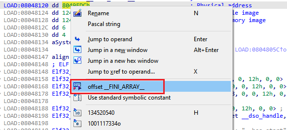
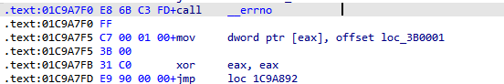
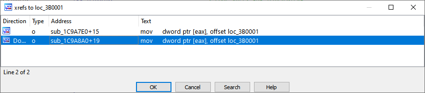
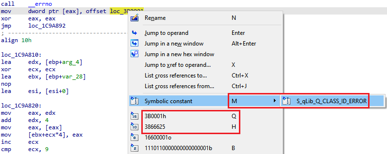

As we’ve [mentioned before](https://hex-rays.com/blog/igors-tip-of-the-week-46-disassembly-operand-representation/), the same numerical value can be used represented in different ways even if it’s the same bit pattern on the binary level. One of the representations used in IDA is offset.  
正如我们之前提到的，即使是二进制层面上的相同比特模式，相同的数值也可以用不同的方式表示。偏移量就是 IDA 中使用的一种表示方法。

### Offsets 偏移量

In IDA, an _offset_ is a numerical value which is used as an address (either directly or as part of an expression) to refer to another location in the program.  
在 IDA 中，偏移量是一个数值，用来作为地址（直接或作为表达式的一部分），指向程序中的另一个位置。

The term comes from the keyword used in MASM (Microsoft Assembler) to distinguish an address expression from a variable.  
该术语来自 MASM（微软汇编程序）中用于区分地址表达式和变量的关键字。

For example: 例如

```
mov eax, g_var1
```

Loads  the value from the  location `g_var1` into register `eax`. In C, this would be equivalent to using the variable’s value.  
将位置 `g_var1` 的值加载到寄存器 `eax` 中。 在 C 语言中，这相当于使用变量的值。

While  而

```
mov eax, offset g_var1
```

Loads the _address_ of the location `g_var1` into `eax`. In C, this would be equivalent to taking the variable’s address.  
将位置 `g_var1` 的地址加载到 `eax` 中。 在 C 语言中，这相当于获取变量的地址。

On the binary level, the second instruction is equivalent to moving of a simple integer, e.g.:   
在二进制层面上，第二条指令相当于移动一个简单的整数，例如......：

```
mov eax, 0x40002000
```

However, during analysis the offset form is obviously preferred, both for readability and because it allows you to see cross-references to variables and be able to quickly identify other places where the variable is used.  
不过，在分析过程中，偏移量形式显然更受欢迎，因为它不仅具有可读性，还能让你看到变量的交叉引用，并能快速识别其他使用变量的地方。

In general, distinguishing integer values used in instructions from addresses is impossible without whole program analysis or runtime tracing, but the majority of cases can be handled by relatively simple heuristics so usually IDA is able to recover offset expressions and add cross-references. However, in some cases they may fail or produce false positives so you may need to do it manually.  
一般来说，如果不对整个程序进行分析或运行时跟踪，就无法将指令中使用的整数值与地址区分开来，但大多数情况都可以通过相对简单的启发式方法来处理，因此 IDA 通常能够恢复偏移表达式并添加交叉引用。不过，在某些情况下，它们可能会失败或产生误报，因此您可能需要手动操作。

### Converting values to offsets  
将数值转换为偏移量

All options for converting to offsets are available under Edit > Operand type > Offset:  
在 "编辑"（Edit）>"操作符类型"（Operand type）>"偏移"（Offset）下，可以找到将数值转换为偏移的所有选项：


In most modern, flat-memory model binaries such as ELF, PE, Mach-O, the first two commands are equivalent, so you can usually use shortcut O or Ctrl–O.  
在 ELF、PE、Mach-O 等大多数现代扁平内存模型二进制文件中，前两条命令是等价的，因此通常可以使用快捷方式 O 或 Ctrl - O 。

The most common/applicable options are also shown in the context (right-click) menu:  
最常用/最适用的选项也会显示在上下文（右键单击）菜单中：



### Fixing false positives 修正误报

There may be cases when IDA’s heuristics convert a value to an offset when it’s not actually being used as one. One common example is bitwise operations done with values which happen to be in the range of the program’s address space, but it can also happen for data values or simple data movement, like on the below screenshot.  
在某些情况下，IDA 的启发式方法会将某个值转换为偏移量，而实际上它并没有被用作偏移量。一个常见的例子是对程序地址空间范围内的值进行位运算，但也可能发生在数据值或简单的数据移动中，如下面的截图。



In this example, IDA has converted the second operand of the `mov` instruction to an offset because it turned out to match a program address. However, we can see that it is being moved into a location returned by the call to `__errno` function. This is a common way compilers implement setting of the `errno` pseudo-variable (which can be thread-specific instead of a global), so obviously that operand should be a number and not an offset. Besides being a wrong representation, this also lead to bogus cross-references:  
在本例中，IDA 将 `mov` 指令的第二个操作数转换为偏移量，因为它与程序地址相匹配。不过，我们可以看到，它被移到了调用 `__errno` 函数返回的位置。这是编译器实现 `errno` 伪变量（可以是线程专用的，而不是全局的）设置的常见方式，因此操作数显然应该是一个数字，而不是偏移量。除了表示方法错误外，这还会导致错误的交叉引用：



You have the following options to fix the false positive:  
你有以下几种方法来修复误报：

1.  Press O or Ctrl–O to reset the “offset” attribute of the operand and let IDA show the default representation (hex). Note that the number will be printed in orange to hint that its value falls into the address space of the program, i.e. it is [suspicious](https://hex-rays.com/blog/igors-tip-of-the-week-90-suspicious-operand-limits/);  
    按 O 或 Ctrl - O 重置操作数的 "偏移 "属性，让 IDA 显示默认表示法（十六进制）。请注意，数字将以橙色打印，以提示其值属于程序的地址空间，即它是可疑的；
2.  Use Q/# (for hex), H (for decimal), or select the corresponding option from the context menu to explicitly mark the operand as a number and also avoid flagging it as suspicious;  
    使用 Q / # （十六进制）、 H （十进制），或从上下文菜单中选择相应选项，将操作数明确标记为数字，同时避免标记为可疑数字；
3.  If you have created an enumeration to represent such numbers as symbolic constants, you can use the M shortcut or the context menu to convert it to a symbolic constant.  
    如果您已创建了一个枚举来将此类数字表示为符号常量，则可以使用 M 快捷键或上下文菜单将其转换为符号常量。



See also: 另请参见：

[IDA Help: Edit|Operand types|Offset submenu  
IDA 帮助：编辑|操作符类型|偏移量子菜单](https://www.hex-rays.com/products/ida/support/idadoc/1381.shtml)

[IDA Help: Edit|Operand types|Number submenu  
IDA 帮助：编辑|操作符类型|编号子菜单](https://www.hex-rays.com/products/ida/support/idadoc/1382.shtml)     