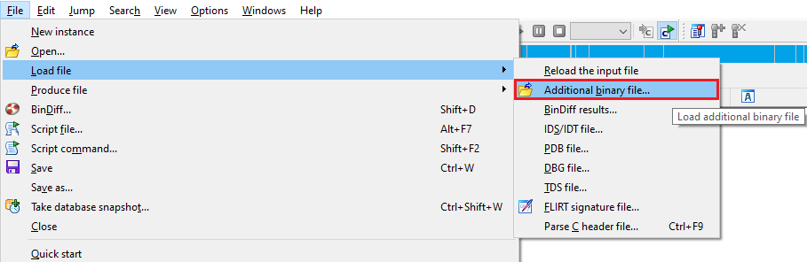
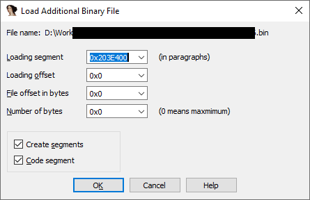

Although most of the time IDA is used to work on single, self-contained file (e.g. an executable, library, or a firmware image), this is not always the case. Sometimes the program may refer to or load additional files or data, and it may be useful to have that data in the database and analyze it together with the original file.  
虽然大多数情况下，IDA 是用于处理单个独立文件（如可执行文件、库或固件映像），但情况并非总是如此。有时，程序可能会引用或加载其他文件或数据，这时，将这些数据存入数据库并与原始文件一起进行分析可能会很有用。

### Load Additional Binary File  
加载附加二进制文件

For simple cases where you have a raw binary file with the contents you want to add to the database, you can use File > Load file > Additional binary file…  
在简单的情况下，如果您有一个原始二进制文件，其中包含您想添加到数据库的内容，您可以使用文件 > 加载文件 > 附加二进制文件...

Please note that any file you select will be treated as raw binary, even for formats otherwise supported by IDA (e.g. PE/ELF/Mach-O). Once you select a file, IDA will show you the dialog to specify where exactly you want to load it:  
请注意，您选择的任何文件都将被视为原始二进制文件，即使是 IDA 支持的其他格式（如 PE/ELF/Mach-O）。选择文件后，IDA 会显示对话框，让您指定加载文件的具体位置：

_Loading segment_ and _Loading offset_ together specify the location where you want to load the file’s data. By default, IDA tries to pick the values which are located just after the end of the last segment of the database in such a way that the newly loaded data starts at offset 0 in the new segment. However, if you are working with **flat memory** layout binary such as the case with most of modern OSes, you should instead set the **segment** value to  **0** and  **offset** to the linear address where you need to have the data loaded.  
加载段和加载偏移量共同指定了加载文件数据的位置。默认情况下，IDA 会尝试选择位于数据库最后一个数据段结束后的值，这样新加载的数据就会从新数据段的偏移量 0 开始。但是，如果你使用的是二进制平面内存布局，比如大多数现代操作系统，你应该将段值设置为 0，并将偏移量设置为需要加载数据的线性地址。

_File offset in bytes_ and _Number of bytes_ specify what part of the file you need loaded. With the default values IDA will load the whole file from the beginning, but you can also change them to load only a part of it.  
文件偏移量（以字节为单位）和字节数（Number of bytes）指定需要加载文件的哪一部分。如果使用默认值，IDA 将从头开始加载整个文件，但你也可以更改它们，只加载文件的一部分。

_Create segments_ is checked by default because in most cases the file is being loaded into a new address range which does not exist in the database. If you’ve already created a segment for the file’s data or plan to do it after loading the bytes, you can uncheck this checkbox.  
创建段默认为选中，因为在大多数情况下，文件会被加载到数据库中不存在的新地址范围。如果已经为文件数据创建了段，或计划在加载字节后创建段，则可以取消选中该复选框。

See also: 另请参见：

[IDA Help: Load Additional Binary File  
IDA 帮助：加载附加二进制文件](https://www.hex-rays.com/products/ida/support/idadoc/1372.shtml)

[Igor’s tip of the week #41: Binary file loader  
伊戈尔本周小贴士 #41：二进制文件加载器](https://hex-rays.com/blog/igors-tip-of-the-week-41-binary-file-loader/)

[Several files in one IDB, part 3  
一个 IDB 中的多个文件，第 3 部分](https://hex-rays.com/blog/several-files-in-one-idb-part-3/)