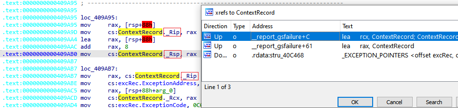
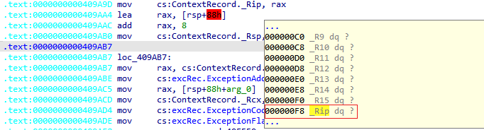
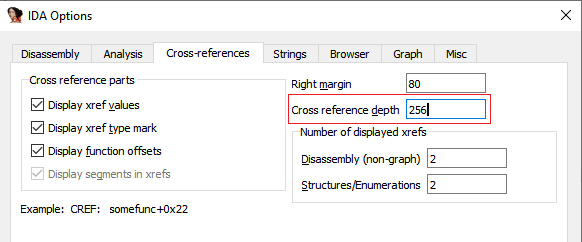
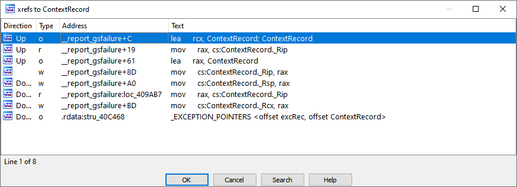

We have covered basic usage of [cross-references](https://hex-rays.com/blog/igor-tip-of-the-week-16-cross-references/) [before](https://hex-rays.com/blog/igor-tip-of-the-week-17-cross-references-2/), but there are situations where they may not behave as you may expect.  
我们以前介绍过交叉引用的基本用法，但在有些情况下，交叉引用的表现可能与你的预期不同。

### Accessing large data items  
访问大型数据项

If there is a large structure or an array and the code reads or writes data deep inside it, you may not see cross-references from that code listed at the structure definition.  
如果存在一个大型结构或数组，而代码在其内部深处读取或写入数据，则可能无法在结构定义处看到来自该代码的交叉引用。

Example 示例

For example, in the Microsoft CRT function `__report_gsfailure`, there are writes to the fields `_Rip` and `_Rsp` of the `ContextRecord` variable  (an instance of a structure `_CONTEXT`), but if we check the cross-references to `ContextRecord`, we will not see those writes listed.  
例如，在 Microsoft CRT 函数 `__report_gsfailure` 中，对 `ContextRecord` 变量（结构 `_CONTEXT` 的实例）的字段 `_Rip` 和 `_Rsp` 进行了写入，但如果我们检查与 `ContextRecord` 的交叉引用，就不会看到列出的这些写入。

This happens because these fields are situated rather far from the start of the structure (offsets `0x98` and `0xF8`).  
出现这种情况的原因是这些字段距离结构的起点（ `0x98` 和 `0xF8` 偏移量）较远。

As a speed optimization, IDA only checks for direct accesses into large data items up to a limited depth. The default value is 16(0x10), so any accesses beyond that offset will not be shown. The value for current database can be changed via Options > General… Cross-references tab.  
为了优化速度，IDA 只检查直接访问大型数据项的情况，但深度有限。默认值为 16(0x10)，因此不会显示任何超出该偏移量的访问。可以通过 "选项">"常规"... "交叉引用 "选项卡更改当前数据库的值。

For example, after setting it to 256, the accesses to `_Rip` and `_Rsp` are shown in the cross-references to `ContextRecord` :  
例如，将其设置为 256 后，对 `_Rip` 和 `_Rsp` 的访问将显示在对 `ContextRecord` 的交叉引用中：

To change the limit for all new databases, change the parameter `MAX_TAIL` in `ida.cfg`.  
要更改所有新数据库的限制，请更改 `ida.cfg` 中的参数 `MAX_TAIL` 。

See also:  另请参见：

[IDA Help: Cross References Dialog  
IDA 帮助：交叉引用对话框](https://www.hex-rays.com/products/ida/support/idadoc/607.shtml)