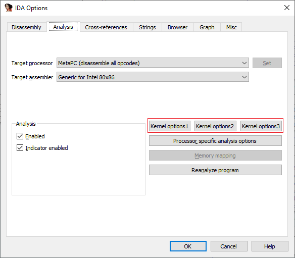
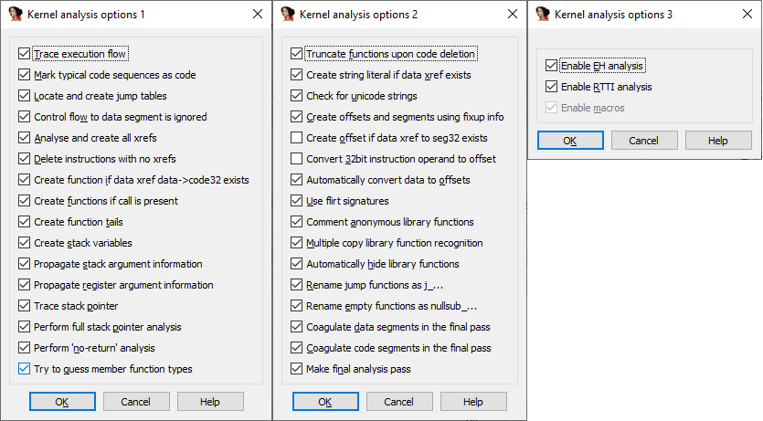
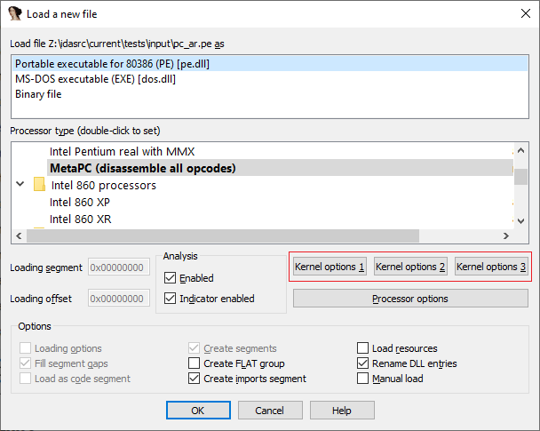
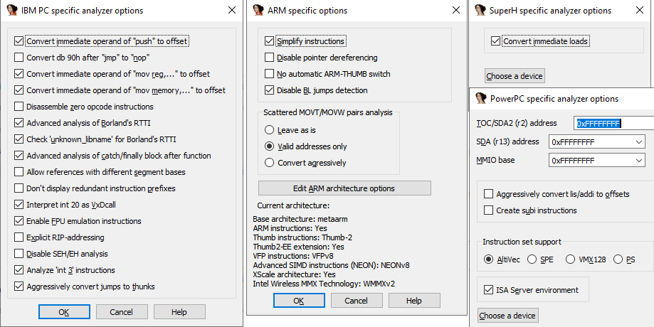
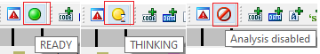

The autoanalysis engine is the heart of IDA’s disassembly functionality. In most cases it “just works” but in rare situations tweaking it may be necessary.  
自动分析引擎是 IDA 反汇编功能的核心。在大多数情况下，它都能 "正常工作"，但在极少数情况下，可能需要对其进行调整。

### Analysis options 分析选项

The generic analysis options are available in Options > General, Analysis tab, Kernel Options 1..3.  
通用分析选项可在选项 > 常规，分析选项卡，内核选项 1...3 中找到。

The same settings are also available at the initial load time.  
同样的设置也可在初始加载时使用。

You can even turn off the autoanalysis completely by unchecking the “Enabled” checkbox. This can be useful, for example, if you have some custom analysis scripts or plugins specific to the target and want to run them before IDA’s own analysis. After running the scripts, analysis can be re-enabled to handle the remaining parts of the binary.  
您甚至可以通过取消选中 "已启用 "复选框来完全关闭自动分析。例如，如果您有一些特定于目标的自定义分析脚本或插件，并希望在 IDA 自身分析之前运行它们，这将非常有用。运行脚本后，可重新启用分析功能，以处理二进制文件的剩余部分。

### Processor-specific options  
处理器特定选项

Some processor modules have additional options which are accessible via the “Processor options” button.  
某些处理器模块有附加选项，可通过 "处理器选项 "按钮访问。

### Toggling autoanalysis 切换自动分析

In some situations where IDA does not behave correctly or even getting in your way, instead of looking for a specific setting to disable, it may suffice to quickly disable autoanalysis, perform some action, then enable it again for default behavior. For example, if you try to use the technique described in the [tip #87](https://hex-rays.com/blog/igors-tip-of-the-week-87-function-chunks-and-the-decompiler/) without deleting the function first, you may find yourself fighting the autoanalysis:  
在某些情况下，IDA 的行为并不正确，甚至会妨碍你的工作，这时与其寻找特定的设置来禁用，不如快速禁用自动分析，执行某些操作，然后再将其启用为默认行为。例如，如果您尝试使用小贴士 #87 中描述的技巧而不先删除函数，您可能会发现自己在与自动分析作斗争：

1.  try to truncate the function at the start of the shared tail using “Set Function End” (shortcut E);  
    尝试使用 "设置函数结束"（快捷键 E ）在共享尾部的起点截断函数；
2.  IDA truncates the main function and creates a separate tail chunk;  
    IDA 会截断主函数并创建一个单独的尾块；
3.  because the function (head chunk) and the tail are adjacent, the autoanalysis immediately merges them back into one big function.  
    由于函数（头部块）和尾部块相邻，自动分析会立即将它们合并为一个大函数。

To prevent the undesired merging, you can disable autoanalysis, perform the necessary manipulations, then re-enable it. This can be done by unchecking the “Enabled” checkbox in the Options dialog but there is a faster way: autoanalysis indicator button on the toolbar.  
为了防止这种不希望发生的合并，可以禁用自动分析，执行必要的操作，然后重新启用。方法是取消选 项对话框中的 "已启用 "复选框，但还有更快捷的方法：工具栏上的自动分析指示器按钮。

It is usually either a yellow circle with hourglass (autoanalysis in progress) or green circle (autoanalysis idle, waiting for user action). If you click the button, it will turn into a crossed red circle to indicate that autoanalysis has been disabled.  
它通常是一个带沙漏的黄色圆圈（自动分析进行中）或绿色圆圈（自动分析空闲，等待用户操作）。如果单击该按钮，它将变成一个交叉的红色圆圈，表示自动分析已被禁用。

Click on the crossed circle again to re-enable autoanalysis.  
再次点击交叉圆圈可重新启用自动分析。

See also: 另请参见：

[IDA Help: Analysis options (hex-rays.com)  
IDA 帮助：分析选项 (hex-rays.com)](https://www.hex-rays.com/products/ida/support/idadoc/620.shtml)

[Igor’s tip of the week #09: Reanalysis – Hex Rays (hex-rays.com)  
伊戈尔本周提示 #09：重新分析 - 六角射线 (hex-rays.com)](https://hex-rays.com/blog/igor-tip-of-the-week-09-reanalysis/)