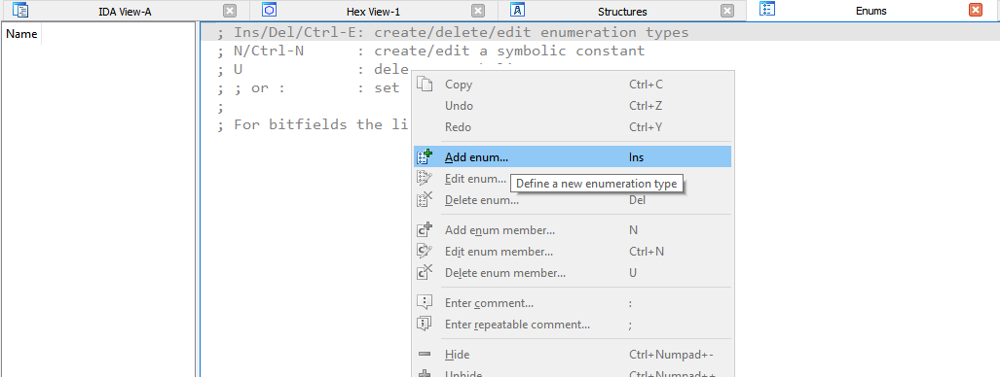
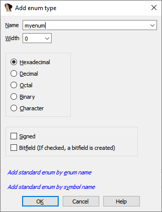
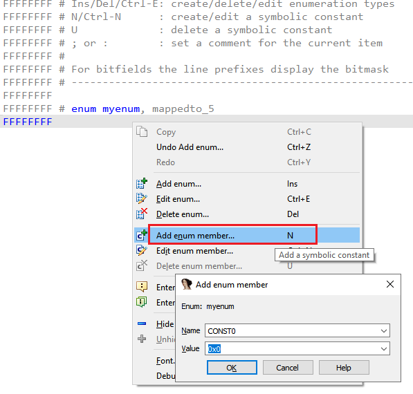
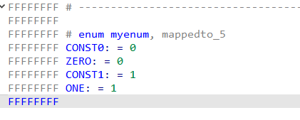
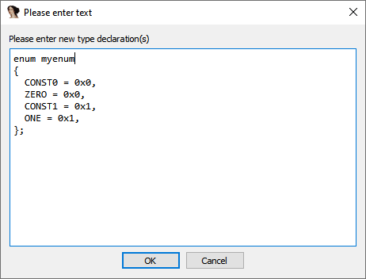
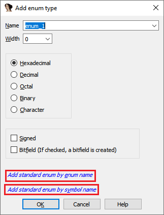
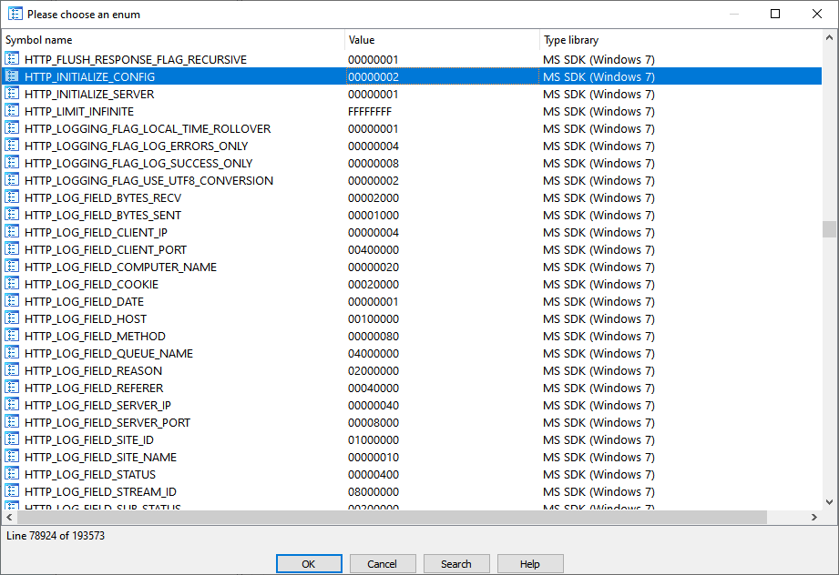
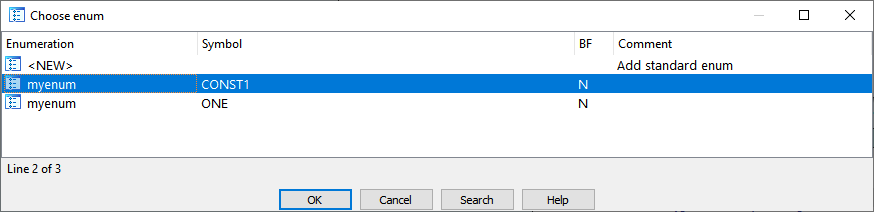
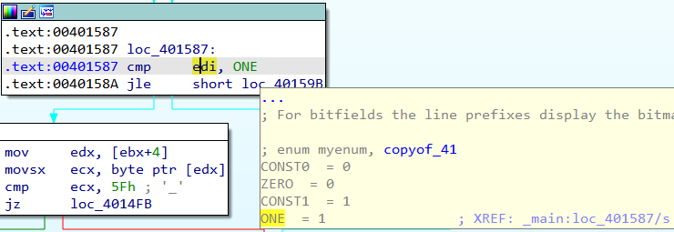

在 IDA 中，enum（枚举，来自 “enumeration”）是一组带有数值的符号常量。 它们可以被视为 C/C++ 枚举类型和预处理器 `#define` 定义的超集。

这些常量可以在反汇编或伪代码中使用，用符号名称替换特定数字或它们的组合，使列表更易读、更易理解。

### 手动创建枚举

`Enums` 视图是 IDA 默认桌面布局的一部分，但也可以通过 `View > Open subviews > Enumerations` 打开，或者使用快捷键 `Shift+F10`。

要添加新枚举，请在上下文菜单中选择 `Add enum…` ，或使用快捷键 `Ins`（Mac 上为 `I`）。

在对话框中，你可以指定名称、宽度（以字节为单位的大小）以及符号常量的数值进制。

创建枚举后，你可以开始向其中添加常量。 为此，请在上下文菜单中选择 `Add enum member…`，或使用快捷键 `N`。

一个枚举可以有多个常量具有相同的值，但所有常量的名称必须唯一。

### 通过 Local Types 创建枚举

`Local Types` 视图也可以用来创建枚举。 只需按 `Ins`，在文本框中编写 C 语法定义，然后点击 OK。

要让该枚举在 `Enums` 视图中可用，以便在反汇编中使用，请在上下文菜单中选择 `Synchronize to idb`，或者直接双击新添加的枚举类型。

### 从类型库导入枚举

与其从零开始创建枚举，你也可以利用 IDA 附带的类型库，这些库包含来自系统头文件和 SDK 的枚举。

如果你知道枚举的名称或其成员之一的名称，可以检查它们是否存在于已加载的类型库中。

为此，可以使用 `Add enum` 对话框中提供的两个链接按钮之一：

点击其中任意一个，IDA 会显示当前已加载类型库中所有可用的枚举或[成员](https://hex-rays.com/blog/igors-tip-of-the-week-60-type-libraries/)（符号）列表。

如果你事先知道标准枚举的名称，只需在 `Add enum` 对话框中输入它，IDA 会在已加载的类型库中找到匹配项时自动导入它。

### 使用枚举

枚举几乎可以用来替换反汇编或伪代码中的任何数值，替换为符号常量。

这可以通过在数字上右键打开上下文菜单来完成：

或者按快捷键 `M`，这会显示一个选择器：

枚举成员列表会自动缩小到与反汇编/伪代码中数字匹配的那些。

要在转换后查看符号常量的值，将[鼠标悬停](https://hex-rays.com/blog/igors-tip-of-the-week-47-hints-in-ida/)在其上即可：

See also:  另请参见：

[IDA Help: Enums window](https://www.hex-rays.com/products/ida/support/idadoc/594.shtml)

[IDA Help: Convert operand to symbolic constant (enum)](https://www.hex-rays.com/products/ida/support/idadoc/473.shtml)
