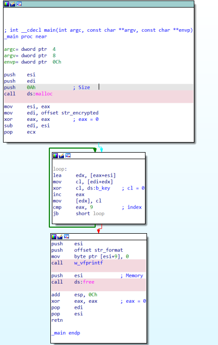

# IDAPython 初学者指南

版本 6.0

作者：Alexander Hanel

## 目录

- [简介](#简介)
- [更新](#更新)
- [目标读者和免责声明](#目标读者和免责声明)
- [约定](#约定)
- [IDAPython 背景](#idapython-背景)
- [旧版与新版](#旧版与新版)
- [Python-x86_64 问题](#python-x86_64-问题)
- [基础知识](#基础知识)
- [段](#段)
- [函数](#函数)
- [提取函数参数](#提取函数参数)
- [指令](#指令)
- [操作数](#操作数)
- [基本块](#基本块)
- [结构体](#结构体)
- [枚举类型](#枚举类型)
- [交叉引用](#交叉引用)
- [搜索](#搜索)
- [选择数据](#选择数据)
- [注释和重命名](#注释和重命名)
- [着色](#着色)
- [访问原始数据](#访问原始数据)
- [修补](#修补)
- [输入和输出](#输入和输出)
- [PyQt](#pyqt)
- [批量文件生成](#批量文件生成)
- [执行脚本](#执行脚本)
- [Yara](#yara)
- [Unicorn 引擎](#unicorn-引擎)
- [调试](#调试)
- [下一步是什么？](#下一步是什么)
- [结束语](#结束语)
- [附录](#附录)
  - [未更改的 IDC API 名称](#未更改的-idc-api-名称)
  - [PeFile](#pefile)

## 简介

你好！

这是一本关于 IDAPython 的书。

我最初写这本书是为了给自己做一个参考——我想要一个地方可以找到我在 IDAPython 中常用（和忘记）的函数示例。自从我开始写这本书以来，我已经多次使用它作为快速参考来理解语法或查看一些代码的示例——如果你读过 [我的博客](https://hooked-on-mnemonics.blogspot.com) ，你可能会注意到一些熟悉的面孔——我在这里介绍的很多脚本都是我在网上记录的实验结果。

多年来，我收到了许多电子邮件，询问学习 IDAPython 的最佳指南是什么。通常我会推荐他们阅读 Ero Carrera 的《IDAPython 简介》或 [IDAPython 公共仓库](https://github.com/idapython/src) 中的示例脚本。它们是学习的优秀资源，但它们并没有涵盖我遇到的一些常见问题。我想写一本能够解决这些问题的书。我觉得这本书对任何学习 IDAPython 或想要快速参考示例和代码片段的人来说都很有价值。作为一本电子书，它不会是一份静态文档，我计划在未来定期更新它。

如果您遇到任何问题、拼写错误或有任何疑问，请发送电子邮件至 alexander.hanel@gmail.com 或在 Twitter 上联系我 @nullandnull。

## 更新

- **版本 1.0:** 发布
- **版本 2.0:** 添加了目录和结束语
- **版本 3.0:** Russell V. 提供的语法修复，并添加了重命名操作数的示例。
- **版本 4.0:** 支持 IDAPython 7.0
- **版本 4.1:** Minh-Triet Pham Tran (@MinhTrietPT) 提供的错误修复
- **版本 5.0:**
  - 将格式从 Markdown 转换为 Microsoft Word。
  - 添加了 Yara 章节
  - 添加了着色章节
  - 添加了结构体章节
  - 添加了枚举类型章节
  - 添加了“下一步是什么”章节
  - 修复了 @qmemcpy 发现的错误
  - 应 Minh-Triet Pham Tran 的要求添加了 MakeFunction
- **版本 6.0:**
  - 支持 IDAPython 7.4 和 Python 3
  - 添加了“提取函数参数”章节
  - 添加了“基本块”章节
  - 添加了 PyQt 章节
  - 添加了 Unicorn 引擎章节
  - 添加了调试章节
- **版本 7.0:**
  - 支持 IDAPython 9.0

https://docs.hex-rays.com/developer-guide/idapython/idapython-porting-guide-ida-9

## 目标读者和免责声明

本书不适合逆向工程初学者。它也不作为 IDA 的入门介绍。如果您不熟悉 IDA，我建议您购买 Chris Eagles 的《IDA Pro Book》。想要更实际的学习，可以尝试参加 Chris Eagle 或 Hex-Rays 的培训。

本书的读者需要具备一些先决条件。您应该能够轻松阅读汇编代码，具备逆向工程背景，并且熟悉 IDA 的使用方法。如果您曾经问自己“我如何使用 IDAPython 自动化这项任务？”，那么这本书可能适合您。如果您已经在 IDAPython 编程方面有一些经验，那么您可能已经熟悉了本书中的内容。即便如此，它也可以作为查找常用函数示例的便捷参考，或者它可能会解决您将来遇到的问题。应该声明的是，我的背景是在 Windows 上逆向分析 x86 恶意软件。本书中提供的许多示例都来自我在逆向分析恶意软件时遇到的常见任务。阅读本书后，读者将能够轻松地自行深入研究 IDAPython 文档和源代码。

## 约定

IDA 的输出窗口（命令行界面）用于大多数示例和输出。为了简洁起见，一些示例不包含将当前地址分配给变量。通常表示为 `ea = here()`。所有代码都可以剪切并粘贴到命令行或 IDA 的脚本命令选项 `Shift-F2` 中。建议从头到尾阅读本书。有几个示例没有逐行解释，因为假设读者理解前面示例中的代码。不同的作者以不同的方式调用 IDAPython 的 API。有时代码被调用为 `idc.get_segm_name(ea)` 或 `get_segm_name(ea)`。本书使用第一种风格。我发现这种约定更容易阅读和调试。

有时使用此约定会引发错误。

```python
Python> DataRefsTo(here()) 
<generator object refs at 0x05247828>

Python> idautils.DataRefsTo(here()) 
Traceback (most recent call last):
  File "<string>", line 1, in <module>
NameError: name 'idautils' is not defined

Python> import idautils 
Python> idautils.DataRefsTo(here())
<generator object refs at 0x06A398C8>
```

如果发生这种情况，则需要如上所示手动导入模块。

## IDAPython 背景

IDAPython 创建于 2004 年。它是 Gergely Erdelyi 和 Ero Carrera 共同努力的成果。他们的目标是将 Python 的强大功能与 IDA 的 IDC 类 C 脚本语言的分析自动化功能相结合。

过去，IDAPython 主要由三个独立的模块组成。第一个是 `idc`。它是一个用于包装 IDA 的 IDC 函数的兼容性模块。第二个模块是 `idautils`。它是 IDA 的高级实用函数。第三个模块是 `idaapi`。它允许访问更低级的数据。

随着 6.95 版本的发布，IDA 开始包含更多涵盖传统上由 `idaapi` 涵盖的功能的模块。这些较新的模块的命名约定为 `ida_*`。本书中引用了几个这样的模块。其中一个模块是 `ida_kernwin.py`。阅读本书后，我建议您自行探索这些模块。它们位于 `IDADIR\python\ida*.py` 中。

## 旧版与新版

2017 年 9 月，IDA 7.0 发布。此版本是 HexRays 的一次重大更新，因为 IDA 从 x86 移植到 x86_64 二进制文件。此版本的一个副作用是需要重新编译旧插件。即使 IDAPython 的底层发生了一些重大变化（有关更多详细信息，请参阅 Hex-Rays 的 [IDA 7.0：IDAPython 向后兼容 6.95 API](https://www.hex-rays.com/products/ida/7.0/docs/idapython_backward_compat_695.shtml) ）；旧脚本仍将在 7.0 中执行。从 6.95 到 7.0 的向后兼容性是由于 `IDADIR\python\idc_bc695.py` 中存在的兼容性层。以下代码是兼容性层代码的示例。

```python
def MakeName(ea, name): return set_name(ea, name, SN_CHECK)
```

旧的 IDAPython 函数 `MakeName` 已重命名为 `set_name`。如果我们想使用命令行快速打印 `idc_bc695.py` 中的新 API 名称，我们可以使用 `inspect` 模块。

```python
Python> import inspect
Python> inspect.getsource(MakeName)
def MakeName(ea, name): return set_name(ea, name, SN_CHECK)
```

对于熟悉旧命名约定的 IDAPython 用户来说，并非所有 API 名称都已更改。某些 API 名称无法重新定义，因此保持不变。可以在附录 [未更改的 IDC API 名称](#未更改的-idc-api-名称) 下找到保持静态的 API 名称列表。

在 IDA 7.4 版中，默认情况下关闭了兼容性层。不建议这样做，但 IDA 用户可以通过修改 `IDADIR\cfg\python.cfg` 并确保 `AUTOIMPORT_COMPAT_IDA695` 等于 `Yes` 来重新启用它。由于 IDA 的未来版本不支持向后兼容性，因此本书使用新 API 名称编写。截至发布日期，兼容性层仅针对 `idc.py` 中的 API。

IDA 7.4 于 2019 年 10 月发布。此版本提供对 Python 3 的支持。发布后，IDA 7.4 支持 Python 2 和 Python 3，但随着 Python 2.x 的生命周期结束，未来版本将不再支持它。由于主机可以安装多个版本的 Python，因此 Hex-Rays 提供了一个名为 `idapyswitch` 的工具，位于 `IDADIR\idapyswitch.exe`。执行后，该工具会枚举所有可用的 Python 版本，并允许用户选择他们想要使用的 Python 版本。

## Python-x86_64 问题

从 IDA 6.9 升级到较新版本时，一些常见问题是在执行依赖于非标准模块的旧脚本时。以前安装的模块（例如 [pefile](https://github.com/erocarrera/pefile) ）需要从 x86 升级到 x86_64 才能在 IDA 中使用。更新它们的最简单方法是执行以下命令 `C:\>python%version%\python.exe -m pip install <package>`。从 IDA 输出窗口执行 `import sys; print(sys.path)` 可以用来定位 IDA 正在使用的 Python 版本的文件夹路径。截至 2020 年 4 月，使用 Python 3.8 和 3.81 安装 IDAPython 时存在安装问题。要解决此问题，请参阅 Hex-Rays 博客文章 [IDA 7.4 和 Python 3.8](https://www.hex-rays.com/blog/ida-7-4-and-python-3-8/)。

对于许多用户来说，使用函数 `hex` 打印地址是一种常见做法。升级到 IDA 7+ 后，使用 `hex` 打印地址的用户将不再拥有可点击的地址。地址类型现在是 `long` 而不是 `int`。如果您需要打印的地址可点击，请使用字符串格式化。下面的第一个打印地址是 `long` 且不可点击。使用字符串格式化打印的地址是可点击的。

```python
Python> ea = idc.get_screen_ea() # 获取光标地址
Python> print(hex(ea)) # 打印不可点击的地址
0x407e3bL
Python> print("0x%x" % ea) # 打印可点击的地址
0x407e3b
```

## 基础知识

在我们深入探讨之前，我们应该定义一些关键字并回顾一下 IDA 反汇编输出的结构。这通常在 GUI 中使用 IDA-View 窗口看到。我们可以使用以下代码行作为示例。

```
.text:00401570 lea eax, [ebp+arg_0]
```

`.text` 是段名，地址是 `00401570`。显示的地址是十六进制格式，没有 `0x` 前缀。指令 `lea` 被称为助记符。助记符后是第一个操作数 `eax` 和第二个操作数 `[ebp+arg_0]`。

使用 IDAPython API 时，最常见的传递变量是地址。在 IDAPython 文档中，地址被称为 `ea`。可以使用多个函数手动访问地址。最常用的函数是 `idc.get_screen_ea()` 或 `here()`。这些函数返回一个整数值，其中包含光标所在位置的地址。如果我们想获取 IDB 中存在的最小地址，我们可以使用 `idc.get_inf_attr(INF_MIN_EA)`，或者要获取最大地址，我们可以使用 `idc.get_inf_attr(INF_MAX_EA)`。

```python
Python> ea = idc.get_screen_ea()
Python> print("0x%x %s" % (ea, ea))
0x401570 4199792

Python> ea = here()
Python> print("0x%x %s" % (ea, ea))
0x401570 4199792

Python> print("0x%x" % idc.get_inf_attr(INF_MIN_EA))
0x401000

Python> print("0x%x" % idc.get_inf_attr(INF_MAX_EA))
0x41d000
```

反汇编输出中的每个描述元素都可以通过 IDAPython 中的函数访问。下面是如何访问每个元素的示例。请记住我们之前将地址存储在 `ea` 中。

```python
Python> idc.get_segm_name(ea) # 获取段名 .text
.text

Python> idc.generate_disasm_line(ea, 0) # 获取反汇编 lea eax, [ebp+arg_0]
lea eax, [ebp+arg_0]

Python> idc.print_insn_mnem(ea) # 获取助记符 lea
lea

Python> idc.print_operand(ea, 0) # 获取第一个操作数 eax
eax

Python> idc.print_operand(ea, 1) # 获取第二个操作数 [ebp+arg_0]
[ebp+arg_0]
```

要获取段名的字符串表示形式，我们使用 `idc.get_segm_name(ea)`，其中 `ea` 是段内的地址。可以使用 `idc.generate_disasm_line(ea, 0)` 打印反汇编字符串。参数是存储在 `ea` 中的地址和标志 0。标志 0 返回 IDA 在分析期间发现的显示的反汇编。当传递标志 0 时，`ea` 可以是指令偏移范围内的任何地址。要反汇编确切的偏移量并忽略 IDA 的分析，请使用标志 1。要获取助记符或指令名称，我们将调用 `idc.print_insn_mnem(ea)`。要获取助记符的操作数，我们将调用 `idc.print_operand(ea, long n)`。第一个参数是地址，第二个参数 `long n` 是操作数索引。第一个操作数是 0，第二个是 1，每个后续操作数的 n 都加 1。

在某些情况下，验证地址是否存在很重要。可以使用 `idaapi.BADADDR`、`idc.BADADDR` 或 `BADADDR` 来检查有效地址。

```python
Python> idaapi.BADADDR
4294967295

Python> print("0x%x" % idaapi.BADADDR)
0xffffffff

Python> if BADADDR != here(): print("valid address")
valid address
```

64 位二进制文件上的 BADADDR 示例：

```python
Python>idc.BADADDR
18446744073709551615

Python>print("0x%x" % idaapi.BADADDR)
0xffffffffffffffff
```

## 段

打印单行并不是特别有用。IDAPython 的强大之处在于迭代所有指令、交叉引用地址以及搜索代码或数据。最后两项将在后面的章节中更详细地描述。也就是说，迭代所有段是一个很好的起点。

```python
Python> for seg in idautils.Segments():\
  print("%s, 0x%x, 0x%x" % (idc.get_segm_name(seg), idc.get_segm_start(seg), idc.get_segm_end(seg)))

Python>
.textbss, 0x401000, 0x411000
.text, 0x411000, 0x418000
.rdata, 0x418000, 0x41b000
.data, 0x41b000, 0x41c000
.idata, 0x41c000, 0x41c228
.00cfg, 0x41d000, 0x41e000
```

`idautils.Segments()` 返回一个迭代器类型的对象。我们可以使用 `for` 循环遍历该对象。列表中的每一项都是段的起始地址。如果我们将地址作为参数传递给 `idc.get_segm_name(ea)`，则可以使用该地址获取段名。可以通过调用 `idc.get_segm_start(ea)` 或 `idc.get_segm_end(ea)` 找到段的起始和结束位置。地址或 `ea` 需要在段的起始或结束范围内。

如果我们不想迭代所有段，而是想从偏移量查找下一个段，我们可以使用 `idc.get_next_seg(ea)`。传递的地址可以是段范围内的任何地址，我们想要找到下一个段。如果我们想按名称获取段的起始地址，我们可以使用 `idc.get_segm_by_sel(idc.selector_by_name(str_SectionName))`。函数 `idc.selector_by_name(segname)` 返回段选择器，并传递段名的单个字符串参数。段选择器是一个整数值，从 1 开始，并为可执行文件中的每个段（也称为节）递增。`idc.get_segm_by_sel(int)` 传递段选择器并返回段的起始地址。

## 函数

现在我们知道如何遍历所有段，我们应该讨论如何遍历所有已知函数。

```python
Python> for func in idautils.Functions():
  print("0x%x, %s" % (func, idc.get_func_name(func)))

Python>
0x401000, sub_401000
0x401006, w_vfprintf
0x401034, main
...removed...
0x401c4d, terminate
0x401c53, IsProcessorFeaturePresent
```

`idautils.Functions()` 返回已知函数的列表。该列表包含每个函数的起始地址。`idautils.Functions()` 可以传递参数以在范围内搜索。如果我们想这样做，我们将传递起始和结束地址 `idautils.Functions(start_addr, end_addr)`。要获取函数名，我们使用 `idc.get_func_name(ea)`。`ea` 可以是函数边界内的任何地址。IDAPython 包含大量用于处理函数的 API。让我们从一个简单的函数开始。此函数的语义并不重要，但我们应该记下地址。

```
.text:0045C7C3 sub_45C7C3 proc near
.text:0045C7C3         mov eax, [ebp-60h]
.text:0045C7C6         push eax ; void
.text:0045C7C7         call w_delete
.text:0045C7CC         retn
.text:0045C7CC sub_45C7C3 endp
```

要获取边界，我们可以使用 `idaapi.get_func(ea)`。

```python
Python> func = idaapi.get_func(ea)
Python> type(func)
<class 'ida_funcs.func_t'>

Python>print("Start: 0x%x, End: 0x%x" % (func.start_ea, func.end_ea))
Start: 0x45c7c3, End: 0x45c7cd
```

`idaapi.get_func(ea)` 返回 `ida_funcs.func_t` 类。有时，如何使用函数调用返回的类并不总是很明显。在 Python 中探索类的有用命令是 `dir(class)` 函数。

```python
Python> dir(func)
['__class__', '__delattr__', '__dict__', '__dir__', '__doc__', '__eq__', '__format__', '__ge__',
'__getattribute__', '__gt__', '__hash__', '__init__', '__init_subclass__', '__le__', '__lt__',
'__module__', '__ne__', '__new__', '__reduce__', '__reduce_ex__', '__repr__', '__setattr__',
'__sizeof__', '__str__', '__subclasshook__', '__weakref__', '_print', 'analyzed_sp', 'argsize',
'clear', 'color', 'compare', 'contains', 'does_return', 'empty', 'endEA', 'end_ea', 'extend',
'flags', 'fpd', 'frame', 'frregs', 'frsize', 'get_points', 'get_regvars', 'get_tails', 'init',
'intersect', 'is_far', 'llabelqty', 'llabels', 'need_prolog_analysis', 'overlaps', 'owner',
'pntqty', 'points', 'referers', 'refqty', 'regargqty', 'regargs', 'regvarqty', 'regvars', 'size',
'startEA', 'start_ea', 'tailqty', 'tails', 'this', 'thisown']
```

从输出中，我们可以看到函数的 `start_ea` 和 `end_ea`。这些用于访问函数的起始和结束位置。结束地址不是最后一条指令中的最后一个地址，而是指令后的一个字节。这些属性仅适用于当前函数。如果我们想访问周围的函数，我们可以使用 `idc.get_next_func(ea)` 和 `idc.get_prev_func(ea)`。`ea` 的值只需要是分析函数边界内的地址。枚举函数的一个警告是，它仅在 IDA 将代码块标识为函数时才有效。在代码块被标记为函数之前，它会在函数枚举过程中被跳过。未标记为函数的代码在图例中标记为红色（IDA 的 GUI 顶部的彩色条）。这些可以使用函数 `idc.create_insn(ea)` 手动修复或自动修复。

IDAPython 有很多不同的方法来访问相同的数据。访问函数边界的一种常见方法是使用 `idc.get_func_attr(ea, FUNCATTR_START)` 和 `idc.get_func_attr(ea, FUNCATTR_END)`。

```python
Python> ea = here()
Python> start = idc.get_func_attr(ea, FUNCATTR_START)
Python> end = idc.get_func_attr(ea, FUNCATTR_END)
Python> cur_addr = start
Python> while cur_addr < end:
  print("0x%x %s" % (cur_addr, idc.generate_disasm_line(cur_addr, 0)))
  cur_addr = idc.next_head(cur_addr, end)

Python>
0x45c7c3 mov eax, [ebp-60h]
0x45c7c6 push eax ; void
0x45c7c7 call w_delete
0x45c7cc retn
```

`idc.get_func_attr(ea, attr)` 用于获取函数的起始和结束位置。然后我们使用 `idc.generate_disasm_line(ea, 0)` 打印当前地址和反汇编。我们使用 `idc.next_head(eax)` 获取下一条指令的起始位置，并继续直到到达此函数的末尾。此方法的一个缺陷是它依赖于指令包含在函数的起始和结束边界内。如果跳转到高于函数末尾的地址，则循环将过早退出。这种类型的跳转在代码转换等混淆技术中很常见。由于边界可能不可靠，因此最佳做法是调用 `idautils.FuncItems(ea)` 遍历函数中的地址。我们将在下一节中更详细地讨论这种方法。

与 `idc.get_func_attr(ea, attr)` 类似，另一个用于收集函数信息的有用参数是 `idc.get_func_attr(ea, FUNCATTR_FLAGS)`。`FUNCATTR_FLAGS` 可用于检索有关函数的信息，例如它是库代码还是函数不返回值。函数有九个可能的标志。如果我们想枚举所有函数的所有标志，我们可以使用以下代码。

```python
Python> import idautils
Python> for func in idautils.Functions():
  flags = idc.get_func_attr(func, FUNCATTR_FLAGS)
  if flags & FUNC_NORET:
    print("0x%x FUNC_NORET" % func)
  if flags & FUNC_FAR:
    print("0x%x FUNC_FAR" % func)
  if flags & FUNC_LIB:
    print("0x%x FUNC_LIB" % func)
  if flags & FUNC_STATIC:
    print("0x%x FUNC_STATIC" % func)
  if flags & FUNC_FRAME:
    print("0x%x FUNC_FRAME" % func)
  if flags & FUNC_USERFAR:
    print("0x%x FUNC_USERFAR" % func)
  if flags & FUNC_HIDDEN:
    print("0x%x FUNC_HIDDEN" % func)
  if flags & FUNC_THUNK:
    print("0x%x FUNC_THUNK" % func)
  if flags & FUNC_BOTTOMBP:
    print("0x%x FUNC_BOTTOMBP" % func)

Python>
0x401006 FUNC_FRAME
0x40107c FUNC_LIB
0x40107c FUNC_STATIC
```

我们使用 `idautils.Functions()` 获取所有已知函数地址的列表，然后我们使用 `idc.get_func_attr(ea, FUNCATTR_FLAGS)` 获取标志。我们通过对返回值使用逻辑与（`&`）运算来检查该值。例如，要检查函数是否没有返回值，我们将使用以下比较 `if flags & FUNC_NORET`。现在让我们回顾一下所有函数标志。其中一些标志很常见，而其他标志则很少见。

### FUNC_NORET

此标志用于标识不执行返回指令的函数。它在内部表示为等于 1。下面可以看到不返回值的函数示例。

```
CODE:004028F8 sub_4028F8 proc near
CODE:004028F8         and eax, 7Fh
CODE:004028FB         mov edx, [esp+0]
CODE:004028FE         jmp sub_4028AC
CODE:004028FE sub_4028F8 endp
```

请注意 `ret` 或 `leave` 不是最后一条指令。

### FUNC_FAR

除非逆向使用分段内存的软件，否则很少看到此标志。它在内部表示为整数 2。

### FUNC_USERFAR

此标志很少见，几乎没有文档记录。Hex-Rays 将此标志描述为“用户已指定函数的远近”。它的内部值为 32。

### FUNC_LIB

此标志用于查找库代码。识别库代码非常有用，因为它是通常在进行分析时可以忽略的代码。它在内部表示为整数值 4。以下是其用法及其已识别函数的示例。

```python
Python> for func in idautils.Functions():
  flags = idc.get_func_attr(func, FUNCATTR_FLAGS)
  if flags & FUNC_LIB:
    print("0x%x FUNC_LIB %s" % (func, idc.get_func_name(func)))

Python>
0x40107c FUNC_LIB ?pre_c_initialization@@YAHXZ
0x40113a FUNC_LIB ?scrt_common_main_seh@@YAHXZ
0x4012b2 FUNC_LIB _start
0x4012bc FUNC_LIB ?find_pe_section@@YAPAU_IMAGE_SECTION_HEADER@@QAEI@Z
0x401300 FUNC_LIB _scrt_acquire_startup_lock
0x401332 FUNC_LIB _scrt_initialize_crt
```

### FUNC_STATIC

此标志用于标识具有静态 `ebp` 基于帧的函数。

### FUNC_FRAME

此标志表示该函数使用帧指针 `ebp`。使用帧指针的函数通常以设置堆栈帧的标准函数序言开头。

```
.text:1A716697     push ebp
.text:1A716698     mov ebp, esp
.text:1A71669A     sub esp, 5Ch
```

### FUNC_BOTTOMBP

与 `FUNC_FRAME` 类似，此标志用于跟踪帧指针。它标识基指针指向堆栈指针的函数。

### FUNC_HIDDEN

带有 `FUNC_HIDDEN` 标志的函数表示它们是隐藏的，需要展开才能查看。如果我们转到标记为隐藏的函数的地址，它将自动展开。

### FUNC_THUNK

此标志标识 thunk 函数。它们是跳转到另一个函数的简单函数。

```
.text:1A710606 Process32Next proc near
.text:1A710606         jmp ds:_imp_Process32Next
.text:1A710606 Process32Next endp
```

应该注意的是，一个函数可以包含多个标志。以下是一个包含多个标志的函数示例。

```
0x1a716697 FUNC_LIB
0x1a716697 FUNC_FRAME
0x1a716697 FUNC_HIDDEN
0x1a716697 FUNC_BOTTOMBP
```

有时需要将一段代码或数据定义为函数。例如，以下代码在分析阶段未定义为函数或没有交叉引用。

```
.text:00407DC1     mov ebp, esp
.text:00407DC3     sub esp, 48h
.text:00407DC6     push ebx
```

要定义一个函数，我们可以使用 `idc.add_func(start, end)`。

```python
Python> idc.add_func(0x00407DC1, 0x00407E90)
```

`idc.add_func(start, end)` 的第一个参数是函数的起始地址，第二个参数是函数的结束地址。在许多情况下，不需要结束地址，IDA 会自动识别函数的结束位置。以下汇编是执行上述代码的输出。

```
.text:00407DC1 sub_407DC1 proc near
.text:00407DC1 SystemInfo = _SYSTEM_INFO ptr -48h
.text:00407DC1 Buffer = MEMORY_BASIC_INFORMATION ptr -24h
.text:00407DC1 flOldProtect = dword ptr -8
.text:00407DC1 dwSize = dword ptr -4
.text:00407DC1     mov ebp, esp
.text:00407DC3     sub esp, 48h
.text:00407DC6     push ebx
```

### 提取函数参数

在 IDAPython 中提取函数参数并不总是一件简单直接的任务。在许多情况下，需要识别函数的调用约定，并且必须使用回溯或其他类似技术手动解析参数。由于[调用约定](https://www.agner.org/optimize/calling_conventions.pdf) 种类繁多，通常无法通用地实现此功能。IDAPython 确实包含一个名为 `idaapi.get_arg_addrs(ea)` 的函数，如果 IDA 能够识别被调用函数的原型，则可以使用该函数获取参数的地址。这种识别并不总是存在，但在调用 API 或 64 位代码中很常见。例如，在以下汇编中，我们可以看到 API `SendMessage` 传递了四个参数。

```
.text:000000014001B5FF         js      loc_14001B72B
.text:000000014001B605         mov     rcx, cs:qword_14002D368 ; hWnd
.text:000000014001B60C         xor     r9d, r9d        ; lParam
.text:000000014001B60F         xor     r8d, r8d        ; wParam
.text:000000014001B612         mov     edx, 0BDh       ; '½' ; Msg
.text:000000014001B617         call    cs:SendMessageW
.text:000000014001B61D         xor     esi, esi
```

通过使用 `idaapi.get_arg_addrs(ea)`，其中 `ea` 是 API 的地址，我们可以检索传递参数的地址列表。

```python
Python> ea = 0x00014001B617
Python> idaapi.get_arg_addrs(ea)
[0x14001b605, 0x14001b612, 0x14001b60f, 0x14001b60c]
```

## 指令

既然我们知道如何使用函数，现在是时候讨论如何访问函数内的指令了。如果我们有函数的地址，我们可以使用 `idautils.FuncItems(ea)` 获取所有地址的列表。

```python
Python> dism_addr = list(idautils.FuncItems(here()))
Python> type(dism_addr)
<type 'list'>

Python> print(dism_addr)
[4573123, 4573126, 4573127, 4573132] # These are integer representations of addresses

Python> for line in dism_addr: print("0x%x %s" % (line, idc.generate_disasm_line(line, 0)))
0x45c7c3 mov eax, [ebp-60h]
0x45c7c6 push eax ; void *
0x45c7c7 call w_delete
0x45c7cc retn
```

`idautils.FuncItems(ea)` 返回一个迭代器类型，但会转换为列表。该列表包含按顺序排列的每个指令的起始地址。现在我们有了遍历段、函数和指令的良好知识基础；让我们展示一个有用的示例。有时在逆向打包的代码时，只知道动态调用发生在哪里很有用。动态调用是指对寄存器的调用或跳转，例如 `call eax` 或 `jmp edi`。

```python
Python>
for func in idautils.Functions():
    flags = idc.get_func_attr(func, FUNCATTR_FLAGS)
    if flags & FUNC_LIB or flags & FUNC_THUNK:
        continue
    dism_addr = list(idautils.FuncItems(func))
    for line in dism_addr:
        m = idc.print_insn_mnem(line)
        if m == 'call' or m == 'jmp':
            # Check operand type (0 is the first operand)
            op_type = idc.get_operand_type(line, 0)
            # o_reg corresponds to register operand type
            if op_type == idc.o_reg: # Assuming o_reg=1 based on later text
                print("0x%x %s" % (line, idc.generate_disasm_line(line, 0)))
Python>
0x43ebde call eax ; VirtualProtect
```

我们调用 `idautils.Functions()` 来获取所有已知函数的列表。对于每个函数，我们通过调用 `idc.get_func_attr(ea, FUNCATTR_FLAGS)` 来检索函数标志。如果函数是库代码或 thunk 函数，则跳过该函数。

接下来，我们调用 `idautils.FuncItems(ea)` 来获取函数内的所有地址。我们使用 `for` 循环遍历列表。由于我们只对 `call` 和 `jmp` 指令感兴趣，我们需要通过调用 `idc.print_insn_mnem(ea)` 来获取助记符。然后我们使用简单的字符串比较来检查助记符。如果助记符是跳转或调用，我们通过调用 `idc.get_operand_type(ea, n)` 来获取操作数类型。此函数返回一个内部称为 `op_t.type` 的整数。此值可用于确定操作数是寄存器、内存引用等。然后我们检查 `op_t.type` 是否是寄存器。如果是，我们打印该行。将 `idautils.FuncItems(ea)` 的返回值转换为列表很有用，因为迭代器没有 `len()` 等对象。通过将其转换为列表，我们可以轻松获取函数中的行数或指令数。

```python
Python> ea = here()
Python> len(idautils.FuncItems(ea))
Traceback (most recent call last):
  File "<string>", line 1, in <module>
TypeError: object of type 'generator' has no len()

Python> len(list(idautils.FuncItems(ea)))
39
```

在前面的示例中，我们使用了一个包含函数内所有地址的列表。我们遍历每个实体以访问下一条指令。如果我们只有一个地址并且想获取下一条指令怎么办？要移动到下一条指令地址，我们可以使用 `idc.next_head(ea)`，要获取上一条指令地址，我们使用 `idc.prev_head(ea)`。这些函数获取下一条指令的 _起始_ 地址，而不是下一个地址。要获取下一个地址，我们使用 `idc.next_addr(ea)`，要获取上一个地址，我们使用 `idc.prev_head(ea)`。

```python
Python> ea = here()
Python> print("0x%x %s" % (ea, idc.generate_disasm_line(ea, 0)))
0x10004f24 call sub_10004F32

Python> next_instr = idc.next_head(ea)
Python> print("0x%x %s" % (next_instr, idc.generate_disasm_line(next_instr, 0))) # Corrected print
0x10004f29 mov [esi], eax

Python> prev_instr = idc.prev_head(ea)
Python> print("0x%x %s" % (prev_instr, idc.generate_disasm_line(prev_instr, 0))) # Corrected print
0x10004f1e mov [esi+98h], eax

Python> print("0x%x" % idc.next_addr(ea))
0x10004f25

Python> print("0x%x" % idc.prev_head(ea)) # Note: prev_head gets previous instruction start
0x10004f23 # This seems incorrect based on description, maybe meant prev_addr?
```

在动态调用示例中，IDAPython 代码依赖于使用 `jmp` 和 `call` 的字符串比较。除了使用字符串比较，我们还可以使用 `idaapi.decode_insn(insn_t, ea)` 解码指令。第一个参数是来自 `ida_ua` 的 `insn_t` 类，通过调用 `ida_ua.insn_t()` 创建。一旦调用 `idaapi.decode_insn`，该类就会填充属性。第二个参数是要分析的地址。解码指令可能是有利的，因为使用指令的整数表示可以更快且不易出错。不幸的是，整数表示特定于 IDA，不能轻易移植到其他反汇编工具。下面是相同的示例，但使用 `idaapi.decode_insn(insn_t, ea)` 并比较整数表示。

```python
Python> import ida_ua # Ensure ida_ua is imported
Python> JMPS = [idaapi.NN_jmp, idaapi.NN_jmpfi, idaapi.NN_jmpni]
Python> CALLS = [idaapi.NN_call, idaapi.NN_callfi, idaapi.NN_callni]
Python> for func in idautils.Functions():
    flags = idc.get_func_attr(func, FUNCATTR_FLAGS)
    if flags & FUNC_LIB or flags & FUNC_THUNK:
        continue
    dism_addr = list(idautils.FuncItems(func))
    for line in dism_addr:
        ins = ida_ua.insn_t()
        idaapi.decode_insn(ins, line)
        if ins.itype in CALLS or ins.itype in JMPS:
            # Check if the first operand (Op1) is a register (o_reg)
            # Need to verify the constant for o_reg if not using idc
            # Assuming o_reg corresponds to a specific value, e.g., 1
            if ins.Op1.type == 1: # Use idaapi.o_reg if available
                 print("0x%x %s" % (line, idc.generate_disasm_line(line, 0)))

Python>
0x43ebde call eax ; VirtualProtect
```

输出与前面的示例相同。前两行将 `jmp` 和 `call` 的常量放入两个列表中。由于我们不使用助记符的字符串表示，我们需要认识到助记符（例如 `call` 或 `jmp`）可能有多个值。例如，`jmp` 可以表示为 `idaapi.NN_jmp` 用于跳转，`idaapi.NN_jmpfi` 用于间接远跳转，或 `idaapi.NN_jmpni` 用于间接近跳转。X86 和 X64 指令类型都以 `NN` 开头。要探索所有 1,700+ 种指令类型，我们可以在命令行中执行 `[name for name in dir(idaapi) if "NN_" in name]` 或在 IDA 的 SDK 文件 `allins.hpp` 中查看它们。一旦我们将指令放入列表中，我们使用 `idautils.Functions()` 和 `get_func_attr(ea, FUNCATTR_FLAGS)` 的组合来获取所有适用的函数，同时忽略库和 thunk。我们通过调用 `idautils.FuncItems(ea)` 来获取函数中的每条指令。这是我们新引入的函数 `idaapi.decode_insn(ins, ea)` 被调用的地方。此函数接受我们想要解码的指令的地址。一旦解码，我们可以通过访问变量 `ins` 中的 `insn_t` 类来访问指令的不同属性。

```python
Python>dir(ins)
['Op1', 'Op2', 'Op3', 'Op4', 'Op5', 'Op6', 'Operands', '__class__', '__delattr__',
 '__dict__', '__doc__', '__eq__', '__format__', '__ge__', '__getattribute__',
 '__getitem__', '__gt__', '__hash__', '__init__', '__init_subclass__', '__iter__',
 '__le__', '__lt__', '__module__', '__ne__', '__new__', '__reduce__', '__reduce_ex__',
 '__repr__', '__setattr__', '__setitem__', '__sizeof__', '__str__', '__subclasshook__',
 '__swig_destroy__', '__weakref__', '_add_cref', '_add_dref', '_add_off_drefs',
 '_assign', 'auxpref', 'create_op_data', 'create_stkvar', 'cs', 'ea', 'flags',
 'get_canon_feature', 'get_canon_mnem', 'get_next_byte', 'get_next_dword',
 'get_next_qword', 'get_next_word', 'insnpref', 'ip', 'is_64bit', 'is_canon_insn',
 'is_macro', 'itype', 'ops', 'segpref', 'size', 'this', 'thisown']
```

从 `dir()` 命令中我们可以看到 `ins` 有很多属性。操作数类型通过 `ins.Op1.type` 访问。请注意，操作数索引从 1 开始，而不是 0，这与 `idc.get_operand_type(ea, n)` 不同。

## 操作数

操作数类型很常用，因此最好回顾一下所有类型。如前所述，我们可以使用 `idc.get_operand_type(ea, n)` 来获取操作数类型。`ea` 是地址，`n` 是索引。有八种不同的操作数类型。

#### o_void

如果指令没有任何操作数，则返回 0。

```python
Python> print("0x%x %s" % (ea, idc.generate_disasm_line(ea, 0)))
0xa09166     retn

Python> print(idc.get_operand_type(ea, 0))
0
```

#### o_reg

如果操作数是通用寄存器，则返回此类型。此值在内部表示为 1。

```python
Python> print("0x%x %s" % (ea, idc.generate_disasm_line(ea, 0)))
0xa09163     pop edi

Python> print(idc.get_operand_type(ea, 0))
1
```

#### o_mem

如果操作数是直接内存引用，则返回此类型。此值在内部表示为 2。此类型对于查找对 DATA 的引用很有用。

```python
Python> print("0x%x %s" % (ea, idc.generate_disasm_line(ea, 0)))
0xa05d86     cmp ds:dword_A152B8, 0

Python> print(idc.get_operand_type(ea, 0))
2
```

#### o_phrase

如果操作数由基址寄存器或变址寄存器组成，则返回此操作数。此值在内部表示为 3。

```python
Python> print("0x%x %s" % (ea, idc.generate_disasm_line(ea, 0)))
0x1000b8c2     mov [edi+ecx], eax

Python> print(idc.get_operand_type(ea, 0))
3
```

#### o_displ

如果操作数由寄存器和位移值组成，则返回此操作数。位移是一个整数值，例如 0x18。当指令访问结构中的值时，通常会看到它。它在内部表示为值 4。

```python
Python> print("0x%x %s" % (ea, idc.generate_disasm_line(ea, 0)))
0xa05dc1     mov eax, [edi+18h]

Python> print(idc.get_operand_type(ea, 1)) # Getting type of the second operand [edi+18h]
4
```

#### o_imm

值为整数（例如 0xC）的操作数属于此类型。它在内部表示为 5。

```python
Python> print("0x%x %s" % (ea, idc.generate_disasm_line(ea, 0)))
0xa05da1 add esp, 0Ch

Python> print(idc.get_operand_type(ea, 1)) # Getting type of the second operand 0Ch
5
```

#### o_far

在逆向 x86 或 x86_64 时，此操作数不常见。它用于查找访问立即远地址的操作数。它在内部表示为 6。

#### o_near

在逆向 x86 或 x86_64 时，此操作数不常见。它用于查找访问立即近地址的操作数。它在内部表示为 7。

### 示例

有时在逆向分析可执行文件的内存转储时，操作数未被识别为偏移量。

```
seg000:00BC1388     push    0Ch
seg000:00BC138A     push    0BC10B8h
seg000:00BC138F     push    [esp+10h+arg_0]
seg000:00BC1393     call    ds:_strnicmp
```

被压入的第二个值是内存偏移量。如果我们右键单击它并将其更改为数据类型；我们会看到指向字符串的偏移量。这样做一两次还可以，但之后我们最好自动化这个过程。

```python
min_ea = idc.get_inf_attr(idc.INF_MIN_EA) # Corrected constant usage
max_ea = idc.get_inf_attr(idc.INF_MAX_EA) # Corrected constant usage

# 遍历每个已知函数
for func in idautils.Functions():
    flags = idc.get_func_attr(func, idc.FUNCATTR_FLAGS) # Corrected constant usage
    # 跳过库函数和 thunk 函数
    if flags & idc.FUNC_LIB or flags & idc.FUNC_THUNK: # Corrected constant usage
        continue
    dism_addr = list(idautils.FuncItems(func))
    for curr_addr in dism_addr:
        # 检查第一个操作数
        if idc.get_operand_type(curr_addr, 0) == idc.o_imm and \
           (min_ea < idc.get_operand_value(curr_addr, 0) < max_ea):
            # Deprecated: idc.OpOff(curr_addr, 0, 0)
            # Use set_op_type or op_offset instead depending on IDA version and goal
            # Example using op_offset (modern approach)
            idc.op_offset(curr_addr, 0, idc.REF_OFF32) # Or appropriate REF type
        # 检查第二个操作数
        if idc.get_operand_type(curr_addr, 1) == idc.o_imm and \
           (min_ea < idc.get_operand_value(curr_addr, 1) < max_ea):
            # Using modern approach for second operand as well
            idc.op_offset(curr_addr, 1, idc.REF_OFF32) # Or appropriate REF type
            # idc.op_plain_offset(curr_addr, 1, 0) # Original, possibly older API usage
```

运行上述代码后，我们现在会看到字符串。

```
seg000:00BC1388 push    0Ch
seg000:00BC138A push    offset aNtoskrnl_exe ; "ntoskrnl.exe"
seg000:00BC138F push    [esp+10h+arg_0]
seg000:00BC1393 call    ds:_strnicmp
```

开始时，我们通过调用 `idc.get_inf_attr(idc.INF_MIN_EA)` 和 `idc.get_inf_attr(idc.INF_MAX_EA)` 获取最小和最大地址。我们遍历所有函数和指令。对于每条指令，我们检查操作数类型是否为 `o_imm`，并且在内部表示为数字 5。`o_imm` 类型的值可以是整数或偏移量。一旦找到一个值，我们通过调用 `idc.get_operand_value(ea,n)` 读取该值。然后检查该值是否在最小和最大地址的范围内。如果是，我们使用 `idc.op_offset(ea, n, refinfo)`（或旧版 API 中的 `idc.op_plain_offset(ea, n, base)`）将操作数转换为偏移量。第一个参数 `ea` 是地址，`n` 是操作数索引，`base` 是基址。我们的示例只需要基址为零。

## 基本块

基本块是一个没有分支的直线代码序列，由单个入口点和单个出口点组成。在分析程序的控制流时，基本块很有用。IDA 对基本块的表示通常在使用函数的图形反汇编视图时观察到。使用基本块进行分析的一些值得注意的示例是识别循环或控制流混淆。当一个基本块将控制权转移到另一个基本块时，下一个块称为后继块，前一个块称为前驱块。以下流程图是一个使用单字节 `XOR` 解密字符串的函数。



由于图像难以看清代码和地址，汇编输出可以在下面找到。该函数包含三个块，基本块的起始地址分别为 `0x0401034`、`0x040104A` 和 `0x0040105E`。`XOR` 循环从 `0x040104A` 开始，索引在 `0x0401059` 处求值，一旦 XOR 循环完成，则继续到 `0x040105E`。

```
.text:00401034 			push    esi
.text:00401035 			push    edi
.text:00401036 			push    0Ah             ; Size
.text:00401038 			call    ds:malloc
.text:0040103E 			mov     esi, eax
.text:00401040 			mov     edi, offset str_encrypted
.text:00401045 			xor     eax, eax        ; eax = 0
.text:00401047 			sub     edi, esi
.text:00401049 			pop     ecx
.text:0040104A
.text:0040104A loop:                   ; CODE XREF: _main+28↓j
.text:0040104A 			lea     edx, [eax+esi]
.text:0040104D 			mov     cl, [edi+edx]
.text:00401050 			xor     cl, ds:b_key    ; cl = 0
.text:00401056 			inc     eax
.text:00401057 			mov     [edx], cl
.text:00401059 			cmp     eax, 9          ; index
.text:0040105C 			jb      short loop
.text:0040105E 			push    esi
.text:0040105F 			push    offset str_format
.text:00401064 			mov     byte ptr [esi+9], 0
.text:00401068 			call    w_vfprintf
.text:0040106D 			push    esi             ; Memory
.text:0040106E 			call    ds:free
.text:00401074 			add     esp, 0Ch
.text:00401077 			xor     eax, eax        ; eax = 0
.text:00401079 			pop     edi
.text:0040107A 			pop     esi
.text:0040107B 			retn
.text:0040107B _main endp
```

如果我们提取了 `0x0401050` 处单字节 `XOR` 加密的偏移量，我们使用以下代码来获取 `XOR` 发生的基本块的开始和结束，并获取后继和前驱基本块。

```python

ea = 0x0401050
f = idaapi.get_func(ea)
# Get FlowChart, specifying FC_PREDS to calculate predecessors
fc = ida_gdl.FlowChart(f, flags=idaapi.FC_PREDS)

for block in fc:
    print("ID: %i Start: 0x%x End: 0x%x" % (block.id, block.start_ea, block.end_ea))
    if block.start_ea <= ea < block.end_ea:
        print("  Basic Block selected")
        # Get successors
        successors = block.succs()
        for succ_block in successors: # Iterate through successor generator
            print("  Successor: 0x%x" % succ_block.start_ea)
        # Get predecessors
        predecessors = block.preds()
        for pred_block in predecessors: # Iterate through predecessor generator
            print("  Predecessor: 0x%x" % pred_block.start_ea) # Usually start_ea is more useful
        # Check if it's a return block
        if ida_gdl.is_ret_block(block.type):
            print("  Return Block")
```

第一条指令将单字节 `XOR` 偏移量分配给变量 `ea`。函数 `idaapi.FlowChart(f=None, bounds=None, flags=0)` 需要传递 `func_t` 类作为第一个参数。为了获取该类，我们调用 `idaapi.get_func(ea)`。参数 `bounds` 可以传递一个元组，第一项是起始地址，第二项是结束地址 `bounds=(start, end)`。在 IDA 7.4 中，如果需要计算前驱，第三个参数 `flags` 必须设置为 `idaapi.FC_PREDS`。变量 `fc` 包含一个 `ida_gdl.FlowChart` 对象，可以循环遍历以迭代所有块。每个块包含以下属性。

- `id`：函数内的每个基本块都有一个唯一的索引。第一个块的 id 从 0 开始。
- `type`：类型描述了基本块，具有以下类型
  - `fcb_normal`：表示一个普通块，内部值为 0。
  - `fcb_indjump`：表示以间接跳转结束的块，内部值为 1。
  - `fcb_ret`：表示一个返回块，内部值为 2。`ida_gdl.is_ret_block(block.type)` 也可用于确定该块是否为 `fcb_ret` 类型。
  - `fcb_cndret`：表示一个条件返回块，值为 3。
  - `fcb_noret`：表示一个没有返回的块，内部值为 4。
  - `fcb_enoret`：表示一个没有返回且不属于函数的块，内部值为 5。
  - `fcb_extern`：表示一个外部普通块，内部值为 6。
  - `fcb_error`：表示一个执行超过函数末尾的块，内部值为 7。
- `start_ea`：基本块的起始地址。
- `end_ea`：基本块的结束地址。基本块的结束地址不是最后一条指令的地址，而是其后的偏移量。
- `preds()`：返回一个包含所有前驱地址的生成器的函数。
- `succs()`：返回一个包含所有后继地址的生成器的函数。

调用 `idaapi.FlowChart` 后，会迭代每个基本块。打印 id、起始地址和结束地址。为了定位 `ea` 所在的块，将 `ea` 与基本块的起始地址进行比较（大于或等于），并通过比较 `block.start_ea` 和小于基本块的结束地址进行比较，通过比较 `block.end_ea`。变量名 `block` 是任意选择的。要获取所有后继偏移量的生成器，我们调用 `block.succs()`。`succs` 生成器中的每一项都会被循环遍历并打印出来。要获取所有前驱偏移量的生成器，我们可以调用 `block.preds()`。`preds` 生成器中的每一项都会被循环遍历并打印出来。最后一个 if 语句调用 `ida_gdl.is_ret_block(btype)` 来确定该块是否是返回类型。脚本的输出如下所示。

```
ID: 0 Start: 0x401034 End: 0x40104a
  Successor: 0x40104a
ID: 1 Start: 0x40104a End: 0x40105e
  Basic Block selected
  Successor: 0x40105e
  Successor: 0x40104a
  Predecessor: 0x40104a # predecessor block start addr
  Predecessor: 0x40105c # address of the 'jb' instruction in the pred block
ID: 2 Start: 0x40105e End: 0x40107c
  Predecessor: 0x40105c # address of the 'jb' instruction in the pred block
  Return Block
```

ID 为 1 的基本块是一个循环，这就是为什么它有多个后继和前驱的原因。

## 结构体

结构体布局、结构体名称和类型在编译过程中会从代码中移除。重建结构体并正确标记成员名称可以极大地帮助逆向过程。以下是在 x86 shellcode 中 [常见的汇编片段](https://gist.github.com/tophertimzen/5d32f255292a0201853cb7009fc55fba) 。完整的代码遍历线程环境块 (TEB) 和进程环境块 (PEB) 中的结构体以查找 `kernel32.dll` 的基地址。

```
seg000:00000000 xor     ecx, ecx
seg000:00000002 mov     eax, fs:[ecx+30h]
seg000:00000006 mov     eax, [eax+0Ch]
seg000:00000009 mov     eax, [eax+14h]
```

通常观察到的下一步是遍历可移植可执行文件格式以查找 Windows API。这种技术最早由 The Last Stage of Delirium 在他们 2002 年的论文[《Win32 Assembly Components》](http://www.lsd-pl.net/winasm.pdf) 中记录。由于解析了所有不同的结构体，除非标记了结构体偏移量，否则很容易迷失方向。如下面的代码所示，即使标记了几个结构体也会很有帮助。

```
seg000:00000000 xor     ecx, ecx
seg000:00000002 mov     eax, fs:[ecx+_TEB.ProcessEnvironmentBlock]
seg000:00000006 mov     eax, [eax+PEB.Ldr]
seg000:00000009 mov     eax, [eax+PEB_LDR_DATA.InMemoryOrderModuleList.Flink]
seg000:0000000C mov     eax, [eax+ecx]
```

我们可以使用以下代码将偏移量标记为它们对应的结构体名称。

```python
import idc # Ensure idc is imported for the APIs used

# Load the necessary type library
status = idc.add_default_til("ntapi")

if status:
    # Import specific structure types from the TIL into the IDB
    idc.import_type(-1, "_TEB")
    idc.import_type(-1, "PEB")
    idc.import_type(-1, "PEB_LDR_DATA")

    # Start address of the first instruction using a TEB offset
    ea = 2 # Assuming seg000 starts at 0, this is the address of the first mov

    # Apply TEB offset
    teb_id = idc.get_struc_id("_TEB")
    if teb_id != idc.BADADDR: # Check if structure ID is valid
        idc.op_stroff(ea, 1, teb_id, 0) # Operand 1 (fs:[ecx+30h]), delta 0

    # Move to the next instruction
    ea = idc.next_head(ea) # Address of the second mov

    # Apply PEB offset
    peb_id = idc.get_struc_id("PEB") # Get PEB structure ID
    if peb_id != idc.BADADDR:
        idc.op_stroff(ea, 1, peb_id, 0) # Operand 1 ([eax+0Ch]), delta 0

    # Move to the next instruction
    ea = idc.next_head(ea) # Address of the third mov

    # Apply PEB_LDR_DATA offset
    peb_ldr_data_id = idc.get_struc_id("PEB_LDR_DATA") # Get PEB_LDR_DATA structure ID
    if peb_ldr_data_id != idc.BADADDR:
         idc.op_stroff(ea, 1, peb_ldr_data_id, 0)
```

第一行是通过调用 `idc.add_default_til(name)` 加载类型库 (TIL)。对于不熟悉 TIL 的人来说，它们是 IDA 自己格式的 C/C++ 头文件。它们包含结构体、枚举、联合和其他数据类型的定义。可以通过打开类型库窗口 (`SHIFT+F11`) 手动浏览不同的 TIL。`idc.add_default_til(name)` 返回库是否可以加载的状态。如果 TIL 可以加载，它返回 1 (True)，如果库未加载，则返回 0 (False)。将此检查添加到代码中是一个好习惯。IDA 并不总是识别编译器来导入 TIL，或者忘记了我们手动加载了 TIL。加载 TIL 后，需要将 TIL 中的单个定义导入到 IDB 中。要导入单个定义，我们调用 `idc.import_type(idx, type_name)`。第一个参数是 `idx`，它是类型的索引。每种类型都有一个索引和 id。`idx` 为 -1 表示该类型应添加到 IDA 导入类型列表的末尾。类型的索引可以更改，因此依赖索引并不总是可靠的。`idx` 为 -1 是最常用的参数。上面代码中添加到 IDB 的三种类型是 `_TEB`、`PEB` 和 `PEB_LDR_DATA`。

变量 `ea` 被赋值为 2。赋值后，我们通过调用 `idc.get_struc_id(string_name)` 获取导入类型的 id。将字符串 `"_TEB"` 传递给 `idc.get_struc_id`，它返回结构体 ID 作为整数。结构体 id 被分配给 `teb_id`。要将成员名称 `ProcessEnvironmentBlock` 应用于结构体偏移量 (0x30)，我们可以使用 `idc.op_stroff(ea, n, strid, delta)`。`op_stroff` 需要 4 个参数。第一个参数是包含要标记的偏移量的指令的地址 (`ea`)。第二个参数 `n` 是操作数编号。在我们的示例中，由于我们想要更改 `mov eax, fs:[ecx+30h]` 中 0x30 的标签，我们需要传递值 1 作为第二个操作数。第三个参数是需要用于将偏移量转换为结构体的类型 id。最后一个参数是结构体基址和指向结构体内部的指针之间的增量。此增量通常值为 0。函数 `idc.op_stroff` 用于将结构体名称添加到偏移量中。然后代码调用 `idc.next_head(ea)` 获取下一条指令地址，然后使用先前描述的相同过程来标记另外两个结构体。

除了使用 IDA 内置的 TIL 来访问结构体之外，我们还可以创建自己的结构体。对于这个例子，我们将假装 IDA 没有 `PEB_LDR_DATA` 的类型定义。我们没有使用 IDA，而是不得不使用 Windbg 通过命令 `dt nt!_PEB_LDR_DATA` 转储类型定义。此命令的输出如下所示。

```
0:000> dt nt!_PEB_LDR_DATA
ntdll!_PEB_LDR_DATA
 +0x000 Length           : Uint4B
 +0x004 Initialized      : UChar
 +0x008 SsHandle         : Ptr64 Void
 +0x010 InLoadOrderModuleList : _LIST_ENTRY
 +0x020 InMemoryOrderModuleList : _LIST_ENTRY
 +0x030 InInitializationOrderModuleList : _LIST_ENTRY
 +0x040 EntryInProgress    : Ptr64 Void
 +0x048 ShutdownInProgress : UChar
 +0x050 ShutdownThreadId   : Ptr64 Void
```

注意：这些字段在您的机器上应该是静态的，但如果它们不同也不要担心。随着微软添加新字段，这可能会随着时间的推移而改变。查看输出，我们可以看到偏移量、名称和类型。这足以创建我们自己的类型。以下代码检查名为 `my_peb_ldr_data` 的结构体是否存在。如果结构体存在，代码会删除该结构体，创建一个新的结构体，然后从 `nt!_PEB_LDR_DATA` 添加结构体成员字段。

```python
import idc # Ensure idc is imported

# Get the structure ID for "my_peb_ldr_data"
sid = idc.get_struc_id("my_peb_ldr_data")

# If the structure exists (ID is not BADADDR), delete it
if sid != idc.BADADDR:
    idc.del_struc(sid)

# Add a new structure named "my_peb_ldr_data", -1 means add at the end, 0 means not a union
sid = idc.add_struc(-1, "my_peb_ldr_data", 0)

# Check if structure creation was successful before adding members
if sid != idc.BADADDR:
    # Add members based on the Windbg output
    # add_struc_member(sid, member_name, offset, flag, typeid, nbytes)
    idc.add_struc_member(sid, "Length", 0x0, idc.FF_DWORD, -1, 4)
    idc.add_struc_member(sid, "Initialized", 0x4, idc.FF_BYTE, -1, 1) # UChar is 1 byte
    idc.add_struc_member(sid, "SsHandle", 0x8, idc.FF_QWORD, -1, 8) # Ptr64 is 8 bytes
    idc.add_struc_member(sid, "InLoadOrderModuleList", 0x10, idc.FF_QWORD + idc.FF_QWORD, -1, 16) # LIST_ENTRY is 16 bytes (Flink+Blink)
    idc.add_struc_member(sid, "InMemoryOrderModuleList", 0x20, idc.FF_QWORD + idc.FF_QWORD, -1, 16)
    idc.add_struc_member(sid, "InInitializationOrderModuleList", 0x30, idc.FF_QWORD + idc.FF_QWORD, -1, 16)
    idc.add_struc_member(sid, "EntryInProgress", 0x40, idc.FF_QWORD, -1, 8)
    idc.add_struc_member(sid, "ShutdownInProgress", 0x48, idc.FF_BYTE, -1, 1)
    idc.add_struc_member(sid, "ShutdownThreadId", 0x50, idc.FF_QWORD, -1, 8)
else:
    print("Failed to create structure 'my_peb_ldr_data'")
# Corrected member addition: Using FF_QWORD for Ptr64
idc.add_struc_member(sid, "shutdown_thread_id", 0x50, idc.FF_QWORD, -1, 8)
```

我们代码的第一步是调用 `idc.get_struc_id(struct_name)` 按名称返回结构体的 id。如果不存在名为 `"my_peb_ldr_data"` 的结构体，`idc.get_struc_id` 返回 `idc.BADADDR`。如果结构体 id 不是 `idc.BADADDR`，那么我们就知道一个名为 `"my_peb_ldr_data"` 的结构体已经存在。对于这个例子，我们通过调用 `idc.del_struc(sid)` 来删除该结构体。它接受结构体 id 的单个参数。要创建结构体，代码调用 `idc.add_struc(index, name, is_union)`。第一个参数是新结构体的索引。与 `idc.import_type` 一样，最佳实践是传递值 -1。这指定 IDA 应该使用下一个最大的 id 索引。传递给 `idc.add_struc` 的第二个参数是结构体名称。第三个参数 `is_union` 是一个布尔值，用于定义新创建的结构体是否为联合。在上面的代码中，我们传递值 0 来指定它不是联合。结构体的成员可以通过调用 `idc.add_struc_member(sid, name, offset, flag, typeid, nbytes)` 来标记。注意：`idc.add_struc_member` 有更多参数，但由于它们用于更复杂的定义，我们将不在此处介绍。如果您有兴趣了解如何创建更复杂的定义，我建议您稍后深入研究 IDAPython 源代码。第一个参数是先前分配给变量 `sid` 的结构体 id。第二个参数是成员名称的字符串。第三个参数是 `offset`。偏移量可以是 -1 以添加到结构体的末尾，也可以是整数值以指定偏移量。第四个参数是 `flag`。标志指定数据类型（字、浮点数等）。可用的标志数据类型如下所示。

```
FF_BYTE      0x00000000 // 字节
FF_WORD      0x10000000 // 字
FF_DWORD     0x20000000 // 双字
FF_QWORD     0x30000000 // 四字
FF_TBYTE     0x40000000 // 10 字节
FF_STRLIT    0x50000000 // ASCII ? (字符串字面量)
FF_STRUCT    0x60000000 // 结构体 ?
FF_OWORD     0x70000000 // 八字 (16 字节/128 位)
FF_FLOAT     0x80000000 // 浮点数
FF_DOUBLE    0x90000000 // 双精度浮点数
FF_PACKREAL  0xA0000000 // 压缩十进制实数
FF_ALIGN     0xB0000000 // 对齐指令
FF_CUSTOM    0xD0000000 // 自定义数据类型
FF_YWORD     0xE0000000 // ymm 字 (32 字节/256 位)
FF_ZWORD     0xF0000000 // zmm 字 (64 字节/512 位)
FF_DATA      0x400      // 数据 (替代方式)
```

第五个参数是 `typeid`，用于更复杂的定义。对于我们的示例，它的值为 -1。最后一个参数是要分配的字节数 (`nbyte`)。重要的是标志和 `nbytes` 的大小相等。如果使用带有 `idc.FF_DWORD` 标志的双字，则必须指定大小 4。否则，IDA 不会创建成员。这可能是一个难以捕捉的棘手错误，因为 IDA 不会抛出任何警告。可以组合使用标志。例如，在创建 `in_memory_order_module_list` 成员时，会使用 `idc.FF_QWORD + idc.FF_WORD` 来指定其大小为 10 字节。如果传递了 `idc.FF_DATA` 标志，则可以使用任何大小，而无需组合和添加其他标志。如果我们查看 IDA 结构窗口中新创建的结构体，我们会看到以下内容。

```c
00000000 my_peb_ldr_data struc ; (sizeof=0x3A, mappedto_139)
00000000 length dd ?
00000004 initialized dd ?
00000008 ss_handle dw ?
0000000A in_load_order_module_list db 10 dup(?)
00000014 in_memory_order_module_list dt ?
0000001E in_initialization_order_module_list dt ?
00000028 entry_in_progress dq ?
00000030 shutdown_in_progress dw ?
```

## 枚举类型

枚举类型的简化描述是；它是使用符号常量来表示有意义名称的一种方式。枚举类型（也称为 Enums）在调用系统 API 时很常见。在 Windows 上调用 `CreateFileA` 时，`GENERIC_READ` 的所需访问权限由常量 `0x80000000` 表示。不幸的是，在编译过程中名称会被剥离。用有意义的名称重新填充常量有助于逆向工程过程。在逆向工程恶意软件时，看到表示 API 名称哈希值的常量并不少见。这种技术用于混淆来自静态分析的 API 调用。以下代码是该技术的一个示例。

```
seg000:00000018 		push    0CA2BD06Bh      ; ROR 13 hash of CreateThread
seg000:0000001D 		push    dword ptr [ebp-4]
seg000:00000020 		call    lookup_hash
seg000:00000025 		push    0
seg000:00000027 		push    0
seg000:00000029 		push    0
seg000:0000002B 		push    4C30D0h         ; StartAddress
seg000:00000030 		push    0
seg000:00000032 		push    0
seg000:00000034 		call    eax             ; CreateThread
```

值 `0xCA2BD06B` 是 `CreateThread` 的哈希值。哈希是通过循环遍历每个字符，使用 `ROR` 将字节的位移位 13 位，并存储结果来创建哈希值。这种技术通常被称为 z0mbie 哈希或 ROR-13。由于哈希在某种程度上是 `CreateThread` 的符号名称，因此它是何时使用枚举的实际示例。

既然我们已经知道哈希值 `0xCA2BD06B` 是字符串 `"CreateThread"`，我们就可以创建枚举。如果我们不知道哈希代表哪个 API 名称怎么办？那么我们就需要某种方法来哈希某个 Windows DLL 中的所有导出符号名称。为简洁起见，我们可以作弊并说 DLL 是 `kernel32.dll`。要从 `kernel32.dll` 导出符号名称，我们可以使用 pefile。请参阅附录以获取有关使用 pefile 的最常见用例的简短示例。然后我们需要一种方法来复制哈希算法。对于下面的代码，我们将使用 Rolf Rolles（请参阅“下一步是什么”部分）实现的 z0mbie 哈希和 pefile 的 [修改版本](http://www.openrce.org/blog/view/681/Shellcode_Analysis) 。该代码的设计使其可以由读者轻松修改以匹配任何哈希或添加所有哈希。


```python
import pefile
import idc        
import idaapi      

def ror32(val, amt):
    amt &= 31 # Ensure amt is within 0-31 range for 32-bit rotate
    return ((val >> amt) | (val << (32 - amt))) & 0xffffffff

def add32(val, amt):
    return (val + amt) & 0xffffffff

# Corrected z0mbie hash - ensure proper handling of character encoding if needed
def z0mbie_hash(name):
    hash_val = 0
    # Assuming name is bytes or ASCII, adjust if necessary
    for char_byte in name.encode('ascii'): # Encode to bytes if it's a string
        # ROR13 the current hash
        hash_val = ror32(hash_val, 13)
        # Add the current character byte
        hash_val = add32(hash_val, char_byte)
    return hash_val

def get_name_from_hash(file_name, target_hash):
    try:
        pe = pefile.PE(file_name)
        if hasattr(pe, 'DIRECTORY_ENTRY_EXPORT'):
            for exp in pe.DIRECTORY_ENTRY_EXPORT.symbols:
                if exp.name: # Check if name exists
                    # Calculate hash of the export name
                    current_hash = z0mbie_hash(exp.name)
                    if current_hash == target_hash:
                        return exp.name.decode('ascii') # Decode bytes name to string
    except pefile.PEFormatError as e:
        print(f"Error parsing PE file {file_name}: {e}")
    except Exception as e:
        print(f"An error occurred: {e}")
    return None

# Example usage
target_hash = 0xCA2BD06B
dll_path = "C:\\Windows\\System32\\kernel32.dll" # Adjust path as needed
api_name = get_name_from_hash(dll_path, target_hash)

if api_name:
    print(f"Hash {target_hash:#x} corresponds to API: {api_name}")
    # Add the enum and member in IDA
    enum_name = "z0mbie_hashes"
    enum_id = idc.add_enum(-1, enum_name, idaapi.hexflag())
    if enum_id != idc.BADADDR:
        # Add the member
        idc.add_enum_member(enum_id, api_name, target_hash) # Removed serial -1, not needed
        print(f"Enum '{enum_name}' created/updated with member '{api_name}' = {target_hash:#x}")
    else:
        print(f"Failed to create enum '{enum_name}'")
else:
    print(f"Could not find API name for hash {target_hash:#x} in {dll_path}")
```

第一行将 `pefile` 导入 IDA。两个函数 `ror32` 和 `add32` 负责复制 ROR 指令。函数 `z0mbie_hash(name)` 接受要哈希的字符串的单个参数并返回哈希值。最后一个函数 `get_name_from_hash(file_path, hash)` 接受两个参数。第一个参数是要哈希符号的 DLL 的文件路径。第二个参数是我们正在搜索的名称。该函数返回字符串名称。此函数中的第一行调用 `pefile.PE(file_path)`来加载并解析`kernel32.dll`。pefile PE 实例保存在变量 `pe`中。DLL 中的每个符号都通过循环遍历`pe.DIRECTORY_ENTRY_EXPORT.symbols`中的每一项来进行迭代。该字段包含 DLL 中每个导出符号的名称、地址和其他属性。符号名称通过调用`z0mbie_hash(exp.name)`进行哈希，然后进行比较。如果匹配，则返回符号名称并将其分配给`api_name`。此时，在代码中完成枚举的创建和添加。添加枚举的第一步是创建枚举 id。这是通过调用 `idc.add_enum(idx, name, flag)`来完成的。第一个参数是`idx`或新枚举的序列号。值 -1 分配下一个可用的 id。第二个参数是枚举的名称。最后一个参数是标志，即`idaapi.hexflag()`。执行代码后，如果我们在 IDA 中高亮显示值 `0xCA2BD06B` 时按下快捷键 `M`，我们会看到字符串 `CreateThread` 作为符号常量选项。以下代码是我们之前看到的带有哈希现在是符号常量的代码。
```
seg000:00000015 mov [ebp-4], ebx
seg000:00000018 push CreateThread ; ROR 13 hash of CreateThread
seg000:0000001D push dword ptr [ebp-4]
```


## 交叉引用 (Xrefs)

能够定位数据或代码的交叉引用（也称为 xrefs）是一项常见的分析任务。定位 Xrefs 很重要，因为它们提供了某些数据在何处被使用或函数从何处被调用的位置。例如，如果我们想定位所有调用 `WriteFile` 的地址怎么办？通过使用 Xrefs，我们只需要按名称定位 `WriteFile` 的地址，然后找到它的所有 xrefs。

```python
Python> wf_addr = idc.get_name_ea_simple("WriteFile")
Python> print("0x%x %s" % (wf_addr, idc.generate_disasm_line(wf_addr, 0)))
0x1000e1b8 extrn WriteFile:dword

Python> for addr in idautils.CodeRefsTo(wf_addr, 0):\
    print("0x%x %s" % (addr, idc.generate_disasm_line(addr, 0)))

0x10004932 call    ds:WriteFile
0x10005c38 call    ds:WriteFile
0x10007458 call    ds:WriteFile
````

在第一行中，我们使用 `idc.get_name_ea_simple(str)` 获取 API `WriteFile` 的地址。此函数返回 API 的地址。我们打印出 `WriteFile` 的地址及其字符串表示形式。然后通过调用 `idautils.CodeRefsTo(ea, flow)` 循环遍历所有代码交叉引用。它返回一个可以循环遍历的迭代器。`ea` 是我们希望交叉引用的地址。参数 `flow` 是一个布尔值。它用于指定是否遵循正常的代码流。然后显示到该地址的每个交叉引用。关于使用 `idc.get_name_ea_simple(str)` 的快速说明。IDB 中所有重命名的函数和 API 都可以通过调用 `idautils.Names()` 来访问。此函数返回一个迭代器对象，可以循环遍历以打印或访问名称。每个命名项都是一个 `(ea, str_name)` 的元组。

```python
Python> [x for x in idautils.Names()]
[(268439552, 'SetEventCreateThread'), (268439615, 'StartAddress'), (268441102, 'SetSleepClose'), ...]
```

如果我们想获取代码从何处被引用，我们将使用 `idautils.CodeRefsFrom(ea, flow)`。例如，让我们获取地址 `0x10004932` 从何处被引用。

```python
Python> ea = 0x10004932
Python> print("0x%x %s" % (ea, idc.generate_disasm_line(ea, 0)))
0x10004932 call    ds:WriteFile

Python> for addr in idautils.CodeRefsFrom(ea, 0):\
    print("0x%x %s" % (addr, idc.generate_disasm_line(addr, 0)))

Python>
0x1000e1b8 extrn WriteFile:dword
```

如果我们回顾 `idautils.CodeRefsTo(ea, flow)` 示例，我们会看到地址 `0x10004932` 是到地址 `WriteFile` 的引用。`idautils.CodeRefsTo(ea, flow)` 和 `idautils.CodeRefsFrom(ea, flow)` 用于搜索代码的交叉引用。使用 `idautils.CodeRefsTo(ea, flow)` 的一个限制是，动态导入然后手动重命名的 API 不会显示为代码交叉引用。假设我们手动将一个 dword 地址重命名为 `"RtlCompareMemory"`，使用 `idc.set_name(ea, name, SN_CHECK)`。

```python
Python> print("0x%x" % ea)
0xa26c78

Python> idc.set_name(ea, "RtlCompareMemory", idc.SN_CHECK)
True

Python> for addr in idautils.CodeRefsTo(ea, 0):\
    print("0x%x %s" % (addr, idc.generate_disasm_line(addr, 0)))
```

IDA 不会将这些 API 标记为代码交叉引用。稍后我们将描述一种获取所有交叉引用的通用技术。如果我们想搜索数据的交叉引用，我们可以使用 `idautils.DataRefsTo(ea)` 或 `idautils.DataRefsFrom(ea)`。

```python
Python> print("0x%x %s" % (ea, idc.generate_disasm_line(ea, 0)))
0x1000e3ec db 'vnc32',0

Python> for addr in idautils.DataRefsTo(ea):\
    print("0x%x %s" % (addr, idc.generate_disasm_line(addr, 0)))

0x100038ac push    offset aVnc32      ; "vnc32"
```

`idautils.DataRefsTo(ea)` 接受地址的参数，并返回引用该数据的所有地址的迭代器。

```python
Python> print("0x%x %s" % (ea, idc.generate_disasm_line(ea, 0)))
0x100038ac push    offset aVnc32      ; "vnc32"

Python> for addr in idautils.DataRefsFrom(ea):\
    print("0x%x %s" % (addr, idc.generate_disasm_line(addr, 0)))

0x1000e3ec db 'vnc32',0
```

要执行相反的操作并显示来源地址，我们调用 `idautils.DataRefsFrom(ea)`，将地址作为参数传递。它返回一个迭代器，其中包含所有交叉引用回该数据的地址。代码和数据的不同用法可能有点令人困惑。让我们描述一种更通用的技术。这种方法可以通过调用单个函数来获取到某个地址的所有交叉引用。我们可以使用 `idautils.XrefsTo(ea, flags=0)` 获取到某个地址的所有交叉引用，并使用 `idautils.XrefsFrom(ea, flags=0)` 获取来自某个地址的所有交叉引用。

```python
Python> print("0x%x %s" % (ea, idc.generate_disasm_line(ea, 0)))
0x1000eee0 unicode 0, <Path>,0 # Example data at 'ea'

Python> for xref in idautils.XrefsTo(ea, 1): # flags=1 filters, 0 shows all
    print("%i %s 0x%x 0x%x %i" % (xref.type, idautils.XrefTypeName(xref.type), xref.frm, xref.to, xref.iscode))

Python>
1 Data_Offset 0x1000ac0d 0x1000eee0 0
Python> print("0x%x %s" % (xref.frm, idc.generate_disasm_line(xref.frm, 0))) # Double >> removed
0x1000ac0d push    offset KeyName     ; "Path"
```

第一行显示了我们的地址和一个名为 "Path" 的字符串。我们使用 `idautils.XrefsTo(ea, 1)` 来获取到该字符串的所有交叉引用。然后我们使用 `xref.type` 来打印 xrefs 类型值。`idautils.XrefTypeName(xref.type)` 用于打印此类型的字符串表示。有十二种不同的已记录引用类型值。该值可以在左侧看到，其对应的名称可以在下面看到。

```
 0 = 'Data_Unknown'
 1 = 'Data_Offset'
 2 = 'Data_Write'
 3 = 'Data_Read'
 4 = 'Data_Text'
 5 = 'Data_Informational'
16 = 'Code_Far_Call'
17 = 'Code_Near_Call'
18 = 'Code_Far_Jump'
19 = 'Code_Near_Jump'
20 = 'Code_User'
21 = 'Ordinary_Flow'
```

`xref.frm` 打印出来源地址，`xref.to` 打印出目标地址。`xref.iscode` 打印出 xref 是否在代码段中。在前面的示例中，我们将 `idautils.XrefsTo(ea, 1)` 的标志设置为值 1。如果标志为零，则显示任何交叉引用。我们可以使用以下汇编块来说明这一点。

```
.text:1000AAF6 		jnb     short loc_1000AB02 ; XREF
.text:1000AAF8 		mov     eax, [ebx+0Ch]
.text:1000AAFB 		mov     ecx, [esi]
.text:1000AAFD 		sub     eax, edi
.text:1000AAFF 		mov     [edi+ecx], eax
.text:1000AB02
.text:1000AB02 loc_1000AB02:           ; ea is here()
.text:1000AB02 		mov     byte ptr [ebx], 1
```

我们的光标在 `0x1000AB02`。此地址有一个来自 `0x1000AAF6` 的交叉引用，但它也有第二个到 `0x1000AAF6` 的交叉引用（原文似乎有误，应该是到 0x1000AB02）。

```python
Python> ea = 0x1000AB02 # Assuming ea is set to this address
Python> print("0x%x %s" % (ea, idc.generate_disasm_line(ea, 0)))
0x1000ab02 mov     byte ptr [ebx], 1
Python> for xref in idautils.XrefsTo(ea, 1): # flags=1 (filter flow)
    print("%i %s 0x%x 0x%x %i" % (xref.type, idautils.XrefTypeName(xref.type), xref.frm, xref.to, xref.iscode))

Python>
19 Code_Near_Jump 0x1000aaf6 0x1000ab02 1

Python> for xref in idautils.XrefsTo(ea, 0): # flags=0 (show all)
    print("%i %s 0x%x 0x%x %i" % (xref.type, idautils.XrefTypeName(xref.type), xref.frm, xref.to, xref.iscode))

Python>
21 Ordinary_Flow 0x1000aaff 0x1000ab02 1
19 Code_Near_Jump 0x1000aaf6 0x1000ab02 1
```

第二个交叉引用来自 `0x1000AAFF` 到 `0x1000AB02`。交叉引用不必由分支指令引起。它们也可能由正常的普通代码流引起。如果我们将标志设置为 1，则不会添加 `Ordinary_Flow` 引用类型。现在回到我们之前的 `RtlCompareMemory` 示例。我们可以使用 `idautils.XrefsTo(ea, flow)` 来获取所有交叉引用。

```python
Python>print("0x%x" % ea)
0xa26c78
Python> idc.set_name(ea, "RtlCompareMemory", idc.SN_CHECK) # Set the name
True

Python> for xref in idautils.XrefsTo(ea, 1): # Using flags=1
    print("%i %s 0x%x 0x%x %i" % (xref.type, idautils.XrefTypeName(xref.type), xref.frm, xref.to, xref.iscode))

Python>
3 Data_Read 0xa142a3 0xa26c78 0
3 Data_Read 0xa143e8 0xa26c78 0
3 Data_Read 0xa162da 0xa26c78 0
```

有时获取所有交叉引用可能有点冗长。

```python
Python> ea = idc.get_name_ea_simple("GetProcessHeap")
Python> print("0x%x %s" % (ea, idc.generate_disasm_line(ea, 0)))
0xa21138 extrn GetProcessHeap:dword

Python> for xref in idautils.XrefsTo(ea, 1): # Using flags=1
    print("%i %s 0x%x 0x%x %i" % (xref.type, idautils.XrefTypeName(xref.type), xref.frm, xref.to, xref.iscode))

Python>
17 Code_Near_Call 0xa143b0 0xa21138 1
17 Code_Near_Call 0xa1bb1b 0xa21138 1
3 Data_Read 0xa143b0 0xa21138 0
3 Data_Read 0xa1bb1b 0xa21138 0

Python> print(idc.generate_disasm_line(0xa143b0, 0))
call    ds:GetProcessHeap
```

冗长来自 `Data_Read` 和 `Code_Near_Call` 都被添加到 xrefs 中。获取所有地址并将它们添加到集合中对于精简所有地址可能很有用。

```python
import idautils
import idc

def get_to_xrefs(ea):
    xref_set = set([])
    for xref in idautils.XrefsTo(ea, 1):
        xref_set.add(xref.frm)
    return xref_set

def get_frm_xrefs(ea):
    xref_set = set([])
    for xref in idautils.XrefsFrom(ea, 1):
        xref_set.add(xref.to)
    return xref_set
```

精简函数在我们的 `GetProcessHeap` 示例上的示例。

```python
Python> ea = idc.get_name_ea_simple("GetProcessHeap")
Python> print("0x%x %s" % (ea, idc.generate_disasm_line(ea, 0)))
0xa21138 extrn GetProcessHeap:dword

Python> get_to_xrefs(ea)
set([10568624, 10599195])

Python> [("0x%x" % x) for x in get_to_xrefs(ea)]
['0xa143b0', '0xa1bb1b']
```

## 搜索

我们已经通过迭代所有已知函数或指令进行了一些基本搜索。这很有用，但有时我们需要搜索特定的字节，例如 `0x55 0x8B 0xEC`。这个字节模式是经典的函数序言 `push ebp, mov ebp, esp`。要搜索字节或二进制模式，我们可以使用 `ida_search.find_binary(start, end, searchstr, radix, sflag)`。`start` 和 `end` 定义了我们想要搜索的范围。`searchstr` 是我们正在搜索的模式。`radix` 用于编写处理器模块。这个主题超出了本书的范围。我建议阅读 Chris Eagle 的《IDA Pro Book》第 19 章。现在，`radix` 字段填充值为 16。`sflag` 是方向或条件。有几种不同类型的标志。名称和值可以在下面看到。

```
SEARCH_UP = 0
SEARCH_DOWN = 1
SEARCH_NEXT = 2
SEARCH_CASE = 4
SEARCH_REGEX = 8
SEARCH_NOBRK = 16
SEARCH_NOSHOW = 32
SEARCH_IDENT = 128
SEARCH_BRK = 256
```

并非所有这些标志都值得讨论，但我们可以触及最常用的标志。

- `SEARCH_UP` 和 `SEARCH_DOWN` 用于选择我们希望搜索遵循的方向。
- `SEARCH_NEXT` 用于获取下一个找到的对象。
- `SEARCH_CASE` 用于指定区分大小写。
- `SEARCH_NOSHOW` 不显示搜索进度。

以前版本的 IDA 包含一个 `SEARCH_UNICODE` 的 `sflag` 用于搜索 Unicode 字符串。由于 IDA 默认搜索 ASCII 和 Unicode，因此在搜索字符时不再需要此标志。让我们快速浏览一下查找前面提到的函数序言字节模式。

```python
import ida_search # Need to import the module
import idc

Python>pattern = '55 8B EC'
Python>start_addr = idc.get_inf_attr(idc.INF_MIN_EA)
Python>end_addr = idc.BADADDR # Search until the end of the address space

# Find the first occurrence
addr = ida_search.find_binary(start_addr, end_addr, pattern, 16, ida_search.SEARCH_DOWN)

# Loop to find multiple occurrences (Original code had a fixed loop of 5)
found_count = 0
max_finds = 5 # Limit the number of finds for the example
while addr != idc.BADADDR and found_count < max_finds:
    print("0x%x %s" % (addr, idc.generate_disasm_line(addr, 0)))
    found_count += 1
    # Find the next occurrence starting from the address after the current one
    addr = ida_search.find_binary(addr + 1, end_addr, pattern, 16, ida_search.SEARCH_DOWN | ida_search.SEARCH_NEXT) # Add SEARCH_NEXT

Python>
# Example output (will vary based on the binary)
0x401000 push    ebp # Assuming 55 is the first byte of push ebp
0x401040 push    ebp
0x401070 push    ebp
0x4010e0 push    ebp
0x401150 push    ebp
```

在第一行中，我们定义了搜索模式。搜索模式可以是十六进制格式，以 `0x` 开头，如 `0x55 0x8B 0xEC`，也可以是 IDA 十六进制视图中显示的字节 `55 8B EC`。格式 `\x55\x8B\xEC` 不能使用，除非我们使用 `ida_search.find_text(ea, y, x, searchstr, sflag)`。`idc.get_inf_attr(idc.INF_MIN_EA)` 用于获取可执行文件中的第一个地址。然后我们将 `ida_search.find_binary(start, end, searchstr, radix, sflag)` 的返回值分配给一个名为 `addr` 的变量。

搜索时，验证搜索确实找到了模式很重要。这是通过将 `addr` 与 `idc.BADADDR` 进行比较来测试的。然后我们打印地址和反汇编。注意地址没有增加吗？这是因为我们没有传递 `SEARCH_NEXT` 标志。如果不传递此标志，则使用当前地址来搜索模式。如果最后一个地址包含我们的字节模式，则搜索将永远不会递增超过它。下面是带有 `SEARCH_NEXT` 标志在 `SEARCH_DOWN` 之前的更正版本。

```python
import ida_search
import idc

Python>pattern = '55 8B EC'
Python>start_addr = idc.get_inf_attr(idc.INF_MIN_EA)
Python>end_addr = idc.BADADDR

# Loop to find multiple occurrences using SEARCH_NEXT
addr = start_addr
found_count = 0
max_finds = 5 # Limit the number of finds

while found_count < max_finds:
    # Find occurrence starting from 'addr'
    # Important: SEARCH_NEXT finds the *next* match *after* the start address if start itself matches.
    # To find the first match *at* or after start_addr, don't use SEARCH_NEXT initially.
    # For subsequent finds, start search from addr + 1.
    current_find = ida_search.find_binary(addr, end_addr, pattern, 16,
                                          ida_search.SEARCH_DOWN | (ida_search.SEARCH_NEXT if found_count > 0 else 0))

    if current_find == idc.BADADDR:
        break # No more matches

    # Check if we found the same address again (can happen without advancing addr properly)
    # This check is important if SEARCH_NEXT isn't used or if logic is complex.
    # if found_count > 0 and current_find == addr:
    #     print("Stuck finding the same address. Breaking.")
    #     break

    addr = current_find # Update addr to the found location
    print("0x%x %s" % (addr, idc.generate_disasm_line(addr, 0)))
    found_count += 1
    addr += 1 # Advance search start for the next iteration

Python>
0x401000 push    ebp
0x401040 push    ebp
0x401070 push    ebp
0x4010e0 push    ebp
0x401150 push    ebp
```

搜索字节模式很有用，但有时我们可能想搜索字符串，例如 `"chrome.dll"`。我们可以使用 `[hex(y) for y in bytearray("chrome.dll", 'ascii')]` 将字符串转换为十六进制字节，但这有点难看。而且，如果字符串是 Unicode，我们需要考虑该编码。最简单的方法是使用 `ida_search.find_text(ea, y, x, searchstr, sflag)`。这些字段中的大多数应该看起来很熟悉，因为它们与 `ida_search.find_binary` 相同。`ea` 是起始地址。`y` 是从 `ea` 开始搜索的行数，`x` 是行中的坐标。字段 `y` 和 `x` 通常分配为 0。`searchstr` 是要搜索的模式，`sflag` 定义了搜索的方向和类型。例如，我们可以搜索字符串 "Accept" 的所有出现。字符串窗口 (`shift+F12`) 中的任何字符串都可以用于此示例搜索。

```python
import ida_search
import idc

Python>start_addr = idc.get_inf_attr(idc.INF_MIN_EA)
Python>end_addr = idc.get_inf_attr(idc.INF_MAX_EA) # Use MAX_EA for a defined end

# Find the first occurrence
cur_addr = ida_search.find_text(start_addr, 0, 0, "Accept", ida_search.SEARCH_DOWN)

found_count = 0
max_finds = 7 # Limit finds for example

while cur_addr != idc.BADADDR and cur_addr < end_addr and found_count < max_finds:
    # Print the found line - generate_disasm_line might not be appropriate if it's data
    # Let's try getting the string itself if it's defined as such
    str_content = idc.get_strlit_contents(cur_addr)
    if str_content:
        print("0x%x String: %s" % (cur_addr, str_content.decode('utf-8', errors='ignore'))) # Decode bytes to string
    else:
        # Fallback to disassembly line if not a string literal
        print("0x%x %s" % (cur_addr, idc.generate_disasm_line(cur_addr, 0)))

    found_count += 1
    # Find the next occurrence starting AFTER the current one
    # We need SEARCH_NEXT here. Starting from cur_addr + 1 is safer.
    cur_addr = ida_search.find_text(cur_addr + 1, 0, 0, "Accept",
                                     ida_search.SEARCH_DOWN | ida_search.SEARCH_NEXT)

Python>
# Example Output (will vary based on the binary)
0x40da72 push    offset aAcceptEncoding ; "Accept-Encoding:\n"
0x40face push    offset aHttp1_1Accept ; " HTTP/1.1\r\nAccept: */* \r\n "
0x40fadf push    offset aAcceptLanguage ; "Accept-Language: ru \r\n"
...
0x423c00 String: Accept
0x423c14 String: Accept-Language
0x423c24 String: Accept-Encoding
0x423ca4 String: Accept-Ranges
```

我们使用 `idc.get_inf_attr(idc.INF_MIN_EA)` 获取最小地址并将其分配给名为 `cur_addr` 的变量。对于最大地址也类似地再次完成，通过调用 `idc.get_inf_attr(idc.INF_MAX_EA)` 并将返回值分配给名为 `end` 的变量。由于我们不知道字符串存在多少次，我们需要检查搜索是否继续向下并且小于最大地址。然后我们将 `ida_search.find_text` 的返回值分配给当前地址。由于我们手动递增地址通过调用 `idc.next_head(ea)`，我们不需要 `SEARCH_NEXT` 标志。我们手动将当前地址递增到下一行的原因是因为一个字符串可以在单行上出现多次。这使得获取下一个字符串的地址变得棘手。

除了先前描述的模式搜索之外，还有几个函数可用于查找其他类型。查找 API 的命名约定使其易于推断其整体功能。在我们讨论查找不同类型之前，我们首先讨论按地址识别类型。有一组以 "is" 开头的 API 子集，可用于确定地址的类型。这些 API 返回布尔值 `True` 或 `False`。

### `idc.is_code(f)`

如果 IDA 已将地址标记为代码，则返回 `True`。

### `idc.is_data(f)`

如果 IDA 已将地址标记为数据，则返回 `True`。

### `idc.is_tail(f)`

如果 IDA 已将地址标记为尾部，则返回 `True`。

### `idc.is_unknown(f)`

如果 IDA 已将地址标记为未知，则返回 `True`。当 IDA 未识别地址是代码还是数据时，使用此类型。

### `idc.is_head(f)`

如果 IDA 已将地址标记为头部，则返回 `True`。

`f` 对我们来说是新的。我们不是传递地址，而是首先需要获取内部标志表示，然后将其传递给我们的 `idc.is_*` 函数集。要获取内部标志，我们使用 `idc.get_full_flags(ea)`。现在我们对该函数的使用方法和不同类型有了一些基础知识，让我们做一个快速示例。

```python
Python> ea = 0x10001000 # Example address
Python> print("0x%x %s" % (ea, idc.generate_disasm_line(ea, 0)))
0x10001000 push    ebp

Python> flags = idc.get_full_flags(ea)
Python> print(idc.is_code(flags)) # Pass the flags variable
True
```

### `ida_search.find_code(ea, flag)`

它用于查找标记为代码的下一个地址。如果我们想查找数据块的末尾，这可能很有用。如果 `ea` 是已经标记为代码的地址，它将返回下一个地址。该标志如前所述在 `ida_search.find_text` 中使用。

```python
import ida_search
import idc

Python>ea = 0x4140e8 # Address of data
Python>print("0x%x %s" % (ea, idc.generate_disasm_line(ea, 0)))
0x4140e8 dd offset dword_4140EC
Python>addr = ida_search.find_code(ea, ida_search.SEARCH_DOWN | ida_search.SEARCH_NEXT)
Python>print("0x%x %s" % (addr, idc.generate_disasm_line(addr, 0)))
0x41410c push    ebx
```

我们可以看到 `ea` 是某个数据的地址 `0x4140e8`。我们将 `ida_search.find_code(ea, SEARCH_DOWN|SEARCH_NEXT)` 的返回值分配给 `addr`。然后我们打印 `addr` 及其反汇编。通过调用这个单一函数，我们跳过了 36 字节的数据，以获取标记为代码的段的开头。

### `ida_search.find_data(ea, flag)`

它的用法与 `ida_search.find_code` 完全相同，只是它返回标记为数据块的下一个地址的开头。如果我们反转前面的场景，从代码地址开始并向上搜索以查找数据的开头。

```python
import ida_search
import idc

Python>ea = 0x41410c # Address of code
Python>print("0x%x %s" % (ea, idc.generate_disasm_line(ea, 0)))
0x41410c push    ebx
Python>addr = ida_search.find_data(ea, ida_search.SEARCH_UP | ida_search.SEARCH_NEXT) # Search UP
Python>print("0x%x %s" % (addr, idc.generate_disasm_line(addr, 0))) # Might still show disassembly
0x4140ec dd 49540E0Eh, 746E6564h, 4570614Dh, 7972746Eh, 8, 1, 4010BCh
```

唯一与前一个示例略有不同的是 `SEARCH_UP|SEARCH_NEXT` 的方向和搜索数据。

### `ida_search.find_unknown(ea, flag)`

此函数用于查找 IDA 未识别为代码或数据的字节地址。未知类型需要通过可视化或脚本进行进一步的手动分析。

```python
import ida_search
import idc

Python>ea = 0x406a05 # Address near unknown data
Python>print("0x%x %s" % (ea, idc.generate_disasm_line(ea, 0)))
0x406a05 jge     short loc_406A3A
Python>addr = ida_search.find_unknown(ea, ida_search.SEARCH_DOWN | ida_search.SEARCH_NEXT) # SEARCH_NEXT might not be needed if searching from current addr
Python>print("0x%x %s" % (addr, idc.generate_disasm_line(addr, 0))) # Disassembly might show 'db ?'
0x41b004 db 0DFh ; ?
```

### `ida_search.find_defined(ea, flag)`

它用于查找 IDA 已识别为代码或数据的地址。

````markdown
```python
Python>print("0x%x %s" % (addr, idc.generate_disasm_line(addr, 0))) # Using addr from previous line
0x41b5f4 dd ?
```
````

这可能看起来没什么实际价值，但如果我们打印 `addr` 的交叉引用，我们会看到它正在被使用。

```python
Python>addr = 0x41b5f4 # Assign the address found previously
Python>for xref in idautils.XrefsTo(addr, 1): # Find xrefs TO this data address
    print("0x%x %s" % (xref.frm, idc.generate_disasm_line(xref.frm, 0)))

Python>
0x4069c3 mov     eax, dword_41B5F4[ecx*4]
```

### `ida_search.find_imm(ea, flag, value)`

除了搜索类型，我们可能还想搜索特定的值。比如，我们感觉代码调用了 `rand` 来生成随机数，但找不到代码。如果我们知道 `rand` 使用值 `0x343FD` 作为种子，我们可以通过 `ida_search.find_imm(idc.get_inf_attr(idc.INF_MIN_EA), ida_search.SEARCH_DOWN, 0x343FD)` 搜索该数字。

```python
import ida_search
import idc

Python>min_ea = idc.get_inf_attr(idc.INF_MIN_EA)
Python># The result is a list/tuple: [address, operand_index]
Python>result = ida_search.find_imm(min_ea, ida_search.SEARCH_DOWN, 0x343FD)
Python>print(result) # Print the list/tuple
[268453092, 1] # Example: Address 0x100044e4, Operand 1
Python>if result[0] != idc.BADADDR: # Check if an address was found
    addr = result[0]
    op_index = result[1]
    print("0x%x %s ; Operand Index %x" % (addr, idc.generate_disasm_line(addr, 0), op_index)) # Corrected print

0x100044e4 imul    eax, [ebp+arg_4], 343FDh ; Operand Index 1
# Original OCR output had 0 at the end which was the operand index. Updated print format.
```

在第一行中，我们通过 `idc.get_inf_attr(idc.INF_MIN_EA)` 传递最小地址，向下搜索，然后搜索值 `0x343FD`。与前面 Find API 中显示返回地址不同，`ida_search.find_imm` 返回一个元组。元组中的第一项是地址，第二项是操作数。就像 `idc.print_operand` 的返回值一样，第一个操作数从零开始。当我们打印地址和反汇编时，我们可以看到该值是第二个操作数（索引 1）。如果我们想搜索立即值的所有用法，我们可以执行以下操作。

```python
import ida_search
import idc

Python> addr = idc.get_inf_attr(idc.INF_MIN_EA)
while True:
    # find_imm returns (address, operand_index) or (BADADDR, -1)
    found_addr, operand = ida_search.find_imm(addr, ida_search.SEARCH_DOWN | ida_search.SEARCH_NEXT, 4)

    if found_addr == idc.BADADDR:
        break
    print("0x%x %s Operand %i" % (found_addr, idc.generate_disasm_line(found_addr, 0), operand))

Python>
0x402434 dd 9, 0FF0Bh, 0Ch, 0FF0Dh, 0Dh, 0FF13h, 13h, 0FF1Bh, 1Bh Operand 0
0x40acee cmp eax, 7Ah Operand 1
0x40b943 push 7Ah Operand 0
0x424a91 cmp eax, 7Ah Operand 1
0x424b3d cmp eax, 7Ah Operand 1
0x425507 cmp eax, 7Ah Operand 1
```

大部分代码应该看起来很熟悉，但由于我们正在搜索多个值，它使用了一个 `while` 循环和 `SEARCH_DOWN|SEARCH_NEXT` 标志。

在某些情况下，使用 `ida_search.find_*` 进行搜索可能会有点慢。Yara 可以用来加速 IDA 中的搜索。有关在 IDA 中使用 Yara 的更多详细信息，请参阅 Yara 章节。

## 选择数据

我们并不总是需要搜索代码或数据。在某些情况下，我们已经知道代码或数据的位置，但我们想选择它进行分析。在这种情况下，我们可能只想突出显示代码并在 IDAPython 中开始处理它。要获取所选数据的边界，我们可以使用 `idc.read_selection_start()` 获取开始地址，并使用 `idc.read_selection_end()` 获取结束地址。假设我们选择了以下代码。

```
.text:00408E46 push    ebp
.text:00408E47 mov     ebp, esp
.text:00408E49 mov     al, byte ptr dword_42A508
.text:00408E4E sub     esp, 78h
.text:00408E51 test    al, 10h
.text:00408E53 jz      short loc_408E78
.text:00408E55 lea     eax, [ebp+Data]
```

我们可以使用以下代码打印出地址。

```python
Python> start = idc.read_selection_start()
Python> print("0x%x" % start)
0x408e46

Python> end = idc.read_selection_end()
Python> print("0x%x" % end)
0x408e58
```

我们将 `idc.read_selection_start()` 的返回值赋给 `start`。这是第一个选定地址的地址。然后我们使用 `idc.read_selection_end()` 的返回值并将其赋给 `end`。需要注意的一点是，`end` 不是最后一个选定的地址，而是下一个地址的开始。如果我们希望只调用一个 API，我们可以使用 `idaapi.read_selection()`。

## 注释和重命名

我个人的信念是“如果我不写，我就不在逆向”。添加注释、重命名函数以及与汇编交互是理解代码正在做什么的最佳方法之一。随着时间的推移，一些交互变得多余。在这种情况下，自动化过程很有用。

在我们看一些例子之前，我们应该首先讨论注释和重命名的基础知识。有两种类型的注释。第一种是常规注释，第二种是可重复注释。常规注释出现在地址 `0x041136B` 处，文本为 `regular comment`。可重复注释可以在地址 `0x0411372`、`0x0411386` 和 `0x0411392` 处看到。只有最后一个注释是手动输入的注释。当指令引用包含可重复注释的地址（例如分支条件）时，会出现其他注释。

```
00411365 		mov     [ebp+var_214], eax
0041136B 		cmp     [ebp+var_214], 0 ; regular comment
00411372 		jnz     short loc_411392 ; repeatable comment
00411374 		push    offset sub_4110E0
00411379 		call    sub_40D060
0041137E 		add     esp, 4
00411381 		movzx   edx, al
00411384 		test    edx, edx
00411386 		jz      short loc_411392 ; repeatable comment
00411388 		mov     dword_436B80, 1
00411392
00411392 loc_411392:             ; CODE XREF: sub_411365+D↑j
                                ; sub_411365+21↑j
00411392 		mov     dword_436B88, 1 ; repeatable comment
0041139C 		push    offset sub_4112C0
```

要添加注释，我们使用 `idc.set_cmt(ea, comment, 0)`，对于可重复注释，我们使用 `idc.set_cmt(ea, comment, 1)`。`ea` 是地址，`comment` 是我们想要添加的字符串，`0` 指定注释不可重复，`1` 表示注释可重复。以下代码在每次指令使用 `XOR` 将寄存器或值清零时添加注释。

```python
import idc
import idautils

for func in idautils.Functions():
    flags = idc.get_func_attr(func, idc.FUNCATTR_FLAGS)
    # skip library & thunk functions
    if flags & idc.FUNC_LIB or flags & idc.FUNC_THUNK:
        continue
    dism_addr = list(idautils.FuncItems(func))
    for ea in dism_addr:
        if idc.print_insn_mnem(ea) == "xor":
            # Check if operands are the same (common way to zero a register)
            op1_str = idc.print_operand(ea, 0)
            op2_str = idc.print_operand(ea, 1)
            if op1_str == op2_str and op1_str != "": # Ensure operands exist
                comment = "%s = 0" % (op1_str)
                idc.set_cmt(ea, comment, 0) # Add non-repeatable comment

```

如前所述，我们通过调用 `idautils.Functions()` 循环遍历所有函数，并通过调用 `list(idautils.FuncItems(func))` 循环遍历所有指令。我们使用 `idc.print_insn_mnem(ea)` 读取助记符，并检查它是否等于 `xor`。如果是，我们使用 `idc.print_operand(ea, n)` 验证操作数是否相等。如果相等，我们创建一个带有操作数的字符串，然后添加一个不可重复的注释。

```
0040B0F7 xor     al, al          ; al = 0
0040B0F9 jmp     short loc_40B163
```

要添加可重复注释，我们将 `idc.set_cmt(ea, comment, 0)` 替换为 `idc.set_cmt(ea, comment, 1)`。这可能更有用一些，因为我们会看到引用将值清零并可能返回 0 的分支。要获取注释，我们只需使用 `idc.get_cmt(ea, repeatable)`。`ea` 是包含注释的地址，`repeatable` 是布尔值 `True` (1) 或 `False` (0)。要获取上面的注释，我们将使用以下代码片段。

```python
Python> ea = 0x40b0f7
Python> print("0x%x %s" % (ea, idc.generate_disasm_line(ea, 0)))
0x40b0f7 xor     al, al          ; al = 0

Python> print(idc.get_cmt(ea, False)) # Get non-repeatable comment
al = 0
```

如果注释是可重复的，我们会将 `idc.get_cmt(ea, False)` 替换为 `idc.get_cmt(ea, True)`。指令不是唯一可以添加注释的字段。函数也可以添加注释。要添加函数注释，我们使用 `idc.set_func_cmt(ea, cmt, repeatable)`，要获取函数注释，我们调用 `idc.get_func_cmt(ea, repeatable)`。`ea` 可以是函数起始和结束边界内的任何地址。`cmt` 是我们想要添加的字符串注释，`repeatable` 是一个布尔值，标记注释是否可重复。这表示为 0 或 `False` 表示注释不可重复，或 1 或 `True` 表示注释可重复。将函数注释设为可重复会在函数被交叉引用、调用或在 IDA 的 GUI 中查看时添加注释。

```python
Python>ea = 0x401040 # Example function start address
Python>print("0x%x %s" % (ea, idc.generate_disasm_line(ea, 0)))
0x401040 push    ebp
Python>print(idc.get_func_name(ea))
sub_401040
Python>idc.set_func_cmt(ea, "check out later", 1) # Set repeatable function comment
True
```

我们在前几行打印地址、反汇编和函数名称。然后我们使用 `idc.set_func_cmt(ea, comment, repeatable)` 设置一个“check out later”的可重复注释。如果我们查看函数的开头，我们会看到我们的注释。

```
00401040 ; check out later
00401040 ; Attributes: bp-based frame
00401040
00401040 sub_401040 proc near
00401040 var_4           = dword ptr -4
00401040 arg_0           = dword ptr  8
00401040
00401040                 push    ebp
00401041                 mov     ebp, esp
00401043                 push    ecx
00401044                 push    723EB0D5h
```

由于注释是可重复的，因此每当查看函数时都会显示它。这是添加关于函数的提醒或注释的好地方。

```
00401C07 push    ecx
00401C08 call    sub_401040      ; check out later
00401C0D add     esp, 4
```

重命名函数和地址是一项常见的自动化任务，尤其是在处理位置无关代码 (PIC)、加壳程序或包装函数时。这在 PIC 或未加壳代码中很常见的原因是导入表可能不存在于转储中。对于包装函数，完整函数只是调用一个 API。

```
10005B3E sub_10005B3E proc near
10005B3E
10005B3E dwBytes         = dword ptr  8
10005B3E
10005B3E                 push    ebp
10005B3F                 mov     ebp, esp
10005B41                 push    [ebp+dwBytes] ; dwBytes
10005B44                 push    8             ; dwFlags
10005B46                 push    hHeap         ; hHeap
10005B4C                 call    ds:HeapAlloc
10005B52                 pop     ebp
10005B53                 retn
10005B53 sub_10005B3E endp
```

在上面的代码中，该函数可以称为 `w_HeapAlloc`。`w_` 是包装器的缩写。要重命名地址，我们可以使用函数 `idc.set_name(ea, name, SN_CHECK)`。`ea` 是地址，`name` 是字符串名称，例如 `w_HeapAlloc` 。要重命名函数，`ea` 需要是函数的第一个地址。要重命名我们的 `HeapAlloc` 包装器的函数，我们将使用以下代码。

```python
Python> ea = 0x10005B3E # Address of the function start
Python> print("0x%x %s" % (ea, idc.generate_disasm_line(ea, 0)))
0x10005b3e push    ebp

Python> idc.set_name(ea, "w_HeapAlloc", idc.SN_CHECK) # Set the name
True
```

`ea` 是函数中的第一个地址，名称是 `w_HeapAlloc`。

```
10005B3E w_HeapAlloc proc near
10005B3E
10005B3E dwBytes         = dword ptr  8
10005B3E
10005B3E                 push    ebp
10005B3F                 mov     ebp, esp
10005B41                 push    [ebp+dwBytes] ; dwBytes
10005B44                 push    8             ; dwFlags
10005B46                 push    hHeap         ; hHeap
10005B4C                 call    ds:HeapAlloc
10005B52                 pop     ebp
10005B53                 retn
10005B53 w_HeapAlloc endp
```

上面我们可以看到函数已被重命名。为了确认它已被重命名，我们可以使用 `idc.get_func_name(ea)` 来打印新函数的名称。

```python
Python>print(idc.get_func_name(ea)) # Corrected print usage
w_HeapAlloc
```

要重命名操作数，我们首先需要获取它的地址。在地址 `0x04047B0` 处，我们有一个想要重命名的 dword。

```
.text:004047AD lea     ecx, [ecx+0]
.text:004047B0 mov     eax, dword_41400C
.text:004047B6 mov     ecx, [edi+4BCh]
```

要获取操作数值，我们可以使用 `idc.get_operand_value(ea, n)`。

```python
Python> print("0x%x %s" % (ea, idc.generate_disasm_line(ea, 0)))
0x4047b0 mov eax, dword_41400C

Python> op = idc.get_operand_value(ea, 1)
Python> print("0x%x %s" % (ea, idc.generate_disasm_line(ea, 0)))
0x41400c dd 2

Python> idc.set_name(op, "BETA", SN_CHECK)
True

Python> print("0x%x %s" % (ea, idc.generate_disasm_line(ea, 0)))
0x4047b0 mov eax, BETA[esi]
```

在第一行中，我们打印当前工作地址。我们通过调用 `idc.get_operand_value(ea, n)` 将第二个操作数值 `dword_41400C` 赋给 `op`。我们将操作数的地址传递给 `idc.set_name(ea, name, SN_CHECK)`，然后打印新重命名的操作数。

现在我们有了良好的知识基础，我们可以使用到目前为止所学到的知识来自动化包装函数的命名。请参阅内联注释以了解逻辑。

```python
import idautils
import idc
import ida_name # For GN_VISIBLE

def rename_wrapper(name, func_addr):
    # Attempt to rename the function, SN_NOWARN suppresses the warning dialog if name exists
    if idc.set_name(func_addr, name, idc.SN_NOWARN):
        # Get the potentially new name (might be adjusted by IDA if collision occurred without NOWARN)
        new_name = idc.get_func_name(func_addr)
        print("Function at 0x%x renamed %s" % (func_addr, new_name))
    else:
        # Renaming failed, likely because the name was already in use (even with SN_NOWARN, it might fail silently or return False)
        existing_name = idc.get_name(func_addr) # Get current name to show in message
        print("Rename at 0x%x failed. Name '%s' conflicts or another error occurred. Current name: '%s'." % (func_addr, name, existing_name))
    return

def check_for_wrapper(func):
    flags = idc.get_func_attr(func, idc.FUNCATTR_FLAGS)
    # skip library & thunk functions
    if flags & idc.FUNC_LIB or flags & idc.FUNC_THUNK:
        return

    dism_addr = list(idautils.FuncItems(func))
    # get length of the function
    func_length = len(dism_addr)
    # if over 32 lines of instruction return
    if func_length > 0x20:
        return

    func_call = 0
    instr_cmp = 0
    target_op_addr = None # Renamed op_addr for clarity
    target_op_type = None # Renamed op_type for clarity

    # for each instruction in the function
    for ea in dism_addr:
        m = idc.print_insn_mnem(ea)

        if m == 'call' or m == 'jmp':
            # Handle JMP: Check if it jumps outside the function
            if m == 'jmp':
                temp_target = idc.get_operand_value(ea, 0)
                # ignore jump conditions within the function boundaries
                # Need function start/end to check if temp_target is inside
                func_start = idc.get_func_attr(func, idc.FUNCATTR_START)
                func_end = idc.get_func_attr(func, idc.FUNCATTR_END)
                if func_start <= temp_target < func_end:
                    continue # It's a jump within the function, not a wrapper tail jump

            func_call += 1
            # wrappers should not contain multiple function calls/tail jumps
            if func_call >= 2: # Allow one call/jmp
                return

            # Store the target address and type of the call/jmp
            target_op_addr = idc.get_operand_value(ea, 0)
            target_op_type = idc.get_operand_type(ea, 0)

        elif m == 'cmp' or m == 'test':
            # wrappers functions should not contain much logic.
            instr_cmp += 1
            if instr_cmp >= 3: # Limit complexity
                return
        else:
            continue

    # all instructions in the function have been analyzed
    if target_op_addr is None or target_op_addr == idc.BADADDR:
        return

    # Get the name of the target address, preferring user names (GN_VISIBLE)
    name = idc.get_name(target_op_addr, ida_name.GN_VISIBLE)

    # skip mangled function names or unnamed addresses
    if not name or "[" in name or "$" in name or "?" in name or "@" in name: # Removed name == "" check as get_name returns "" if no name
        return

    # Construct wrapper name
    wrapper_name = "w_" + name
    if target_op_type == 7:
        target_flags = idc.get_func_attr(target_op_addr, idc.FUNCATTR_FLAGS)
        if target_flags & idc.FUNC_THUNK:
            rename_wrapper(wrapper_name, func)
    elif target_op_type == 2 or target_op_type == 6:
        rename_wrapper(wrapper_name, func)
        return

for func_ea in idautils.Functions():
    check_for_wrapper(func_ea)

```

### 示例输出

```
Function at 0xa14040 renamed w_HeapFree
Function at 0xa14060 renamed w_HeapAlloc
Function at 0xa14300 renamed w_HeapReAlloc
Rename at 0xa14330 failed. Name 'w_HeapAlloc' conflicts or another error occurred. Current name: 'sub_A14330'.
Rename at 0xa14360 failed. Name 'w_HeapFree' conflicts or another error occurred. Current name: 'sub_A14360'.
Function at 0xa1b040 renamed w_RtlZeroMemory
```

大部分代码应该都很熟悉。一个显著的区别是 `rename_wrapper` 中使用了 `idc.set_name(ea, name, flag)`。我们使用这个函数是因为如果函数名称已被使用，`idc.set_name` 会抛出一个警告对话框。通过传递标志值 `idc.SN_NOWARN`（或 256），我们可以避免出现对话框。我们可以应用一些逻辑将函数重命名为 `w_HeapFree_1`，但为了简洁起见，我们将其省略。

要确定函数是否已被重命名，我们可以使用地址的标志。以下代码是一个已被重命名的函数。

```
.text:000000014001FF90 func_example proc near ; CODE XREF: sub_140020B52+3A↓p
.text:000000014001FF90                 ; DATA XREF: sub_140020BEF+3A↓o ...
.text:000000014001FF90
.text:000000014001FF90 var_18          = qword ptr -18h
.text:000000014001FF90 var_10          = dword ptr -10h
.text:000000014001FF90
.text:000000014001FF90                 sub     rsp, 38h
.text:000000014001FF94                 mov     eax, cs:dword_1400268D4
.text:000000014001FF9A                 mov     r9, cs:DelayLoadFailureHook
```

要检索标志，我们调用 `ida_bytes.get_flags(ea)`。它接受我们想要检索标志的地址的单个参数。返回值是地址标志，然后传递给 `idc.hasUserName(flags)` 以确定地址是否已被用户重命名。

```python
import ida_bytes # Need to import this module

Python>here()
0x14001ff90
Python>ida_bytes.get_flags(here())
0x51005600 # Example flag value
Python>idc.hasUserName(ida_bytes.get_flags(here()))
True
```

## 着色

为 IDA 的输出添加一点颜色是加速分析过程的一种简单方法。颜色可用于在视觉上为指令、块或段添加上下文。在浏览大型函数时，很容易错过 `call` 指令，从而错过功能。如果我们为所有包含 `call` 指令的行着色，那么快速识别对子函数的调用就会容易得多。要更改 IDB 中显示的颜色，我们使用函数 `idc.set_color(ea, what, color)`。第一个参数 `ea` 是地址。第二个参数是 `what`。它用于指定要着色的内容。它可以是用于为指令着色的 `idc.CIC_ITEM`，用于为函数块着色的 `idc.CIC_FUNC`，以及用于为段着色的 `idc.CIC_SEGM`。`color` 参数接受十六进制颜色代码的整数值。IDA 使用 BGR (`0xBBGGRR`) 的十六进制颜色代码格式，而不是 RGB (`0xRRGGBB`)。后一种十六进制颜色代码由于在 HTML、CSS 或 SVG 中使用而更为普遍。要为带有十六进制颜色代码 `0xDFD9F3` 的 `call` 指令着色，我们可以使用以下代码。

```python
import idc
import idautils

for func in idautils.Functions():
    flags = idc.get_func_attr(func, idc.FUNCATTR_FLAGS)
    # skip library & thunk functions
    if flags & idc.FUNC_LIB or flags & idc.FUNC_THUNK:
        continue
    dism_addr = list(idautils.FuncItems(func))
    for ea in dism_addr:
        if idc.print_insn_mnem(ea) == "call":
            # Set color for the instruction item (CIC_ITEM)
            # Color is specified in BGR format
            idc.set_color(ea, idc.CIC_ITEM, 0xDFD9F3) # Example color

```

除了最后一行，所有代码都已在前面描述过。代码循环遍历所有函数和所有指令。如果指令包含助记符 `call`，它将更改该地址的颜色。最后一行调用函数 `idc.set_color`，将当前地址作为第一个参数。由于我们只对识别单个指令感兴趣，我们将 `what` 参数（第二个）定义为 `idc.CIC_ITEM`。最后一个参数是 BGR 十六进制编码的颜色代码。如果我们查看执行了我们的颜色调用脚本的 IDB，下面的行 `0x0401469` 和 `0x0401473` 的颜色将会改变。

```
.text:00401468 push    ecx             ; int
.text:00401469 call    __setmode       ; color coded
.text:0040146E lea     edx, [esp+40B8h+var_405C]
.text:00401472 push    edx
.text:00401473 call    constants       ; color coded
.text:00401478 push    esi             ; FILE *
```

要检索地址的十六进制颜色代码，我们使用函数 `idc.get_color(ea, what)`。第一个参数 `ea` 是地址。第二个参数 `what` 是我们想要获取其颜色的项目类型。它使用前面描述的相同项目 (`idc.CIC_ITEM`, `idc.CIC_FUNC` & `idc.CIC_SEGM`)。以下代码获取地址 `0x0401469` 处的指令、函数和段的十六进制颜色代码。

```python
Python>"0x%x" % idc.get_color(0x0401469, idc.CIC_ITEM)
0xdfd9f3
Python>"0x%x" % idc.get_color(0x0401469, idc.CIC_FUNC)
0xffffffff
Python>"0x%x" % idc.get_color(0x0401469, idc.CIC_SEGM)
0xffffffff
```

十六进制颜色代码 `0xffffffff` 是 IDA 使用的默认颜色代码。如果您有兴趣更改 IDA 的颜色主题，我建议查看 [IDASkins](https://github.com/zyantific/IDASkins) 项目。


## 访问原始数据

在逆向工程时，能够访问原始数据至关重要。原始数据是代码或数据的二进制表示。我们可以看到地址后面左侧指令的原始数据或字节。

```
00A14380 8B 0D 0C 6D A2 00 mov     ecx, hHeap
00A14386 50             push    eax
00A14387 6A 08          push    8
00A14389 51             push    ecx
00A1438A FF 15 30 11 A2 00 call    ds:HeapAlloc
00A14390 C3             retn
```

要访问数据，我们首先需要确定单位大小。用于访问数据的 API 的命名约定是单位大小。要访问一个字节，我们将调用 `idc.get_wide_byte(ea)`，要访问一个字，我们将调用 `idc.get_wide_word(ea)`，等等。

- `idc.get_wide_byte(ea)`
- `idc.get_wide_word(ea)`
- `idc.get_wide_dword(ea)`
- `idc.get_qword(ea)`
- `idc.get_float(ea)`
- `idc.get_double(ea)`

如果光标在上面汇编中的 `0x0A14380` 处，我们将得到以下输出。

```python
Python> print("0x%x %s" % (ea, idc.generate_disasm_line(ea, 0)))
0xa14380 mov ecx, hHeap

Python> "0x%x" % idc.get_wide_byte(ea)
0x8b

Python> "0x%x" % idc.get_wide_word(ea)
0xd8b

Python> "0x%x" % idc.get_wide_dword(ea)
0x6d0c0d8b

Python> "0x%x" % idc.get_qword(ea)
0x6a5000a26d0c0d8bL

Python> idc.GetFloat(ea) # Example not a float value
2.70901711372e+27

Python> idc.GetDouble(ea)
1.25430839165e+204
```

在编写解码器时，获取单个字节或读取一个 dword 并不总是有用，而是读取一个原始数据块。要读取指定地址处指定大小的字节，我们可以使用 `idc.get_bytes(ea, size, use_dbg=False)`。最后一个参数是可选的，仅在我们想要调试器内存时才需要。

```python
Python> for byte in idc.get_bytes(ea, 6):
    print("0x%X" % byte),
0x8B 0xD 0xC 0x6D 0xA2 0x0
```

## 修补

有时在逆向分析恶意软件时，样本包含编码的字符串。这样做是为了减慢分析过程并阻止使用字符串查看器来恢复指示符。在这种情况下，修补 IDB 很有用。我们可以重命名地址，但重命名受到限制。这是由于命名约定的限制。要用值修补地址，我们可以使用以下函数。

- `idc.patch_byte(ea, value)`
- `idc.patch_word(ea, value)`
- `idc.patch_dword(ea, value)`

`ea` 是地址，`value` 是我们想要修补 IDB 的整数值。值的大小需要与我们选择的函数名称指定的大小相匹配。一个例子是，我们发现了以下编码的字符串。

```
.data:1001ED3C aGcquEUdg_bUfuD db 'gcqu^E]~UDG_B[uFU^DC',0
.data:1001ED51                 align 8
.data:1001ED58 aGcqs_cuufuD    db 'gcqs\_CUuFU^D',0
.data:1001ED66                 align 4
.data:1001ED68 aWud@uubQU      db 'WUD@UUB^Q]U',0
.data:1001ED74                 align 8
```

在我们的分析过程中，我们能够识别解码器函数。

```
100012A0 push    esi
100012A1 mov     esi, [esp+4+_size]
100012A5 xor     eax, eax
100012A7 test    esi, esi
100012A9 jle     short _ret
100012AB mov     dl, [esp+4+_key] ; assign key
100012AF mov     ecx, [esp+4+_string]
100012B3 push    ebx
100012B4
100012B4 _loop:                  ; CODE XREF: sub_100012A0+1F↓j
100012B4 mov     bl, [eax+ecx]
100012B7 xor     bl, dl          ; data ^ key
100012B9 mov     [eax+ecx], bl   ; save off byte
100012BC inc     eax             ; index/count
100012BD cmp     eax, esi
100012BF jl      short _loop
100012C1 pop     ebx
100012C2
100012C2 _ret:                   ; CODE XREF: sub_100012A0+9↑j
100012C2 pop     esi
100012C3 retn
```

该函数是一个标准的 XOR 解码器函数，带有大小、密钥和解码缓冲区的参数。

```python
import idc # Assuming idc is imported

Python> start = idc.read_selection_start()
Python> end = idc.read_selection_end()
Python> print(hex(start))
0x1001ed3c
Python> print(hex(end))
0x1001ed50
Python> def xor(size, key, buff_addr):
    for index in range(0, size):
        cur_addr = buff_addr + index
        temp = idc.get_wide_byte(cur_addr) ^ key
        idc.patch_byte(cur_addr, temp)

Python>
Python> xor(end - start, 0x30, start)
Python> idc.get_strlit_contents(start)
WSAEnumNetworkEvents
```

我们使用 `idc.read_selection_start()` 和 `idc.read_selection_end()` 选择高亮显示的数据地址的开始和结束。然后我们有一个函数，它通过调用 `idc.get_wide_byte(ea)` 读取字节，用传递给函数的密钥对字节进行 XOR，然后通过调用 `idc.patch_byte(ea, value)` 修补字节。

## 输入和输出

在 IDAPython 中导入和导出文件可能很有用，尤其是在我们不知道文件路径或不知道用户想将数据保存在哪里时。要按名称导入或保存文件，我们使用 `ida_kernwin.ask_file(forsave, mask, prompt)`。如果我们要打开对话框，`forsave` 可以是值 0，如果我们要打开保存对话框，则为 1。`mask` 是文件扩展名或模式。如果我们只想打开 `.dll` 文件，我们将使用 `*.dll` 的掩码，`prompt` 是窗口的标题。输入和输出以及选择数据的一个好例子是以下 `IO_DATA` 类。

```python
import sys
import idaapi
import idc # Added import for idc functions used
import ida_kernwin # Added import for ask_file

class IO_DATA():
    def __init__(self):
        self.start = idc.read_selection_start()
        self.end = idc.read_selection_end()
        self.buffer = b'' # Initialize as bytes
        self.ogLen = 0 # Initialize length
        self.status = True
        self.run()


    def checkBounds(self):
        if self.start is BADADDR or self.end is BADADDR:
            self.status = False

    def getData(self):
        """get data between start and end put them into object.buffer"""
        self.ogLen = self.end - self.start
        self.buffer = b''
        try:
            self.buffer = idc.get_bytes(self.start, self.ogLen)
        except:
            self.status = False
        return

    def patch(self, temp=None):
        """patch idb with data in object.buffer"""
        if temp != None:
            self.buffer = temp
        for index, byte in enumerate(self.buffer):
            idc.patch_byte(self.start + index, ord(byte))

    def importb(self):
        '''import file to save to buffer'''
        fileName = ida_kernwin.ask_file(0, "*.*", 'Import File')
        try:
            self.buffer = open(fileName, 'rb').read()
        except:
            sys.stdout.write('ERROR: Cannot access file')

    def export(self):
        '''save the selected buffer to a file'''
        exportFile = ida_kernwin.ask_file(1, "*.*", 'Export Buffer')
        f = open(exportFile, 'wb')
        f.write(self.buffer)
        f.close()

    def stats(self):
        print("start: 0x%x" % self.start)
        print("end: 0x%x" % self.end)
        print("len: 0x%x" % len(self.buffer))
```

使用这个类，可以选择数据，保存到缓冲区，然后存储到文件中。这对于 IDB 中编码或加密的数据很有用。我们可以使用 `IO_DATA` 来选择数据，在 Python 中解码缓冲区，然后修补 IDB。使用 `IO_DATA` 类的示例。

```python
Python>f = IO_DATA()
Python>f.stats()
start: 0x401528
end:   0x401549
len:   0x21
```

与其解释代码的每一行，不如让读者逐一查看函数并了解它们的工作原理。下面的要点解释了每个变量以及函数的作用。`obj` 是我们分配给类的任何变量。`f` 是 `f = IO_DATA()` 中的 `obj`。

- `obj.start`
  - 包含所选偏移量起始地址的地址。
- `obj.end`
  - 包含所选偏移量结束地址的地址。
- `obj.buffer`
  - 包含二进制数据。
- `obj.ogLen`
  - 包含缓冲区的大小。
- `obj.getData()`
  - 将 `obj.start` 和 `obj.end` 之间的二进制数据复制到 `obj.buffer`。
- `obj.run()`
  - 选定的数据以二进制格式复制到缓冲区中。
- `obj.patch()`
  - 使用 `obj.buffer` 中的数据在 `obj.start` 处修补 IDB。
- `obj.patch(d)`
  - 使用参数数据在 `obj.start` 处修补 IDB。
- `obj.importb()`
  - 打开一个文件并将数据保存在 `obj.buffer` 中。
- `obj.export()`
  - 将 `obj.buffer` 中的数据导出为另存为文件。
- `obj.stats()`
  - 打印 `obj.start`、`obj.end` 和 `obj.buffer` 长度的十六进制值。

## PyQt

本书中记录的大多数与 IDAPython 的交互都是通过命令行进行的。在某些情况下，使用图形用户界面与我们的代码交互可能很有用，通常在 IDAPython 的文档中称为表单。IDA 的图形用户界面是用跨平台 Qt GUI 框架编写的。要与此框架交互，我们可以使用名为 [PyQt](https://riverbankcomputing.com/software/pyqt/intro) 的 Qt Python 绑定。对 PyQt 的深入概述超出了本书的范围。本章提供的是一个简单的骨架片段，可以轻松修改并在此基础上构建以编写表单。该代码创建了两个小部件，第一个小部件创建一个表格，第二个小部件是一个按钮。单击按钮时，当前地址和助记符会添加到表格的一行中。如果单击该行，IDA 会在反汇编视图中跳转到该行中的地址。将此代码视为简单的地址书签标记。下图是添加三个地址后，通过单击“添加地址”按钮，然后双击第一行后的表单。


以下代码中的并非所有 API 都会被涵盖。这种简洁的原因是 PyQt API 名称的描述性。例如，函数 `setColumnCount` 设置列数。如果某个 API 没有意义，请按名称搜索该 API。Qt 和 PyQt 的文档非常完善。一旦我们理解了下面代码的基础知识，就很容易将它们组合在一起。在查看以下代码时，要理解关于 PyQt 的关键概念是理解 PyQt 是一个面向对象的框架。

```python
from idaapi import PluginForm
from PyQt5 import QtCore, QtGui, QtWidgets
class MyPluginFormClass(PluginForm):
    def OnCreate(self, form):
        # Get parent widget
        self.parent = self.FormToPyQtWidget(form) # IDAPython
        self.PopulateForm()

    def PopulateForm(self):
        # Create layout
        layout = QtWidgets.QVBoxLayout()
        # Create Table Widget
        self.example_row = QtWidgets.QTableWidget()
        column_names = ["Address", "Mnemonic"]
        self.example_row.setColumnCount(len(column_names))
        self.example_row.setRowCount(0)
        self.example_row.setHorizontalHeaderLabels(column_names)
        self.example_row.doubleClicked.connect(self.JumpSearch)
        layout.addWidget(self.example_row)
        # Create Button
        self.addbtn = QtWidgets.QPushButton("Add Address")
        self.addbtn.clicked.connect(self.AddAddress)
        layout.addWidget(self.addbtn)
        # make our created layout the dialogs layout
        self.parent.setLayout(layout)

    def AddAddress(self):
        ea = here() # IDAPython
        index = self.example_row.rowCount()
        self.example_row.setRowCount(index + 1)
        h = "0x%x" % ea
        item = QtWidgets.QTableWidgetItem(h)
        item.setFlags(item.flags() ^ QtCore.Qt.ItemIsEditable)
        self.example_row.setItem(index, 0, item)
        self.example_row.setItem(index, 1,
        QtWidgets.QTableWidgetItem(idc.print_insn_mnem(ea))) # IDAPython
        self.example_row.update()

    def JumpSearch(self, item):
        tt = self.example_row.item(item.row(), 0)
        ea = int(tt.text(), 16)
        idaapi.jumpto(ea) # IDAPython
        plg = MyPluginFormClass()
        plg.Show("Jump Around")

```

前两行包含导入所需模块。要创建表单，需要创建一个继承自 `idaapi` 中 `PluginForm` 的类。在 `MyPluginFormClass` 类中有一个名为 `OnCreate` 的方法。此方法在插件表单创建时调用。`OnClose` 是相反的，在插件关闭时调用。函数 `self.FormToPyQtWidget(form)` 创建必要的父实例，用于填充我们的小部件，该实例存储在 `self.parent` 中。方法 `PopulateForm(self)` 是所有小部件的设计和创建发生的地方。此方法中重要的核心三个步骤是为布局创建实例 (`layout = QtWidgets.QVBoxLayout()`)、创建 (`self.example_table = QtWidgets.QTableWidget()`) 和添加小部件 (`layout.addWidget(self.example_table)`)，然后设置布局 (`self.parent.setLayout(layout)`)。其余代码是修改小部件或向小部件添加操作。一个这样的操作是如果双击行，则调用方法 `self.JumpSearch`。如果用户双击该行，它会读取第一行，然后调用 `idaapi.jumpto(ea)` 将反汇编视图重定向到该地址。设置布局后，使用 `Form` 实例中的 `Show(str)` 方法显示表单。`Show(str)` 接受一个字符串参数，该参数是表单的标题（例如，“Jump Around”）。

## 批量文件生成`

有时为目录中的所有文件创建 IDB 或 ASM 可能很有用。这可以在分析属于同一恶意软件家族的一组样本时节省时间。进行批量文件生成比在大型数据集上手动操作要容易得多。要进行批量分析，我们需要将 `-B` 参数传递给文本 `idat.exe`。以下代码可以复制到包含我们想要生成文件的所有文件的目录中。

```python
import os
import subprocess
import glob
paths = glob.glob("*")
ida_path = os.path.join(os.environ['PROGRAMFILES'], "IDA Pro 7.5", "idat.exe")

for file_path in paths:
    if file_path.endswith(".py"):
        continue
    subprocess.call([ida_path, "-B", file_path])
```

我们使用 `glob.glob("*")` 获取目录中所有文件的列表。如果只想选择某个正则表达式模式或文件类型，可以修改该参数。如果只想获取扩展名为 `.exe` 的文件，我们将使用 `glob.glob("*.exe")`。`os.path.join(os.environ['PROGRAMFILES'], "IDA", "idat.exe")` 用于获取 `idat.exe` 的路径。某些版本的 IDA 的文件夹名称中包含版本号。如果是这种情况，参数 `"IDA"` 需要修改为文件夹名称。此外，如果我们选择使用非标准安装位置的 IDA，则可能需要修改整个命令。现在，我们假设 IDA 的安装路径是 `C:\Program Files\IDA`。找到路径后，我们循环遍历目录中不包含 `.py` 扩展名的所有文件，然后将它们传递给 IDA。对于单个文件，它看起来像 `C:\Program Files\IDA\idat.exe -B bad_file.exe`。运行后，它将为该文件生成一个 ASM 和 IDB。所有文件都将写入工作目录中。下面可以看到一个示例输出。

```
C:\injected>dir

0?/**/____ 09:30 AM <DIR> .
0?/**/____ 09:30 AM <DIR> ..
0?/**/____ 10:48 AM 167,936 bad_file.exe
0?/**/____ 09:29 AM 270 batch_analysis.py
0?/**/____ 06:55 PM 104,889 injected.dll

C:\injected>python batch_analysis.py
Thank you for using IDA. Have a nice day!

C:\injected>dir
0?/**/____ 09:30 AM <DIR> .
0?/**/____ 09:30 AM <DIR> ..
0?/**/____ 09:30 AM 506,142 bad_file.asm
0?/**/____ 10:48 AM 167,936 bad_file.exe
0?/**/____ 09:30 AM 1,884,601 bad_file.idb
0?/**/____ 09:29 AM 270 batch_analysis.py
0?/**/____ 09:30 AM 682,602 injected.asm
0?/**/____ 06:55 PM 104,889 injected.dll
0?/**/____ 09:30 AM 1,384,765 injected.idb
```

`bad_file.asm`, `bad_file.idb`, `injected.asm` 和 `injected.idb` 是生成的文件。

## 执行脚本

IDAPython 脚本可以从命令行执行。我们可以使用以下代码来计算 IDB 中的每条指令，然后将其写入名为 `instru_count.txt` 的文件中。

```python
import idc
import idaapi
import idautils
idaapi.auto_wait()
count = 0
for func in idautils.Functions():
    # Ignore Library Code
    flags = idc.get_func_attr(func, FUNCATTR_FLAGS)
    if flags & FUNC_LIB:
        continue
    for instru in idautils.FuncItems(func):
        count += 1
f = open("instru_count.txt", 'w')
print_me = "Instruction Count is %d" % (count)
f.write(print_me)
f.close()
idc.qexit(0)
```

从命令行的角度来看，两个最重要的函数是 `idaapi.auto_wait()` 和 `idc.qexit(0)`。当 IDA 打开文件时，等待分析完成非常重要。这允许 IDA 填充所有基于 IDA 分析引擎的函数、结构或其他值。要等待分析完成，我们调用 `idaapi.auto_wait()`。它将等待/暂停，直到 IDA 完成其分析。一旦分析完成，它将控制权交还给脚本。在调用任何依赖于分析完成的 IDAPython 函数之前，在脚本开头执行此操作非常重要。一旦我们的脚本执行完毕，我们需要调用 `idc.qexit(0)`。这将停止脚本的执行，关闭数据库，并将控制权返回给脚本的调用者。否则，我们的 IDB 将无法正确关闭。

如果我们想执行 IDAPython 来计算 IDB 中的所有行，我们将执行以下命令行。

```bash
"C:\Program Files\IDA Pro 7.5\ida.exe" -Scount.py example.idb
```

`-S` 标志表示 IDA 在打开 IDB 后运行脚本。在工作目录中，我们会看到一个名为 `instru_count.txt` 的文件，其中包含所有指令的计数。如果我们想在可执行文件上执行我们的脚本，我们需要 IDA 以自治模式运行，通过传递 `-A`。

```bash
"C:\Program Files\IDA Pro 7.5\ida.exe" -A -Scount.py example.exe
```

## Yara

[Yara](https://github.com/VirusTotal/yara) 是一种基于规则的模式匹配软件和库，可用于搜索文件。它由 Victor M. Alvarez 编写和维护。Yara 的规则使用基于字符串（“foo”）、字节（`{66 6f 6f}`）、文件大小（`filesize < 37`）或其他文件条件属性的模式来定义。由于其强大而灵活的规则，Yara 被恰当地称为“恶意软件研究人员的模式匹配瑞士军刀”。从 IDAPython 的角度来看，Yara 是一个添加到您的工具包中的优秀库，原因有几个。首先，Yara 比 IDAPython 的搜索快得多，其次，它的规则可用于自动化分析过程，并且有大量公开可用的 Yara 签名。我最喜欢的用于自动化分析过程的搜索示例之一是搜索加密函数使用的常量。通过搜索字节模式，我们可以交叉引用匹配项，并推断引用这些字节的函数与加密算法相关。例如，搜索常量 `0x67452301` 可用于查找与哈希算法 MD4、MD5 和 SHA1 相关的函数。

使用 Yara 的过程中的第一步是创建规则。Yara 规则遵循类似于 C 语言的简单语法。规则由其名称、匹配模式（在 Yara 文档中也称为字符串定义）和条件组成。以下文本是一个简单的 Yara 规则。这不是一个实用的 Yara 规则，但对于演示 Yara 的规则语法很有用。

```yara
/*
示例 Yara 规则
*/
rule pe_md5_constant
{
    strings:
        $pe_header = "MZ" // 字符串模式
        $hex_constant = { 01 23 45 67 } // 字节模式

    condition:
        // 条件：PE 头在文件偏移 0 处，并且十六进制常量存在
        $pe_header at 0 and $hex_constant
}
```

头几行是多行注释。与 C 和其他语言一样，注释以 `/*` 开始，以 `*/` 结束。Yara 规则的语法与 C 中的结构类似。Yara 规则以关键字 `rule` 开头，后跟名称（也称为规则标识符）。规则后面是一个左花括号 `{`。左花括号后面是字符串定义，以关键字 `strings` 开头，后跟冒号 `:`。字符串定义用于定义 Yara 匹配的规则。每个字符串都有一个以 `$` 字符开头的标识符，后跟构成字符串定义名称的字符和数字。字符串定义可以是字符（例如 `MZ`）或十六进制字符串（例如 `{ 01 23 45 67 }`）。字符串定义之后是 Yara 匹配的条件。条件以关键字 `condition` 开头，后跟冒号 `:`。在上面的示例 Yara 规则中，匹配的条件是，如果字符串定义 `$pe_header` 位于偏移量 0 处，并且文件包含在 `$hex_constant` 中定义的字节模式，则 Yara 匹配。由于没有为 `$hex_constant` 定义偏移量，因此字节模式只需要存在于文件中的任何位置即可匹配。Yara 支持广泛的关键字，可用于定义宽字符、入口点、大小和其他条件。建议阅读 Yara 文档中的 _编写 Yara 规则_ 部分，以了解它们支持的所有不同关键字、选项以及扫描或匹配文件的不同方式。

Yara 的 [python 接口](https://github.com/VirusTotal/yara-python) 可以使用 `pip` 通过执行命令 `pip install yara-python` 轻松安装。在 Python 中使用 Yara 扫描文件需要执行以下步骤：

1.  需要导入 Yara
    - `import yara`
2.  Yara 需要使用 `yara.compile` 编译 Yara 规则
    - `rules = yara.compile(source=signature)`
3.  打开文件或将数据放入缓冲区中以供 Yara 匹配
    - `data = open(scan_me, "rb").read()`
4.  使用 `yara.match` 通过已编译的 Yara 规则扫描文件
    - `matches = rules.match(data=self.mem_results)`
5.  打印匹配项或根据匹配项应用逻辑

这当然是对所需步骤的简化描述。Yara 包含多种可用于更高级扫描选项的方法和配置。这些功能的示例包括函数回调、扫描正在运行的进程以及对较大文件的超时。有关这些方法和配置的完整列表，请参阅 Yara 的文档。在 IDA 中使用 Yara 的上下文中，需要执行相同的步骤来扫描 IDB 中的二进制数据。只是需要一个额外的步骤将 Yara 匹配的文件偏移量转换为可执行虚拟地址，这就是 IDA 引用地址的方式。如果使用 Yara 扫描可移植可执行文件，并且它在文件偏移量 `0x1000` 处匹配模式，这在 IDA 中可能表示为虚拟地址 `0x0401000`。以下代码是一个类，它从 IDB 读取二进制数据，然后使用 Yara 扫描数据。

```python
import yara
import idautils
SEARCH_CASE = 4
SEARCH_REGEX = 8
SEARCH_NOBRK = 16
SEARCH_NOSHOW = 32
SEARCH_UNICODE = 64
SEARCH_IDENT = 128
SEARCH_BRK = 256
class YaraIDASearch:
    def __init__(self):
        self.mem_results = ""
        self.mem_offsets = []
        if not self.mem_results:
            self._get_memory()

    def _get_memory(self):
        print("Status: Loading memory for Yara.")
        result = b""
        segments_starts = [ea for ea in idautils.Segments()]
        offsets = []
        start_len = 0
        for start in segments_starts:
            end = idc.get_segm_end(start)
            result += idc.get_bytes(start, end - start)
            offsets.append((start, start_len, len(result)))
            start_len = len(result)
        print("Status: Memory has been loaded.")
        self.mem_results = result
        self.mem_offsets = offsets

    def _to_virtual_address(self, offset, segments):
        va_offset = 0
        for seg in segments:
            if seg[1] <= offset < seg[2]:
                va_offset = seg[0] + (offset - seg[1])
        return va_offset

    def _init_sig(self, sig_type, pattern, sflag):
        if SEARCH_REGEX & sflag:
            signature = "/%s/" % pattern
            if SEARCH_CASE & sflag:
                pass
            else:
                signature += " nocase"
            if SEARCH_UNICODE & sflag:
                signature += " wide"
        elif sig_type == "binary":
            signature = "{ %s }" % pattern
        elif sig_type == "text" and (SEARCH_REGEX & sflag) == False:
            signature = '"%s"' % pattern
            if SEARCH_CASE & sflag:
                pass
            else:
                signature += " nocase"
            signature += " wide ascii"
        yara_rule = "rule foo : bar { strings: $a = %s condition: $a }" % signature
        return yara_rule

    def _compile_rule(self, signature):
        try:
            rules = yara.compile(source=signature)
        except Exception as e:
            print("ERROR: Cannot compile Yara rule %s" % e)
            return False, None
        return True, rules
    def _search(self, signature):
        status, rules = self._compile_rule(signature)
        if not status:
            return False, None
        values = []
        matches = rules.match(data=self.mem_results)
        if not matches:
            return False, None
        for rule_match in matches:
            for match in rule_match.strings:
                match_offset = match[0]
                values.append(self._to_virtual_address(match_offset, self.mem_offsets))
        return values

    def find_binary(self, bin_str, sflag=0):
        yara_sig = self._init_sig("binary", bin_str, sflag)
        offset_matches = self._search(yara_sig)
        return offset_matches

    def find_text(self, q_str, sflag=0):
        yara_sig = self._init_sig("text", q_str, sflag)
        offset_matches = self._search(yara_sig)
        return offset_matches

    def find_sig(self, yara_rule):
        offset_matches = self._search(yara_rule)
        return offset_matches

    def reload_scan_memory(self):
        self._get_memory()
```

前面代码中的所有 API 都已在前面介绍过。函数 `_to_virtual_address` 由 Daniel Plohmann 创建（请参阅“下一步是什么”部分），可用于将 Yara 文件偏移量匹配转换为正确地址内的 IDA 地址。以下是创建 `YaraIDASearch()` 实例、使用 Yara 签名扫描 IDB 并返回规则匹配偏移量的示例。应该注意的是，此规则已从之前的规则修改过。IDA 并不总是将[可移植可执行文件的 MZ 头](https://docs.microsoft.com/en-us/windows/desktop/debug/pe-format) 加载为段。

```python
Python> ys = YaraIDASearch()
Status: Loading memory for Yara.
Status: Memory has been loaded.

Python> example_rule = """rule md5_constant
{
    strings:
        $hex_constant = { 01 23 45 67 } // byte pattern
    condition:
        $hex_constant
}"""

Python>
Python>ys.find_sig(example_rule)
[4199976L]
```

第一行创建了一个 `YaraIDASearch` 实例并将其分配给 `ys`。Yara 规则保存为一个字符串并分配给变量 `example_rule`。该规则作为参数传递给方法 `ys.find_sig(yara_rule)`。搜索方法返回 Yara 规则匹配的所有偏移量的列表。如果我们想搜索二进制模式，我们可以使用 `ys.find_binary(bytes)`。搜索 `ys.find_binary("01 23 45 67")` 将返回与自定义 Yara 规则相同的结果。`YaraIDASearch` 还支持使用 `ys.find_text(string)` 搜索字符串。

## Unicorn 引擎

[Unicorn](https://www.unicorn-engine.org/) 引擎是一个轻量级、多平台、多架构的 CPU 模拟器框架，构建在 Qemu 的修改版本之上。Unicorn 用 C 语言编写，但包含许多语言的绑定，包括 Python。Unicorn 是一个强大的工具，可以帮助逆向工程过程，因为它基本上允许以可配置、可控制的方式模拟代码，并达到特定状态。后一个形容词 _specific_ 是 Unicorn 引擎的强大之处。执行代码并被告知具体输出，而无需真正理解汇编，可以节省时间并有助于自动化分析过程。例如，使用 Unicorn 执行数百个具有不同位移算法和/或 XOR 密钥的内联字符串解密例程，然后将解密的密钥作为字符串写入注释，这只是其中一种用法。

为了更好地理解 Unicorn 引擎的使用，回顾一些核心概念以及如何使用 Unicorn API 实现它们是很有用的。

### 初始化 Unicorn 实例

要初始化 Unicorn 类，使用 API `Uc(UC_ARCH, UC_MODE)`。`Uc` 定义了代码应如何模拟的细节。例如，二进制数据应该作为 MIPS-32 还是 X86-64 执行。第一个参数是硬件架构类型。第二个参数是硬件模式类型和/或字节序。以下是当前支持的架构类型。

- `UC_ARCH_ARM`
  - ARM 架构（包括 Thumb、Thumb-2）
- `UC_ARCH_ARM64`
  - ARM-64，也称为 AArch64
- `UC_ARCH_MIPS`
  - Mips 架构
- `UC_ARCH_X86`
  - X86 架构（包括 x86 & x86-64）
- `UC_ARCH_PPC`
  - PowerPC 架构（当前不支持）
- `UC_ARCH_SPARC`
  - Sparc 架构
- `UC_ARCH_M68K`
  - M68K 架构

以下是可用的硬件类型。注释来自 `unicorn.h`。

**字节序 (Endianness)**

- `UC_MODE_LITTLE_ENDIAN`
  - 小端模式（默认模式）
- `UC_MODE_BIG_ENDIAN`
  - 大端模式

**Arm**

- `UC_MODE_ARM`
  - ARM 模式
- `UC_MODE_THUMB`
  - THUMB 模式（包括 Thumb-2）

**Mips**

- `UC_MODE_MIPS32`
  - Mips32 ISA
- `UC_MODE_MIPS64`
  - Mips64 ISA

**x86/x64**

- `UC_MODE_16`
  - 16 位模式
- `UC_MODE_32`
  - 32 位模式
- `UC_MODE_64`
  - 64 位模式

**sparc**

- `UC_MODE_SPARC32`
  - 32 位模式
- `UC_MODE_SPARC64`
  - 64 位模式


架构和硬件类型有许多不同的组合。Unicorn Engine Python 绑定目录包含几个[示例脚本](https://github.com/unicorn-engine/unicorn/tree/master/bindings/python)。所有示例都具有 `sample_*.py` 的模式。

### 读写内存

在可以读取或写入内存之前，需要映射内存。要映射内存，使用 API `uc.mem_map(address, size, perms=uc.UC_PROT_ALL)` 和 `uc.mem_map_ptr(address, size, perms, ptr)`。以下是可用的内存保护。

- `UC_PROT_NONE`
- `UC_PROT_READ`
- `UC_PROT_WRITE`
- `UC_PROT_EXEC`
- `UC_PROT_ALL`

要保护内存范围，使用 API `uc.mem_protect(address, size, perms=uc.UC_PROT_ALL)`。要取消映射内存，使用 API `uc.mem_unmap(address, size)`。一旦内存被映射，可以通过调用 `uc.mem_write(address, data)` 将其写入。要从分配的内存中读取，使用 `uc.mem_read(address, size)`。

### 读写寄存器

可以通过调用 `uc.reg_read(reg_id, opt=None)` 来读取寄存器。`reg_id` 在 [Python 绑定目录](https://github.com/unicorn-engine/unicorn/tree/master/bindings/python/unicorn) 中相应的架构常量 Python 文件中定义。

- ARM-64 在 `arm64_const.py` 中
- ARM 在 `arm_const.py` 中
- M68K 在 `m68k_const.py` 中
- MIPS 在 `mips_const.py` 中
- SPARC 在 `sparc_const.py` 中
- X86 在 `x86_const.py` 中

要引用常量，必须首先导入它们。常量通过调用 `from unicorn.x86_const import *`（对于 x86）来导入。要写入寄存器的内容，使用 `uc.reg_write(reg_id, value)`。

### 开始和停止模拟

要开始 Unicorn Engine 模拟，调用 API `uc.emu_start(begin, until, timeout=0, count=0)`。第一个函数 `start` 是要模拟的第一个地址。第二个参数 `until` 是 Unicorn Engine 停止模拟的地址（或以上）。参数 `timeout=` 用于定义 Unicorn Engine 执行多少毫秒直到超时。可以使用 `UC_SECOND_SCALE * n` 来等待 n 秒。最后一个参数 `count=` 可用于定义在 Unicorn Engine 停止执行之前执行的指令数量。如果 `count=` 为零或小于 Unicorn Engine 的计数，则禁用计数。要停止模拟，使用 API `uc.emu_stop()`。

### 使用用户定义的回调进行内存和钩子管理

Unicorn 引擎支持广泛的钩子。以下描述了这些钩子的一个子集。钩子在调用开始模拟之前插入。要添加钩子，使用 API `uc.hook_add(UC_HOOK_*, callback, user_data, begin, end, ...)`。前两个参数是必需的。后三个是可选的，通常填充为 `None`, `1`, `0` 的默认值。_(注意：UC_INS 可能指特定的指令 ID，但这里上下文似乎指默认参数值)_。要删除钩子，使用 API `emu.hook_del(hook)`。要删除钩子，必须将其分配给一个变量。例如，以下片段是如何删除钩子。

```python        
i = emu.hook_add(UC_HOOK_CODE, hook_code, None)
emu.hook_del(i)
```

钩子及其相应的回调允许对模拟代码进行插桩。这些回调是我们应用逻辑进行分析、修改代码或简单打印值的地方。这些回调在调试错误或确保正确的初始化值时非常有用。下面的一些示例来自 Unicorn Engine 的[示例仓库](https://github.com/unicorn-engine/unicorn/blob/master/bindings/python/sample_x86.py)。

#### UC_HOOK_INTR

`UC_HOOK_INTR` 用于挂钩所有中断和系统调用事件。回调 `hook_intr` 的第一个参数是 Unicorn 实例。该实例可用于调用前面描述的 Unicorn API。第二个参数 `intno` 是中断号。第三个参数 `user_data` 是一个可以从钩子传递到回调的变量。以下示例打印中断号（如果不等于 0x80）并通过调用 `uc.emu_stop()` 停止模拟。

```python
def hook_intr(uc, intno, user_data):
    # only handle Linux syscall interrupt (0x80) differently for example
    if intno != 0x80:
        print("got interrupt %x ???" % intno);
        uc.emu_stop()
        return

uc.hook_add(UC_HOOK_INTR, hook_intr)
```

#### `UC_HOOK_INSN`

`UC_HOOK_INSN` 在执行 x86 指令 `IN`、`OUT` 或 `SYSCALL` 时添加一个钩子。以下片段添加了一个 `UC_HOOK_INSN`，并在执行 `UC_X86_INS_SYSCALL` 时调用回调函数 `hook_syscall`。回调读取 RAX 寄存器，如果 RAX 等于 0x100，则将其修补为 0x200，并且 Unicorn 引擎继续模拟代码。

```python
def hook_syscall(uc, user_data):
    rax = uc.reg_read(UC_X86_REG_RAX)
    if rax == 0x100:
        print("Intercepted syscall with RAX=0x100, modifying to 0x200")
        uc.reg_write(UC_X86_REG_RAX, 0x200)

uc.hook_add(UC_HOOK_INSN, hook_syscall, None, 1, 0, UC_X86_INS_SYSCALL)
```


#### `UC_HOOK_CODE`

`UC_HOOK_CODE` 可以挂钩一段代码。在每条指令执行之前调用钩子。回调 `hook_code` 包含四个参数。以下片段实现了 `UC_HOOK_CODE` 钩子，并打印正在模拟的地址和大小。第一个参数 `uc` 是 Unicorn 实例，`address` 是要执行的代码的地址，`size` 是模拟指令的大小，`user_data` 已在前面介绍过。

```python
def hook_code(uc, address, size, user_data):
    print("Tracing instruction at 0x%x, instruction size = 0x%x" % (address, size))

uc.hook_add(UC_HOOK_CODE, hook_code)
```

#### `UC_HOOK_BLOCK`

`UC_HOOK_BLOCK` 是一个可以实现用于跟踪基本块的回调的钩子。参数与 `UC_HOOK_CODE` 中描述的相同。

```python
def hook_block(uc, address, size, user_data):
    print("Tracing basic block at 0x%x, block size = 0x%x" % (address, size))


uc.hook_add(UC_HOOK_BLOCK, hook_block)
```

#### `UC_HOOK_MEM_*`

Unicorn 引擎有一些专门用于读取、获取、写入和访问内存的钩子。它们都以 `UC_HOOK_MEM_*` 开头。它们的回调都具有如下所示的相同参数。

```python
def hook_mem_example(uc, access, address, size, value, user_data):
    pass
```

第一个参数是 Unicorn 实例，第二个参数是 `access`。它们的值可以在下面看到。

```
UC_MEM_READ = 16
UC_MEM_WRITE = 17
UC_MEM_FETCH = 18
UC_MEM_READ_UNMAPPED = 19
UC_MEM_WRITE_UNMAPPED = 20
UC_MEM_FETCH_UNMAPPED = 21
UC_MEM_WRITE_PROT = 22
UC_MEM_READ_PROT = 23
UC_MEM_FETCH_PROT = 24
UC_MEM_READ_AFTER = 25
```

#### UC_HOOK_MEM_INVALID

`UC_HOOK_MEM_INVALID` 的示例代码包含一个比较访问错误的示例。当发生无效内存访问时，执行回调 `hook_mem_invalid`。

```python
def hook_mem_invalid(uc, access, address, size, value, user_data):
    eip = uc.reg_read(UC_X86_REG_EIP)
    if access == UC_MEM_WRITE:
        print("invalid WRITE of 0x%x at 0x%X, data size = %u, data value = 0x%x" % (address, eip, size, value))
    if access == UC_MEM_READ:
        print("invalid READ of 0x%x at 0x%X, data size = %u" % (address, eip, size))
    if access == UC_MEM_FETCH:
        print("UC_MEM_FETCH of 0x%x at 0x%X, data size = %u" % (address, eip, size))
    if access == UC_MEM_READ_UNMAPPED:
        print("UC_MEM_READ_UNMAPPED of 0x%x at 0x%X, data size = %u" % (address, eip, size))
    if access == UC_MEM_WRITE_UNMAPPED:
        print("UC_MEM_WRITE_UNMAPPED of 0x%x at 0x%X, data size = %u" % (address, eip, size))
    if access == UC_MEM_FETCH_UNMAPPED:
        print("UC_MEM_FETCH_UNMAPPED of 0x%x at 0x%X, data size = %u" % (address, eip, size))
    if access == UC_MEM_WRITE_PROT:
        print("UC_MEM_WRITE_PROT of 0x%x at 0x%X, data size = %u" % (address, eip, size))
    if access == UC_MEM_FETCH_PROT:
        print("UC_MEM_FETCH_PROT of 0x%x at 0x%X, data size = %u" % (address, eip, size))
    if access == UC_MEM_FETCH_PROT:
        print("UC_MEM_FETCH_PROT of 0x%x at 0x%X, data size = %u" % (address, eip, size))
    if access == UC_MEM_READ_AFTER:
        print("UC_MEM_READ_AFTER of 0x%x at 0x%X, data size = %u" % (address, eip, size))
    return False

uc.hook_add(UC_HOOK_MEM_INVALID, hook_mem_invalid)
```

#### UC_HOOK_MEM_READ_UNMAPPED

`UC_HOOK_MEM_READ_UNMAPPED` 是一个在模拟代码尝试读取未映射内存时执行回调的钩子。以下片段是一个示例。

```python
def hook_mem_read_unmapped(uc, access, address, size, value, user_data):
    pass
uc.hook_add(UC_HOOK_MEM_READ_UNMAPPED, hook_mem_read_unmapped, None)
```

以下是其他内存钩子的列表，描述最少。前面的示例片段可以修改为使用下面的钩子。

- `UC_HOOK_MEM_WRITE_UNMAPPED`
  - 在发生无效内存写入事件时执行回调。
- `UC_HOOK_MEM_FETCH_UNMAPPED`
  - 在发生无效内存获取执行事件时执行回调。
- `UC_HOOK_MEM_READ_PROT`
  - 在对受读保护的内存进行内存读取时执行回调。
- `UC_HOOK_MEM_WRITE_PROT`
  - 在对受写保护的内存进行内存写入时执行回调。
- `UC_HOOK_MEM_FETCH_PROT`
  - 在对不可执行内存进行内存获取时执行回调。
- `UC_HOOK_MEM_READ`
  - 在发生内存读取事件时执行回调。
- `UC_HOOK_MEM_WRITE`
  - 在发生内存写入事件时执行回调。
- `UC_HOOK_MEM_FETCH`
  - 在发生内存获取执行事件时执行回调。
- `UC_HOOK_MEM_READ_AFTER`
  - 在成功的内存读取事件发生后执行回调。

现在我们了解了 Unicorn 引擎的工作原理，我们在 IDA 的上下文中使用它。下面的汇编通过调用 `malloc` 分配内存，复制加密字符串的偏移量，然后用密钥对字符串的每个字节进行 XOR，并将结果存储在分配的内存中。

```
.text:00401034 		push    esi
.text:00401035 		push    edi
.text:00401036 		push    0Ah             ; Size
.text:00401038 		call    ds:malloc
.text:0040103E 		mov     esi, eax
.text:00401040 		mov     edi, offset str_encrypted
.text:00401045 		xor     eax, eax        ; eax = 0
.text:00401047 		sub     edi, esi
.text:00401049 		pop     ecx
.text:0040104A		
.text:0040104A 		loop:                   ; CODE XREF: _main+28↓j
.text:0040104A 		lea     edx, [eax+esi]
.text:0040104D 		mov     cl, [edi+edx]
.text:00401050 		xor     cl, ds:b_key    ; Assume b_key is the XOR key location
.text:00401056 		inc     eax
.text:00401057 		mov     [edx], cl
.text:00401059 		cmp     eax, 9          ; index (Assuming string length 9+null = 0xA)
.text:0040105C 		jb      short loop
.text:0040105E 		push    esi
```

上面的代码很简单，但在模拟代码时必须考虑几个细微差别。第一个问题是在偏移量 `0x0401038` 处调用 `malloc`。Unicorn 引擎模拟指令，就好像它是一个 CPU 处理器，而不是操作系统的模拟器。它不像 Windows 加载程序那样工作。它不会为可执行文件初始化内存，因此它可以执行。内存映射、动态链接库的加载或导入表的填充不由 Unicorn 引擎处理。如果代码是自包含的，并且因此不依赖于操作系统填充的内存结构（例如进程环境块），则它可以执行位置无关代码。如果成功执行需要这些属性，则需要手动创建和映射这些属性，或者通过钩子和回调手动处理。第二个问题是在偏移量 `0x0401040` 处移动加密字符串的偏移量。字符串的偏移量位于虚拟偏移量 `0x0402108`。如果可执行文件中的代码被视为原始数据而没有内存映射，则执行的偏移量将是 `0x440`，但尝试读取虚拟地址将返回无效内存读取，因为内存尚未映射。当可执行文件或 IDA 的 IDB 中的可执行数据被执行时，需要映射到正确的地址。最后一个问题是只执行 XOR 循环而忽略其他代码和异常。以下代码假定用户已高亮显示了从 `0x401034` 到 `0x40105e` 的汇编。

```python
from unicorn import *
from unicorn.x86_const import *
import idautils
import math

VIRT_MEM = 0x4000

def roundup(x):
    return int(math.ceil(x / 1024.0)) * 1024


def hook_mem_invalid(uc, access, address, size, value, user_data):
    if uc._arch == UC_ARCH_X86:
        eip = uc.reg_read(UC_X86_REG_EIP)
    else:
        eip = uc.reg_read(UC_X86_REG_RIP)
    bb = uc.mem_read(eip, 2)
    if bb != b"\xFF\x15":
        return
    if idc.get_name(address) == "malloc":
        uc.mem_map(VIRT_MEM, 8 * 1024)
    if uc._arch == UC_ARCH_X86:
        uc.reg_write(UC_X86_REG_EAX, VIRT_MEM)
        cur_addr = uc.reg_read(UC_X86_REG_EIP)
        uc.reg_write(UC_X86_REG_EIP, cur_addr + 6)
    else:
        cur_addr = uc.reg_read(UC_X86_REG_RIP)
        uc.reg_write(UC_X86_REG_RIP, cur_addr + 6)


def hook_code(uc, address, size, user_data):
    """For Debugging Use Only"""
    print('Tracing instruction at 0x%x, instruction size = 0x%x' % (address, size))


def emulate():
    try:
        # get segment start and end address
        segments = []
        for seg in idautils.Segments():
            segments.append((idc.get_segm_start(seg), idc.get_segm_end(seg)))
 
        # get base address
        BASE_ADDRESS = idaapi.get_imagebase()
        # get bit
        info = idaapi.get_inf_structure()
        if info.is_64bit():
            mu = Uc(UC_ARCH_X86, UC_MODE_64)
        elif info.is_32bit():
            mu = Uc(UC_ARCH_X86, UC_MODE_32)

        # map 8MB memory for this emulation
        mu.mem_map(BASE_ADDRESS - 0x1000, 8 * 1024 * 1024)
        # write segments to memory
        for seg in segments:
            temp_seg = idc.get_bytes(seg[0], seg[1] - seg[0])
            mu.mem_write(seg[0], temp_seg)

        # initialize stack
        stack_size = 1024 * 1024
        if info.is_64bit():
            stack_base = roundup(seg[1])
            mu.reg_write(UC_X86_REG_RSP, stack_base + stack_size - 0x1000)
            mu.reg_write(UC_X86_REG_RBP, stack_base + stack_size)
        elif info.is_32bit():
            stack_base = roundup(seg[1])
            mu.reg_write(UC_X86_REG_ESP, stack_base + stack_size - 0x1000)
            mu.reg_write(UC_X86_REG_EBP, stack_base + stack_size)

        # write null bytes to the stack
        mu.mem_write(stack_base, b"\x00" * stack_size)

        # get selected address range
        start = idc.read_selection_start()
        end = idc.read_selection_end()
        if start == idc.BADADDR:
            return

        # add hook
        mu.hook_add(UC_HOOK_MEM_READ, hook_mem_invalid)
        mu.hook_add(UC_HOOK_CODE, hook_code)

        mu.emu_start(start, end)
        decoded = mu.mem_read(VIRT_MEM, 0x0A)
        print(decoded)
    except UcError as e:
        print("ERROR: %s" % e)
        return None
    return mu

emulate()
```

从函数 `emulate` 开始，它通过调用 `idautils.Segments()` 遍历 IDB 中的所有段，并通过调用 `idc.get_segm_start(seg)` 提取段的起始地址，然后使用 `idc.get_segm_end(seg)` 获取结束地址。通过调用 `idaapi.get_imagebase()` 检索基地址。检索到基地址后，我们调用 `idaapi.get_inf_structure()` 获取 `idainfo` 结构的实例。使用存储在 `info` 中的 `idainfo` 结构，我们调用 `info.is_64bit()` 或 `info.is_32bit()` 来确定 IDB 的位数。由于这是一个 32 位可执行文件，因此调用 `Uc(UC_ARCH_X86, UC_MODE_32)`。这将设置 Unicorn 实例以在 32 位模式下执行 X86 代码，并将实例存储在变量 `mu` 中。通过调用 `mu.mem_map(BASE_ADDRESS - 0x1000, 8 * 1024 * 1024)`，在基地址减去 1000 处分配 8MB 内存。映射内存后，就可以写入了。如果尝试对未映射的内存进行写入、读取或访问，则会发生错误。段数据被写入其对应的内存偏移量。写入段后，分配堆栈内存。基址指针和堆栈指针寄存器通过调用 `mu.reg_write(UC_X86_REG_ESP, stack_base + stack_size - 0x1000)` 和 `mu.reg_write(UC_X86_REG_EBP, stack_base + stack_size)` 来写入。第一个参数是 regid（例如 `UC_X86_REG_ESP`），第二个值是要写入寄存器的值。堆栈使用空字节（`b"\x00"`）初始化，并提取选定的地址。带有 `hook_mem_invalid` 回调的钩子 `UC_HOOK_MEM_READ` 和带有 `hook_code` 回调的钩子 `UC_HOOK_CODE`。通过调用 `mu.emu_start(start, end)` 来模拟代码，其中 `start` 和 `end` 由选定的偏移量填充。模拟完成后，它会读取 XOR 后的字符串并打印出来。

触发的第一个钩子是 `UC_HOOK_MEM_READ`，当 Unicorn 尝试读取应映射 `malloc` 的地址时发生。一旦钩子发生，就会执行回调函数 `hook_mem_invalid`。在此回调中，我们通过分配内存、将偏移量写入 EAX 或 RAX 然后返回来编写我们自己的自定义 `malloc`。要确定是写入 EAX 还是 RAX，我们可以通过将 `uc._arch` 与 `UC_ARCH_X86` 进行比较来检索存储在 Unicorn 实例中的架构。另一种选择是将 `info.is_32bit()` 的结果作为 `user_data` 中的可选参数传递。通过使用参数 `UC_X86_REG_EIP` 调用 `uc.reg_read(reg_id)` 来读取 EIP。接下来，我们通过使用第一个参数是存储在 EIP 中的偏移量，第二个参数是要读取的数据大小来调用 `uc.mem_read(int, size)` 来读取两个字节。将这两个字节与 `b"\xFF\x15"` 进行比较，以确保异常发生在 `call` 指令处。如果是 `call` 指令，则使用 `idc.get_name(ea)` 检索地址的名称，并检查 API 地址的名称是否为 `malloc`。如果是 `malloc`，则使用 `uc.mem_map(address, size)` 映射内存，然后我们将地址写入寄存器 EAX `uc.reg_write(UC_X86_REG_EAX, VIRT_MEM)`。要绕过内存异常，我们需要将 EIP 设置为 `malloc` 调用后的地址（`0x40103E`）。要写入 EIP，我们使用 `uc.reg_write(reg_id, value)`，其值为 EIP + 6 的地址。带有 `hook_code` 回调的第二个钩子 `UC_HOOK_CODE` 打印正在模拟的当前地址及其大小。下面是在 IDA 中运行的 Unicorn 模拟的输出。最后一行包含解密的字符串。

```
Tracing instruction at 0x401034, instruction size = 0x1
Tracing instruction at 0x401035, instruction size = 0x1
Tracing instruction at 0x401036, instruction size = 0x2
..removed..
Tracing instruction at 0x401059, instruction size = 0x3
Tracing instruction at 0x40105c, instruction size = 0x2
Tracing instruction at 0x40105e, instruction size = 0x1
bytearray(b'test mess\x00')
```

## 调试

嘿 OAlabs, psyche。检查下一个版本 😉

## 下一步是什么？

如果你已经读到这里，那么你很有可能正在寻找一些可以学习的项目。你不妨看看 HexRays 和 IDAPython 源代码。

### HexRays
网站： https://www.hex-rays.com/

博客： https://www.hex-rays.com/blog/

### IDAPython 源代码
仓库： https://github.com/idapython/src

以下是一个按姓氏字母顺序排列的个人列表，我建议阅读他们的项目。我个人认识或见过所有这些人，对他们的工作赞不绝口。

### Tamir Bahar
Twitter: @tmr232

仓库： https://github.com/tmr232

### Willi Ballenthin
Twitter: @williballenthin

仓库： https://github.com/williballenthin

博客： http://www.williballenthin.com/

### Daniel Plohmann
Twitter: @push_pnx

仓库： https://github.com/danielplohmann 
https://bitbucket.org/daniel_plohmann/simplifire.idascope/

博客： http://byte-atlas.blogspot.com 
https://pnx-tf.blogspot.com/

### Rolf Rolles
Twitter: @RolfRolles

仓库： https://github.com/RolfRolles

博客： http://www.msreverseengineering.com/

培训： https://www.msreverseengineering.com/training/

### Open Analysis
网站： https://www.openanalysis.net/

Twitter: @herrcore & @seanmw

Youtube： https://www.youtube.com/channel/UC--DwaiMV-jtO-6EvmKOnqg/videos

## 结束语

我希望你学到了一些关于如何使用 IDAPython 的知识，或者找到了解决你正在处理的问题的技巧。正如我在本书开头所述，我经常忘记 IDA 的 API 用法。帮助我（以及编写本书）记住 API 的一件事是将我几乎所有的 IDAPython 片段剪切并粘贴到 GitHub 的 [Gist](https://gist.github.com/alexander-hanel) 中。你会惊讶地发现，一旦你知道它们有多强大，你就可以一遍又一遍地编写相同的功能。让它们快速访问可以节省大量时间。

如果您有任何问题、评论或反馈，请给我发送电子邮件。我计划继续编辑这本书。请注意版本号，并在将来再次查看。干杯。

## 未来章节

这是我计划添加的未来章节列表。

- HexRays 反编译器
- 与 IDA 交互
- 调试器…
- 重新实现 Pintools

当前章节或问题的列表可以在 [GitHub](https://github.com/alexander-hanel/BeginnersGuideToIDAPython/issues) 上找到。我还将在未来几个月内创建一个视频培训系列。更多细节将在未来版本中发布。

## 附录

### 未更改的 IDC API 名称

```
GetLocalType
AddSeg
SetType
GetDisasm
SetPrcsr
GetFloat
GetDouble
AutoMark
is_pack_real
set_local_type
WriteMap
WriteTxt
WriteExe
CompileEx
uprint
form
Appcall
ApplyType
GetManyBytes
GetString
ClearTraceFile
FindBinary
FindText
NextHead
ParseTypes
PrevHead
ProcessUiAction
SaveBase
eval
MakeStr
GetProcessorName
SegStart
SegEnd
SetSegmentType
CleanupAppcall
DelUserInfo
```

### PeFile

Pefile 是一个用于解析可移植可执行文件的多平台 Python 模块。它由 Ero Carrera 编写和维护。以下 Python 代码包含 pefile 的一些最常见用法和输出。有关更多信息，请参阅 pefile GitHub 仓库。

```python
import pefile
import sys
import datetime
import zlib

"""
Author: Alexander Hanel
Summary: Most common pefile usage examples
"""
def pefile_example(_file, file_path=True):
    try:
        if file_path:
            # load executable from file path to create PE class
            pe = pefile.PE(_file)
        else:
            # load executable from buffer/string to create PE class
            pe = pefile.PE(data=_file)
    except Exception as e:
        print("pefile load error: %s" % e)
        return
    print("IMAGE_OPTIONAL_HEADER32.AddressOfEntryPoint=0x%x" % pe.OPTIONAL_HEADER.AddressOfEntryPoint)
    print("IMAGE_OPTIONAL_HEADER32.ImageBase=0x%x" % pe.OPTIONAL_HEADER.ImageBase)
    # Now use AddressOfEntryPoint to get the preferred Virtual Address of Entry Point
    print("RVA (preferred) Entry Point=0x%x" % (pe.OPTIONAL_HEADER.ImageBase + pe.OPTIONAL_HEADER.AddressOfEntryPoint))
    print("CPU TYPE=%s" % pefile.MACHINE_TYPE[pe.FILE_HEADER.Machine])
    print("Subsystem=%s" % pefile.SUBSYSTEM_TYPE[pe.OPTIONAL_HEADER.Subsystem])
    print("Compile Time=%s" % datetime.datetime.fromtimestamp(pe.FILE_HEADER.TimeDateStamp))
    ext = ""
    if pe.is_dll():
        ext = ".dll"
    elif pe.is_driver():
        ext = '.sys'
    elif pe.is_exe():
        ext = '.exe'
    if ext:
        print("FileExt=%s" % ext)
    # parse sections
    print("Number of Sections=%s" % pe.FILE_HEADER.NumberOfSections)
    print("Section VirtualAddress VirtualSize SizeofRawData CRC Hash")
    for index, section in enumerate(pe.sections):
        # how to read the section data
        sec_data = pe.sections[index].get_data()
        # simple usage
        crc_hash = zlib.crc32(sec_data) & 0xffffffff
        print("%s 0x%x 0x%x 0x%x 0x%x" % (section.Name, section.VirtualAddress, section.Misc_VirtualSize, section.SizeOfRawData, crc_hash))
    print("Imported DLLs")
    for entry in pe.DIRECTORY_ENTRY_IMPORT:
        # print dll name
        print(entry.dll)
        print("\tImport Address, Name, File Offset")
        for imp in entry.imports:
            # calculate virtual address to file offset
            file_offset = pe.get_offset_from_rva(imp.address -
            pe.OPTIONAL_HEADER.ImageBase)
            # print symbol name
            print("\t0x%x %s 0x%x" % (imp.address, imp.name, file_offset))

path = sys.argv[1]
pefile_example(path)
```
