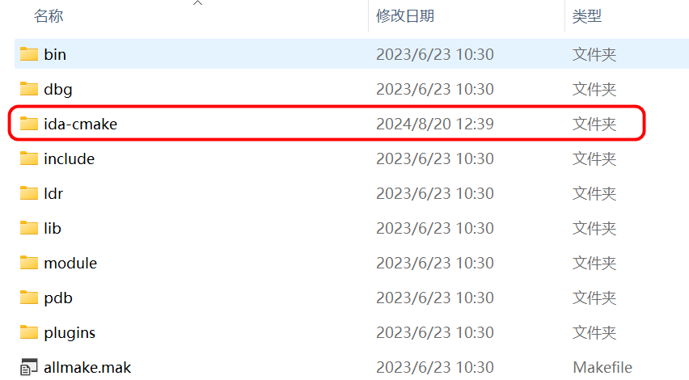
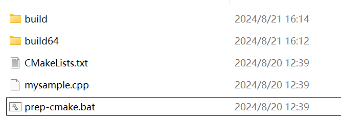
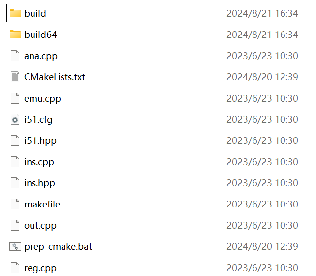
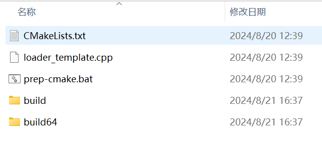

## 配置开发环境

下载 [ida-cmake](https://github.com/allthingsida/ida-cmake.git)并将其放入 IDASDK 根目录下，如下所示：



接着将 `IDASDK` 和 `IDABIN` 的安装目录添加到环境变量中，可以使用下列命令设置临时环境变量

```bash
set IDASDK="D:\ida\idasdk_pro83"
set IDABIN="D:\ida\idasdk_pro83\bin"
```

`IDASDK` 对应着 IDA SDK 的根目录；`IDABIN` 对应着 IDA 安装目录，即该目录下应该有 `ida64.exe` 文件。

## 插件开发

当开发环境配置好了之后，如果需要进行插件开发，直接进入 `%IDASDK%\ida-cmake\plugins\sample` 目录, 执行 `prep-cmake.bat` 即可生成一个简单的插件工程。



这里的 `prep-cmake.bat` 就是执行一些 cmake 的命令，如下所示：

```bat
@echo off

:: checkout the Batchography book

setlocal

if not defined IDASDK (
    echo IDASDK environment variable not set.
    echo Also make sure ida-cmake is installed in IDASDK.
    echo See: https://github.com/allthingsida/ida-cmake
    goto :eof
)

if not exist build cmake -A x64 -B build -S .
if not exist build64 cmake -B build64 -S . -A x64 -DEA64=YES

if "%1"=="build" cmake --build build --config Release && cmake --build build64 --config Release

echo.
echo All done!
echo.
```

接着进入 build 或 build64 目录，打开 `mysample.sln` 文件，然后点击 `Build Solution` 按钮即可编译插件，编译好的文件在 `%IDABIN%\plugins` 目录下。

这样一个简单的 IDA 插件就开发完成了，如果需要调试，首先选中项目右键设置 `Set as Startup Project`，然后再 VS 中设置好断点，然后调试运行（F5）既可。

如果后续需要修改插件，只需要修改 `CMakeLists.txt` 文件，重新编译即可，如下所示：

```cmake
cmake_minimum_required(VERSION 3.27 FATAL_ERROR)

project(mysample) # 项目名称

# Plugin 1
set(CMAKE_CXX_STANDARD 17)

include($ENV{IDASDK}/ida-cmake/idasdk.cmake)

set(PLUGIN_NAME              mysample) # 插件名称
set(PLUGIN_SOURCES           mysample.cpp) # 插件源文件，修改这里添加新的源文件
set(PLUGIN_RUN_ARGS          "-t -z10000") # Debug messages for the debugger
generate()
disable_ida_warnings(mysample)
```

后续的模块和 loader 开发基本也是同样的步骤。

### 插件模板介绍

下面为开发 IDA 插件的模板代码，可以根据需要进行修改。

```cpp
// encoding: UTF-8
#include <ida.hpp>
#include <idp.hpp>
#include <loader.hpp>
#include <kernwin.hpp>

//--------------------------------------------------------------------------
struct plugin_ctx_t : public plugmod_t {
    bool idaapi run(size_t) override {
        msg("当插件被用户通过菜单或者快捷键直接调用.\n");
        return true;
    }
};

plugmod_t* init() {
    msg("插件被加载时调用.\n");
    return new plugin_ctx_t();
}

void idaapi term(void) {
    //当结束插件时，一般您可以在此添加一点任务清理的代码。
    msg("插件已经卸载.\n");
    return;
}

bool idaapi run(size_t) {
    //当按下热键时候,执行功能的入口函数
    warning("当插件被用户通过菜单或者快捷键直接调用.");
    return true;
}

//--------------------------------------------------------------------------
static const char comment[] = "这是插件注释信息，鼠标指向插件时，会显示在状态栏.";
static const char help[] = "这是插件帮助信息";

//--------------------------------------------------------------------------
static const char wanted_name[] = "这是插件名称";
static const char wanted_hotkey[] = "Ctrl-Alt-F11";

//--------------------------------------------------------------------------
plugin_t PLUGIN = {
    IDP_INTERFACE_VERSION,      // 插件接口版本号。
    PLUGIN_UNL,                 // 插件属性。
    init,                       // 插件初始化函数。
    term,                       // 当IDA卸载插件时调用，可以为 nullptr。
    run,                        // 当插件被用户通过菜单或者快捷键直接调用，可以为 nullptr。
    comment,                    // 插件的注释信息，可以为 ""。
    help,                       // 插件的帮助信息，可以为 ""。
    wanted_name,                // 插件的名称。
    wanted_hotkey               // 插件的快捷键，可以为 ""。
};
```

这里需要注意的是 `bool idaapi run(size_t) override` 和 `bool idaapi run(size_t)` 同时存在的话，只会运行 `bool idaapi run(size_t)`。

下面是插件属性的解释：

`PLUGIN_MOD` :插件会更改数据库。如果处理器模块禁止任何更改，IDA 将不会调用该插件。
`PLUGIN_DRAW` :调用插件后，IDA 应该重绘所有内容。
`PLUGIN_SEG` :插件只有在当前地址属于一个段时才会被应用。
`PLUGIN_UNL` :调用 `run` 后立即卸载插件。这个标志可以随时设置，内核在每次调用 `run` 后都会检查它。这个标志的主要目的是为了方便调试新插件。
`PLUGIN_HIDE` :插件不应出现在 `Edit, Plugins` 菜单中。这个标志在启动时检查。
`PLUGIN_DBG` :调试器插件。`init()` 应该将 `::debugger_t` 的地址放入 dbg。
`PLUGIN_PROC` :当一个处理器模块加载时加载插件，并保持它直到处理器模块卸载。
`PLUGIN_FIX` :当 IDA 启动时加载插件，并在 IDA 停止之前保持它在内存中。
`PLUGIN_MULTI` :插件可以与多个 IDBs 并行工作。`init()` 返回一个指向 `plugmod_t` 对象的指针，`run` 和 `term` 函数不被使用，使用 `plugmod_t` 的虚函数。
`PLUGIN_SCRIPTED` :脚本插件。不应由插件使用，内核会自动设置它。

当 IDA 加载文件后，会生成一个 `idainfo` 信息，该信息存在在数据库文件中(即 IDB 文件)。

`idainfo` 结构体以全局变量 `inf` 的形式定义在 `<ida.hpp>` 头文件中，我们可以直接使用。下面列出一部分值:

```cpp
struct idainfo
{
	char tag[3];		//固定为'IDA'
	char zero;		    //没用
	ushort version;		//数据库版本
	char procname[16];	//当前处理器名称

	...
	ushort filetype;	// 被反汇编的文件类型,例如f_PE,f_ELF,参考filetype_t
	ea_t startIP;		// 程序开始运行时,[E]IP寄存器的值
	ea_t startSP;		// 程序开始运行时,[E]SP寄存器的值
	ea_t main;		    // IDA解析出的主函数入口点的线性地址
	ea_t minEA;		    // 程序的最小线性地址
	ea_t maxEA;		    // 程序的最大线性地址
	...
};
```

下面将介绍一些插件 SDK 对应的头文件。

auto.hpp 自动分析队列协同工作的函数

bitrange.hpp bitrange_t 类的定义

bytes.hpp 包含处理单个字节特性的函数

compress.hpp 数据压缩函数

dbg.hpp 包含控制进程调试的函数

dirtree.hpp 将项目分组到文件夹时涉及的类型

diskio.hpp IDA 的文件 I/O 函数

entry.hpp 处理入口点的函数

enum.hpp 汇编级枚举管理

err.h 处理错误代码的线程安全函数

expr.hpp 处理类 C 表达式和内置 IDC 语言的函数

fixup.hpp 处理 fixup 信息的函数

fpro.h 来自 Clib 的 FILE\* 相关函数的独立于系统的对应函数

frame.hpp 操作函数栈帧、栈变量、寄存器变量和局部标签的例程

funcs.hpp 在反汇编程序中处理函数的例程

gdl.hpp 低级图形绘制操作

graph.hpp 图形视图管理

ida.hpp 包含 ::inf 结构定义和整个 IDA 项目通用的一些函数

idd.hpp 包含 IDD 模块接口的定义

idp.hpp 包含 IDP 模块接口的定义

ieee.h IEEE 浮点函数

kernwin.hpp 定义内核与用户界面之间的接口

lex.hpp 解析类 C 输入的工具

lines.hpp 生成反汇编文本行的高级函数

loader.hpp IDP、LDR、PLUGIN 模块接口的定义

merge.hpp 合并功能

mergemod.hpp 模块的合并功能

nalt.hpp 网络节点中保存的各种信息的定义

name.hpp 处理名称的函数

netnode.hpp 为数据库提供最底层公共接口的函数。也就是说，我们使用 Btree。了解更多有关 BTree 的信息：

offset.hpp 处理偏移的函数

pro.h 这是 IDA 项目中包含的第一个头文件

problems.hpp 处理问题列表的函数

prodir.h qfindfirst(), qfindnext(), qfindclose() 函数的统一接口

pronet.h 网络相关函数

range.hpp 包含 range_t 的定义

registry.hpp 注册表相关函数

search.hpp 中层搜索函数

segment.hpp 处理分段的函数

segregs.hpp 处理段寄存器的函数

strlist.hpp 处理字符串列表的函数

struct.hpp 结构类型管理（汇编级类型）

typeinf.hpp 描述 IDA 中的类型信息记录

ua.hpp 处理程序指令反汇编的函数

xref.hpp 处理交叉引用的函数

## 模块开发

模块开发与插件开发类似，只需要将源码复制到 `%IDASDK%\ida-cmake\module\i51` 中，然后将 `prep-cmake.bat` 复制到该目录中，然后执行 `prep-cmake.bat` 即可生成一个简单的模块工程。

这里使用 `%IDASDK%\module\i51` 作为例子，会产生如下内容：



后续也可以根据实际需要对 `CMakeLists.txt` 进行修改。

## loader 开发

loader 开发与插件开发类似，只需要将源码复制到 `%IDASDK%\ida-cmake\loaders\simpleloader` 中，然后将 `prep-cmake.bat` 复制到该目录中，然后执行 `prep-cmake.bat` 即可生成一个简单的 loader 工程。



后续也可以根据实际需要对 `CMakeLists.txt` 进行修改。
