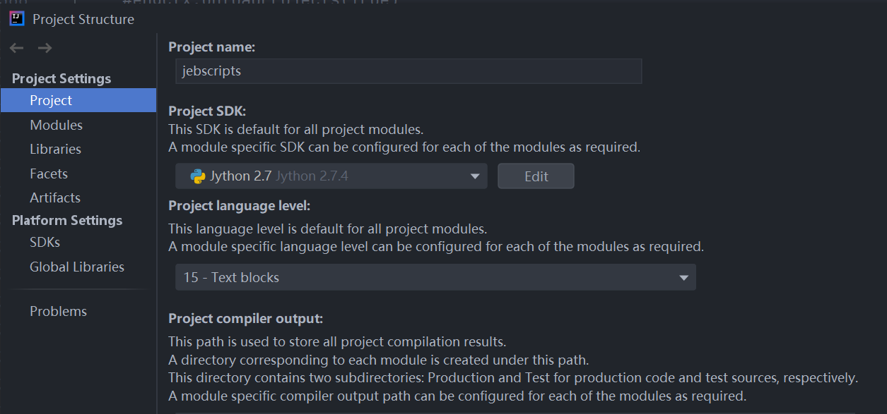
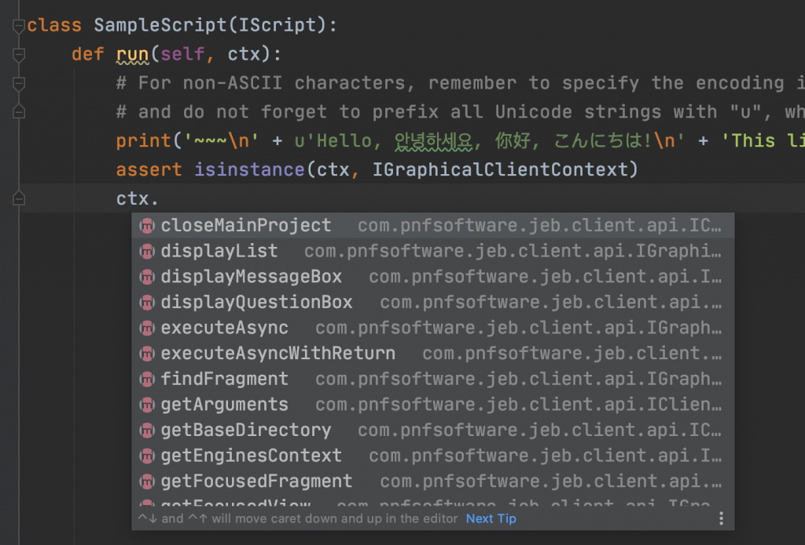

# JEB Python 脚本环境配置

## 安装 idea 以及 jpython 并配置环境

1. 安装 idea 2021 以下的版本，并安装 [jpython](https://www.jython.org/download).

2. 在 idea 中安装插件 Python Community Edition 。

3. 使用 idea 创建一个 python 项目，选择 jpython 作为解释器，之后可以在 ProjectStucture 中看到项目的配置。下图为配置好的选项。



## 引入 jeb.jar

把 jeb.jar（位于 JEBPro 里）直接拷贝到工程里，右键 Add as Library，一路确定，就可以了。

## 使用自动补全功能

在官方的脚本里，结合 isinstance，就可以进行类型推断和代码补全。




这里写了一个例子：
```python
#!/usr/bin/env python
# -*- coding: utf-8 -*-
# Created by CKCat on 2020/5/18
from com.pnfsoftware.jeb.client.api import IScript, IGraphicalClientContext, IClientContext, \
    IUnitFragment
from com.pnfsoftware.jeb.core import RuntimeProjectUtil, IUnitContribution
from com.pnfsoftware.jeb.core.units import IUnit
from com.pnfsoftware.jeb.core.output import IGenericDocument, IUnitFormatter, \
    IUnitDocumentPresentation
from com.pnfsoftware.jeb.core.output.text import ITextDocument, ITextDocumentPart
from com.pnfsoftware.jeb.core.units.code import ICodeUnit, ICodeItem, IInstruction
from com.pnfsoftware.jeb.core.units.code.android import IDexUnit
from com.pnfsoftware.jeb.core.actions import Actions, ActionContext, ActionCommentData, ActionRenameData
from com.pnfsoftware.jeb.core.units.code.android.dex import IDexClass, IDexMethod, IDexField
from java.lang import Runnable
import re
from collections import defaultdict

rules ="""
#获取手机号码: 
-invoke-virtual Landroid/telephony/TelephonyManager;->getLine1Number\(\)Ljava/lang/String;
end

#读取联系人、短信等信息: 
-invoke-virtual/range Landroid/content/ContentResolver;->query\(Landroid/net/Uri;\[Ljava/lang/String;Ljava/lang/String;\[Ljava/lang/String;Ljava/lang/String;\)Landroid/database/Cursor;.+invoke-interface Landroid/database/Cursor;->moveToNext\(\)Z
end

#HTTP网络连接:
-invoke-virtual Ljava/net/URL;->openConnection\(\)Ljava/net/URLConnection;
end

#文件删除: 
-invoke-virtual Ljava/io/File;->delete\(\)Z
end

#文件遍历: 
-invoke-virtual Ljava/io/File;->listFiles\(\)\[Ljava/io/File;
end

#开启录音功能:
-invoke-virtual Landroid/media/MediaRecorder;->start\(\)V
end

#删除短信、联系人: 
-invoke-virtual Landroid/content/ContentResolver;->delete\(Landroid/net/Uri;Ljava/lang/String;\[Ljava/lang/String;\)I
end

#激活DeviceAdmin功能,可能尝试锁屏、恢复出厂设置、防卸载等恶意功能: 
-invoke-direct Landroid/app/admin/DeviceAdminReceiver;-><init>\(\)V
end

#文件写操作: 
-invoke-virtual Ljava/io/OutputStream;->write\(\[B\)V
end

#发送短信: 
-invoke-virtual/range Landroid/telephony/SmsManager;->sendMultipartTextMessage\(Ljava/lang/String;Ljava/lang/String;Ljava/util/ArrayList;Ljava/util/ArrayList;Ljava/util/ArrayList;\)V
-invoke-virtual/range Landroid/telephony/SmsManager;->sendTextMessage\(Ljava/lang/String;Ljava/lang/String;Ljava/lang/String;Landroid/app/PendingIntent;Landroid/app/PendingIntent;\)V
end

#加载额外APK执行，可能存在恶意代码捆绑:
- invoke-direct Ldalvik/system/DexClassLoader;-><init>
end

#反射调用:
-invoke-static Ljava/lang/Class;->forName\(Ljava/lang/String;\)Ljava/lang/Class;
end

#获取位置信息
-invoke-virtual Landroid/location/Location;->getLatitude\(\)D
-invoke-virtual Landroid/location/Location;->getLongitude\(\)D
end

"""


class MalScan(IScript):
    def run(self, ctx):
        assert isinstance(ctx, IGraphicalClientContext)
        ctx.executeAsync("Running MalScan class ...", Scan(ctx))
        print('Done')

class Scan(Runnable):
    result = defaultdict(list)
    rules = {}
    methods = {}
    fileds = {}
    fieldptn = re.compile("field@\d+")
    methondptn = re.compile("method@\d+")
    methods_context = {}

    def __init__(self, ctx):
        self.ctx = ctx

    def run(self):
        ctx = self.ctx
        assert isinstance(ctx, IGraphicalClientContext)
        engctx = ctx.getEnginesContext()

        if not engctx:
            print('Back-end engines not initialized')
            return

        projects = engctx.getProjects()
        if not projects:
            print('There is no opened project')
            return

        self.parse_rule()
        prj = projects[0]
        units = RuntimeProjectUtil.findUnitsByType(prj, IDexUnit, False)

        for unit in units:
            assert isinstance(unit, IDexUnit)
            classes = unit.getClasses()
            unit.getFormatter()

            # 获取 Field 和 method 的索引
            for field in unit.getFields():
                self.fileds["field@" + str(field.getIndex())] = field.getSignature()
            for method in unit.getMethods():
                self.methods["method@" + str(method.getIndex())] = method.getSignature()

            if classes:
                for clazz in classes:
                    assert isinstance(clazz, IDexClass)
                    # Ljava/util/ArrayList; --> java.util.ArrayList
                    # class_name = clazz.getSignature()[1:-1].replace("/", ".")
                    class_name = clazz.getSignature()
                    for method in clazz.getMethods():
                        assert isinstance(method, IDexMethod)
                        method_name = method.getSignature()
                        formatIns = ""
                        inss = method.getInstructions()
                        # print method.getAddress()
                        if inss:
                            for ins in inss:
                                assert isinstance(ins, IInstruction)
                                formats = ins.format(None)
                                formats = self.formartIns(formats)
                                formatIns += formats
                        self.methods_context[method_name] = formatIns
        # f = open("G:\\java\\jebScript\\test.txt", mode="w")
        # f.write(str(self.methods_context))
        # f.close()
        self.get_result()

    def formartIns(self, formats):
        '''
        格式化为 smali 样式, 如下
        new-instance v0, type@3616invoke-direct Lyw;-><init>()V, v0sput-object v0, Lyw;->r:Lyw;sget-object v0, Lyw;->r:Lyw;invoke-virtual Lku;->f()V, v0return-void
        :param formats:
        :return:
        '''
        ret = formats
        s_field = self.fieldptn.search(formats)
        if s_field:
            ret = formats.replace(s_field.group(), self.fileds[s_field.group()])

        s_method = self.methondptn.search(ret)
        if s_method:
            ret = ret.replace(s_method.group(), self.methods[s_method.group()])
        return ret

    def parse_rule(self):
        rules_list = []
        rule_name = ""
        for line in rules.split("\n"):
            if line.startswith('#'):
                rule_name = line
            if line.startswith("-"):
                rules_list.append(line[1:])
            if line.startswith('e'):
                self.rules[rule_name] = rules_list
                rule_name = ""
                rules_list = []

    def get_result(self):
        for key, val in self.methods_context.iteritems():
            for rule_name, rule_lst in self.rules.iteritems():
                #print(rule_name.decode("utf8"))

                for rule in rule_lst:
                    # if val.find(rule) !=-1:
                    # print rule
                    if re.search(rule.strip(), val):
                        self.result[rule_name].append(key)
        # print self.result
        for name, method in self.result.iteritems():
            print name.decode("utf8")
            for i in method:
                print i
            print ""
```

# 参考：
https://leadroyal.cn/p/1060/