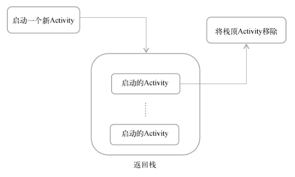
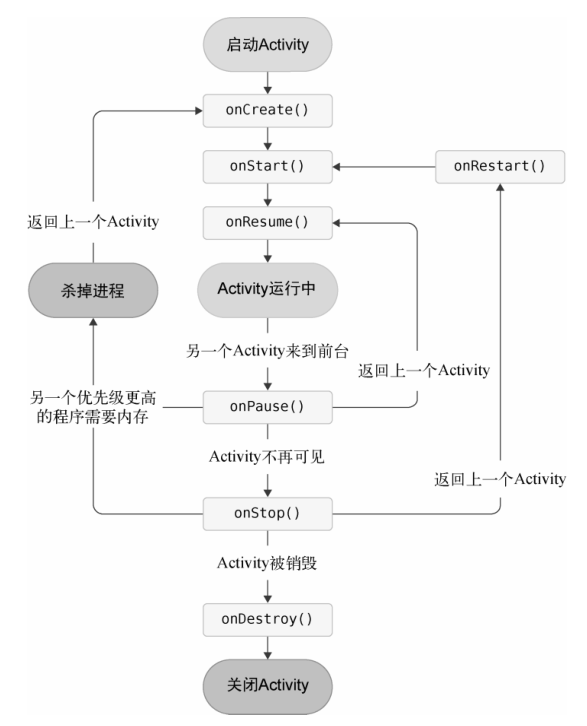
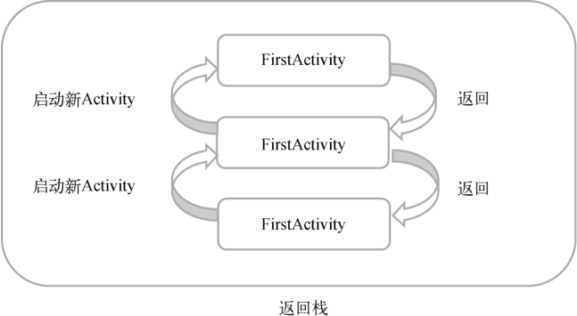
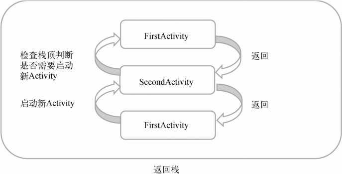
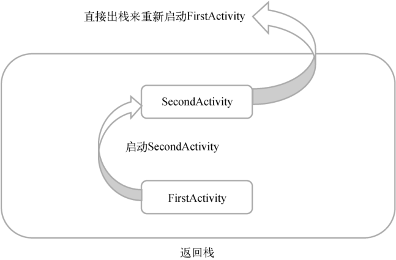
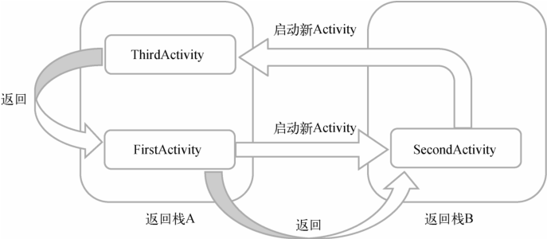

# Activity

Activity 是一种可以包含用户界面的组件，主要用于和用户进行交互,一个应用程序中可以包含零个或多个 Activity 。

## Activity 基本用法

### 创建 Activity

创建一个 `Empty Views Activity` 的项目,然后选中项目的包名右击选中 `New -> Activity -> Empty Views Activity` 会弹出一个创建 Activity 的对话框，根据需求填入对应的参数即可创建一个 Activity 类和对应 Layout 文件,这里创建一个名为 `MainActivity` 的 Activity 和一个名为 `activity_main` 的 Layout 文件。

打开 `activity_main.xml` 文件，修改布局为 `LinearLayout`，并添加一个按钮，如下所示：

```xml
<?xml version="1.0" encoding="utf-8"?>
<LinearLayout xmlns:android="http://schemas.android.com/apk/res/android"
    android:orientation="vertical"
    android:layout_width="match_parent"
    android:layout_height="match_parent">

    <Button
        android:id="@+id/btn_ok"
        android:layout_width="match_parent"
        android:layout_height="wrap_content"
        android:text="Button"/>

</LinearLayout>
```

- `android:id` 是给当前的元素定义一个唯一的标识符。
- `android:layout_width` 指定了当前元素的宽度。
- `android:layout_height` 指定了当前元素的高度。
- `android:text` 指定了元素中显示的文字内容。

然后在 `onCreate()` 调用 `setContentView(R.layout.activity_main)` 方法加载布局。

```kotlin
class MainActivity : AppCompatActivity() {
    override fun onCreate(savedInstanceState: Bundle?) {
        super.onCreate(savedInstanceState)
        setContentView(R.layout.activity_main)
    }
}
```

此时还需要在 `AndroidManifest.xml` 文件中注册对应的 Activity，如下所示：

```xml
<?xml version="1.0" encoding="utf-8"?>
<manifest xmlns:android="http://schemas.android.com/apk/res/android"
    xmlns:tools="http://schemas.android.com/tools">

    <application
        android:allowBackup="true"
        android:dataExtractionRules="@xml/data_extraction_rules"
        android:fullBackupContent="@xml/backup_rules"
        android:icon="@mipmap/ic_launcher"
        android:label="@string/app_name"
        android:roundIcon="@mipmap/ic_launcher_round"
        android:supportsRtl="true"
        android:theme="@style/Theme.activity"
        tools:targetApi="31">
        <activity
            android:name=".MainActivity"
            android:label="这是第一个 Activity"
            android:exported="true">
            <!-- android:label 指定Activity中标题栏的内容 -->
            <intent-filter>
                <!-- 配置主Activity -->
                <action android:name="android.intent.action.MAIN" />
                <category android:name="android.intent.category.LAUNCHER" />
            </intent-filter>

        </activity>
    </application>

</manifest>
```

`android:label` 指定 Activity 中标题栏的内容.需要注意的是，给主 Activity 指定的 `label` 不仅会成为标题栏中的内容，还会成为启动器（Launcher）中应用程序显示的名称。

`<action android:name="android.intent.action.MAIN"/>` 和 `<category android:name="android.intent.category.LAUNCHER" />` 为程序配置主 Activity。

这样就成功的创建了一个 Activity 了。

### 添加按钮点击事件

通过 `findViewById()` 找到对应的按钮，然后再调用 `setOnClickListener()`方法为按钮注册一个监听器，点击按钮时就会执行监听器中的 `onClick()`方法。如下所示：

```kotlin
class MainActivity : AppCompatActivity() {
    override fun onCreate(savedInstanceState: Bundle?) {
        super.onCreate(savedInstanceState)
        setContentView(R.layout.activity_main)
        // 通过 id 得到按钮的实例
        val btn:Button = findViewById(R.id.btn_ok)
        // 调用setOnClickListener()方法为按钮注册一个监听器，点击按钮时就会执行监听器中的onClick()方法。
        btn.setOnClickListener{
            // 显示提示内容
            Toast.makeText(this, "你点击了按钮", Toast.LENGTH_SHORT).show()
        }
    }
}
```

`findViewById()`方法的作用就是获取布局文件中控件的实例，当控件很多时，就需要重复调用多次 `findViewById()`方法，可以在 `app/build.gradle` 文件的头部引入了一个 `kotlin-android-extensions` 插件，这个插件会根据布局文件中定义的控件 id 自动生成一个具有相同名称的变量，我们可以在 Activity 里直接使用这个变量，而不用再调用 `findViewById()`方法了。

```kotlin
import kotlinx.android.synthetic.main.activity_main.*

class MainActivity : AppCompatActivity() {
    override fun onCreate(savedInstanceState: Bundle?) {
        super.onCreate(savedInstanceState)
        setContentView(R.layout.activity_main)
        btn_ok.setOnClickListener{
            Toast.makeText(this, "你点击了按钮", Toast.LENGTH_SHORT).show()
        }
    }
}
```

### 在 Activity 中使用 Menu

首先在 `res` 目录下新建一个 `menu` 文件夹，右击 `res` 目录选中 `New -> Directory` 然后根据提示创建一个名为 `menu` 的目录。接着在这个文件夹下新建一个名叫 `main` 的菜单文件，右击 `menu` 文件夹选中 `New -> Menu resource file` 然后根据提示创建一个名为`main.xml` 的文件,在 `main.xml` 中添加如下代码：

```xml
<?xml version="1.0" encoding="utf-8"?>
<menu xmlns:android="http://schemas.android.com/apk/res/android">
    <!-- android:title 给这个菜单项指定一个名称 -->
    <item
        android:id="@+id/add_item"
        android:title="Add"/>
    <item
        android:id="@+id/remove_item"
        android:title="Remove"/>
</menu>
```

`android:title` 给这个菜单项指定一个名称.

接着回到 `MainActivity` 中来重写 `onCreateOptionsMenu()`方法，重写方法可以使用 `Ctrl + O` 快捷键。编写如下代码：

```kotlin
override fun onCreateOptionsMenu(menu: Menu?): Boolean {
    // 使用 Kotlin 语法糖，menuInflater实际调用父类的 getMenuInflater() 方法
    // inflate() 方法将 R.menu.main 的菜单项将添加到menu对象当中
    menuInflater.inflate(R.menu.main, menu)
    // 返回 true 表示允许创建的菜单显示出来，
    return true
}
```

然后重写 `onOptionsItemSelected()` 方法定义菜单响应事件。

```kotlin
override fun onOptionsItemSelected(item: MenuItem): Boolean {
    // 通过调用 item.itemId 来判断点击的是哪一个菜单项。
    when(item.itemId){
        R.id.add_item -> Toast.makeText(this, "点击了Add菜单", Toast.LENGTH_SHORT).show()
        R.id.remove_item -> Toast.makeText(this, "点击了Remove菜单", Toast.LENGTH_SHORT).show()
    }
    return true
}
```

### 销毁一个 Activity

通常情况下，只要按一下 Back 键就可以销毁当前的 Activity 了。也可以在程序中通过调用 `finish()` 方法来销毁当前的 Activity。

```kotlin
btn_ok.setOnClickListener{
    finish() // 销毁当前的 Activity
}
```

点击一下按钮，当前的 Activity 就被成功销毁了，效果和按下 Back 键是一样的。

## 使用 Intent 在 Activity 之间穿梭

### 使用显式 Intent

创建一个名为 `SecondActivity` 的 Activity，编辑 `activity_second.xml`，将里面的代码替换成如下内容：

```xml
<?xml version="1.0" encoding="utf-8"?>
<LinearLayout xmlns:android="http://schemas.android.com/apk/res/android"
    android:orientation="vertical"
    android:layout_width="match_parent"
    android:layout_height="match_parent">
    <TextView
        android:id="@+id/tv_sa"
        android:layout_width="match_parent"
        android:layout_height="wrap_content"
        android:gravity="center"
        android:textSize="20dp"
        android:text="SecondActivity"/>
</LinearLayout>
```

然后在 `AndroidManifest.xml` 中注册,正常情况下 IDE 会自动帮我们注册。

```xml
    <application
        ...
        <activity android:name=".SecondActivity"/>
    </application>
```

最后在 `MainActivity` 上添加一个按钮，点击后使用显式 `Intent` 启动 `SecondActivity`。在`activity_main.xml`中添加下列代码：

```xml
<?xml version="1.0" encoding="utf-8"?>
<LinearLayout xmlns:android="http://schemas.android.com/apk/res/android"
    ...
    <Button
        android:id="@+id/btn_explicit"
        android:layout_width="match_parent"
        android:layout_height="wrap_content"
        android:text="显式Intent"/>
</LinearLayout>
```

在 `onCreate()` 添加按钮点击事件:

```kotlin
btn_explicit.setOnClickListener {
    // 显式 Intent
    val intent =  Intent(this, SecondActivity::class.java)
    startActivity(intent)
}
```

这样就可以使用显式 `Intent` 启动 `SecondActivity` 了。

### 使用隐式 Intent

相比于显式 `Intent`，隐式 `Intent` 则含蓄了许多，它并不明确指出想要启动哪一个 Activity，而是指定了一系列更为抽象的 `action` 和 `category` 等信息，然后交由系统去分析这个 `Intent`，并帮我们找出合适的 Activity 去启动。

通过在 `<activity>` 标签下配置 `<intent-filter>` 的内容，可以指定当前 Activity 能够响应的 `action` 和 `category`，打开 `AndroidManifest.xml`，添加如下代码：

```xml
<application
    ...
    <activity
        android:name=".SecondActivity"
        android:exported="true">
        <intent-filter>
            <action android:name="com.example.activity.ACTION_START" />
            <!-- 默认的 category -->
            <category android:name="android.intent.category.DEFAULT" />
            <category android:name="com.example.activity.MY_CATEGORY" />
        </intent-filter>
    </activity>
</application>
```

每个 `Intent` 中只能指定一个 `action`，但能指定多个 `category`,其中默认的 `category` 是必须的,否则会报 `ActivityNotFoundException` 异常。然后在 `onCreate()` 中添加如下代码,在按钮点击时使用隐式 `Intent` 启动 `SecondActivity`：

```kotlin
btn_implicit.setOnClickListener {
    val intent = Intent("com.example.activity.ACTION_START")
    intent.addCategory("com.example.activity.MY_CATEGORY")
    startActivity(intent)
}
```

使用隐式 `Intent`，不仅可以启动自己程序内的 Activity，还可以启动其他程序的 Activity，这就使多个应用程序之间的功能共享成为了可能。例如打开一个网页，对应的代码如下：

```kotlin
btn_openUrl.setOnClickListener {
    val intent = Intent(Intent.ACTION_VIEW)
    intent.data = Uri.parse("https://baidu.com")
    startActivity(intent)
}
```

我们还可以在 `<intent-filter>` 标签中再配置一个 `<data>` 标签，用于更精确地指
定当前 Activity 能够响应的数据。`<data>` 标签中主要可以配置以下内容。

- `android:scheme`。用于指定数据的协议部分，如上例中的 https 部分。
- `android:host`。用于指定数据的主机名部分，如上例中的 www.baidu.com 部分。
- `android:port`。用于指定数据的端口部分，一般紧随在主机名之后。
- `android:path`。用于指定主机名和端口之后的部分，如一段网址中跟在域名之后的内
- 容。
- `android:mimeType`。用于指定可以处理的数据类型，允许使用通配符的方式进行指定。

例如指定 `android:scheme` 为 https，就可以响应所有 https 协议的 `Intent` 了.在 `activity_main.xml` 中添加如下代码.

```xml
<?xml version="1.0" encoding="utf-8"?>
<LinearLayout xmlns:android="http://schemas.android.com/apk/res/android"
    android:orientation="vertical"
    android:layout_width="match_parent"
    android:layout_height="match_parent">
    ...
    <Button
        android:id="@+id/btn_openUrl"
        android:layout_width="match_parent"
        android:layout_height="wrap_content"
        android:text="打开Web"/>

</LinearLayout>
```

然后在 `AndroidManifest.xml` 中修改 `ThirdActivity` 的注册信息：

```xml
<activity android:name=".ThirdActivity" android:exported="true">
    <intent-filter tools:ignore="AppLinkUrlError">
        <action android:name="android.intent.action.VIEW"/>
        <category android:name="android.intent.category.DEFAULT"/>
        <data android:scheme="https"/>
    </intent-filter>
</activity>
```

此时运行程序，点击 `打开Web` 按钮，系统自动弹出了一个列表，显示了目前能够响应这个 `Intent` 的所有程序，其中包含我们编写的 `ThirdActivity` 。

除了 https 协议外，我们还可以指定很多其他协议，比如 `geo` 表示显示地理位置、`tel` 表示拨打电话。

### 向下一个 Activity 传递数据

在启动 Activity 时传递数据的思路很简单，`Intent` 中提供了一系列 `putExtra()` 方法的重载，可以把我们想要传递的数据暂存在 `Intent` 中，在启动另一个 Activity 后，只需要把这些数据从 `Intent` 中取出就可以了。

例如：

```kotlin
// MainActivity onCreate
btn_explicit.setOnClickListener {
    // 显式 Intent
    val intent =  Intent(this, SecondActivity::class.java)
    // 传递数据
    val data = "Hello SecondActivity"
    intent.putExtra("extra_data", data)
    startActivity(intent)
}

// SecondActivity onCreate
override fun onCreate(savedInstanceState: Bundle?) {
    super.onCreate(savedInstanceState)
    setContentView(R.layout.activity_second)
    val extraData = intent.getStringExtra("extra_data")
    tv_sa.setText(extraData)
}
```

### 返回数据给上一个 Activity

Activity 类中还有一个用于启动 Activity 的 `startActivityForResult()` 方法，但它期望在 Activity 销毁的时候能够返回一个结果给上一个 Activity。

```kotlin
// MainActivity onCreate
btn_startActivityForResult.setOnClickListener {
    val intent = Intent(this, ThirdActivity::class.java)
    startActivityForResult(intent, 1)
}
// MainActivity
// 获取 startActivityForResult 启动的Activity退出时传递的数据
override fun onActivityResult(requestCode: Int, resultCode: Int, data: Intent?) {
    super.onActivityResult(requestCode, resultCode, data)
    when(requestCode){
        1 -> if (resultCode == RESULT_OK){
            val returnedData = data?.getStringExtra("return_data")
            Log.d(TAG, "onActivityResult: $returnedData")
        }
    }
}

// ThirdActivity
// 当用户按下Back键后，就会执行onBackPressed()方法中的代码
override fun onBackPressed() {
    val intent = Intent()
    intent.putExtra("return_data", "Hello FirstActivity")
    setResult(RESULT_OK, intent)
    finish()
}
```

`startActivityForResult()` 方法接收两个参数：第一个参数还是 `Intent`；第二个参数是请求码，用于在之后的回调中判断数据的来源。

## Activity 的生命周期

### 返回栈

其实 Android 是使用任务（task）来管理 Activity 的，一个任务就是一组存放在栈里的 Activity 的集合，这个栈也被称作返回栈（back stack）。栈是一种后进先出的数据结构，在默认情况下，每当我们启动了一个新的 Activity，它就会在返回栈中入栈，并处于栈顶的位置。而每当我们按下 Back 键或调用 `finish()`方法去销毁一个 Activity 时，处于栈顶的 Activity 就会出栈，前一个入栈的 Activity 就会重新处于栈顶的位置。系统总是会显示处于栈顶的 Activity 给用户。



### Activity 状态

每个 Activity 在其生命周期中最多可能会有 4 种状态。

#### 01. 运行状态

当一个 Activity 位于返回栈的栈顶时，Activity 就处于运行状态。系统最不愿意回收的就是处于运行状态的 Activity，因为这会带来非常差的用户体验。

#### 02. 暂停状态

当一个 Activity 不再处于栈顶位置，但仍然可见时，Activity 就进入了暂停状态。你可能会觉得，既然 Activity 已经不在栈顶了，怎么会可见呢？这是因为并不是每一个 Activity 都会占满整个屏幕，比如对话框形式的 Activity 只会占用屏幕中间的部分区域。处于暂停状态的 Activity 仍然是完全存活着的，系统也不愿意回收这种 Activity(因为它还是可见的，回收可见的东西都会在用户体验方面有不好的影响)，只有在内存极低的情况下，系统才会去考虑回收这种 Activity。

#### 03. 停止状态

当一个 Activity 不再处于栈顶位置，并且完全不可见的时候，就进入了停止状态。系统仍然会为这种 Activity 保存相应的状态和成员变量，但是这并不是完全可靠的，当其他地方需要内存时，处于停止状态的 Activity 有可能会被系统回收。

#### 04. 销毁状态

一个 Activity 从返回栈中移除后就变成了销毁状态。系统最倾向于回收处于这种状态的 Activity，以保证手机的内存充足。

### Activity 的生存期

Activity 类中定义了 7 个回调方法，覆盖了 Activity 生命周期的每一个环节，下面就来一一介绍这 7 个方法。

- `onCreate()` 它会在 Activity 第一次被创建的时候调用。你应该在这个方法中完成 Activity 的初始化 操作，比如加载布局、绑定事件等。
- `onStart()` 这个方法在 Activity 由不可见变为可见的时候调用。
- `onResume()` 这个方法在 Activity 准备好和用户进行交互的时候调用。此时的 Activity 一 定位于返回栈的栈顶，并且处于运行状态。
- `onPause()` 这个方法在系统准备去启动或者恢复另一个 Activity 的时候调用。
- `onStop()` 这个方法在 Activity 完全不可见的时候调用。
- `onDestroy()` 这个方法在 Activity 被销毁之前调用，之后 Activity 的状态将变为销毁状态。
- `onRestart()` 这个方法在 Activity 由停止状态变为运行状态之前调用，也就是 Activity 被重新启动了。

以上 7 个方法中除了 `onRestart()` 方法，其他都是两两相对的，从而又可以将 Activity 分为以下 3 种生存期。

- 完整生存期。Activity 在 `onCreate()` 方法和 `onDestroy()` 方法之间所经历的就是完整生存期。
- 可见生存期。Activity 在 `onStart()` 方法和` onStop()` 方法之间所经历的就是可见生存期。在可见生存期内，Activity 对于用户总是可见的，即便有可能无法和用户进行交互。
- 前台生存期。Activity 在 `onResume()` 方法和 `onPause()` 方法之间所经历的就是前台生存期。在前台生存期内，Activity 总是处于运行状态。



例如创建一个正常的 Activity 和 Dialog Activity：

```xml
<activity
    android:name=".DialogActivity"
    android:theme="@style/Theme.AppCompat.Dialog"
    android:exported="true">
</activity>
<activity
    android:name=".NormalActivity"
    android:exported="true">
</activity>
```

在 `onCreate` 中分别启动 `DialogActivity` 和 `NormalActivity`，可以 `MainActivity` 的整个生命周期的不同状态。

```kotlin
import kotlinx.android.synthetic.main.activity_main.*
class MainActivity : AppCompatActivity() {
    companion object {
        private val TAG = "MainActivity"
    }
    override fun onCreate(savedInstanceState: Bundle?) {
        super.onCreate(savedInstanceState)
        setContentView(R.layout.activity_main)
        Log.d(TAG, "onCreate 第一次创建 Activity")
    }
    override fun onStart() {
        super.onStart()
        Log.d(TAG, "onStart Activity 由不可见变为可见.")
    }
    override fun onResume() {
        super.onResume()
        Log.d(TAG, "onResume Activity 一定在栈顶.")
    }
    override fun onPause() {
        super.onPause()
        Log.d(TAG, "onPause 系统正准备去启动或恢复另一个 Activity.")
    }
    override fun onStop() {
        super.onStop()
        Log.d(TAG, "onStop Activity 不可见了.")
    }
    override fun onDestroy() {
        super.onDestroy()
        Log.d(TAG, "onDestroy Activity被销毁.")
    }
    override fun onRestart() {
        super.onRestart()
        Log.d(TAG, "onRestart Activity 重新启动.")
    }
}
```

当打开 `MainActivity` 时，输出下列日志：

```bash
MainActivity            D  onCreate 第一次创建 Activity
MainActivity            D  onStart Activity 由不可见变为可见.
MainActivity            D  onResume Activity 一定在栈顶.
```

当启动 `NormalActivity` 时，输出下列日志：

```bash
MainActivity            D  onPause 系统正准备去启动或恢复另一个 Activity.
MainActivity            D  onStop Activity 不可见了.
```

当从 `NormalActivity` 回到 `MainActivity` 时，输出下列日志：

```bash
MainActivity            D  onRestart Activity 重新启动.
MainActivity            D  onStart Activity 由不可见变为可见.
MainActivity            D  onResume Activity 一定在栈顶.
```

当打开 DialogActivity 时，输出下列日志：

```bash
MainActivity            D  onPause 系统正准备去启动或恢复另一个 Activity.
```

当从 `DialogActivity` 回到 `MainActivity` 时，输出下列日志：

```bash
MainActivity            D  onResume Activity 一定在栈顶.
```

Activity 中还提供了一个 `onSaveInstanceState()` 回调方法，这个方法可以保证在 Activity 被回收之前一定会被调用，因此我们可以通过这个方法来将临时数据进行保存，然后在 `onCreate()` 方法中重新获取数据。

```kotlin
    override fun onCreate(savedInstanceState: Bundle?) {
        super.onCreate(savedInstanceState)
        setContentView(R.layout.activity_main)
        if (savedInstanceState != null){
            val tmpData = savedInstanceState.getString("data_key")
            Log.d(TAG, "onCreate: $tmpData")
        }
    }

    override fun onSaveInstanceState(outState: Bundle) {
        super.onSaveInstanceState(outState)
        // 将临时数据进行保存
        val tmpData = "Something you just typed."
        outState.putString("data_key", tmpData)
    }
```

## Activity 的启动模式

启动模式一共有 4 种，分别是 `standard`、`singleTop`、`singleTask` 和 `singleInstance`，可以在 `AndroidManifest.xml` 中通过给 `<activity>` 标签指定 `android:launchMode` 属性来选择启动模式。

### standard

`standard` 是 Activity 默认的启动模式，在不进行显式指定的情况下，所有 Activity 都会自动使用这种启动模式。在 `standard` 模式下，每当启动一个新的 Activity，它就会在返回栈中入栈，并处于栈顶的位置。对于使用 `standard` 模式的 Activity，系统不会在乎这个 Activity 是否已经在返回栈中存在，每次启动都会创建一个该 Activity 的新实例。

在 `MainActivity` 添加下列代码:

```kotlin
Log.d(TAG, "onCreate: ${this.toString()}")
// standard 模式启动
btn_standard.setOnClickListener{
    val intent = Intent(this, MainActivity::class.java)
    startActivity(intent)
}
```

每次点击一下按钮都会启动一个新的 `MainActivity`，输出的日志如下：

```bash
MainActivity            D  onCreate: com.example.activity.MainActivity@90cf5e7
MainActivity            D  onCreate: com.example.activity.MainActivity@fb7661f
MainActivity            D  onCreate: com.example.activity.MainActivity@cf0a7f3
```

`standard` 模式的原理如图所示：



### singleTop

当 Activity 的启动模式指定为 `singleTop`，在启动 Activity 时如果发现返回栈的栈顶已经是该 Activity，则认为可以直接使用它，不会再创建新的 Activity 实例。如果不在返回栈的栈顶，就会创建一个新的 Activity 实例。

修改 `AndroidManifest.xml` 中的 `MainActivity` 的 `android:launchMode` 属性为 `singleTop`，多次点击按钮也不会再创建新的 `MainActivity`，输出下列日志：

```bash
MainActivity            D  onCreate: com.example.activity.MainActivity@3589346
```

修改 `MainActivity` 和 `SecondActivity` 的代码：

```kotlin
// MainActivity
Log.d(TAG, "onCreate: ${this.toString()}")
btn_explicit.setOnClickListener {
    val intent =  Intent(this, SecondActivity::class.java)
    startActivity(intent)
}

// SecondActivity
Log.d("SecondActivity", "onCreate: ${this.toString()}")
btn_open_first.setOnClickListener{
    val intent = Intent(this, MainActivity::class.java)
    startActivity(intent)
}
```

在 `MainActivity` 中点击按钮打开 `SecondActivity` 后，然后在 `SecondActivity` 中点击按钮再次打开 `MainActivity`，输出的日志如下：

```bash
MainActivity            D  onCreate: com.example.activity.MainActivity@3589346
SecondActivity          D  onCreate: com.example.activity.SecondActivity@25d81e2
MainActivity            D  onCreate: com.example.activity.MainActivity@92de4ac
```

`singleTop` 模式的原理如图所示：



### singleTask

当 Activity 的启动模式指定为 `singleTask`，每次启动该 Activity 时，系统首先会在返回栈中检查是否存在该 Activity 的实例，如果发现已经存在则直接使用该实例，并把在这个 Activity 之上的所有其他 Activity 统统出栈，如果没有发现就会创建一个新的 Activity 实例。

修改 `AndroidManifest.xml` 中的 `MainActivity` 的 `android:launchMode` 属性为 `singleTask`，然后修改 `SecondActivity` 的代码：

```kotlin
override fun onDestroy() {
    super.onDestroy()
    Log.d("SecondActivity", "onDestroy Activity被销毁.")
}
```

在 `MainActivity` 中点击按钮打开 `SecondActivity` 后，然后在 `SecondActivity` 中点击按钮再次打开 `MainActivity`，输出的日志如下：

```bash
MainActivity            D  onCreate: com.example.activity.MainActivity@3589346
SecondActivity          D  onCreate: com.example.activity.SecondActivity@82491d
MainActivity            D  onRestart Activity 重新启动.
SecondActivity          D  onDestroy Activity被销毁.
```

最后按一下 Back 键，程序直接退出。

`singleTask` 模式的原理如图所示



### singleInstance

不同于以上 3 种启动模式，指定为 `singleInstance` 模式的 Activity 会启用一个新的返回栈来管理这个 Activity。不管是哪个应用程序来访问这个 Activity，都共用同一个返回栈，也就解决了共享 Activity 实例的问题。

修改 `AndroidManifest.xml` 中的 `SecondActivity` 的 `android:launchMode` 属性为 `singleInstance`，然后修改 `MainActivity` 、`SecondActivity` 和 `ThirdActivity` 的代码：

```kotlin
// MainActivity
Log.d(TAG, "Task id is $taskId")
btn_explicit.setOnClickListener {
    val intent =  Intent(this, SecondActivity::class.java)
    startActivity(intent)
}

// SecondActivity
Log.d("SecondActivity", "Task id is $taskId")
btn_open_third.setOnClickListener {
    val intent = Intent(this, ThirdActivity::class.java)
    startActivity(intent)
}

// ThirdActivity
override fun onCreate(savedInstanceState: Bundle?) {
    super.onCreate(savedInstanceState)
    setContentView(R.layout.activity_third)
    Log.d("ThirdActivity", "Task id is $taskId")
}
```

运行程序，在 MainActivity 界面点击按钮进入 SecondActivity，然后在 SecondActivity 界面点击按钮进入 ThirdActivity，输出的日志如下：

```bash
MainActivity            D  Task id is 430
SecondActivity          D  Task id is 431
ThirdActivity           D  Task id is 430
```

按下 Back 键进行返回，你会发现 `ThirdActivity` 竟然直接返回到了 `MainActivity`，再按下 Back 键又会返回到 `SecondActivity`，再按下 Back 键才会退出程序.

`singleInstance` 模式的原理如图所示



## Activity 的最佳实践

### 获取当前 Activity

新建一个普通的 kotlin 类 `BaseActivity`，其继承自 `AppCompatActivity`，然后所有的 Activity 都继承自这个类，就可以获取到当前 Activity 的名称了。如下所示:

```kotlin
open class BaseActivity : AppCompatActivity() {

    override fun onCreate(savedInstanceState: Bundle?) {
        super.onCreate(savedInstanceState)
        Log.d("BaseActivity", javaClass.simpleName)
    }
}
```

Kotlin 中的 `javaClass` 表示获取当前实例的 `Class` 对象，相当于在 Java 中调用 `getClass()` 方法；而 Kotlin 中的 `BaseActivity::class.java` 表示获取 `BaseActivity` 类的 `Class` 对象，相当于在 Java 中调用 `BaseActivity.class`。

### 随时随地退出程序

新建一个 `object` 类 `ActivityCollector`，如下所示:

```kotlin
object ActivityCollector {
    private val activities = ArrayList<Activity>()
    fun addActivity(activity: Activity) {
        activities.add(activity)
    }
    fun removeActivity(activity: Activity) {
        activities.remove(activity)
    }
    fun finishAll() {
        for (activity in activities) {
            if (!activity.isFinishing) {
                activity.finish()
            }
        }
        activities.clear() // 清空集合
    }
}
```

然后在每一个 Activity 中的 `onCreate` 方法中添加 `ActivityCollector.addActivity(this)`，在 `onDestroy` 方法中添加 `ActivityCollector.removeActivity(this)`,如果需要退出程序，则调用 `ActivityCollector.finishAll()`。

### 启动 Activity 的最佳写法

修改 `SecondActivity` 中的代码，如下所示：

```kotlin
class SecondActivity : BaseActivity() {
...
companion object { // 所有定义在 companion object 中的方法都可以使用类似于 Java 静态方法的形式调用。
    fun actionStart(context: Context, data1: String, data2: String) {
    val intent = Intent(context, SecondActivity::class.java)
        intent.putExtra("param1", data1)
        intent.putExtra("param2", data2)
        context.startActivity(intent)
        }
    }
}
```

这样写的好处是 `SecondActivity` 所需要的数据在方法参数中全部体现出来了，你可以非常清晰地知道启动 `SecondActivity` 需要传递哪些数据。

## 视图绑定

视图绑定是一种功能，可让编写与视图交互的代码变得更容易。一旦某个模块启用了视图绑定，它就会为该模块中的每个 XML 布局文件生成一个绑定类。绑定类的实例包含对相应布局中具有 ID 的所有视图的直接引用。

视图绑定是以模块为单位启用的。要在模块中启用视图绑定，请在模块级 `build.gradle` 文件中将 `viewBinding` 构建选项设置为 `true` ，如下例所示：

```gradle
android {
   ...
    buildFeatures {
        viewBinding = true
    }
}
```

如果希望在生成绑定类时忽略某个布局文件，可在该布局文件的根视图中添加 `tools:viewBindingIgnore="true" `属性：

```xml
<LinearLayout
        ...
        tools:viewBindingIgnore="true" >
    ...
</LinearLayout>
```

如果模块启用了视图绑定，则会为模块包含的每个 XML 布局文件生成一个绑定类。每个绑定类都包含对根视图和所有具有 ID 的视图的引用。绑定类的名称是通过将 XML 文件名转换为 Pascal 大小写并在末尾添加 "绑定 "一词生成的。

例如，一个名为 result_profile.xml 的布局文件包含以下内容：

```xml
<LinearLayout ... >
    <TextView android:id="@+id/name" />
    <ImageView android:cropToPadding="true" />
    <Button android:id="@+id/button"
        android:background="@drawable/rounded_button" />
</LinearLayout>
```

生成的绑定类名为 `ResultProfileBinding` 。该类有两个字段：一个名为 `name` 的 `TextView` 和一个名为 `button` 的 `Button` 。布局中的 `ImageView` 没有 ID，因此绑定类中没有对它的引用。

每个绑定类还包括一个 `getRoot()` 方法，为相应布局文件的根视图提供直接引用。在本例中， `ResultProfileBinding` 类中的 `getRoot()` 方法返回 `LinearLayout` 根视图。

### 在 Activity 中使用视图绑定

要设置绑定类的实例以便与 Activity 视图一起使用，请在 Activity 的 `onCreate()` 方法中执行以下步骤：

1. 调用生成的绑定类中包含的静态 `inflate()` 方法。这将创建一个绑定类实例供 `Activity` 使用。
1. 通过调用 `getRoot()` 方法或使用 Kotlin 属性语法，获取根视图的引用。
1. 将根视图传递给 `setContentView()` 使其成为屏幕上的 `Activity` 视图。

```kotlin
private lateinit var binding: ResultProfileBinding

override fun onCreate(savedInstanceState: Bundle?) {
    super.onCreate(savedInstanceState)
    binding = ResultProfileBinding.inflate(layoutInflater)
    val view = binding.root
    setContentView(view)
}
```

现在，您可以使用绑定类的实例来引用任何视图：

```kotlin
binding.name.text = viewModel.name
binding.button.setOnClickListener { viewModel.userClicked() }
```

### 在 fragments 中使用视图绑定

要为片段设置绑定类实例，请在片段的 `onCreateView()` 方法中执行以下步骤：

1. 调用生成的绑定类中的静态 `inflate()` 方法。这将创建一个绑定类实例供片段使用。
1. 通过调用 `getRoot()` 方法或使用 Kotlin 属性语法获取根视图的引用。
1. 从 `onCreateView()` 方法返回根视图，使其成为屏幕上的 `Activity` 视图。

> 注：使用 `inflate()` 方法时需要输入布局充气器。如果布局已经充气，则可以调用绑定类的静态 bind() 方法。

```kotlin
private var _binding: ResultProfileBinding? = null
// This property is only valid between onCreateView and
// onDestroyView.
private val binding get() = _binding!!

override fun onCreateView(
    inflater: LayoutInflater,
    container: ViewGroup?,
    savedInstanceState: Bundle?
): View? {
    _binding = ResultProfileBinding.inflate(inflater, container, false)
    val view = binding.root
    return view
}

override fun onDestroyView() {
    super.onDestroyView()
    _binding = null
}
```

现在您可以使用绑定类的实例来引用任何视图：

```kotlin
binding.name.text = viewModel.name
binding.button.setOnClickListener { viewModel.userClicked() }
```

> 注意：片段的生命周期长于视图。请确保清除片段的 onDestroyView() 方法中对绑定类实例的引用。

### 为不同配置提供提示
当您在多个配置中声明视图时，根据特定布局使用不同的视图类型偶尔也是合理的。下面的代码片段就是一个例子：

```xml
# in res/layout/example.xml

<TextView android:id="@+id/user_bio" />

# in res/layout-land/example.xml

<EditText android:id="@+id/user_bio" />
```

在这种情况下，您可能希望生成的类暴露一个 TextView 类型的字段 userBio ，因为 TextView 是常用的基类。由于技术限制，视图绑定代码生成器无法确定这一点，而是生成了一个 View 字段。这就需要稍后使用 binding.userBio as TextView 对字段进行转换。

为了绕过这一限制，视图绑定支持 tools:viewBindingType 属性，让你可以告诉编译器在生成的代码中使用什么类型。在前面的示例中，你可以使用该属性使编译器将字段生成为 TextView ：

```xml
# in res/layout/example.xml (unchanged)

<TextView android:id="@+id/user_bio" />

# in res/layout-land/example.xml

<EditText android:id="@+id/user_bio" tools:viewBindingType="TextView" />
```

在另一个例子中，假设有两个布局，一个包含 BottomNavigationView ，另一个包含 NavigationRailView 。这两个类都扩展了 NavigationBarView ，其中包含了大部分实现细节。如果您的代码不需要确切知道当前布局中存在哪个子类，您可以使用 tools:viewBindingType 在两个布局中都将生成的类型设置为 NavigationBarView ：

```xml
# in res/layout/navigation_example.xml

<BottomNavigationView android:id="@+id/navigation" tools:viewBindingType="NavigationBarView" />

# in res/layout-w720/navigation_example.xml

<NavigationRailView android:id="@+id/navigation" tools:viewBindingType="NavigationBarView" />
```

视图绑定无法在生成代码时验证该属性的值。为避免编译时和运行时出错，该值必须满足以下条件：

- 该值必须是继承自 android.view.View 的类。
- 该值必须是其所在标签的超类。例如，以下值不起作用：

```xml
  <TextView tools:viewBindingType="ImageView" /> <!-- ImageView is not related to TextView. -->
  <TextView tools:viewBindingType="Button" /> <!-- Button is not a superclass of TextView. -->
```

- 最终类型必须在所有配置中一致解析。

### 与 findViewById 的区别
视图绑定具有重要优势：

- 空安全性：由于视图绑定会创建对视图的直接引用，因此不会出现因视图 ID 无效而导致空指针异常的风险。此外，当视图只出现在布局的某些配置中时，绑定类中包含其引用的字段会被标记为 @Nullable 。
- 类型安全：每个绑定类中的字段类型都与 XML 文件中引用的视图相匹配。这意味着不会出现类偏移异常的风险。
