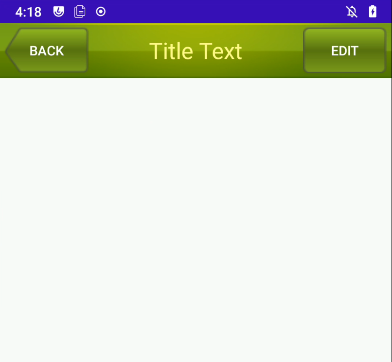
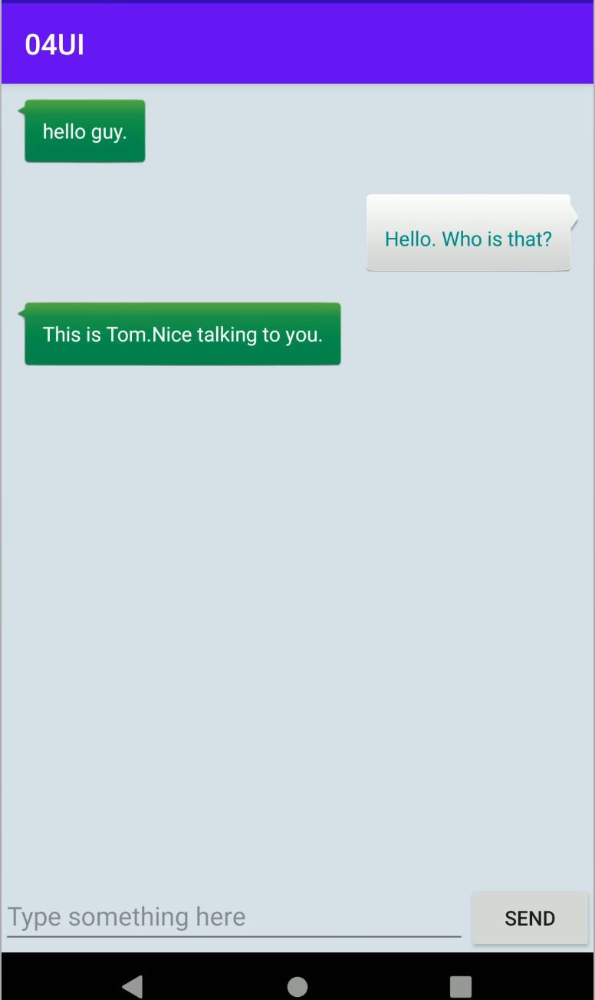

## 常用控件的使用方法

### TextView

`TextView` 是用于展示文本的一个控件，可以用于展示多种格式的文本。

- `android:layout_width` 和 `android:layout_height` 指定了控件的宽度和高度。
- `android:gravity` 来指定文字的对齐方式。
- `android:textColor` 属性可以指定文字的颜色。
- `android:textSize` 属性可以指定文字的大小，文字大小要使用 `sp` 作为单位。

### Button

`Button` 是一个按钮控件，可以用于用户交互。

- `android:textAllCaps` 属性控制按钮的大小写，默认是 `true`。

除了使用函数式 API 的方式来注册监听器，也可以使用实现接口的方式来进行注册，代码如下所示：

```kotlin
class MainActivity : AppCompatActivity(), View.OnClickListener {
    override fun onCreate(savedInstanceState: Bundle?) {
        super.onCreate(savedInstanceState)
        setContentView(R.layout.activity_main)
        btn_main.setOnClickListener(this)
    }
    override fun onClick(v: View?){
        when(v?.id){
            R.id.btn_main ->{
                Toast.makeText(this, "Click", Toast.LENGTH_SHORT).show()
            }
        }
    }
}
```

还可以在 `activity_main.xml` 中设置 `android:onClick` 属性来注册监听器。

### EditText

`EditText` 是用于输入文本的一个控件。

- `android:hint` 属性指定了一段提示性的文本。
- `android:maxLines` 属性最大行数,当输入的内容超过两行时，文本就会向上滚动，`EditText` 则不会再继续拉伸。

### ImageView

`ImageView` 是用于在界面上展示图片的一个控件。

- `android:src` 属性可以指定要展示的图片。

### ProgressBar

`ProgressBar` 用于在界面上显示一个进度条，表示我们的程序正在加载一些数据。

- `style` 属性可以将它指定成水平进度条 `style="?android:attr/progressBarStyleHorizontal"` 。
- `android:max` 属性给进度条设置一个最大值。
- `android:visibility` 可选值有 3 种：`visible`、`invisible` 和 `gone`。

  - `visible` 表示控件是可见的。
  - `invisible` 表示控件不可见，但是它仍然占据着原来的位置和大小。
  - `gone` 则表示控件不可见且不再占用任何屏幕空间。

### AlertDialog

`AlertDialog` 可以在当前界面弹出一个对话框，这个对话框是置顶于所有界面元素之上的，能够屏蔽其他控件的交互能力，因此 AlertDialog 一般用于提示一些非常重要的内容或者警告信息。

例子：

```kotlin
    AlertDialog.Builder(this).apply {
        setTitle("This is Dialog")
        setMessage("Something important")
        setCancelable(false)
        setPositiveButton("OK"){dialog, which -> }
        setNegativeButton("Cancel"){dialog, which -> }
        show()
    }
```

`setPositiveButton()` 方法为对话框设置确定按钮的点击事件，`setNegativeButton()` 方法设置取消按钮的点击事件。

## 详解 3 种基本布局

### LinearLayout

`LinearLayout` 又称作线性布局，是一种非常常用的布局。这个布局会将它所包含的控件在线性方向上依次排列。

- `android:orientation` 属性指定了排列方向，`vertical` 为垂直布局，`horizontal` 为水平布局。
- `android:layout_gravity` 用于指定控件在布局中的对齐方式。
- `android:layout_weight` 属性允许我们使用比例的方式来指定控件的大小。

### RelativeLayout

`RelativeLayout` 又称作相对布局，也是一种非常常用的布局。它可以通过相对定位的方式让控件出现在布局的任何位置。

- `android:layout_above` 属性可以让一个控件位于另一个控件的上方，需要为这个属性指定相对控件 `id` 的引用。
- `android:layout_below` 表示让一个控件位于另一个控件的下方。
- `android:layout_toLeftOf` 表示让一个控件位于另一个控件的左侧。
- `android:layout_toRightOf` 表示让一个控件位于另一个控件的右侧。
- `android:layout_alignLeft` 表示让一个控件的左边缘和另一个控件的左边缘对齐。
- `android:layout_alignRight` 表示让一个控件的右边缘和另一个控件的右边缘对齐。

### FrameLayout

`FrameLayout` 又称作帧布局，它相比于前面两种布局就简单太多了，因此它的应用场景少了很多。这种布局没有丰富的定位方式，所有的控件都会默认摆放在布局的左上角。
`

- `layout_gravity` 属性来指定控件在布局中的对齐方式。

## 自定义控件

### 引入布局

在 `layout` 目录下新建一个 `title.xml` 布局，代码如下所示：

```xml
<?xml version="1.0" encoding="utf-8"?>
<LinearLayout xmlns:android="http://schemas.android.com/apk/res/android"
    android:layout_width="match_parent"
    android:layout_height="wrap_content"
    android:background="@drawable/title_bg">

    <Button
        android:id="@+id/btn_titleBack"
        android:layout_width="wrap_content"
        android:layout_height="wrap_content"
        android:layout_gravity="center"
        android:layout_margin="5dp"
        android:background="@drawable/back_bg"
        android:text="Back"
        android:textColor="#fff"/>

    <TextView
        android:id="@+id/et_titleText"
        android:layout_width="0dp"
        android:layout_height="wrap_content"
        android:layout_gravity="center"
        android:layout_weight="1"
        android:gravity="center"
        android:text="Title Text"
        android:textColor="#FFFF8D"
        android:textSize="24sp" />
    <Button
        android:id="@+id/btn_titleEdit"
        android:layout_width="wrap_content"
        android:layout_height="wrap_content"
        android:layout_gravity="center"
        android:layout_margin="5dp"
        android:background="@drawable/edit_bg"
        android:text="Edit"
        android:textColor="#fff"/>

</LinearLayout>
```

修改 `activity_main.xml` 中的代码，如下所示：

```xml
<?xml version="1.0" encoding="utf-8"?>
<LinearLayout xmlns:android="http://schemas.android.com/apk/res/android"
    android:layout_width="match_parent"
    android:layout_height="match_parent">

    <include layout="@layout/title"/>
</LinearLayout>
```

`MainActivity` 中将系统自带的标题栏隐藏掉，代码如下所示：

```kotlin
class CustomActivity : AppCompatActivity() {
    override fun onCreate(savedInstanceState: Bundle?) {
        super.onCreate(savedInstanceState)
        setContentView(R.layout.activity_custom)
        // 将系统自带的标题栏隐藏掉
        supportActionBar?.hide()
    }
}
```

此时如果 `button` 的背景图片没有显示，就需要修改 `values/themes/themes.xml` 中的代码，将 `parent="Theme.MaterialComponents.DayNight.DarkActionBar"` 修改为 `parent="Theme.MaterialComponents.DayNight.DarkActionBar.Bridge"` 即可。运行程序看到效果如下图：



### 创建自定义控件

新建 `TitleLayout` 继承自 `LinearLayout`，让它成为我们自定义的标题栏控件，代码如下所示：

```kotlin
class TitleLayout(context: Context, attrs:AttributeSet) : LinearLayout(context, attrs) {

    init {
        // 对标题栏布局进行动态加载
        LayoutInflater.from(context).inflate(R.layout.title, this)
        btn_titleBack.setOnClickListener {
            val activity = context as Activity
            activity.finish() // 销毁当前 Activity
        }
        btn_titleEdit.setOnClickListener {
            Toast.makeText(context, "You clicked Edit button", Toast.LENGTH_SHORT).show()
        }
    }
}
```

在布局文件中添加这个自定义控件，修改 `activity_main.xml` 中的代码，如下所示：

```xml
<?xml version="1.0" encoding="utf-8"?>
<LinearLayout xmlns:android="http://schemas.android.com/apk/res/android"
    android:layout_width="match_parent"
    android:layout_height="match_parent">

    <com.ckcat.ui.TitleLayout
        android:layout_width="match_parent"
        android:layout_height="wrap_content"/>

</LinearLayout>
```

运行效果跟之前一样，但是这样就可以响应自定义控件的点击事件了。

## ListView

### ListView 的简单用法

在布局中加入 `ListView`，如下所示：

```xml
<?xml version="1.0" encoding="utf-8"?>
<LinearLayout xmlns:android="http://schemas.android.com/apk/res/android"

    android:layout_width="match_parent"
    android:layout_height="match_parent">

    <ListView
        android:id="@+id/lv_simple"
        android:layout_width="match_parent"
        android:layout_height="match_parent"/>
</LinearLayout>
```

接下来修改 `MainActivity` 中的代码，如下所示：

```kotlin
class ListViewActivity : AppCompatActivity() {
    private val data = listOf("Apple", "Banana", "Orange", "Watermelon",
        "Pear", "Grape", "Pineapple", "Strawberry", "Cherry", "Mango",
        "Apple", "Banana", "Orange", "Watermelon", "Pear", "Grape",
        "Pineapple", "Strawberry", "Cherry", "Mango")

    override fun onCreate(savedInstanceState: Bundle?) {
        super.onCreate(savedInstanceState)
        setContentView(R.layout.activity_list_view)
        val adapter = ArrayAdapter<String>(this, android.R.layout.simple_list_item_1, data)
        lv_simple.adapter = adapter
    }
}
```

这就是 `ListView` 的简单用法。

### 定制 ListView 的界面

新建 `Fruit` 类，代码如下所示：

```kotlin
class Fruit(val name:String, val imageId:Int)
```

为 `ListView` 的子项指定一个我们自定义的布局，在 `layout` 目录下新建 `fruit_item.xml`，代码如下所示：

```xml
<?xml version="1.0" encoding="utf-8"?>
<LinearLayout xmlns:android="http://schemas.android.com/apk/res/android"
    android:layout_width="match_parent"
    android:layout_height="60dp">

    <ImageView
        android:id="@+id/iv_fruitImage"
        android:layout_width="40dp"
        android:layout_height="40dp"
        android:layout_gravity="center_vertical"
        android:layout_margin="10dp"/>

    <TextView
        android:id="@+id/tv_fruitName"
        android:layout_width="wrap_content"
        android:layout_height="wrap_content"
        android:layout_gravity="center_vertical"
        android:layout_margin="10dp"/>
</LinearLayout>
```

接下来需要创建一个自定义的适配器，这个适配器继承自 `ArrayAdapter`，并将泛型指定为 `Fruit` 类。新建类 `FruitAdapter`，代码如下所示：

```kotlin
class FruitAdapter(activity: Activity, val resourceId:Int, data:List<Fruit>) :
    ArrayAdapter<Fruit>(activity, resourceId, data){

    override fun getView(position: Int, convertView: View?, parent: ViewGroup): View {
        val view = LayoutInflater.from(context).inflate(resourceId, parent, false)
        val fruitImage:ImageView = view.findViewById(R.id.iv_fruitImage)
        val fruitName:TextView = view.findViewById(R.id.tv_fruitName)
        // 获取当前项的 Fruit 实例
        val fruit = getItem(position)
        if (fruit != null){
            fruitImage.setImageResource(fruit.imageId)
            fruitName.text = fruit.name
        }
        return view
    }
}
```

最后修改 `MainActivity` 中的代码，如下所示：

```kotlin
    private val fruitList = ArrayList<Fruit>()
    private fun initFruits() {
        repeat(2) {
            fruitList.add(Fruit("Apple", R.drawable.apple_pic))
            fruitList.add(Fruit("Banana", R.drawable.banana_pic))
            fruitList.add(Fruit("Orange", R.drawable.orange_pic))
            fruitList.add(Fruit("Watermelon", R.drawable.watermelon_pic))
            fruitList.add(Fruit("Pear", R.drawable.pear_pic))
            fruitList.add(Fruit("Grape", R.drawable.grape_pic))
            fruitList.add(Fruit("Pineapple", R.drawable.pineapple_pic))
            fruitList.add(Fruit("Strawberry", R.drawable.strawberry_pic))
            fruitList.add(Fruit("Cherry", R.drawable.cherry_pic))
            fruitList.add(Fruit("Mango", R.drawable.mango_pic))
        }
    }
    override fun onCreate(savedInstanceState: Bundle?) {
        super.onCreate(savedInstanceState)
        setContentView(R.layout.activity_custom_list_view)

        initFruits()
        val adapter = FruitAdapter(this, R.layout.fruit_item, fruitList)
        lv_custom.adapter = adapter
    }
```

这样定制 ListView 界面的任务就完成了。

### 提升 ListView 的运行效率

目前我们 `ListView` 的运行效率是很低的，因为在 `FruitAdapter` 的 `getView()` 方法中，每次都将布局重新加载了一遍，当 `ListView` 快速滚动的时候，这就会成为性能的瓶颈。

我们可以借助一个 `ViewHolder` 来对这部分性能进行优化，修改 `FruitAdapter` 中的代码，如下所示：

```kotlin
class FruitAdapter(activity: Activity, val resourceId:Int, data:List<Fruit>) :
    ArrayAdapter<Fruit>(activity, resourceId, data){

    inner class ViewHolder(val fruitImage:ImageView, val fruitName:TextView)

    override fun getView(position: Int, convertView: View?, parent: ViewGroup): View {
        val view:View
        val viewHolder:ViewHolder
        if (convertView == null){// 如果缓存中没有对应的 View,就需要加载一个新的 View
            view = LayoutInflater.from(context).inflate(resourceId, parent, false)
            val fruitImage:ImageView = view.findViewById(R.id.iv_fruitImage)
            val fruitName:TextView = view.findViewById(R.id.tv_fruitName)
            // 将ViewHolder对象存储在 View 中
            viewHolder = ViewHolder(fruitImage, fruitName)
            view.tag = viewHolder
        }else{ // 如果缓存中有对应的 View,就不需要重新加载了
            view = convertView
            // 从 View 中获取 ViewHolder
            viewHolder = view.tag as ViewHolder
        }
        // 获取当前项的 Fruit 实例
        val fruit = getItem(position)
        if (fruit != null){
            // 将数据设置到 View 中
            viewHolder.fruitImage.setImageResource(fruit.imageId)
            viewHolder.fruitName.text = fruit.name
        }
        return view
    }
}
```

这样所有控件的实例都缓存在了 `ViewHolder` 里，就没有必要每次都通过 `findViewById()` 方法来获取控件实例了。

### ListView 的点击事件

修改 `MainActivity` 中的代码，如下所示：

```kotlin
    override fun onCreate(savedInstanceState: Bundle?) {
        super.onCreate(savedInstanceState)
        setContentView(R.layout.activity_custom_list_view)

        initFruits()
        val adapter = FruitAdapter(this, R.layout.fruit_item, fruitList)
        lv_custom.adapter = adapter
        lv_custom.setOnItemClickListener{ parent, view, position, id ->
            val fruit = fruitList[position]
            Toast.makeText(this, fruit.name, Toast.LENGTH_SHORT).show()
        }
    }
```

可以通过 `position` 来获取当前点击的项，然后执行相应的操作。

## RecyclerView

### RecyclerView 的基本用法

首先将 `RecyclerView` 库引入我们的项目当中，打开 `app/build.gradle` 文件，在 dependencies 闭包中添加如下内容：

```kotlin
dependencies {
    ...
    implementation 'androidx.recyclerview:recyclerview:1.2.1'
    ...
}
```

接下来修改 `activity_main.xml` 中的代码，如下所示：

```xml
<?xml version="1.0" encoding="utf-8"?>
<LinearLayout xmlns:android="http://schemas.android.com/apk/res/android"

    android:layout_width="match_parent"
    android:layout_height="match_parent">

    <androidx.recyclerview.widget.RecyclerView
        android:id="@+id/rv_simple"
        android:layout_width="match_parent"
        android:layout_height="match_parent"/>
</LinearLayout>
```

需要注意的是，由于 `RecyclerView` 并不是内置在系统 SDK 当中的，所以需要把完整的包路径写出来。

接下来需要为 `RecyclerView` 准备一个适配器，新建 `RecyclerViewFruitAdapter` 类，让这个适配器继承自 `RecyclerView.Adapter`，并将泛型指定为 `RecyclerViewFruitAdapter.ViewHolder`。其中，`ViewHolder` 是我们在 `RecyclerViewFruitAdapter` 中定义的一个内部类，代码如下所示：

```kotlin
class RecyclerViewFruitAdapter(val fruitList: List<Fruit>) :
    RecyclerView.Adapter<RecyclerViewFruitAdapter.ViewHolder>(){

    inner class ViewHolder(view:View):RecyclerView.ViewHolder(view){
        val fruitImage:ImageView = view.findViewById(R.id.iv_fruitImage)
        val fruitName:TextView = view.findViewById(R.id.tv_fruitName)
    }
    // 用于创建ViewHolder实例的
    override fun onCreateViewHolder(parent: ViewGroup, viewType: Int): ViewHolder {
        val view = LayoutInflater.from(parent.context).inflate(R.layout.fruit_item, parent, false)
        return ViewHolder(view)
    }
    // 对子项的数据进行赋值
    override fun onBindViewHolder(holder: ViewHolder, position: Int) {
        val fruit = fruitList[position]
        holder.fruitImage.setImageResource(fruit.imageId)
        holder.fruitName.text = fruit.name
    }
    // 一共有多少子项
    override fun getItemCount() = fruitList.size
}
```

适配器准备好了之后，我们就可以开始使用 `RecyclerView` 了，修改 `MainActivity` 中的代码，如下所示：

```kotlin
    private val fruitList = ArrayList<Fruit>()
    private fun initFruits() {
        repeat(2) {
            fruitList.add(Fruit("Apple", R.drawable.apple_pic))
            fruitList.add(Fruit("Banana", R.drawable.banana_pic))
            fruitList.add(Fruit("Orange", R.drawable.orange_pic))
            fruitList.add(Fruit("Watermelon", R.drawable.watermelon_pic))
            fruitList.add(Fruit("Pear", R.drawable.pear_pic))
            fruitList.add(Fruit("Grape", R.drawable.grape_pic))
            fruitList.add(Fruit("Pineapple", R.drawable.pineapple_pic))
            fruitList.add(Fruit("Strawberry", R.drawable.strawberry_pic))
            fruitList.add(Fruit("Cherry", R.drawable.cherry_pic))
            fruitList.add(Fruit("Mango", R.drawable.mango_pic))
        }
    }
    override fun onCreate(savedInstanceState: Bundle?) {
        super.onCreate(savedInstanceState)
        setContentView(R.layout.activity_recycler_view)
        initFruits()
        // LinearLayoutManager 是线性布局的意思
        val layoutManager = LinearLayoutManager(this)
        // LayoutManager 用于指定 RecyclerView 的布局方式
        rv_simple.layoutManager = layoutManager
        val adapter = RecyclerViewFruitAdapter(fruitList)
        // 完成适配器设置
        rv_simple.adapter = adapter
    }
```

这样使用就实现了和 `ListView` 几乎一模一样的效果，虽说在代码量方面并没有明显的减少，但是逻辑变得更加清晰了。

### 实现横向滚动和瀑布流布局

修改 `fruit_item.xml` 中的代码，如下所示：

```xml
<?xml version="1.0" encoding="utf-8"?>
<LinearLayout xmlns:android="http://schemas.android.com/apk/res/android"
    android:orientation="vertical"
    android:layout_width="80dp"
    android:layout_height="wrap_content">

    <ImageView
        android:id="@+id/iv_vertical_fruitImage"
        android:layout_width="40dp"
        android:layout_height="40dp"
        android:layout_gravity="center_horizontal"
        android:layout_marginTop="10dp"/>

    <TextView
        android:id="@+id/tv_vertical_fruitName"
        android:layout_width="wrap_content"
        android:layout_height="wrap_content"
        android:layout_gravity="center_horizontal"
        android:layout_marginTop="10dp"/>
</LinearLayout>
```

接下来修改 `MainActivity` 中的代码，如下所示：

```kotlin
    override fun onCreate(savedInstanceState: Bundle?) {
        super.onCreate(savedInstanceState)
        setContentView(R.layout.activity_vertical_fruit)
        initFruits()
        val layoutManager = LinearLayoutManager(this)
        // setOrientation()方法设置布局的排列方向，默认是垂直方向
        layoutManager.orientation = LinearLayoutManager.HORIZONTAL
        rv_vertical.layoutManager = layoutManager
        val adapter = VerticalFruitAdapter(fruitList)
        rv_vertical.adapter = adapter
    }
```

这样 `RecyclerView` 就可以横向滚动了。

除了 `LinearLayoutManager` 之外，`RecyclerView` 还给我们提供了 `GridLayoutManager` 和 `StaggeredGridLayoutManager` 这两种内置的布局排列方式。
`GridLayoutManager` 可以用于实现网格布局，`StaggeredGridLayoutManager` 可以用于实现瀑布流布局，下面来实现一下效果更加炫酷的瀑布流布局。

首先还是来修改一下 `fruit_item.xml` 中的代码，如下所示：

```xml
<?xml version="1.0" encoding="utf-8"?>
<LinearLayout xmlns:android="http://schemas.android.com/apk/res/android"
    android:orientation="vertical"
    android:layout_width="match_parent"
    android:layout_height="wrap_content"
    android:layout_margin="5dp">

    <ImageView
        android:id="@+id/iv_vertical_fruitImage"
        android:layout_width="40dp"
        android:layout_height="40dp"
        android:layout_gravity="center_horizontal"
        android:layout_marginTop="10dp"/>

    <TextView
        android:id="@+id/tv_vertical_fruitName"
        android:layout_width="wrap_content"
        android:layout_height="wrap_content"
        android:layout_gravity="center_horizontal"
        android:layout_marginTop="10dp"/>
</LinearLayout>
```

接着修改 `MainActivity` 中的代码，如下所示：

```kotlin
    override fun onCreate(savedInstanceState: Bundle?) {
        super.onCreate(savedInstanceState)
        setContentView(R.layout.activity_vertical_fruit)
        initFruits()
        val layoutManager = StaggeredGridLayoutManager(3, StaggeredGridLayoutManager.VERTICAL)
        rv_vertical.layoutManager = layoutManager
        val adapter = VerticalFruitAdapter(fruitList)
        rv_vertical.adapter = adapter
    }
```

`StaggeredGridLayoutManager` 的构造函数接收两个参数：第一个参数用于指定布局的列数；第二个参数用于指定布局的排列方向。

### RecyclerView 的点击事件

`RecyclerView` 需要我们自己给子项具体的 `View` 去注册点击事件。在 `RecyclerView` 中注册点击事件，修改 `FruitAdapter` 中的代码，如下所示：

```kotlin
    override fun onCreateViewHolder(parent: ViewGroup, viewType: Int): ViewHolder {
        val view = LayoutInflater.from(parent.context).inflate(R.layout.fruit_item_vertical, parent, false)
        val viewHolder = ViewHolder(view)
        // itemView 表示的就是最外层布局，这里为最外层布局注册了点击事件
        viewHolder.itemView.setOnClickListener{
            val position = viewHolder.adapterPosition
            val fruit = fruitList[position]
            Toast.makeText(parent.context, "you clicked view ${fruit.name}", Toast.LENGTH_SHORT).show()
        }
        // ImageView 表示的就是子项的图片，这里为子项注册了点击事件
        viewHolder.fruitImage.setOnClickListener{
            val position = viewHolder.adapterPosition
            val fruit = fruitList[position]
            Toast.makeText(parent.context, "you clicked view ${fruit.name}", Toast.LENGTH_SHORT).show()
        }
        return viewHolder
    }
```

由于 `TextView` 并没有注册点击事件，因此点击文字这个事件会被子项的最外层布局捕获。

## 编写界面的最佳实践

### 制作 9-Patch 图片

`9-Patch` 图片是一种被特殊处理过的 `png` 图片，能够指定哪些区域可以被拉伸、哪些区域不可以。

首先对着 `message_left.png` 图片右击选中 `Create 9-Patch file` 创建一张以 `9.png` 为后缀的同名图片。我们可以在图片的 4 个边框绘制一个个的小黑点，在上边框和左边框绘制的部分表示当图片需要拉伸时就拉伸黑点标记的区域，在下边框和右边框绘制的部分表示内容允许被放置的区域。

最后制作完成后要将原来的 `message_left.png` 图片删除，只保留制作好的 `message_left.9.png` 图片即可。否则会出现两个同名的 `png` 图片，导致程序报错。

### 编写精美的聊天界面

首先开始编写主界面，修改 `activity_main.xml` 中的代码，如下所示：

```xml
<?xml version="1.0" encoding="utf-8"?>
<LinearLayout xmlns:android="http://schemas.android.com/apk/res/android"
    android:orientation="vertical"
    android:layout_width="match_parent"
    android:layout_height="match_parent"
    android:background="#d8e0e8">

    <androidx.recyclerview.widget.RecyclerView
        android:id="@+id/rv_chat"
        android:layout_width="match_parent"
        android:layout_height="0dp"
        android:layout_weight="1"/>

    <LinearLayout
        android:layout_width="match_parent"
        android:layout_height="wrap_content">

        <EditText
            android:id="@+id/tv_input"
            android:layout_width="0dp"
            android:layout_height="wrap_content"
            android:layout_weight="1"
            android:hint="Type something here"
            android:maxLines="2"/>
        <Button
            android:id="@+id/btn_send"
            android:layout_width="wrap_content"
            android:layout_height="wrap_content"
            android:text="Send"/>
    </LinearLayout>
</LinearLayout>
```

接下来开始编写 `RecyclerView` 的子项布局，新建 `msg_left_item.xml`，代码如下所示：

```xml
<?xml version="1.0" encoding="utf-8"?>
<FrameLayout xmlns:android="http://schemas.android.com/apk/res/android"
    android:layout_width="match_parent"
    android:layout_height="wrap_content"
    android:padding="10dp">

    <LinearLayout
        android:layout_width="wrap_content"
        android:layout_height="wrap_content"
        android:layout_gravity="left"
        android:background="@drawable/message_left">

        <TextView
            android:id="@+id/tv_leftMsg"
            android:layout_width="wrap_content"
            android:layout_height="wrap_content"
            android:layout_gravity="center"
            android:layout_margin="10dp"
            android:textColor="#fff"/>
    </LinearLayout>
</FrameLayout>
```

类似地，我们还需要再编写一个发送消息的子项布局，新建 `msg_right_item.xml`，代码如下所
示：

```xml
<?xml version="1.0" encoding="utf-8"?>
<FrameLayout xmlns:android="http://schemas.android.com/apk/res/android"
    android:layout_width="match_parent"
    android:layout_height="wrap_content"
    android:padding="10dp">

    <LinearLayout
        android:layout_width="wrap_content"
        android:layout_height="wrap_content"
        android:layout_gravity="right"
        android:background="@drawable/message_right">

        <TextView
            android:id="@+id/tv_rightMsg"
            android:layout_width="wrap_content"
            android:layout_height="wrap_content"
            android:layout_gravity="center"
            android:layout_margin="10dp"
            android:textColor="#009688"/>
    </LinearLayout>
</FrameLayout>
```

然后定义消息的实体类，新建 `Msg`，代码如下所示：

```kotlin
class Msg(val content:String, val type: Int) {
    companion object{
        const val TYPE_RECEIVED = 0
        const val TYPE_SENT = 1
    }
}
```

接下来需要创建 `RecyclerView` 的适配器类，新建类 `MsgAdapter`，代码如下所示：

```kotlin
class MsgAdapter(val msgList:List<Msg>) : RecyclerView.Adapter<RecyclerView.ViewHolder>() {

    inner class LeftViewHolder(view:View):RecyclerView.ViewHolder(view){
        val leftMsg:TextView = view.findViewById(R.id.tv_leftMsg)
    }
    inner class RightViewHolder(view: View):RecyclerView.ViewHolder(view){
        val rightMsg:TextView = view.findViewById(R.id.tv_rightMsg)
    }
    // 返回当前 position 对应的消息类型。
    override fun getItemViewType(position: Int): Int {
        val msg = msgList[position]
        return msg.type
    }
    // 根据不同的 viewType 来加载不同的布局并创建不同的 ViewHolder。
    override fun onCreateViewHolder(parent: ViewGroup, viewType: Int) = if(viewType == Msg.TYPE_RECEIVED){
        val view = LayoutInflater.from(parent.context).inflate(R.layout.msg_left_item, parent, false)
        LeftViewHolder(view)
    }else{
        val view = LayoutInflater.from(parent.context).inflate(R.layout.msg_right_item, parent, false)
        RightViewHolder(view)
    }

    override fun onBindViewHolder(holder: RecyclerView.ViewHolder, position: Int) {
        val msg = msgList[position]
        when(holder){
            is LeftViewHolder -> holder.leftMsg.text = msg.content
            is RightViewHolder -> holder.rightMsg.text = msg.content
            else -> throw IllegalArgumentException()
        }
    }

    override fun getItemCount() = msgList.size
}
```

最后修改 `MainActivity` 中的代码，为 `RecyclerView` 初始化一些数据，并给发送按钮加入事件响应，代码如下所示：

```kotlin
    private val msgList = ArrayList<Msg>()
    private var adapter:MsgAdapter? = null

    override fun onCreate(savedInstanceState: Bundle?) {
        super.onCreate(savedInstanceState)
        setContentView(R.layout.activity_chat)
        initMsg()
        val layoutManager = LinearLayoutManager(this)
        rv_chat.layoutManager = layoutManager
        adapter = MsgAdapter(msgList)
        rv_chat.adapter = adapter
        btn_send.setOnClickListener {
            val context = tv_input.text.toString()
            if (context.isNotEmpty()){
                val msg = Msg(context, Msg.TYPE_SENT)
                msgList.add(msg)
                // 当有消息时，刷新 RecyclerView 中的显示
                adapter?.notifyItemInserted(msgList.size - 1)
                // 将 RecyclerView 定位到最后一行
                rv_chat.scrollToPosition(msgList.size-1)
                // 清空输入框中的内容
                tv_input.setText("")
            }
        }
    }

    private fun initMsg(){
        val msg1 = Msg("hello guy.", Msg.TYPE_RECEIVED)
        msgList.add(msg1)
        val msg2 = Msg("Hello. Who is that?", Msg.TYPE_SENT)
        msgList.add(msg2)
        val msg3 = Msg("This is Tom.Nice talking to you.", Msg.TYPE_RECEIVED)
        msgList.add(msg3)
    }
```

`notifyItemInserted()` 方法，用于通知列表有新的数据插入。`scrollToPosition()` 方法将显示的数据定位到最后一行。最后运行效果如下所示：




更多控件信息可以参考 https://developer.android.com/reference/android/widget .
