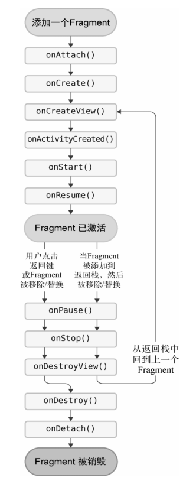

## Fragment 是什么

`Fragment` 是一种可以嵌入在 `Activity` 当中的 UI 片段，它能让程序更加合理和充分地利用大屏幕的空间，因而在平板上应用得非常广泛。

## Fragment 的使用方式

### Fragment 的简单用法

新建一个左侧 `Fragment` 的布局 `left_fragment.xml`，代码如下所示：

```xml
<?xml version="1.0" encoding="utf-8"?>
<LinearLayout xmlns:android="http://schemas.android.com/apk/res/android"
    android:orientation="vertical"
    android:layout_width="match_parent"
    android:layout_height="match_parent">

    <Button
        android:id="@+id/btn_change"
        android:layout_width="wrap_content"
        android:layout_height="wrap_content"
        android:layout_gravity="center_horizontal"
        android:text="Button"/>
</LinearLayout>
```

然后新建右侧 `Fragment` 的布局 `right_fragment.xml`，代码如下所示：

```xml
<?xml version="1.0" encoding="utf-8"?>
<LinearLayout xmlns:android="http://schemas.android.com/apk/res/android"
    android:orientation="vertical"
    android:background="#00ff00"
    android:layout_width="match_parent"
    android:layout_height="match_parent">

    <TextView
        android:layout_width="wrap_content"
        android:layout_height="wrap_content"
        android:layout_gravity="center_horizontal"
        android:textSize="24sp"
        android:text="This is right fragment"/>
</LinearLayout>
```

接着新建一个 `LeftFragment` 类，并让它继承自 `AndroidX` 库中的 `androidx.fragment.app.Fragment` 类，代码如下所示：

```kotlin
class LeftFragment:Fragment() {

    override fun onCreateView(
        inflater: LayoutInflater,
        container: ViewGroup?,
        savedInstanceState: Bundle?
    ): View? {
        return inflater.inflate(R.layout.left_fragment, container, false)
    }
}
```

接着我们用同样的方法再新建一个 `RightFragment`，代码如下所示：

```kotlin
class RightFragment:Fragment() {

    override fun onCreateView(
        inflater: LayoutInflater,
        container: ViewGroup?,
        savedInstanceState: Bundle?
    ): View? {
        return inflater.inflate(R.layout.right_fragment, container, false)
    }
}
```

接下来修改 `activity_main.xml` 中的代码，如下所示：

```xml
<?xml version="1.0" encoding="utf-8"?>
<LinearLayout xmlns:android="http://schemas.android.com/apk/res/android"
    android:orientation="horizontal"
    android:layout_width="match_parent"
    android:layout_height="match_parent">

    <fragment
        android:id="@+id/leftFrag"
        android:name="com.ckcat.fragment.LeftFragment"
        android:layout_width="0dp"
        android:layout_height="match_parent"
        android:layout_weight="1"/>

    <fragment
        android:id="@+id/rightFrag"
        android:name="com.ckcat.fragment.RightFragment"
        android:layout_width="0dp"
        android:layout_height="match_parent"
        android:layout_weight="1"/>

</LinearLayout>
```

`<fragment>` 标签中 `android:name` 属性来显式声明要添加的 `Fragment` 类名，其中 `android:id` 也必须指定，否则运行过程中会出现异常。

这样最简单的 `Fragment` 示例就已经写好了，`Fragment` 平分了左右两个区域。

### 动态添加 Fragment

新建 `another_right_fragment.xml`，代码如下所示：

```xml
<?xml version="1.0" encoding="utf-8"?>
<LinearLayout xmlns:android="http://schemas.android.com/apk/res/android"
    android:orientation="vertical"
    android:background="#ffff00"
    android:layout_width="match_parent"
    android:layout_height="match_parent">

    <TextView
        android:layout_width="wrap_content"
        android:layout_height="wrap_content"
        android:layout_gravity="center_horizontal"
        android:textSize="24sp"
        android:text="This is another right fragment"/>
</LinearLayout>
```

这个布局文件的代码和 `right_fragment.xml` 中的代码基本相同，只是将背景色改成了黄色，并将显示的文字改了改。然后新建 `AnotherRightFragment` 作为另一个右侧 `Fragment`，代码如下所示：

```kotlin
class AnotherRightFragment:Fragment() {

    override fun onCreateView(
        inflater: LayoutInflater,
        container: ViewGroup?,
        savedInstanceState: Bundle?
    ): View? {
        return inflater.inflate(R.layout.another_right_fragment, container, false)
    }
}
```

接下来修改 `activity_main.xml`，将右侧 `Fragment` 替换成了一个 `FrameLayout`，代码如下所示：

```xml
<?xml version="1.0" encoding="utf-8"?>
<LinearLayout xmlns:android="http://schemas.android.com/apk/res/android"
    android:orientation="horizontal"
    android:layout_width="match_parent"
    android:layout_height="match_parent">

    <fragment
        android:id="@+id/leftFrag"
        android:name="com.ckcat.fragment.LeftFragment"
        android:layout_width="0dp"
        android:layout_height="match_parent"
        android:layout_weight="1"/>

    <FrameLayout
        android:id="@+id/rightLayout"
        android:layout_width="0dp"
        android:layout_height="match_parent"
        android:layout_weight="1"/>

</LinearLayout>
```

最后修改 `MainActivity` 中的代码，使用 `FragmentLayoutManager` 实现动态添加 `Fragment` 的功能。如下所示：

```kotlin
    private val TAG = "MainActivity"
    override fun onCreate(savedInstanceState: Bundle?) {
        super.onCreate(savedInstanceState)
        setContentView(R.layout.activity_main)
        btn_change.setOnClickListener {
            replaceFragment(AnotherRightFragment())
        }
        replaceFragment(RightFragment())
    }

    //
    private fun replaceFragment(fragment: Fragment){
        // 获取 FragmentManager
        val fragmentManager = supportFragmentManager
        // 通过调用 beginTransaction() 方法开启一个事务
        val transaction = fragmentManager.beginTransaction()
        // 向容器内添加或替换 Fragment，一般使用 replace() 方法实现
        transaction.replace(R.id.rightLayout, fragment)
        // 在 Fragment 中实现返回栈，它可以接收一个名字用于描述返回栈的状态，一般传入null即可。
        transaction.addToBackStack(null)
        // 调用 commit() 方法来完成提交事务
        transaction.commit()
    }
```

在事务提交之前调用了 `FragmentTransaction` 的 `addToBackStack()` 方法，可以用于将一个事务添加到返回栈中，按下 `Back` 键可以回到上一个 `Fragment` 而不是直接退出程序。

为了方便 `Fragment` 和 `Activity` 之间进行交互，`FragmentManager` 提供了一个类似于 `findViewById()` 的方法，专门用于从布局文件中获取 `Fragment` 的实例，代码如下所示：

```kotlin
    // 在 Activity 中调用 Fragment 里的方法
    // val fragment = supportFragmentManager.findFragmentById(R.id.leftFrag) as LeftFragment
    val fragment = leftFrag as LeftFragment
    Log.d(TAG, "onCreate: $fragment.id")
```

另外，在每个 `Fragment` 中都可以通过调用 `getActivity()` 方法来得到和当前 `Fragment` 相关联的 `Activity` 实例，代码如下所示：

```kotlin
    // 通过调用 getActivity() 方法来得到和当前 Fragment 相关联的 Activity 实例
    if (activity != null){
        Log.d(TAG, "onCreateView: ${activity!!.toString()}")
    }
```

## Fragment 的生命周期

### Fragment 的状态和回调

每个 `Fragment` 在其生命周期一共有运行状态、暂停状态、停止状态和销毁状态这 4 种状态。

#### 01. 运行状态

当一个 `Fragment` 所关联的 `Activity` 正处于运行状态时，该 `Fragment` 也处于运行状态。

#### 02. 暂停状态

当一个 `Activity` 进入暂停状态时（由于另一个未占满屏幕的 `Activity` 被添加到了栈顶），与它相关联的 `Fragment` 就会进入暂停状态。

#### 03. 停止状态

当一个 `Activity` 进入停止状态时，与它相关联的 `Fragment` 就会进入停止状态，或者通过调用 `FragmentTransaction` 的 `remove()`、`replace()`方法将 `Fragment` 从 `Activity` 中移除，但在事务提交之前调用了 `addToBackStack()` 方法，这时的 `Fragment` 也会进入停止状态。总的来说，进入停止状态的 `Fragment` 对用户来说是完全不可见的，有可能会被系统回收。

#### 04. 销毁状态

`Fragment` 总是依附于 `Activity` 而存在，因此当 `Activity` 被销毁时，与它相关联的 `Fragment` 就会进入销毁状态。或者通过调用 `FragmentTransaction` 的 `remove()`、`replace()` 方法将 `Fragment` 从 `Activity` 中移除，但在事务提交之前并没有调用 `addToBackStack()` 方法，这时的 `Fragment` 也会进入销毁状态。

`Activity` 中有的回调方法，`Fragment` 中基本上也有，不过 `Fragment` 还提供了一些附加的回调方法，下面我们就重点看一下这几个回调。

- `onAttach()` : 当 `Fragment` 和 `Activity` 建立关联时调用。
- `onCreateView()` : 为 `Fragment` 创建视图（加载布局）时调用。
- `onActivityCreated()` : 确保与 `Fragment` 相关联的 `Activity` 已经创建完毕时调用。
- `onDestroyView()` : 当与 `Fragment` 关联的视图被移除时调用。
- `onDetach()` : 当 `Fragment` 和 `Activity` 解除关联时调用。

```kotlin
class RightFragment : Fragment() {
    companion object {
        const val TAG = "RightFragment"
    }
    override fun onAttach(context: Context) {
        super.onAttach(context)
        Log.d(TAG, "onAttach: 当 Fragment 和 Activity 建立关联时调用.")
    }
    override fun onCreate(savedInstanceState: Bundle?) {
        super.onCreate(savedInstanceState)
        Log.d(TAG, "onCreate: 当 Fragment 被创建时调用.")
    }
    override fun onCreateView(
        inflater: LayoutInflater, container: ViewGroup?, savedInstanceState: Bundle?
    ): View? {
        Log.d(TAG, "onCreateView: 为 Fragment 创建视图（加载布局）时调用.")
        return inflater.inflate(R.layout.right_fragment, container, false)
    }
    override fun onViewCreated(view: View, savedInstanceState: Bundle?) {
        super.onViewCreated(view, savedInstanceState)
        Log.d(TAG, "onViewCreated: 确保与 Fragment 相关联的 Activity 已经创建完毕时调用.")
    }
    override fun onActivityCreated(savedInstanceState: Bundle?) {
        super.onActivityCreated(savedInstanceState)
        Log.d(TAG, "onActivityCreated: Fragment 与 Activity 相关的视图已经创建时调用.")
    }
    override fun onStart() {
        super.onStart()
        Log.d(TAG, "onStart: 当 Fragment 由不可见变为可见.")
    }
    override fun onResume() {
        super.onResume()
        Log.d(TAG, "onResume: 当 Fragment 对用户可见并处于活动状态时调用.")
    }
    override fun onPause() {
        super.onPause()
        Log.d(TAG, "onPause: 系统正准备去启动或恢复另一个 Fragment.")
    }
    override fun onStop() {
        super.onStop()
        Log.d(TAG, "onStop: 当 Fragment 对用户不可见时调用.")
    }
    override fun onDestroyView() {
        super.onDestroyView()
        Log.d(TAG, "onDestroyView: 当与 Fragment 关联的视图被移除时调用.")
    }
    override fun onDestroy() {
        super.onDestroy()
        Log.d(TAG, "onDestroy: 当与 Activity 关联的 Fragment 被销毁时调用.")
    }
    override fun onDetach() {
        super.onDetach()
        Log.d(TAG, "onDetach: 当 Fragment 和 Activity 解除关联时调用.")
    }
}
```



## 动态加载布局的技巧

### 使用限定符

新建一个 `QualifierActivity`，修改 `layout` 目录下 `activity_qualifier.xml`，代码如下所示：

```xml
<?xml version="1.0" encoding="utf-8"?>
<LinearLayout xmlns:android="http://schemas.android.com/apk/res/android"
    android:orientation="horizontal"
    android:layout_width="match_parent"
    android:layout_height="match_parent">

    <fragment
        android:id="@+id/leftFrag"
        android:name="com.ckcat.fragment.fragment.LeftFragment"
        android:layout_width="match_parent"
        android:layout_height="match_parent"/>

</LinearLayout>
```

接着在 `res` 目录下新建 `layout-large` 文件夹，在这个文件夹下新建一个布局，也叫作 `activity_qualifier.xml`，代码如下所示：

```xml
<?xml version="1.0" encoding="utf-8"?>
<LinearLayout xmlns:android="http://schemas.android.com/apk/res/android"
    android:orientation="horizontal"
    android:layout_width="match_parent"
    android:layout_height="match_parent">

    <fragment
        android:id="@+id/leftFrag"
        android:name="com.ckcat.fragment.fragment.LeftFragment"
        android:layout_width="0dp"
        android:layout_height="match_parent"
        android:layout_weight="1"/>

    <fragment
        android:id="@+id/rightFrag"
        android:name="com.ckcat.fragment.fragment.RightFragment"
        android:layout_width="0dp"
        android:layout_height="match_parent"
        android:layout_weight="3"/>
</LinearLayout>
```

可以看到，`layout/activity_qualifier` 布局只包含了一个 `Fragment`，即单页模式，而 `layout-large/activity_qualifier` 布局包含了两个 `Fragment`，即双页模式。其中，`large` 就是一个限定符，那些屏幕被认为是 `large` 的设备就会自动加载 `layout-large` 文件夹下的布局，小屏幕的设备则还是会加载 `layout` 文件夹下的布局。

Android 中一些常见的限定符可以如表所示：

| 屏幕特征 | 限定符 | 描述                                            |
| -------- | ------ | ----------------------------------------------- |
| 大小     | small  | 提供给小屏幕设备的资源                          |
|          | normal | 提供给中等屏幕设备的资源                        |
|          | large  | 提供给大屏幕设备的资源                          |
|          | xlarge | 提供给超大屏幕设备的资源                        |
| 分辨率   | ldpi   | 提供给低分辨率设备的资源（120 dpi 以下）        |
|          | mdpi   | 提供给中等分辨率设备的资源（120 dpi~160 dpi）   |
|          | hdpi   | 提供给高分辨率设备的资源（160 dpi~240 dpi）     |
|          | xhdpi  | 提供给超高分辨率设备的资源（240 dpi~320 dpi）   |
|          | xxhdpi | 提供给超超高分辨率设备的资源（320 dpi~480 dpi） |
| 方向     | land   | 提供给横屏设备的资源                            |
|          | port   | 提供给竖屏设备的资源                            |

### 使用最小宽度限定符

有时候我们希望可以更加灵活地为不同设备加载布局，不管它们是不是被系统认定为 `large`，这时就可以使用最小宽度限定符（smallest-width qualifier）。

最小宽度限定符允许我们对屏幕的宽度指定一个最小值（以 `dp` 为单位），然后以这个最小值为临界点，屏幕宽度大于这个值的设备就加载一个布局，屏幕宽度小于这个值的设备就加载另一个布局。

在 `res` 目录下新建 `layout-sw600dp` 文件夹，然后在这个文件夹下新建 `activity_qualifier.xml` 布局，代码如下所示：

```xml
<?xml version="1.0" encoding="utf-8"?>
<LinearLayout xmlns:android="http://schemas.android.com/apk/res/android"
    android:orientation="horizontal"
    android:layout_width="match_parent"
    android:layout_height="match_parent">

    <fragment
        android:id="@+id/leftFrag"
        android:name="com.ckcat.fragment.fragment.LeftFragment"
        android:layout_width="0dp"
        android:layout_height="match_parent"
        android:layout_weight="1"/>

    <fragment
        android:id="@+id/rightFrag"
        android:name="com.ckcat.fragment.fragment.RightFragment"
        android:layout_width="0dp"
        android:layout_height="match_parent"
        android:layout_weight="3"/>
</LinearLayout>
```

这就意味着，当程序运行在屏幕宽度大于等于 `600 dp` 的设备上时，会加载 `layout-sw600dp/activity_qualifier` 布局，当程序运行在屏幕宽度小于 `600 dp` 的设备上时，则仍然加载默认的 `layout/activity_qualifier` 布局。

## 一个简易版的新闻应用

首先需要在 `app/build.gradle` 当中添加依赖库:

```groovy
implementation 'androidx.recyclerview:recyclerview:1.2.1'
```

接下来我们要准备好一个新闻的实体类，新建类 `News`，代码如下所示：

```kotlin
// title 字段表示新闻标题，content 字段表示新闻内容。
class News(val title:String, val content:String)
```

接着新建布局文件 `news_content_frag.xml`，作为新闻内容的布局：

```xml
<?xml version="1.0" encoding="utf-8"?>
<RelativeLayout xmlns:android="http://schemas.android.com/apk/res/android"
    android:layout_width="match_parent"
    android:layout_height="match_parent">

    <LinearLayout
        android:id="@+id/layout_Content"
        android:layout_width="match_parent"
        android:layout_height="match_parent"
        android:orientation="vertical"
        android:visibility="invisible">

        <TextView
            android:id="@+id/tv_newsTitle"
            android:layout_width="match_parent"
            android:layout_height="wrap_content"
            android:gravity="center"
            android:padding="10dp"
            android:textSize="20sp"/>

        <View
            android:layout_width="match_parent"
            android:layout_height="1dp"
            android:background="#000"/>

        <TextView
            android:id="@+id/tv_newsContent"
            android:layout_width="match_parent"
            android:layout_height="0dp"
            android:layout_weight="1"
            android:padding="15dp"
            android:textSize="18sp"/>

    </LinearLayout>

    <View
        android:layout_width="1dp"
        android:layout_height="match_parent"
        android:layout_alignParentLeft="true"
        android:background="#000"/>

</RelativeLayout>
```

新闻内容的布局主要可以分为两个部分：头部部分显示新闻标题，正文部分显示新闻内容，中间使用一条水平方向的细线分隔开。最后使用 `View` 添加了一条垂直方向的细线，它的作用是在双页模式时将左侧的新闻列表和右侧的新闻内容分隔开。

这里还需要将新闻内容的布局设置成不可见 `android:visibility="invisible"` 。因为在双页模式下，如果还没有选中新闻列表中的任何一条新闻，是不应该显示新闻内容布局的。

接下来新建一个 `NewsContentFragment` 类，继承自 `Fragment`，代码如下所示：

```kotlin
class NewsContentFragment:Fragment() {
    override fun onCreateView(
        inflater: LayoutInflater,
        container: ViewGroup?,
        savedInstanceState: Bundle?
    ): View? {
        return inflater.inflate(R.layout.news_content_frag, container, false)
    }
    fun refresh(title:String, content:String){
        layout_Content.visibility = View.VISIBLE // 设置新闻内容的布局可见
        tv_newsTitle.text = title      // 刷新新闻的标题
        tv_newsContent.text = content   // 刷新新闻的内容
    }
}
```

这样我们就把新闻内容的 `Fragment` 和布局都创建好了，但是它们都是在双页模式中使用的。

接着新建一个 `NewsContentActivity` 在单页模式下使用，然后修改 `activity_news_content.xml` 中的代码，如下所示：

```xml
<?xml version="1.0" encoding="utf-8"?>
<LinearLayout xmlns:android="http://schemas.android.com/apk/res/android"
    android:orientation="vertical"
    android:layout_width="match_parent"
    android:layout_height="match_parent">

    <fragment
        android:id="@+id/activity_frag_newsContent"
        android:name="com.ckcat.fragment.news.NewsContentFragment"
        android:layout_width="match_parent"
        android:layout_height="match_parent"/>

</LinearLayout>
```

直接在布局中引入了 `NewsContentFragment`。这样相当于把 `news_content_frag.xml` 布局的内容自动加了进来。

然后修改 `NewsContentActivity` 中的代码，如下所示：

```kotlin
class NewsContentActivity : AppCompatActivity() {
    companion object{
        // 定义一个静态方法，用来启动 `NewsContentActivity`
        fun actionStart(context: Context, title:String, content:String){
            val intent = Intent(context, NewsContentActivity::class.java).apply {
                putExtra("news_title", title)
                putExtra("news_content", content)
            }
            context.startActivity(intent)
        }
    }
    override fun onCreate(savedInstanceState: Bundle?) {
        super.onCreate(savedInstanceState)
        setContentView(R.layout.activity_news_content)
        // 获取新闻标题和内容
        val title = intent.getStringExtra("news_title")
        val content = intent.getStringExtra("news_content")
        if (title !=null && content != null){
            // 刷新 NewsContentFragment 界面
            val fragment = activity_frag_newsContent as NewsContentFragment
            fragment.refresh(title, content)
        }
    }
}
```

接下来还需要再创建一个用于显示新闻列表的布局，新建 `news_title_frag.xml`，代码如下所示：

```xml
<?xml version="1.0" encoding="utf-8"?>
<LinearLayout xmlns:android="http://schemas.android.com/apk/res/android"
    android:orientation="vertical"
    android:layout_width="match_parent"
    android:layout_height="match_parent">

    <androidx.recyclerview.widget.RecyclerView
        android:id="@+id/newsTitleRecyclerView"
        android:layout_width="match_parent"
        android:layout_height="match_parent"/>
</LinearLayout>
```

布局只有一个显示新闻列表的 `RecyclerView`。接下来定义其子项的布局。新建 `news_item.xml` 作为 `RecyclerView` 子项的布局，代码如下所示：

```xml
<?xml version="1.0" encoding="utf-8"?>
<TextView xmlns:android="http://schemas.android.com/apk/res/android"
    android:id="@+id/tv_newsTitle"
    android:layout_width="match_parent"
    android:layout_height="wrap_content"
    android:maxLines="1"
    android:ellipsize="end"
    android:textSize="18sp"
    android:paddingLeft="10dp"
    android:paddingRight="10dp"
    android:paddingTop="15dp"
    android:paddingBottom="15dp"
    >
</TextView>
```

子项的布局也非常简单，只有一个 `TextView`。

- `android:padding` 表示给控件的周围加上补白。
- `android:ellipsize` 用于设定当文本内容超出控件宽度时文本的缩略方式。

新闻列表和子项的布局都已经创建好了之后，接下来新建 `NewsTitleFragment` 作为展示新闻列表的 `Fragment`，代码如下所示：

```kotlin
class NewsTitleFragment:Fragment() {
    private var isTwoPane = false
    override fun onCreateView(
        inflater: LayoutInflater, container: ViewGroup?, savedInstanceState: Bundle?
    ): View? {
        // 加载 news_title_frag 布局
        return inflater.inflate(R.layout.news_title_frag, container, false)
    }
    override fun onActivityCreated(savedInstanceState: Bundle?) {
        super.onActivityCreated(savedInstanceState)
        // 判断当前是双页模式还是单页模式
        isTwoPane = activity?.findViewById<View>(R.id.layout_newsContent) != null
    }
```

为了能让 `id` 为 `layout_newsContent` 的 `View` 只在双页模式中出现，就需要用到限定符了，首先修改 `activity_news_main.xml` 代码，如下所示：

```xml
<?xml version="1.0" encoding="utf-8"?>
<FrameLayout xmlns:android="http://schemas.android.com/apk/res/android"
    android:layout_width="match_parent"
    android:layout_height="match_parent">

    <fragment
        android:id="@+id/frag_newsTitle"
        android:name="com.ckcat.fragment.news.NewsTitleFragment"
        android:layout_width="match_parent"
        android:layout_height="match_parent"/>

</FrameLayout>
```

上述代码表示在单页模式下只会加载一个新闻标题的 `Fragment`。

然后新建 `layout-sw600dp` 文件夹，在这个文件夹下再新建一个 `activity_news_main.xml` 文件，代码如下所示：

```xml
<?xml version="1.0" encoding="utf-8"?>
<LinearLayout xmlns:android="http://schemas.android.com/apk/res/android"
    android:orientation="horizontal"
    android:layout_width="match_parent"
    android:layout_height="match_parent">

    <fragment
        android:id="@+id/frag_newsTitle"
        android:name="com.ckcat.fragment.news.NewsTitleFragment"
        android:layout_width="0dp"
        android:layout_height="match_parent"
        android:layout_weight="1"/>

    <FrameLayout
        android:id="@+id/layout_newsContent"
        android:layout_width="0dp"
        android:layout_height="match_parent"
        android:layout_weight="3">

        <fragment
            android:id="@+id/frag_newsContent"
            android:name="com.ckcat.fragment.news.NewsContentFragment"
            android:layout_width="match_parent"
            android:layout_height="match_parent"/>
    </FrameLayout>

</LinearLayout>
```

在双页模式下，我们同时引入了 `id` 为 `layout_newsContent` 的布局。

接下来通过 `RecyclerView` 将新闻列表展示出来，在 `NewsTitleFragment` 中新建一个内部类 `NewsAdapter` 来作为 `RecyclerView` 的适配器，如下所示：

````kotlin

```class NewsTitleFragment:Fragment() {
    ...
    inner class NewsAdapter(val newsList:List<News>):
            RecyclerView.Adapter<NewsAdapter.ViewHolder>(){

        inner class ViewHolder(view:View):RecyclerView.ViewHolder(view){
            val newsTitle:TextView = view.findViewById(R.id.tv_newsTitle)
        }
        override fun onCreateViewHolder(parent: ViewGroup, viewType: Int): ViewHolder {
            val view = LayoutInflater.from(parent.context).inflate(R.layout.news_item, parent, false)
            val holder = ViewHolder(view)
            holder.itemView.setOnClickListener {
                // 首先获取了点击项的 News 实例
                val news = newsList[holder.adapterPosition]
                if (isTwoPane){ // 如果是双页模式，则刷新 NewsContentFragment 中的内容
                    val fragment = frag_newsContent as NewsContentFragment
                    fragment.refresh(news.title, news.content)
                }else{ // 如果是单页模式，则直接启动 NewsContentActivity
                    NewsContentActivity.actionStart(parent.context, news.title, news.content)
                }
            }
            return holder
        }
        override fun onBindViewHolder(holder: ViewHolder, position: Int) {
            val news = newsList[position]
            holder.newsTitle.text = news.title
        }
        override fun getItemCount() = newsList.size
    }
}
````

如果是单页模式，就启动一个新的 `Activity` 去显示新闻内容；如果是双页模式，就更新 `NewsContentFragment` 里的数据。

就是向 `RecyclerView` 中填充数据了。修改 `NewsTitleFragment` 中的代码，如下所示：
```kotlin
class NewsTitleFragment:Fragment() {
    private var isTwoPane = false
    ...
    override fun onActivityCreated(savedInstanceState: Bundle?) {
        super.onActivityCreated(savedInstanceState)
        // 通过 activity_frag_newsContent 是否存在判断是否是双页模式
        isTwoPane = activity?.findViewById<View>(R.id.layout_newsContent) != null
        // 初始化 RecyclerView 为线性布局
        val layoutManager = LinearLayoutManager(activity)
        newsTitleRecyclerView.layoutManager = layoutManager
        // 初始化适配器，将新闻列表传递给 RecyclerView 适配器
        val adapter = NewsAdapter(getNews())
        newsTitleRecyclerView.adapter = adapter
    }
    private fun getNews(): List<News> { // 初始化 50 个 News 实例
        val newsList = ArrayList<News>()
        for (i in 1..50) {
            val news = News("This is news title $i", getRandomLengthString("This is news content $i. "))
            newsList.add(news)
        }
        return newsList
    }
    private fun getRandomLengthString(str: String): String {
        // 生成一个随机的长度字符串作为新闻内容
        val n = (1..20).random()
        val builder = StringBuilder()
        repeat(n) {
            builder.append(str)
        }
        return builder.toString()
    }
    ...
}
```
这样就实现了一个简单的新闻客户端，可以支持手机和平板在单页和双页模式之间切换。