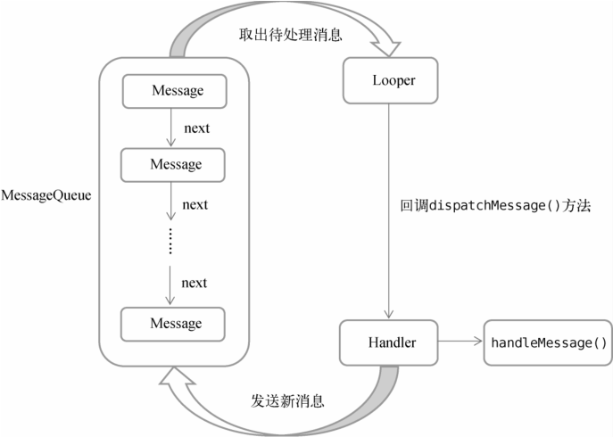

## Android 多线程编程

### 线程的基本用法

Android 多线程编程其实并不比 Java 多线程编程特殊，基本是使用继承 `Thread` 的方法。如下所示：

```kotlin
// 新建一个类继承自 Thread，然后重写父类的 run() 方法
class MyThread : Thread() {
    override fun run() {
        // 编写具体的逻辑
    }
}

// 启动线程
MyThread().start()
```

使用继承的方式耦合性高，一般使用实现 `Runnable` 接口的方式来定义一个线程，如下所示：

```kotlin
class MyThread : Runnable {
    override fun run() {
        // 编写具体的逻辑
    }
}

// 启动线程，
val myThread = MyThread()
// 调用 start() 方法，run()方法中的代码就会在子线程当中运行了。
Thread(myThread).start()
```

使用 `Lambda` 方式的写法更为常见，如下所示：

```kotlin
Thread {
    // 编写具体的逻辑
}.start()

// 这里的 thread 是一个 Kotlin 内置的顶层函数，我们只需要在 Lambda 表达式中编写具体的逻辑就可以了
thread {
    // 编写具体的逻辑
}
```

### 在子线程中更新 UI

Android 的 UI 是线程不安全的，更新应用程序里的 UI 元素，必须在主线程中进行，否则就会出现异常。如果需要在子线程中进行 UI 操作，则可以使用 Android 提供的异步消息处理机制。

```kotlin
class MainActivity : AppCompatActivity() {
    val updateText = 1
    val hanlder = object : Handler(Looper.getMainLooper()){
        override fun handleMessage(msg: Message) {
            when(msg.what){
                // 如果 msg.what == updateText，则在主线程中操作 UI
                updateText -> tv_Text.text = "Nice to meet you"
            }
        }
    }

    override fun onCreate(savedInstanceState: Bundle?) {
        super.onCreate(savedInstanceState)
        setContentView(R.layout.activity_main)

        btn_changeText.setOnClickListener {
            thread { // 在子线程中发送消息，然后在主线程中更新 UI
                val msg = Message()
                msg.what = updateText
                hanlder.sendMessage(msg) //  将 Message 对象发送出去
            }
        }
    }
}
```

上面使用 Android 异步消息实现了子线程中更新 UI 的功能。

### 异步消息处理机制

Android 中的异步消息处理主要由 4 个部分组成：`Message`、`Handler`、`MessageQueue` 和 `Looper`。

**Message**

`Message` 是在线程之间传递的消息，它可以在内部携带少量的信息，用于在不同线程之间传递数据。

**Handler**

`Handler` 它主要是用于发送和处理消息的。发送消息一般是使用 `Handler` 的 `sendMessage()` 方法、`post()` 方法，最终会传递到 `Handler` 的 `handleMessage()` 方法中。

**MessageQueue**

`MessageQueue` 是消息队列的意思，它主要用于存放所有通过 `Handler` 发送的消息。

**Looper**

`Looper` 是每个线程中的 `MessageQueue` 的管家，调用 `Looper` 的 `loop()` 方法后，就会进入一个无限循环当中，然后每当发现 `MessageQueue` 中存在一条消息时，就会将它取出，并传递到 `Handler` 的 `handleMessage()` 方法中。

异步消息处理机制流程如图所示：



### 使用 AsyncTask

`AsyncTask` 背后的实现原理也是基于异步消息处理机制的，只是 Android 帮我们做了很好的封装而已。

`AsyncTask` 是一个抽象类，所以如果我们想使用它，就必须创建一个子类去继承它。在继承时我们可以为 `AsyncTask` 类指定 3 个泛型参数，这 3 个参数的用途如下。

- `Params` 在执行 `AsyncTask` 时需要传入的参数，可用于在后台任务中使用。
- `Progress` 在后台任务执行时，如果需要在界面上显示当前的进度，则使用这里指定的泛
- 型作为进度单位。
- `Result` 当任务执行完毕后，如果需要对结果进行返回，则使用这里指定的泛型作为返回
- 值类型。

例如：

```kotlin
class MainActivity : AppCompatActivity() {
    override fun onCreate(savedInstanceState: Bundle?) {
        super.onCreate(savedInstanceState)
        setContentView(R.layout.activity_main)

        btn_changeText.setOnClickListener {
            // 可以给 execute() 方法传入任意数量的参数，
            // 这些参数将会传递到 DownloadTask 的 doInBackground() 方法当中。
            DownloadTask().execute()
        }
    }

    // AsyncTask 的第一个泛型参数指定为 Unit，表示在执行 AsyncTask 的时候不需要传入参数给后台任务
    // 第二个泛型参数指定为 Int，表示使用整型数据来作为进度显示单位
    // 第三个泛型参数指定为 Boolean，则表示使用布尔型数据来反馈执行结果。
    inner class DownloadTask: AsyncTask<Unit, Int, Boolean>(){
        override fun onPreExecute() {
            // 在 doInBackground 执行之前开始调用,可操作UI
            pb_download.max = 100
        }
        override fun doInBackground(vararg p0: Unit?): Boolean {
            // 在子线程中运行后台任务，可以处理耗时任务
            var dowloadPercent = 0
            while (true){
                dowloadPercent +=10
                // 调用该方法会触发 onProgressUpdate() 方法
                publishProgress(dowloadPercent)
                if (dowloadPercent >= 100)
                    break
                Thread.sleep(100)
            }
            return true
        }

        override fun onProgressUpdate(vararg values: Int?) {
            // doInBackground 中调用 publishProgress(Progress...) 后开始调用此方法，可操作 UI
            pb_download.progress = values[0] as Int
        }

        override fun onPostExecute(result: Boolean?) {
            // doInBackground 执行完毕并通过 return 返回值调用此方法，可操作UI
            if (result == true) {
                Log.d(TAG, "onPostExecute: Download succeeded")
            } else {
                Log.d(TAG, "onPostExecute: Download failed")
            }
        }
    }
}
```

使用 `AsyncTask` 的诀窍就是，在 `onPreExecute()` 中进行一些界面初始化；在 `doInBackground()` 方法中执行具体的耗时任务（运行在子线程）；在 `onProgressUpdate()` 方法中进行 UI 操作；在 `onPostExecute()` 方法中执行一些任务的收尾工作。

## Service 的基本用法

`Service` 是 Android 中实现程序后台运行的解决方案，它非常适合执行那些不需要和用户交互而且还要求长期运行的任务。`Service` 的运行不依赖于任何用户界面，即使程序被切换到后台，或者用户打开了另外一个应用程序，`Service` 仍然能够保持正常运行。

需要注意的是，`Service` 并不是运行在一个独立的进程当中的，而是依赖于创建 `Service` 时所在的应用程序进程。当某个应用程序进程被杀掉时，所有依赖于该进程的 `Service` 也会停止运行。

创建一个 `MyService` 类，继承自 Service 类，如下所示：

```kotlin
class MyService : Service() {
    override fun onBind(intent: Intent): IBinder {
        return null;
    }
    override fun onCreate() {
        super.onCreate()
        // Service 创建时调用
        Log.d(TAG, "onCreate: ")
    }
    override fun onStartCommand(intent: Intent?, flags: Int, startId: Int): Int {
        // 每次 Service 启动时调用
        Log.d(TAG, "onStartCommand: ")
        return super.onStartCommand(intent, flags, startId)
    }
    override fun onDestroy() {
        super.onDestroy()
        // Service 销毁时调用
        Log.d(TAG, "onDestroy: ")
    }
}
```

使用 `Service` 需要在 `AndroidManifest.xml` 文件中进行注册才能生效。

```xml
<?xml version="1.0" encoding="utf-8"?>
<manifest xmlns:android="http://schemas.android.com/apk/res/android"
    package="com.example.androidservice">

    <application
        ...
        <service
            android:name=".MyService"
            android:enabled="true"
            android:exported="true" />
        ...
    </application>

</manifest>
```

然后修改 MainActivity 中的代码，如下所示：

```kotlin
class MainActivity : AppCompatActivity() {

    override fun onCreate(savedInstanceState: Bundle?) {
        super.onCreate(savedInstanceState)
        setContentView(R.layout.activity_main)

        // 启动 Service
        btn_startService.setOnClickListener {
            val intent = Intent(this, MyService::class.java)
            startService(intent)
        }

        // 停止 Service
        btn_stopService.setOnClickListener {
            val intent = Intent(this, MyService::class.java)
            stopService(intent)
        }
    }
}
```

调用 `startService()` 方法启动服务；调用 `stopService()` 方法停止服务，也可以在 `Service` 内部调用 `stopSelf()` 方法来停止服务。以上就是 `Service` 的基本用法。

从 Android 8.0 系统开始，只有当应用保持在前台可见状态的情况下，`Service` 才能保证稳定运行，一旦应用进入后台之后，`Service` 随时都有可能被系统回收。

### Service 和 Activity 之间的通信

`Activity` 和 `Service` 进行通信需要借助 `ServiceConnection` 和 `onBind()` 方法，修改 MyService 中的代码，如下所示：

```kotlin
class MyService : Service() {
    companion object{
        private const val TAG = "MyService"
    }
    val mbinder = DownloadBinder()
    class DownloadBinder:Binder(){
        fun startDownload(){
            Log.d(TAG, "startDownload: StartDownload executed")
        }
        fun getProgress():Int{
            Log.d(TAG, "getProgress: getProgress executed")
            return 0
        }
    }
    override fun onBind(intent: Intent): IBinder {
        return mbinder
    }
    ...
}
```

创建 `DownloadBinder`,并让它继承自 `Binder`，最后在 `onBind()` 方法中返回了 `DownloadBinder` 实例。

接下来修改 `MainActivity`，实现 `Activity` 和 `Service` 绑定以及解绑，如下所示：

```kotlin
class MainActivity : AppCompatActivity() {

    companion object{
        private const val TAG = "MainActivity"
    }

    lateinit var downloadBinder:MyService.DownloadBinder
    // 创建了一个ServiceConnection的匿名类并实现了ServiceConnection接口
    private val connection = object :ServiceConnection{
        // Activity 与 Service 成功绑定的时候调用
        override fun onServiceConnected(name: ComponentName?, service: IBinder?) {
            downloadBinder = service as MyService.DownloadBinder
            downloadBinder.startDownload()
            downloadBinder.getProgress()
        }
        // Service的创建进程崩溃或者被杀掉的时候才会调用
        override fun onServiceDisconnected(p0: ComponentName?) {
            Log.d(TAG, "onServiceDisconnected")
        }
    }
    override fun onCreate(savedInstanceState: Bundle?) {
        super.onCreate(savedInstanceState)
        setContentView(R.layout.activity_main)
        // 以bind方式启动服务
        btn_bindService.setOnClickListener {
            val intent = Intent(this, MyService::class.java)
            // BIND_AUTO_CREATE 表示在 Activity 和 Service 进行绑定后自动创建 Service。
            // onCreate() 方法得到执行，但 onStartCommand() 方法不会执行。
            bindService(intent, connection, Context.BIND_AUTO_CREATE)
        }
        btn_unbindService.setOnClickListener {
            // 解除Activity和Service之间的绑定
            unbindService(connection)
        }
    }
}
```

## Service 的生命周期

一旦在项目的任何位置调用了 `Context` 的 `startService()` 方法，相应的 `Service` 就会启动，并回调 `onStartCommand()` 方法。如果这个 `Service` 之前还没有创建过，`onCreate()` 方法会先于 `onStartCommand()` 方法执行。`Service` 启动了之后会一直保持运行状态，直到 `stopService()` 或 `stopSelf()` 方法被调用，或者被系统回收。虽然每调用一次 `startService()` 方法，`onStartCommand()` 就会执行一次，但实际上每个 `Service` 只会存在一个实例。只需调用一次 `stopService()` 或 `stopSelf()` 方法，这时 `Service` 中的 `onDestroy()` 方法就会执行，表示 `Service` 已经销毁了。

调用 `Context` 的 `bindService()` 来获取一个 `Service` 的持久连接，这时就会回调 `Service` 中的 `onBind()` 方法。如果这个 `Service` 之前还没有创建过，`onCreate()` 方法会先于 `onBind()` 方法执行。只要调用方和 `Service` 之间的连接没有断开，`Service` 就会一直保持运行状态，直到被系统回收。

对一个 `Service` 既调用了 `startService()` 方法，又调用了 `bindService()` 方法的，这种情况下要同时调用 `stopService()` 和 `unbindService()` 方法，`onDestroy()` 方法才会执行。

## Service 的更多技巧

### 使用前台 Service

前台 `Service` 和普通 `Service` 最大的区别就在于，它一直会有一个正在运行的图标在系统的状态栏显示，下拉状态栏后可以看到更加详细的信息，非常类似于通知的效果。修改 `MyService` 中的代码，如下所示：

```kotlin
    override fun onCreate() {
        super.onCreate()
        // Service 创建时调用
        Log.d(TAG, "onCreate: ")

        // 创建前台服务
        val manager = getSystemService(Context.NOTIFICATION_SERVICE) as NotificationManager
        if (Build.VERSION.SDK_INT >= Build.VERSION_CODES.O){
            val channel = NotificationChannel("my_service", "前台服务通知", NotificationManager.IMPORTANCE_DEFAULT)
            manager.createNotificationChannel(channel)
        }
        val intent = Intent(this, MainActivity::class.java)
        val pi = PendingIntent.getActivity(this, 0, intent, PendingIntent.FLAG_IMMUTABLE)
        val notification = NotificationCompat.Builder(this, "my_service")
            .setContentTitle("This is content title")
            .setContentText("this is context text")
            .setSmallIcon(R.drawable.notify)
            .setLargeIcon(BitmapFactory.decodeResource(resources, R.drawable.notify))
            .setContentIntent(pi)
            .build()
        startForeground(1, notification)
    }
```

从 Android 9.0 系统开始，使用前台 `Service` 必须在 `AndroidManifest.xml` 文件中进行权限声明才行，如下所示：

```xml
<?xml version="1.0" encoding="utf-8"?>
<manifest xmlns:android="http://schemas.android.com/apk/res/android"
    package="com.example.androidservice">
    <uses-permission android:name="android.permission.FOREGROUND_SERVICE" />
    ...
</manifest>
```

现在即使你退出应用程序，`MyService` 也会一直处于运行状态，而且不用担心会被系统回收。当然，`MyService` 所对应的通知也会一直显示在状态栏上面。

### 使用 IntentService

`Service` 中的代码都是默认运行在主线程当中的，如果直接在 `Service` 里处理一些耗时的逻辑，就很容易出现 ANR 的情况。所以这个时候就需要用到 Android 多线程编程的技术了，我们应该在 `Service` 的每个具体的方法里开启一个子线程，然后在这里处理那些耗时的逻辑。因此，一个比较标准的 `Service` 就可以写如下形式：

```kotlin
class MyService : Service() {
...
override fun onStartCommand(intent: Intent, flags: Int, startId: Int): Int {
        thread {
            // 处理具体的逻辑
            ...
            // 执行完毕后自动停止 Service
            stopSelf()
        }
        return super.onStartCommand(intent, flags, startId)
    }
}
```

Android 专门提供了一个 `IntentService` 类将会自动开启线程并在执行完成后停止服务。

```kotlin
class MyIntentService : IntentService("MyIntentService") {

    companion object{
        private const val TAG = "MyIntentService"
    }
    override fun onHandleIntent(p0: Intent?) {
        // 该方法可以出来耗时任务
        // 输出当前线程名
        Log.d(TAG, "onHandleIntent: thread id is ${Thread.currentThread().name}")
    }

    override fun onDestroy() {
        super.onDestroy()
        Log.d(TAG, "onDestroy: onDestory executed")
    }
}
```

在 `AndroidManifest.xml` 文件中进行注册：

```xml
<?xml version="1.0" encoding="utf-8"?>
<manifest xmlns:android="http://schemas.android.com/apk/res/android"
    package="com.example.androidservice">

    <application
        ...
        <service
            android:name=".MyIntentService"
            android:exported="true"
            android:enabled="true"/>
        ...
    </application>

</manifest>
```

`IntentService` 的启动方式和普通的 `Service` 没什么两样，修改 `MainActivity` 的代码如下所示:

```kotlin
    override fun onCreate(savedInstanceState: Bundle?) {
        super.onCreate(savedInstanceState)
        setContentView(R.layout.activity_main)

        btn_startIntentService.setOnClickListener {
            // 输出当前线程名
            Log.d(TAG, "onCreate: Thread id is ${Thread.currentThread().name}")
            val intent = Intent(this, MyIntentService::class.java)
            startService(intent)
        }
    }
```
当点击按钮时，`MyIntentService` 将会自动开启线程并在执行完成后自动停止服务。