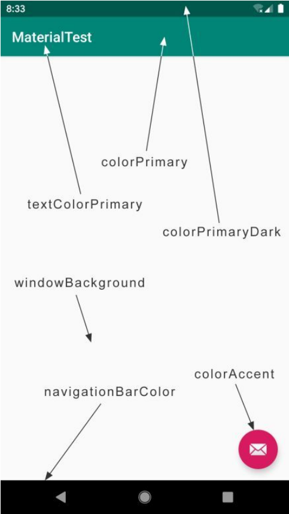

## Toolbar

`Toolbar` 的强大之处在于，它不仅继承了 `ActionBar` 的所有功能，而且灵活性很高，可以配合其他控件完成一些 Material Design 的效果。

`AndroidManifest.xml` 文件中 `android:theme` 属性指定了一个 `AppTheme` 的主题，该主题定义在 `res/values/styles.xml` 文件中，如下所示：

```xml
<resources xmlns:tools="http://schemas.android.com/tools">
    <!-- Base application theme. -->
    <style name="Theme.AppTheme" parent="Theme.MaterialComponents.DayNight.DarkActionBar">
        <!-- Primary brand color. -->
        <item name="colorPrimary">@color/purple_500</item>
        <item name="colorPrimaryVariant">@color/purple_700</item>
        <item name="colorOnPrimary">@color/white</item>
        <!-- Secondary brand color. -->
        <item name="colorSecondary">@color/teal_200</item>
        <item name="colorSecondaryVariant">@color/teal_700</item>
        <item name="colorOnSecondary">@color/black</item>
        <!-- Status bar color. -->
        <item name="android:statusBarColor" tools:targetApi="l">?attr/colorPrimaryVariant</item>
        <!-- Customize your theme here. -->
    </style>
</resources>
```

这里定义了一个叫 `AppTheme` 的主题，然后指定它的 `parent` 主题是 `Theme.MaterialComponents.DayNight.DarkActionBar`。这个 `DarkActionBar` 是一个深色的 `ActionBar` 主题。

现在我们准备使用 `Toolbar` 来替代 `ActionBar`，因此需要指定一个不带 `ActionBar` 的主题，修改 `res/values/styles.xml` 中的代码，添加如下代码：

```xml
<resources>
    ...
    <!-- Base application theme. -->
    <style name="AppTheme" parent="Theme.AppCompat.Light.NoActionBar">
    <!-- Customize your theme here. -->
    <item name="colorPrimary">@color/colorPrimary</item>
    <item name="colorPrimaryDark">@color/colorPrimaryDark</item>
    <item name="colorAccent">@color/colorAccent</item>
    </style>
</resources>
```

这里重写了 `colorPrimary`、`colorPrimaryDark` 和 `colorAccent` 这 3 个属性的颜色。

各属性指定颜色的位置如图所示：



接下来添加一个 `ToolBarActivity` 类，并将 `android:theme` 属性指定为 `AppTheme` 主题，如下所示：

```xml
<?xml version="1.0" encoding="utf-8"?>
<manifest xmlns:android="http://schemas.android.com/apk/res/android"
    package="com.example.materialdesign">

    <application
        ...
        <activity android:name=".ToolBarActivity"
            android:theme="@style/AppTheme"
            android:label="Toolbar"/>
    </application>

</manifest>
```

修改 `toolbar_layout.xml` 中的代码，如下所示：

```xml
<?xml version="1.0" encoding="utf-8"?>
<FrameLayout xmlns:android="http://schemas.android.com/apk/res/android"
    xmlns:app = "http://schemas.android.com/apk/res-auto"
    android:layout_width="match_parent"
    android:layout_height="match_parent">
    <!-- xmlns:app指定了一个新的命名空间 -->

    <androidx.appcompat.widget.Toolbar
        android:id="@+id/toolBar"
        android:layout_width="match_parent"
        android:layout_height="?attr/actionBarSize"
        android:background="@color/colorPrimary"
        android:theme="@style/ThemeOverlay.AppCompat.Dark.ActionBar"
        app:popupTheme="@style/ThemeOverlay.AppCompat.Light"/>
</FrameLayout>
```

这里使用 `xmlns:app` 指定了一个新的命名空间，新增这个命名空间是为了兼容老系统，现在可以使用 `app:attribute` 这样的写法了，如 `app:popupTheme`。

使用 `android:theme` 将 `Toolbar` 的主题指定成了 `ThemeOverlay.AppCompat.Dark.ActionBar` 就能让 `Toolbar` 单独使用深色主题。然后使用 `app:popupTheme` 属性，单独将弹出的菜单项指定成了浅色主题。

最后调用 `setSupportActionBar()` 方法并将 `Toolbar` 的实例传入，这样我们就做到既使用了 `Toolbar`，又让它的外观与功能都和 `ActionBar` 一致了，如下所示：

```kotlin
class ToolBarActivity:AppCompatActivity() {

    override fun onCreate(savedInstanceState: Bundle?) {
        super.onCreate(savedInstanceState)
        setContentView(R.layout.toolbar_layout)
        setSupportActionBar(toolBar)
    }
}
```

创建一个 `menu` 文件夹，然后创建一个` toolbar.xml` 文件，并编写如下代码：

```xml
<?xml version="1.0" encoding="utf-8"?>
<menu xmlns:android="http://schemas.android.com/apk/res/android"
    xmlns:app="http://schemas.android.com/apk/res-auto">
    <item
        android:id="@+id/backup"
        android:icon="@drawable/ic_backup"
        android:title="Backup"
        app:showAsAction="always"/>

    <item
        android:id="@+id/delete"
        android:icon="@drawable/ic_delete"
        android:title="Delete"
        app:showAsAction="ifRoom"/>
    <item
        android:id="@+id/setting"
        android:icon="@drawable/ic_settings"
        android:title="Settings"
        app:showAsAction="never"/>
    <item
        android:id="@+id/done"
        android:icon="@drawable/ic_done"
        android:title="Done"
        app:showAsAction="never"/>
</menu>
```

`android:id` 用于指定按钮的 `id`；`android:icon` 用于指定按钮的图标；`android:title` 用于指定按钮的文字；`app:showAsAction` 来指定按钮的显示位置。

`showAsAction` 主要有以下几种值可选：

- `always` 表示永远显示在 `Toolbar` 中，如果屏幕空间不够则不显示；
- `ifRoom` 表示屏幕空间足够的情况下显示在 `Toolbar` 中，不够的话就显示在菜单当中；
- `never` 则表示永远显示在菜单当中。

> 注意，`Toolbar` 中的 `action` 按钮只会显示图标，菜单中的 `action` 按钮只会显示文字。

修改 `ToolBarActivity` 中的代码，如下所示：

```kotlin
class ToolBarActivity:AppCompatActivity() {

    override fun onCreate(savedInstanceState: Bundle?) {
        super.onCreate(savedInstanceState)
        setContentView(R.layout.toolbar_layout)
        setSupportActionBar(toolBar)
    }

    override fun onCreateOptionsMenu(menu: Menu?): Boolean {
        // 加载 toolbar.xml 菜单文件
        menuInflater.inflate(R.menu.toolbar, menu)
        return true
    }

    override fun onOptionsItemSelected(item: MenuItem): Boolean {
        // 处理各个按钮的点击事件
        when(item.itemId){
            R.id.backup -> Toast.makeText(this, "You clicked Backup", Toast.LENGTH_SHORT).show()
            R.id.delete -> Toast.makeText(this, "You clicked Delete", Toast.LENGTH_SHORT).show()
            R.id.setting -> Toast.makeText(this, "You clicked Settings", Toast.LENGTH_SHORT).show()
        }
        return true
    }
}
```

最终将在 `Toolbar` 上现在显示了两个 `action` 按钮和一个菜单按钮。

## 滑动菜单

### DrawerLayout

`DrawerLayout` 是一个布局，在布局中允许放入两个直接子控件：第一个子控件是主屏幕中显示的内容，第二个子控件是滑动菜单中显示的内容。

新建一个 `DrawerLayoutActivity`，修改 `drawer_layout.xml` 文件：

```xml
<?xml version="1.0" encoding="utf-8"?>
<androidx.drawerlayout.widget.DrawerLayout xmlns:android="http://schemas.android.com/apk/res/android"
    xmlns:app="http://schemas.android.com/apk/res-auto"
    android:id="@+id/drawerLayout"
    android:layout_width="match_parent"
    android:layout_height="match_parent">
    <!-- 第一个控件显示主屏的内容 -->
    <FrameLayout
        android:layout_width="match_parent"
        android:layout_height="match_parent">
        <androidx.appcompat.widget.Toolbar
            android:id="@+id/dw_toolBar"
            android:layout_width="match_parent"
            android:layout_height="?attr/actionBarSize"
            android:background="@color/colorPrimary"
            android:theme="@style/ThemeOverlay.AppCompat.Dark.ActionBar"
            app:popupTheme="@style/ThemeOverlay.AppCompat.Light"/>
    </FrameLayout>
    <!-- 第二个控件显示滑动菜单的内容 -->
    <TextView
        android:id="@+id/tv_menu"
        android:background="#FFF"
        android:text="This is menu"
        android:textSize="30sp"
        android:layout_gravity="start"
        android:layout_width="match_parent"
        android:layout_height="match_parent"/>
</androidx.drawerlayout.widget.DrawerLayout>
```

第二个子控件的 `layout_gravity` 这个属性是必须指定的，说明滑动菜单是在屏幕的左边还是右边。

修改 `DrawerLayoutActivity` 代码，添加一个导航按钮，点击按钮也会将滑动菜单的内容展示出来。

```kotlin
class DrawerLayoutActivity:AppCompatActivity() {
    override fun onCreate(savedInstanceState: Bundle?) {
        super.onCreate(savedInstanceState)
        setContentView(R.layout.drawer_layout)
        setSupportActionBar(dw_toolBar)
        supportActionBar?.let {
            // 显示导航按钮
            it.setDisplayHomeAsUpEnabled(true)
            // 设置导航按钮图标
            it.setHomeAsUpIndicator(R.drawable.ic_menu)
        }
        // 响应滑动菜单的点击事件
        tv_menu.setOnClickListener{
            Toast.makeText(this, "You clicked Menu", Toast.LENGTH_SHORT).show()
        }
    }
    override fun onCreateOptionsMenu(menu: Menu?): Boolean {
        menuInflater.inflate(R.menu.toolbar, menu)
        return true
    }
    override fun onOptionsItemSelected(item: MenuItem): Boolean {
        when(item.itemId){
            // Home 按钮的 id 永远都是 android.R.id.home
            // 将滑动菜单展示出来
            android.R.id.home -> drawerLayout.openDrawer(GravityCompat.START)
            R.id.backup -> Toast.makeText(this, "You clicked Backup", Toast.LENGTH_SHORT).show()
            R.id.delete -> Toast.makeText(this, "You clicked Delete", Toast.LENGTH_SHORT).show()
            R.id.setting -> Toast.makeText(this, "You clicked Settings", Toast.LENGTH_SHORT).show()
        }
        return true
    }
}
```

### NavigationView

`NavigationView` 是 Material 库中提供的一个控件，它不仅是严格按照 Material Design 的要求来设计的，而且可以将滑动菜单页面的实现变得非常简单。

首先将这个库引入项目中，修改 `app/build.gradle` 文件：

```kotlin
dependencies {
    ...
    implementation 'com.google.android.material:material:1.4.0'
    implementation 'de.hdodenhof:circleimageview:3.0.1'
}
```

`CircleImageView` 可以用来轻松实现图片圆形化的功能。

需要注意的是，当你引入了 `Material` 库之后，还需要将 `res/values/styles.xml` 文件中 `AppTheme` 的 `parent` 主题改成 `Theme.MaterialComponents.Light.NoActionBar`，否则在使用接下来的一些控件时可能会遇到崩溃问题。

在开始使用 `NavigationView` 之前，我们还需要准备好两个东西：`menu` 和 `headerLayout`。`menu` 是用来在 `NavigationView` 中显示具体的菜单项的，`headerLayout` 则是用来在 `NavigationView` 中显示头部布局的。

右击 `menu` 文件夹，创建一个 `nav_menu.xml` 文件，并编写如下代码：

```xml
<?xml version="1.0" encoding="utf-8"?>
<menu xmlns:android="http://schemas.android.com/apk/res/android">

    <!-- single 表示组中的所有菜单项只能单选。-->
    <group android:checkableBehavior="single">
        <item
            android:id="@+id/navCall"
            android:icon="@drawable/nav_call"
            android:title="Call"/>

        <item
            android:id="@+id/navFriends"
            android:icon="@drawable/nav_friends"
            android:title="Friends"/>

        <item
            android:id="@+id/navLocation"
            android:icon="@drawable/nav_location"
            android:title="Location"/>

        <item
            android:id="@+id/navMail"
            android:icon="@drawable/nav_mail"
            android:title="Mail"/>

        <item
            android:id="@+id/navTask"
            android:icon="@drawable/nav_task"
            android:title="Tasks"/>
    </group>

</menu>
```

`group` 表示一个组，`checkableBehavior` 指定为 `single` 表示组中的所有菜单项只能单选。

接下来应该准备 `headerLayout` 了，右击 `layout` 文件夹，创建一个 `nav_header.xml` 文件。

```xml
<?xml version="1.0" encoding="utf-8"?>
<RelativeLayout xmlns:android="http://schemas.android.com/apk/res/android"
    android:layout_width="match_parent"
    android:layout_height="180dp"
    android:padding="10dp"
    android:background="@color/colorPrimary">

    <de.hdodenhof.circleimageview.CircleImageView
        android:id="@+id/iconImage"
        android:layout_width="70dp"
        android:layout_height="70dp"
        android:src="@drawable/nav_icon"
        android:layout_centerInParent="true"/>

    <TextView
        android:id="@+id/mailText"
        android:layout_width="wrap_content"
        android:layout_height="wrap_content"
        android:layout_alignParentBottom="true"
        android:text="ckcatck@qq.com"
        android:textColor="#FFF"
        android:textSize="14sp"/>
    <TextView
        android:id="@+id/userText"
        android:layout_width="wrap_content"
        android:layout_height="wrap_content"
        android:layout_above="@+id/mailText"
        android:text="CKCat"
        android:textColor="#FFF"
        android:textSize="14sp"/>
</RelativeLayout>
```

`menu` 和 `headerLayout` 都准备好了，开始使用 `NavigationView`，新建一个 `navigation_layout.xml` 文件，内容如下：

```xml
<?xml version="1.0" encoding="utf-8"?>
<androidx.drawerlayout.widget.DrawerLayout xmlns:android="http://schemas.android.com/apk/res/android"
   xmlns:app="http://schemas.android.com/apk/res-auto"
    android:id="@+id/nav_drawerLayout"
    android:layout_width="match_parent"
    android:layout_height="match_parent">

<!-- CoordinatorLayout可以监听其所有子控件的各种事件，并自动帮助我们做出最为合理的响应。-->
    <androidx.coordinatorlayout.widget.CoordinatorLayout
        android:layout_width="match_parent"
        android:layout_height="match_parent">

        <androidx.appcompat.widget.Toolbar
            android:id="@+id/nav_toolbar"
            android:layout_width="match_parent"
            android:layout_height="?attr/actionBarSize"
            android:background="@color/colorPrimary"
            android:theme="@style/ThemeOverlay.AppCompat.Dark.ActionBar"
            app:popupTheme="@style/ThemeOverlay.AppCompat.Light"/>

    </androidx.coordinatorlayout.widget.CoordinatorLayout>

    <com.google.android.material.navigation.NavigationView
        android:layout_width="match_parent"
        android:layout_height="match_parent"
        android:id="@+id/navView"
        android:layout_gravity="start"
        app:menu="@menu/nav_menu"
        app:headerLayout="@layout/nav_header"/>

</androidx.drawerlayout.widget.DrawerLayout>
```

新建一个 `NavigationActivity`，并处理菜单项的点击事件，如下所示：

```kotlin
class NavigationActivity:AppCompatActivity() {

    override fun onCreate(savedInstanceState: Bundle?) {
        super.onCreate(savedInstanceState)
        setContentView(R.layout.navigation_layout)
        setSupportActionBar(nav_toolbar)
        supportActionBar?.let {
            it.setDisplayHomeAsUpEnabled(true)
            it.setHomeAsUpIndicator(R.drawable.ic_menu)
        }
        // 将Call菜单项设置为默认选中
        navView.setCheckedItem(R.id.navCall)
        // 设置一个菜单项选中事件的监听器
        navView.setNavigationItemSelectedListener {
            when(it.itemId){
                R.id.navCall -> Toast.makeText(this, "navCall click", Toast.LENGTH_SHORT).show()
                R.id.navFriends -> Toast.makeText(this, "navFriends click", Toast.LENGTH_SHORT).show()
                R.id.navLocation -> Toast.makeText(this, "navLocation click", Toast.LENGTH_SHORT).show()
                R.id.navMail -> Toast.makeText(this, "navMail click", Toast.LENGTH_SHORT).show()
                R.id.navTask -> Toast.makeText(this, "navTask click", Toast.LENGTH_SHORT).show()
            }
            // 将滑动菜单关闭，并返回true表示此事件已被处理。
            nav_drawerLayout.closeDrawers()
            true
        }
    }
    override fun onCreateOptionsMenu(menu: Menu?): Boolean {
        menuInflater.inflate(R.menu.toolbar, menu)
        return true
    }
    override fun onOptionsItemSelected(item: MenuItem): Boolean {
        when(item.itemId){
            android.R.id.home -> nav_drawerLayout.openDrawer(GravityCompat.START)
            R.id.backup -> Toast.makeText(this, "You clicked Backup", Toast.LENGTH_SHORT).show()
            R.id.delete -> Toast.makeText(this, "You clicked Delete", Toast.LENGTH_SHORT).show()
            R.id.setting -> Toast.makeText(this, "You clicked Settings", Toast.LENGTH_SHORT).show()
        }
        return true
    }
}
```

## 悬浮按钮和可交互提示

### FloatingActionButton

`FloatingActionButton` 是 Material 库中提供的一个控件，这个控件可以帮助我们比较轻松地实现悬浮按钮的效果。

### Snackbar

`Snackbar` 允许在提示中加入一个可交互按钮，当用户点击按钮的时候，可以执行一些额外的逻辑操作。

### CoordinatorLayout

`CoordinatorLayout` 可以说是一个加强版的 `FrameLayout`，由 AndroidX 库提供。`CoordinatorLayout` 可以监听其所有子控件的各种事件，并自动帮助我们做出最为合理的响应。

修改 `navigation_layout.xml` 文件，如下所示：

```xml
<?xml version="1.0" encoding="utf-8"?>
<androidx.drawerlayout.widget.DrawerLayout xmlns:android="http://schemas.android.com/apk/res/android"
   xmlns:app="http://schemas.android.com/apk/res-auto"
    android:id="@+id/nav_drawerLayout"
    android:layout_width="match_parent"
    android:layout_height="match_parent">

    <!-- CoordinatorLayout可以监听其所有子控件的各种事件，并自动帮助我们做出最为合理的响应。-->
    <androidx.coordinatorlayout.widget.CoordinatorLayout
        android:layout_width="match_parent"
        android:layout_height="match_parent">

        <androidx.appcompat.widget.Toolbar
            android:id="@+id/nav_toolbar"
            android:layout_width="match_parent"
            android:layout_height="?attr/actionBarSize"
            android:background="@color/colorPrimary"
            android:theme="@style/ThemeOverlay.AppCompat.Dark.ActionBar"
            app:popupTheme="@style/ThemeOverlay.AppCompat.Light"/>

        <com.google.android.material.floatingactionbutton.FloatingActionButton
            android:id="@+id/nav_fab"
            android:layout_width="wrap_content"
            android:layout_height="wrap_content"
            android:layout_gravity="bottom|end"
            android:layout_margin="16dp"
            android:src="@drawable/ic_done"
            app:elevation="8dp"/>
    <!-- app:elevation 指定一个高度值，影响投影效果 -->
    </androidx.coordinatorlayout.widget.CoordinatorLayout>

    <com.google.android.material.navigation.NavigationView
        android:layout_width="match_parent"
        android:layout_height="match_parent"
        android:id="@+id/navView"
        android:layout_gravity="start"
        app:menu="@menu/nav_menu"
        app:headerLayout="@layout/nav_header"/>

</androidx.drawerlayout.widget.DrawerLayout>
```

将 `FrameLayout` 替换为 `CoordinatorLayout`，并添加 `FloatingActionButton` 。使用 `CoordinatorLayout` 可以监听其所有子控件的各种事件，并自动帮助我们做出最为合理的响应。当让 `CoordinatorLayout` 监听到 `Snackbar` 的弹出事件，那么它会自动将内部的 `FloatingActionButton` 向上偏移，从而确保不会被 `Snackbar` 遮挡。

修改 `NavigationActivity` 代码，如下所示：

```kotlin
class NavigationActivity:AppCompatActivity() {

    override fun onCreate(savedInstanceState: Bundle?) {
        super.onCreate(savedInstanceState)
        setContentView(R.layout.navigation_layout)
        ...
        // 设置 FloatingActionButton 按钮的点击事件
        nav_fab.setOnClickListener {
            // Toast.makeText(this, "Fab clicked", Toast.LENGTH_SHORT).show()
            // FloatingActionButton 是 CoordinatorLayout中的子控件，
            // 因此传入 nav_fab ，这个事件就能被监听到了,
            Snackbar.make(it, "Data deleted", Snackbar.LENGTH_SHORT)
            // 设置一个动作
            .setAction("Undo"){
                Toast.makeText(this, "Data restored", Toast.LENGTH_SHORT).show()
            }
            .show()
        }
    }
    ...
}
```

## 卡片式布局

### MaterialCardView

`MaterialCardView` 是用于实现卡片式布局效果的重要控件，由 Material 库提供。实际上，`MaterialCardView` 也是一个 `FrameLayout`，只是额外提供了圆角和阴影等效果，看上去会有立体的感觉。

```xml
<?xml version="1.0" encoding="utf-8"?>
<androidx.drawerlayout.widget.DrawerLayout xmlns:android="http://schemas.android.com/apk/res/android"
    xmlns:app="http://schemas.android.com/apk/res-auto"
    android:id="@+id/md_drawerLayout"
    android:layout_width="match_parent"
    android:layout_height="match_parent">

    <!-- CoordinatorLayout 就是一个加强版的 FrameLayout，可以监听其所有子控件的各种事件，并自动帮助我们做出最为合理的响应。-->
    <androidx.coordinatorlayout.widget.CoordinatorLayout
        android:layout_width="match_parent"
        android:layout_height="match_parent">

        <!-- AppBarLayout实际上是一个垂直方向的LinearLayout，它在内部做了很多滚动事件的封装，并应用了一些Material Design的设计理念 -->
        <com.google.android.material.appbar.AppBarLayout
            android:layout_width="match_parent"
            android:layout_height="wrap_content">

            <androidx.appcompat.widget.Toolbar
                android:id="@+id/md_toolbar"
                android:layout_width="match_parent"
                android:layout_height="?attr/actionBarSize"
                android:background="@color/colorPrimary"
                android:theme="@style/ThemeOverlay.AppCompat.Dark.ActionBar"
                app:layout_scrollFlags="scroll|enterAlways|snap"
                app:popupTheme="@style/ThemeOverlay.AppCompat.Light"/>
            <!-- scroll 表示当 RecyclerView 向上滚动的时候，Toolbar 会跟着一起向上滚动并实现隐藏；-->
            <!-- enterAlways 表示当 RecyclerView 向下滚动的时候，Toolbar 会跟着一起向下滚动并重新显示；-->
            <!-- snap 表示当 Toolbar 还没有完全隐藏或显示的时候，会根据当前滚动的距离，自动选择是隐藏还是显示。-->

        </com.google.android.material.appbar.AppBarLayout>

        <androidx.swiperefreshlayout.widget.SwipeRefreshLayout
            android:layout_width="match_parent"
            android:layout_height="match_parent"
            android:id="@+id/md_swipeRefresh"
            app:layout_behavior="@string/appbar_scrolling_view_behavior">

            <androidx.recyclerview.widget.RecyclerView
                android:layout_width="match_parent"
                android:layout_height="match_parent"
                app:layout_behavior="@string/appbar_scrolling_view_behavior"
                android:id="@+id/md_recyclerView"/>
            <!-- layout_behavior指定了一个布局行为 -->

        </androidx.swiperefreshlayout.widget.SwipeRefreshLayout>


        <com.google.android.material.floatingactionbutton.FloatingActionButton
            android:id="@+id/md_fab"
            android:layout_width="wrap_content"
            android:layout_height="wrap_content"
            android:layout_gravity="bottom|end"
            android:layout_margin="16dp"
            android:src="@drawable/ic_done"
            app:elevation="8dp"/>
        <!-- app:elevation 指定一个高度值-->
    </androidx.coordinatorlayout.widget.CoordinatorLayout>

    <com.google.android.material.navigation.NavigationView
        android:layout_width="match_parent"
        android:layout_height="match_parent"
        android:id="@+id/md_View"
        android:layout_gravity="start"
        app:menu="@menu/nav_menu"
        app:headerLayout="@layout/nav_header"/>

</androidx.drawerlayout.widget.DrawerLayout>
```

`AppBarLayout` 实际上是一个垂直方向的 `LinearLayout`，它在内部做了很多滚动事件的封装，并应用了一些 Material Design 的设计理念。将 `Toolbar` 嵌套到 `AppBarLayout` 中，并且给 `RecyclerView` 指定一个布局行为就可以解决 `RecyclerView` 会把 `Toolbar` 给遮挡住的问题。

此时当 `RecyclerView` 滚动的时候就已经将滚动事件通知给 `AppBarLayout`，通过设置` app:layout_scrollFlags="scroll|enterAlways|snap"` 属性就能实现它内部的子控件去响应这些事件。其中，`scroll` 表示当 `RecyclerView` 向上滚动的时候，`Toolbar` 会跟着一起向上滚动并实现隐藏；`enterAlways` 表示当 `RecyclerView` 向下滚动的时候，`Toolbar` 会跟着一起向下滚动并重新显示；`snap` 表示当 `Toolbar` 还没有完全隐藏或显示的时候，会根据当前滚动的距离，自动选择是隐藏还是显示。

`SwipeRefreshLayout` 就是用于实现下拉刷新功能的核心类，我们把想要实现下拉刷新功能的控件放置到 `SwipeRefreshLayout` 中，就可以迅速让这个控件支持下拉刷新。由于 `RecyclerView` 现在变成了 `SwipeRefreshLayout` 的子控件，因此之前使用 `app:layout_behavior` 声明的布局行为现在也要移到 `SwipeRefreshLayout` 中才行。

```kotlin
class MaterialCardActivity :AppCompatActivity(){

    val fruits = mutableListOf(Fruit("Apple", R.drawable.apple), Fruit("Banana",
        R.drawable.banana), Fruit("Orange", R.drawable.orange), Fruit("Watermelon",
        R.drawable.watermelon), Fruit("Pear", R.drawable.pear), Fruit("Grape",
        R.drawable.grape), Fruit("Pineapple", R.drawable.pineapple), Fruit("Strawberry",
        R.drawable.strawberry), Fruit("Cherry", R.drawable.cherry), Fruit("Mango",
        R.drawable.mango))

    val fruitList = ArrayList<Fruit>()

    @SuppressLint("ResourceAsColor")
    override fun onCreate(savedInstanceState: Bundle?) {
        super.onCreate(savedInstanceState)
        setContentView(R.layout.materialcard_layout)
        ...

        initFruits()
        val layoutManager = GridLayoutManager(this, 2)
        md_recyclerView.layoutManager = layoutManager
        val adapter = FruitAdapter(this, fruitList)
        md_recyclerView.adapter = adapter

        md_swipeRefresh.setColorSchemeColors(R.color.colorPrimary)
        md_swipeRefresh.setOnRefreshListener {
            // 持下拉刷新功能
            refreshFruits(adapter)
        }
    }

    private fun refreshFruits(adapter: FruitAdapter){
        thread {
            Thread.sleep(2000)
            runOnUiThread{
                initFruits()
                // 通知数据发生了变化
                adapter.notifyDataSetChanged()
                // 刷新事件结束，并隐藏刷新进度条
                md_swipeRefresh.isRefreshing = false
            }
        }
    }

    private fun initFruits(){
        fruitList.clear()
        repeat(50){
            val index = (0 until fruits.size).random()
            fruitList.add(fruits[index])
        }
    }
}
```

## 可折叠式标题栏

### CollapsingToolbarLayout

`CollapsingToolbarLayout` 是一个作用于 `Toolbar` 基础之上的布局，它也是由 Material 库提供的。`CollapsingToolbarLayout` 可以让 `Toolbar` 的效果变得更加丰富，不仅仅是展示一个标题栏，而且能够实现非常华丽的效果。不过，`CollapsingToolbarLayout` 是不能独立存在的，它在设计的时候就被限定只能作为 `AppBarLayout` 的直接子布局来使用。而 `AppBarLayout` 又必须是 `CoordinatorLayout` 的子布局。

```xml
<?xml version="1.0" encoding="utf-8"?>
<androidx.coordinatorlayout.widget.CoordinatorLayout xmlns:android="http://schemas.android.com/apk/res/android"
    xmlns:app="http://schemas.android.com/apk/res-auto"
    android:fitsSystemWindows="true"
    android:layout_width="match_parent"
    android:layout_height="match_parent">

    <com.google.android.material.appbar.AppBarLayout
        android:fitsSystemWindows="true"
        android:layout_width="match_parent"
        android:layout_height="250dp"
        android:id="@+id/fruit_appBar">
        <!-- CollapsingToolbarLayout在折叠之后就是一个普通的Toolbar -->
        <com.google.android.material.appbar.CollapsingToolbarLayout
            android:fitsSystemWindows="true"
            android:layout_width="match_parent"
            android:layout_height="match_parent"
            android:id="@+id/fruit_collapsingToolbar"
            android:theme="@style/ThemeOverlay.AppCompat.Dark.ActionBar"
            app:contentScrim="@color/colorPrimary"
            app:layout_scrollFlags="scroll|exitUntilCollapsed">
            <!-- android:fitsSystemWindows属性指定成true，就表示该控件会出现在系统状态栏里-->
            <!-- app:contentScrim 属性用于指定CollapsingToolbarLayout在趋于折叠状态以及折叠之后的背景色-->
            <!-- scroll 表 示CollapsingToolbarLayout会随着水果内容详情的滚动一起滚动-->
            <!-- exitUntilCollapsed 表示当CollapsingToolbarLayout随着滚动完成折叠之后就保留在界面上，不再移出屏幕。-->

            <ImageView
                android:fitsSystemWindows="true"
                android:id="@+id/fruit_ImageView"
                android:layout_width="match_parent"
                android:layout_height="match_parent"
                android:scaleType="centerCrop"
                app:layout_collapseMode="parallax"/>
            <!-- app:layout_collapseMode 用于指定当前控件在CollapsingToolbarLayout折叠过程中的折叠模式
                 pin 表示在折叠的过程中位置始终保持不变,
                 parallax 表示会在折叠的过程中产生一定的错位偏移 -->
            <androidx.appcompat.widget.Toolbar
                android:layout_width="match_parent"
                android:layout_height="?attr/actionBarSize"
                app:layout_collapseMode="pin"/>

        </com.google.android.material.appbar.CollapsingToolbarLayout>

    </com.google.android.material.appbar.AppBarLayout>

    <!-- NestedScrollView它允许使用滚动的方式来查看屏幕以外的数据，在ScrollView基础之上还增加了嵌套响应滚动事件的功能-->
    <androidx.core.widget.NestedScrollView
        android:layout_width="match_parent"
        android:layout_height="match_parent"
        app:layout_behavior="@string/appbar_scrolling_view_behavior">

        <LinearLayout
            android:layout_width="match_parent"
            android:layout_height="wrap_content"
            android:orientation="vertical">

            <com.google.android.material.card.MaterialCardView
                android:layout_width="match_parent"
                android:layout_height="wrap_content"
                android:layout_marginBottom="15dp"
                android:layout_marginLeft="15dp"
                android:layout_marginRight="15dp"
                android:layout_marginTop="35dp"
                app:cardCornerRadius="4dp">

                <TextView
                    android:id="@+id/fruit_contentText"
                    android:layout_width="wrap_content"
                    android:layout_height="wrap_content"
                    android:layout_margin="10dp"/>

            </com.google.android.material.card.MaterialCardView>

        </LinearLayout>
    </androidx.core.widget.NestedScrollView>

    <com.google.android.material.floatingactionbutton.FloatingActionButton
        android:layout_width="wrap_content"
        android:layout_height="wrap_content"
        android:layout_margin="16dp"
        android:src="@drawable/ic_comment"
        app:layout_anchor="@id/fruit_appBar"
        app:layout_anchorGravity="bottom|end"
        android:contentDescription="TODO" />
        <!-- app:layout_anchor 属性指定锚点-->
        <!-- app:layout_anchorGravity 属性将悬浮按钮定位在标题栏区域的右下角-->
</androidx.coordinatorlayout.widget.CoordinatorLayout>
```

接下来我们开始编写功能逻辑，修改 `FruitActivity` 中的代码，如下所示：

```kotlin
class FruitActivity:AppCompatActivity() {

    companion object{
        const val FRUIT_NAME = "fruit_name"
        const val FRUIT_IMAGE_ID = "fruit_image_id"
    }
    override fun onCreate(savedInstanceState: Bundle?) {
        super.onCreate(savedInstanceState)
        setContentView(R.layout.activity_fruit)

        val fruitName = intent.getStringExtra(FRUIT_NAME)?:""
        val fruitImageId = intent.getIntExtra(FRUIT_IMAGE_ID, 0)

        setSupportActionBar(toolBar)
        // 启用Home按钮
        supportActionBar?.setDisplayHomeAsUpEnabled(true)
        fruit_collapsingToolbar.title = fruitName
        Glide.with(this).load(fruitImageId).into(fruit_ImageView)
        fruit_contentText.text = generateFruitContent(fruitName)

    }
    override fun onOptionsItemSelected(item: MenuItem): Boolean {
        when(item.itemId){
            android.R.id.home ->{
                finish()
                return true
            }
        }
        return super.onOptionsItemSelected(item)
    }
    private fun generateFruitContent(fruitName: String) = fruitName.repeat(500)
}
```

打开 `res/values/styles.xml` 文件，对主题的内容进行修改，将状态栏颜色指定成透明色，如下所示：

```xml
<resources xmlns:tools="http://schemas.android.com/tools">
    ...

    <style name="FruitActivityTheme" parent="Theme.MaterialDesign">
        <item name="android:statusBarColor">@android:color/transparent</item>
    </style>
</resources>
```

修改 `AndroidManifest.xml` 中的代码，让 `FruitActivity` 使用这个主题，如下所示：

```xml
<?xml version="1.0" encoding="utf-8"?>
<manifest xmlns:android="http://schemas.android.com/apk/res/android"
    package="com.example.materialdesign">

    <application
        ...
        <activity android:name=".FruitActivity"
            android:theme="@style/FruitActivityTheme"/>
    </application>

</manifest>
```
