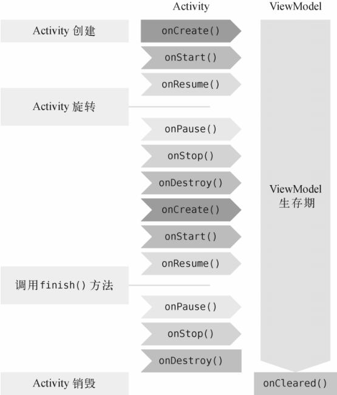
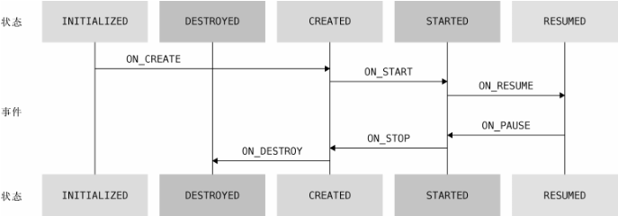

## Jetpack 简介

Jetpack 是一个开发组件工具集，它的主要目的是帮助我们编写出更加简洁的代码，并简化我们的开发过程。Jetpack 中的组件有一个特点，它们大部分不依赖于任何 Android 系统版本，这意味着这些组件通常是定义在 AndroidX 库当中的，并且拥有非常好的向下兼容性。

## ViewModel

`ViewModel` 应该可以算是 Jetpack 中最重要的组件之一了。`ViewModel` 的一个重要作用就是可以帮助 `Activity` 分担一部分工作，它是专门用于存放与界面相关的数据的。另外，`ViewModel` 还有一个非常重要的特性。`ViewModel` 的生命周期和 `Activity` 不同，它可以保证在手机屏幕发生旋转的时候不会被重新创建，只有当 `Activity` 退出的时候才会跟着`Activity` 一起销毁。

`ViewModel` 的生命周期如图所示：



### ViewModel 的基本用法

首先需要在 `app/build.gradle` 文件中添加如下依赖：

```groovy
dependencies {
    ...
    implementation "androidx.lifecycle:lifecycle-extensions:2.2.0"
}
```

为 `ViewModelActivity` 创建一个对应的 `MainViewModel` 类实现
一个计数器的功能，并让它继承自 `ViewModel`，如下所示：

```kotlin
class MainViewModel:ViewModel() { // 实现一个计数器功能
    var counter = 0 // 计数器
}
```

然后在界面上添加一个按钮，每点击一次按钮就让计数器加 1，并且把最新的计数显示在界面上，修改 `ViewModelActivity` 代码如下所示：

```kotlin
class ViewModelActivity : AppCompatActivity() {
    lateinit var viewModel: MainViewModel
    override fun onCreate(savedInstanceState: Bundle?) {
        super.onCreate(savedInstanceState)
        setContentView(R.layout.activity_main)
        // 绝对不可以直接去创建 ViewModel 的实例，要通过 ViewModelProvider 来获取 ViewModel 的实例
        viewModel = ViewModelProvider(this).get(MainViewModel::class.java)
        btn_plusOne.setOnClickListener {
            viewModel.counter++
            refreshCounter()
        }
        refreshCounter()
    }
    private fun refreshCounter() {
        tv_infoText.text = viewModel.counter.toString()
    }
}
```

如果直接在 `onCreate()` 方法中创建 `ViewModel` 的实例，那么每次 `onCreate()` `方法执行的时候，ViewModel` 都会创建一个新的实例，这样当手机屏幕发生旋转的时候，就无法保留其中的数据了，所以需要使用 ViewModelProvider 获取 `ViewModel` 的实例。

### 向 ViewModel 传递参数

修改 `MainViewModel` 代码，实现计数器数据的保存，代码如下所示：

```kotlin
class MainViewModel(countReserved:Int):ViewModel() { // 实现一个计数器功能
    var counter = countReserved // 计数器初始为保存的值
}
```

由于所有 `ViewModel` 的实例都是通过 `ViewModelProvider` 来获取的，因此需要新建一个 `MainViewModelFactory` 类，并实现 `ViewModelProvider.Factory` 接口，这样就可以向 `ViewModel` 传递参数了，代码如下所示：

```kotlin
class MainViewModelFactory(private val countReserved: Int):ViewModelProvider.Factory {
    // create 执行时机和 Activity 的生命周期无关
    override fun <T : ViewModel> create(modelClass: Class<T>): T {
        // 创建 ViewModel 的实例，并传递参数
        return MainViewModel(countReserved) as T
    }
}
```

修改 `ViewModelActivity` 中的代码，如下所示：

```kotlin
class ViewModelActivity : AppCompatActivity() {
    lateinit var viewModel: MainViewModel
    lateinit var sp:SharedPreferences

    override fun onCreate(savedInstanceState: Bundle?) {
        super.onCreate(savedInstanceState)
        setContentView(R.layout.activity_view_model)
        // 获取保存的计数器值
        sp = getPreferences(Context.MODE_PRIVATE)
        val countReserved = sp.getInt("count_reserved", 0)

        // 通过 MainViewModelFactory 的构造函数传递参数
        viewModel = ViewModelProvider(this, MainViewModelFactory(countReserved))[MainViewModel::class.java]
        btn_plusOne.setOnClickListener {
            viewModel.counter++
            refreshCounter()
        }
        btn_clear.setOnClickListener {
            viewModel.counter = 0
            refreshCounter()
        }
        refreshCounter()
    }
    override fun onPause() {
        super.onPause()
        // 保存计数器值
        sp.edit {
           putInt("count_reserved", viewModel.counter)
        }
    }
    private fun refreshCounter(){
        tv_infoText.text = viewModel.counter.toString()
    }
}
```

这样就实现了向 `ViewModel` 传递参数的功能。

## Lifecycles

`Lifecycles` 组件可以让任何一个类都能轻松感知到 `Activity` 的生命周期，同时又不需要在 `Activity` 中编写大量的逻辑处理。

新建一个 `MyObserver` 类，并让它实现 `LifecycleObserver` 接口，代码如下所示：

```kotlin
class MyObserver:LifecycleObserver {
    @OnLifecycleEvent(Lifecycle.Event.ON_START)
    fun activityStart() { // 对应 Activity 的 onStart() 方法
        Log.d("MyObserver", "activityStart")
    }
    @OnLifecycleEvent(Lifecycle.Event.ON_STOP)
    fun activityStop() { // 对应 Activity 的 onStop() 方法
        Log.d("MyObserver", "activityStop")
    }
}
```

`@OnLifecycleEvent` 注解参数中的生命周期事件的类型一共有 7 种：`ON_CREATE`、`ON_START`、`ON_RESUME`、`ON_PAUSE`、`ON_STOP` 和 `ON_DESTROY` 分别匹配 Activity 中相应的生命周期回调；另外还有一种 `ON_ANY` 类型，表示可以匹配 `Activity` 的任何生命周期回调。

新建一个 `LifecycleActivity` 类，实现对 `Activity` 的生命周期感知，代码如下所示：

```kotlin
class LifecycleActivity : AppCompatActivity() {
    override fun onCreate(savedInstanceState: Bundle?) {
        super.onCreate(savedInstanceState)
        setContentView(R.layout.activity_lifecycle)
        // 添加下面的代码就可以实现对 Activity 的生命周期感知
        lifecycle.addObserver(MyObserver())
    }
}
```

androidx 包下的 `AppCompatActivity` 和 `Fragment` 的子类本身就是一个 `LifecycleOwner` 的实例，所以可以直接使用 `getLifecycle()` 方法获取 `lifecycle` 。

`MyObserver` 虽然能够感知到 `Activity` 的生命周期发生了变化，却没有办法主动获知当前的生命周期状态，这时需要将 `lifecycle` 传递给 `MyObserver` 即可。

`lifecycle.currentState` 可以主动获知当前的生命周期状态。一共有 `INITIALIZED`、`DESTROYED`、`CREATED`、`STARTED`、`RESUMED` 这 5 种状态类型，如下图所示：



## LiveData

`LiveData` 是 Jetpack 提供的一种响应式编程组件，它可以包含任何类型的数据，并在数据发生变化的时候通知给观察者。`LiveData` 特别适合与 `ViewModel` 结合在一起使用。

### LiveData 的基本用法

之前的计数器在单线程模式下可以正常工作，但是多线程模式下可能会出现数据不一致的情况，这时就需要用到 `LiveData`，在数据发生变化的时候通知给观察者。

新建一个 `LiveViewModel` 类，如下所示：

```kotlin
class LiveViewModel(countReserved:Int): ViewModel() {
    // MutableLiveData 包含的是整型数据
    val counter = MutableLiveData<Int>()
    init {
        counter.value = countReserved
    }
    fun plusOne(){
        // 先获取当前的计数器值，再加 1
        val count = counter.value ?: 0
        counter.value = count + 1
    }
    fun clear(){
        // 将计数器值设置为 0
        counter.value = 0
    }
}
```

`MutableLiveData` 是一种可变的 `LiveData`，它的用法很简单，主要有 3 种读写数据的方法，分别是 `getValue()`、`setValue()`和 `postValue()`方法。

- `getValue()`方法用于获取 `LiveData` 中包含的数据；
- `setValue()`方法用于给 `LiveData` 设置数据，但是只能在主线程中调用；
- `postValue()`方法用于在非主线程中给 `LiveData` 设置数据。

接下来修改 `LiveDataActivity` ，如下所示

```kotlin
class LiveDataActivity : AppCompatActivity() {
    lateinit var viewModel: MainViewModel
    lateinit var sp:SharedPreferences

    override fun onCreate(savedInstanceState: Bundle?) {
        super.onCreate(savedInstanceState)
        setContentView(R.layout.activity_view_model)
        // 获取保存的计数器值
        sp = getPreferences(Context.MODE_PRIVATE)
        val countReserved = sp.getInt("count_reserved", 0)

        // 通过 MainViewModelFactory 的构造函数传递参数
        viewModel = ViewModelProvider(this, MainViewModelFactory(countReserved))[MainViewModel::class.java]
        btn_plusOne.setOnClickListener {
            viewModel.plusOne()
        }
        btn_clear.setOnClickListener {
            viewModel.clear()
        }
        viewModel.counter.observe(this, Observer {
            tv_infoText.text = it.toString()
        })
    }
    override fun onPause() {
        super.onPause()
        // 保存计数器值
        sp.edit {
           putInt("count_reserved", viewModel.counter.value?:0)
        }
    }
}
```

这里调用了 `viewModel.counter` 的 `observe()` 方法来观察数据的变化。当 `counter` 中包含的数据发生变化时，就会回调到 `Observer` 这里，因此我们在这里将最新的计数更新到界面上即可。

`observe()` 接收两个参数，第一个参数是一个 `LifecycleOwner` 对象；第二个参数是一个 `Observer` 接口。

需要注意的是，在子线程中给 `LiveData` 设置数据的时候，需要使用 `postValue()` 方法。

以上就是 `LiveData` 的基本用法，但是不是最正规的用法，应该永远只暴露不可变的 `LiveData` 给外部，防止外部修改数据。修改 `LiveViewModel` 的代码，如下所示：

```kotlin
class LiveViewModel(countReserved:Int): ViewModel() {
    // 只暴露不可变的 LiveData 给外部
    val counter: LiveData<Int>
        get() = _counter
    private val _counter = MutableLiveData<Int>()
    init {
        _counter.value = countReserved
    }
    fun plusOne(){
        val count = _counter.value ?: 0
        _counter.value = count + 1
    }
    fun clear(){
        _counter.value = 0
    }
}
```

这样就可以在外部通过 `counter` 来获取 `LiveData` 中的数据但是无法设置 `counter` 的值了。

## map 和 switchMap

`LiveData` 为了能够应对各种不同的需求场景，提供了两种转换方法：`map()` 和 `switchMap()` 方法。

`map()` 方法的作用是将实际包含数据的 `LiveData` 和仅用于观察数据的 `LiveData` 进行转换。

例如有一个 `User` 类，如下所示：

```kotlin
data class User(var firstName: String, var lastName: String, var userId: Int)
```

修改 `LiveViewModel` 类，如下所示：

```kotlin
class LiveViewModel(countReserved:Int): ViewModel() {
    ...
    private val userLiveData = MutableLiveData<User>()
    // 将实际包含数据的 LiveData 和仅用于观察数据的 LiveData 进行转换
    val uerName: LiveData<String> = Transformations.map(userLiveData){
        // 具体的转换逻辑
        "${it.firstName} ${it.lastName}"
    }
}
```

`Transformations` 的 `map()` 方法可以对 `LiveData` 的数据类型进行转换，第一个参数是原始的 `LiveData` 对象；第二个参数是一个转换函数，我们在转换函数里编写具体的转换逻辑即可。

当 `userLiveData` 的数据发生变化时，`map()` 方法会监听到变化并执行转换函数中的逻辑，然后再将转换之后的数据通知给 `userName` 的观察者。

`switchMap()` 方法的使用场景非常固定：如果 `ViewModel` 中的某个 `LiveData` 对象是调用另外的方法获取的，那么我们就可以借助 `switchMap()` 方法，将这个 `LiveData` 对象转换成另外一个可观察的 `LiveData` 对象。

新建一个 `Repository` 单例类，代码如下所示：

```kotlin
object Repository {
    // 每次调用 getUser() 方法都会返回一个新的 LiveData 实例。
    fun getUser(userId:Int):LiveData<User>{
        val liveData = MutableLiveData<User>()
        liveData.value = User(userId, userId, 0)
        return liveData
    }
}
```

`getUser()` 方法返回的是一个包含 `User` 数据的 `LiveData` 对象，每次调用都返回一个新的 `LiveData` 实例。

然后我们在 `MainViewModel` 中也定义一个 `getUser()` 方法，并且借助 `switchMap()` 方法将这个 `Repository` 的 `getUser()` 方法来获取 `LiveData` 对象转换成另外一个可观察的 `LiveData` 对象，如下所示：

```kotlin
class LiveViewModel(countReserved:Int): ViewModel() {
    ...
    private val userIdLiveData = MutableLiveData<String>()
    // 如果 ViewModel 中的某个 LiveData 对象是调用另外的方法获取的
    val user: LiveData<User> = Transformations.switchMap(userIdLiveData) { userId ->
        Repository.getUser(userId)
    }
    fun getUser(userId: String) {
        userIdLiveData.value = userId
    }
}
```

当外部调用 `LiveViewModel` 的 `getUser()` 方法来获取用户数据时，并不会发起任何请求或者函数调用，只会将传入的 `userId` 值设置到 `userIdLiveData` 当中。一旦 `userIdLiveData` 的数据发生变化，那么观察 `userIdLiveData` 的 `switchMap()` 方法就会执行，并且调用我们编写的转换函数。然后在转换函数中调用 `Repository.getUser()` 方法获取真正的用户数据。同时，`switchMap()` 方法会将 `Repository.getUser()` 方法返回的 `LiveData` 对象转换成一个可观察的 `LiveData` 对象，对于 `Activity` 而言，只要去观察这个 `LiveData` 对象就可以了。

修改 `LiveDataActivity` ，如下所示

```kotlin
class LiveDataActivity : AppCompatActivity() {
    lateinit var viewModel: LiveViewModel
    lateinit var sp:SharedPreferences

    override fun onCreate(savedInstanceState: Bundle?) {
        super.onCreate(savedInstanceState)
        setContentView(R.layout.activity_live_data)
        sp = getPreferences(Context.MODE_PRIVATE)
        val countReserved = sp.getInt("count_reserved", 0)
        // 通过ViewModelProvider来获取ViewModel的实例，通过MainViewModelFactory的构造函数传递参数
        viewModel = ViewModelProvider(this, LiveViewModelFactory(countReserved))[LiveViewModel::class.java]

        btn_getUser.setOnClickListener {
            val userId = (0..1000).random()
            // 调用 getUser() 将 `userId` 值设置到 `userIdLiveData` 当中
            viewModel.getUser(userId)
        }
        // switchMap() 方法会将 Repository.getUser() 方法返回的 LiveData 对象转换成一个可观察的LiveData 对象 user ，
        // 只要去观察这个 LiveData 对象就可以了。
        viewModel.user.observe(this, Observer{ user ->
            tv_live_infoText.text = user.lastName + user.firstName
        })
    }

    override fun onPause() {
        super.onPause()
        sp.edit(){
            putInt("count_reserved", viewModel.counter.value?:0)
        }
    }
}
```

当 `ViewModel` 中某个获取数据的方法有可能是没有参数时，需要创建一个空的 `LiveData` 对象 `refreshLiveData` ，示例写法如下：

```kotlin
class MyViewModel : ViewModel() {
    private val refreshLiveData = MutableLiveData<Any?>()

    val refreshResult = Transformations.switchMap(refreshLiveData) {
        Repository.refresh() // 假设 Repository 中已经定义了 refresh() 方法
    }

    fun refresh() {
        // refreshLiveData 原有的数据取出来，默认是空
        refreshLiveData.value = refreshLiveData.value
    }
}
```

`LiveData` 内部不会判断即将设置的数据和原有数据是否相同，只要调用了 `setValue()` 或 `postValue()` 方法，就一定会触发数据变化事件。所以将 `refreshLiveData` 的数据设置为自身就可以触发一次数据变化，从而实现刷新数据的效果。

`LiveData` 之所以能够成为 `Activity` 与 `ViewModel` 之间通信的桥梁，并且还不会有内存泄漏的风险，靠的就是 `Lifecycles` 组件。`LiveData` 在内部使用了 `Lifecycles` 组件来自我感知生命周期的变化，从而可以在 `Activity` 销毁的时候及时释放引用，避免产生内存泄漏的问题。

需要注意的是如果在 `Activity` 处于不可见状态的时候，`LiveData` 发生了多次数据变化，当 `Activity` 恢复可见状态时，只有最新的那份数据才会通知给观察者。

## ViewBinding

使用 Kotlin 的扩展插件来获取视图控件存在下列弊端：

- 使用局限性：无法跨模块操作，如业务模块无法使用基础模块中的公共布局。
- 类型不安全：不同的资源文件可以存在相同的控件 id，因此在 View 层存在引用 id 来源出错的问题。

所以 google 推出了 `ViewBinding`，`ViewBinding` 是一种类型安全的方式来访问视图控件，它会为每个 XML 布局文件生成一个绑定类，绑定类中包含对应布局中的所有视图控件的引用。

### ViewBinding 的基本使用

使用 ViewBinding 时，首先要在模块的 build.gradle 中添加如下配置：

```groovy
android {
    ...
    viewBinding {
        enabled = true
    }
    ...
}
```

配置完成后，系统会为该模块中的每个 XML 布局文件生成一个绑定类，这个绑定类的名称是根据对应的 XML 文件名来生成的，例如 activity_main.xml 文件会生成一个 ActivityMainBinding 类，其中包含了 activity_main.xml 布局文件中所有视图控件的引用。

例如在 Activity 和 Fragment 中使用 ViewBinding，代码如下：

```kotlin
class MainActivity : AppCompatActivity() {
    lateinit var activityMainBinding: ActivityMainBinding
    override fun onCreate(savedInstanceState: Bundle?) {
        super.onCreate(savedInstanceState)
        activityMainBinding = ActivityMainBinding.inflate(layoutInflater)
        setContentView(activityMainBinding.root)
        activityMainBinding.edContent.setText("")
        activityMainBinding.tvContent.text = ""
        activityMainBinding.btnConfirm.setOnClickListener {
        }
    }
}

class MainFragment : Fragment() {
    private var fragmentMainBinding: FragmentMainBinding? = null
    override fun onCreateView(
        inflater: LayoutInflater, container: ViewGroup?,
        savedInstanceState: Bundle?
    ): View? {
        fragmentMainBinding = FragmentMainBinding.inflate(inflater, container, false)
        return fragmentMainBinding?.root
    }
    override fun onDestroyView() {
        super.onDestroyView()
        fragmentMainBinding = null
    }
}
```

需要注意的是，Fragment 的存在时间比其视图时间长，所以开发者需要在 onDestroyView()方法中清除对绑定类实例的所有引用，否则可能存在内存泄漏的风险。

如果某个布局文件不需要的话，可以通过 tools:viewBinding-Ignore=“true”属性来设置。

### ViewBinding 的封装优化

ViewBinding 组件的使用流程基本是固定的，主要分为三步：

1. 调用生成的绑定类中的 inflate()方法来获取绑定类的实例。
2. 通过调用绑定类的 getRoot()方法获取对根视图。
3. 将根视图传递到 setContentView()中，并与当前 Activity 绑定。

就可以将这部分逻辑封装在 BaseActivity 中，并将其编写为一个 BaseActivity 类。具体代码如下：

```kotlin
// 声明了一个泛型T且父类是ViewBinding
abstract class BaseActivity<T : ViewBinding> : AppCompatActivity() {
    lateinit var mViewBinding: T
    override fun onCreate(savedInstanceState: Bundle?, persistentState: PersistableBundle?) {
        super.onCreate(savedInstanceState, persistentState)
        mViewBinding = getViewBinding()
        setContentView(mViewBinding.root)
    }
    // 提供一个抽象方法，用于获取ViewBinding的实例，由子类实现
    abstract fun getViewBinding(): T
}
```

然后让 MainActivity 继承自 BaseActivity 即可，代码实现如下：

```kotlin
class MainActivity : BaseActivity<ActivityMainBinding>() {
    override fun onCreate(savedInstanceState: Bundle?) {
        super.onCreate(savedInstanceState)
        mViewBinding.edContent.setText("")
        mViewBinding.tvContent.text = ""
        mViewBinding.btnConfirm.setOnClickListener {
            //点击事件
        }
    }
    // 只需要重写该方法，返回ActivityMainBinding实例即可
    override fun getViewBinding(): ActivityMainBinding {
        return ActivityMainBinding.inflate(layoutInflater)
    }
}
```

这样就实现了对 ViewBinding 的封装优化。

## DataBinding

DataBinding 是一种支持双向绑定的库，它可以将布局文件中的 UI 控件和数据源绑定在一起，当数据源发生变化时，UI 控件会自动更新，反之亦然。

使用 DataBinding 时，首先要在模块的 build.gradle 中添加如下配置：

```groovy
android {
    ...
    dataBinding {
        enabled = true
    }
    ...
}
```

### 基础布局绑定表达式

假设现在要实现将用户输入的用户名和用户 id 等信息显示在布局中的需求，新建一个 User 类：

```kotlin
data class User(var userName: String?, var userId: String?)
```

然后在 xml 布局中，增加两个输入框、两个文本框和一个确定按钮，代码如下：

```xml
<layout>
    <data>
        <variable
            name="user"
            type="org.ckcat.jetpack.User" />
    </data>
    <LinearLayout xmlns:android="http://schemas.android.com/apk/res/android"
        xmlns:tools="http://schemas.android.com/tools"
        android:layout_width="match_parent"
        android:layout_height="match_parent"
        android:orientation="vertical"
        tools:context=".MainActivity">
        <EditText
            android:id="@+id/ed_user_name"
            android:layout_width="match_parent"
            android:layout_height="wrap_content" />
        <EditText
            android:id="@+id/ed_user_id"
            android:layout_width="match_parent"
            android:layout_height="wrap_content" />
        <TextView
            android:id="@+id/tv_user_name"
            android:layout_width="match_parent"
            android:layout_height="wrap_content"
            android:text="@{user.userName}"/>
        <TextView
            android:id="@+id/tv_user_id"
            android:layout_width="match_parent"
            android:layout_height="wrap_content"
            android:text="@{user.userId}"/>
        <Button
            android:id="@+id/btn_confirm"
            android:layout_width="match_parent"
            android:layout_height="wrap_content"
            android:text="确定" />
    </LinearLayout>
</layout>
```

DataBinding 的布局文件必须使用 layout 根标记，并且通过 data 标签设置对应的数据实体类，name 属性声明了在布局文件中可以使用的对象名称，type 是对应的实体类，这样就可以在 xml 中通过 `@{}` 表达式为文本组件赋值了。

对应的 MainActivity 代码如下：

```kotlin
class MainActivity : AppCompatActivity() {
    lateinit var activityMainBinding: ActivityMainBinding;
    override fun onCreate(savedInstanceState: Bundle?) {
        super.onCreate(savedInstanceState)
        // ActivityMainBinding 继承自ViewDataBinding
        activityMainBinding = ActivityMainBinding.inflate(layoutInflater)
        setContentView(activityMainBinding.root)
        activityMainBinding.btnConfirm.setOnClickListener{
            val user = getUser()
            // 数据就会自动填充到xml布局中
            activityMainBinding.user = user
        }
    }
    private fun getUser() = User(getUserName(), getUserId())

    private fun getUserName() = activityMainBinding.edUserName.text?.toString()

    private fun getUserId() = activityMainBinding?.edUserId?.text?.toString()
}
```

这里仍然同 ViewBinding 组件一样，可以通过 LayoutInflater 获取视图，在点击按钮时将生成的对象绑定到生成的绑定类上。

视图中也可以引入表达式，如下所示：

```xml
<data>
    <import type="android.view.View" />
</data>
    <LinearLayout
    ...>
    <TextView
        android:id="@+id/tv_user_id"
        android:layout_width="match_parent"
        android:layout_height="wrap_content"
        android:text="@{user.userId}"
        android:visibility='@{user.userId.equals("001")? View.GONE :
View.VISIBLE}'
</LinearLayout>
```

这里通过 `@{}` 表达式引入了一个视图控件的可见性表达式，当 userId 为 001 时，该控件不可见，否则可见。

DataBinding 不仅可以在 Activity 中使用，还可以在 Fragment、RecycleView 适配器中使用。

### 利用 DataBinding 绑定点击事件

常规的方式只需要在 xml 中声明 onClick 的属性，只要在 Activity 中编写同名的方法即可。DataBinding 的实现方式与上面的方法类似，称为方法引用。首先新建一个 Click-Handlers 类，添加 confirm 方法，代码如下：

```kotlin
class ClickHandlers {
    var TAG = "ClickHandlers"
    fun confirm(view: View) {
        Log.d(TAG, "触发点击事件了")
    }
}
```

然后，在视图中引入 ClickHandlers 类，并为 Button 添加一个 onClick 的属性，代码如下：

```xml

<layout>
    <data>
        ...
        <variable
            name="clickHandlers"
            type="org.ckcat.jetpack.ClickHandlers" />
    </data>
    <LinearLayout...>
        <Button
            android:id="@+id/btn_confirm"
            android:layout_width="match_parent"
            android:layout_height="wrap_content"
            android:onClick="@{clickHandlers::confirm}"
            android:text="确定" />
    </LinearLayout>
</layout>
```

最后，在 Activity 中绑定监听器类，代码如下：

```kotlin
activityMainBinding.clickHandlers = ClickHandlers()
```

方法引用的表达式是在编译时处理的，可以使用监听器绑定的方式，监听器绑定要在事件发生时才执行表达式，使用方式如下：

```xml
<Button
    android:id="@+id/btn_confirm"
    android:layout_width="match_parent"
    android:layout_height="wrap_content"
    android:onClick="@{(view)->clickHandlers.confirm(view,user)}"
    android:text="确定" />
```

在实际开发中，为了优化布局经常会使用 include、merge 标签将部分布局抽取出来，这种布局称为标签布局。绑定标签布局的方式与绑定普通布局的方式相同，只需要与普通布局使用一样的布局变量即可。将前面的布局拆分为 user_data.xml 和 activity_main.xml 两个布局文件，代码如下：

```xml
<layout xmlns:android="http://schemas.android.com/apk/res/android">
    <data>
        <variable
            name="user"
            type="com.example.jetpackdemo.bean.User" />
    </data>
    <LinearLayout
        android:orientation="vertical"
        android:layout_width="match_parent"
        android:layout_height="wrap_content">
    <TextView
        android:id="@+id/tv_user_name"
        android:layout_width="match_parent"
        android:layout_height="wrap_content"
        android:text="@{user.userName}" />
    <TextView
        android:id="@+id/tv_user_id"
        android:layout_width="match_parent"
        android:layout_height="wrap_content"
        android:text="@{user.userId}" />
    </LinearLayout>
</layout>
```

在 activity_main.xml 布局中通过 include 标签引入即可。具体代码如下：

```xml
<include
    layout="@layout/user_data"
    bind:user="@{user}" />
```

### 自定义BindingAdapter


## Room

`Room` 是 Android 官方推出的一个 `ORM` 框架。

`ORM`（Object Relational Mapping）也叫对象关系映射。简单来讲，我们使用的编程语言是面向对象语言，而使用的数据库则是关系型数据库，将面向对象的语言和面向关系的数据库之间建立一种映射关系，这就是 `ORM` 了。

### 使用 Room 进行增删改查

`Room` 的整体结构主要由 `Entity`、`Dao` 和 `Database` 这 3 部分组成，每个部分都有明确的职责，详细说明如下。

- `Entity` 用于定义封装实际数据的实体类，每个实体类都会在数据库中有一张对应的表，并且表中的列是根据实体类中的字段自动生成的。
- `Dao` 是数据访问对象的意思，通常会在这里对数据库的各项操作进行封装，在实际编程的时候，逻辑层就不需要和底层数据库打交道了，直接和 `Dao` 层进行交互即可。
- `Database` 用于定义数据库中的关键信息，包括数据库的版本号、包含哪些实体类以及提供 `Dao` 层的访问实例。

首先要使用 `Room`，需要在 `app/build.gradle` 文件中添加如下的依赖：

```groovy
apply plugin: 'com.android.application'
apply plugin: 'kotlin-android'
apply plugin: 'kotlin-android-extensions'
apply plugin: 'kotlin-kapt'

dependencies {
    ...
    implementation "androidx.room:room-runtime:2.1.0"
    kapt "androidx.room:room-compiler:2.1.0"
}
```

`kotlin-kapt` 插件启用编译时注解功能。

首先是定义 `Entity`，也就是实体类，新建一个 Person 数据类，如下所示：

```kotlin
// 使用 @Entity 注解，将 Person 声明成了一个实体类
@Entity
data class Person(var firstName:String, var lastName:String, var age:Int) {
    // 使用 @PrimaryKey 注解将它设为了主键，再把 autoGenerate 参数指定成 true，使得主键的值是自动生成的。
    @PrimaryKey(autoGenerate = true)
    var id:Long = 0
}
```

在 `Person` 的类名上使用 `@Entity` 注解，将它声明成了一个实体类，然后在 `Person` 类中添加了一个 `id` 字段，并使用 `@PrimaryKey` 注解将它设为了主键，再把 `autoGenerate` 参数指定成 `true`，使得主键的值是自动生成的。

接下来开始定义 `Dao`，这部分也是 `Room` 用法中最关键的地方，因为所有访问数据库的操作都是在这里封装的。新建一个 `PersonDao` 接口，如下所示：

```kotlin
@Dao // 将 PersonDao 声明为一个 DAO
interface PersonDao {
    @Insert // 表示会将参数中传入的 Person 对象插入数据库中，并返回主键。
    fun insert(p: Person): Long

    @Update // 表示会将参数中传入的 Person 对象更新到数据库当中。
    fun update(p: Person)

    @Query("select * from Person") // 使用 SQL 语句查询所有用户
    fun loadAll(): List<Person>

    @Query("select * from Person where age > :age")  // 使用 SQL 语句查询年龄大于 age 的用户
    fun loadOlderThan(age: Int): List<Person>

    @Delete // 表示会将参数传入的 Person 对象从数据库中删除。
    fun delete(p: Person)

    @Query("delete from Person where lastName = :lastName") // 使用 SQL 语句删除用户
    fun deleteByLastName(lastName: String): Int
}
```

`PersonDao` 接口的上面使用了一个 `@Dao` 注解，这样 `Room` 才能将它识别成一个 `Dao`。`PersonDao` 的内部就是根据业务需求对各种数据库操作进行的封装。数据库操作通常有增删改查这 4 种，因此 `Room` 也提供了 `@Insert`、`@Delete`、`@Update` 和 `@Query` 这 4 种相应的注解。

> 使用非实体类参数来增删改数据，只能使用 `@Query` 注解编写 SQL 语句才行。

接下来我们进入最后一个环节：定义 `Database` ，新建一个 `AppDataBase` 类，继承自 `RoomDatabase` ，如下所示

```kotlin
// 声明数据库的版本号以及包含哪些实体类，
@Database(version = 1, entities = [Person::class])
abstract class AppDataBase:RoomDatabase() {
    // 提供 PersonDao 的抽象方法，用于获取 Dao 实例
    abstract fun personDao():PersonDao

    companion object{ // 单例模式
        private var instance:AppDataBase? = null
        @Synchronized
        fun getDataBbbase(context: Context):AppDataBase{
            instance?.let {
                return it
            }
            // 构建 AppDataBase 对象
            return Room.databaseBuilder(context.applicationContext,
                AppDataBase::class.java, "app_database")
                .build().apply {
                    instance = this
                }
        }
    }
}
```

`AppDatabase` 类必须继承自 `RoomDatabase` 类，并且一定要使用 `abstract` 关键字将它声明成抽象类，然后提供相应的抽象方法，用于获取之前编写的 `Dao` 的实例，只需要进行方法声明就可以了，具体的方法实现是由 `Room` 在底层自动完成的。

`databaseBuilder()` 方法接收 3 个参数，注意第一个参数一定要使用 `applicationContext`；第二个参数是 `AppDatabase` 的 `Class` 类型；第三个参数是数据库名。

然后修改 `RoomActivity` 中的代码，实现增删改查的逻辑，如下所示：

```kotlin
class RoomActivity : AppCompatActivity() {
    private val TAG = "RoomActivity"
    override fun onCreate(savedInstanceState: Bundle?) {
        super.onCreate(savedInstanceState)
        setContentView(R.layout.activity_room)

        val personDao = AppDataBase.getDataBbbase(this).personDao()
        val faker = Faker()
        val p1 = Person(faker.name().firstName(), faker.name().lastName(), 40)
        faker.random()
        val p2 = Person(faker.name().firstName(), faker.name().lastName(), 63)

        btn_addData.setOnClickListener {
            thread {
                p1.id  = personDao.insert(p1)
                p2.id  = personDao.insert(p2)
            }
        }
        btn_queryData.setOnClickListener {
            thread{
                for (p in personDao.loadAll())
                    Log.d(TAG, "onCreate: ${p.toString()}")
            }
        }
    }
}
```

由于数据库操作属于耗时操作，`Room` 默认是不允许在主线程中进行数据库操作的，因此上述代码中我们将增删改查的功能都放到了子线程中。

### Room 的数据库升级

`Room` 在数据库升级方面设计得非常烦琐，基本上没有比使用原生的 `SQLiteDatabase` 简单到哪儿去，每一次升级都需要手动编写升级逻辑才行。

修改 `AppDatabase` 中的代码，在里面编写数据库升级的逻辑，如下所示：

```kotlin
// 升级版本号，添加Book类
@Database(version = 2, entities = [Person::class, Book::class])
abstract class AppDataBase:RoomDatabase() {
    abstract fun personDao():PersonDao
    abstract fun bookDao():BookDao

    companion object{
        // 实现了一个Migration的匿名类
        val MIGRATION_1_2 = object : Migration(1, 2){
            override fun migrate(database: SupportSQLiteDatabase) {
                // 编写相应的建表语句
                database.execSQL("create table Book (id integer primary " +
                        "key autoincrement not null, name text not null, " +
                        "pages integer not null)")
            }
        }
        private var instance:AppDataBase? = null
        @Synchronized
        fun getDataBbbase(context: Context):AppDataBase{
            instance?.let {
                return it
            }
            return Room.databaseBuilder(context.applicationContext,
                AppDataBase::class.java, "app_database")
                .addMigrations(MIGRATION_1_2)   // 根据当前数据库的版本号执行这些升级逻辑
                .build().apply {
                    instance = this
                }
        }
    }
}
```

`addMigrations()` 方法可以接收多个 `Migration` 实例，当我们进行任何数据库操作时，`Room` 就会自动根据当前数据库的版本号执行这些升级逻辑，从而让数据库始终保证是最新的版本。

再次对数据库进行升级，添加一个 `author` 字段，如下所示：

```kotlin
@Database(version = 3, entities = [User::class, Book::class])
abstract class AppDatabase : RoomDatabase() {
    ...
    companion object {
        ...
        val MIGRATION_2_3 = object : Migration(2, 3) {
            // 添加一个作者字段
            override fun migrate(database: SupportSQLiteDatabase) {
                database.execSQL("alter table Book add column author text not null
                default 'unknown'")
            }
        }
        private var instance: AppDatabase? = null
        fun getDatabase(context: Context): AppDatabase {
            ...
            return Room.databaseBuilder(context.applicationContext,
                AppDatabase::class.java, "app_database")
                .addMigrations(MIGRATION_1_2, MIGRATION_2_3) // 添加两个Migration实例
                .build().apply {
                instance = this
            }
        }
    }
}
```

升级步骤和之前是差不多的，这里先将版本号升级成了 3，然后编写一个 `MIGRATION_2_3` 的升级逻辑并添加到 `addMigrations()` 方法中即可。

## WorkManager

`WorkManager` 很适合用于处理一些要求定时执行的任务，它可以根据操作系统的版本自动选择底层是使用 `AlarmManager` 实现还是 `JobScheduler` 实现，从而降低了我们的使用成本。另外，它还支持周期性任务、链式任务处理等功能，是一个非常强大的工具。

### WorkManager 的基本用法

要想使用 `WorkManager`，需要先在 `app/build.gradle` 文件中添加如下的依赖：

```kotlin
dependencies {
    ...
    implementation "androidx.work:work-runtime:2.2.0"
}
```

`WorkManager` 的基本用法其实非常简单，主要分为以下 3 步：

1. 定义一个后台任务，并实现具体的任务逻辑；
2. 配置该后台任务的运行条件和约束信息，并构建后台任务请求；
3. 将该后台任务请求传入 `WorkManager` 的 `enqueue()` 方法中，系统会在合适的时间运行。

第一步要定义一个后台任务，这里创建一个 `SimpleWorker` 类，代码如下所示：

```kotlin
class SimpleWorker(context: Context, params:WorkerParameters): Worker(context, params) {

    override fun doWork(): Result {
        // 编写具体的后台任务逻辑
        Log.d("SimpleWorker", "do work in SimpleWorker")
        return Result.success()
    }
}
```

然后配置该后台任务的运行条件和约束信息，并构建后台任务请求，将该后台任务请求传入 `WorkManager` 的 `enqueue()` 方法中，系统会在合适的时间运行。

```kotlin
    btn_doWork.setOnClickListener {
        // 配置该后台任务的运行条件和约束信息，并构建后台任务请求
        val request = OneTimeWorkRequest.Builder(SimpleWorker::class.java).build()
        // 将该后台任务请求传入 WorkManager 的 enqueue()方法中，系统会在合适的时间运行。
        WorkManager.getInstance(this).enqueue(request)
    }
```

### 使用 WorkManager 处理复杂的任务

让后台任务在指定的延迟时间后运行，只需要借助 `setInitialDelay()` 方法就可以了，代码如下所示：

```kotlin
val request = OneTimeWorkRequest.Builder(SimpleWorker::class.java)
            .setInitialDelay(5, TimeUnit.MINUTES)
            .build()
```

给后台任务请求添加标签：

```kotlin
val request = OneTimeWorkRequest.Builder(SimpleWorker::class.java)
    ...
    .addTag("simple")
    .build()
```

通过标签来取消后台任务请求：

```kotlin
WorkManager.getInstance(this).cancelAllWorkByTag("simple")
```

通过 `id` 来取消后台任务请求：

```kotlin
WorkManager.getInstance(this).cancelWorkById(request.id)
```

一次性取消所有后台任务请求：

```kotlin
WorkManager.getInstance(this).cancelAllWork()
```

如果后台任务的 `doWork()` 方法中返回了 `Result.retry()`，那么是可以结合 `setBackoffCriteria()` 方法来重新执行任务的，具体代码如下所示：

```kotlin
val request = OneTimeWorkRequest.Builder(SimpleWorker::class.java)
    ...
    .setBackoffCriteria(BackoffPolicy.LINEAR, 10, TimeUnit.SECONDS)
    .build()
```

对后台任务的运行结果进行监听：

```kotlin
WorkManager.getInstance(this)
    .getWorkInfoByIdLiveData(request.id)
    .observe(this) { workInfo ->
        if (workInfo.state == WorkInfo.State.SUCCEEDED) {
            Log.d("MainActivity", "do work succeeded")
        } else if (workInfo.state == WorkInfo.State.FAILED) {
            Log.d("MainActivity", "do work failed")
        }
    }
```

链式任务:

```kotlin
val sync = ...
val compress = ...
val upload = ...
WorkManager.getInstance(this)
    .beginWith(sync)
    .then(compress)
    .then(upload)
    .enqueue()
```

`beginWith()` 方法用于开启一个链式任务，至于后面要接上什么样的后台任务，只需要使用 `then()` 方法来连接即可。另外 `WorkManager` 还要求，必须在前一个后台任务运行成功之后，下一个后台任务才会运行。也就是说，如果某个后台任务运行失败，或者被取消了，那么接下来的后台任务就都得不到运行了。

## 全局获取 Context 的技巧

创建一个 `MyApplication` 类继承自 `Application`，代码如下所示：

```kotlin
class MyApplication:Application() {
    companion object{
        @SuppressLint("StaticFieldLeak")
        lateinit var context:Context
    }

    override fun onCreate() {
        super.onCreate()
        context = applicationContext
    }
}
```

在 `AndroidManifest.xml` 文件的 `<application>` 标签下进行指定 `android:name=".MyApplication"` 属性就可以在程序启动的时候初始化 `MyApplication` 类，代码如下所示：

```xml
<?xml version="1.0" encoding="utf-8"?>
<manifest xmlns:android="http://schemas.android.com/apk/res/android"
    xmlns:tools="http://schemas.android.com/tools">

    <application
        android:name=".MyApplication"
        android:allowBackup="true"
        android:dataExtractionRules="@xml/data_extraction_rules"
        android:fullBackupContent="@xml/backup_rules"
        android:icon="@mipmap/ic_launcher"
        android:label="@string/app_name"
        android:roundIcon="@mipmap/ic_launcher_round"
        android:supportsRtl="true"
        android:theme="@style/Theme.Jetpack"
        tools:targetApi="31">
        ....
    </application>

</manifest>
```

这样我们就实现了一种全局获取 `Context` 的机制，之后不管你想在项目的任何地方使用 `Context`，只需要调用一下 `MyApplication.context` 就可以了。

## 使用 Intent 传递对象

使用 `Intent` 来传递对象通常有两种实现方式：`Serializable` 和 `Parcelable`。

### Serializable 方式

`Serializable` 是序列化的意思，表示将一个对象转换成可存储或可传输的状态。序列化后的对象可以在网络上进行传输，也可以存储到本地。至于序列化的方法非常简单，只需要让一个类去实现 `Serializable` 这个接口就可以了。

定义一个可序列化的类：

```kotlin
class Person : Serializable {
    var name = ""
    var age = 0
}
```

使用 `Intent` 的 `putExtra()`方法传递对象。

```kotlin
val person = Person()
person.name = "Tom"
person.age = 20
val intent = Intent(this, SecondActivity::class.java)
intent.putExtra("person_data", person)
startActivity(intent)
```

最后使用 `Intent` 的 `getSerializableExtra()` 方法来获取通过参数传递过来的序列化对象，接着再将它向下转型成 `Person` 对象，这样我们就成功实现了使用 `Intent` 传递对象的功能。

```kotlin
val person = intent.getSerializableExtra("person_data") as Person
```

需要注意的是，这种传递对象的工作原理是先将一个对象序列化成可存储或可传输的状态，传递给另外一个 `Activity` 后再将其反序列化成一个新的对象。虽然这两个对象中存储的数据完全一致，但是它们实际上是不同的对象，这一点希望你能了解清楚。

### Parcelable 方式

除了 `Serializable` 之外，使用 `Parcelable` 也可以实现相同的效果，不过不同于将对象进行序列化，`Parcelable` 方式的实现原理是将一个完整的对象进行分解，而分解后的每一部分都是 `Intent` 所支持的数据类型，这样就能实现传递对象的功能了。

首先实现 `Parcelable` 接口，重写 `describeContents()` 和 `writeToParcel()` 这两个方法；除此之外，我们还必须在 `Person` 类中提供一个名为 `CREATOR` 的匿名类实现，重写 `createFromParcel()` 和 `newArray()` 这两个方法。

```kotlin
class Person : Parcelable {
    var name = ""
    var age = 0
    override fun writeToParcel(parcel: Parcel, flags: Int) {
        parcel.writeString(name) // 写出name
        parcel.writeInt(age) // 写出age
    }
    override fun describeContents(): Int {
        return 0
    }
    companion object CREATOR : Parcelable.Creator<Person> {
        override fun createFromParcel(parcel: Parcel): Person {
            // 创建一个Person对象进行返回，并读取刚才写出的name和age字段
            val person = Person()
            person.name = parcel.readString() ?: "" // 读取name
            person.age = parcel.readInt() // 读取age
            return person
        }
        override fun newArray(size: Int): Array<Person?> {
            // 调用arrayOfNulls()方法，并使用参数中传入的size作为数组大小，创建一个空的Person数组即可。
            return arrayOfNulls(size)
        }
    }
}
```

使用 `Intent` 的 `putExtra()` 方法传递对象不需要修改，获取传递过来的对象需要调用 `getParcelableExtra()` 方法。

```kotlin
val person = intent.getParcelableExtra("person_data") as Person
```

Kotlin 给我们提供了另外一种更加简便的用法，但前提是要传递的所有数据都必须封装在对象的主构造函数中才行。

```kotlin
@Parcelize
class Person(var name: String, var age: Int) : Parcelable
```

将 `name` 和 `age` 这两个字段移动到主构造函数中，然后给 `Person` 类添加一个 `@Parcelize` 注解即可。

## 定制自己的日志工具

新建一个 `LogUtil` 单例类，代码如下所示：

```kotlin
object LogUtil {
    private const val VERBOSE = 1
    private const val DEBUG = 2
    private const val INFO = 3
    private const val WARN = 4
    private const val ERROR = 5
    private var level = VERBOSE
    fun v(tag: String, msg: String) {
        if (level <= VERBOSE) {
            Log.v(tag, msg)
        }
    }

    fun d(tag: String, msg: String) {
        if (level <= DEBUG) {
            Log.d(tag, msg)
        }
    }

    fun i(tag: String, msg: String) {
        if (level <= INFO) {
            Log.i(tag, msg)
        }
    }

    fun w(tag: String, msg: String) {
        if (level <= WARN) {
            Log.w(tag, msg)
        }
    }

    fun e(tag: String, msg: String) {
        if (level <= ERROR) {
            Log.e(tag, msg)
        }
    }
}
```

我们只需要通过修改 `level` 变量的值，就可以自由地控制日志的打印行为，在开发阶段将 `level` 指定成 `VERBOSE`，当项目正式上线的时候将 `level` 指定成 `ERROR` 就可以了。

## 深色主题

暂时使用不到
