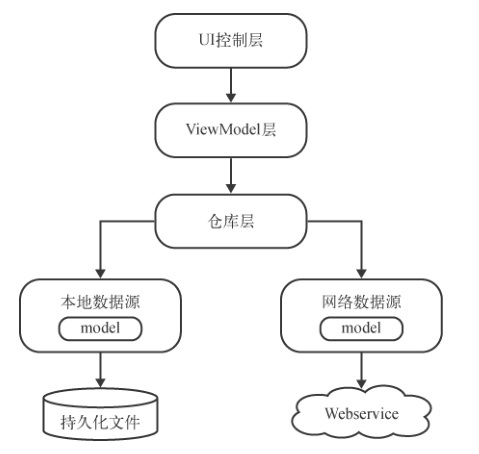
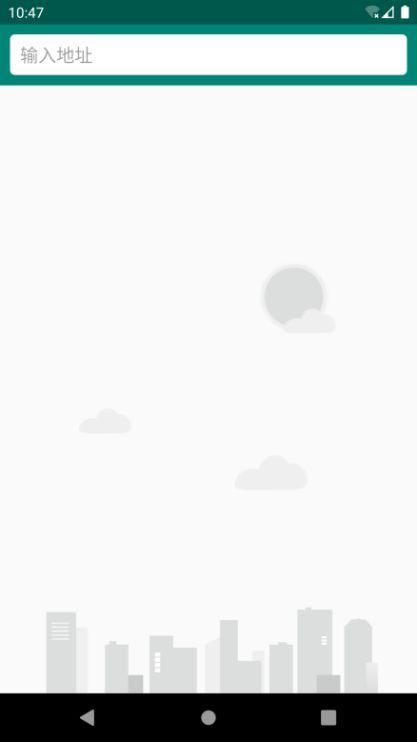
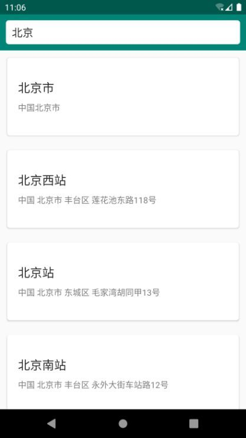
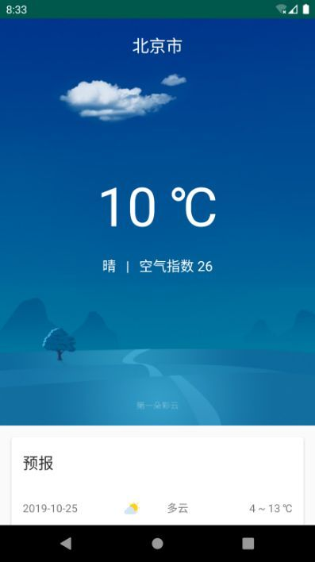
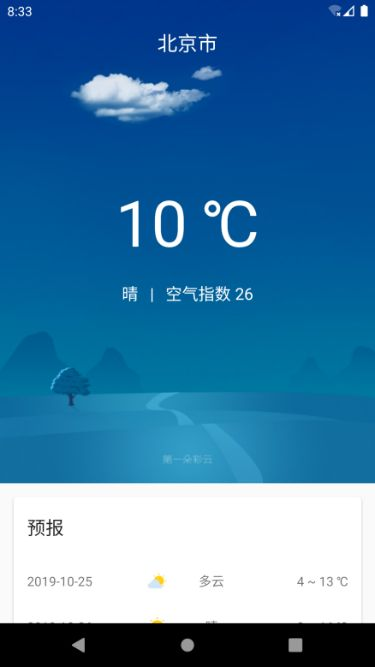
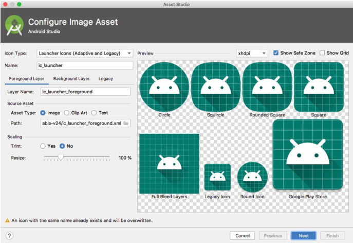
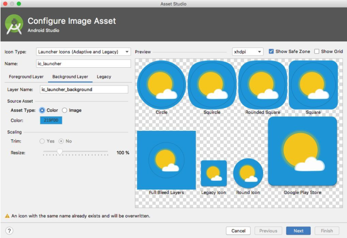
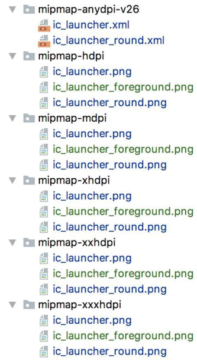

## 搭建 MVVM 项目架构

MVVM（Model-View-ViewModel）是一种高级项目架构模式，目前已被广泛应用在 Android 程序设计领域，类似的架构模式还有 MVP、MVC 等。简单来讲，MVVM 架构可以将程序结构主要分成 3 部分：`Model` 是数据模型部分；`View` 是界面展示部分；而 `ViewModel` 比较特殊，可以将它理解成一个连接数据模型和界面展示的桥梁，从而实现让业务逻辑和界面展示分离的程序结构设计。



新建一个项目 `SunnyWeather`，编辑 `app/build.gradle` 文件，在 `dependencies` 闭包中添加依赖库：

```groovy
dependencies {
    ...
    // 添加的库
    implementation 'androidx.recyclerview:recyclerview:1.0.0'
    implementation 'androidx.lifecycle:lifecycle-extensions:2.2.0'
    implementation 'androidx.lifecycle:lifecycle-livedata-ktx:2.2.0'
    implementation 'com.google.android.material:material:1.1.0'
    implementation 'androidx.swiperefreshlayout:swiperefreshlayout:1.0.0'
    implementation 'com.squareup.retrofit2:retrofit:2.6.1'
    implementation 'com.squareup.retrofit2:converter-gson:2.6.1'
    implementation 'org.jetbrains.kotlinx:kotlinx-coroutines-core:1.3.0'
    implementation 'org.jetbrains.kotlinx:kotlinx-coroutines-android:1.1.1'
}
```

由于引入了 Material 库，所以需要将 `AppTheme` 的 `parent` 主题改成 `MaterialComponents` 模式，修改 `res/values/themes.xml` 文件，如下所示：

```xml
<resources xmlns:tools="http://schemas.android.com/tools">
    <!-- Base application theme. -->
    <style name="Theme.SunnyWeather" parent="Theme.MaterialComponents.DayNight.NoActionBar">
        <!-- Primary brand color. -->
        <item name="colorPrimary">@color/purple_200</item>
        <item name="colorPrimaryVariant">@color/purple_700</item>
        <item name="colorOnPrimary">@color/black</item>
        <!-- Secondary brand color. -->
        <item name="colorSecondary">@color/teal_200</item>
        <item name="colorSecondaryVariant">@color/teal_200</item>
        <item name="colorOnSecondary">@color/black</item>
        <!-- Status bar color. -->
        <item name="android:statusBarColor" tools:targetApi="l">?attr/colorPrimaryVariant</item>
        <!-- Customize your theme here. -->
    </style>
</resources>
```

## 搜索全球城市数据

根据合理的开发方式，实现过程应该主要分为逻辑层实现和 UI 层实现两部分。

### 实现逻辑层代码

新建一个 `SunnyWeatherApplication` 类，代码如下所示：

```kotlin
class SunnyWeatherApplication:Application() {
    companion object {
        @SuppressLint("StaticFieldLeak")
        lateinit var context: Context
        // 申请到的令牌值
        const val TOKEN = "xxx"
    }
    override fun onCreate() {
        super.onCreate()
        context = applicationContext
    }
}
```

然后还需要在 `AndroidManifest.xml` 文件的 `<application>` 标签下指定 `SunnyWeatherApplication` ，如下所示：

```xml
<application
    android:name=".SunnyWeatherApplication"
    android:allowBackup="true"
    android:icon="@mipmap/ic_launcher"
    android:label="@string/app_name"
    android:roundIcon="@mipmap/ic_launcher_round"
    android:supportsRtl="true"
    android:theme="@style/Theme.SunnyWeather">
        ...
</application>
```

接下来定义数据模型，在 `model` 包下新建 `PlaceResponse.kt` 文件，并编写如下代码：

```kotlin
/*
{"status":"ok",
"query":"北京",
"places":[
{"name":"北京市","location":{"lat":39.9041999,"lng":116.4073963},"formatted_address":"中国北京市"},
{"name":"北京西站","location":{"lat":39.89491,"lng":116.322056},"formatted_address":"中国 北京市 丰台区 莲花池东路118号"},
]}
 */
data class PlaceResponse(val status: String, val places: List<Place>)

/*
{"name":"北京市","location":{"lat":39.9041999,"lng":116.4073963},"formatted_address":"中国北京市"}
 */
// 由于 JSON 中一些字段的命名可能与 Kotlin 的命名规范不太一致，
// 因此这里使用了 @SerializedName 注解的方式，来让 JSON 字段和 Kotlin 字段之间建立 映射关系。
data class Place(
    val name: String, val location: Location,
    @SerializedName("formatted_address") val address: String
)

/*
{"lat":39.89491,"lng":116.322056}
 */
data class Location(val lng: String, val lat: String)
```

其中定义的类与属性，完全就是按照搜索城市数据接口返回的 JSON 格式来定义的。

接下来我们就可以开始编写网络层相关的代码了。首先定义一个用于访问彩云天气城市搜索 API 的 `Retrofit` 接口，在 `logic/network` 包下新建 `PlaceService` 接口，代码如下所示：

```kotlin
interface PlaceService {

    // Retrofit 会将服务器返回的 JSON 数据自动解析成 PlaceResponse 对象
    @GET("v2/place?token=${SunnyWeatherApplication.TOKEN}&lang=zh_CN")
    fun searchPlaces(@Query("query") query: String): Call<PlaceResponse>
}
```

`searchPlaces()` 方法的返回值被声明成了 `Call<PlaceResponse>`，这样 `Retrofit` 就会将服务器返回的 JSON 数据自动解析成 `PlaceResponse` 对象了。

接着创建一个 `Retrofit` 构建器用于使用 `PlaceService`，在 `logic/network` 包下新建一个 `ServiceCreator` 单例类，代码如下所示：

```kotlin
object ServiceCreator { // Retrofit 构建器
    private const val BASE_URL = "https://api.caiyunapp.com/"
    // 构建一个 Retrofit 对象
    private val retrofit = Retrofit.Builder()
        .baseUrl(BASE_URL)
        .addConverterFactory(GsonConverterFactory.create())
        .build()
    // 提供一个外部可见的方法并接收一个 Class 类型的参数
    fun <T> create(serviceClass: Class<T>): T = retrofit.create(serviceClass)
    // 通过泛型实化的功能，提供一个不带参数的 create 方法
    inline fun <reified T> create(): T = create(T::class.java)
}
```

接下来我们还需要再定义一个统一的网络数据源访问入口，对所有网络请求的 API 进行封装。同样在 `logic/network` 包下新建一个 `SunnyWeatherNetwork` 单例类，代码如下所示：

```kotlin
object SunnyWeatherNetwork {

    // 创建一个 PlaceService 接口的动态代理对象
    private val placeService = ServiceCreator.create<PlaceService>()

    // 借助协程技术来实现简化 Retrofit 回调的写法，并将 searchPlaces() 函数也声明成挂起函数。
    suspend fun searchPlaces(query: String) = placeService.searchPlaces(query).await()

    // 定义一个 await() 函数，并将 await() 函数定义成了 Call<T> 的扩展函数，这样
    // 所有返回值是 Call 类型的 Retrofit 网络请求接口就都可以直接调用 await() 函数了。
    // await() 函数中使用了 suspendCoroutine 函数来挂起当前协程
    private suspend fun <T> Call<T>.await(): T {
        // suspendCoroutine 函数必须在协程作用域或挂起函数中才能调用，它接收一个 Lambda 表达式参数，
        // 主要作用是将当前协程立即挂起，然后在一个普通的线程中执行 Lambda 表达式中的代码。
        // Lambda 表达式的参数列表上会传入一个 Continuation 参数，调用它的 resume() 方法
        // 或 resumeWithException() 可以让协程恢复执行。
        return suspendCoroutine { continuation ->
            // 由于扩展函数的原因，我们现在拥有了 Call 对象的上下文，那么这里就可以直接调用 enqueue() 方法让
            // Retrofit 发起网络请求。
            enqueue(object : Callback<T> {
                override fun onResponse(call: Call<T>, response: Response<T>) {
                    val body = response.body()
                    if (body != null) continuation.resume(body)
                    else continuation.resumeWithException(
                        RuntimeException("response body is null.")
                    )
                }

                override fun onFailure(call: Call<T>, t: Throwable) {
                    continuation.resumeWithException(t)
                }
            })
        }
    }
}
```

当外部调用 `SunnyWeatherNetwork` 的 `searchPlaces()` 函数时，`Retrofit` 就会立即发起网络请求，同时当前的协程也会被阻塞住。直到服务器响应我们的请求之后，`await()` 函数会将解析出来的数据模型对象取出并返回，同时恢复当前协程的执行。

这样网络层相关的代码我们就编写完了，下面开始编写仓库层的代码。仓库层的主要工作就是判断调用方请求的数据应该是从本地数据源中获取还是从网络数据源中获取，并将获得的数据返回给调用方。因此，仓库层有点像是一个数据获取与缓存的中间层，在本地没有缓存数据的情况下就去网络层获取，如果本地已经有缓存了，就直接将缓存数据返回。

在 `logic` 包下新建一个 `Repository` 单例类，作为仓库层的统一封装入口，代码如下所示：

```kotlin
object Repository {
    //
    fun searchPlaces(query: String) = liveData(Dispatchers.IO) {
        val result = try {
            val placeResponse = SunnyWeatherNetwork.searchPlaces(query)
            if (placeResponse.status == "ok") { // 请求成功
                val places = placeResponse.places
                Result.success(places)
            } else { // 请求失败
                Result.failure(RuntimeException("response status is
                ${placeResponse.status}"))
            }
        } catch (e: Exception) {
            Result.failure<List<Place>>(e)
        }
        emit(result) // 通知数据变化
    }
}
```

一般在仓库层中定义的方法，为了能将异步获取的数据以响应式编程的方式通知给上一层，通常会返回一个 `LiveData` 对象。上述代码中的 `liveData()` 函数可以自动构建并返回一个 `LiveData` 对象，然后在它的代码块中提供一个挂起函数的上下文，这样我们就可以在 `liveData()` 函数的代码块中调用任意的挂起函数了。最后使用一个 `emit()` 方法将包装的结果发射出去，这个 `emit()` 方法其实类似于调用 `LiveData` 的 `setValue()` 方法来通知数据变化，只不过这里我们无法直接取得返回的 `LiveData` 对象，所以 `lifecycle-livedata-ktx` 库提供了这样一个替代方法。

最后定义 `ViewModel` 层。`ViewModel` 相当于逻辑层和 UI 层之间的一个桥梁，虽然它更偏向于逻辑层的部分，但是由于 `ViewModel` 通常和 `Activity` 或 `Fragment` 是一一对应的，因此我们还是习惯将它们放在一起。

在 `ui/place` 包下新建一个 `PlaceViewModel`，代码如下所示：

```kotlin
class PlaceViewModel : ViewModel() {
    private val searchLiveData = MutableLiveData<String>()
    // placeList 集合用于对界面上显示的城市数据进行缓存
    val placeList = ArrayList<Place>()
    // 使用 Transformations 的 switchMap() 方法来观察 searchLiveData 对象
    val placeLiveData = Transformations.switchMap(searchLiveData) { query ->
        Repository.searchPlaces(query)
    }
    // 每当 searchPlaces() 函数被调用时，switchMap() 方法所对应的转换函数就会执行。
    fun searchPlaces(query: String) {
        searchLiveData.value = query
    }
}
```

每当 `searchPlaces()` 函数被调用时，`switchMap()` 方法所对应的转换函数就会执行。然后在转换函数中，我们只需要调用仓库层中定义的 `searchPlaces()` 方法就可以发起网络请求，同时将仓库层返回的 `LiveData` 对象转换成一个可供 `Activity` 观察的 `LiveData` 对象。

### 实现 UI 层代码

在 `res/layout` 目录中新建 `fragment_place.xml` 布局，代码如下所示：

```xml
<?xml version="1.0" encoding="utf-8"?>
<RelativeLayout xmlns:android="http://schemas.android.com/apk/res/android"
    android:layout_width="match_parent"
    android:layout_height="match_parent"
    android:background="?android:windowBackground">

    <ImageView
        android:id="@+id/bgImageView"
        android:layout_width="match_parent"
        android:layout_height="wrap_content"
        android:layout_alignParentBottom="true"
        android:src="@drawable/bg_place" />

    <FrameLayout
        android:layout_width="match_parent"
        android:layout_height="60dp"
        android:id="@+id/actionBarLayout"
        android:background="@color/design_default_color_primary">

        <EditText
            android:layout_width="match_parent"
            android:layout_height="40dp"
            android:id="@+id/searchPlaceEdit"
            android:layout_gravity="center_vertical"
            android:layout_marginStart="10dp"
            android:layout_marginEnd="10dp"
            android:paddingStart="10dp"
            android:paddingEnd="10dp"
            android:hint="输入地址"
            android:background="@drawable/search_bg"/>

    </FrameLayout>

    <androidx.recyclerview.widget.RecyclerView
        android:layout_width="match_parent"
        android:layout_height="match_parent"
        android:id="@+id/recyclerView"
        android:layout_below="@+id/actionBarLayout"
        android:visibility="gone"/>

</RelativeLayout>
```

`EditText` 用于给用户提供一个搜索框，这样用户就可以在这里搜索任意城市；`RecyclerView` 则主要用于对搜索出来的结果进行展示。另外这个布局中还有一个 `ImageView` 控件，它的作用只是为了显示一张背景图，从而让界面变得更加美观，和主体功能无关。

既然用到了 `RecyclerView`，那么毫无疑问，我们还得定义它的子项布局才行。在 `layout` 目录下新建一个 `place_item.xml` 文件，代码如下所示：

```xml
<?xml version="1.0" encoding="utf-8"?>
<com.google.android.material.card.MaterialCardView xmlns:android="http://schemas.android.com/apk/res/android"
    xmlns:app="http://schemas.android.com/apk/res-auto"
    android:layout_width="match_parent"
    android:layout_height="130dp"
    android:layout_margin="12dp"
    app:cardCornerRadius="4dp">

    <LinearLayout
        android:orientation="vertical"
        android:layout_width="match_parent"
        android:layout_height="wrap_content"
        android:layout_margin="18dp"
        android:layout_gravity="center_vertical">

        <TextView
            android:layout_width="wrap_content"
            android:layout_height="wrap_content"
            android:id="@+id/placeName"
            android:textColor="?android:attr/textColorPrimary"
            android:textSize="20sp"/>

        <TextView
            android:id="@+id/placeAddress"
            android:layout_width="wrap_content"
            android:layout_height="wrap_content"
            android:layout_marginTop="10dp"
            android:textColor="?android:attr/textColorSecondary"
            android:textSize="14sp"/>
    </LinearLayout>

</com.google.android.material.card.MaterialCardView>
```

`RecyclerView` 中的每个元素都是在 `MaterialCardView` 卡片中的。卡片中的元素内容非常简单，只用到了两个 `TextView`，一个用于显示搜索到的地区名，一个用于显示该地区的详细地址。

接下来就需要为 `RecyclerView` 准备适配器了。在 `ui/place` 包下新建一个 `PlaceAdapter` 类，代码如下所示：

```kotlin
class PlaceAdapter(private val fragment: PlaceFragment, private val placeList: List<Place>) :
    RecyclerView.Adapter<PlaceAdapter.ViewHolder>() {

    inner class ViewHolder(view: View) : RecyclerView.ViewHolder(view) {
        val placeName: TextView = view.findViewById(R.id.placeName)
        val placeAddress: TextView = view.findViewById(R.id.placeAddress)
    }

    override fun onCreateViewHolder(parent: ViewGroup, viewType: Int): ViewHolder {
        val view = LayoutInflater.from(parent.context).inflate(R.layout.place_item, parent, false)
        val holder = ViewHolder(view)
        return holder
    }

    override fun onBindViewHolder(holder: ViewHolder, position: Int) {
        val place = placeList[position]
        holder.placeName.text = place.name
        holder.placeAddress.text = place.address
    }

    override fun getItemCount() = placeList.size
}
```

在 `ui/place` 包下新建一个 `PlaceFragment`，并让它继承自 AndroidX 库中的 `Fragment`，代码如下所示：

```kotlin
class PlaceFragment : Fragment() {
    // 使用 lazy 函数这种懒加载技术来获取 PlaceViewModel 的实例
    val viewModel by lazy { ViewModelProvider(this).get(PlaceViewModel::class.java) }

    private lateinit var adapter: PlaceAdapter

    override fun onCreateView(
        inflater: LayoutInflater,
        container: ViewGroup?,
        savedInstanceState: Bundle?
    ): View? {
        // 加载 fragment_place 布局
        return inflater.inflate(R.layout.fragment_place, container, false)
    }

    @SuppressLint("FragmentLiveDataObserve", "NotifyDataSetChanged")
    override fun onActivityCreated(savedInstanceState: Bundle?) {
        super.onActivityCreated(savedInstanceState)

        val layoutManager = LinearLayoutManager(activity)
        recyclerView.layoutManager = layoutManager
        // 使用 PlaceViewModel 中的 placeList 集合作为数据源
        adapter = PlaceAdapter(this, viewModel.placeList)
        recyclerView.adapter = adapter
        // addTextChangedListener() 方法监听搜索框内容的变化情况
        searchPlaceEdit.addTextChangedListener { text: Editable? ->
            val content = text.toString()
            if (content.isNotEmpty()) {
                // 发起搜索城市数据的网络请求
                viewModel.searchPlaces(content)
            } else {
                // 将 RecyclerView 隐藏起来
                recyclerView.visibility = View.GONE
                // 显示背景图
                bgImageView.visibility = View.VISIBLE
                viewModel.placeList.clear()
                adapter.notifyDataSetChanged()
            }
        }
        // 对 placeLiveData 对象进行观察，当有任何数据变化时，就会回调到传入的 Observer 接口实现中。
        viewModel.placeLiveData.observe(this, Observer { result ->
            val places = result.getOrNull()
            if (places != null) {
                // 显示 RecyclerView
                recyclerView.visibility = View.VISIBLE
                // 隐藏背景图
                bgImageView.visibility = View.GONE
                viewModel.placeList.clear()
                viewModel.placeList.addAll(places)
                adapter.notifyDataSetChanged()
            } else {
                Toast.makeText(activity, "未能查询到任何地点", Toast.LENGTH_SHORT).show()
                result.exceptionOrNull()?.printStackTrace()
            }
        })
    }
}
```

可是 `Fragment` 是不能直接显示在界面上的，因此我们还需要把它添加到 `Activity` 里才行。修改 `activity_main.xml` 中的代码，如下所示：

```xml
<?xml version="1.0" encoding="utf-8"?>
<FrameLayout xmlns:android="http://schemas.android.com/apk/res/android"

    android:layout_width="match_parent"
    android:layout_height="match_parent">

    <fragment
        android:id="@+id/placeFragment"
        android:name="com.sunnyweather.android.ui.place.PlaceFragment"
        android:layout_width="match_parent"
        android:layout_height="match_parent"/>

</FrameLayout>
```

`PlaceFragment` 的布局里面已经定义了一个搜索框布局，因此就不再需要原生的 `ActionBar` 了，修改 `res/values/styles.xml` 中的代码，如下所示：

```xml
<resources xmlns:tools="http://schemas.android.com/tools">
    <!-- Base application theme. -->
    <style name="Theme.SunnyWeather" parent="Theme.MaterialComponents.Light.NoActionBar">
        <!-- Primary brand color. -->
        <item name="colorPrimary">@color/purple_500</item>
        <item name="colorPrimaryVariant">@color/purple_700</item>
        <item name="colorOnPrimary">@color/white</item>
        <!-- Secondary brand color. -->
        <item name="colorSecondary">@color/teal_200</item>
        <item name="colorSecondaryVariant">@color/teal_700</item>
        <item name="colorOnSecondary">@color/black</item>
        <!-- Status bar color. -->
        <item name="android:statusBarColor" tools:targetApi="l">?attr/colorPrimaryVariant</item>
        <!-- Customize your theme here. -->
    </style>
</resources>
```

现在可以运行一下程序了，初始界面如图所示：



接下来我们可以在搜索框里随意输入全球任意城市的名字，相关的地区信息就出现在界面上了，如图所示：



这样就实现搜索全球城市数据功能。

## 显示天气信息

接下来开始去查询天气，并且把天气信息显示出来了。实现的过程也是类似的，同样主要分为逻辑层实现和 UI 层实现两部分。

### 实现逻辑层代码

首先获取获取实时天气信息，在 `logic/model` 包下新建一个 `RealtimeResponse.kt` 文件，并在这个文件中编写如下代码：

```kotlin
/*
{
	"status": "ok",
	"result": {
		"realtime": {
			"temperature": 23.16,
			"skycon": "WIND",
			"air_quality": {
				"aqi": { "chn": 17.0 }
			}
		}
	}
}
 */
data class RealtimeResponse(val status:String, val result:Result){
    // 将所有的数据模型类都定义在了RealtimeResponse的内部，防止出现类名冲突
    data class Result(val realtime:Realtime)

    data class Realtime(val skycon:String, val temperature: Float,
    @SerializedName("air_quality") val airQuality:AirQuality)

    data class AirQuality(val aqi:AQI)

    data class AQI(val chn:Float)
}
```

在数据模型中，我们可以使用 `List` 集合来对 JSON 中的数组元素进行映射。同样在 `logic/model` 包下新建一个 `DailyResponse.kt` 文件，并编写如下代码：

```kotlin
/*
{
	"status": "ok",
	"result": {
		"daily": {
			"temperature": [ {"max": 25.7, "min": 20.3}, ... ],
			"skycon": [ {"value": "CLOUDY", "date":"2019-10-20T00:00+08:00"}, ... ],
			"life_index": {
				"coldRisk": [ {"desc": "易发"}, ... ],
				"carWashing": [ {"desc": "适宜"}, ... ],
				"ultraviolet": [ {"desc": "无"}, ... ],
				"dressing": [ {"desc": "舒适"}, ... ]
			}
		}
	}
}
 */

data class DailyResponse(val status:String, val result:Result){

    data class Result(val daily:Daily)

    data class Daily(val temperature:List<Temperature>, val skycon:List<Skycon>,
    @SerializedName("life_index") val lifeIndex:LifeIndex)

    data class Temperature(val max: Float, val min: Float)

    data class Skycon(val value:String, val date:Date)

    data class LifeIndex(val coldRisk:List<LifeDescription>, val carWashing:List<LifeDescription>,
    val ultraviolet:List<LifeDescription>, val dressing:List<LifeDescription>)

    data class LifeDescription(val desc:String)
}
```

另外，我们还需要在 `logic/model` 包下再定义一个 `Weather` 类，用于将 `Realtime` 和 `Daily` 对象封装起来，代码如下所示：

```kotlin
data class Weather(val realtime: RealtimeResponse.Realtime, val daily: DailyResponse.Daily)
```

现在定义一个用于访问天气信息 API 的 `Retrofit` 接口，在 `logic/network` 包下新建 `WeatherService` 接口，代码如下所示：

```kotlin
interface WeatherService {

    // 根据经纬度获取实时的天气信息
    // https://api.caiyunapp.com/v2.5/W4IGrd1ginFLr79I/104.066301,30.572961/realtime.json
    @GET("v2.5/${SunnyWeatherApplication.TOKEN}/{lng},{lat}/realtime.json")
    fun getRealtimeWeather(@Path("lng") lng: String, @Path("lat") lat: String):
            Call<RealtimeResponse>

    // 根据经纬度获取未来的天气信息
    // https://api.caiyunapp.com/v2.5/W4IGrd1ginFLr79I/104.066301,30.572961/daily.json
    @GET("v2.5/${SunnyWeatherApplication.TOKEN}/{lng},{lat}/daily.json")
    fun getDailyWeather(@Path("lng") lng: String, @Path("lat") lat: String):
            Call<DailyResponse>
}
```

接下来我们需要在 `SunnyWeatherNetwork` 这个网络数据源访问入口对新增的 `WeatherService` 接口进行封装。修改 `SunnyWeatherNetwork` 中的代码，如下所示：

```kotlin
object SunnyWeatherNetwork {
    ...
    // 创建一个 WeatherService 接口的动态代理对象
    private val weatherService = ServiceCreator.create(WeatherService::class.java)
    // 获取未来的天气信息
    suspend fun getDailyWeather(lng:String, lat:String) =
        weatherService.getDailyWeather(lng, lat).await()
    // 获取实时的天气信息
    suspend fun getRealtimeWeather(lng: String, lat: String) =
        weatherService.getRealtimeWeather(lng, lat).await()
}
```

完成了网络层的代码编写，接下来很容易想到应该去仓库层进行相关的代码实现了。修改 `Repository` 中的代码，如下所示：

```kotlin
object Repository {
    // 使用 fire 函数来统一处理 try catch
    fun searchPlaces(query: String) = fire(Dispatchers.IO) {
        val placeResponse = SunnyWeatherNetwork.searchPlaces(query)
        if (placeResponse.status == "ok") {
            val places = placeResponse.places
            Result.success(places)
        } else {
            Result.failure(RuntimeException("response status is ${placeResponse.status}"))
        }
    }
    // 使用 fire 函数来统一处理 try catch
    fun refreshWeather(lng:String, lat:String) = fire(Dispatchers.IO){
        // coroutineScope 函数创建了一个协程作用域，实现并发执行两个网络请求
        coroutineScope {
            // 使用 async 函数并发执行两个网络请求
            val deferredRealtime = async {
                SunnyWeatherNetwork.getRealtimeWeather(lng, lat)
            }
            val deferredDaily = async {
                SunnyWeatherNetwork.getDailyWeather(lng, lat)
            }
            // 等待两个网络请求都执行完毕之后，获取到了结果
            val realtimeResponse = deferredRealtime.await()
            val dailyResponse = deferredDaily.await()
            if (realtimeResponse.status == "ok" && dailyResponse.status == "ok"){
                val weather = Weather(realtimeResponse.result.realtime, dailyResponse.result.daily)
                Result.success(weather)
            }else{
                Result.failure(RuntimeException(
                    "realtime response status is ${realtimeResponse.status}" +
                    "daily response status is ${dailyResponse.status}"
                ))
            }
        }
    }

    // 优化代码，将 try catch 进行统一处理
    private fun <T> fire(context: CoroutineContext, block:suspend ()->Result<T>)=
        // liveData() 函数自动构建并返回一个 LiveData 对象，然后在它的代码块中提供一个挂起函数的上下文，
        // 这样我们就可以在 liveData() 函数的代码块中调用任意的挂起函数了。
        liveData<Result<T>> (context){
            val result = try {
                block()
            }catch (e:Exception){
                Result.failure<T>(e)
            }
            // emit()方法将包装的结果发射出去，类似于调用 LiveData 的 setValue() 方法来通知数据变化
            emit(result)
        }
}
```

`block:suspend ()->Result<T>` 这个参数是一个挂起函数，它不接收任何参数，返回一个 `Result<T>` 对象。这样我们就可以在 `fire()` 函数中直接调用 `block()` 函数，然后将它的返回值发射出去。

接下来实现逻辑层的最后一步，定义 `ViewModel` 层。在 `ui/weather` 包下新建一个 `WeatherViewModel`，代码如下所示：

```kotlin
class WeatherViewModel: ViewModel() {
    private val locationLiveData = MutableLiveData<Location>()

    var locationLng = ""
    var locationLat = ""
    var placeName = ""
    // 观察 locationLiveData 对象
    val weatherLiveData = Transformations.switchMap(locationLiveData){
        Repository.refreshWeather(it.lng, it.lat)
    }

    fun refreshWeather(lng: String, lat: String){
        // 传入的经纬度参数封装成一个 Location 对象后赋值给 locationLiveData 对象
        locationLiveData.value = Location(lng, lat)
    }
}
```

这样我们就将逻辑层的代码实现全部完成了，接下来又该去编写界面了。

### 实现 UI 层代码

首先创建一个用于显示天气信息的 `Activity`。在 `ui/weather` 包下创建一个 `WeatherActivity`，并将布局名指定成 `activity_weather.xml`。

由于所有的天气信息都将在同一个界面上显示，因此 `activity_weather.xml` 会是一个很长的布局文件。那么为了让里面的代码不至于混乱不堪，这里将界面的不同部分写在不同的布局文件里面，再通过引入布局的方式集成到 `activity_weather.xml` 中，这样整个布局文件就会显得更加工整。新建一个 `now.xml` 作为当前天气信息的布局，代码如下所示：

```xml
<RelativeLayout xmlns:android="http://schemas.android.com/apk/res/android"
    android:id="@+id/nowLayout"
    android:layout_width="match_parent"
    android:layout_height="530dp"
    android:orientation="vertical">
    <FrameLayout
        android:id="@+id/titleLayout"
        android:layout_width="match_parent"
        android:layout_height="70dp">
        <TextView
            android:id="@+id/placeName"
            android:layout_width="wrap_content"
            android:layout_height="wrap_content"
            android:layout_marginStart="60dp"
            android:layout_marginEnd="60dp"
            android:layout_gravity="center"
            android:singleLine="true"
            android:ellipsize="middle"
            android:textColor="#fff"
            android:textSize="22sp" />

    </FrameLayout>
    <LinearLayout
        android:id="@+id/bodyLayout"
        android:layout_width="match_parent"
        android:layout_height="wrap_content"
        android:layout_centerInParent="true"
        android:orientation="vertical">
        <TextView
            android:id="@+id/currentTemp"
            android:layout_width="wrap_content"
            android:layout_height="wrap_content"
            android:layout_gravity="center_horizontal"
            android:textColor="#fff"
            android:textSize="70sp" />
        <LinearLayout
            android:layout_width="wrap_content"
            android:layout_height="wrap_content"
            android:layout_gravity="center_horizontal"
            android:layout_marginTop="20dp">
            <TextView
                android:id="@+id/currentSky"
                android:layout_width="wrap_content"
                android:layout_height="wrap_content"
                android:textColor="#fff"
                android:textSize="18sp" />
            <TextView
                android:layout_width="wrap_content"
                android:layout_height="wrap_content"
                android:layout_marginStart="13dp"
                android:textColor="#fff"
                android:textSize="18sp"
                android:text="|" />
            <TextView
                android:id="@+id/currentAQI"
                android:layout_width="wrap_content"
                android:layout_height="wrap_content"
                android:layout_marginStart="13dp"
                android:textColor="#fff"
                android:textSize="18sp" />
        </LinearLayout>
    </LinearLayout>
</RelativeLayout>
```

这段代码主要分为上下两个布局：上半部分是头布局，里面只放置了一个 `TextView`，用于显示城市名；下半部分是当前天气信息的布局，里面放置了几个 `TextView`，分别用于显示当前气温、当前天气情况以及当前空气质量。

然后新建 `forecast.xml` 作为未来几天天气信息的布局，代码如下所示：

```xml
<com.google.android.material.card.MaterialCardView
    xmlns:android="http://schemas.android.com/apk/res/android"
    xmlns:app="http://schemas.android.com/apk/res-auto"

    android:layout_width="match_parent"
    android:layout_height="wrap_content"
    android:layout_marginLeft="15dp"
    android:layout_marginRight="15dp"
    android:layout_marginTop="15dp"
    app:cardCornerRadius="4dp">
    <LinearLayout
        android:orientation="vertical"
        android:layout_width="match_parent"
        android:layout_height="wrap_content">
        <TextView
            android:layout_width="wrap_content"
            android:layout_height="wrap_content"
            android:layout_marginStart="15dp"
            android:layout_marginTop="20dp"
            android:layout_marginBottom="20dp"
            android:text="预报"
            android:textColor="?android:attr/textColorPrimary"
            android:textSize="20sp"/>
        <LinearLayout
            android:id="@+id/forecastLayout"
            android:orientation="vertical"
            android:layout_width="match_parent"
            android:layout_height="wrap_content">
        </LinearLayout>
    </LinearLayout>
</com.google.android.material.card.MaterialCardView>
```

最外层使用了 `MaterialCardView` 来实现卡片式布局的背景效果，然后使用 `TextView` 定义了一个标题，接着又使用一个 `LinearLayout` 定义了一个用于显示未来几天天气信息的布局。不过这个布局中并没有放入任何内容，因为这是要根据服务器返回的数据在代码中动态添加的。为此，我们需要再定义一个未来天气信息的子项布局，创建 `forecast_item.xml` 文件，代码如下所示：

```xml
<?xml version="1.0" encoding="utf-8"?>
<LinearLayout xmlns:android="http://schemas.android.com/apk/res/android"
    android:orientation="horizontal"
    android:layout_width="match_parent"
    android:layout_height="match_parent"
    android:layout_margin="15dp">

    <TextView
        android:id="@+id/dateInfo"
        android:layout_width="0dp"
        android:layout_height="wrap_content"
        android:layout_gravity="center_vertical"
        android:layout_weight="4"/>

    <ImageView
        android:id="@+id/skyIcon"
        android:layout_width="20dp"
        android:layout_height="20dp"/>

    <TextView
        android:id="@+id/skyInfo"
        android:layout_width="0dp"
        android:layout_height="wrap_content"
        android:layout_gravity="center_vertical"
        android:layout_weight="3"
        android:gravity="center"/>

    <TextView
        android:id="@+id/temperatureInfo"
        android:layout_width="0dp"
        android:layout_height="wrap_content"
        android:layout_gravity="center_vertical"
        android:layout_weight="3"
        android:gravity="end"/>

</LinearLayout>
```

这个子项布局包含了 3 个 `TextView` 和 1 个 `ImageView`，分别用于显示天气预报的日期、天气的图标、天气的情况以及当天的最低温度和最高温度。

然后新建 `life_index.xml` 作为生活指数的布局，代码如下所示：

```xml
<?xml version="1.0" encoding="utf-8"?>
<com.google.android.material.card.MaterialCardView xmlns:android="http://schemas.android.com/apk/res/android"
    xmlns:app="http://schemas.android.com/apk/res-auto"

    android:layout_width="match_parent"
    android:layout_height="wrap_content"
    android:layout_margin="15dp"
    app:cardCornerRadius="4dp">

    <LinearLayout
        android:orientation="vertical"
        android:layout_width="match_parent"
        android:layout_height="wrap_content">
        <TextView
            android:layout_width="wrap_content"
            android:layout_height="wrap_content"
            android:layout_marginStart="15dp"
            android:layout_marginTop="20dp"
            android:text="生活指数"
            android:textColor="?android:attr/textColorPrimary"
            android:textSize="20sp"/>

        <LinearLayout
            android:layout_width="match_parent"
            android:layout_height="wrap_content"
            android:layout_marginTop="20dp">

            <RelativeLayout
                android:layout_width="0dp"
                android:layout_height="60dp"
                android:layout_weight="1">

                <ImageView
                    android:id="@+id/coldRiskImg"
                    android:layout_width="wrap_content"
                    android:layout_height="wrap_content"
                    android:layout_centerVertical="true"
                    android:layout_marginStart="20dp"
                    android:src="@drawable/ic_coldrisk"/>

                <LinearLayout
                    android:layout_width="wrap_content"
                    android:layout_height="wrap_content"
                    android:layout_centerVertical="true"
                    android:layout_toEndOf="@+id/coldRiskImg"
                    android:layout_marginStart="20dp"
                    android:orientation="vertical">

                    <TextView
                        android:layout_width="wrap_content"
                        android:layout_height="wrap_content"
                        android:textSize="12sp"
                        android:text="感冒"/>

                    <TextView
                        android:id="@+id/coldRiskText"
                        android:layout_width="wrap_content"
                        android:layout_height="wrap_content"
                        android:layout_marginTop="4dp"
                        android:textSize="16sp"
                        android:textColor="?android:attr/textColorPrimary"/>

                </LinearLayout>

            </RelativeLayout>

            <RelativeLayout
                android:layout_width="0dp"
                android:layout_height="60dp"
                android:layout_weight="1">

                <ImageView
                    android:id="@+id/dressingImg"
                    android:layout_width="wrap_content"
                    android:layout_height="wrap_content"
                    android:layout_centerVertical="true"
                    android:layout_marginStart="20dp"
                    android:src="@drawable/ic_dressing"/>

                <LinearLayout
                    android:layout_width="wrap_content"
                    android:layout_height="wrap_content"
                    android:layout_centerVertical="true"
                    android:layout_toEndOf="@id/dressingImg"
                    android:layout_marginStart="20dp"
                    android:orientation="vertical">
                    <TextView
                        android:layout_width="wrap_content"
                        android:layout_height="wrap_content"
                        android:textSize="12sp"
                        android:text="穿衣" />
                    <TextView
                        android:id="@+id/dressingText"
                        android:layout_width="wrap_content"
                        android:layout_height="wrap_content"
                        android:layout_marginTop="4dp"
                        android:textSize="16sp"
                        android:textColor="?android:attr/textColorPrimary" />
                </LinearLayout>

            </RelativeLayout>

        </LinearLayout>

        <LinearLayout
            android:layout_width="match_parent"
            android:layout_height="wrap_content"
            android:layout_marginBottom="20dp">

            <RelativeLayout
                android:layout_width="0dp"
                android:layout_height="60dp"
                android:layout_weight="1">
                <ImageView
                    android:id="@+id/ultravioletImg"
                    android:layout_width="wrap_content"
                    android:layout_height="wrap_content"
                    android:layout_centerVertical="true"
                    android:layout_marginStart="20dp"
                    android:src="@drawable/ic_ultraviolet" />
                <LinearLayout
                    android:layout_width="wrap_content"
                    android:layout_height="wrap_content"
                    android:layout_centerInParent="true"
                    android:layout_toEndOf="@id/ultravioletImg"
                    android:layout_marginStart="20dp"
                    android:orientation="vertical">
                    <TextView
                        android:layout_width="wrap_content"
                        android:layout_height="wrap_content"
                        android:textSize="12sp"
                        android:text="实时紫外线" />
                    <TextView
                        android:id="@+id/ultravioletText"
                        android:layout_width="wrap_content"
                        android:layout_height="wrap_content"
                        android:layout_marginTop="4dp"
                        android:textSize="16sp"
                        android:textColor="?android:attr/textColorPrimary" />
                </LinearLayout>
            </RelativeLayout>

            <RelativeLayout
                android:layout_width="0dp"
                android:layout_height="60dp"
                android:layout_weight="1">
            <ImageView
                android:id="@+id/carWashingImg"
                android:layout_width="wrap_content"
                android:layout_height="wrap_content"
                android:layout_centerVertical="true"
                android:layout_marginStart="20dp"
                android:src="@drawable/ic_carwashing" />
            <LinearLayout
                android:layout_width="wrap_content"
                android:layout_height="wrap_content"
                android:layout_centerInParent="true"
                android:layout_toEndOf="@id/carWashingImg"
                android:layout_marginStart="20dp"
                android:orientation="vertical">
                <TextView
                    android:layout_width="wrap_content"
                    android:layout_height="wrap_content"
                    android:textSize="12sp"
                    android:text="洗车" />
                <TextView
                    android:id="@+id/carWashingText"
                    android:layout_width="wrap_content"
                    android:layout_height="wrap_content"
                    android:layout_marginTop="4dp"
                    android:textSize="16sp"
                    android:textColor="?android:attr/textColorPrimary" />
            </LinearLayout>
            </RelativeLayout>

        </LinearLayout>

    </LinearLayout>

</com.google.android.material.card.MaterialCardView>
```

它就是定义了一个四方格的布局，分别用于显示感冒、穿衣、实时紫外线以及洗车的指数。每个方格中都有一个 ImageView 用来显示图标，一个 TextView 用来显示标题，还有一个 TextView 用来显示指数。

这样我们就把天气界面上每个部分的布局文件都编写好了，接下来的工作就是将它们引入 `activity_weather.xml` 中，如下所示：

```xml
<ScrollView
    xmlns:android="http://schemas.android.com/apk/res/android"
    android:id="@+id/weatherLayout"
    android:layout_width="match_parent"
    android:layout_height="match_parent"
    android:scrollbars="none"
    android:overScrollMode="never"
    android:visibility="invisible">
        <LinearLayout
            android:orientation="vertical"
            android:layout_width="match_parent"
            android:layout_height="wrap_content">

            <include layout="@layout/now" />
            <include layout="@layout/forecast" />
            <include layout="@layout/life_index" />
        </LinearLayout>
</ScrollView>
```

最外层布局使用了一个 `ScrollView`，使用 `ScrollView` 就可以通过滚动的方式查看屏幕以外的内容。由于 `ScrollView` 的内部只允许存在一个直接子布局，因此这里又嵌套了一个垂直方向的 `LinearLayout`，然后在 `LinearLayout` 中将刚才定义的所有布局逐个引入。

注意，一开始的时候我们是将 `ScrollView` 隐藏起来的，不然空数据的界面看上去会很奇怪。等到天气数据请求成功之后，会通过代码的方式再将 `ScrollView` 显示出来。

这样我们就将天气界面布局编写完成了，接下来应该去实现 `WeatherActivity` 中的代码了。不过在这之前，我们还要编写一个额外的转换函数。因为彩云天气返回的数据中，天气情况都是一些诸如 `CLOUDY`、`WIND` 之类的天气代码，我们需要编写一个转换函数将这些天气代码转换成一个 `Sky` 对象。在 `logic/model` 包下新建一个 `Sky.kt` 文件，代码如下所示：

```kotlin
class Sky (val info: String, val icon: Int, val bg: Int)

private val sky = mapOf(
    "CLEAR_DAY" to Sky("晴", R.drawable.ic_clear_day, R.drawable.bg_clear_day),
    "CLEAR_NIGHT" to Sky("晴", R.drawable.ic_clear_night, R.drawable.bg_clear_night),
    "PARTLY_CLOUDY_DAY" to Sky("多云", R.drawable.ic_partly_cloud_day,
        R.drawable.bg_partly_cloudy_day),
    "PARTLY_CLOUDY_NIGHT" to Sky("多云", R.drawable.ic_partly_cloud_night,
        R.drawable.bg_partly_cloudy_night),
    "CLOUDY" to Sky("阴", R.drawable.ic_cloudy, R.drawable.bg_cloudy),
    "WIND" to Sky("大风", R.drawable.ic_cloudy, R.drawable.bg_wind),
    "LIGHT_RAIN" to Sky("小雨", R.drawable.ic_light_rain, R.drawable.bg_rain),
    "MODERATE_RAIN" to Sky("中雨", R.drawable.ic_moderate_rain, R.drawable.bg_rain),
    "HEAVY_RAIN" to Sky("大雨", R.drawable.ic_heavy_rain, R.drawable.bg_rain),
    "STORM_RAIN" to Sky("暴雨", R.drawable.ic_storm_rain, R.drawable.bg_rain),
    "THUNDER_SHOWER" to Sky("雷阵雨", R.drawable.ic_thunder_shower, R.drawable.bg_rain),
    "SLEET" to Sky("雨夹雪", R.drawable.ic_sleet, R.drawable.bg_rain),
    "LIGHT_SNOW" to Sky("小雪", R.drawable.ic_light_snow, R.drawable.bg_snow),
    "MODERATE_SNOW" to Sky("中雪", R.drawable.ic_moderate_snow, R.drawable.bg_snow),
    "HEAVY_SNOW" to Sky("大雪", R.drawable.ic_heavy_snow, R.drawable.bg_snow),
    "STORM_SNOW" to Sky("暴雪", R.drawable.ic_heavy_snow, R.drawable.bg_snow),
    "HAIL" to Sky("冰雹", R.drawable.ic_hail, R.drawable.bg_snow),
    "LIGHT_HAZE" to Sky("轻度雾霾", R.drawable.ic_light_haze, R.drawable.bg_fog),
    "MODERATE_HAZE" to Sky("中度雾霾", R.drawable.ic_moderate_haze, R.drawable.bg_fog),
    "HEAVY_HAZE" to Sky("重度雾霾", R.drawable.ic_heavy_haze, R.drawable.bg_fog),
    "FOG" to Sky("雾", R.drawable.ic_fog, R.drawable.bg_fog),
    "DUST" to Sky("浮尘", R.drawable.ic_fog, R.drawable.bg_fog)
)

fun getSky(skycon: String): Sky {
    return sky[skycon] ?: sky["CLEAR_DAY"]!!
}
```

这里首先定义了一个 `Sky` 类作为数据模型，它包含了 `info`、`icon` 和 `bg` 这 3 个字段，分别表示该天气情况所对应的文字、图标和背景。然后使用 `mapOf()` 函数来定义每种天气代码所应该对应的文字、图标和背景。最后，定义了一个 `getSky()` 方法来根据天气代码获取对应的 `Sky` 对象，这样转换函数就写好了。

接下来我们就可以在 `WeatherActivity` 中去请求天气数据，并将数据展示到界面上。修改 `WeatherActivity` 中的代码，如下所示：

```kotlin
class WeatherActivity : AppCompatActivity() {

    val viewModel by lazy { ViewModelProvider(this).get(WeatherViewModel::class.java) }

    override fun onCreate(savedInstanceState: Bundle?) {
        super.onCreate(savedInstanceState)
        setContentView(R.layout.activity_weather)

        if (viewModel.locationLng.isEmpty()){
            viewModel.locationLng = intent.getStringExtra("location_lng")?: ""
        }
        if (viewModel.locationLat.isEmpty()) {
            viewModel.locationLat = intent.getStringExtra("location_lat") ?: ""
        }
        if (viewModel.placeName.isEmpty()) {
            viewModel.placeName = intent.getStringExtra("place_name") ?: ""
        }

        viewModel.weatherLiveData.observe(this, Observer { result->
            val weather = result.getOrNull()
            if (weather != null){
                showWeatherInfo(weather)
            }else{
                Toast.makeText(this, "无法成功获取天气信息", Toast.LENGTH_SHORT).show()
                result.exceptionOrNull()?.printStackTrace()
            }
            viewModel.refreshWeather(viewModel.locationLng, viewModel.locationLat)
        })
    }

    private fun showWeatherInfo(weather:Weather){
        // 从 Weather 对象中获取数据，然后显示到相应的控件上。
        placeName.text = viewModel.placeName
        val realtime = weather.realtime
        val daily = weather.daily

        // 填充 now.xml 布局中的数据
        val currentTempText = "${realtime.temperature.toInt()} ℃"
        currentTemp.text = currentTempText
        currentSky.text = getSky(realtime.skycon).info
        val currentPM25Text = "空气指数 ${realtime.airQuality.aqi.chn.toInt()}"
        currentAQI.text = currentPM25Text
        nowLayout.setBackgroundResource(getSky(realtime.skycon).bg)

        // 填充 forecast.xml 布局中的数据
        forecastLayout.removeAllViews()
        val days = daily.skycon.size
        for (i in 0 until days) {
            val skycon = daily.skycon[i]
            val temperature = daily.temperature[i]
            // 动态加载 forecast_item 布局，并设置相应的数据
            val view = LayoutInflater.from(this).inflate(R.layout.forecast_item,
                forecastLayout, false)
            val dateInfo = view.findViewById(R.id.dateInfo) as TextView
            val skyIcon = view.findViewById(R.id.skyIcon) as ImageView
            val skyInfo = view.findViewById(R.id.skyInfo) as TextView
            val temperatureInfo = view.findViewById(R.id.temperatureInfo) as TextView
            val simpleDateFormat = SimpleDateFormat("yyyy-MM-dd", Locale.getDefault())
            dateInfo.text = simpleDateFormat.format(skycon.date)
            val sky = getSky(skycon.value)
            skyIcon.setImageResource(sky.icon)
            skyInfo.text = sky.info
            val tempText = "${temperature.min.toInt()} ~ ${temperature.max.toInt()} ℃"
            temperatureInfo.text = tempText
            forecastLayout.addView(view)
        }

        // 填充 life_index.xml 布局中的数据，生活指数只需要当天的数据就可以了
        val lifeIndex = daily.lifeIndex
        coldRiskText.text = lifeIndex.coldRisk[0].desc
        dressingText.text = lifeIndex.dressing[0].desc
        ultravioletText.text = lifeIndex.ultraviolet[0].desc
        carWashingText.text = lifeIndex.carWashing[0].desc
        // 让 ScrollView 变成可见状态
        weatherLayout.visibility = View.VISIBLE
    }
}
```

编写完了 `WeatherActivity` 中的代码，接下来我们还有一件事情要做，就是要能从搜索城市界面跳转到天气界面。修改 `PlaceAdapter` 中的代码，如下所示：

```kotlin
class PlaceAdapter(private val fragment: Fragment, private val placeList: List<Place>) :
    RecyclerView.Adapter<PlaceAdapter.ViewHolder>() {
    ...
    override fun onCreateViewHolder(parent: ViewGroup, viewType: Int): ViewHolder {
        val view = LayoutInflater.from(parent.context).inflate(R.layout.place_item, parent, false)
        val holder = ViewHolder(view)
        holder.itemView.setOnClickListener {
            val position = holder.adapterPosition
            val place = placeList[position]
            // 获取当前点击项的经纬度坐标和地区名称，并把它们传入 Intent 中
            val intent = Intent(parent.context, WeatherActivity::class.java).apply {
                putExtra("location_lng", place.location.lng)
                putExtra("location_lat", place.location.lat)
                putExtra("place_name", place.name)
            }
            fragment.startActivity(intent)
            fragment.activity?.finish()
        }
        return holder
    }
    ...
}
```

这里给 `place_item.xml` 最外层的布局添加了一个点击事件，当用户点击某个城市的时候，就会获取到当前城市的经纬度坐标和地区名称，然后将这些数据传入 `Intent` 中，最后调用 `startActivity()` 方法跳转到 `WeatherActivity` 中，如图所示：



不过这里的背景图并没有和状态栏融合到一起，这样的视觉体验还没有达到最佳的效果。接下来将背景图和状态栏融合到一起，修改 `WeatherActivity` 中的代码，如下所示：

```kotlin
class WeatherActivity : AppCompatActivity() {
    ...
    override fun onCreate(savedInstanceState: Bundle?) {
        super.onCreate(savedInstanceState)
        // 调用 getWindow().getDecorView() 方法拿到当前 Activity 的 DecorView
        val decorView = window.decorView
        // 调用 setSystemUiVisibility() 方法来改变系统 UI 的显示
        decorView.systemUiVisibility = View.SYSTEM_UI_FLAG_FULLSCREEN or View.SYSTEM_UI_FLAG_LAYOUT_STABLE
        // 将状态栏设置成透明色
        window.statusBarColor = Color.TRANSPARENT
        setContentView(R.layout.activity_weather)
        ...
    }
    ...
}
```

这些代码就可以实现让背景图和状态栏融合到一起的效果了。不过，由于系统状态栏已经成为我们布局的一部分，因此会导致天气界面的布局整体向上偏移了一些，这样头部布局就显得有些太靠上了。当然，这个问题也是非常好解决的，借助 `android:fitsSystemWindows` 属性就可以了。修改 `now.xml` 中的代码，如下所示：

```xml
<RelativeLayout xmlns:android="http://schemas.android.com/apk/res/android"
    android:id="@+id/nowLayout"
    android:layout_width="match_parent"
    android:layout_height="530dp"
    android:orientation="vertical">
    <FrameLayout
        android:id="@+id/titleLayout"
        android:layout_width="match_parent"
        android:layout_height="70dp"
        android:fitsSystemWindows="true">
        ...
    </FrameLayout>
    ...
</RelativeLayout>
```

`android:fitsSystemWindows` 属性，设置成 `true` 就表示会为系统状态栏留出空间。运行效果如图所示：



### 记录选中的城市

现在已经成功实现了显示天气信息的功能，可是你应该也已经发现了，目前是完全没有对选中的城市进行记录的。接下来实现一下记录选中城市的功能，这里使用 `SharedPreferences` 存储数据。

首先在 `logic/dao` 包下新建一个 `PlaceDao` 单例类，并编写如下代码：

```kotlin
object PlaceDao {
    private fun sharedPreferences() = SunnyWeatherApplication.context.
        getSharedPreferences("sunny_weather", Context.MODE_PRIVATE)
    // 用于判断是否有数据已被存储
    fun isPlaceSaved() = sharedPreferences().contains("place")

    // 将JSON字符串从SharedPreferences文件中读取出来，然后再通过GSON将JSON字符串解析成Place对象
    fun getSavedPlace(): Place {
        val placeJson = sharedPreferences().getString("place", "")
        return Gson().fromJson(placeJson, Place::class.java)
    }

    // 将Place对象存储到SharedPreferences文件中
    fun savePlace(place: Place){
        sharedPreferences().edit{
            putString("place", Gson().toJson(place))
        }
    }
}
```

先通过 GSON 将 `Place` 对象转成一个 JSON 字符串，然后就可以用字符串存储的方式来保存数据了。

将 `PlaceDao` 封装好了之后，接下来我们就可以在仓库层进行实现了。修改 `Repository` 中的代码，如下所示：

```kotlin
object Repository {
    ...
    // 数据操作应该在线程中实现
    fun savePlace(place: Place) = PlaceDao.savePlace(place)
    fun getSavedPlace() = PlaceDao.getSavedPlace()
    fun isPlaceSaved() = PlaceDao.isPlaceSaved()
}
```

这里应该在子线程中进行数据操作，然后通过 `LiveData` 对象进行数据返回，不过这里为了让代码看起来更加简单一些，所以直接调用 `PlaceDao` 中的方法即可。

这几个接口的业务逻辑是和 `PlaceViewModel` 相关的，因此我们还得在 `PlaceViewModel` 中再进行一层封装才行，代码如下所示：

```kotlin
class PlaceViewModel : ViewModel() {
    ...
    // 直接调用仓库层中相应的接口并返回即可
    fun savePlace(place: Place) = Repository.savePlace(place)
    fun getSavedPlace() = Repository.getSavedPlace()
    fun isPlaceSaved() = Repository.isPlaceSaved()
}
```

将存储与读取 `Place` 对象的能力都提供好了之后，接下来就可以进行具体的功能实现了。首先修改 `PlaceAdapter` 中的代码，如下所示：

```kotlin
class PlaceAdapter(private val fragment: PlaceFragment, private val placeList: List<Place>) :
    RecyclerView.Adapter<PlaceAdapter.ViewHolder>() {
    ...
    override fun onCreateViewHolder(parent: ViewGroup, viewType: Int): ViewHolder {
        val view = LayoutInflater.from(parent.context).inflate(R.layout.place_item, parent, false)
        val holder = ViewHolder(view)
        // 注册一个点击事件监听器
        holder.itemView.setOnClickListener {
            val position = holder.adapterPosition
            val place = placeList[position]
            // 获取当前点击项的经纬度坐标和地区名称，并把它们传入 Intent 中
            val intent = Intent(parent.context, WeatherActivity::class.java).apply {
                putExtra("location_lng", place.location.lng)
                putExtra("location_lat", place.location.lat)
                putExtra("place_name", place.name)
            }
            fragment.startActivity(intent)
            fragment.activity?.finish()
            fragment.viewModel.savePlace(place)
        }
        return holder
    }
    ...
}
```

这里需要进行两处修改：先把 PlaceAdapter 主构造函数中传入的 Fragment 对象改成 PlaceFragment 对象，这样我们就可以调用 PlaceFragment 所对应的 PlaceViewModel 了；接着在 onCreateViewHolder()方法中，当点击了任何子项布局时，在跳转到 WeatherActivity 之前，先调用 PlaceViewModel 的 savePlace()方法来存储选中的市。

完成了存储功能之后，我们还要对存储的状态进行判断和读取才行，修改 PlaceFragment 中的代码，如下所示：

```kotlin
class PlaceFragment : Fragment() {
    ...
    @SuppressLint("FragmentLiveDataObserve", "NotifyDataSetChanged")
    override fun onActivityCreated(savedInstanceState: Bundle?) {
        super.onActivityCreated(savedInstanceState)

        // 当 PlaceFragment 被嵌入 MainActivity 中，并且之前已经存在选中的城市
        if (activity is MainActivity && viewModel.isPlaceSaved()){
            val place = viewModel.getSavedPlace()
            val intent = Intent(context, WeatherActivity::class.java).apply {
                putExtra("location_lng", place.location.lng)
                putExtra("location_lat", place.location.lat)
                putExtra("place_name", place.name)
            }
            startActivity(intent)
            activity?.finish()
            return
        }
        ...
    }
    ...
}
```

这样用户就不需要每次都重新搜索并选择城市了。这样就完成了显示天气信息的功能，接下来我们还要实现手动刷新天气和切换城市的功能。

## 手动刷新天气和切换城市

现在 `SunnyWeather` 的主体功能已经有了，不过你会发现目前存在着一个比较严重的 bug，就是当你选中了某一个城市之后，就没法再去查看其他城市的天气了。

接下来我们就来实现手动刷新天气和切换城市的功能。

### 手动刷新天气

由于界面上显示的天气信息有可能会过期，因此用户需要一种方式来手动刷新天气。首先修改 `activity_weather.xml` 中的代码，如下所示：

```xml
<androidx.swiperefreshlayout.widget.SwipeRefreshLayout
    xmlns:android="http://schemas.android.com/apk/res/android"
    android:id="@+id/swipeRefresh"
    android:layout_width="match_parent"
    android:layout_height="match_parent">
    <ScrollView
        android:id="@+id/weatherLayout"
        android:layout_width="match_parent"
        android:layout_height="match_parent"
        android:overScrollMode="never"
        android:scrollbars="none"
        android:visibility="invisible">
        ...
    </ScrollView>
</androidx.swiperefreshlayout.widget.SwipeRefreshLayout>
```

这里在 `ScrollView` 的外面嵌套了一层 `SwipeRefreshLayout`，这样 ScrollView 就自动拥有下拉刷新功能了。

然后修改 `WeatherActivity` 中的代码，加入刷新天气的处理逻辑，如下所示：

```kotlin
class WeatherActivity : AppCompatActivity() {

    val viewModel by lazy { ViewModelProvider(this).get(WeatherViewModel::class.java) }

    override fun onCreate(savedInstanceState: Bundle?) {
        super.onCreate(savedInstanceState)
        ...
        // 对 weatherLiveData 对象进行观察
        viewModel.weatherLiveData.observe(this, Observer { result->
            val weather = result.getOrNull()
            if (weather != null){ // 返回服务器数据成功
                showWeatherInfo(weather)
            }else{
                Toast.makeText(this, "无法成功获取天气信息", Toast.LENGTH_SHORT).show()
                result.exceptionOrNull()?.printStackTrace()
            }
            // 设置成 false 表示刷新事件结束，并隐藏刷新进度条
            swipeRefresh.isRefreshing = false
        })
        // 设置下拉刷新进度条的颜色
        swipeRefresh.setColorSchemeResources(com.google.android.material.R.color.design_dark_default_color_primary)
        refreshWeather()
        // 设置一个下拉刷新的监听器
        swipeRefresh.setOnRefreshListener {
            refreshWeather()
        }
    }

    fun refreshWeather(){ // 刷新天气信息
        // 调用 WeatherViewModel 的 refreshWeather() 方法
        viewModel.refreshWeather(viewModel.locationLng, viewModel.locationLat)
        // 将 SwipeRefreshLayout 的 isRefreshing 属性设置成 true，让下拉刷新进度条显示出来。
        swipeRefresh.isRefreshing = true
    }
    ...
}
```

这样就实现了手动刷新天气的功能，用户只需要下拉界面就可以刷新天气信息了。

### 切换城市

只需要在天气界面的布局中引入搜索全球城市的数据的这个 `Fragment`，就可以快速集成切换城市功能了。

将 `Fragment` 放入滑动菜单中，正常情况下它不占据主界面的任何空间，想要切换城市的时候，只需要通过滑动的方式将菜单显示出来就可以了。

修改 `now.xml` 中的代码，如下所示：

```xml
<RelativeLayout xmlns:android="http://schemas.android.com/apk/res/android"
    android:id="@+id/nowLayout"
    android:layout_width="match_parent"
    android:layout_height="530dp"
    android:orientation="vertical">
    <FrameLayout
        android:id="@+id/titleLayout"
        android:layout_width="match_parent"
        android:layout_height="70dp"
        android:fitsSystemWindows="true">
        <Button
            android:id="@+id/navBtn"
            android:layout_width="30dp"
            android:layout_height="30dp"
            android:layout_marginStart="15dp"
            android:layout_gravity="center_vertical"
            android:background="@drawable/ic_home" />
        ...
    </FrameLayout>
    ...
</RelativeLayout>
```

这里添加了一个 `Button` 作为切换城市的按钮，并且让它居左显示。

接着修改 `activity_weather.xml` 布局来加入滑动菜单功能，如下所示：

```xml
<androidx.drawerlayout.widget.DrawerLayout
    xmlns:android="http://schemas.android.com/apk/res/android"
    android:id="@+id/drawerLayout"
    android:layout_width="match_parent"
    android:layout_height="match_parent">
    <androidx.swiperefreshlayout.widget.SwipeRefreshLayout
        android:id="@+id/swipeRefresh"
        android:layout_width="match_parent"
        android:layout_height="match_parent">
        ...
    </androidx.swiperefreshlayout.widget.SwipeRefreshLayout>
    <FrameLayout
        android:layout_width="match_parent"
        android:layout_height="match_parent"
        android:layout_gravity="start"
        android:clickable="true"
        android:focusable="true"
        android:background="@color/colorPrimary">
        <fragment
            android:id="@+id/placeFragment"
            android:name="com.sunnyweather.android.ui.place.PlaceFragment"
            android:layout_width="match_parent"
            android:layout_height="match_parent"
            android:layout_marginTop="25dp"/>
    </FrameLayout>
</androidx.drawerlayout.widget.DrawerLayout>
```

可以看到，我们在 `SwipeRefreshLayout` 的外面又嵌套了一层 `DrawerLayout`。`DrawerLayout` 中的第一个子控件用于显示主屏幕中的内容，第二个子控件用于显示滑动菜单中的内容，因此这里我们在第二个子控件的位置添加了用于搜索全球城市数据的 `Fragment`。另外，为了让 `Fragment` 中的搜索框不至于和系统状态栏重合，这里特意使用外层包裹布局的方式让它向下偏移了一段距离。

接下来需要在 `WeatherActivity` 中加入滑动菜单的逻辑处理，修改 `WeatherActivity` 中的代码，如下所示：

```kotlin
class WeatherActivity : AppCompatActivity() {
    ...
    override fun onCreate(savedInstanceState: Bundle?) {
        super.onCreate(savedInstanceState)
        ...
        // 在切换城市按钮的点击事件中调用 DrawerLayout 的 openDrawer() 方法来打开滑动菜单
        navBtn.setOnClickListener {
            drawerLayout.openDrawer(GravityCompat.START)
        }
        // 监听 DrawerLayout 的状态，当滑动菜单被隐藏的时候，同时也要隐藏输入法
        drawerLayout.addDrawerListener(object :DrawerLayout.DrawerListener{
            override fun onDrawerStateChanged(newState: Int) {}
            override fun onDrawerSlide(drawerView: View, slideOffset: Float) {}
            override fun onDrawerOpened(drawerView: View) {}

            override fun onDrawerClosed(drawerView: View) {
                // 隐藏输入法
                val manager = getSystemService(Context.INPUT_METHOD_SERVICE) as InputMethodManager
                manager.hideSoftInputFromWindow(drawerView.windowToken, InputMethodManager.HIDE_NOT_ALWAYS)
            }
        })
    }
    ...
}
```

之所以要做这样一步操作，是因为待会我们在滑动菜单中搜索城市时会弹出输入法，而如果滑动菜单隐藏后输入法却还显示在界面上，就会是一种非常怪异
的情况。

另外，我们之前在 `PlaceFragment` 中做过一个数据存储状态的判断，假如已经有选中的城市保存在 `SharedPreferences` 文件中了，那么就直接跳转到 `WeatherActivity`。但是现在将`PlaceFragment` 嵌入 `WeatherActivity` 中之后，如果还执行这段逻辑肯定是不行的，因为这会造成无限循环跳转的情况。为此需要对 `PlaceFragment` 进行如下修改：

```kotlin
class PlaceFragment : Fragment() {
    ...
    override fun onActivityCreated(savedInstanceState: Bundle?) {
        super.onActivityCreated(savedInstanceState)
        if (activity is MainActivity && viewModel.isPlaceSaved()) {
            val place = viewModel.getSavedPlace()
            val intent = Intent(context, WeatherActivity::class.java).apply {
                putExtra("location_lng", place.location.lng)
                putExtra("location_lat", place.location.lat)
                putExtra("place_name", place.name)
            }
            startActivity(intent)
            activity?.finish()
            return
        }
        ...
    }
}
```

这里又多做了一层逻辑判断，只有当 `PlaceFragment` 被嵌入 `MainActivity` 中，并且之前已经存在选中的城市，此时才会直接跳转到 `WeatherActivity`，这样就可以解决无限循环跳转的问题了。

不过现在还没有结束，我们还需要处理切换城市后的逻辑。这个工作就必须在 `PlaceAdapter` 中进行了，因为之前选中了某个城市后是跳转到 `WeatherActivity` 的，而现在由于我们本来就是在 `WeatherActivity` 中的，因此并不需要跳转，只要去请求新选择城市的天气信息就可以了。那么很显然，这里同样需要根据 `PlaceFragment` 所处的 `Activity` 来进行不同的逻辑处理，修改 `PlaceAdapter` 中的代码，如下所示：

```kotlin
class PlaceAdapter(private val fragment: PlaceFragment, private val placeList:
List<Place>) : RecyclerView.Adapter<PlaceAdapter.ViewHolder>() {
    ...
    override fun onCreateViewHolder(parent: ViewGroup, viewType: Int): ViewHolder {
        val view = LayoutInflater.from(parent.context).inflate(R.layout.place_item, parent, false)
        val holder = ViewHolder(view)
        holder.itemView.setOnClickListener {
            val position = holder.adapterPosition
            val place = placeList[position]
            val activity = fragment.activity
            if (activity is WeatherActivity) {
                activity.drawerLayout.closeDrawers()
                activity.viewModel.locationLng = place.location.lng
                activity.viewModel.locationLat = place.location.lat
                activity.viewModel.placeName = place.name
                activity.refreshWeather()
            } else {
                val intent = Intent(parent.context, WeatherActivity::class.java).apply {
                    putExtra("location_lng", place.location.lng)
                    putExtra("location_lat", place.location.lat)
                    putExtra("place_name", place.name)
                }
            fragment.startActivity(intent)
            activity?.finish()
            }
            fragment.viewModel.savePlace(place)
        }
        return holder
    }
    ...
}
```

这里我们对 `PlaceFragment` 所处的 `Activity` 进行了判断：如果是在 `WeatherActivity` 中，那么就关闭滑动菜单，给 `WeatherViewModel` 赋值新的经纬度坐标和地区名称，然后刷新城市的天气信息；而如果是在 `MainActivity` 中，那么就保持之前的处理逻辑不变即可。

这样我们就把切换城市的功能全部完成了。

## 制作 App 的图标

可以借助 Android Studio 提供的 Asset Studio 工具来制作能够兼容各个 Android 系统版本的应用程序图标。点击导航栏中的 `File -> New -> Image Asset` 打开 Asset Studio 工具，如图所示。



先来看操作区域，第一行的 `Icon Type` 保持默认就可以了，表示同时创建兼容 8.0 系统以及老版本系统的应用图标。第二行的 `Name` 用于指定应用图标的名称，这里也保持 `ic_launcher` 的命名即可，这样可以覆盖掉之前自动生成的应用程序图标。接下来的 3 个页签，`Foreground Layer` 用于编辑前景层，`Background Layer` 用于编辑背景层，`Legacy` 用于编辑老版本系统的图标。

再来看预览区域，这个就更简单了，它的主要作用就是预览应用图标的最终效果。在预览区域中给出了可能生成的图标形状，包括圆形、圆角矩形、方形，等等。注意，每个预览图标中都有一个圆圈，这个圆圈叫作安全区域，必须保证图标的前景层完全处于安全区域中才行，否则可能会出现应用图标的 `Logo` 被手机厂商的 `mask` 裁剪掉的情况。

下面我们来具体操作一下吧，在 `Foreground Layer` 中选取之前准备好的那张 `Logo` 图片，并通过下方的 `Resize` 拖动条对图片进行缩放，以保证前景层的所有内容都是在安全区域中的。然后在 `Background Layer` 中选择“Color”这种 `Asset Type` 模式，并使用 `#219FDD` 这个颜色值作为背景层的颜色。最终的预览效果如图所示。



在预览区域可以看到，现在我们的图标已经能够应对各种不同类型的 mask 了。接下来点击“Next”会进入一个确认图标生成路径的界面，然后直接点击界面上的“Finish”按钮就可以完成图标的制作了。所有图标相关的文件都会被生成到相应分辨率的 mipmap 目录下，如图所示。



但是，其中有一个 mi`pmap-anydpi-v26` 目录中放的并不是图片，而是 xml 文件，这是什么意思呢？其实只要是 Android 8.0 及以上系统的手机，都会使用这个目录下的文件来作为图标。我们可以打开 `ic_launcher.xml` 文件来查看它的代码：

```xml
<adaptive-icon xmlns:android="http://schemas.android.com/apk/res/android">
    <background android:drawable="@color/ic_launcher_background"/>
    <foreground android:drawable="@mipmap/ic_launcher_foreground"/>
</adaptive-icon>
```

这就是适配 Android 8.0 及以上系统应用图标的标准写法。可以看到，这里在 `<adaptive-icon>` 标签中定义了一个 `<background>` 标签用于指定图标的背景层，引用的是我们之前设置
的颜色值。又定义一个 `<foreground>` 标签用于指定图标的前景层，引用的就是我们之前准备的那张 `Logo` 图片。

那么这个 `ic_launcher.xml` 文件又是在哪里被引用的呢？其实只要打开一下 `AndroidManifest.xml` 文件，所有的秘密就被解开了，代码如下所示：

```xml
<manifest xmlns:android="http://schemas.android.com/apk/res/android"
package="com.sunnyweather.android">
...
<application
android:name=".SunnyWeatherApplication"
android:allowBackup="true"
android:icon="@mipmap/ic_launcher"
android:label="@string/app_name"
android:roundIcon="@mipmap/ic_launcher_round"
android:supportsRtl="true"
android:theme="@style/AppTheme">
...
</application>
</manifest>
```

可以看到，`<application>` 标签的 `android:icon` 属性就是专门用于指定应用程序图标的，这里将图标指定成了 `@mipmap/ic_launcher`，那么在 Android 8.0 及以上系统中，就会使用`mipmap-anydpi-v26` 目录下的 `ic_launcher.xml` 文件来作为应用图标。7.0 及以下系统就会使用 `mipmap` 相应分辨率目录下的 `ic_launcher.png` 图片来作为应用图标。另外你可能注意到了，`<application>` 标签中还有一个 `android:roundIcon` 属性，这是一个只适用于 Android 7.1 系统的过渡版本，很快就被 8.0 系统的新图标适配方案所替代了，我们可以不必关心它。
