## 前言

这是SO逆向入门实战教程的第四篇，总共会有十三篇，十三个实战。有以下几个注意点：

-   主打**入门级**的实战，适合有一定基础但缺少实战的朋友（了解JNI，也上过一些Native层逆向的课，但感觉实战匮乏，想要壮壮胆，入入门）。
-   侧重**新工具、新思路、新方法**的使用，算法分析的常见路子是Frida Hook + IDA ，在本系列中，会淡化Frida 的作用，采用Unidbg Hook + IDA 的路线。
-   主打入门，但**并不限于入门**，你会在样本里看到有浅有深的魔改加密算法、以及OLLVM、SO对抗等内容。
-   细，非常的细，奶妈级教学。
-   共十三篇，1-2天更新一篇。每篇的资料放在文末的百度网盘中。

## 准备

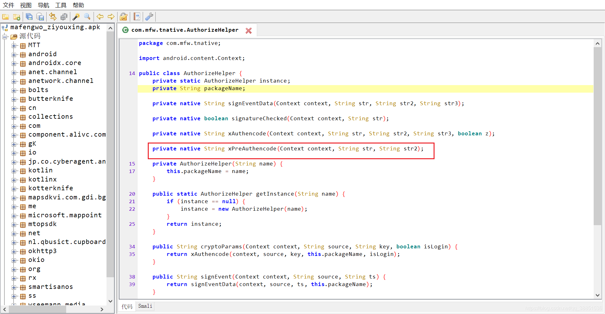

xPreAuthencode是目标方法，它接收三个参数

参数1是一个context，参数2是输入的明文，参数3是app的包名，返回值是40位的十六进制数。

Frida主动调用测试样本，参数2设为"r0ysue"，参数3设为"com.mfw.roadbook"，输出：

57c043fe945355a64cb9c3d75db4bd767d1bbccb

## Unidbg模拟执行

老规矩，先搭一下架子

```
package com.lession4;

import com.github.unidbg.linux.android.dvm.AbstractJni;
import com.github.unidbg.AndroidEmulator;
import com.github.unidbg.Module;
import com.github.unidbg.linux.android.AndroidEmulatorBuilder;
import com.github.unidbg.linux.android.AndroidResolver;
import com.github.unidbg.linux.android.dvm.*;
import com.github.unidbg.linux.android.dvm.array.ByteArray;
import com.github.unidbg.memory.Memory;
import java.io.File;
import java.nio.charset.StandardCharsets;
import java.util.ArrayList;
import java.util.List;

public class mfw extends AbstractJni{
    private final AndroidEmulator emulator;
    private final VM vm;
    private final Module module;

    mfw() {
        emulator = AndroidEmulatorBuilder.for32Bit().setProcessName("com.mfw.roadbook").build(); // 创建模拟器实例
        final Memory memory = emulator.getMemory(); // 模拟器的内存操作接口
        memory.setLibraryResolver(new AndroidResolver(23)); // 设置系统类库解析
        vm = emulator.createDalvikVM(new File("unidbg-android\\src\\test\\java\\com\\lession4\\mafengwo_ziyouxing.apk")); // 创建Android虚拟机
        DalvikModule dm = vm.loadLibrary(new File("unidbg-android\\src\\test\\java\\com\\lession4\\libmfw.so"), true); // 加载so到虚拟内存
        module = dm.getModule(); //获取本SO模块的句柄

        vm.setJni(this);
        vm.setVerbose(true);
        dm.callJNI_OnLoad(emulator);
    };

    public static void main(String[] args) throws Exception {
        mfw test = new mfw();
    }
}
```

运行


```
RegisterNative(com/mfw/tnative/AuthorizeHelper, xPreAuthencode(Landroid/content/Context;Ljava/lang/String;Ljava/lang/String;)Ljava/lang/String;, RX@0x4002e301[libmfw.so]0x2e301)
```

JNI_OnLoad运行成功，我们的目标方法其地址是0x2e301，传入的三个参数是String或者context，都是前文讲过的类型，不做赘述。

```
package com.lession4;

import com.github.unidbg.linux.android.dvm.AbstractJni;
import com.github.unidbg.AndroidEmulator;
import com.github.unidbg.Module;
import com.github.unidbg.linux.android.AndroidEmulatorBuilder;
import com.github.unidbg.linux.android.AndroidResolver;
import com.github.unidbg.linux.android.dvm.*;
import com.github.unidbg.memory.Memory;
import java.io.File;
import java.util.ArrayList;
import java.util.List;

public class mfw extends AbstractJni{
    private final AndroidEmulator emulator;
    private final VM vm;
    private final Module module;

    mfw() {
        emulator = AndroidEmulatorBuilder.for32Bit().setProcessName("com.mfw.roadbook").build(); // 创建模拟器实例
        final Memory memory = emulator.getMemory(); // 模拟器的内存操作接口
        memory.setLibraryResolver(new AndroidResolver(23)); // 设置系统类库解析
        vm = emulator.createDalvikVM(new File("unidbg-android\\src\\test\\java\\com\\lession4\\mafengwo_ziyouxing.apk")); // 创建Android虚拟机
        DalvikModule dm = vm.loadLibrary(new File("unidbg-android\\src\\test\\java\\com\\lession4\\libmfw.so"), true); // 加载so到虚拟内存
        module = dm.getModule(); //获取本SO模块的句柄

        vm.setJni(this);
        vm.setVerbose(true);
        dm.callJNI_OnLoad(emulator);
    };

    public String xPreAuthencode(){
        List<Object> list = new ArrayList<>(10);
        list.add(vm.getJNIEnv()); // 第一个参数是env
        list.add(0); // 第二个参数，实例方法是jobject，静态方法是jclazz，直接填0，一般用不到。
        Object custom = null;
        DvmObject<?> context = vm.resolveClass("android/content/Context").newObject(custom);// context
        list.add(vm.addLocalObject(context));
        list.add(vm.addLocalObject(new StringObject(vm, "r0ysue")));
        list.add(vm.addLocalObject(new StringObject(vm, "com.mfw.roadbook")));

        Number number = module.callFunction(emulator, 0x2e301, list.toArray())[0];
        String result = vm.getObject(number.intValue()).getValue().toString();
        return result;
    }

    public static void main(String[] args) throws Exception {
        mfw test = new mfw();
        System.out.println(test.xPreAuthencode());
    }
}
```

运行

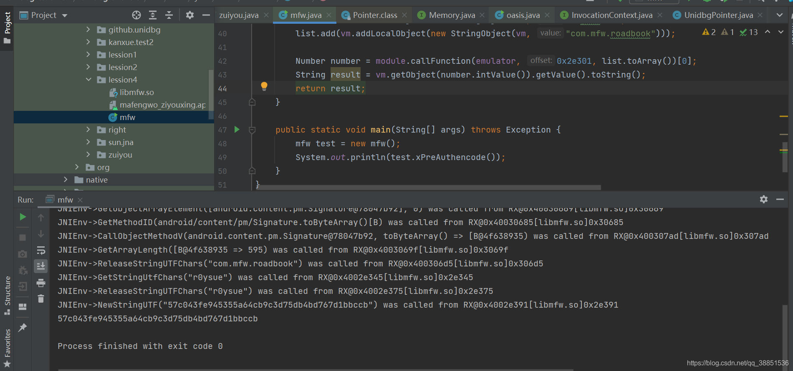

我们惊喜的发现，由于该样本中没有太多和JAVA层的交互，直接就顺利跑出了结果！但是呢，跑出算法并不是本篇的重点，让我们继续往下看。

## 算法还原

测试发现，不论输入明文多长，都输出固定长度结果，所以疑似哈希算法，又因为输出恒为40位，所以又疑似哈希算法中的SHA1算法。

首先静态分析一下，根据地址，IDA中跳到0x2e301

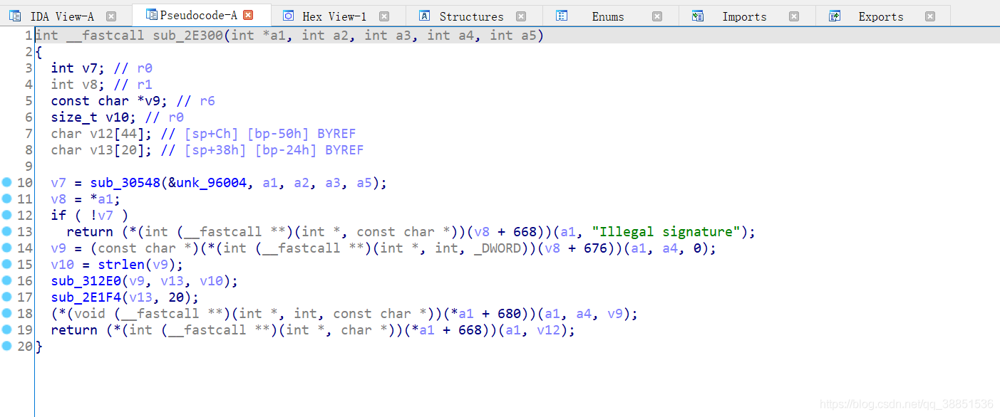

对入参做一下重命名和调整


sub_30548是一个签名校验函数，做出这种判断的原因有很多点

-   参数是context上下文和包名
-   返回值为false时，整个JNI函数返回"illegal signature"（非法签名）。

但我们在用Unidbg模拟执行时，并没有感受到native调用JAVA签名校验的烦恼，这是因为我们传入了APK，Unidbg替我们处理了这部分签名校验，但Unidbg并不能处理所有情况下的签名校验，所以在之前的一些例子里，我们会patch掉签名校验函数。

对JNI函数做进一步的注释

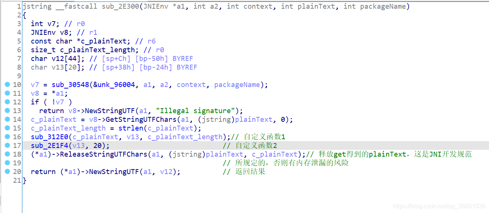

加密逻辑一定在sub_312E0或者sub_2e1f4中，自上而下先看sub_2E1F4，它参数1是输入的明文，参数3是明文长度，那参数2呢？和上一篇的样本一样，是buffer，v13的定义也可以看出，v13[20]，什么都没做，直接放函数中。

使用HookZz 在函数进入前Hook参数1和参数3，函数出去后Hook 参数2。

```
public void hook_312E0(){
    // 获取HookZz对象
    IHookZz hookZz = HookZz.getInstance(emulator); // 加载HookZz，支持inline hook，文档看https://github.com/jmpews/HookZz
    // enable hook
    hookZz.enable_arm_arm64_b_branch(); // 测试enable_arm_arm64_b_branch，可有可无
    // hook MDStringOld
    hookZz.wrap(module.base + 0x312E0 + 1, new WrapCallback<HookZzArm32RegisterContext>() { // inline wrap导出函数
        @Override
        // 方法执行前
        public void preCall(Emulator<?> emulator, HookZzArm32RegisterContext ctx, HookEntryInfo info) {
            Pointer input = ctx.getPointerArg(0);
            byte[] inputhex = input.getByteArray(0, ctx.getR2Int());
            Inspector.inspect(inputhex, "input");

            Pointer out = ctx.getPointerArg(1);
            ctx.push(out);
        };

        @Override
        // 方法执行后
        public void postCall(Emulator<?> emulator, HookZzArm32RegisterContext ctx, HookEntryInfo info) {
            Pointer output = ctx.pop();
            byte[] outputhex = output.getByteArray(0, 20);
            Inspector.inspect(outputhex, "output");
        }
    });
    hookZz.disable_arm_arm64_b_branch();
};
```

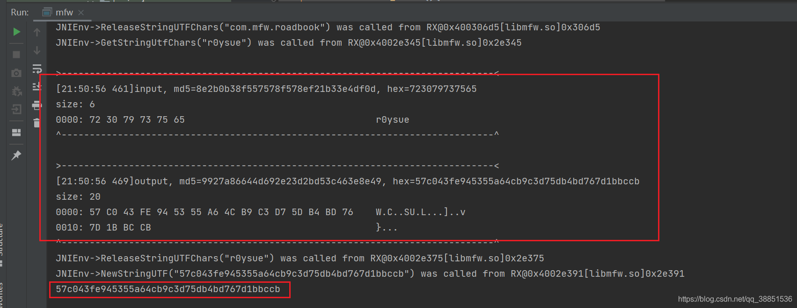

参数正是我们输入的明文，返回值就是最终结果，所以我们只用关注这个函数即可。

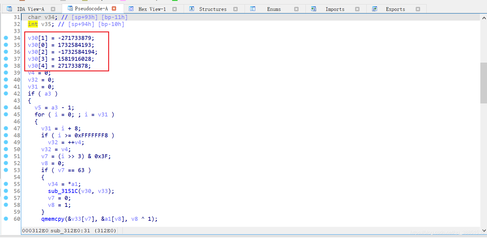

数值上按H转成十六进制

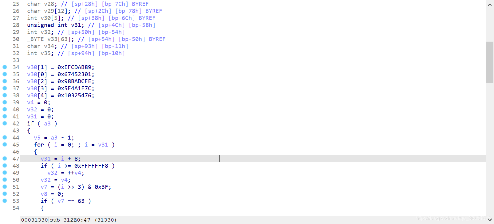

疑似SHA1算法，看一下标准的魔数


可以发现，IV的第四个和第五个被改变了。

接下来我们依照样本中的IV，对标准算法进行修改和验证

```
# 0xffffffff is used to make sure numbers dont go over 32

def chunks(messageLength, chunkSize):
    chunkValues = []
    for i in range(0, len(messageLength), chunkSize):
        chunkValues.append(messageLength[i:i + chunkSize])

    return chunkValues


def leftRotate(chunk, rotateLength):
    return ((chunk << rotateLength) | (chunk >> (32 - rotateLength))) & 0xffffffff


def sha1Function(message):
    # initial hash values
    h0 = 0x67452301
    h1 = 0xEFCDAB89
    h2 = 0x98BADCFE
    h3 = 0x5E4A1F7C
    h4 = 0x10325476

    messageLength = ""

    # preprocessing
    for char in range(len(message)):
        messageLength += '{0:08b}'.format(ord(message[char]))

    temp = messageLength
    messageLength += '1'

    while (len(messageLength) % 512 != 448):
        messageLength += '0'

    messageLength += '{0:064b}'.format(len(temp))
    chunk = chunks(messageLength, 512)

    for eachChunk in chunk:
        words = chunks(eachChunk, 32)
        w = [0] * 80
        for n in range(0, 16):
            w[n] = int(words[n], 2)

        for i in range(16, 80):
            # sha1
            # w[i] = leftRotate((w[i - 3] ^ w[i - 8] ^ w[i - 14] ^ w[i - 16]), 1)
            # sha0
            w[i] = (w[i - 3] ^ w[i - 8] ^ w[i - 14] ^ w[i - 16])

            # Initialize hash value for this chunk:
        a = h0
        b = h1
        c = h2
        d = h3
        e = h4

        # main loop:
        for i in range(0, 80):
            if 0 <= i <= 19:
                f = (b & c) | ((~b) & d)
                k = 0x5A827999

            elif 20 <= i <= 39:
                f = b ^ c ^ d
                k = 0x6ED9EBA1

            elif 40 <= i <= 59:
                f = (b & c) | (b & d) | (c & d)
                k = 0x8F1BBCDC

            elif 60 <= i <= 79:
                f = b ^ c ^ d
                k = 0xCA62C1D6

            a, b, c, d, e = ((leftRotate(a, 5) + f + e + k + w[i]) & 0xffffffff, a, leftRotate(b, 30), c, d)

        h0 = h0 + a & 0xffffffff
        h1 = h1 + b & 0xffffffff
        h2 = h2 + c & 0xffffffff
        h3 = h3 + d & 0xffffffff
        h4 = h4 + e & 0xffffffff

    return '%08x%08x%08x%08x%08x' % (h0, h1, h2, h3, h4)


plainText = "r0ysue"
sha1Hash = sha1Function(plainText)
print(sha1Hash)
```

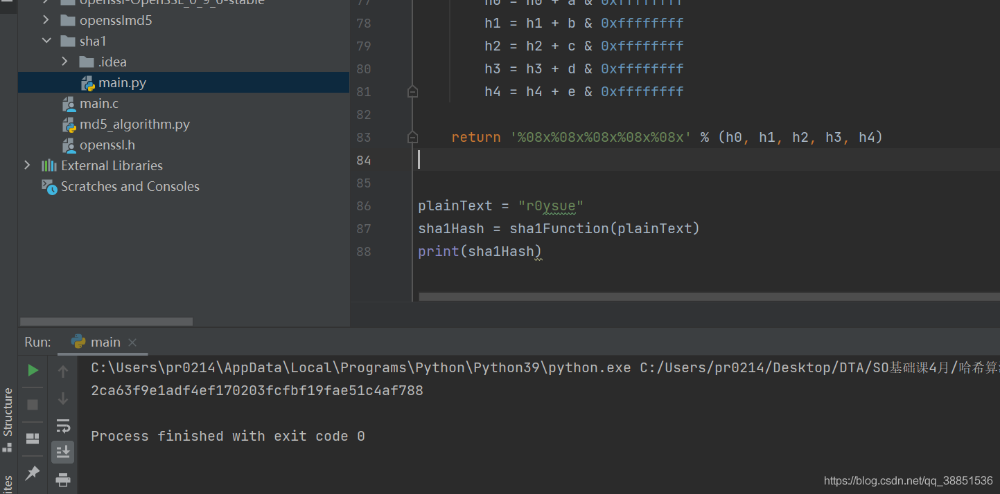

遗憾的是，这次结果并没有一致！换而言之，我们遇到了对算法的真正魔改，而非只是上节课那般，修改一下IV!

我们该如何在几百行代码中，找到魔改在何方呢？重命名一下入参，看一下此处的代码。

```
int __fastcall sub_312E0(char *input, int output, int Length)
{
  int v4; // r0
  int v5; // r4
  unsigned int i; // r1
  int v7; // r0
  int v8; // r3
  int v9; // r1
  unsigned int j; // r2
  unsigned int v11; // r0
  unsigned int v12; // r4
  int v13; // r3
  int v14; // r0
  int v15; // r2
  unsigned int v16; // r5
  int v17; // r2
  int v18; // r0
  int v19; // r4
  int v20; // r0
  int v21; // r0
  int v22; // r4
  int v23; // r3
  int k; // r0
  int v27; // [sp+20h] [bp-84h]
  char v28; // [sp+28h] [bp-7Ch] BYREF
  char v29[12]; // [sp+2Ch] [bp-78h] BYREF
  int v30[5]; // [sp+38h] [bp-6Ch] BYREF
  unsigned int v31; // [sp+4Ch] [bp-58h]
  int v32; // [sp+50h] [bp-54h]
  unsigned __int8 v33[63]; // [sp+54h] [bp-50h] BYREF
  char v34; // [sp+93h] [bp-11h]
  int v35; // [sp+94h] [bp-10h]

  v30[1] = 0xEFCDAB89;
  v30[0] = 0x67452301;
  v30[2] = 0x98BADCFE;
  v30[3] = 0x5E4A1F7C;
  v30[4] = 0x10325476;
  v4 = 0;
  v32 = 0;
  v31 = 0;
  if ( Length )
  {
    v5 = Length - 1;
    for ( i = 0; ; i = v31 )
    {
      v31 = i + 8;
      if ( i >= 0xFFFFFFF8 )
        v32 = ++v4;
      v32 = v4;
      v7 = (i >> 3) & 0x3F;
      v8 = 0;
      if ( v7 == 63 )
      {
        v34 = *input;
        sub_3151C(v30, v33);
        v7 = 0;
        v8 = 1;
      }
      qmemcpy(&v33[v7], &input[v8], v8 ^ 1);
      if ( !v5 )
        break;
      --v5;
      ++input;
      v4 = v32;
    }
  }
  v9 = 0;
  for ( j = 0; j != 8; ++j )
  {
    v29[j] = (unsigned int)v30[(j < 4) + 5] >> (~(_BYTE)v9 & 0x18);
    v9 += 8;
  }
  v28 = 0x80;
  v11 = v31;
  v12 = v31 + 8;
  v31 += 8;
  v13 = v32;
  if ( v11 >= 0xFFFFFFF8 )
    v13 = ++v32;
  v32 = v13;
  v14 = (v11 >> 3) & 0x3F;
  v15 = 0;
  if ( v14 == 63 )
  {
    v34 = 0x80;
    sub_3151C(v30, v33);
    v14 = 0;
    v15 = 1;
    v12 = v31;
  }
  qmemcpy(&v33[v14], (const void *)((unsigned int)&v28 | v15), v15 ^ 1);
  if ( (v12 & 0x1F8) == 448 )
  {
    v16 = v12;
  }
  else
  {
    v16 = v12;
    do
    {
      v17 = 0;
      v28 = 0;
      v16 += 8;
      v31 = v16;
      v18 = v32;
      if ( v12 >= 0xFFFFFFF8 )
        v18 = ++v32;
      v32 = v18;
      v19 = (v12 >> 3) & 0x3F;
      if ( v19 == 63 )
      {
        v19 = 0;
        v34 = 0;
        sub_3151C(v30, v33);
        v16 = v31;
        v17 = 1;
      }
      qmemcpy(&v33[v19], (const void *)((unsigned int)&v28 | v17), v17 ^ 1);
      v12 = v16;
    }
    while ( (v16 & 0x1F8) != 448 );
  }
  v31 = v16 + 64;
  v20 = v32;
  if ( v16 >= 0xFFFFFFC0 )
    v20 = ++v32;
  v32 = v20;
  v21 = (v16 >> 3) & 0x3F;
  v22 = 0;
  if ( (unsigned int)(v21 + 8) < 0x40 )
  {
    v23 = 0;
  }
  else
  {
    v27 = 64 - v21;
    qmemcpy(&v33[v21], v29, 64 - v21);
    sub_3151C(v30, v33);
    v23 = v27;
    v21 = 0;
  }
  qmemcpy(&v33[v21], &v29[v23], 8 - v23);
  for ( k = 0; k != 20; ++k )
  {
    *(_BYTE *)(output + k) = *(unsigned int *)((char *)v30 + (k & 0xFFFFFFFC)) >> (~(_BYTE)v22 & 0x18);
    v22 += 8;
  }
  return _stack_chk_guard - v35;
}
```

在代码中多次出现sub_3151C，点进去看一下

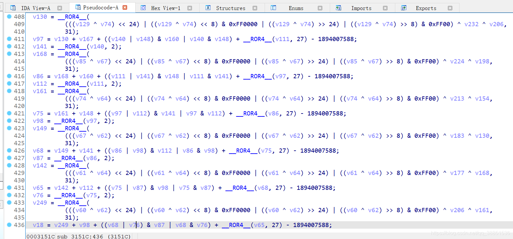

代码量五六百行，应该就是函数的运算部分。加上前面的部分，总共七八百行代码，那么我们该如何找魔改发生在何处呢？甚至？它是不是没魔改算法流程，而是在标准运算结束后，和某个KEY做了异或？

这个问题的解决办法依赖于对哈希算法流程的深度理解，感兴趣的可以看一下SO基础课中关于密码学原理与实现的部分或者康康Unidbg系列内容的视频课，文字想讲清楚不是一件容易的事。

一个哈希算法，可以简单划分成填充和加密两部分，直接Hook加密函数，看它的入参，依此判定填充部分是否发生过改变。

```
public void hook_3151C(){
    // 获取HookZz对象
    IHookZz hookZz = HookZz.getInstance(emulator); // 加载HookZz，支持inline hook，文档看https://github.com/jmpews/HookZz
    // enable hook
    hookZz.enable_arm_arm64_b_branch(); // 测试enable_arm_arm64_b_branch，可有可无
    // hook MDStringOld
    hookZz.wrap(module.base + 0x3151C + 1, new WrapCallback<HookZzArm32RegisterContext>() { // inline wrap导出函数
        @Override
        // 方法执行前
        public void preCall(Emulator<?> emulator, HookZzArm32RegisterContext ctx, HookEntryInfo info) {
            // 类似于Frida args[0]
            Pointer input = ctx.getPointerArg(0);
            byte[] inputhex = input.getByteArray(0, 20);
            Inspector.inspect(inputhex, "IV");

            Pointer text = ctx.getPointerArg(1);
            byte[] texthex = text.getByteArray(0, 64);
            Inspector.inspect(texthex, "block");
            ctx.push(input);
            ctx.push(text);
        };

        @Override
        // 方法执行后
        public void postCall(Emulator<?> emulator, HookZzArm32RegisterContext ctx, HookEntryInfo info) {
            Pointer text = ctx.pop();
            Pointer IV = ctx.pop();

            byte[] IVhex = IV.getByteArray(0, 20);
            Inspector.inspect(IVhex, "IV");

            byte[] outputhex = text.getByteArray(0, 64);
            Inspector.inspect(outputhex, "block out");

        }
    });
    hookZz.disable_arm_arm64_b_branch();
};
```

运行

```
[08:53:06 577]IV, md5=b70ca24521f790e6bf3c4a16ba868a03, hex=0123456789abcdeffedcba987c1f4a5e76543210
size: 20
0000: 01 23 45 67 89 AB CD EF FE DC BA 98 7C 1F 4A 5E    .#Eg........|.J^
0010: 76 54 32 10                                        vT2.
^-----------------------------------------------------------------------------^

>-----------------------------------------------------------------------------<
[08:53:06 578]block, md5=c8e3dfac5d04ac7fb62160cd976bb01c, hex=72307973756580000000000000000000000000000000000000000000000000000000000000000000000000000000000000000000000000000000000000000030
size: 64
0000: 72 30 79 73 75 65 80 00 00 00 00 00 00 00 00 00    r0ysue..........
0010: 00 00 00 00 00 00 00 00 00 00 00 00 00 00 00 00    ................
0020: 00 00 00 00 00 00 00 00 00 00 00 00 00 00 00 00    ................
0030: 00 00 00 00 00 00 00 00 00 00 00 00 00 00 00 30    ...............0
^-----------------------------------------------------------------------------^

>-----------------------------------------------------------------------------<
[08:53:06 592]IV, md5=eb8ea7f8f507f692ef0778f13a59a330, hex=fe43c057a6555394d7c3b94c76bdb45dcbbc1b7d
size: 20
0000: FE 43 C0 57 A6 55 53 94 D7 C3 B9 4C 76 BD B4 5D    .C.W.US....Lv..]
0010: CB BC 1B 7D                                        ...}
^-----------------------------------------------------------------------------^

>-----------------------------------------------------------------------------<
[08:53:06 592]block out, md5=c8e3dfac5d04ac7fb62160cd976bb01c, hex=72307973756580000000000000000000000000000000000000000000000000000000000000000000000000000000000000000000000000000000000000000030
size: 64
0000: 72 30 79 73 75 65 80 00 00 00 00 00 00 00 00 00    r0ysue..........
0010: 00 00 00 00 00 00 00 00 00 00 00 00 00 00 00 00    ................
0020: 00 00 00 00 00 00 00 00 00 00 00 00 00 00 00 00    ................
0030: 00 00 00 00 00 00 00 00 00 00 00 00 00 00 00 30    ...............0
^-----------------------------------------------------------------------------^
```

Hook结果反映了这样一个问题

**魔改的是算法本身，因为运算函数的入参是正常的、填充后的明文，所以不存在自定义填充、或者对明文做变换的可能，出参即是输出的结果，所以算法并不是在标准流程之后做了一些自定义步骤，它修改的——就是算法本身。**

那么这个时候就该考虑，SHA1算法的运算部分是由什么组成？SHA1和MD5采用了相同的结构，每512比特分组需要一轮运算，我们的输入长度不超过一个分组的长度，所以只用考虑一轮运算。一轮运算是80步，每隔20步是一种模式。

首先记录80步中，每一步正常情况下应该得出的结果

```
0x5e1444aa
0xecb6ad5e
0x4066d34
0xed08cc85
0xe8f28c34
0x237ebcb7
0xeecacf3d
0xaf1a9fa8
0x921750fc
0x4380efc5
0xff26c559
0xe3d49cd6
0x517dcdd6
0x22a2bc19
0x3eaf6dc2
0x4891169b
0x20c32ce1
0x8556c446
0xdd2c894f
0x5420ba17
0x6ec4e797
0x91e5d34b
0xba26ad8
0xef34ad50
0xd1126575
0x7dd310e7
0x6b52d1f9
0xe7768a2
0xac273146
0x694146b8
0xebe5e627
0xfa712f50
0x10bfabc0
0x4cb1379b
0x665c4398
0xb2b46868
0x2ac8a949
0xb65eae61
0x3524a2e5
0x72ac7756
0x7f0e6c94
0x2928a555
0x7ed33fde
0x46a8f7fc
0x66ff0f01
0x52cfa822
0x4b18fa72
0xe39f852e
0xe0a3043a
0x9729af47
0xc142ad63
0x77c7096f
0x94602ecb
0x3e7202e5
0x89c7a8f2
0xbd2782bb
0xe6f058a3
0x8ca5906
0xe5cb4077
0x4a238672
0xe93aa2e
0xcf4dd760
0x111f600f
0x3853e9bf
0x7e375ab5
0xe4ba4774
0x9e39f23
0x4041ea20
0x82265213
0x9f37f728
0x3adf0819
0x586ac5e9
0xe5675b10
0xfb192c0e
0xc885ea1b
0x30628c48
0x833f6da5
0x5d958b47
0x2b11a368
0xc5611c9d
```

接下来通过inline Hook的方式，验证样本中80步的结果，这个过程需要对加密算法的原理和编程实现都有非常深的了解才能完成


可以使用如下的方式用HookZz实现Inline hook

```
public void hook_315B0(){
    IHookZz hookZz = HookZz.getInstance(emulator);
    hookZz.enable_arm_arm64_b_branch();

    hookZz.instrument(module.base + 0x315B0 + 1, new InstrumentCallback<Arm32RegisterContext>() {
        @Override
        public void dbiCall(Emulator<?> emulator, Arm32RegisterContext ctx, HookEntryInfo info) { // 通过base+offset inline wrap内部函数，在IDA看到为sub_xxx那些
            System.out.println("R2:"+ctx.getR2Long());
        }
    });

}
```

但我们整体上需要进行十数次甚至数十次的inline hook，在这种情况下，用HookZz就略有些不方便，不妨试试Unidbg的console debugger。

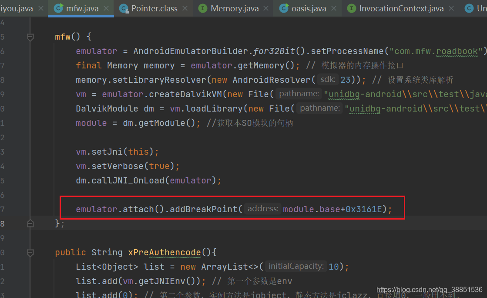


在这样一种重复的工作中我们发现，前16步，样本与标准算法的加密流程是一致的，从第17步开始分道扬镳。我们用Python代码来表示

标准流程的80步运算

```
for t in range(80):
    if t <= 19:
        K = 0x5a827999
        f = (b & c) ^ (~b & d)
    elif t <= 39:
        K = 0x6ed9eba1
        f = b ^ c ^ d
    elif t <= 59:
        K = 0x8f1bbcdc
        f = (b & c) ^ (b & d) ^ (c & d)
    else:
        K = 0xca62c1d6
        f = b ^ c ^ d
```

样本的80步运算

```
for t in range(80):
    if t <= 15:
        K = 0x5a827999
        f = (b & c) ^ (~b & d)
    elif t <= 19:
        K = 0x6ed9eba1
        f = b ^ c ^ d
    elif t <= 39:
        K = 0x8f1bbcdc
        f = (b & c) ^ (b & d) ^ (c & d)
    elif t <= 59:
        K = 0x5a827999
        f = (b & c) ^ (~b & d)
    else:
        K = 0xca62c1d6
        f = b ^ c ^ d
```

在标准流程中，20步切换一下K和非线性函数，一共4种模式，在样本中，每16步切换一下K和非线性函数，一种五种模式，但本质上依然是标准流程里的四个模式，因为一个模式用了两次。

验证结果，大功告成。

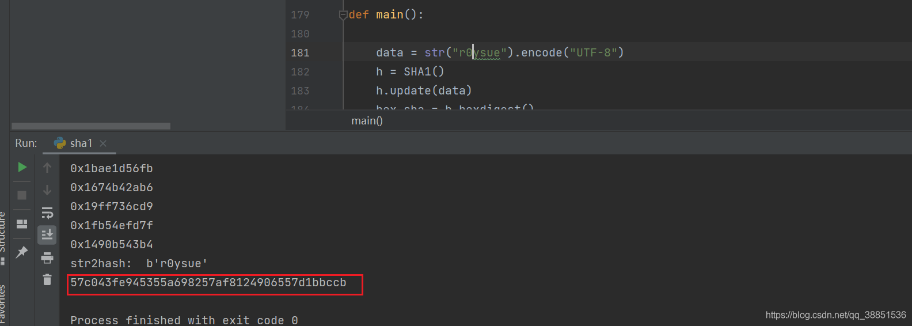

## 尾声

本篇的写作过程是很别扭的，加密算法是一个艰深的东西，想在有限的篇幅里讲解深度魔改加密算法的样本更是，这篇文章中所阐述的内容并不足以真正理解这个魔改样本。读者可以自行通过如下路径之一，获得对样本中魔改样本的真正的理解。

-   阅读SHA1 WIKI + 官方英文文档 + 手写一遍C实现
-   报我的课，看直播一起嘻嘻哈哈

除此之外，样本中还有一个魔改Hmac，嘤，大家可以学习和研究一下。

资料链接：[https://pan.baidu.com/s/1MHe0Oen6KKsdWru0YWTUzQ](https://pan.baidu.com/s/1MHe0Oen6KKsdWru0YWTUzQ)  
提取码：ro1x