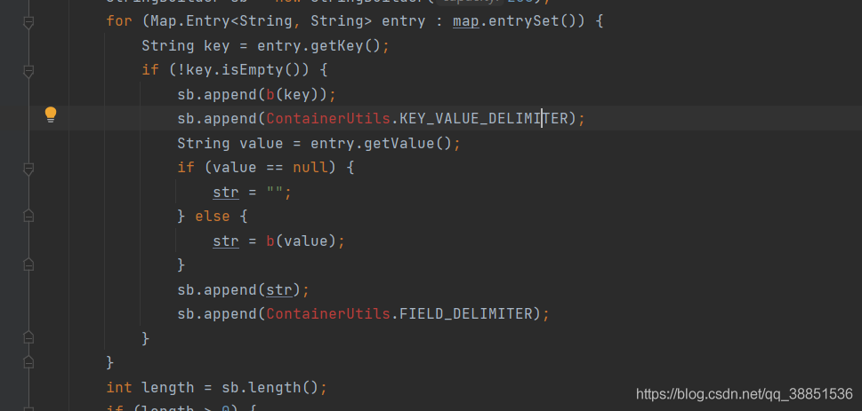

> 这篇文章上次修改于 773 天前，可能其部分内容已经发生变化，如有疑问可询问作者。

原文 -> [https://blog.csdn.net/qq_38851536/article/details/117923970](https://blog.csdn.net/qq_38851536/article/details/117923970)

___

## 前言

这是SO逆向入门实战教程的第六篇，总共会有十三篇，十三个实战

-   主要内容是简单JAVA环境的填补

## 准备


如图红框是我们的目标函数，入参是sortedMap接口的实现类对象，比如TreeMap对象，返回值是SignedQuery类对象


参数和返回值都比较特殊，不是我们前面处理过的基本类型和对象，所以举个例子，这是Frida 的callSign代码

```
// Call Sign 函数
function callsign() {
    Java.perform(function () {
        var ClassName = "com.bilibili.nativelibrary.LibBili";
        var Bilibili = Java.use(ClassName);
        var targetMethod = "s";

        var TreeMap = Java.use("java.util.TreeMap");
        var map = TreeMap.$new();

        map.put("ad_extra", "E1133C23F36571A3F1FDE6B325B17419AAD45287455E5292A19CF51300EAF0F2664C808E2C407FBD9E50BD48F8ED17334F4E2D3A07153630BF62F10DC5E53C42E32274C6076A5593C23EE6587F453F57B8457654CB3DCE90FAE943E2AF5FFAE78E574D02B8BBDFE640AE98B8F0247EC0970D2FD46D84B958E877628A8E90F7181CC16DD22A41AE9E1C2B9CB993F33B65E0B287312E8351ADC4A9515123966ACF8031FF4440EC4C472C78C8B0C6C8D5EA9AB9E579966AD4B9D23F65C40661A73958130E4D71F564B27C4533C14335EA64DD6E28C29CD92D5A8037DCD04C8CCEAEBECCE10EAAE0FAC91C788ECD424D8473CAA67D424450431467491B34A1450A781F341ABB8073C68DBCCC9863F829457C74DBD89C7A867C8B619EBB21F313D3021007D23D3776DA083A7E09CBA5A9875944C745BB691971BFE943BD468138BD727BF861869A68EA274719D66276BD2C3BB57867F45B11D6B1A778E7051B317967F8A5EAF132607242B12C9020328C80A1BBBF28E2E228C8C7CDACD1F6CC7500A08BA24C4B9E4BC9B69E039216AA8B0566B0C50A07F65255CE38F92124CB91D1C1C39A3C5F7D50E57DCD25C6684A57E1F56489AE39BDBC5CFE13C540CA025C42A3F0F3DA9882F2A1D0B5B1B36F020935FD64D58A47EF83213949130B956F12DB92B0546DADC1B605D9A3ED242C8D7EF02433A6C8E3C402C669447A7F151866E66383172A8A846CE49ACE61AD00C1E42223");
        map.put("appkey", "1d8b6e7d45233436");
        map.put("autoplay_card","11");
        map.put("banner_hash","10687342131252771522");
        map.put("build","6180500");
        map.put("c_locale","zh_CN");
        map.put("channel","shenma117");
        map.put("column","2");
        map.put("device_name","MIX2S");
        map.put("device_type","0");
        map.put("flush","6");
        map.put("ts","1612693177");

        var result = Bilibili.s(map);
        // 打印结果，不需要做什么额外处理，这儿会隐式调用toString
        console.log("\n返回结果：",result);
        return result;
    });
}
```

我们传入了一个treemap对象，返回SignedQuery对象，后续App通过调用其toString方法使用


## undibg模拟执行

首先搭一个架子

```
package com.lession6;

import com.github.unidbg.AndroidEmulator;
import com.github.unidbg.Module;
import com.github.unidbg.linux.android.AndroidEmulatorBuilder;
import com.github.unidbg.linux.android.AndroidResolver;
import com.github.unidbg.linux.android.dvm.*;
import com.github.unidbg.memory.Memory;

import java.io.File;

public class LibBili extends AbstractJni{
    private final AndroidEmulator emulator;
    private final VM vm;
    private final Module module;

    LibBili(){
        emulator = AndroidEmulatorBuilder.for32Bit().setProcessName("com.bilibili.app").build(); // 创建模拟器实例
        final Memory memory = emulator.getMemory(); // 模拟器的内存操作接口
        memory.setLibraryResolver(new AndroidResolver(23)); // 设置系统类库解析

        vm = emulator.createDalvikVM(new File("unidbg-android\\src\\test\\java\\com\\lession6\\bilibili.apk")); // 创建Android虚拟机
        vm.setJni(this);
        vm.setVerbose(true); // 设置是否打印Jni调用细节
        DalvikModule dm = vm.loadLibrary(new File("unidbg-android\\src\\test\\java\\com\\lession6\\libbili.so"), true);
        module = dm.getModule(); //
        dm.callJNI_OnLoad(emulator);
    }

    public static void main(String[] args){
        LibBili test = new LibBili();
    }
}
```

运行没问题


接下来考虑参数如何构造**treemap**

```
public void s(){
    TreeMap<String, String> keymap = new TreeMap<String, String>();
    keymap.put("ad_extra", "E1133C23F36571A3F1FDE6B325B17419AAD45287455E5292A19CF51300EAF0F2664C808E2C407FBD9E50BD48F8ED17334F4E2D3A07153630BF62F10DC5E53C42E32274C6076A5593C23EE6587F453F57B8457654CB3DCE90FAE943E2AF5FFAE78E574D02B8BBDFE640AE98B8F0247EC0970D2FD46D84B958E877628A8E90F7181CC16DD22A41AE9E1C2B9CB993F33B65E0B287312E8351ADC4A9515123966ACF8031FF4440EC4C472C78C8B0C6C8D5EA9AB9E579966AD4B9D23F65C40661A73958130E4D71F564B27C4533C14335EA64DD6E28C29CD92D5A8037DCD04C8CCEAEBECCE10EAAE0FAC91C788ECD424D8473CAA67D424450431467491B34A1450A781F341ABB8073C68DBCCC9863F829457C74DBD89C7A867C8B619EBB21F313D3021007D23D3776DA083A7E09CBA5A9875944C745BB691971BFE943BD468138BD727BF861869A68EA274719D66276BD2C3BB57867F45B11D6B1A778E7051B317967F8A5EAF132607242B12C9020328C80A1BBBF28E2E228C8C7CDACD1F6CC7500A08BA24C4B9E4BC9B69E039216AA8B0566B0C50A07F65255CE38F92124CB91D1C1C39A3C5F7D50E57DCD25C6684A57E1F56489AE39BDBC5CFE13C540CA025C42A3F0F3DA9882F2A1D0B5B1B36F020935FD64D58A47EF83213949130B956F12DB92B0546DADC1B605D9A3ED242C8D7EF02433A6C8E3C402C669447A7F151866E66383172A8A846CE49ACE61AD00C1E42223");
    keymap.put("appkey", "1d8b6e7d45233436");
    keymap.put("autoplay_card", "11");
    keymap.put("banner_hash", "10687342131252771522");
    keymap.put("build", "6180500");
    keymap.put("c_locale", "zh_CN");
    keymap.put("channel", "shenma117");
    keymap.put("column", "2");
    keymap.put("device_name", "MIX2S");
    keymap.put("device_type", "0");
    keymap.put("flush", "6");
    keymap.put("ts", "1612693177");
};
```

该怎么使用这个treemap呢？

在先前，我们遇到过字节数组

```
String input = "aid=01A-khBWIm48A079Pz_DMW6PyZR8" +
    "uyTumcCNm4e8awxyC2ANU.&cfrom=28B529501" +
    "0&cuid=5999578300&noncestr=46274W9279Hr1" +
    "X49A5X058z7ZVz024&platform=ANDROID&timestamp" +
    "=1621437643609&ua=Xiaomi-MIX2S__oasis__3.5.8_" +
    "_Android__Android10&version=3.5.8&vid=10190135" +
    "94003&wm=20004_90024";
byte[] inputByte = input.getBytes(StandardCharsets.UTF_8);
ByteArray inputByteArray = new ByteArray(vm,inputByte);
```

ByteArray是Unidbg对字节数组的封装，除此之外还有StringObject等，那么treemap呢？

我们可以照着StringObject重新写一个，也可以不这么麻烦，直接返回一个“空壳”，Native中对treemap做了操作再补对应的方法，这样比较经济实惠

需要注意的是，代码中补齐了treeMap的继承关系：map→AbstractMap→TreeMap，这么做是必要的，否则在有些情况下会报错，具体讨论此处略过

```
public void s(){
    List<Object> list = new ArrayList<>(10);
    list.add(vm.getJNIEnv()); // 第一个参数是env
    list.add(0); // 第二个参数，实例方法是jobject，静态方法是jclazz，直接填0，一般用不到

    TreeMap<String, String> keymap = new TreeMap<String, String>();
    keymap.put("ad_extra", "E1133C23F36571A3F1FDE6B325B17419AAD45287455E5292A19CF51300EAF0F2664C808E2C407FBD9E50BD48F8ED17334F4E2D3A07153630BF62F10DC5E53C42E32274C6076A5593C23EE6587F453F57B8457654CB3DCE90FAE943E2AF5FFAE78E574D02B8BBDFE640AE98B8F0247EC0970D2FD46D84B958E877628A8E90F7181CC16DD22A41AE9E1C2B9CB993F33B65E0B287312E8351ADC4A9515123966ACF8031FF4440EC4C472C78C8B0C6C8D5EA9AB9E579966AD4B9D23F65C40661A73958130E4D71F564B27C4533C14335EA64DD6E28C29CD92D5A8037DCD04C8CCEAEBECCE10EAAE0FAC91C788ECD424D8473CAA67D424450431467491B34A1450A781F341ABB8073C68DBCCC9863F829457C74DBD89C7A867C8B619EBB21F313D3021007D23D3776DA083A7E09CBA5A9875944C745BB691971BFE943BD468138BD727BF861869A68EA274719D66276BD2C3BB57867F45B11D6B1A778E7051B317967F8A5EAF132607242B12C9020328C80A1BBBF28E2E228C8C7CDACD1F6CC7500A08BA24C4B9E4BC9B69E039216AA8B0566B0C50A07F65255CE38F92124CB91D1C1C39A3C5F7D50E57DCD25C6684A57E1F56489AE39BDBC5CFE13C540CA025C42A3F0F3DA9882F2A1D0B5B1B36F020935FD64D58A47EF83213949130B956F12DB92B0546DADC1B605D9A3ED242C8D7EF02433A6C8E3C402C669447A7F151866E66383172A8A846CE49ACE61AD00C1E42223");
    keymap.put("appkey", "1d8b6e7d45233436");
    keymap.put("autoplay_card", "11");
    keymap.put("banner_hash", "10687342131252771522");
    keymap.put("build", "6180500");
    keymap.put("c_locale", "zh_CN");
    keymap.put("channel", "shenma117");
    keymap.put("column", "2");
    keymap.put("device_name", "MIX2S");
    keymap.put("device_type", "0");
    keymap.put("flush", "6");
    keymap.put("ts", "1612693177");

    DvmClass Map = vm.resolveClass("java/util/Map");
    DvmClass AbstractMap = vm.resolveClass("java/util/AbstractMap",Map);
    DvmObject<?> input_map = vm.resolveClass("java/util/TreeMap", AbstractMap).newObject(keymap);
    list.add(vm.addLocalObject(input_map));
    Number number = module.callFunction(emulator, 0x1c97, list.toArray())[0];
    DvmObject result = vm.getObject(number.intValue());
};
```

可以发现，我们并没有对返回值做什么处理，因为SignedQuery对象，还没想好怎么处理

运行测试


补JNI环境

```
@Override
public boolean callBooleanMethod(BaseVM vm, DvmObject<?> dvmObject, String signature, VarArg varArg) {
    if ("java/util/Map->isEmpty()Z".equals(signature)) {
        TreeMap<String, String> treeMap = (TreeMap<String, String>)dvmObject.getValue();
        return treeMap.isEmpty();
    }
    return super.callBooleanMethod(vm, dvmObject, signature, varArg);
}
```

报错，补下一个JAVA环境


```
@Override
public DvmObject<?> callObjectMethod(BaseVM vm, DvmObject<?> dvmObject, String signature, VarArg varArg)         {
    switch (signature) {
        case "java/util/Map->get(Ljava/lang/Object;)Ljava/lang/Object;":
            StringObject keyobject = varArg.getObjectArg(0);
            String key = keyobject.getValue();
            TreeMap<String, String> treeMap = (TreeMap<String, String>)dvmObject.getValue();
            String value = treeMap.get(key);
            return new StringObject(vm, value);
    }
    return super.callObjectMethod(vm, dvmObject, signature, varArg);
    }
```

继续往下


看一下JADX


我们可以直接Hook返回对应结果，但硬编码显然不合理，参数一变结果就不同，怎么能硬编码呢？

新建一个util工具类，负责补充这个方法以及后续可能出现的各种方法


先把飘红的库导一下，导完还有这些有问题


TextUtils是Android中的工具类，既然只是想判断字符串是否为空，那不用它也没什么



b方法是什么？Jadx中看一下


把b方法以及对应的c方法也放进来，导入对应类库，这是什么？


Jadx中看一下


除此之外还有a方法报错了，不断copy jadx代码补过来

cv.m是什么？原来是15

这是最后补好的样子

```
package com.lession6;

import java.nio.charset.StandardCharsets;
import java.util.Map;
import java.util.SortedMap;
import java.util.TreeMap;

public class utils {

    private static final char[] f14934c = "0123456789ABCDEF".toCharArray();

    public static final String KEY_VALUE_DELIMITER = "=";
    public static final String FIELD_DELIMITER = "&";

    private static boolean a(char c2, String str) {
        return (c2 >= 'A' && c2 <= 'Z') || (c2 >= 'a' && c2 <= 'z') || !((c2 < '0' || c2 > '9') && "-_.~".indexOf(c2) == -1 && (str == null || str.indexOf(c2) == -1));
    }

    static String r(Map<String, String> map) {
        String str;
        if (!(map instanceof SortedMap)) {
            map = new TreeMap(map);
        }
        StringBuilder sb = new StringBuilder(256);
        for (Map.Entry<String, String> entry : map.entrySet()) {
            String key = entry.getKey();
            if (!key.isEmpty()) {
                sb.append(b(key));
                sb.append(KEY_VALUE_DELIMITER);
                String value = entry.getValue();
                if (value == null) {
                    str = "";
                } else {
                    str = b(value);
                }
                sb.append(str);
                sb.append(FIELD_DELIMITER);
            }
        }
        int length = sb.length();
        if (length > 0) {
            sb.deleteCharAt(length - 1);
        }
        if (length == 0) {
            return null;
        }
        return sb.toString();
    }

    static String b(String str) {
        return c(str, null);
    }

    static String c(String str, String str2) {
        StringBuilder sb = null;
        if (str == null) {
            return null;
        }
        int length = str.length();
        int i2 = 0;
        while (i2 < length) {
            int i3 = i2;
            while (i3 < length && a(str.charAt(i3), str2)) {
                i3++;
            }
            if (i3 != length) {
                if (sb == null) {
                    sb = new StringBuilder();
                }
                if (i3 > i2) {
                    sb.append((CharSequence) str, i2, i3);
                }
                i2 = i3 + 1;
                while (i2 < length && !a(str.charAt(i2), str2)) {
                    i2++;
                }
                byte[] bytes = str.substring(i3, i2).getBytes(StandardCharsets.UTF_8);
                int length2 = bytes.length;
                for (int i4 = 0; i4 < length2; i4++) {
                    sb.append('%');
                    sb.append(f14934c[(bytes[i4] & 240) >> 4]);
                    sb.append(f14934c[bytes[i4] & 15]);
                }
            } else if (i2 == 0) {
                return str;
            } else {
                sb.append((CharSequence) str, i2, length);
                return sb.toString();
            }
        }
        return sb == null ? str : sb.toString();
    }
}
```

补其实现

```
@Override
public DvmObject<?> callStaticObjectMethod(BaseVM vm, DvmClass dvmClass, String signature, VarArg varArg) {
    switch (signature){
        case "com/bilibili/nativelibrary/SignedQuery->r(Ljava/util/Map;)Ljava/lang/String;":{
            DvmObject<?> mapObject = varArg.getObjectArg(0);
            TreeMap<String, String> mymap = (TreeMap<String, String>) mapObject.getValue();
            String result = utils.r(mymap);
            return new StringObject(vm, result);
        }
    }
    return super.callStaticObjectMethod(vm, dvmClass, signature, varArg);
}
```

成功，继续往下跑，跳出新的错误


糟了，竟然让我们初始化一个SignedQuery对象...

不慌不慌，随便搞一个简化版的内部类给它用


```
    @Override
    public DvmObject<?> newObject(BaseVM vm, DvmClass dvmClass, String signature, VarArg varArg) {
        switch (signature) {
            case "com/bilibili/nativelibrary/SignedQuery-><init>(Ljava/lang/String;Ljava/lang/String;)V":
                StringObject stringObject1 = varArg.getObjectArg(0);
                StringObject stringObject2 = varArg.getObjectArg(1);
                String str1 = stringObject1.getValue();
                String str2 = stringObject2.getValue();
                return vm.resolveClass("com/bilibili/nativelibrary/SignedQuery").newObject(new SignedQuery(str1, str2));
        }

        return super.newObject(vm, dvmClass, signature, varArg);
    }

    public class SignedQuery {
        public final String a;
        public final String b;

        public SignedQuery(String str, String str2) {
            this.a = str;
            this.b = str2;
        }
    };
```

运行


我们发现结果已经跑出来了，返回一个对象

init中有两个参数，参数2就是sign

接下来我们考虑一个问题，在这个样本中，主要涉及的环境缺失是JAVA环境

具体地说，主要就是`com.bilibili.nativelibrary.SignedQuery`这个类的问题

那能不能直接JADX中复制这个类，直接拿过来用呢？

事实上，确实是可以的，Unidbg提供了另外一种模拟Native调用JAVA的方式——缺啥补啥，其原理是JAVA的反射

另起炉灶，新建Bilibili1

```
package com.lession6;

import com.github.unidbg.AndroidEmulator;
import com.github.unidbg.Module;
import com.github.unidbg.linux.android.AndroidEmulatorBuilder;
import com.github.unidbg.linux.android.AndroidResolver;
import com.github.unidbg.linux.android.dvm.*;
import com.github.unidbg.linux.android.dvm.jni.ProxyClassFactory;
import com.github.unidbg.memory.Memory;

import java.io.File;
import java.util.ArrayList;
import java.util.List;
import java.util.TreeMap;

public class LibBili1 {
    private final AndroidEmulator emulator;
    private final VM vm;
    private final Module module;

    LibBili1(){
        emulator = AndroidEmulatorBuilder.for32Bit().setProcessName("com.bilibili.app").build(); // 创建模拟器实例
        final Memory memory = emulator.getMemory(); // 模拟器的内存操作接口
        memory.setLibraryResolver(new AndroidResolver(23)); // 设置系统类库解析

        vm = emulator.createDalvikVM(new File("unidbg-android\\src\\test\\java\\com\\lession6\\bilibili.apk")); // 创建Android虚拟机
        vm.setDvmClassFactory(new ProxyClassFactory());
        vm.setVerbose(true); // 设置是否打印Jni调用细节
        DalvikModule dm = vm.loadLibrary(new File("unidbg-android\\src\\test\\java\\com\\lession6\\libbili.so"), true);
        module = dm.getModule(); //
        dm.callJNI_OnLoad(emulator);
    }

    public void s(){
        List<Object> list = new ArrayList<>(10);
        list.add(vm.getJNIEnv()); // 第一个参数是env
        list.add(0); // 第二个参数，实例方法是jobject，静态方法是jclazz，直接填0，一般用不到

        TreeMap<String, String> keymap = new TreeMap<String, String>();
        keymap.put("ad_extra", "E1133C23F36571A3F1FDE6B325B17419AAD45287455E5292A19CF51300EAF0F2664C808E2C407FBD9E50BD48F8ED17334F4E2D3A07153630BF62F10DC5E53C42E32274C6076A5593C23EE6587F453F57B8457654CB3DCE90FAE943E2AF5FFAE78E574D02B8BBDFE640AE98B8F0247EC0970D2FD46D84B958E877628A8E90F7181CC16DD22A41AE9E1C2B9CB993F33B65E0B287312E8351ADC4A9515123966ACF8031FF4440EC4C472C78C8B0C6C8D5EA9AB9E579966AD4B9D23F65C40661A73958130E4D71F564B27C4533C14335EA64DD6E28C29CD92D5A8037DCD04C8CCEAEBECCE10EAAE0FAC91C788ECD424D8473CAA67D424450431467491B34A1450A781F341ABB8073C68DBCCC9863F829457C74DBD89C7A867C8B619EBB21F313D3021007D23D3776DA083A7E09CBA5A9875944C745BB691971BFE943BD468138BD727BF861869A68EA274719D66276BD2C3BB57867F45B11D6B1A778E7051B317967F8A5EAF132607242B12C9020328C80A1BBBF28E2E228C8C7CDACD1F6CC7500A08BA24C4B9E4BC9B69E039216AA8B0566B0C50A07F65255CE38F92124CB91D1C1C39A3C5F7D50E57DCD25C6684A57E1F56489AE39BDBC5CFE13C540CA025C42A3F0F3DA9882F2A1D0B5B1B36F020935FD64D58A47EF83213949130B956F12DB92B0546DADC1B605D9A3ED242C8D7EF02433A6C8E3C402C669447A7F151866E66383172A8A846CE49ACE61AD00C1E42223");
        keymap.put("appkey", "1d8b6e7d45233436");
        keymap.put("autoplay_card", "11");
        keymap.put("banner_hash", "10687342131252771522");
        keymap.put("build", "6180500");
        keymap.put("c_locale", "zh_CN");
        keymap.put("channel", "shenma117");
        keymap.put("column", "2");
        keymap.put("device_name", "MIX2S");
        keymap.put("device_type", "0");
        keymap.put("flush", "6");
        keymap.put("ts", "1612693177");

        DvmClass Map = vm.resolveClass("java/util/Map");
        DvmClass AbstractMap = vm.resolveClass("java/util/AbstractMap",Map);
        DvmObject<?> input_map = vm.resolveClass("java/util/TreeMap", AbstractMap).newObject(keymap);
        list.add(vm.addLocalObject(input_map));
        Number number = module.callFunction(emulator, 0x1c97, list.toArray())[0];
        DvmObject result = vm.getObject(number.intValue());
    };

    public static void main(String[] args){
        LibBili1 test = new LibBili1();
        System.out.println("Start call");
        test.s();
    }
}
```

主要两点改变

-   `LibBili1`不继承自`AbstractJni`
-   `vm.setJni(this);`改成`vm.setDvmClassFactory(new ProxyClassFactory());`

运行LibBili1


报错显示找不到类，这味儿对了

接下来补充SIgnedQuery整个类以及其中涉及到的类，红框即为我们补充的三个类


运行后一步到位出结果

除此之外，因为SignedQuery整个类已经补齐了，我们可以直接toString出结果


## 算法还原

见我之前的[《逆向指北》(一)](https://blog.csdn.net/qq_38851536/article/details/114238361) ，很简单的算法

## 尾声

链接：[https://pan.baidu.com/s/1FgOd-mmUbTOv5V_onz-Tpw](https://pan.baidu.com/s/1FgOd-mmUbTOv5V_onz-Tpw)  
提取码：2qtk