> 这篇文章上次修改于 773 天前，可能其部分内容已经发生变化，如有疑问可询问作者。

原文 -> [https://blog.csdn.net/qq_38851536/article/details/118115569](https://blog.csdn.net/qq_38851536/article/details/118115569)

___

## 前言

这是SO逆向入门实战教程的第九篇，总共会有十三篇，十三个实战

这一篇中，我们以unidbg为主力工具去分析一个难度适宜的算法

坦白说，这篇的阅读体验不是特别好，原因来自两点

-   文章这种形式很难保证分析的连贯性
-   这篇有前置知识要求

视频的形式才是最好的，而且我也需要一份收入，如果有朋友同侪想报名我即将开课的unidbg课程，可是私信联系[我](https://blog.csdn.net/qq_38851536)

## 准备

首先看一下目标函数

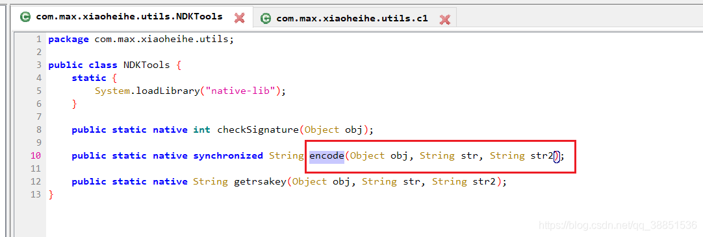

入参分别是context，明文，时间戳，输出恒为七位长度

## unidbg模拟执行

前面讲过的内容就不多说了

```
package com.lession9;

import com.github.unidbg.AndroidEmulator;
import com.github.unidbg.Module;
import com.github.unidbg.linux.android.AndroidEmulatorBuilder;
import com.github.unidbg.linux.android.AndroidResolver;
import com.github.unidbg.linux.android.dvm.*;
import com.github.unidbg.memory.Memory;

import java.io.File;
import java.io.FileNotFoundException;
import java.io.FileOutputStream;
import java.io.PrintStream;
import java.util.ArrayList;
import java.util.List;

public class blackbox extends AbstractJni {
    private final AndroidEmulator emulator;
    private final VM vm;
    private final Module module;

    blackbox() throws FileNotFoundException {
        emulator = AndroidEmulatorBuilder.for32Bit().setProcessName("com.blackbox").build(); // 创建模拟器实例，要模拟32位或者64位，在这里区分
        final Memory memory = emulator.getMemory(); // 模拟器的内存操作接口
        memory.setLibraryResolver(new AndroidResolver(23)); // 设置系统类库解析

        vm = emulator.createDalvikVM(new File("unidbg-android\\src\\test\\java\\com\\lession9\\小黑盒.apk")); // 创建Android虚拟机
        vm.setVerbose(true); // 设置是否打印Jni调用细节
        DalvikModule dm = vm.loadLibrary(new File("unidbg-android\\src\\test\\java\\com\\lession9\\libnative-lib.so"), true);

        module = dm.getModule(); //

        vm.setJni(this);
        dm.callJNI_OnLoad(emulator);
    }

    public String callEncode(){
        List<Object> list = new ArrayList<>(10);
        list.add(vm.getJNIEnv()); // 第一个参数是env
        list.add(0); // 第二个参数，实例方法是jobject，静态方法是jclazz，直接填0，一般用不到
        Object custom = null;
        DvmObject<?> context = vm.resolveClass("android/content/Context").newObject(custom);// context
        list.add(vm.addLocalObject(context));
        list.add(vm.addLocalObject(new StringObject(vm, "r0env")));
        list.add(vm.addLocalObject(new StringObject(vm, "1622343722")));
        Number number = module.callFunction(emulator, 0x3b41, list.toArray())[0];
        String result = vm.getObject(number.intValue()).getValue().toString();
        return result;
    };

    public static void main(String[] args) throws FileNotFoundException {
        blackbox test = new blackbox();
        System.out.println(test.callEncode());
    }
}
```

运行，产生第一个报错

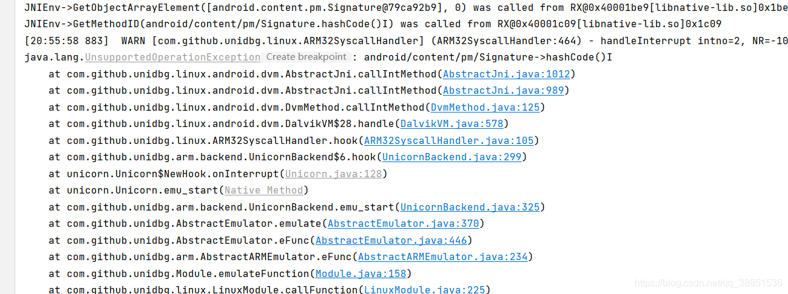

callIntMethodV中有对于这个签名的处理，抄一下

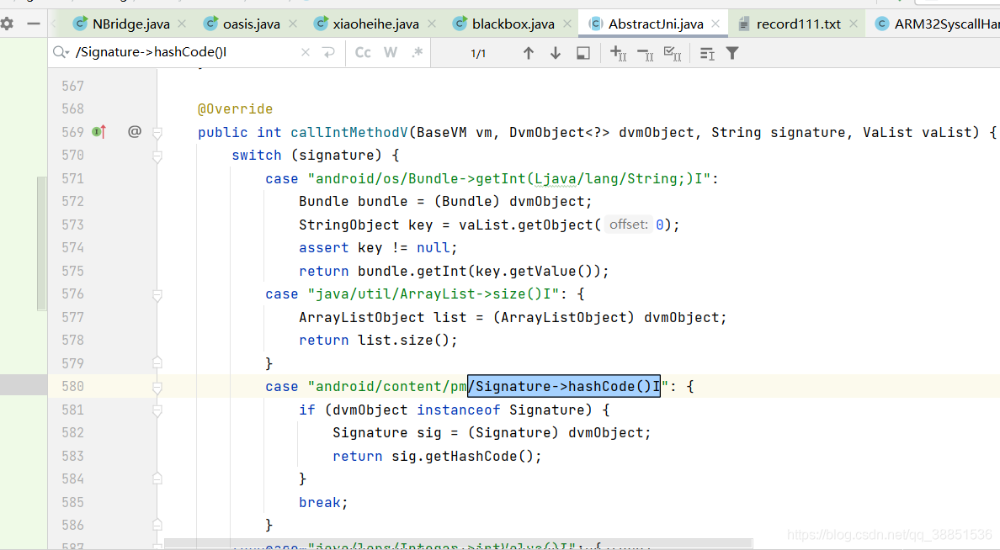

```
@Override
public int callIntMethod(BaseVM vm, DvmObject<?> dvmObject, String signature, VarArg varArg) {
    switch (signature) {
        case "android/content/pm/Signature->hashCode()I":
            if (dvmObject instanceof Signature) {
                Signature sig = (Signature) dvmObject;
                return sig.getHashCode();
            }
    }
    return super.callIntMethod(vm, dvmObject, signature, varArg);
}
```

直接跑出了结果

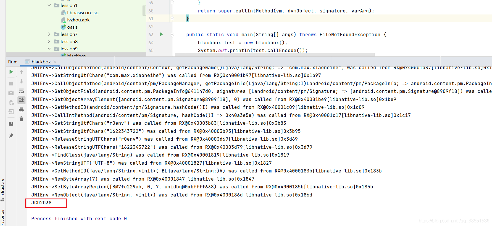

我们使用Frida 主动调用验证一下结果，结果OK

```
function callEncode(){
    Java.perform(function () {
        var NDKTools = Java.use('com.max.xiaoheihe.utils.NDKTools');
        var currentApplication= Java.use("android.app.ActivityThread").currentApplication();
        var context = currentApplication.getApplicationContext();
        // 参数一 context
        var input1 = context;
        // 参数二 明文
        var input2 = "r0env";
        // 参数三 时间戳
        var input3 = "1622343722";
        var result = NDKTools.encode(input1, input2, input3);
        console.log(result);
    });
}
```

## unidbg算法还原

这是本篇的重点，开始吧！IDA中跳转到encode函数起始处，我们遇到了第一个问题——代码无法F5

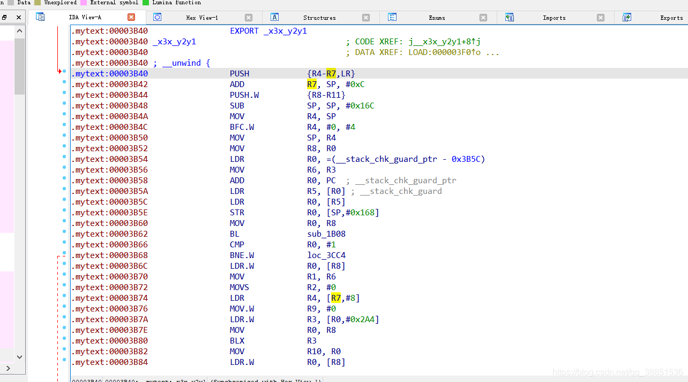

我们可以选定一段汇编，按P强制转函数，但此处先不这么做，我们试一下换个思路

让我们尝试从unidbg的角度来思考和解决问题，在传统分析中，我们有时会使用IDA的指令trace功能，但是呢，IDA trace常常不是我们的首选项，原因很多

-   对IDA的反调试常见于各类样本
-   IDA trace 操作较复杂，IDA动态调试容易崩
-   trace 速度较慢

而在unidbg中，code trace稳定且容易获取，我们不妨把code trace这件事放在前面，如前几篇所展示的那样，将如下代码放在构造函数合适的位置

```
// 填入自己的path
String traceFile = "path/encode.txt";
PrintStream traceStream = new PrintStream(new FileOutputStream(traceFile), true);
emulator.traceCode(module.base, module.base+module.size).setRedirect(traceStream);
```

运行代码，很快就出结果了，18000行

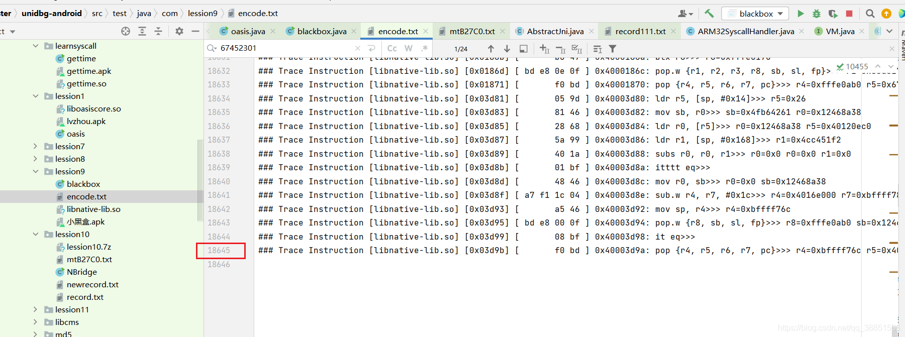

这个行数，既说明运算中不存在高度的OLLVM混淆，也说明运算逻辑不会太复杂，否则应该百万行起步

而且由于输出只有七位数，我们下意识想到哈希算法可能参与其中，哈希算法中的经典魔数 0x67452301，不管是MD5还是SHA1都在用，尝试搜索一下

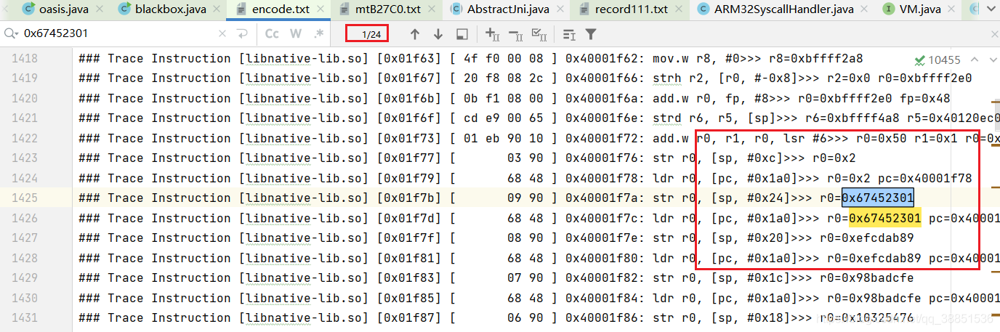

果然有戏，接下来定位到哈希算法的运算部分

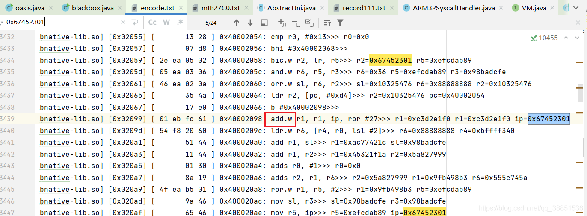

跳转到0x2098看一下

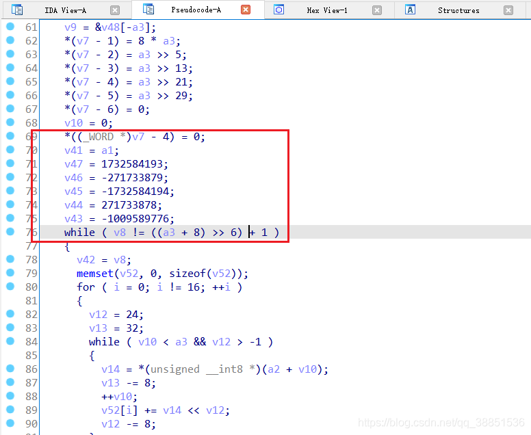

按H转成hex

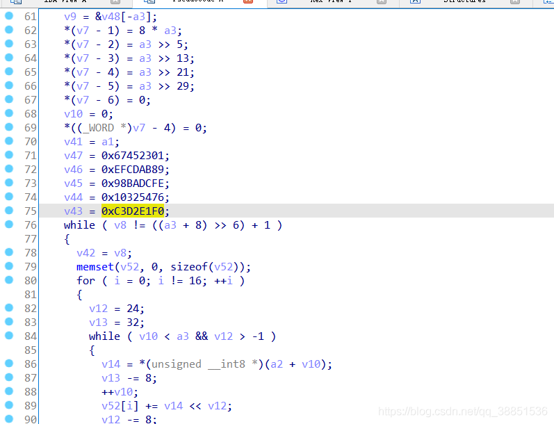

这是SHA1算法的五个魔数，换而言之这是函数是SHA1算法的实现


我们要辨别入参的含义，通常而言，可以静态分析来判断哪个入参是明文、长度等等，或者Frida Hook 以及 unidbg中HookZz等Hook 验证

但unidbg中提供了一种极其敏捷的Hook工具——console debugger，它是今天的主力

初始化console debugger 并添加断点，看一下涉及的代码

```
blackbox() throws FileNotFoundException {
    emulator = AndroidEmulatorBuilder.for32Bit().setProcessName("com.blackbox").build(); // 创建模拟器实例，要模拟32位或者64位，在这里区分
    final Memory memory = emulator.getMemory(); // 模拟器的内存操作接口
    memory.setLibraryResolver(new AndroidResolver(23)); // 设置系统类库解析

    vm = emulator.createDalvikVM(new File("unidbg-android\\src\\test\\java\\com\\lession9\\小黑盒.apk")); // 创建Android虚拟机
    vm.setVerbose(true); // 设置是否打印Jni调用细节
    DalvikModule dm = vm.loadLibrary(new File("unidbg-android\\src\\test\\java\\com\\lession9\\libnative-lib.so"), true);

    module = dm.getModule(); //

    vm.setJni(this);
    dm.callJNI_OnLoad(emulator);

    // 初始化debugger
    Debugger debugger = emulator.attach();
    // 添加断点
    debugger.addBreakPoint(module.base + 0x1ecc + 1);
}
```

然后运行代码

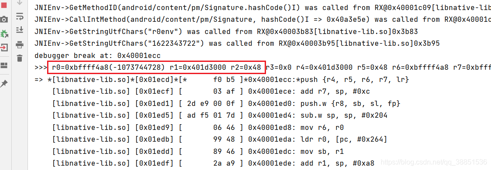

代码停下来了，可以发现，r1和r2都更像是指针

console debugger 支持如下指令，大家不用死记硬背，我们会在后面不断去使用它

-   **c**: continue
-   **n**: step over
-   **bt**: back trace
-   **st** hex: search stack
-   **shw** hex: search writable heap
-   **shr** hex: search readable heap
-   **shx** hex: search executable heap
-   **nb**: break at next block
-   **s|si**: step into
-   **s[decimal]**: execute specified amount instruction
-   **s(blx)**: execute util BLX mnemonic, low performance
-   **m(op) [size]**: show memory, default size is 0x70, size may hex or decimal
-   **mr0-mr7, mfp, mip, msp [size]**: show memory of specified register
-   **m(address) [size]**: show memory of specified address, address must start with 0x
-   **wr0-wr7, wfp, wip, wsp**: write specified register
-   **wb(address), ws(address), wi(address)**: write (byte, short, integer) memory of specified address, address must start with 0x
-   **wx(address)**: write bytes to memory at specified address, address must start with 0x
-   **b(address)**: add temporarily breakpoint, address must start with 0x, can be module offset
-   **b**: add breakpoint of register PC
-   **r**: remove breakpoint of register PC
-   **blr**: add temporarily breakpoint of register LR
-   **p(assembly)**: patch assembly at PC address
-   **where**: show java stack trace
-   **trace [begin end]**: Set trace instructions
-   **traceRead [begin end]**: Set trace memory read
-   **traceWrite [begin end]**: Set trace memory write
-   **vm**: view loaded modules
-   **vbs**: view breakpoints
-   **d|dis**: show disassemble
-   **d(0x)**: show disassemble at specify address
-   **stop**: stop emulation
-   **run [arg]**: run test
-   **cc size**: convert asm from 0x40001ddc - 0x40001ddc + size bytes to c function

mr0查看r0所指向的内存块，它等同于Frida native hook中的`hexdump(this.context.r0)`

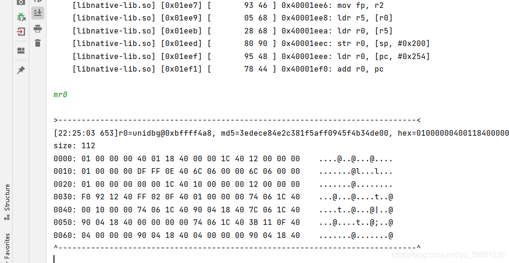

再看看r1所指向的内存

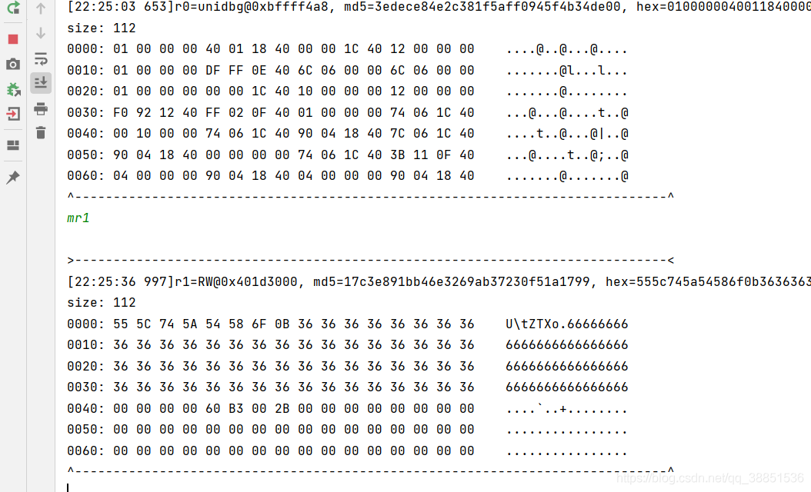

按C继续运行，再次断了下来，`mr1`

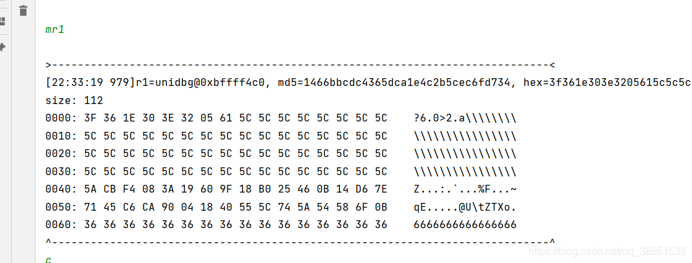

这里涉及到一个知识问题，需要大家对HMAC方案有一定了解，内容中的0x5C 和 0x36 是它标志性的特征，其具体原理可以看课程中【SO基础课四月——最后两节】对HMAC的详解

所以接下来找其上层函数，就是HAMC的主函数

我们可以在IDA中按x查看交叉引用

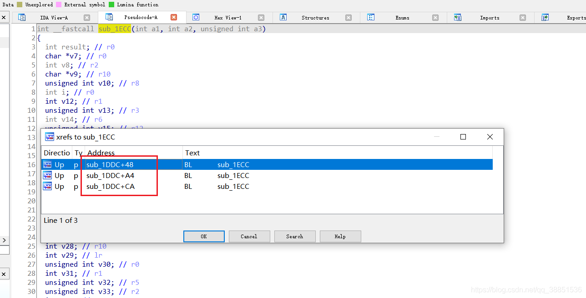

但在一些情况下，交叉引用可能会找不到结果或者干扰项太多，这种时候可以使用Frida去打印调用栈

```
var base_addr = Module.findBaseAddress("libnative-lib.so");
var real_addr = base_addr.add(0x1ECC+1);
Interceptor.attach(real_addr, {
    onEnter: function (args) {
        var backtrace = Thread.backtrace(this.context, Backtracer.ACCURATE).map(DebugSymbol.fromAddress).join("\n\t");
        console.log("Backtrace:" + backtrace);
    }
});
```

但在unidbg console debugger中做这件事最快，再次运行代码——在断点处断下——输入bt指令回车（bt即backtrace缩写）

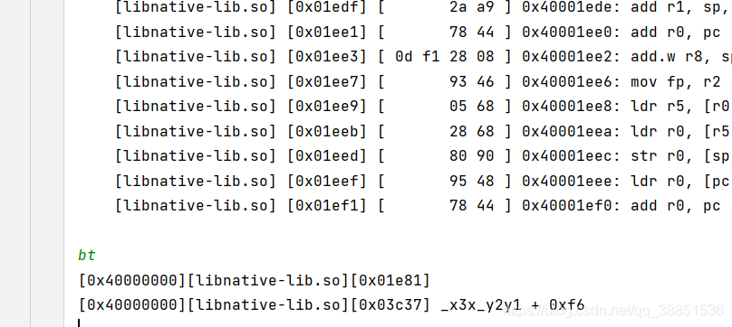

IDA中查看0x1e81

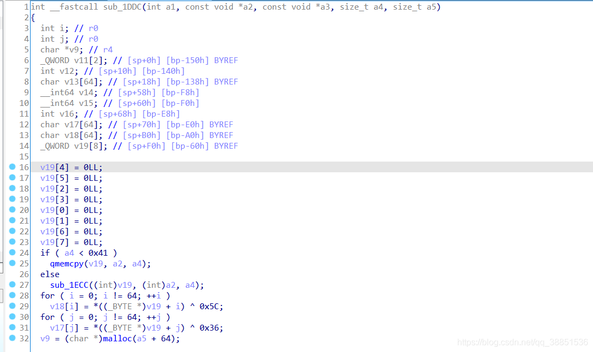

这个函数看着像一个标准的HMAC-SHA1，那输入一定包括 明文、Key，在1ddc 下断点，我们需要搞清楚这五个入参的意义

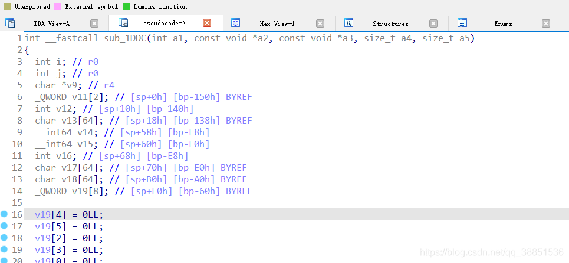

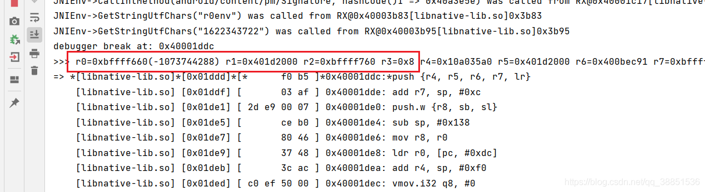

r3即参数4，值是8，我们暂不清楚其意义，r0-r2即参数一、二、三，均为指针，mr0，mr1，mr2 逐个查看

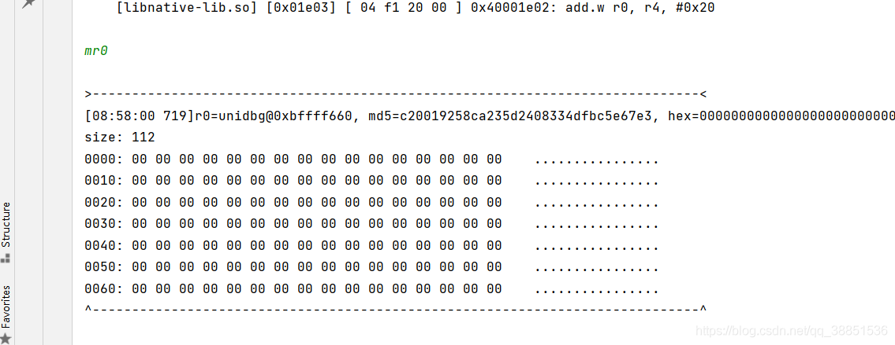

看出来是个buffer

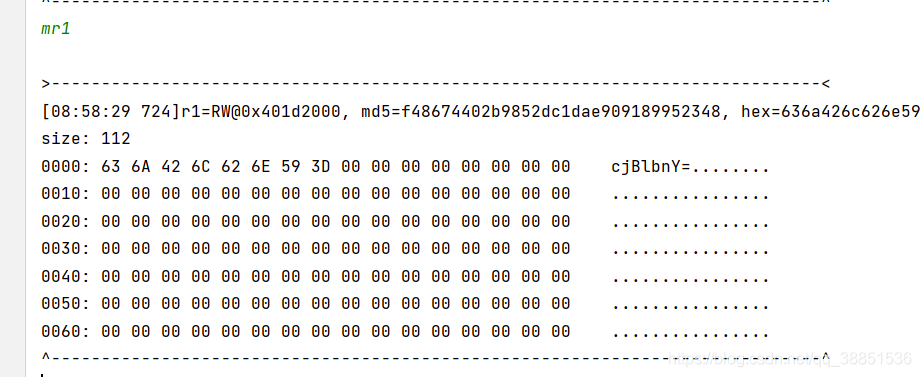

看不出是Key 还是 输入明文，但是它的长度恰好是八字节，或许参数4的8就是它的长度，mr2 也看不啥

这对于逆向分析来说是常见的情况，试错和犯错是逆向分析中最主要的部分

既然不能通过入参简单分析，那就逐行看代码逻辑，需要注意，分析此函数需要对HMAC有一定理解

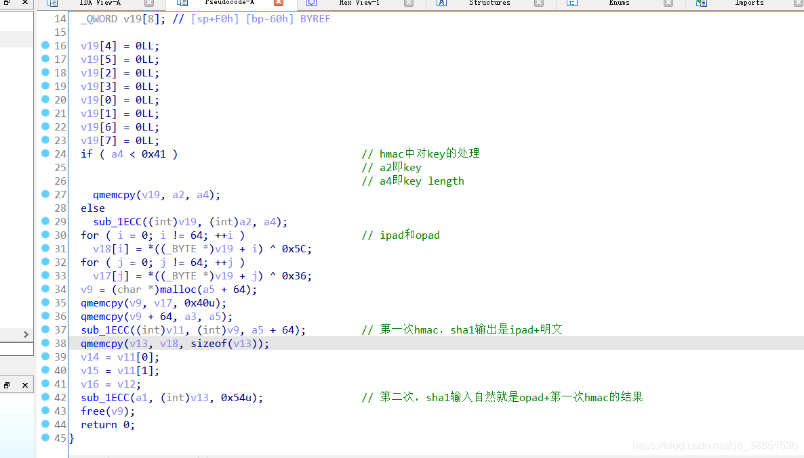

在1ecc 处第一次断点处的mr1解释如下

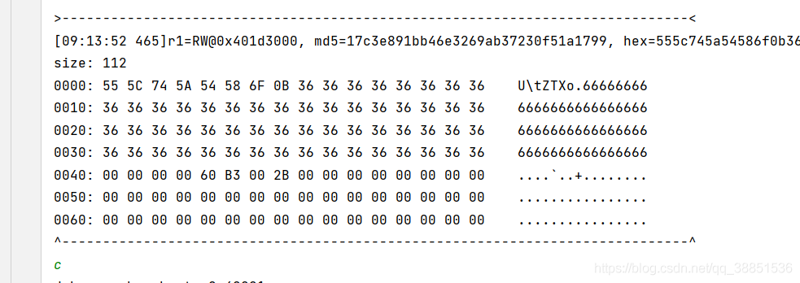

一共0x48长，前0x40个是ipad，来自于 (key补0后) xor 0x36，1ddc的参数2就是这个key

而明文就是这个一小截

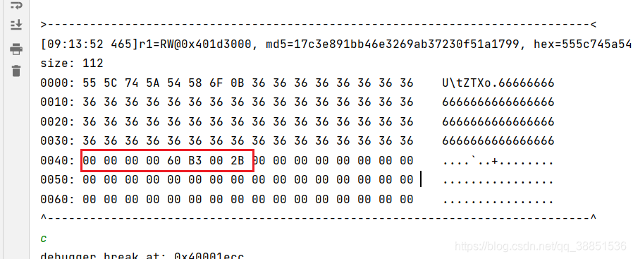

这个明文是啥呢？仔细观察会发现就是（00 00 00 00）+ （时间戳 +1）下面验证结果

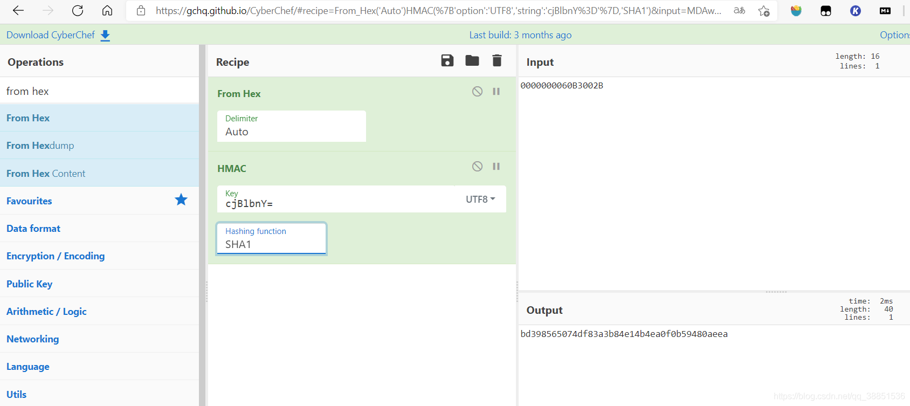

1ddc 即 hmacSHA1函数，参数1是buffer，所以我们需要hook 它的返回值

这件事在console debugger中也并不难做，blr 命令用于在函数返回时设置一个一次性断点，然后c 运行函数，它在返回处断下来，有个问题，mr0这时候并不代表入参时的r0了，但没关系，mr0的address即可  
调试流程如下

```
debugger break at: 0x40001ddc
>>> r0=0xbffff660(-1073744288) r1=0x401d2000 r2=0xbffff760 r3=0x8 r4=0x10a035a0 r5=0x401d2000 r6=0x400bec91 r7=0xbffff788 r8=0xfffe0ab0 sb=0x0 sl=0x4016e000 fp=0xbffff660 ip=0x80808080 SP=0xbffff600 LR=RX@0x40003c3b[libnative-lib.so]0x3c3b PC=RX@0x40001ddc[libnative-lib.so]0x1ddc cpsr: N=0, Z=0, C=1, V=0, T=1, mode=0b10000
=> *[libnative-lib.so]*[0x01ddd]*[*      f0 b5 ]*0x40001ddc:*push {r4, r5, r6, r7, lr}
    [libnative-lib.so] [0x01ddf] [       03 af ] 0x40001dde: add r7, sp, #0xc
    [libnative-lib.so] [0x01de1] [ 2d e9 00 07 ] 0x40001de0: push.w {r8, sb, sl}
    [libnative-lib.so] [0x01de5] [       ce b0 ] 0x40001de4: sub sp, #0x138
    [libnative-lib.so] [0x01de7] [       80 46 ] 0x40001de6: mov r8, r0
    [libnative-lib.so] [0x01de9] [       37 48 ] 0x40001de8: ldr r0, [pc, #0xdc]
    [libnative-lib.so] [0x01deb] [       3c ac ] 0x40001dea: add r4, sp, #0xf0
    [libnative-lib.so] [0x01ded] [ c0 ef 50 00 ] 0x40001dec: vmov.i32 q8, #0
    [libnative-lib.so] [0x01df1] [       78 44 ] 0x40001df0: add r0, pc
    [libnative-lib.so] [0x01df3] [       91 46 ] 0x40001df2: mov sb, r2
    [libnative-lib.so] [0x01df5] [       22 46 ] 0x40001df4: mov r2, r4
    [libnative-lib.so] [0x01df7] [       41 2b ] 0x40001df6: cmp r3, #0x41
    [libnative-lib.so] [0x01df9] [ d0 f8 00 a0 ] 0x40001df8: ldr.w sl, [r0]
    [libnative-lib.so] [0x01dfd] [ da f8 00 00 ] 0x40001dfc: ldr.w r0, [sl]
    [libnative-lib.so] [0x01e01] [       4d 90 ] 0x40001e00: str r0, [sp, #0x134]
    [libnative-lib.so] [0x01e03] [ 04 f1 20 00 ] 0x40001e02: add.w r0, r4, #0x20

// 我输入的命令
mr0

>-----------------------------------------------------------------------------<
[09:27:45 480]r0=unidbg@0xbffff660, md5=c20019258ca235d2408334dfbc5e67e3, hex=00000000000000000000000000000000000000000000000000000000000000000000000000000000000000000000000000000000000000000000000000000000000000000000000000000000000000000000000000000000000000000000000000000000000000000000000000000000
size: 112
0000: 00 00 00 00 00 00 00 00 00 00 00 00 00 00 00 00    ................
0010: 00 00 00 00 00 00 00 00 00 00 00 00 00 00 00 00    ................
0020: 00 00 00 00 00 00 00 00 00 00 00 00 00 00 00 00    ................
0030: 00 00 00 00 00 00 00 00 00 00 00 00 00 00 00 00    ................
0040: 00 00 00 00 00 00 00 00 00 00 00 00 00 00 00 00    ................
0050: 00 00 00 00 00 00 00 00 00 00 00 00 00 00 00 00    ................
0060: 00 00 00 00 00 00 00 00 00 00 00 00 00 00 00 00    ................
^-----------------------------------------------------------------------------^
// 我输入的命令
blr
Add breakpoint: 0x40003c3b in libnative-lib.so [0x3c3b]
// 我输入的命令
c
debugger break at: 0x40003c3a
>>> r0=0x0 r1=0x0 r2=0x8 r3=0x7 r4=0x10a035a0 r5=0x401d2000 r6=0x400bec91 r7=0xbffff788 r8=0xfffe0ab0 sb=0x0 sl=0x4016e000 fp=0xbffff660 ip=0x401c20c0 SP=0xbffff600 LR=RX@0x400fe617[libc.so]0x58617 PC=RX@0x40003c3a[libnative-lib.so]0x3c3a (_x3x_y2y1 + 0xf9) cpsr: N=0, Z=1, C=1, V=0, T=1, mode=0b10000
=> *[libnative-lib.so]*[0x03c3b]*[*      68 48 ]*0x40003c3a:*ldr r0, [pc, #0x1a0] [0x40003dde] => 0x248e
    [libnative-lib.so] [0x03c3d] [       1a 26 ] 0x40003c3c: movs r6, #0x1a
    [libnative-lib.so] [0x03c3f] [ 9d f8 73 10 ] 0x40003c3e: ldrb.w r1, [sp, #0x73]
    [libnative-lib.so] [0x03c43] [ 0d f1 38 0a ] 0x40003c42: add.w sl, sp, #0x38
    [libnative-lib.so] [0x03c47] [       78 44 ] 0x40003c46: add r0, pc
    [libnative-lib.so] [0x03c49] [       01 60 ] 0x40003c48: str r1, [r0]
    [libnative-lib.so] [0x03c4b] [ 01 f0 0f 00 ] 0x40003c4a: and r0, r1, #0xf
    [libnative-lib.so] [0x03c4f] [       64 49 ] 0x40003c4e: ldr r1, [pc, #0x190]
    [libnative-lib.so] [0x03c51] [       79 44 ] 0x40003c50: add r1, pc
    [libnative-lib.so] [0x03c53] [       08 60 ] 0x40003c52: str r0, [r1]
    [libnative-lib.so] [0x03c55] [       52 a1 ] 0x40003c54: adr r1, #0x148
    [libnative-lib.so] [0x03c57] [ 5b f8 00 00 ] 0x40003c56: ldr.w r0, [fp, r0]
    [libnative-lib.so] [0x03c5b] [ 0d f1 45 0b ] 0x40003c5a: add.w fp, sp, #0x45
    [libnative-lib.so] [0x03c5f] [ 61 f9 cf 0a ] 0x40003c5e: vld1.64 {d16, d17}, [r1]
    [libnative-lib.so] [0x03c63] [       59 46 ] 0x40003c62: mov r1, fp
    [libnative-lib.so] [0x03c65] [ 41 f9 06 0a ] 0x40003c64: vst1.8 {d16, d17}, [r1], r6

// 我输入的命令
m0xbffff660

>-----------------------------------------------------------------------------<
[09:27:59 330]unidbg@0xbffff660, md5=4c435965fc9ed9add8e3611e66611a84, hex=bd398565074df83a3b84e14b4ea0f0b59480aeea0000000000000000000000000000000000000000000000000000000000000000000000000000000000000000000000000000000000000000000000000000000000000000000000000000000000000000000000000000000000000000
size: 112
0000: BD 39 85 65 07 4D F8 3A 3B 84 E1 4B 4E A0 F0 B5    .9.e.M.:;..KN...
0010: 94 80 AE EA 00 00 00 00 00 00 00 00 00 00 00 00    ................
0020: 00 00 00 00 00 00 00 00 00 00 00 00 00 00 00 00    ................
0030: 00 00 00 00 00 00 00 00 00 00 00 00 00 00 00 00    ................
0040: 00 00 00 00 00 00 00 00 00 00 00 00 00 00 00 00    ................
0050: 00 00 00 00 00 00 00 00 00 00 00 00 00 00 00 00    ................
0060: 00 00 00 00 00 00 00 00 00 00 00 00 00 00 00 00    ................
^-----------------------------------------------------------------------------^
// 我输入的命令
c
JNIEnv->ReleaseStringUTFChars("r0env") was called from RX@0x40003d69[libnative-lib.so]0x3d69
JNIEnv->ReleaseStringUTFChars("1622343722") was called from RX@0x40003d79[libnative-lib.so]0x3d79
JNIEnv->FindClass(java/lang/String) was called from RX@0x40001819[libnative-lib.so]0x1819
JNIEnv->NewStringUTF("UTF-8") was called from RX@0x40001827[libnative-lib.so]0x1827
JNIEnv->GetMethodID(java/lang/String.<init>([BLjava/lang/String;)V) was called from RX@0x4000183b[libnative-lib.so]0x183b
JNIEnv->NewByteArray(7) was called from RX@0x40001847[libnative-lib.so]0x1847
JNIEnv->SetByteArrayRegion([B@3c41ed1d, 0, 7, unidbg@0xbffff638) was called from RX@0x4000185b[libnative-lib.so]0x185b
JNIEnv->NewObject(java/lang/String, <init>) was called from RX@0x4000186d[libnative-lib.so]0x186d
JCD2D82
```

这个hmacSHA1算法就分析完了，它的唯一要点就是要对HMAC算法熟悉，用Frida Hook 还是 unidbg debug 凭心而论，在此处影响不大

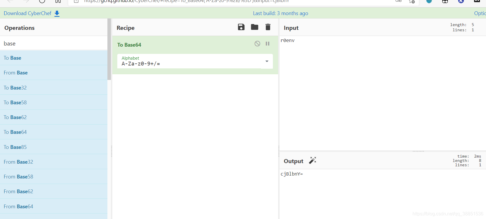

我们验证了此处是一个hmacSHA1算法，入参是时间戳+1，装满八个字节的那种，密钥也找到了，但不确定是静态保存还是动态生成的

但仔细看我们会发现，密钥其实就是输入明文的base64

接下来做啥呢？HMAC的结果是20个字节，程序的返回值是7个十六进制数，风马牛不相及，显然离成功逆向还差得远呢

但既然HMAC SHA1已经被我们弄出来了，那就要汇编trace中把这部分删掉，这样好知道还剩下多少工作量

根据1ddc的头尾去检索

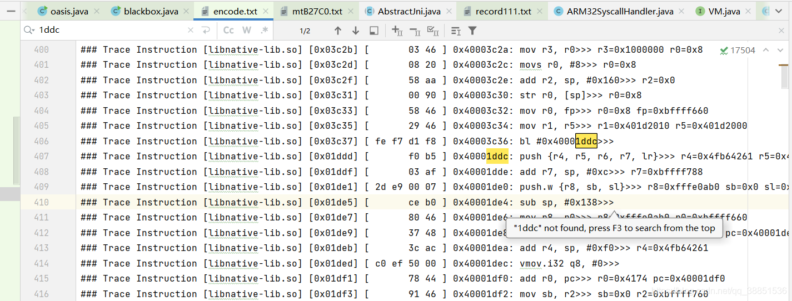

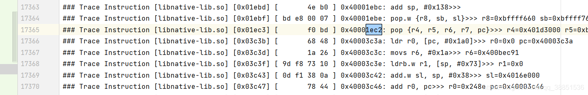

我们惊喜的发现，去掉hmacSha1的部分，只剩下1600行！

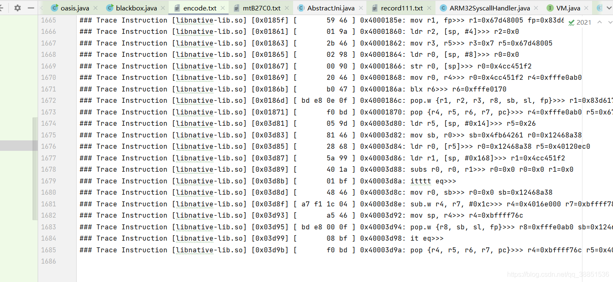

这意味着什么呢？  
这意味着目标函数中后续不存在标准加密算法了，比如大名鼎鼎的AES/DES/RSA等等，为什么呢？因为一个标准的、无混淆的MD5，都需要2000-3000行汇编才能实现1600行容不下太多逻辑！剩下的内容很可能是异或循环？凯撒加密？等等自定义的基本变换

让我们继续算法分析吧！接下来的突破口是哪儿呢？unidbg没有做内存地址的随机化，所以从0xbffff660到0xbffff660+20 的地址就静静的放着我们的HMAC SHA1结果，先前我们也说了，18000行汇编，超过16000行都是这个函数，那好不容易算出来的结果，肯定不至于后面不使用吧？这不是胡闹嘛

Unicorn天然提供了对内存读写/访问的trace，而unidbg做了良好的封装 ，发扬光大

让我们感受一下trace的强大威力

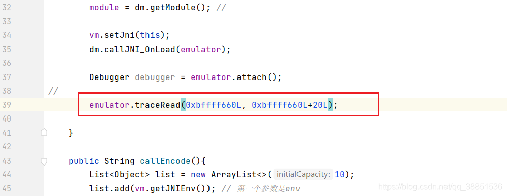

参数为起始地址与终止地址，入参必须声明为long类型，否则就会出错

运行代码，我们发现，在后续运算中，hmac-sha1的结果中，只有五个字节被使用到了

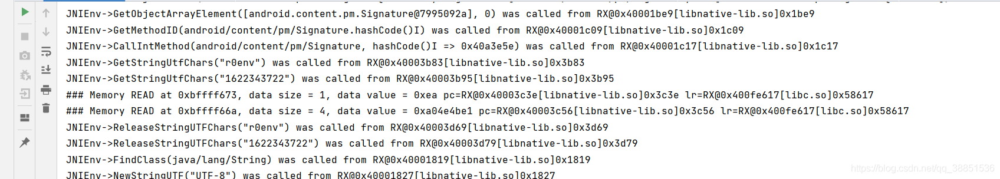

pc指针代表了调用位置，我们跳转到3c3e看看，真糟糕

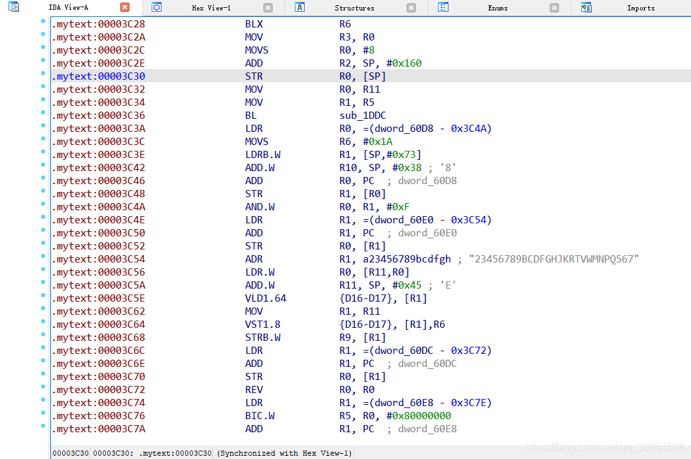

这个样本存在静态的分析对抗，IDA 无法确认函数的起始地址和终止地址，必须人为选定一个指令范围，然后按P强制转成函数

我们现在不得不这么做，否则分析就进入了死胡同可以发现，IDA识别出了函数的起始点，但把握不住函数的终点.我们顺着飘红往下拉：

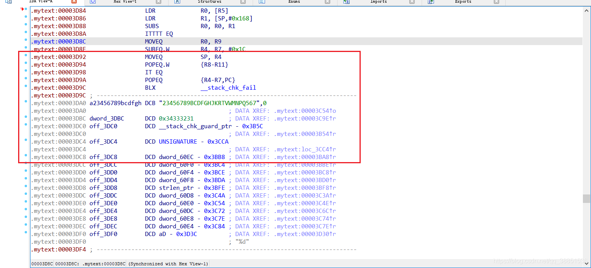

3D9C比较像函数的结尾，我们尝试一下，从3B40开始从上往下拖拽，一直覆盖选中到3D9C，按P

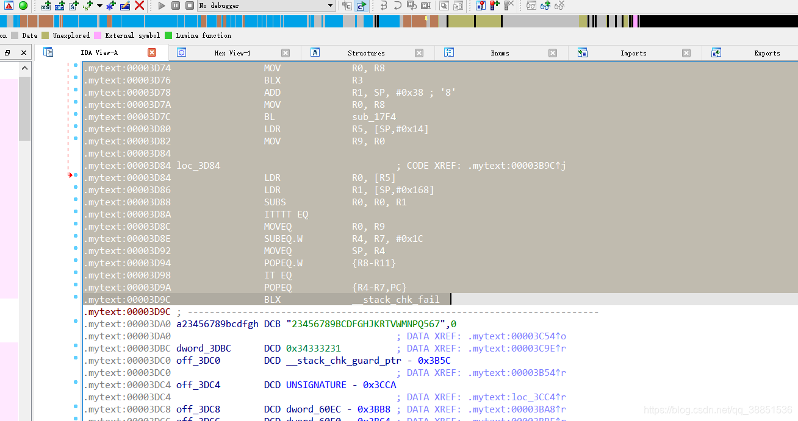

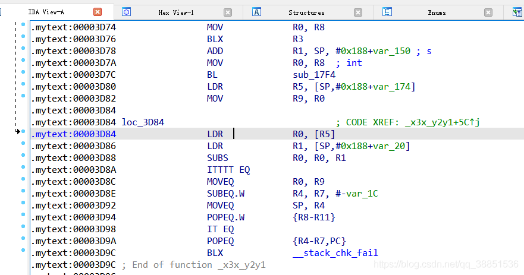

现在已经被识别成了函数，F5看效果

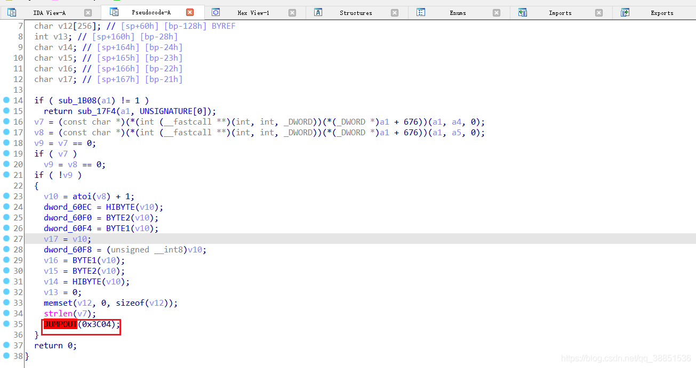

JUMPOUT真刺眼，看一下0x3C04这个位置怎么了

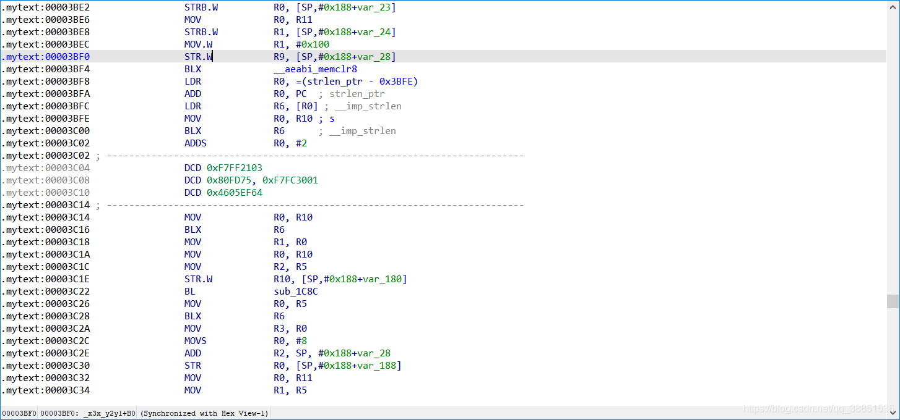

0x3C04应该是代码段，但被误识别成了数据，选中这个区域

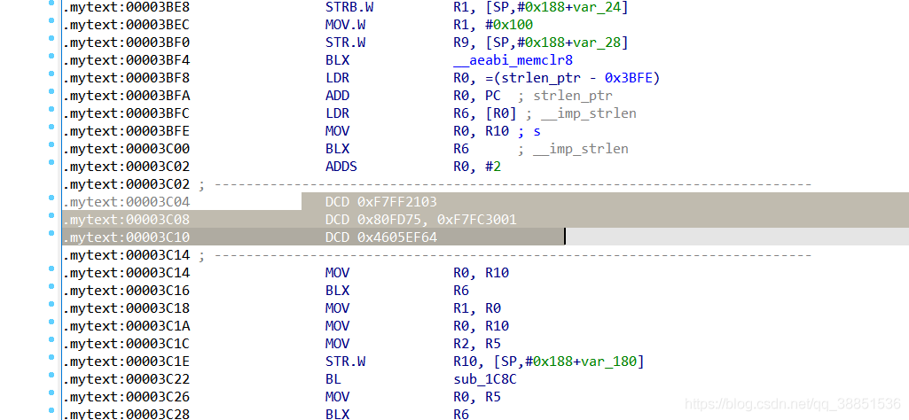

按C 转成code

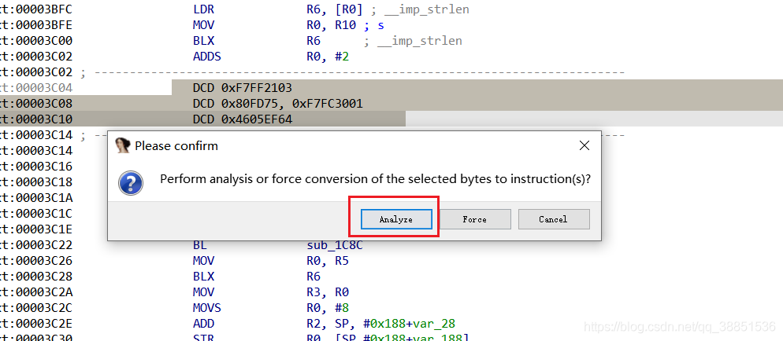

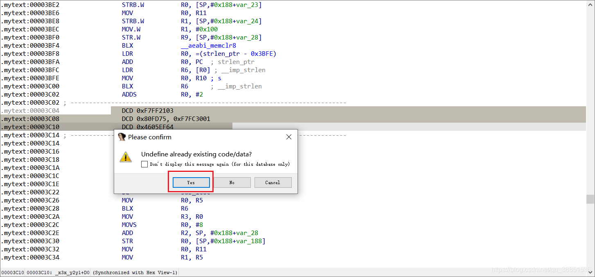

将先前的反编译结果界面关掉，按F5 再次反编译

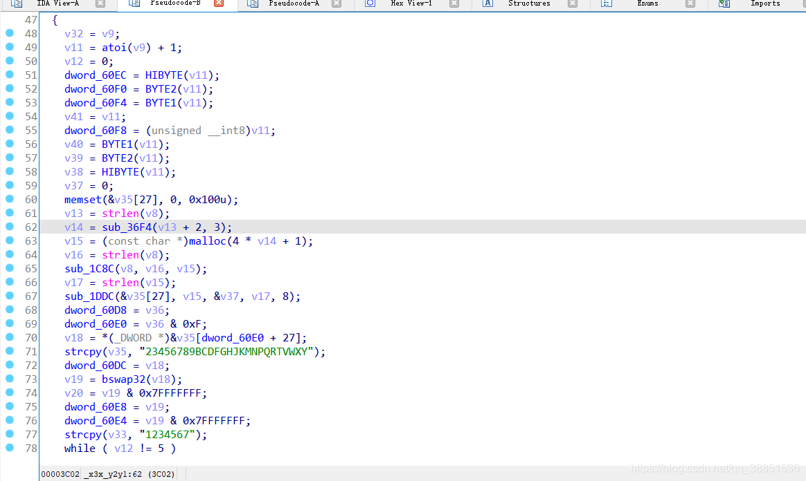

总算可以看伪C代码了，没这玩意心里真发慌

我们在前面对hmacSha1的结果traceRead，第一处发生在0x3c3e，仔细观察执行流和值我们会发现，这里是取出来hmacSha1结果的最后一位

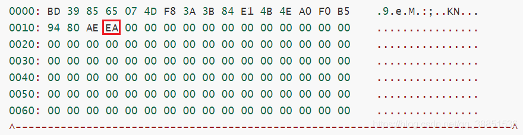

另外一处是在0x3c56，从结果中读取出来a04e4be1，内存要倒着看，即第10到第13个字节

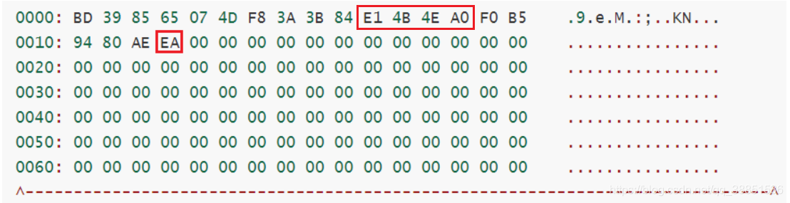

查看汇编流程

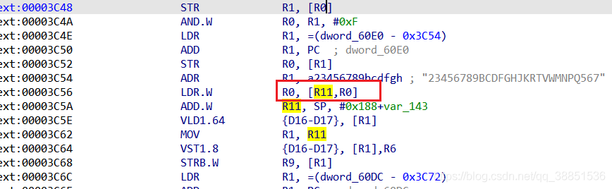

attach debugger 一梭子

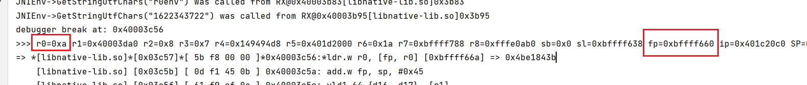

(这里似乎少一张图)

r0是index，r11即fp，就是指针了，康康内存数据

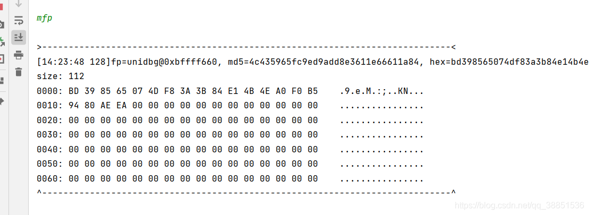

即从hmacSha1的结果中取出四字节，那么index是谁决定的呢?

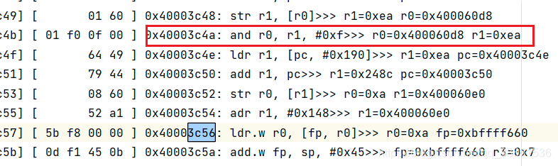

and 即按位与运算，对应的C代码

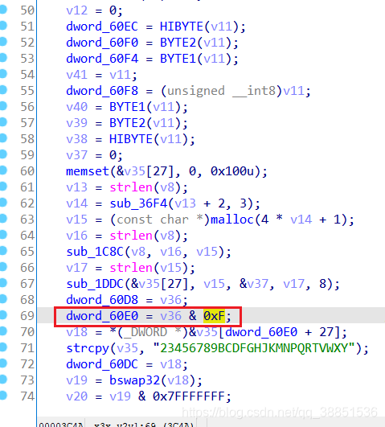

`&f`意味着取低八位，举例如下

-   0x321 & 0xf = 0x1
-   0x57 & 0xf = 0x7

所以逻辑是这样的:取hmacSha1结果的最后一位出来，其低八位作为index再次在hmacSHA1的结果中取出四字节，那后面拿这四字节干啥呢?  
和0x7fffffff按位与后进入了这个函数

注意78-85行这个循环，我们对结果的输出 traceWrite

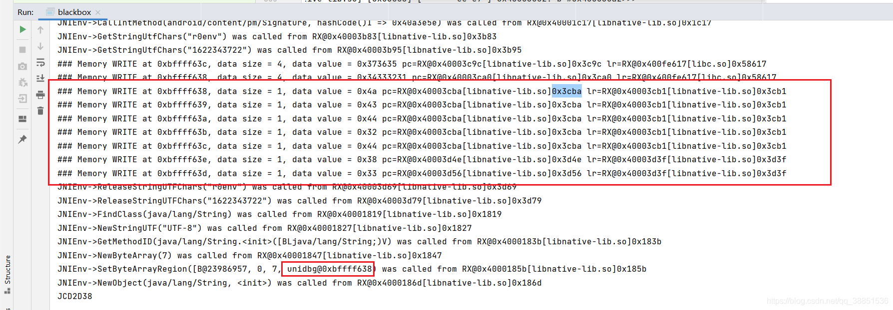

可以发现，前五个字节都来自3cba位置，即这个循环体内

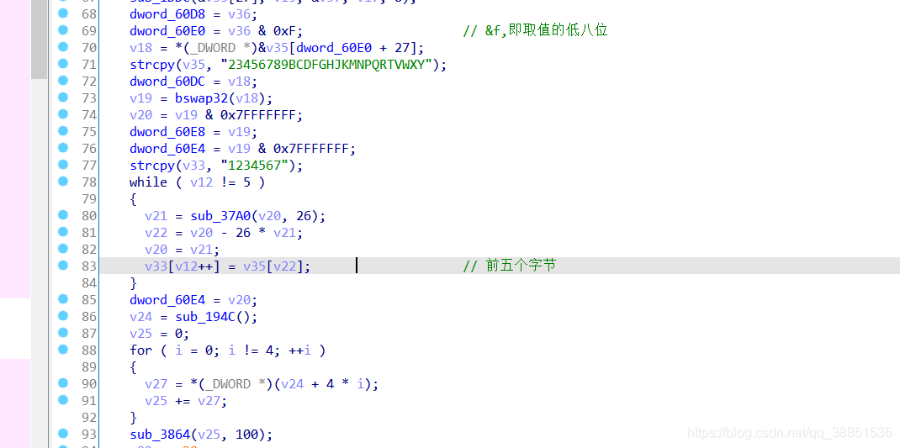

换句话说，我们离结果的前五个字节的真相已经很近了

分析一下37a0处的r0

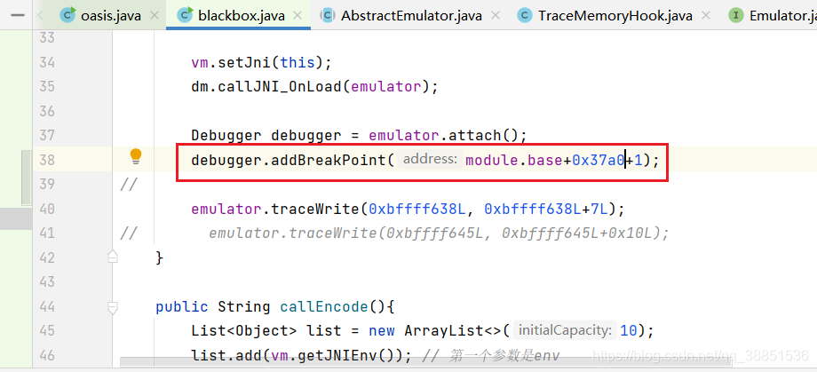

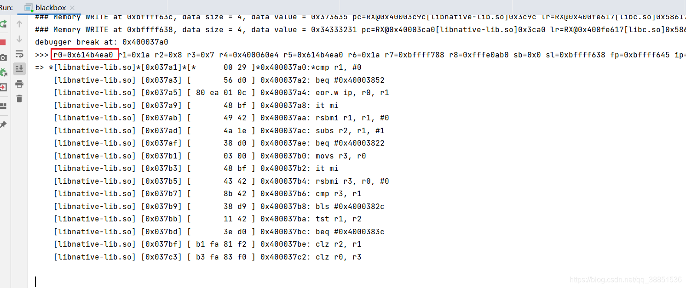

我们的分析没错，0x614b4ea0 即 0xe14b4ea0 & 0x7fffffff

使用hookZz 查看sub_37A0其参数和返回值(这是今天第一次用hookZz，在大部分情况下，console debugger 更灵敏更好用)

```
public void hook37a0(){
    // 获取HookZz对象
    IHookZz hookZz = HookZz.getInstance(emulator); // 加载HookZz，支持inline hook，文档看https://github.com/jmpews/HookZz
    // enable hook
    hookZz.enable_arm_arm64_b_branch(); // 测试enable_arm_arm64_b_branch，可有可无
    // hook MDStringOld
    hookZz.wrap(module.base + 0x37a0 + 1, new WrapCallback<HookZzArm32RegisterContext>() { // inline wrap导出函数

        @Override
        // 方法执行前
        public void preCall(Emulator<?> emulator, HookZzArm32RegisterContext ctx, HookEntryInfo info) {
            System.out.println("input:"+ctx.getR0Int());
        };

        @Override
        // 方法执行后
        public void postCall(Emulator<?> emulator, HookZzArm32RegisterContext ctx, HookEntryInfo info) {
            System.out.println("output:"+ctx.getR0Int());
        }
    });
    hookZz.disable_arm_arm64_b_branch();
}
```

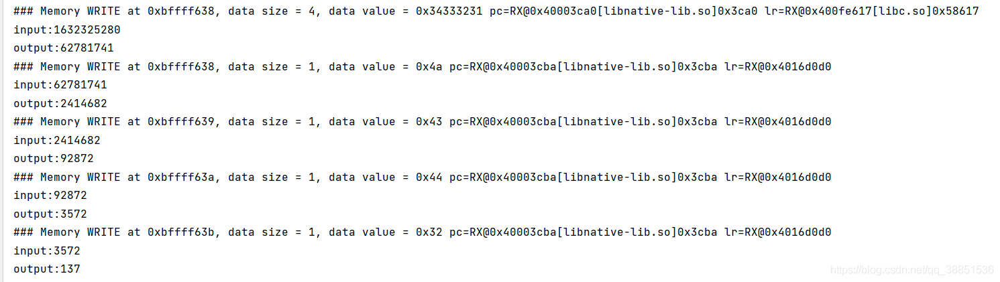

我们观察到，后面四次的入参一，就是前一次的输出结果，而第一次入参一是我们的hmac中变换处的四个字节&0xfffffff，这一点在汇编或者伪C代码中同样可以清晰验证.

那前五个字节，和这个输出有什么关系呢?

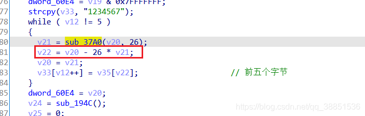

1632325280 - 26*62781741 = 14，然后将结果，即此处的14作为index，从v35中取值，静态分析或者Hook都可以验证，v35是固定字符串"23456789BCDFGHJKMNPQRTVWXY"

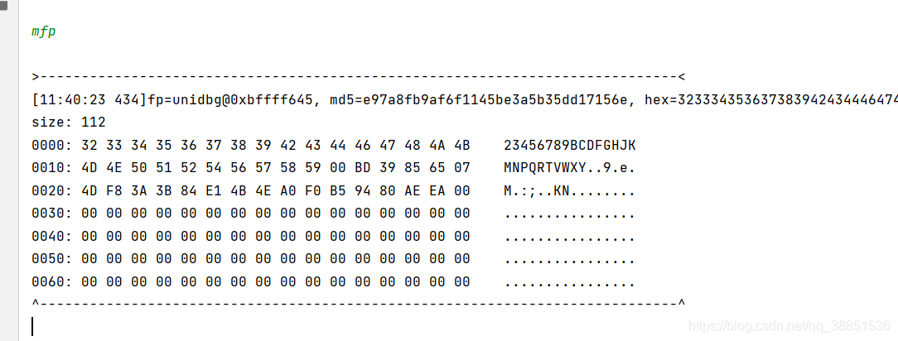

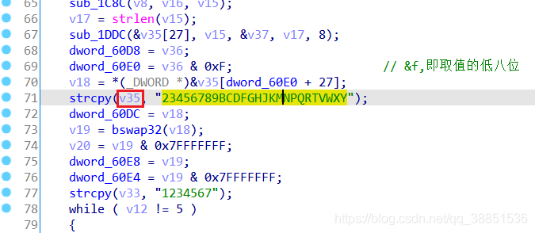

所以输出的前五个字节，已经明了，关键就在sub_37A0这个函数里，它需要传入两个参数，参数2总是26，参数1一直在变，进入这个函数看看

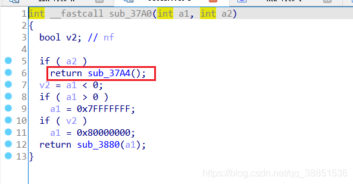

进入37A4的逻辑时，突然想到一个问题，37a4的两个参数没有被正确识别出来，右键set item type给它正确的函数声明.

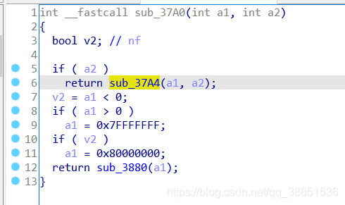

```
int __fastcall sub_37A4(int result, unsigned int a2)
{
  char v2; // nf
  signed int v3; // r12
  unsigned int v4; // r3
  char v5; // r0
  unsigned int v6; // r1
  unsigned int v7; // r2
  bool v8; // zf

  v3 = result ^ a2;
  if ( v2 )
    a2 = -a2;
  if ( a2 == 1 )
  {
    if ( (v3 ^ result) < 0 )
      result = -result;
  }
  else
  {
    v4 = result;
    if ( result < 0 )
      v4 = -result;
    if ( v4 <= a2 )
    {
      if ( v4 < a2 )
        result = 0;
      if ( v4 == a2 )
        result = (v3 >> 31) | 1;
    }
    else if ( (a2 & (a2 - 1)) != 0 )
    {
      v5 = __clz(a2) - __clz(v4);
      v6 = a2 << v5;
      v7 = 1 << v5;
      result = 0;
      while ( 1 )
      {
        if ( v4 >= v6 )
        {
          v4 -= v6;
          result |= v7;
        }
        if ( v4 >= v6 >> 1 )
        {
          v4 -= v6 >> 1;
          result |= v7 >> 1;
        }
        if ( v4 >= v6 >> 2 )
        {
          v4 -= v6 >> 2;
          result |= v7 >> 2;
        }
        if ( v4 >= v6 >> 3 )
        {
          v4 -= v6 >> 3;
          result |= v7 >> 3;
        }
        v8 = v4 == 0;
        if ( v4 )
        {
          v7 >>= 4;
          v8 = v7 == 0;
        }
        if ( v8 )
          break;
        v6 >>= 4;
      }
      if ( v3 < 0 )
        result = -result;
    }
    else
    {
      result = v4 >> (31 - __clz(a2));
      if ( v3 < 0 )
        result = -result;
    }
  }
  return result;
}
```

这个函数的逻辑看着不复杂，我们在JAVA中尝试实现一下

```
package com.lession9;

public class utils {
    public static void main(String[] args) {
        System.out.println("test");
        System.out.println("result:"+sub_37A4(1632325280, 26));
    }

    public static int sub_37A4(int a1, int a2){
        int a1_eor_a2 = a1 ^ a2;
        if ( a2 == 1 )
        {
            if ( (a1_eor_a2 ^ a1) < 0 )
                a1 = -a1;
        }else {
            int temp = a1;
            if ( a1 < 0 )
                temp = -a1;
            if ( temp <= a2 )                             // 如果input1 不大于 input2
            {
                if ( temp < a2 )
                    a1 = 0;
                if ( temp == a2 )
                    a1 = (a1_eor_a2 >> 31) | 1;
            }else if ( (a2 & (a2 - 1)) != 0 ){
                int v5 = __clz(a2) - __clz(temp);
                int v6 = a2 << v5;
                int v7 = 1 << v5;
                a1 = 0;
                while (true)
                {
                    if ( temp >= v6 )
                    {
                        temp -= v6;
                        a1 |= v7;
                    }
                    if ( temp >= v6 >> 1 )
                    {
                        temp -= v6 >> 1;
                        a1 |= v7 >> 1;
                    }
                    if ( temp >= v6 >> 2 )
                    {
                        temp -= v6 >> 2;
                        a1 |= v7 >> 2;
                    }
                    if ( temp >= v6 >> 3 )
                    {
                        temp -= v6 >> 3;
                        a1 |= v7 >> 3;
                    }
                    Boolean v8 = temp == 0;
                    if (temp!=0)
                    {
                        v7 >>= 4;
                        v8 = v7 == 0;
                    }
                    if ( v8 )
                        break;
                    v6 >>= 4;
                }
                if ( a1_eor_a2 < 0 ){
                    a1 = -a1;
                }
            }
            else
            {
                a1 = temp >> (31 - __clz(a2));
                if ( a1_eor_a2 < 0 )
                    a1 = -a1;
            }
        }
        return a1;
    }

    public static int __clz(int x)
    {
        int total_bits = 32;
        int res = 0;
        while ((x & (1 << (total_bits - 1))) == 0)
        {
            x = (x << 1);
            res++;
        }

        return res;
    }
}
```

但是我们的实现不一定靠谱，需要验证一下，主动调用测试1w次调用的结果

```
public int call37A4(int num1, int num2){
    List<Object> list = new ArrayList<>(10);
    list.add(num1);
    list.add(num2);
    Number number = module.callFunction(emulator, 0x37A4 + 1, list.toArray())[0];
    return number.intValue();
};
public static void main(String[] args) throws FileNotFoundException {
    blackbox test = new blackbox();
    //        test.hook37a0();
    //        System.out.println(test.callEncode());

    for(int i = 0; i<10000; i += 1){
        final double d = Math.random();
        final int temp = (int)(d*1000000);
        if(test.call37A4(temp, 26)!=utils.sub_37A4(temp, 26)){
            System.out.println(temp);
        };
    }

}
```

没出什么幺蛾子，到此我们可以说，前五个字节的来源和生成已经搞清楚了，样本的后两个字节，其生成也依赖于一系列的字节运算，感兴趣的话快试试吧!

## 尾声

链接：[https://pan.baidu.com/s/1zAe4KqIh3yBkf3FGafbe9Q](https://pan.baidu.com/s/1zAe4KqIh3yBkf3FGafbe9Q)  
提取码：0djf