> 这篇文章上次修改于 773 天前，可能其部分内容已经发生变化，如有疑问可询问作者。

原文 -> [https://blog.csdn.net/qq_38851536/article/details/118397129](https://blog.csdn.net/qq_38851536/article/details/118397129)

___

## 前言

这是SO逆向入门实战教程的第十篇，总共会有十三篇，十三个实战

-   通过该样本可以充分学习如何在unidbg中补充环境朋友zh3nu11和我共同完成了这篇内容，感谢

## 准备

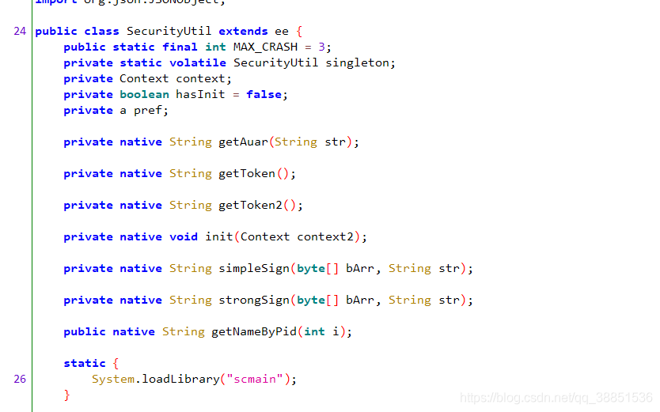

首先我们发现了init函数，它应该就是SO的初始化函数，其余的函数看名字也都很易懂

## Init模拟执行

我们首先用unidbg跑通Init初始化函数，先搭建基本框架

```
package com.article10;

import com.github.unidbg.AndroidEmulator;
import com.github.unidbg.Module;
import com.github.unidbg.linux.android.AndroidEmulatorBuilder;
import com.github.unidbg.linux.android.AndroidResolver;
import com.github.unidbg.linux.android.dvm.AbstractJni;
import com.github.unidbg.linux.android.dvm.DalvikModule;
import com.github.unidbg.linux.android.dvm.VM;
import com.github.unidbg.memory.Memory;

import java.io.File;

public class SecurityUtil extends AbstractJni {
    private final AndroidEmulator emulator;
    private final VM vm;
    private final Module module;

    public SecurityUtil(){
        emulator = AndroidEmulatorBuilder.for32Bit().build(); // 创建模拟器实例，要模拟32位或者64位，在这里区分
        final Memory memory = emulator.getMemory(); // 模拟器的内存操作接口
        memory.setLibraryResolver(new AndroidResolver(23)); // 设置系统类库解析
        vm = emulator.createDalvikVM(new File("base.apk"));

        DalvikModule dm = vm.loadLibrary(new File("libscmain.so"), true);
        module = dm.getModule();

        vm.setJni(this);
        vm.setVerbose(true);

        dm.callJNI_OnLoad(emulator);
    }

    public static void main(String[] args) {
        SecurityUtil test = new SecurityUtil();
    }
}
```

运行产生如下报错

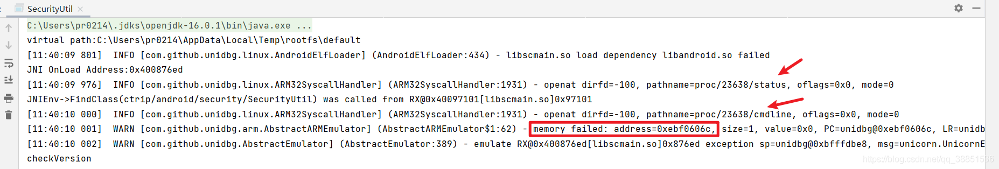

红框即报错原因，内存错误，箭头所指是根本原因，样本中open了这两个文件，但找不到，所以我们需要补充这两个文件

我们需要逐一做理解

1.proc/23638/xxx是什么

> proc文件系统由内核提供，它是一个伪文件系统，它只存在内存当中，而不占用外存空间。它以文件系统的方式为访问系统内核数据的操作提供接口。系统中当前运行的每一个进程都有对应的一个目录在 proc下，以进程的 PID号为目录名，它们是读取进程信息的接口。

此处的23638就是unidbg中APP的当前进程，每次运行，unidbg都会随机化给一个进程PID，就像Linux系统中一样

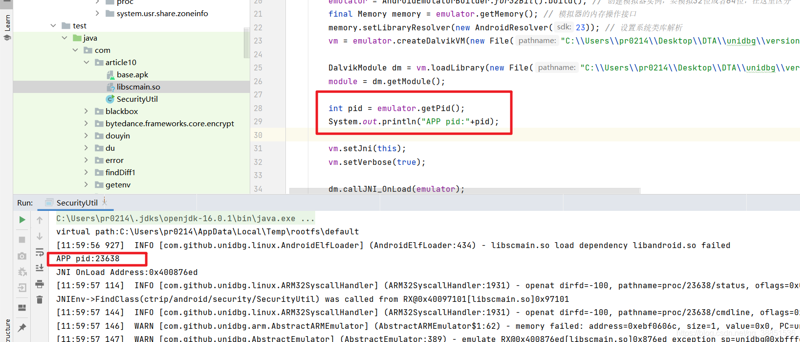

我修改了**src/main/java/com/github/unidbg/AbstractEmulator.java**中的如图位置，使PID固定，因为PID不停变动可能会影响后续分析，但这不是必须的操作

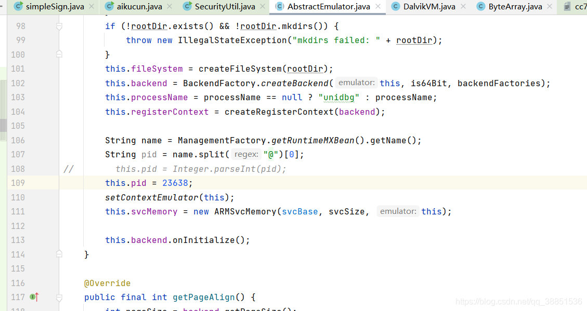

2.此处读取cmdline做什么

在Android系统中，进程的cmdline返回应用的进程名

那么此处的目的就很明显了，验证环境是否是”自己“的环境，防止应用被重打包

3.在unidbg中如何填补

proc 文件系统是伪文件系统，其目录下的所有文件，读写和正常文件没差别，所以在unidbg中做好文件的重定向就行了

三步走，实现IOResolver接口，注册接口，实现resolve方法并补充上我们的逻辑

```
package com.article10;

import com.github.unidbg.AndroidEmulator;
import com.github.unidbg.Emulator;
import com.github.unidbg.Module;
import com.github.unidbg.file.FileResult;
import com.github.unidbg.file.IOResolver;
import com.github.unidbg.linux.android.AndroidEmulatorBuilder;
import com.github.unidbg.linux.android.AndroidResolver;
import com.github.unidbg.linux.android.dvm.AbstractJni;
import com.github.unidbg.linux.android.dvm.DalvikModule;
import com.github.unidbg.linux.android.dvm.VM;
import com.github.unidbg.linux.file.ByteArrayFileIO;
import com.github.unidbg.memory.Memory;

import java.io.File;

public class SecurityUtil extends AbstractJni implements IOResolver {
    private final AndroidEmulator emulator;
    private final VM vm;
    private final Module module;

    public SecurityUtil(){
        emulator = AndroidEmulatorBuilder.for32Bit().build(); // 创建模拟器实例，要模拟32位或者64位，在这里区分
        emulator.getSyscallHandler().addIOResolver(this);
        final Memory memory = emulator.getMemory(); // 模拟器的内存操作接口
        memory.setLibraryResolver(new AndroidResolver(23)); // 设置系统类库解析
        vm = emulator.createDalvikVM(new File("base.apk"));

        DalvikModule dm = vm.loadLibrary(new File("libscmain.so"), true);
        module = dm.getModule();

        int pid = emulator.getPid();
        System.out.println("APP pid:"+pid);

        vm.setJni(this);
        vm.setVerbose(true);

        dm.callJNI_OnLoad(emulator);

    }

    public static void main(String[] args) {
        SecurityUtil test = new SecurityUtil();
    }

    @Override
    public FileResult resolve(Emulator emulator, String pathname, int oflags) {
        if (("proc/"+emulator.getPid()+"/cmdline").equals(pathname)) {
            return FileResult.success(new ByteArrayFileIO(oflags, pathname, "ctrip.android.view".getBytes()));
        }
        return null;
    }
}
```

那status呢？

该文件包含该进程的众多信息：可执行文件名、当前状态、PID和 PPID、实际及有效的 UID和 GID、内存使用情况、以及其他

我们可以随便看一个

```
root@hammerhead:/proc/9884 # cat status
Name:    adb
State:    S (sleeping)
Tgid:    9884
Pid:    9884
PPid:    1
TracerPid:    0
Uid:    2000    2000    2000    2000
Gid:    2000    2000    2000    2000
FDSize:    32
Groups:    1003 1004 1007 1011 1015 1028 3001 3002 3003 3006 
VmPeak:        4012 kB
VmSize:        2992 kB
VmLck:           0 kB
VmPin:           0 kB
VmHWM:         880 kB
VmRSS:         880 kB
VmData:        1196 kB
VmStk:         136 kB
VmExe:         104 kB
VmLib:        1304 kB
VmPTE:           8 kB
VmSwap:           0 kB
Threads:    2
SigQ:    1/12274
SigPnd:    0000000000000000
ShdPnd:    0000000000000000
SigBlk:    0000000000000000
SigIgn:    0000000000001000
SigCgt:    000000000000a4f8
CapInh:    0000000000000000
CapPrm:    0000000000000000
CapEff:    0000000000000000
CapBnd:    fffffff0000000c0
Cpus_allowed:    f
Cpus_allowed_list:    0-3
voluntary_ctxt_switches:    7
nonvoluntary_ctxt_switches:    38
```

一般而言，样本检测status是为了其中的TracerPid字段

TracerPid反调试的原理就是检测这个字段是否为0，为0说明没有被调试，不为0说明正在被调试，检测调试器直接退出就可以达到反调试的效果

所以我们常常这么处理——只返回TracerPid字段

```
@Override
public FileResult resolve(Emulator emulator, String pathname, int oflags) {
    if (("proc/"+emulator.getPid()+"/cmdline").equals(pathname)) {
        return FileResult.success(new ByteArrayFileIO(oflags, pathname, "ctrip.android.view".getBytes()));
    }
    if (("proc/" + emulator.getPid() + "/status").equals(pathname)) {
        return FileResult.<AndroidFileIO>success(new ByteArrayFileIO(oflags, pathname, "TracerPid:\t0\n".getBytes()));

    }
    return null;
}
```

有人可能会担心不保险，万一其他字段也被用到了呢，样本找不到这些字段导向错误逻辑怎么办？

这个情况是存在的，我们马上就说，先运行看看效果，emm，似乎跑通了

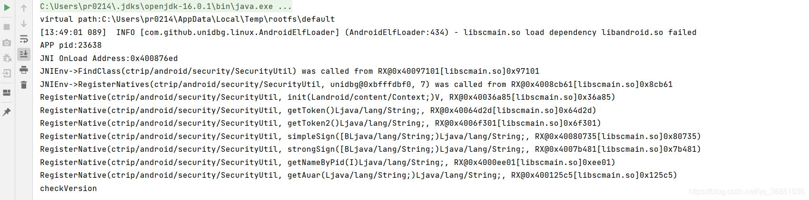

我们终于可以开始执行init函数了，但我打算先看看这个getNameByPid函数

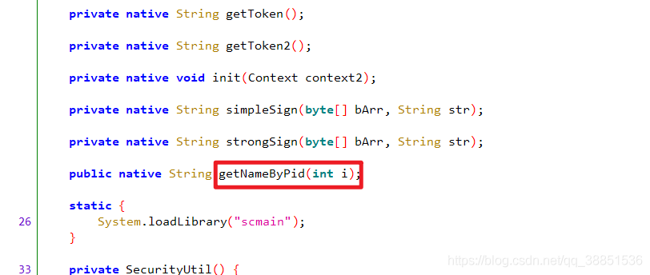

首先Frida Call 测试一下

```
function callgetPid(pid){
    var securityUtil = null;
    Java.perform(function () {
        Java.choose("ctrip.android.security.SecurityUtil", {
            //枚举时调用
            onMatch:function(instance){
                //打印实例
                securityUtil = instance;
                console.log("find instance")
            },
            //枚举完成后调用

            onComplete:function() {
                console.log("end")
            }});
        var result = securityUtil.getNameByPid(pid);
        console.log(result);
    })
}
```

看一下PID

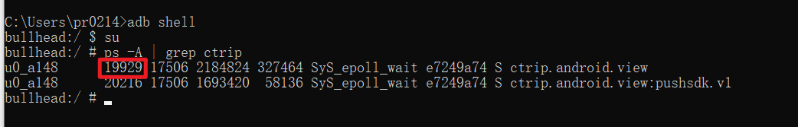

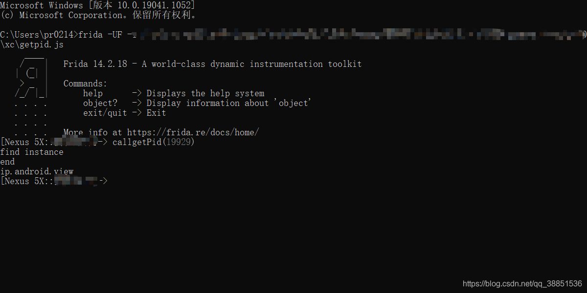

结果是ip.android.viewunidbg主动调用测试一下

```
package com.article10;

import com.github.unidbg.AndroidEmulator;
import com.github.unidbg.Emulator;
import com.github.unidbg.Module;
import com.github.unidbg.file.FileResult;
import com.github.unidbg.file.IOResolver;
import com.github.unidbg.file.linux.AndroidFileIO;
import com.github.unidbg.linux.android.AndroidEmulatorBuilder;
import com.github.unidbg.linux.android.AndroidResolver;
import com.github.unidbg.linux.android.dvm.AbstractJni;
import com.github.unidbg.linux.android.dvm.DalvikModule;
import com.github.unidbg.linux.android.dvm.DvmObject;
import com.github.unidbg.linux.android.dvm.VM;
import com.github.unidbg.linux.file.ByteArrayFileIO;
import com.github.unidbg.memory.Memory;
import org.apache.log4j.Level;
import org.apache.log4j.Logger;

import java.io.File;
import java.util.ArrayList;
import java.util.List;

public class SecurityUtil extends AbstractJni implements IOResolver {
    private final AndroidEmulator emulator;
    private final VM vm;
    private final Module module;

    public SecurityUtil(){
        emulator = AndroidEmulatorBuilder.for32Bit().build(); // 创建模拟器实例，要模拟32位或者64位，在这里区分
        emulator.getSyscallHandler().addIOResolver(this);
        final Memory memory = emulator.getMemory(); // 模拟器的内存操作接口
        memory.setLibraryResolver(new AndroidResolver(23)); // 设置系统类库解析
        vm = emulator.createDalvikVM(new File("base.apk"));

        DalvikModule dm = vm.loadLibrary(new File("libscmain.so"), true);
        module = dm.getModule();

        int pid = emulator.getPid();
        System.out.println("APP pid:"+pid);

        vm.setJni(this);
        vm.setVerbose(true);

        dm.callJNI_OnLoad(emulator);

    }

    public void callgetNameByPid(){
        List<Object> list = new ArrayList<>(10);
        list.add(vm.getJNIEnv());
        list.add(0);
        list.add(emulator.getPid());
        Number number = module.callFunction(emulator, 0xee01, list.toArray())[0];
        String name = vm.getObject(number.intValue()).getValue().toString();
        System.out.println(name);
    }
    
    public static void main(String[] args) {
        SecurityUtil test = new SecurityUtil();
        test.callgetNameByPid();
    }

    @Override
    public FileResult resolve(Emulator emulator, String pathname, int oflags) {
        if (("proc/"+emulator.getPid()+"/cmdline").equals(pathname)) {
            return FileResult.success(new ByteArrayFileIO(oflags, pathname, "ctrip.android.view".getBytes()));
        }
        if (("proc/" + emulator.getPid() + "/status").equals(pathname)) {
            return FileResult.<AndroidFileIO>success(new ByteArrayFileIO(oflags, pathname, "TracerPid:\t0\n".getBytes()));

        }
        return null;
    }
}
```

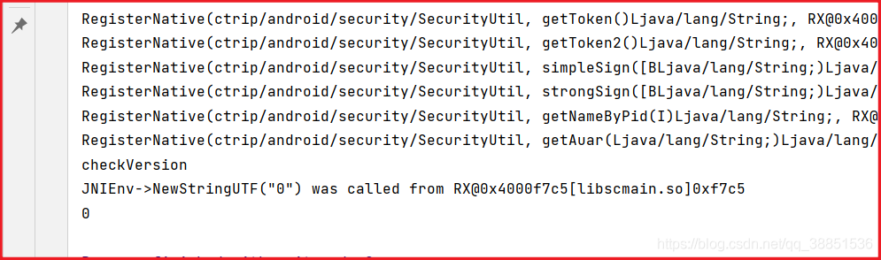

结果是0，实际上，这就是status没补齐全带来的锅

这是APP真实的status

```
bullhead:/proc/19929 # cat status
Name:   ip.android.view
State:  R (running)
Tgid:   19929
Pid:    19929
PPid:   17506
TracerPid:      0
Uid:    10148   10148   10148   10148
Gid:    10148   10148   10148   10148
FDSize: 512
Groups: 3002 3003 9997 20148 50148
VmPeak:  2224800 kB
VmSize:  2180604 kB
VmLck:         0 kB
VmPin:         0 kB
VmHWM:    354920 kB
VmRSS:    322600 kB
VmData:   375124 kB
VmStk:      8192 kB
VmExe:        20 kB
VmLib:    209888 kB
VmPTE:      2024 kB
VmSwap:     2952 kB
Threads:        122
SigQ:   2/6517
SigPnd: 0000000000000000
ShdPnd: 0000000000000000
SigBlk: 0000000000001204
SigIgn: 0000000000000000
SigCgt: 00000006400096fc
CapInh: 0000000000000000
CapPrm: 0000000000000000
CapEff: 0000000000000000
CapBnd: 0000000000000000
CapAmb: 0000000000000000
Seccomp:        2
Cpus_allowed:   0f
Cpus_allowed_list:      0-3
Mems_allowed:   1
Mems_allowed_list:      0
voluntary_ctxt_switches:        123395
nonvoluntary_ctxt_switches:     42
```

样本正是读取其中的Name，所以unidbg补环境一定要心细和谨慎，处处可能出问题

看一下修改后的重定向方法

```
@Override
public FileResult resolve(Emulator emulator, String pathname, int oflags) {
    if (("proc/"+emulator.getPid()+"/cmdline").equals(pathname)) {
        return FileResult.success(new ByteArrayFileIO(oflags, pathname, "ctrip.android.view".getBytes()));
    }
    if (("proc/" + emulator.getPid() + "/status").equals(pathname)) {
        return FileResult.success(new ByteArrayFileIO(oflags, pathname, ("Name:   ip.android.view\n" +
                "State:  R (running)\n" +
                "Tgid:   "+emulator.getPid()+"\n" +
                "Pid:    "+emulator.getPid()+"\n" +
                "PPid:   17506\n" +
                "TracerPid:      0\n" +
                "Uid:    10148   10148   10148   10148\n" +
                "Gid:    10148   10148   10148   10148\n" +
                "FDSize: 512\n" +
                "Groups: 3002 3003 9997 20148 50148\n" +
                "VmPeak:  2224800 kB\n" +
                "VmSize:  2185240 kB\n" +
                "VmLck:         0 kB\n" +
                "VmPin:         0 kB\n" +
                "VmHWM:    354920 kB\n" +
                "VmRSS:    324572 kB\n" +
                "VmData:   379340 kB\n" +
                "VmStk:      8192 kB\n" +
                "VmExe:        20 kB\n" +
                "VmLib:    209888 kB\n" +
                "VmPTE:      2020 kB\n" +
                "VmSwap:     3012 kB\n" +
                "Threads:        127\n" +
                "SigQ:   2/6517\n" +
                "SigPnd: 0000000000000000\n" +
                "ShdPnd: 0000000000000000\n" +
                "SigBlk: 0000000000001204\n" +
                "SigIgn: 0000000000000000\n" +
                "SigCgt: 00000006400096fc\n" +
                "CapInh: 0000000000000000\n" +
                "CapPrm: 0000000000000000\n" +
                "CapEff: 0000000000000000\n" +
                "CapBnd: 0000000000000000\n" +
                "CapAmb: 0000000000000000\n" +
                "Seccomp:        2\n" +
                "Cpus_allowed:   0f\n" +
                "Cpus_allowed_list:      0-3\n" +
                "Mems_allowed:   1\n" +
                "Mems_allowed_list:      0\n" +
                "voluntary_ctxt_switches:        21102\n" +
                "nonvoluntary_ctxt_switches:     20849").getBytes()));
    }
    return null;
}
```

接下来步入正题——执行init方法！增改内容如下，并运行

```
public void callInit(){
    List<Object> list = new ArrayList<>(10);
    list.add(vm.getJNIEnv());
    list.add(0);
    DvmObject<?> context = vm.resolveClass("android/content/Context").newObject(null);// context
    list.add(vm.addLocalObject(context));
    module.callFunction(emulator, 0x36a85, list.toArray());
};

public static void main(String[] args) {
    SecurityUtil test = new SecurityUtil();
    test.callInit();
}
```

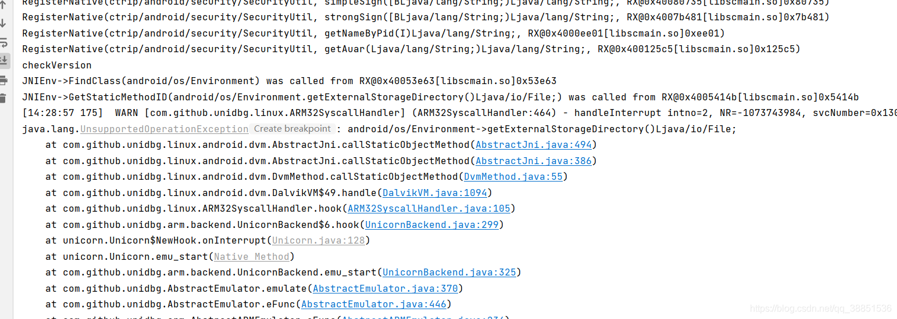

补JAVA环境是unidbg中的基础活，但它是有技巧的，善用JNITrace可以补的又快又好，比如本篇的unidbg环境，就是在1h内补好的如果补环境有问题或者不会补，欢迎评论区或者课上交流讨论

见招拆招补充几个后

```
@Override
public DvmObject<?> callStaticObjectMethod(BaseVM vm, DvmClass dvmClass, String signature, VarArg varArg) {
    switch (signature) {
        case "android/os/Environment->getExternalStorageDirectory()Ljava/io/File;":{
            return vm.resolveClass("java/io/File").newObject(signature);
        }
    }
    return super.callStaticObjectMethod(vm, dvmClass, signature, varArg);
}

@Override
public DvmObject<?> callObjectMethod(BaseVM vm, DvmObject<?> dvmObject, String signature, VarArg varArg) {
    switch (signature) {
        case "java/io/File->getPath()Ljava/lang/String;":{
            System.out.println("PATH:"+dvmObject.getValue());
            if(dvmObject.getValue().equals("android/os/Environment->getExternalStorageDirectory()Ljava/io/File;")){
                return new StringObject(vm, "/mnt/sdcard");
            }
            if(dvmObject.getValue()=="android/content/Context->getFilesDir()Ljava/io/File;"){
                return new StringObject(vm, "/data/data/ctrip.android.view/files");
            }
        }
        case "android/content/Context->getPackageResourcePath()Ljava/lang/String;":
            return new StringObject(vm, "/data/app/ctrip.android.view-fM4xyjk_eygpJsiITNW4JA==/base.apk");
        case "android/content/Context->getFilesDir()Ljava/io/File;":
            return vm.resolveClass("java/io/File").newObject(signature);
        case "android/content/Context->getAssets()Landroid/content/res/AssetManager;":
            return new AssetManager(vm, signature);
    }

    return super.callObjectMethod(vm, dvmObject, signature, varArg);
}
```

报错了，这次看不出啥明显错误

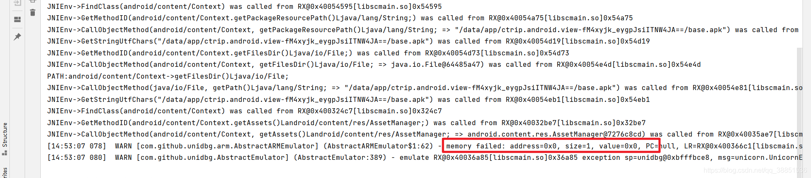

日志全开再看看，好像更迷糊了

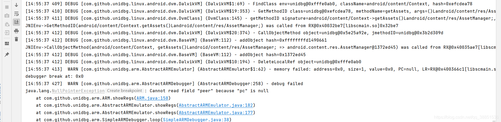

但其实这个问题我们早就讲过了，Android中通过libandroid.so对Assets资源文件进行操作，日志中可以看到”getAssets“等字眼

但是由于libandroid.so的依赖SO太多了，unidbg很难一一处理，所以资源文件相关的处理会报错

为此unidbg做了一个折中的解决防范——可以自己注册虚拟模块，或者叫虚拟SO，libandroid.so已经由作者实现了，实现了常用的几个Assets操作的API

只用加上这一行就行，需要注意必须在样本SO之前加载或者叫注册进去

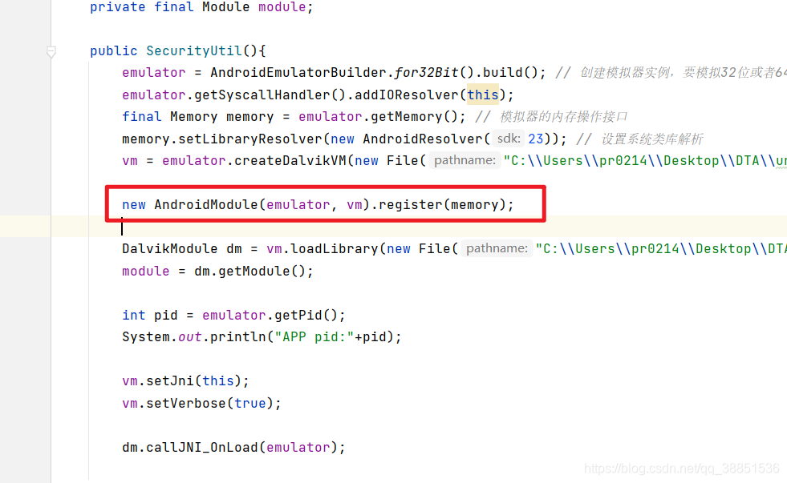

继续运行，为什么还报错

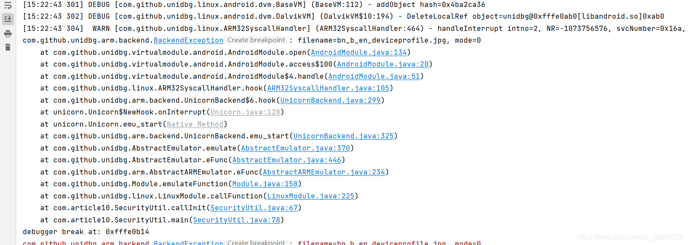

是这样的，样本在通过虚拟SO读取资源文件，资源的读取有四种模式

```
/** Available access modes for opening assets with {@link AAssetManager_open} */
enum {
    /** No specific information about how data will be accessed. **/
    AASSET_MODE_UNKNOWN      = 0,
    /** Read chunks, and seek forward and backward. */
    AASSET_MODE_RANDOM       = 1,
    /** Read sequentially, with an occasional forward seek. */
    AASSET_MODE_STREAMING    = 2,
    /** Caller plans to ask for a read-only buffer with all data. */
    AASSET_MODE_BUFFER       = 3
};
```

但作者只实现了模式1和2，而此处使用mode 0

mode 0没有啥特殊处理要做，我们直接合并入mode 2和3的逻辑即可

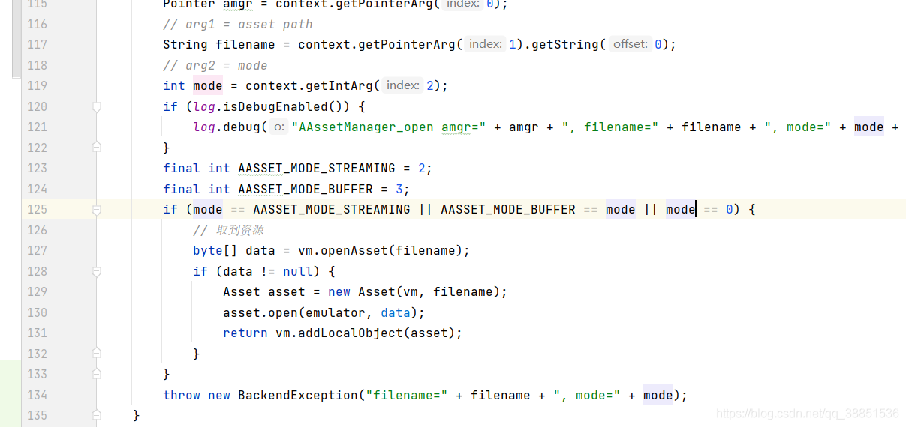

继续运行，即已经过了这个坑

有的人可能会困惑，Native层读写资源文件做什么？其实这是常见做法，比如把key编码进资源文件的一张图片里，Native层去读取这个资源文件获取key

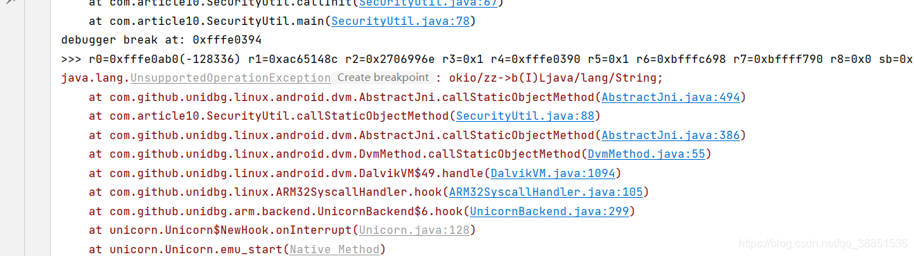

下面就是继续补JAVA环境，使用JNItrace辅助，飞速补完

补完后代码整体长这样

```
package com.article10;

import com.github.unidbg.AndroidEmulator;
import com.github.unidbg.Emulator;
import com.github.unidbg.Module;
import com.github.unidbg.file.FileResult;
import com.github.unidbg.file.IOResolver;
import com.github.unidbg.file.linux.AndroidFileIO;
import com.github.unidbg.linux.android.AndroidEmulatorBuilder;
import com.github.unidbg.linux.android.AndroidResolver;
import com.github.unidbg.linux.android.dvm.*;
import com.github.unidbg.linux.android.dvm.api.AssetManager;
import com.github.unidbg.linux.android.dvm.array.ByteArray;
import com.github.unidbg.linux.file.ByteArrayFileIO;
import com.github.unidbg.memory.Memory;
import com.github.unidbg.virtualmodule.android.AndroidModule;
import org.apache.log4j.Level;
import org.apache.log4j.Logger;

import java.io.File;
import java.util.ArrayList;
import java.util.List;

public class SecurityUtil extends AbstractJni implements IOResolver {
    private final AndroidEmulator emulator;
    private final VM vm;
    private final Module module;

    public SecurityUtil(){
        emulator = AndroidEmulatorBuilder.for32Bit().build(); // 创建模拟器实例，要模拟32位或者64位，在这里区分
        emulator.getSyscallHandler().addIOResolver(this);
        final Memory memory = emulator.getMemory(); // 模拟器的内存操作接口
        memory.setLibraryResolver(new AndroidResolver(23)); // 设置系统类库解析
        vm = emulator.createDalvikVM(new File("base.apk"));

        new AndroidModule(emulator, vm).register(memory);

        DalvikModule dm = vm.loadLibrary(new File("libscmain.so"), true);
        module = dm.getModule();

        int pid = emulator.getPid();
        System.out.println("APP pid:"+pid);

        vm.setJni(this);
        vm.setVerbose(true);

        dm.callJNI_OnLoad(emulator);

    }

    public void callgetNameByPid(){
        List<Object> list = new ArrayList<>(10);
        list.add(vm.getJNIEnv());
        list.add(0);
        list.add(emulator.getPid());
        Number number = module.callFunction(emulator, 0xee01, list.toArray())[0];
        String name = vm.getObject(number.intValue()).getValue().toString();
        System.out.println(name);
    }

    public void callInit(){
        List<Object> list = new ArrayList<>(10);
        list.add(vm.getJNIEnv());
        list.add(0);
        DvmObject<?> context = vm.resolveClass("android/content/Context").newObject(null);// context
        list.add(vm.addLocalObject(context));
        module.callFunction(emulator, 0x36a85, list.toArray());
    };

    public static void main(String[] args) {
        Logger.getLogger("com.github.unidbg.linux.ARM32SyscallHandler").setLevel(Level.DEBUG);
        Logger.getLogger("com.github.unidbg.unix.UnixSyscallHandler").setLevel(Level.DEBUG);
        Logger.getLogger("com.github.unidbg.AbstractEmulator").setLevel(Level.DEBUG);
        Logger.getLogger("com.github.unidbg.linux.android.dvm.DalvikVM").setLevel(Level.DEBUG);
        Logger.getLogger("com.github.unidbg.linux.android.dvm.BaseVM").setLevel(Level.DEBUG);
        Logger.getLogger("com.github.unidbg.linux.android.dvm").setLevel(Level.DEBUG);
        SecurityUtil test = new SecurityUtil();
        test.callInit();
    }

    @Override
    public DvmObject<?> callStaticObjectMethod(BaseVM vm, DvmClass dvmClass, String signature, VarArg varArg) {
        switch (signature) {
            case "android/os/Environment->getExternalStorageDirectory()Ljava/io/File;":{
                return vm.resolveClass("java/io/File").newObject(signature);
            }
            case "okio/zz->b(I)Ljava/lang/String;":{
                int key = varArg.getInt(0);
                switch (key){
                    case 1:{
                        return new StringObject(vm, "353626076466627");
                    }
                    case 0:{
                        return new StringObject(vm, "8cff8823cf19b5ec");
                    }
                    case 101:{
                        return new StringObject(vm, "25483");
                    }
                    case 103:{
                        return new StringObject(vm, "1920*1080");
                    }
                    case 104:{
                        return new StringObject(vm, "");
                    }
                    case 102:{
                        return new StringObject(vm, "17637");
                    }
                    case 105:{
                        return new StringObject(vm, "WIFI");
                    }
                    case 106:{
                        return new StringObject(vm, "0.0.0.0:0");
                    }
                    case 8:{
                        return new StringObject(vm, "0.0.0.0:0");
                    }
                    case 9:{
                        return new StringObject(vm, "");
                    }
                    case 10:{
                        return new StringObject(vm, "00:00:00:00:00:00");
                    }
                    case 107:{
                        return new StringObject(vm, "[full-100]");
                    }
                    case 108:{
                        return new StringObject(vm, "78");
                    }
                }
                System.out.println("okio/zz->b(I) Key:"+key);
            }
            case "java/net/NetworkInterface->getByName(Ljava/lang/String;)Ljava/net/NetworkInterface;":{
                String name = null;
                DvmObject<?> namedvm = varArg.getObject(0);
                if(namedvm!=null){
                    name = (String) namedvm.getValue();
                }
                return vm.resolveClass("java/net/NetworkInterface").newObject(name);
            }
        }
        return super.callStaticObjectMethod(vm, dvmClass, signature, varArg);
    }

    @Override
    public DvmObject<?> callObjectMethod(BaseVM vm, DvmObject<?> dvmObject, String signature, VarArg varArg) {
        switch (signature) {
            case "java/io/File->getPath()Ljava/lang/String;":{
                System.out.println("PATH:"+dvmObject.getValue());
                if(dvmObject.getValue().equals("android/os/Environment->getExternalStorageDirectory()Ljava/io/File;")){
                    return new StringObject(vm, "/mnt/sdcard");
                }
                if(dvmObject.getValue()=="android/content/Context->getFilesDir()Ljava/io/File;"){
                    return new StringObject(vm, "/data/data/ctrip.android.view/files");
                }
            }
            case "android/content/Context->getPackageResourcePath()Ljava/lang/String;":
                return new StringObject(vm, "/data/app/ctrip.android.view-fM4xyjk_eygpJsiITNW4JA==/base.apk");
            case "android/content/Context->getFilesDir()Ljava/io/File;":
                return vm.resolveClass("java/io/File").newObject(signature);
            case "android/content/Context->getAssets()Landroid/content/res/AssetManager;":
                return new AssetManager(vm, signature);
            case "java/net/NetworkInterface->getHardwareAddress()[B":
                byte[] result = hexStringToByteArray("64BC0C65AA1E");
                return new ByteArray(vm, result);
        }

        return super.callObjectMethod(vm, dvmObject, signature, varArg);
    }

    public static byte[] hexStringToByteArray(String s) {
        int len = s.length();
        byte[] data = new byte[len / 2];
        for (int i = 0; i < len; i += 2) {
            data[i / 2] = (byte) ((Character.digit(s.charAt(i), 16) << 4)
                    + Character.digit(s.charAt(i+1), 16));
        }
        return data;
    }

    @Override
    public FileResult resolve(Emulator emulator, String pathname, int oflags) {
        if (("proc/"+emulator.getPid()+"/cmdline").equals(pathname)) {
            return FileResult.success(new ByteArrayFileIO(oflags, pathname, "ctrip.android.view".getBytes()));
        }
        if (("proc/" + emulator.getPid() + "/status").equals(pathname)) {
            return FileResult.success(new ByteArrayFileIO(oflags, pathname, ("Name:   ip.android.view\n" +
                    "State:  R (running)\n" +
                    "Tgid:   "+emulator.getPid()+"\n" +
                    "Pid:    "+emulator.getPid()+"\n" +
                    "PPid:   17506\n" +
                    "TracerPid:      0\n" +
                    "Uid:    10148   10148   10148   10148\n" +
                    "Gid:    10148   10148   10148   10148\n" +
                    "FDSize: 512\n" +
                    "Groups: 3002 3003 9997 20148 50148\n" +
                    "VmPeak:  2224800 kB\n" +
                    "VmSize:  2185240 kB\n" +
                    "VmLck:         0 kB\n" +
                    "VmPin:         0 kB\n" +
                    "VmHWM:    354920 kB\n" +
                    "VmRSS:    324572 kB\n" +
                    "VmData:   379340 kB\n" +
                    "VmStk:      8192 kB\n" +
                    "VmExe:        20 kB\n" +
                    "VmLib:    209888 kB\n" +
                    "VmPTE:      2020 kB\n" +
                    "VmSwap:     3012 kB\n" +
                    "Threads:        127\n" +
                    "SigQ:   2/6517\n" +
                    "SigPnd: 0000000000000000\n" +
                    "ShdPnd: 0000000000000000\n" +
                    "SigBlk: 0000000000001204\n" +
                    "SigIgn: 0000000000000000\n" +
                    "SigCgt: 00000006400096fc\n" +
                    "CapInh: 0000000000000000\n" +
                    "CapPrm: 0000000000000000\n" +
                    "CapEff: 0000000000000000\n" +
                    "CapBnd: 0000000000000000\n" +
                    "CapAmb: 0000000000000000\n" +
                    "Seccomp:        2\n" +
                    "Cpus_allowed:   0f\n" +
                    "Cpus_allowed_list:      0-3\n" +
                    "Mems_allowed:   1\n" +
                    "Mems_allowed_list:      0\n" +
                    "voluntary_ctxt_switches:        21102\n" +
                    "nonvoluntary_ctxt_switches:     20849").getBytes()));
        }
        return null;
    }
}
```

接下来遇到报错

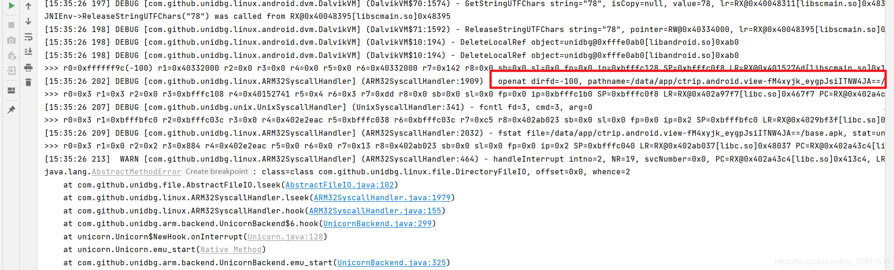

样本在读取apk文件，继续在resolve方法中做好重定向的工作

```
if (("/data/app/ctrip.android.view-fM4xyjk_eygpJsiITNW4JA==/base.apk").equals(pathname)) {
    return FileResult.success(new SimpleFileIO(oflags, new File("yourAPkpath\\xxx.apk"), pathname));
}
```

继续运行，可能再补充一些JAVA环境，整体没有报错了，似乎init补充完了

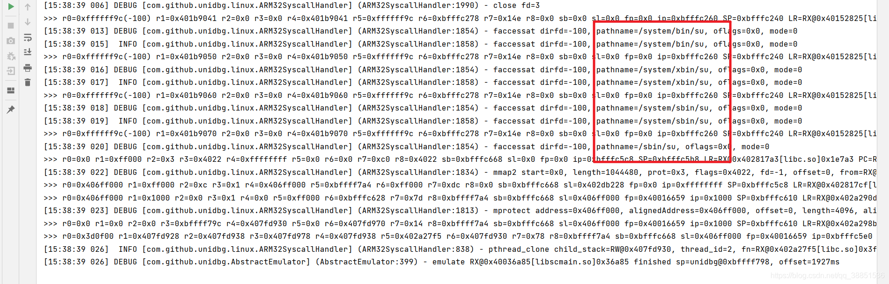

日志结尾看到样本对这些文件进行访问，虽然没有报错，但我们可能会好奇，它在做什么呢？

事实上，如果存在这些文件，则说明手机已经Root，样本在试图访问这些文件，来判断系统是否被Root了

我们这里不做任何处理

## unidbg模拟执行SimpleSign

先Frida call一下，参数二固定，参数一可自行修改

```
function callSimpleSign(){
    var securityUtil = null;
    Java.perform(function () {
        Java.choose("ctrip.android.security.SecurityUtil", {
            //枚举时调用
            onMatch:function(instance){
                //打印实例
                securityUtil = instance;
                console.log("find instance")
            },
            //枚举完成后调用

            onComplete:function() {
                console.log("end")
            }});
        var input1 = stringToBytes("7be9f13e7f5426d139cb4e5dbb1fdba7")
        var result = securityUtil.simpleSign(input1, "getdata");
        console.log(result);
    })
}
```

结果恒为75位长度，且相同输入也会有不同输出，原因未知

接下来unidbg中测试

```
public void callSimpleSign(){
    List<Object> list = new ArrayList<>(10);
    list.add(vm.getJNIEnv());
    list.add(0);
    String input = "7be9f13e7f5426d139cb4e5dbb1fdba7";
    byte[] inputByte = input.getBytes(StandardCharsets.UTF_8);
    ByteArray inputByteArray = new ByteArray(vm,inputByte);
    list.add(vm.addLocalObject(inputByteArray));
    list.add(vm.addLocalObject(new StringObject(vm, "getdata")));
    Number number = module.callFunction(emulator, 0x80735, list.toArray())[0];
    System.out.println(vm.getObject(number.intValue()).getValue().toString());
};

public static void main(String[] args) {
    Logger.getLogger("com.github.unidbg.linux.ARM32SyscallHandler").setLevel(Level.DEBUG);
    Logger.getLogger("com.github.unidbg.unix.UnixSyscallHandler").setLevel(Level.DEBUG);
    Logger.getLogger("com.github.unidbg.AbstractEmulator").setLevel(Level.DEBUG);
    Logger.getLogger("com.github.unidbg.linux.android.dvm.DalvikVM").setLevel(Level.DEBUG);
    Logger.getLogger("com.github.unidbg.linux.android.dvm.BaseVM").setLevel(Level.DEBUG);
    Logger.getLogger("com.github.unidbg.linux.android.dvm").setLevel(Level.DEBUG);
    SecurityUtil test = new SecurityUtil();
    test.callInit();
    System.out.println("call SimpleSign");
    test.callSimpleSign();
}
```

结果也很顺利，如果报错，则根据缺失的JAVA环境继续补即可

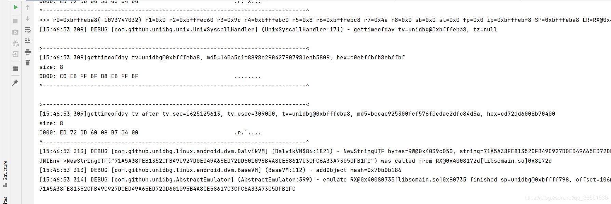

考虑一个小问题，即使明文一致，结果也一直在变，这是为什么呢？有哪些原因可能导致这个结果呢？

（PS：提示，时间戳、内联汇编

## 尾声

相关程序和资料放群里，防止遇到恶意举报