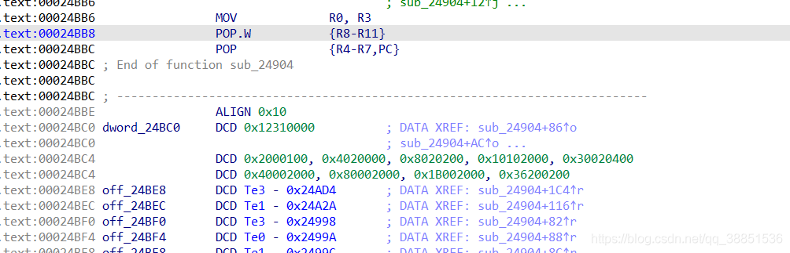

## 前言

这是 SO 逆向入门实战教程的第十一篇，总共会有十一篇，~十三~十一个实战（PS：更多实战在龙哥星球

- 出于学习和研究的目的，对 shield 的模拟执行和算法分析，本篇不会太过详细，只会讲解关键点

## unidbg 模拟执行

shield 的模拟执行并没什么难度，依照此前所述，JNItrace 就能基本解决问题

因为 shield 通过拦截器去完成参数的封装，所以为了更加优雅的实现，我们在代码中引入 OkHttp 库


但这并不是必须的，只是这样做更优雅

```
package com.article13;

import com.github.unidbg.AndroidEmulator;
import com.github.unidbg.Module;
import com.github.unidbg.linux.android.AndroidEmulatorBuilder;
import com.github.unidbg.linux.android.AndroidResolver;
import com.github.unidbg.linux.android.SystemPropertyHook;
import com.github.unidbg.linux.android.SystemPropertyProvider;
import com.github.unidbg.linux.android.dvm.*;
import com.github.unidbg.linux.android.dvm.array.ByteArray;
import com.github.unidbg.memory.Memory;
import okhttp3.*;
import okio.Buffer;
import okio.BufferedSink;
import org.apache.commons.codec.binary.Base64;

import java.awt.geom.RectangularShape;
import java.io.File;
import java.io.IOException;
import java.nio.charset.Charset;
import java.util.ArrayList;
import java.util.List;

public class xhs extends AbstractJni {
    private final AndroidEmulator emulator;
    private final VM vm;
    private final Module module;
    private Headers headers;
    private Request request;
    private String url;

    xhs(){
        emulator = AndroidEmulatorBuilder.for32Bit().setProcessName("com.xhs").build(); // 创建模拟器实例，要模拟32位或者64位，在这里区分
        final Memory memory = emulator.getMemory(); // 模拟器的内存操作接口
        memory.setLibraryResolver(new AndroidResolver(23)); // 设置系统类库解析
        vm = emulator.createDalvikVM(new File("E:\\unidbg-master\\unidbg-master\\unidbg-android\\src\\test\\resources\\example_binaries\\xhs\\xhs-armv7.apk"));
        vm.setVerbose(true);

        DalvikModule dm = vm.loadLibrary(new File("E:\\unidbg-master\\unidbg-master\\unidbg-android\\src\\test\\resources\\example_binaries\\xhs\\libshield.so"), true);

        vm.setJni(this);
        module = dm.getModule();
        System.out.println("call JNIOnLoad");
        dm.callJNI_OnLoad(emulator);

        url = "https://edith.xiaohongshu.com/api/sns/v6/homefeed?oid=homefeed_recommend&cursor_score=&geo=eyJsYXRpdHVkZSI6MC4wMDAwMDAsImxvbmdpdHVkZSI6MC4wMDAwMDB9%0A&trace_id=7e9cea5d-3e7c-3240-bf3d-20e221557b61&note_index=0&refresh_type=1&client_volume=0.60&preview_ad=&loaded_ad=%7B%22ads_id_list%22%3A%5B%5D%7D&personalization=1&pin_note_id=&pin_note_source=&unread_begin_note_id=60da0881000000002103ef52&unread_end_note_id=60e2abe5000000000102aced&unread_note_count=6";

        request = new Request.Builder()
                .url(url)
                .addHeader("X-B3-TraceId", "4a4a3a065c180b0f")
                .addHeader("xy-common-params", "fid=16254550111059c4b478ba32dc122790a4f7e9261f0e&device_fingerprint=20210101000953d097cda53c248c488cadcce5ec7882880173338edc38b45d&device_fingerprint1=20210101000953d097cda53c248c488cadcce5ec7882880173338edc38b45d&launch_id=1625473798&tz=Asia%2FShanghai&channel=PMgdt19935737&versionName=6.97.0.1&deviceId=1d41ebdc-86dd-33ea-9ceb-e9210babd74e&platform=android&sid=session.1625455019284508278852&identifier_flag=4&t=1625473812&project_id=ECFAAF&build=6970181&x_trace_page_current=explore_feed&lang=zh-Hans&app_id=ECFAAF01&uis=light")
                .addHeader("User-Agent", "Dalvik/2.1.0 (Linux; U; Android 10; MIX 2S MIUI/V12.0.2.0.QDGCNXM) Resolution/1080*2160 Version/6.97.0.1 Build/6970181 Device/(Xiaomi;MIX 2S) discover/6.97.0.1 NetType/CellNetwork")
                .build();

    }

    // 第一个初始化函数
    public void callinitializeNative(){
        List<Object> list = new ArrayList<>(10);
        list.add(vm.getJNIEnv()); // 第一个参数是env
        list.add(0); // 第二个参数，实例方法是jobject，静态方法是jclazz，可以填0，但最好是构造一下
        module.callFunction(emulator, 0x6c11d, list.toArray());
    };

    // 第二个初始化函数
    public long callinitialize(){
        List<Object> list = new ArrayList<>(10);
        list.add(vm.getJNIEnv()); // 第一个参数是env
        list.add(0); // 第二个参数，实例方法是jobject，静态方法是jclazz，可以填0，但最好是构造一下
        list.add(vm.addLocalObject(new StringObject(vm, "main")));
        Number number = module.callFunction(emulator, 0x6b801, list.toArray())[0];
        return number.longValue();
    }

    // 目标函数
    public void callintercept(long ptr){
        List<Object> list = new ArrayList<>(10);
        list.add(vm.getJNIEnv()); // 第一个参数是env
        list.add(0); // 第二个参数，实例方法是jobject，静态方法是jclazz，可以填0，但最好是构造一下
        DvmObject<?> chain = vm.resolveClass("okhttp3/Interceptor$Chain").newObject(null);
        list.add(vm.addLocalObject(chain));
        list.add(ptr);
        module.callFunction(emulator, 0x6b9e9, list.toArray());
    };
    public static void main(String[] args) {
        xhs test = new xhs();
        test.callinitializeNative();
        long ptr = test.callinitialize();
        System.out.println("call intercept");
        test.callintercept(ptr);
    }

    @Override
    public DvmObject<?> getStaticObjectField(BaseVM vm, DvmClass dvmClass, String signature) {
        switch (signature){
            case "com/xingin/shield/http/ContextHolder->sLogger:Lcom/xingin/shield/http/ShieldLogger;":{
                return vm.resolveClass("com/xingin/shield/http/ShieldLogger").newObject(signature);
            }
            case "com/xingin/shield/http/ContextHolder->sDeviceId:Ljava/lang/String;":{
                return new StringObject(vm, "1d41ebdc-86dd-33ea-9ceb-e9210babd74e");
            }
        }
        return super.getStaticObjectField(vm, dvmClass, signature);
    }

    @Override
    public void callVoidMethodV(BaseVM vm, DvmObject<?> dvmObject, String signature, VaList vaList) {
        switch (signature){
            case "com/xingin/shield/http/ShieldLogger->nativeInitializeStart()V":{
                return;
            }
            case "com/xingin/shield/http/ShieldLogger->nativeInitializeEnd()V": {
                return;
            }
            case "com/xingin/shield/http/ShieldLogger->initializeStart()V": {
                return;
            }
            case "com/xingin/shield/http/ShieldLogger->initializedEnd()V": {
                return;
            }
            case "com/xingin/shield/http/ShieldLogger->buildSourceStart()V": {
                return;
            }
            case "okhttp3/RequestBody->writeTo(Lokio/BufferedSink;)V": {
                BufferedSink bufferedSink = (BufferedSink) vaList.getObjectArg(0).getValue();
                RequestBody requestBody = (RequestBody) dvmObject.getValue();
                if(requestBody != null){
                    try {
                        requestBody.writeTo(bufferedSink);
                    } catch (IOException e) {
                        e.printStackTrace();
                    }
                }
                return;
            }
            case "com/xingin/shield/http/ShieldLogger->buildSourceEnd()V": {
                return;
            }
            case "com/xingin/shield/http/ShieldLogger->calculateStart()V": {
                System.out.println("calculateStart —— 开始计算");
                return;
            }
            case "com/xingin/shield/http/ShieldLogger->calculateEnd()V": {
                System.out.println("calculateEnd —— 结束计算");
                return;
            }
        }
        super.callVoidMethodV(vm, dvmObject, signature, vaList);
    }

    @Override
    public DvmObject<?> callStaticObjectMethodV(BaseVM vm, DvmClass dvmClass, String signature, VaList vaList) {
        switch (signature){
            case "java/nio/charset/Charset->defaultCharset()Ljava/nio/charset/Charset;":{
                return vm.resolveClass("java/nio/charset/Charset").newObject(Charset.defaultCharset());
            }
            case "com/xingin/shield/http/Base64Helper->decode(Ljava/lang/String;)[B":{
                String input = (String) vaList.getObjectArg(0).getValue();
                byte[] result = Base64.decodeBase64(input);
                return new ByteArray(vm, result);
            }
        }
        return super.callStaticObjectMethodV(vm, dvmClass, signature, vaList);
    }

    @Override
    public int getIntField(BaseVM vm, DvmObject<?> dvmObject, String signature) {
        switch (signature){
            case "android/content/pm/PackageInfo->versionCode:I":{
                return 6970181;
            }
        }
        return super.getIntField(vm, dvmObject, signature);
    }

    @Override
    public int getStaticIntField(BaseVM vm, DvmClass dvmClass, String signature) {
        switch (signature){
            case "com/xingin/shield/http/ContextHolder->sAppId:I":{
                return -319115519;
            }
        }
        return super.getStaticIntField(vm, dvmClass, signature);
    }

    @Override
    public DvmObject<?> callObjectMethodV(BaseVM vm, DvmObject<?> dvmObject, String signature, VaList vaList) {
        switch (signature) {
            case "android/content/Context->getSharedPreferences(Ljava/lang/String;I)Landroid/content/SharedPreferences;":
                return vm.resolveClass("android/content/SharedPreferences").newObject(vaList.getObjectArg(0));
            case "android/content/SharedPreferences->getString(Ljava/lang/String;Ljava/lang/String;)Ljava/lang/String;": {
                if(((StringObject) dvmObject.getValue()).getValue().equals("s")){
                    System.out.println("getString :"+vaList.getObjectArg(0).getValue());
                    if (vaList.getObjectArg(0).getValue().equals("main")) {
                        return new StringObject(vm, "");
                    }
                    if(vaList.getObjectArg(0).getValue().equals("main_hmac")){
                        return  new StringObject(vm, "eSwKRbpB4OfG+D8ofTHooZrXr1b0B+ZDVsxHEr7K7yTWiiVX/bZl0E8D6+6645aLIAZ0+geJrjMLyyrXA99xApWvssdRm01Cg8PRVJhEvWqyHNAS73/z0OLspXVmhaSs");
                    }
                }
            }
            case "okhttp3/Interceptor$Chain->request()Lokhttp3/Request;": {
                DvmClass clazz = vm.resolveClass("okhttp3/Request");
                return clazz.newObject(request);
            }
            case "okhttp3/Request->url()Lokhttp3/HttpUrl;": {
                DvmClass clazz = vm.resolveClass("okhttp3/HttpUrl");
                Request request = (Request) dvmObject.getValue();
                return clazz.newObject(request.url());
            }
            case "okhttp3/HttpUrl->encodedPath()Ljava/lang/String;": {
                HttpUrl httpUrl = (HttpUrl) dvmObject.getValue();
                return new StringObject(vm, httpUrl.encodedPath());
            }
            case "okhttp3/HttpUrl->encodedQuery()Ljava/lang/String;": {
                HttpUrl httpUrl = (HttpUrl) dvmObject.getValue();
                return new StringObject(vm, httpUrl.encodedQuery());
            }
            case "okhttp3/Request->body()Lokhttp3/RequestBody;": {
                Request request = (Request) dvmObject.getValue();
                return vm.resolveClass("okhttp3/RequestBody").newObject(request.body());
            }
            case "okhttp3/Request->headers()Lokhttp3/Headers;": {
                Request request = (Request) dvmObject.getValue();
                return vm.resolveClass("okhttp3/Headers").newObject(request.headers());
            }
            case "okio/Buffer->writeString(Ljava/lang/String;Ljava/nio/charset/Charset;)Lokio/Buffer;": {
                System.out.println("write to my buffer:"+vaList.getObjectArg(0).getValue());
                Buffer buffer = (Buffer) dvmObject.getValue();
                buffer.writeString(vaList.getObjectArg(0).getValue().toString(), (Charset) vaList.getObjectArg(1).getValue());
                return dvmObject;
            }
            case "okhttp3/Headers->name(I)Ljava/lang/String;": {
                Headers headers = (Headers) dvmObject.getValue();
                return new StringObject(vm, headers.name(vaList.getIntArg(0)));
            }
            case "okhttp3/Headers->value(I)Ljava/lang/String;": {
                Headers headers = (Headers) dvmObject.getValue();
                return new StringObject(vm, headers.value(vaList.getIntArg(0)));
            }
            case "okio/Buffer->clone()Lokio/Buffer;": {
                Buffer buffer = (Buffer) dvmObject.getValue();
                return vm.resolveClass("okio/Buffer").newObject(buffer.clone());
            }
            case "okhttp3/Request->newBuilder()Lokhttp3/Request$Builder;": {
                Request request = (Request) dvmObject.getValue();
                return vm.resolveClass("okhttp3/Request$Builder").newObject(request.newBuilder());
            }
            case "okhttp3/Request$Builder->header(Ljava/lang/String;Ljava/lang/String;)Lokhttp3/Request$Builder;": {
                Request.Builder builder = (Request.Builder) dvmObject.getValue();
                builder.header(vaList.getObjectArg(0).getValue().toString(), vaList.getObjectArg(1).getValue().toString());
                return dvmObject;
            }
            case "okhttp3/Request$Builder->build()Lokhttp3/Request;": {
                Request.Builder builder = (Request.Builder) dvmObject.getValue();
                return vm.resolveClass("okhttp3/Request").newObject(builder.build());
            }
            case "okhttp3/Interceptor$Chain->proceed(Lokhttp3/Request;)Lokhttp3/Response;": {
                return vm.resolveClass("okhttp3/Response").newObject(null);
            }
        }

        return super.callObjectMethodV(vm, dvmObject, signature, vaList);
    }

    @Override
    public DvmObject<?> newObjectV(BaseVM vm, DvmClass dvmClass, String signature, VaList vaList) {
        switch (signature){
            case "okio/Buffer-><init>()V":
                return dvmClass.newObject(new Buffer());
        }
        return super.newObjectV(vm, dvmClass, signature, vaList);
    }

    @Override
    public int callIntMethodV(BaseVM vm, DvmObject<?> dvmObject, String signature, VaList vaList) {
        switch (signature){
            case "okhttp3/Headers->size()I":
                Headers headers = (Headers) dvmObject.getValue();
                return headers.size();
            case "okhttp3/Response->code()I":
                return 200;
            case "okio/Buffer->read([B)I":
                Buffer buffer = (Buffer) dvmObject.getValue();
                return buffer.read((byte[]) vaList.getObjectArg(0).getValue());
        }
        return super.callIntMethodV(vm, dvmObject, signature, vaList);
    }
}
```

全部的内容都在前述文章中有讲述

## unidbg 算法还原

网上也有不少 shield 的算法还原文章，一些是 IDA F5 扣下来伪代码，所以我们有必要再说说

算法用到了现代密码学算法(AES+HMAC MD5)来保证强度，以及古典加密(查表替换，类似于凯撒密码之类的)来保证独特性

其中 AES 和 HMAC MD5 都经过了魔改，代码本身没有经过混淆，这极大的降低了难度，但开发者对密码学显然有一定了解，算法魔改的很好

MD5 主要修改了 IV(ABCD 颠倒)、运算中循环左移的位数、K 值、运算的顺序，在我见过的样本里，是是对 MD5 的魔改程度很彻底的了，粒度也很细

如下是 Python 版本的代码，感兴趣的可以和正常 MD5 进行对比

```
import binascii

SV = [0xd76aa478, 0xe8c7b756, 0x242070db, 0xc1bdceee, 0xf57c0faf,
      0x4787c62a, 0xa8304613, 0xfd469501, 0x698098d8, 0x8b44f7af,
      0xffff5bb1, 0x895cd7be, 0x6b901122, 0xfd987193, 0xa679438e,
      0x49b40821, 0xf61e2562&0xFF00FF00, 0xc040b340, 0x265e5a51, 0xe9b6c7aa& 0xFF0011FF,
      0xd62f105d, 0x2441453, 0xd8a1e681, 0xe7d3fbc8, 0x21e1cde6,
      0xc33707d6, 0xf4d50d87, 0x455a14ed, 0xa9e3e905, 0xfcefa3f8 & 0xFF110011,
      0x676f02d9, 0x8d2a4c8a, 0xfffa3942, 0x8771f681, 0x6d9d6122,
      0xfde5380c, 0xa4beea44, 0x4bdecfa9, 0xf6bb4b60, 0xbebfbc70,
      0x289b7ec6, 0xeaa127fa, 0xd4ef3085, 0x4881d05, 0xd9d4d039,
      0xe6db99e5, 0x1fa27cf8, 0xc4ac5665, 0xf4292244, 0x432aff97,
      0xab9423a7, 0xfc93a039, 0x655b59c3, 0x8f0ccc92, 0xffeff47d,
      0x85845dd1, 0x6fa87e4f, 0xfe2ce6e0, 0xa3014314, 0x4e0811a1,
      0xf7537e82, 0xbd3af235, 0x2ad7d2bb, 0xeb86d391]

# 根据ascil编码把字符转成对应的二进制
def binvalue(val, bitsize):
    binval = bin(val)[2:] if isinstance(val, int) else bin(ord(val))[2:]
    if len(binval) > bitsize:
        raise ("binary value larger than the expected size")
    while len(binval) < bitsize:
        binval = "0" + binval
    return binval


def string_to_bit_array(text):
    array = list()
    for char in text:
        binval = binvalue(char, 8)
        array.extend([int(x) for x in list(binval)])
    return array


# 循环左移
def leftCircularShift(k, bits):
    bits = bits % 32
    k = k % (2 ** 32)
    upper = (k << bits) % (2 ** 32)
    result = upper | (k >> (32 - (bits)))
    return (result)


# 分块
def blockDivide(block, chunks):
    result = []
    size = len(block) // chunks
    for i in range(0, chunks):
        result.append(int.from_bytes(block[i * size:(i + 1) * size], byteorder="little"))
    return result


# F函数作用于“比特位”上
# if x then y else z
def F(X, Y, Z):
    compute = ((X & Y) | ((~X) & Z))
    return compute


# if z then x else y
def G(X, Y, Z):
    return ((X & Z) | (Y & (~Z)))


# if X = Y then Z else ~Z
def H(X, Y, Z):
    return (X ^ Y ^ Z)


def I(X, Y, Z):
    return (Y ^ (X | (~Z)))


# 四个F函数
def FF(a, b, c, d, M, s, t):
    xhsTemp = leftCircularShift((a + F(b, c, d) + M + t), s)
    result = b + xhsTemp
    return (result)


def GG(a, b, c, d, M, s, t):
    result = b + leftCircularShift((a + G(b, c, d) + M + t), s)
    return (result)


def HH(a, b, c, d, M, s, t):
    result = b + leftCircularShift((a + H(b, c, d) + M + t), s)
    # print(hex(leftCircularShift((a + H(b, c, d) + M + t), s)))
    return (result)

def HH1(a, b, c, d, M, s, t):
    result = b + leftCircularShift((a + H(b, c, d) + M + t), s)
    return (result)

def II(a, b, c, d, M, s, t):
    result = b + leftCircularShift((a + I(b, c, d) + M + t), s)
    return (result)


# 数据转换
def fmt8(num):
    bighex = "{0:08x}".format(num)
    binver = binascii.unhexlify(bighex)
    result = "{0:08x}".format(int.from_bytes(binver, byteorder='little'))
    return (result)


# 计算比特长度
def bitlen(bitstring):
    return len(bitstring) * 8


def md5sum(msg):
    # 计算比特长度，如果内容过长，64个比特放不下，就取低64bit
    msgLen = bitlen(msg) % (2 ** 64)
    # 先填充一个0x80，其实是先填充一个1，后面跟对应个数的0，因为一个明文的编码至少需要8比特，所以直接填充 0b10000000即0x80
    msg = msg + b'\x80'  # 0x80 = 1000 0000
    zeroPad = (448 - (msgLen + 8) % 512) % 512
    zeroPad //= 8
    # msg = msg + b'\x00' * zeroPad + bytes.fromhex('4022000000000000')
    print(msgLen)
    msg = msg + b'\x00' * zeroPad + msgLen.to_bytes(8, byteorder='little')
    # 计算循环轮数，512个为一轮
    msgLen = bitlen(msg)
    iterations = msgLen // 512
    # 初始化变量
    # 算法魔改的第一个点，也是最明显的点

    D = 0x67452301
    C = 0xefcdab89
    B = 0x98badcfe
    A = 0x10325476

    # main loop
    for i in range(0, 2):
        a = A
        b = B
        c = C
        d = D
        block = msg[i * 64:(i + 1) * 64]
        M = blockDivide(block, 16)

        # Rounds
        a = FF(a, b, c, d, M[0], 6, SV[0])
        d = FF(d, a, b, c, M[1], 13, SV[1])
        c = FF(c, d, a, b, M[2], 17, SV[2])
        b = FF(b, c, d, a, M[3], 21, SV[3])
        a = FF(a, b, c, d, M[4], 7, SV[4])
        d = FF(d, a, b, c, M[5], 12, SV[5])
        c = FF(c, d, a, b, M[6], 17, SV[6])
        b = FF(b, c, d, a, M[7], 20, SV[7])
        a = FF(a, b, c, d, M[8], 7, SV[8])
        d = FF(d, a, b, c, M[9], 12, SV[9])
        c = FF(c, d, a, b, M[10], 16, SV[10])
        b = FF(b, c, d, a, M[11], 22, SV[11])
        a = FF(a, b, c, d, M[12], 7, SV[12])
        d = FF(d, a, b, c, M[13], 13, SV[13])
        c = FF(c, d, a, b, M[14], 17, SV[14])
        b = FF(b, c, d, a, M[15], 22, SV[15])

        a = GG(a, b, c, d, M[1], 5, SV[16])
        d = GG(d, a, b, c, M[6], 9, SV[17])
        c = GG(c, d, a, b, M[11], 14, SV[18])
        b = GG(b, c, d, a, M[0], 20, SV[19])
        a = GG(a, b, c, d, M[5], 5, SV[20]) # 21 step
        d = GG(d, a, b, c, M[10], 9, SV[21]) # 22 step
        c = GG(c, d, a, b, M[15], 14, SV[22]) # 23 step
        b = GG(b, c, d, a, M[4], 20, SV[23])
        a = GG(a, b, c, d, M[9], 5, SV[24])
        d = GG(d, a, b, c, M[14], 9, SV[25])
        c = GG(c, d, a, b, M[3], 14, SV[26]) # 27 step
        b = GG(b, c, d, a, M[8], 20, SV[27])
        a = GG(a, b, c, d, M[13], 5, SV[28]) # 29 step
        d = GG(d, a, b, c, M[2], 9, SV[29]) # 30 step
        c = GG(c, d, a, b, M[7], 14, SV[30])
        b = GG(b, c, d, a, M[12], 20, SV[31])

        a = HH(a, b, c, d, M[5], 4, SV[32]) # 33 step
        d = HH(d, a, b, c, M[8], 11, SV[33])
        c = HH(c, d, a, b, M[11], 16, SV[34])

        b = HH(b, c, d, a, M[14], 23, SV[35]) # 36
        a = HH(a, b, c, d, M[1], 4, SV[36]) # 37
        d = HH(d, a, b, c, M[4], 11, SV[37]) # 38
        c = HH(c, d, a, b, M[7], 16, SV[38]) # 39

        # 正常的第40步
        # b = HH(b, c, d, a, M[10], 23, SV[39])
        a = HH(a, b, c, d, M[13], 4, SV[40]) # 第40步

        b = HH(b, c, a, d, M[10], 23, SV[39]) # 第41步
        c = HH(c, d, a, b, M[3], 16, SV[42]) # 第42步
        d = HH(d, a, b, c, M[0], 11, SV[41]) # 43
        b = HH(b, c, d, a, M[6], 23, SV[43]) # 44
        a = HH(a, b, c, d, M[9], 4, SV[44]) # 45
        d = HH(d, a, b, c, M[12], 11, SV[45]) # 46
        c = HH(c, d, a, b, M[15], 16, SV[46]) # 47
        b = HH(b, c, d, a, M[2], 23, SV[47]) # 48

        a = II(a, b, c, d, M[0], 6, SV[48])
        d = II(d, a, b, c, M[7], 10, SV[49])
        c = II(c, d, a, b, M[14], 15, SV[50])
        b = II(b, c, d, a, M[5], 21, SV[51]) # 52
        a = II(a, b, c, d, M[12], 6, SV[52])
        d = II(d, a, b, c, M[3], 10, SV[53])
        c = II(c, d, a, b, M[10], 15, SV[54])
        b = II(b, c, d, a, M[1], 21, SV[55]) #56
        a = II(a, b, c, d, M[8], 6, SV[56])
        d = II(d, a, b, c, M[15], 10, SV[57])
        c = II(c, d, a, b, M[6], 15, SV[58])
        b = II(b, c, d, a, M[13], 21, SV[59]) # 60
        a = II(a, b, c, d, M[4], 6, SV[60])
        d = II(d, a, b, c, M[11], 10, SV[61])
        c = II(c, d, a, b, M[2], 15, SV[62])# 63
        b = II(b, c, d, a, M[9], 21, SV[63])
        A = (A + a) % (2 ** 32)
        B = (B + b) % (2 ** 32)
        C = (C + c) % (2 ** 32)
        D = (D + d) % (2 ** 32)
    result = fmt8(A) + fmt8(B) + fmt8(C) + fmt8(D)
    return result


if __name__ == "__main__":
    data = bytes.fromhex("d7ab505697331bfab20a1d121157e174b2a4939f375fe5a9c1aeb06f8118c65264470147c736f2a298e66cf40589c1d57852aa3469596f9e755a0752c50297038a06f86db83b6932f1d4a55bfdeb79ac")
    print("plainText: ", data)
    print("result: ", md5sum(data))
```

第二个就是 AES 的魔改，AES 在工程中，主要有三个思路实现

- 标准实现（标准 S 盒和各种逆 S 盒）
- 表合并实现 （空间换时间，将运算转变成查表）
- 白盒 AES（难、复杂）

其中三种实现之间是有密切联系的，AES 每轮的具体运算有四个步骤，列混淆、S 盒替换、和密钥异或 以及循环左移

标准实现就是老老实实去做每一步，标准 AES 的代码最好懂，也好排查问题，逆向也是它最好分析

表合并法将列混淆、循环左移、S 盒替换这三步整合到一起去，但是 AES 最后一轮并不是完整的，所以最后一轮还是类似于标准实现

白盒 AES 简单理解就是四步合一，将密钥埋藏在了加密中，防止人直接得到密钥

从标准实现到表合并发，是为了提高运算速度，代价是原本 SO 里只要 S 盒和逆 S 盒，现在要多出八个大的合并表

从前两种到白盒 AES，则是为了隐藏密钥，应对反编译

Shield 采用的是表合并实现的 AES，仔细瞧瞧的话，感觉样本像是改的 OpenSSL 的代码

AES 魔改点选择的也很隐蔽，修改了密钥扩展中需要用到的 Rcon，硬编码在了样本中，非常的好



除此之外并没有别的什么很有意思了

HMAC-MD5 中的 HMAC 方法也是标准的
