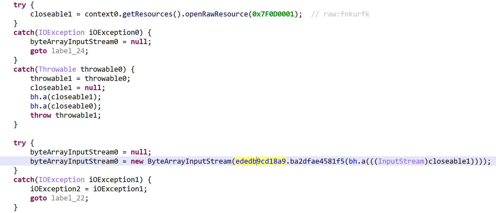
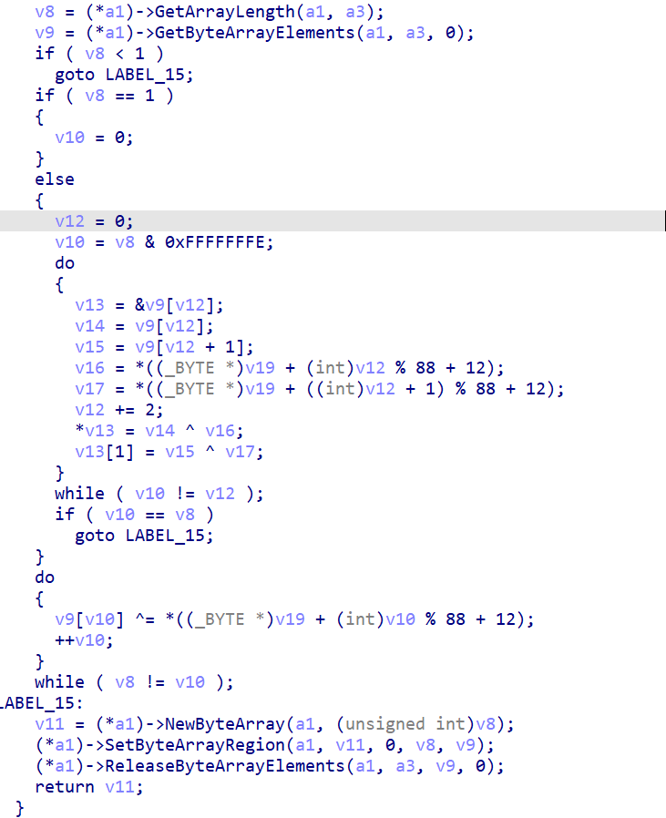

md5： 66273a5b1eb1207be4c828e86f74f9ad

在 jeb 中所有配置文件 fnkurfk 定位到解密函数：



解密为 libqaxdogidyo.so 的 `Java_com_android_apn_common_strings_ededb9cd18a9_ba2dfae4581f5` 方法，对应的解密代码如下：



直接使用 AndroidemuEx 调用对应的解密函数，获取网络配置信息，对应的代码如下：

```python
import os
import posixpath
import zipfile

from loguru import logger
from unicorn import (
    UcError,
)
from unicorn.arm_const import UC_ARM_REG_PC

from androidemu.const import emu_const
from androidemu.emulator import Emulator
from androidemu.java.classes.array import ByteArray


def get_zip_file_binary(zip_path: str, target_file: str) -> bytes:
    """
    获取ZIP包中指定文件的二进制内容
    :param zip_path: ZIP文件路径
    :param target_file: ZIP内目标文件路径（需保持压缩包内的完整路径）
    :return: 文件的二进制数据（bytes）
    """
    with zipfile.ZipFile(zip_path, "r") as zip_ref:
        try:
            for file in zip_ref.infolist():
                if (
                    file.filename.startswith(target_file)
                    and file.file_size < 2048
                ) or (
                    file.filename.startswith(target_file)
                    and file.filename.endswith(".so")
                ):
                    print(file.filename)
                    with zip_ref.open(file.filename, "r") as f:
                        return f.read()
        except KeyError:
            raise FileNotFoundError(f"文件 {target_file} 不在ZIP包中")


if __name__ == "__main__":
    # 初始化emulator
    emulator = Emulator(
        vfs_root=posixpath.join(
            posixpath.dirname(__file__),
            "vfs",
        ),
        arch=emu_const.ARCH_ARM64,
    )

    for dirpath, dirnames, filenames in os.walk("apks"):
        for fname in filenames:
            full_path = os.path.join(dirpath, fname)
            print(full_path)
            lib = get_zip_file_binary(full_path, "lib/arm64-v8a")
            content = get_zip_file_binary(full_path, "res/raw")
            if lib and content:
                so_path = full_path + ".so"
                with open(so_path, "wb") as f:
                    f.write(lib)
                logger.debug("Loaded vfs.")
                # Load all libraries.
                lib_module = emulator.load_library(so_path)

                # androidemu.utils.debug_utils.dump_symbols(emulator, sys.stdout)

                # Show loaded modules.
                logger.info("Loaded modules:")

                for module in emulator.modules:
                    logger.info(
                        "=> 0x%08x - %s" % (module.base, module.filename)
                    )

                try:
                    # Do native stuff.
                    result = emulator.call_symbol(
                        lib_module,
                        "Java_com_android_apn_common_strings_ededb9cd18a9_ba2dfae4581f5",
                        emulator.java_vm.jni_env.address_ptr,
                        0,
                        ByteArray(content),
                    )
                    retult = emulator.java_vm.jni_env.get_local_reference(
                        result
                    )
                    result = retult.value.get_py_items().decode("utf8")
                    logger.info(f"resutl: {result}")
                    out = full_path + ".txt"
                    with open(out, mode="w") as f:
                        f.write(result)
                    # Dump natives found.
                    logger.info("Exited EMU.")
                    logger.info("Native methods registered to MainActivity:")

                except UcError:
                    print("Exit at %x" % emulator.mu.reg_read(UC_ARM_REG_PC))
                    raise
```

参考：

https://www.lookout.com/threat-intelligence/article/hermit-spyware-discovery
