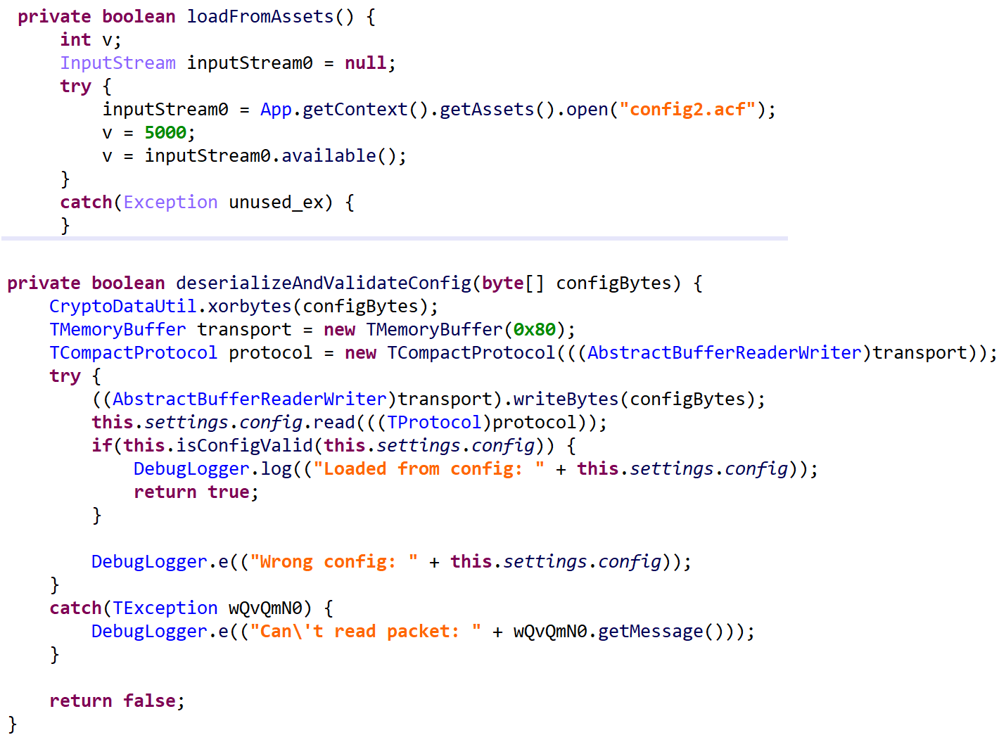

md5: a342b423e0ca57eba3a40311096a4f50

样本通信信息存放在 `assets/config2.acf` 文件中，直接在 jeb 中搜索 `config2.acf` 定位到关键代码：



图片中的方法名已经被修改为可读性更好的名称。

使用 [aistudio](https://aistudio.google.com/prompts/new_chat) 分析解密方式，发现为 [thrift](https://thrift.apache.org/) 协议。

继续让 帮我将上面的代码还原成定义服务(`.thrift` 文件)，然后使用 Thrift 编译器将其编译成对应的 java 代码。

```
/**
 * =================================================================
 *  Thrift IDL for Monokle Agent Configuration
 * =================================================================
 *
 * This file is the complete, reverse-engineered schema from all the
 * provided obfuscated Java classes. It defines the entire data model
 * for agent settings and related structures.
 *
 */

// Define the Java package for the generated code.
namespace java org.ckcat.Monokle

// =================================================================
//  Reusable Type Definitions
// =================================================================

/**
 * A type alias for a binary value, used to represent a
 * Unique Identifier (UID).
 */
typedef binary TUid

// =================================================================
//  Enumerations
// =================================================================

/**
 * An enumeration of supported cipher suites.
 */
enum CipherSuite {
    AES_GCM_128 = 1,
    AES_GCM_256 = 2
}

/**
 * An enumeration of connection security modes for email protocols.
 */
enum EmailSecurityMode {
    NONE = 0,
    SSL_TLS = 1,
    STARTTLS = 2
}

/**
 * An enumeration of agent communication modes.
 */
enum CommunicationMode {
    STANDALONE = 0,
    CLIENT_SERVER = 1,
    EMAIL = 2
}

// =================================================================
//  Component Structures
// =================================================================

/**
 * A compound unique identifier for an agent.
 */
struct AgentUid {
    1: optional TUid packageUid,
    2: optional TUid deviceUid
}

/**
 * Settings for the AES/GCM encryption algorithm.
 */
struct AesGcmSettings {
    1: optional i32 keyLength,
    2: optional binary iv,
    3: optional binary aad
}

/**
 * Settings for RSA-OAEP + AES/GCM hybrid encryption.
 */
struct RsaOaepAesGcmSettings {
    1: optional binary rsaPublicKey,
    2: optional binary wrappedAesKey
}

/**
 * Cryptographic parameters for transport or file encryption.
 * The on-the-wire name is "CryptoParams".
 */
struct CryptoSettings {
    1: optional CipherSuite cipherSuite,
    100: optional AesGcmSettings aesGcm,
    101: optional RsaOaepAesGcmSettings rsaOaepAesGcm
}

/**
 * Represents a basic network socket address.
 * The on-the-wire name is "SocketAddr".
 */
struct SocketAddress {
    1: optional string addr,
    2: optional i32 port,
    3: optional binary certificate
}

/**
 * Defines an endpoint for an email protocol (like POP3 or SMTP).
 * The on-the-wire name is "EmailProtoAddr".
 */
struct EmailProtocolAddress {
    1: optional SocketAddress addr,
    2: optional EmailSecurityMode security
}

/**
 * Represents email communication settings.
 * The on-the-wire name is "CommEmailAddr".
 */
struct EmailAddress {
    1: optional string serverMail,
    2: optional string agentLogin,
    3: optional string agentPassword,
    4: optional EmailProtocolAddress pop3,
    5: optional EmailProtocolAddress smtp
}


// =================================================================
//  Top-Level Agent Settings Structure
// =================================================================

/**
 * The main configuration structure for a Monokle agent.
 * This contains all settings required for the agent's operation.
 */
struct AgentSettings {
    1: optional i32 agentId,
    2: optional i32 period (java.swift.annotations = "DurationSeconds"),
    3: optional i32 wifiPeriod (java.swift.annotations = "DurationSeconds"),
    4: optional SocketAddress socketAddr,
    5: optional EmailAddress emailAddr,
    6: optional list<string> controlPhones,
    7: optional list<string> controlPhrases,
    8: optional CommunicationMode communicationMode,
    9: optional i32 usbTunnelPort,
    10: optional i32 needActivation,
    11: optional CryptoSettings transportCrypto,
    12: optional CryptoSettings fileCrypto,
    13: optional AgentUid agentUid,
    16: optional list<SocketAddress> tcpAddrList,
    17: optional list<SocketAddress> udpAddrList,
    20: optional string dataStore
}
```

生成目标语言的代码：

```bash
$ thrift -r --gen java monokle.thrift
```

最后解析 `assets/config2.acf` 文件，输出如下：

```bash
AgentSettings(agentId:67, period:30, wifiPeriod:30, socketAddr:SocketAddress(addr:109.167.231.10, port:8383, certificate:30 82 02 E4 30 82 01 CC 02 09 00 97 F0 74 6F 5E C5 96 CE 30 0D 06 09 2A 86 48 86 F7 0D 01 01 0B 05 00 30 34 31 0B 30 09 06 03 55 04 06 13 02 58 58 31 0A 30 08 06 03 55 04 08 0C 01 58 31 0A 30 08 06 03 55 04 0A 0C 01 58 31 0D 30 0B 06 03 55 04 03 0C 04 54 45 53 54 30 1E 17 0D 31 37 31 32 31 34 31 32 30 35 30 33 5A 17 0D 32 36 30 33 30 32 31 32 30 35 30 33 5A 30 34 31 0B 30 09 06 03...), emailAddr:EmailAddress(serverMail:, agentLogin:, agentPassword:, pop3:EmailProtocolAddress(addr:SocketAddress(addr:, port:995), security:SSL_TLS), smtp:EmailProtocolAddress(addr:SocketAddress(addr:, port:465), security:SSL_TLS)), controlPhones:[], controlPhrases:[connect, delete, location, newaddress, activate, email, audio], communicationMode:STANDALONE, usbTunnelPort:4091, needActivation:0, transportCrypto:CryptoSettings(cipherSuite:AES_GCM_128, aesGcm:AesGcmSettings()), fileCrypto:CryptoSettings(cipherSuite:AES_GCM_256, rsaOaepAesGcm:RsaOaepAesGcmSettings(rsaPublicKey:30 82 01 22 30 0D 06 09 2A 86 48 86 F7 0D 01 01 01 05 00 03 82 01 0F 00 30 82 01 0A 02 82 01 01 00 CC 49 A6 38 AE D9 FF 1E DC E1 3C 9F 26 81 24 B6 9F B3 55 DA 99 8B BC 7E 8B 3D A3 81 D7 57 52 BE 76 29 38 5A 2A A1 93 7E 1A 1D A5 64 86 88 F3 28 54 98 30 E5 03 1E DD AD 6A F5 FC 0A 57 D8 5E 7B 5A 51 A1 32 F9 62 D7 29 B2 4A FF EA 67 11 A5 DE D3 39 F1 81 AB 6C 85 FD C2 5C 52 40 6F 1B BB..., wrappedAesKey:30 82 04 BF 02 01 00 30 0D 06 09 2A 86 48 86 F7 0D 01 01 01 05 00 04 82 04 A9 30 82 04 A5 02 01 00 02 82 01 01 00 CC 49 A6 38 AE D9 FF 1E DC E1 3C 9F 26 81 24 B6 9F B3 55 DA 99 8B BC 7E 8B 3D A3 81 D7 57 52 BE 76 29 38 5A 2A A1 93 7E 1A 1D A5 64 86 88 F3 28 54 98 30 E5 03 1E DD AD 6A F5 FC 0A 57 D8 5E 7B 5A 51 A1 32 F9 62 D7 29 B2 4A FF EA 67 11 A5 DE D3 39 F1 81 AB 6C 85 FD C2 5C...)))
```

参考：

https://www.lookout.com/documents/threat-reports/lookout-discovers-monokle-threat-report.pdf
