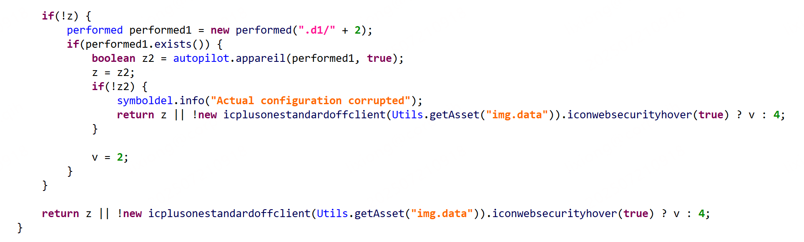
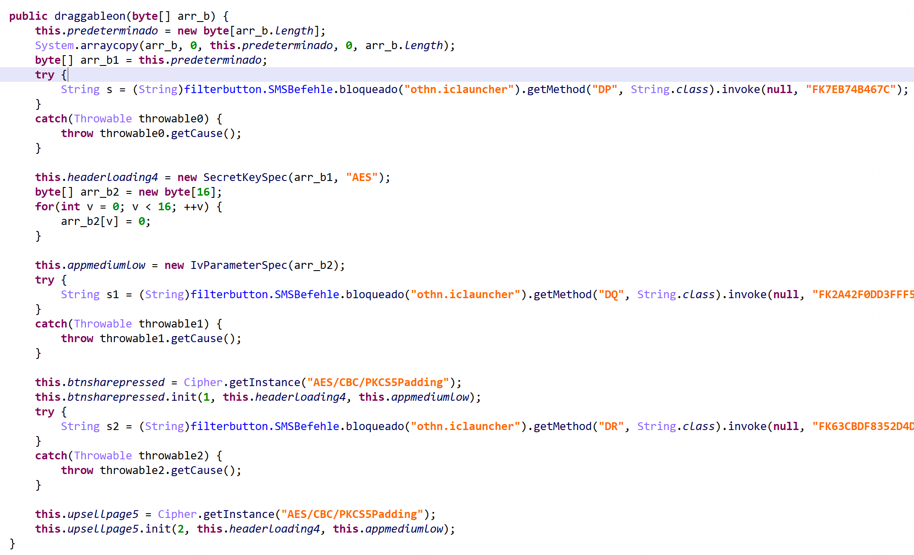

md5： F1E5D0D90F134B24B399145A34CC51B7

样本会释放一个 dex 并动态加载，其中 dex 包含解密配置文件的代码，使用 apktool 将主包和 dex 合并打包到一个 apk 中，方便分析。

使用 dexsim 将样本中的字符串解密，解密插件代码：

```python
import os
import re
import tempfile
from json import JSONEncoder

from colorclass.color import Color
from dexsim import get_value
from dexsim.plugin import Plugin

PLUGIN_CLASS_NAME = "ht1021"

# const-string v0, "FK13406974289BF6"
# goto :goto_16
# :catchall_10
# move-exception v0
# invoke-virtual {v0}, Ljava/lang/Throwable;->getCause()Ljava/lang/Throwable;
# move-result-object v0
# throw v0
# :goto_16
# const/4 v1, 0x1
# :try_start_17
# new-array v1, v1, [Ljava/lang/Object;
# const/4 v2, 0x0
# aput-object v0, v1, v2
# const-string v0, "othn.iclauncher"
# invoke-static {v0}, Lothn/filterbutton$SMSBefehle;->bloqueado(Ljava/lang/String;)Ljava/lang/Class;
# move-result-object v0
# const-string v2, "zf"
# const/4 v3, 0x1
# new-array v3, v3, [Ljava/lang/Class;
# const-class v4, Ljava/lang/String;
# const/4 v5, 0x0
# aput-object v4, v3, v5
# invoke-virtual {v0, v2, v3}, Ljava/lang/Class;->getMethod(Ljava/lang/String;[Ljava/lang/Class;)Ljava/lang/reflect/Method;
# move-result-object v0
# const/4 v2, 0x0
# invoke-virtual {v0, v2, v1}, Ljava/lang/reflect/Method;->invoke(Ljava/lang/Object;[Ljava/lang/Object;)Ljava/lang/Object;
# move-result-object v0
# check-cast v0, Ljava/lang/String;


class ht1021(Plugin):
    name = PLUGIN_CLASS_NAME
    enabled = False
    tname = None
    index = 3

    def __init__(self, driver, smalidir):
        Plugin.__init__(self, driver, smalidir)

    def run(self):
        if self.ONE_TIME:
            return
        self.ONE_TIME = True
        print('Run ' + __name__, end=' ', flush=True)

        regex = (
            r'const-string v\d, "(FK[A-Z0-9]+?)"[\s\S]*?'
            r'new-array v\d, v\d, \[Ljava/lang/Object;\s+?'
            r'const/4 v\d, 0x\d+?\s+?'
            r'aput-object v\d, v\d, v\d\s+?'
            r'const-string v\d, "(.*?)"\s+?'
            r'invoke-static {v\d}, Lothn/filterbutton\$SMSBefehle;->bloqueado\(Ljava/lang/String;\)Ljava/lang/Class;\s+?'
            r'move-result-object v\d\s+?'
            r'const-string v\d, "(\w+?)"\s+?'
            r'const/4 v\d, 0x\d\s+?'
            r'new-array v\d, v\d, \[Ljava/lang/Class;\s+?'
            r'const-class v\d, Ljava/lang/String;\s+?'
            r'const/4 v\d, 0x\d\s+?'
            r'aput-object v\d, v\d, v\d\s+?'
            r'invoke-virtual {v\d, v\d, v\d}, Ljava/lang/Class;->getMethod\(Ljava/lang/String;\[Ljava/lang/Class;\)Ljava/lang/reflect/Method;\s+?'
            r'move-result-object v\d\s+?const/4 v\d, 0x\d\s+?'
            r'invoke-virtual {v\d, v\d, v\d}, Ljava/lang/reflect/Method;->invoke\(Ljava/lang/Object;\[Ljava/lang/Object;\)Ljava/lang/Object;\s+?'
            r'move-result-object v\d\s+?'
            r'check-cast (v\d), Ljava/lang/String;\s+?'
            r':try_end_\w+?\s+?'
            r'\.catchall {:try_start_\w+? \.\. :try_end_\w+?} :catchall_\w+?\s'
        )

        ptn = re.compile(regex, re.MULTILINE)
        for sf in self.smalidir:
            for mtd in sf.get_methods():
                self._process_mtd(mtd, ptn)

        self.decode()

    def _process_mtd(self, mtd, ptn):
        # if get_value('DEBUG_MODE'):
        #     print('\n', '+' * 80)
        #     print('Starting to decode ...')
        #     print(Color.green(mtd))

        body = mtd.get_body()

        for item in ptn.finditer(body):
            old_content = item.group()  # 匹配到的内容，用来替换
            arg, cname, mname, rtn_name = item.groups()
            # print("class, method, ret, arg:", cname, mname, rtn_name, arg)
            arguments = ['java.lang.String:' + arg]
            json_item = self.get_json_item(cname, mname, arguments)
            self.append_json_item(json_item, mtd, old_content, rtn_name)

    def decode(self):
        if not self.json_list or not self.target_contexts:
            return

        jsons = JSONEncoder().encode(self.json_list)

        outputs = {}
        with tempfile.NamedTemporaryFile(mode='w+', delete=False) as tfile:
            tfile.write(jsons)
        outputs = self.driver.decode(tfile.name)
        os.unlink(tfile.name)

        if not outputs:
            return

        for key, value in outputs.items():
            if key not in self.target_contexts:
                print(key, value, "not in")
                continue
            for mtd, old_content, new_content in self.target_contexts[key]:
                old_body = mtd.get_body()
                new_content = old_content + "\n" + new_content.format(value[0])
                print(new_content)
                body = old_body.replace(old_content, new_content)
                mtd.set_body(body)
                self.make_changes = True
                mtd.set_modified(True)


        self.smali_files_update()
```

在 jeb 中搜索 `img.data` 即可找到解密的关键位置：



最终会定位到下面代码：



代码中的反射调用都是花指令，忽略即可，最后使用 python 实现相应的解密算法：

```python
# 安装: pip install pycryptodome
from Crypto.Cipher import AES
from Crypto.Util.Padding import pad, unpad


class AESCipherSuitePyCrypto:
    """
    一个使用 pycryptodome 实现的、易于理解的 AES 加密/解密套件。
    """

    def __init__(self, key: bytes):
        if len(key) not in [16, 24, 32]:
            raise ValueError("无效的密钥长度。密钥必须是 16, 24, 或 32 字节。")

        self._secret_key = key
        # 同样，为了匹配原始代码，使用静态的全零IV。
        self._initialization_vector = b"\x00" * 16

    def encrypt(self, plaintext: bytes) -> bytes:
        """加密给定的字节数据。"""
        # 创建一个专用于本次加密的密码器
        cipher = AES.new(self._secret_key, AES.MODE_CBC, self._initialization_vector)
        # 添加填充并加密
        ciphertext = cipher.encrypt(pad(plaintext, AES.block_size))
        return ciphertext

    def decrypt(self, ciphertext: bytes) -> bytes:
        """解密给定的字节数据。"""
        # 创建一个专用于本次解密的密码器
        cipher = AES.new(self._secret_key, AES.MODE_CBC, self._initialization_vector)
        # 解密并移除填充
        plaintext = unpad(cipher.decrypt(ciphertext), AES.block_size)
        return plaintext


if __name__ == "__main__":
    with open("rb.data", mode="rb") as f:
        data = f.read()
    encryption_key = data[46 : 46 + 16]
    print(len(encryption_key))
    print(encryption_key)

    try:
        cipher_suite_decrypt = AESCipherSuitePyCrypto(encryption_key)
        with open("img.data", mode="rb") as f:
            encrypted_data = f.read()
        decrypted_data = cipher_suite_decrypt.decrypt(encrypted_data)
        print(decrypted_data[:-20])
    except ValueError as e:
        print(f"发生错误: {e}")
        print("请确保您的密钥长度是16、24或32字节。")
```

`img.data` 和 `rb.data` 位于 assets 目录。
